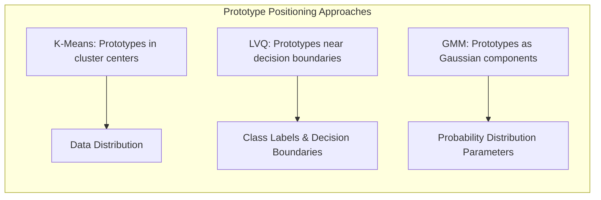
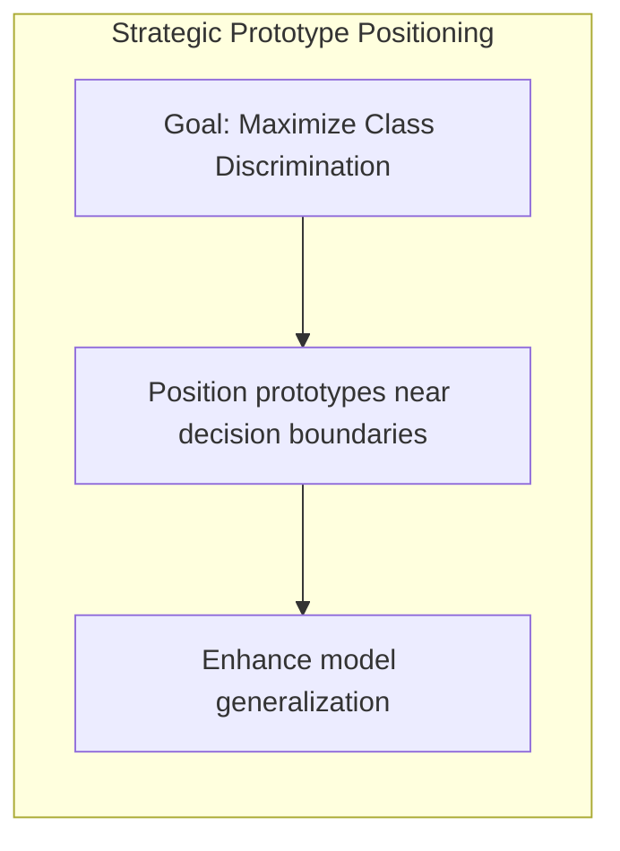
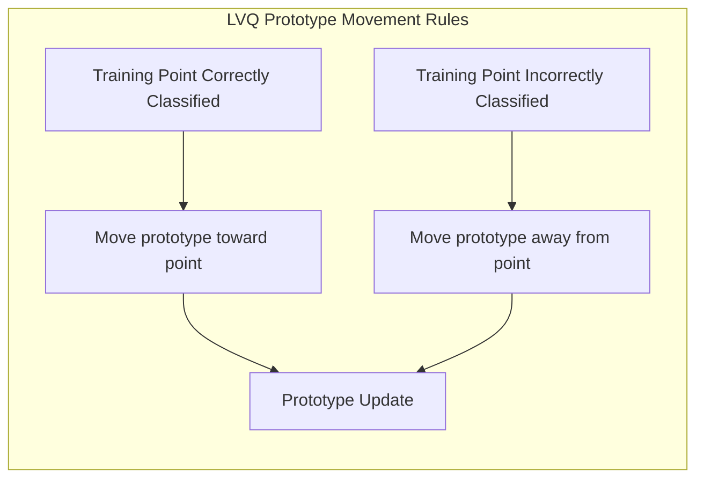
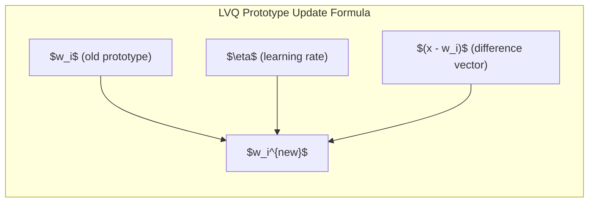
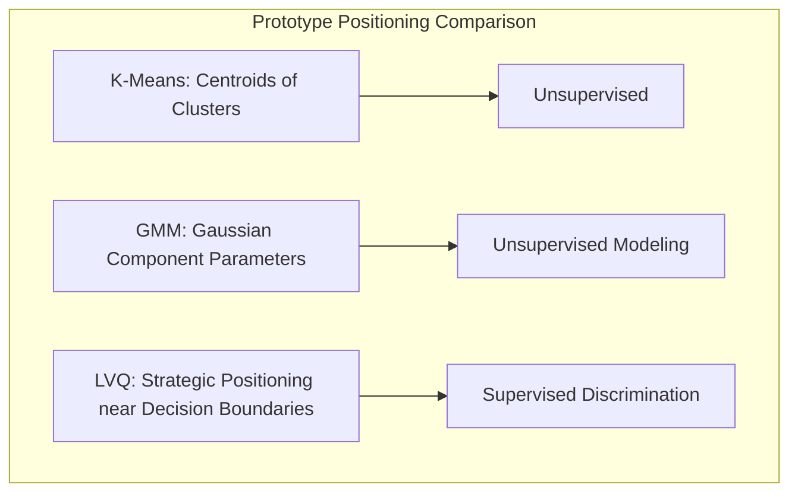

## Posicionamento Estratégico de Protótipos: Aprendizado Guiado pelos Dados de Treinamento

### Introdução

Este capítulo explora o conceito de **posicionamento estratégico de protótipos** no contexto de métodos *model-free* para classificação, com ênfase em como os protótipos são movidos e ajustados no espaço de *features* com base nos dados de treinamento [^13.2.2]. Enquanto o K-Means posiciona protótipos nos centros de *clusters* de dados, métodos como o LVQ (Learning Vector Quantization) utilizam informações sobre os rótulos das classes para mover os protótipos em regiões estratégicas, próximas às fronteiras de decisão. Analisaremos como o posicionamento estratégico de protótipos melhora a capacidade de discriminação entre as classes e, consequentemente, o desempenho do modelo de classificação. Compararemos diferentes abordagens, com foco em como o LVQ se destaca por sua capacidade de ajustar iterativamente os protótipos com base nos dados de treinamento.

### O Posicionamento Estratégico: Uma Vantagem dos Métodos de Protótipos

O **posicionamento estratégico de protótipos** é uma característica fundamental de alguns métodos de classificação baseados em protótipos, que visa posicionar os protótipos de forma a melhor representar a distribuição dos dados e, principalmente, as fronteiras de decisão entre as classes [^13.2.2]. Ao contrário do K-Means, que posiciona protótipos nos centros dos *clusters* de dados, métodos como o LVQ utilizam informações sobre os rótulos das classes para mover os protótipos em regiões estratégicas do espaço de *features*.

O objetivo do posicionamento estratégico é criar protótipos que não apenas representem a distribuição de cada classe, mas também que sejam capazes de discriminar entre as classes de forma eficaz. Isso significa que os protótipos devem ser posicionados próximos às fronteiras de decisão, onde a separação entre as classes é mais crítica. Um bom posicionamento dos protótipos leva a modelos de classificação com melhor capacidade de generalização.

**Lemma 43:** O posicionamento estratégico dos protótipos busca maximizar a capacidade de discriminação entre as classes, posicionando os protótipos em regiões que representem as principais características das distribuições das classes e suas fronteiras de decisão.
*Prova*: A localização dos protótipos próximos à região onde as classes se interceptam e a movimentação de protótipos guiados pelos rótulos dos dados de treino levam a um melhor ajuste das fronteiras de decisão. $\blacksquare$

**Corolário 43:** O posicionamento estratégico dos protótipos pode levar a modelos de classificação mais precisos e eficientes do que aqueles que posicionam os protótipos de forma aleatória ou não supervisionada.

> 💡 **Exemplo Numérico:**
> Imagine um problema de classificação com duas classes, representadas por pontos em um espaço bidimensional. Os pontos da classe A se concentram em torno de (1, 1) e os da classe B em torno de (3, 3).
>
> * **K-Means:** Se usarmos o K-Means com dois protótipos, eles provavelmente se posicionariam em (1,1) e (3,3) respectivamente, centrados nas nuvens de pontos.
> * **LVQ:** Com o LVQ, os protótipos poderiam começar em posições aleatórias. Se o protótipo da classe A estivesse em (1.5, 1.5) e o protótipo da classe B em (2.5, 2.5), o LVQ, ao ser treinado, moveria o protótipo da classe A mais para a região de (1,1), e o da classe B mais para (3,3), refinando o posicionamento em direção às fronteiras.
>
> Este exemplo ilustra como o LVQ, ao usar as informações dos rótulos, move os protótipos para regiões mais discriminativas, enquanto o K-Means apenas encontra os centros de cada *cluster*.

> ⚠️ **Nota Importante**: O posicionamento estratégico de protótipos é uma característica chave de alguns métodos de protótipos que os diferencia do K-Means e permite modelar fronteiras de decisão complexas com maior precisão.

> ❗ **Ponto de Atenção**: A busca pelo posicionamento estratégico de protótipos envolve o uso de informações sobre os rótulos das classes, o que torna esses métodos supervisionados.

### O LVQ: Posicionamento Estratégico Guiado pelos Dados de Treinamento

O **LVQ (Learning Vector Quantization)** é um método de protótipos que se destaca por sua capacidade de ajustar iterativamente o posicionamento dos protótipos com base nos dados de treinamento [^13.2.2]. O LVQ começa com uma inicialização dos protótipos (que pode ser aleatória ou usar os resultados de um algoritmo como o K-Means) e, em seguida, move os protótipos em resposta a cada ponto de treinamento.

A movimentação dos protótipos é realizada com base nas seguintes regras:

1.  **Protótipos da mesma classe:** Se um ponto de treinamento é corretamente classificado pelo protótipo mais próximo (ou seja, ambos têm o mesmo rótulo de classe), o protótipo é movido em direção ao ponto de treinamento.
2.  **Protótipos de classes diferentes:** Se um ponto de treinamento é incorretamente classificado pelo protótipo mais próximo (ou seja, eles têm rótulos de classe diferentes), o protótipo é movido em direção oposta ao ponto de treinamento.

O valor do passo da movimentação é definido por um parâmetro chamado taxa de aprendizado, que é um hiperparâmetro do modelo. Essa abordagem iterativa faz com que os protótipos LVQ se posicionem estrategicamente perto das regiões de decisão entre as classes.

**Lemma 44:** O LVQ usa informações sobre o rótulo de classe de cada ponto de treinamento para ajustar iterativamente a posição dos protótipos, criando protótipos discriminativos que melhor separam as classes.
*Prova*: Ao atrair protótipos de mesma classe e repelir protótipos de classes diferentes, o LVQ busca criar um conjunto de protótipos posicionados perto das fronteiras de decisão entre as classes. $\blacksquare$

**Corolário 44:** A taxa de aprendizado (learning rate) do LVQ é um hiperparâmetro crucial que controla a velocidade com que os protótipos são movidos, e deve ser ajustada para garantir a convergência e um desempenho ótimo do modelo.

> 💡 **Exemplo Numérico:**
>
> Considere um problema de classificação binária com duas classes, A e B. Temos dois protótipos, $w_A$ para a classe A e $w_B$ para a classe B. Suponha que a taxa de aprendizado $\eta = 0.1$.
>
> 1.  **Inicialização:**  $w_A = [1, 1]$ e $w_B = [3, 3]$.
> 2.  **Ponto de treinamento:** Um ponto $x = [1.2, 1.3]$ com rótulo A.
> 3.  **Classificação:** A distância entre $x$ e $w_A$ é menor que a distância entre $x$ e $w_B$, então $x$ é corretamente classificado.
> 4.  **Atualização de $w_A$:**
>     $w_A^{new} = w_A + \eta(x - w_A) = [1, 1] + 0.1([1.2, 1.3] - [1, 1]) = [1, 1] + 0.1[0.2, 0.3] = [1.02, 1.03]$
> 5.  **Outro ponto de treinamento:** Um ponto $y = [2.8, 2.9]$ com rótulo B.
> 6.  **Classificação:** A distância entre $y$ e $w_B$ é menor que a distância entre $y$ e $w_A$, então $y$ é corretamente classificado.
> 7.  **Atualização de $w_B$:**
>     $w_B^{new} = w_B + \eta(y - w_B) = [3, 3] + 0.1([2.8, 2.9] - [3, 3]) = [3, 3] + 0.1[-0.2, -0.1] = [2.98, 2.99]$
>
> Note que $w_A$ se moveu em direção ao ponto de treinamento da classe A e $w_B$ em direção ao ponto de treinamento da classe B. Se um ponto fosse incorretamente classificado, o protótipo se moveria na direção oposta. Este processo se repete para todos os pontos de treinamento até que os protótipos se estabilizem.

> ⚠️ **Nota Importante**: O LVQ utiliza um processo de aprendizado supervisionado para ajustar o posicionamento dos protótipos com base nos dados de treinamento e rótulos de classe, permitindo que os protótipos se movam para regiões estratégicas do espaço de *features*.

> ❗ **Ponto de Atenção**: O LVQ é um algoritmo sensível a *outliers*, e o uso de técnicas de pré-processamento de dados é importante para garantir a estabilidade do aprendizado.

### Comparação com o Posicionamento de Protótipos no K-Means e em GMMs

O posicionamento de protótipos no **K-Means** é diferente do LVQ, pois o K-Means busca encontrar os centros dos *clusters* de dados sem usar as informações sobre o rótulo das classes [^13.2.1]. O K-Means posiciona os protótipos (centros dos *clusters*) no centro das regiões de dados, o que pode não ser ideal para classificar novos pontos, especialmente se as classes se sobrepõem ou se suas fronteiras de decisão não são lineares.

Nas **GMMs (Misturas Gaussianas)**, os protótipos são representados pelos parâmetros das componentes gaussianas (média e covariância), que são ajustados pelo algoritmo EM para modelar a distribuição dos dados de cada classe [^13.2.3]. Embora as GMMs possam modelar formas complexas nas distribuições dos dados, elas não posicionam os protótipos especificamente para otimizar a discriminação entre as classes. O algoritmo EM busca, acima de tudo, a máxima verossimilhança dos parâmetros.

Em comparação com o K-Means e as GMMs, o LVQ se destaca por sua capacidade de mover os protótipos em resposta aos rótulos de classe dos dados de treinamento, o que permite posicioná-los de forma estratégica perto das fronteiras de decisão. Essa característica torna o LVQ uma abordagem mais eficaz para classificação do que as outras duas técnicas.

**Lemma 45:** Enquanto o K-Means posiciona os protótipos nos centros das regiões de dados e as GMMs modelam as distribuições, o LVQ move os protótipos guiado pelo objetivo de melhorar a capacidade de discriminação entre as classes.
*Prova*: A natureza iterativa do LVQ com a movimentação dos protótipos em direção ou afastamento dos dados com rótulos corretos ou incorretos, faz com que os protótipos se posicionem estrategicamente perto das fronteiras de decisão. $\blacksquare$

**Corolário 45:** O LVQ oferece uma abordagem supervisionada para o posicionamento estratégico de protótipos, ao contrário do K-Means e das GMMs, que não utilizam informações sobre os rótulos das classes para ajustar o posicionamento dos protótipos.

> 💡 **Exemplo Numérico:**
>
> Imagine um cenário com dados de duas classes, A e B, onde:
>
> *   **Classe A:** Dados distribuídos em torno de (1,1) com uma pequena variância.
> *   **Classe B:** Dados distribuídos em torno de (3,3) com uma pequena variância.
>
> 1.  **K-Means:** Se aplicarmos K-Means com dois *clusters*, os protótipos se posicionarão aproximadamente nos centros das nuvens de pontos, ou seja, perto de (1,1) e (3,3).
> 2.  **GMM:** Uma GMM com duas componentes gaussianas modelará a distribuição de cada classe. As médias das gaussianas se aproximarão de (1,1) e (3,3), e as matrizes de covariância descreverão a forma das distribuições.
> 3.  **LVQ:** O LVQ iniciará com protótipos em posições possivelmente aleatórias. Durante o treinamento, os protótipos da classe A serão atraídos para a região de (1,1), enquanto os protótipos da classe B serão atraídos para a região de (3,3). Se as regiões se sobrepõem, o LVQ ajustará os protótipos para melhor separar as classes, mesmo que isso signifique que não estejam exatamente nos centros dos *clusters*, mas sim perto da fronteira de decisão.
>
> Este exemplo demonstra que o LVQ ajusta os protótipos para classificação, enquanto K-Means e GMM focam em modelar a distribuição dos dados.

> ⚠️ **Nota Importante**: O LVQ utiliza os rótulos das classes para posicionar estrategicamente os protótipos, o que resulta em uma melhor capacidade discriminatória, em relação ao K-Means e GMMs.

> ❗ **Ponto de Atenção**: A escolha entre K-Means, LVQ e GMMs depende da natureza do problema e do objetivo principal, sendo o LVQ mais adequado para problemas de classificação supervisionada.

### Conclusão

O posicionamento estratégico de protótipos é um conceito fundamental em métodos de classificação *model-free* que visa posicionar os protótipos em regiões do espaço de *features* que maximizem a capacidade de discriminação entre as classes. O LVQ se destaca por sua capacidade de ajustar iterativamente o posicionamento dos protótipos com base nos dados de treinamento e nos rótulos de classe, permitindo que os protótipos capturem as características essenciais das distribuições e fronteiras de decisão de forma eficiente. Ao contrário do K-Means, que se baseia na estrutura dos dados sem levar em conta os rótulos, e das GMMs, que modelam a distribuição de classes, o LVQ foca em criar um conjunto menor de protótipos que se adaptam para a realização da classificação.

### Footnotes

[^13.2.2]: "In this technique due to Kohonen (1989), prototypes are placed strategically with respect to the decision boundaries in an ad-hoc way. LVQ is an online algorithm-observations are processed one at a time. The idea is that the training points attract prototypes of the correct class, and repel other prototypes. When the iterations settle down, prototypes should be close to the training points in their class." *(Trecho de "13. Prototype Methods and Nearest-Neighbors")*

[^13.2.1]: "K-means clustering is a method for finding clusters and cluster centers in a set of unlabeled data...To use K-means clustering for classification of labeled data, the steps are: apply K-means clustering to the training data in each class separately, using R prototypes per class; assign a class label to each of the K × R prototypes; classify a new feature x to the class of the closest prototype." *(Trecho de "13. Prototype Methods and Nearest-Neighbors")*

[^13.2.3]: "The Gaussian mixture model can also be thought of as a prototype method, similar in spirit to K-means and LVQ...Each cluster is described in terms of a Gaussian density, which has a centroid (as in K-means), and a covariance matrix...when Gaussian mixture models are used to represent the feature density in each class, it produces smooth posterior probabilities." *(Trecho de "13. Prototype Methods and Nearest-Neighbors")*
