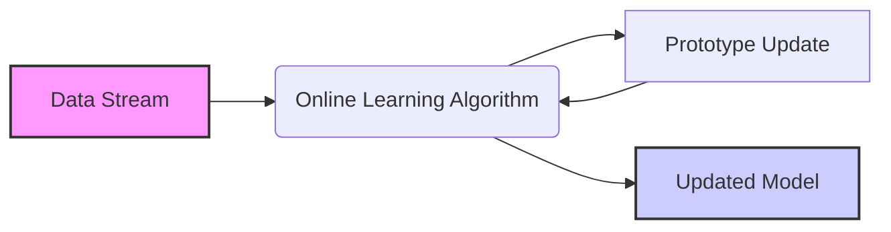
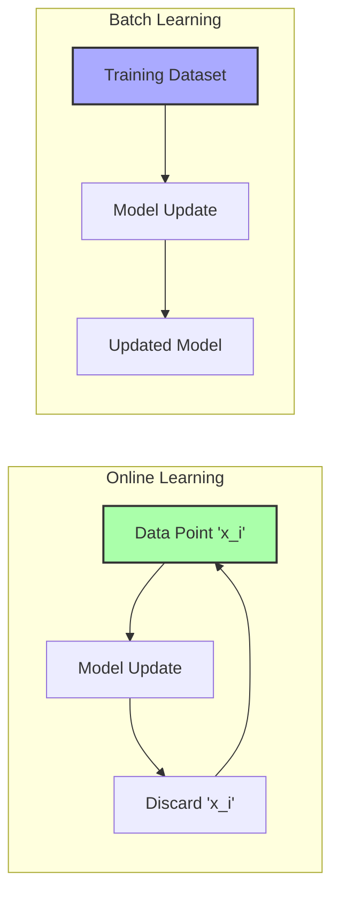
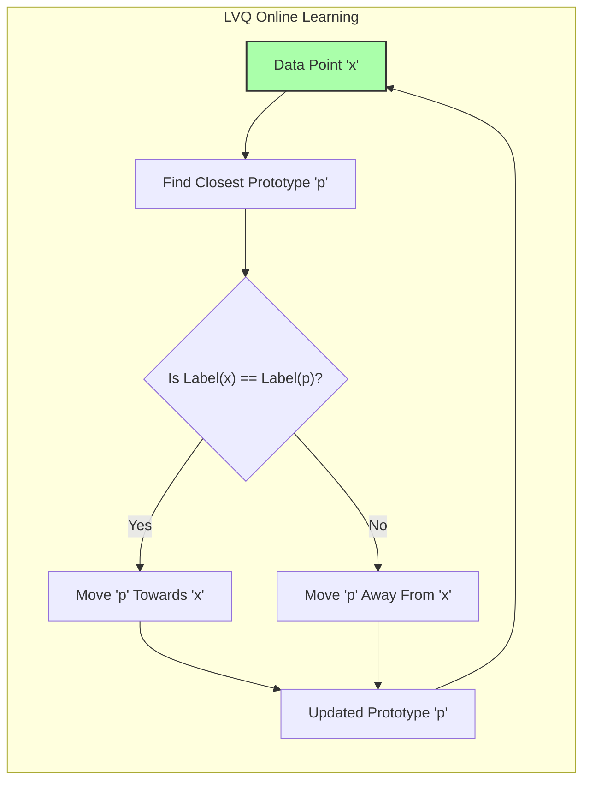
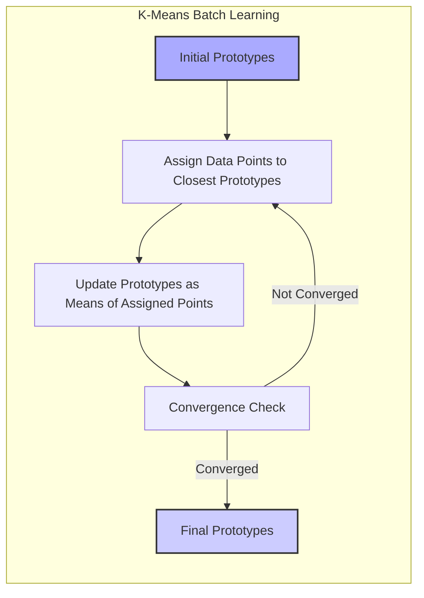
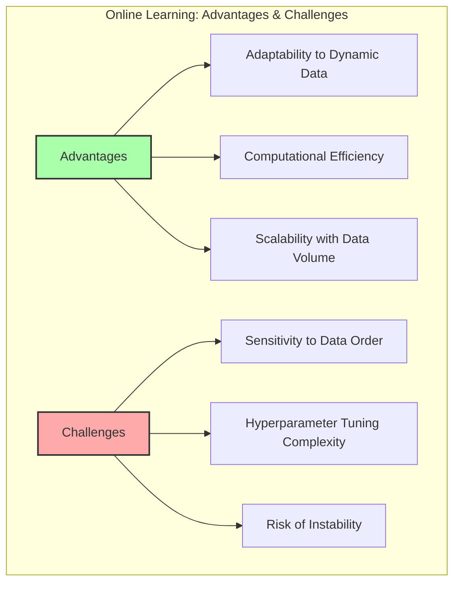

## Métodos de Aprendizado *Online*: Atualização de Protótipos por Observação Individual

### Introdução

Este capítulo explora o conceito de **aprendizado *online***, um paradigma de aprendizado de máquina em que os dados são processados um ponto (observação) de cada vez, e os protótipos são atualizados de forma incremental, em contraste com o processamento em lote [^13.2.2]. Métodos de aprendizado *online* são particularmente úteis em cenários onde os dados são recebidos de forma contínua ou quando o conjunto de dados é muito grande para ser armazenado completamente na memória. Analisaremos como algoritmos como o LVQ (Learning Vector Quantization) utilizam o aprendizado *online* para ajustar os protótipos com base em cada observação individual, e como esse paradigma de aprendizado difere das abordagens de processamento em lote como o K-Means. Discutiremos também as vantagens e desafios do aprendizado *online*, e como ele se adapta a ambientes dinâmicos e com grandes volumes de dados.

### Aprendizado *Online*: Processamento de Dados Observação a Observação

O **aprendizado *online*** é um paradigma de aprendizado de máquina em que o modelo é atualizado incrementalmente com base em cada observação de dados individual, em vez de esperar para processar um lote completo de dados. Em um ambiente *online*, o modelo recebe um novo ponto de dados, realiza uma atualização e descarta essa observação. Esse processo se repete com cada nova observação.

Essa abordagem difere dos métodos de **aprendizado em lote** (*batch learning*), onde todo o conjunto de dados de treinamento é utilizado para ajustar o modelo de uma só vez. Métodos de aprendizado *online* são especialmente adequados para cenários onde os dados são recebidos de forma contínua (ex: fluxos de dados), ou quando o conjunto de dados é muito grande para ser armazenado completamente na memória, o que torna o aprendizado em lote impraticável.

No contexto de métodos baseados em protótipos, o aprendizado *online* significa que os protótipos são atualizados com base em cada observação de treinamento individual, em vez de serem ajustados após o processamento de todo o conjunto de dados. Essa abordagem permite que os protótipos se adaptem de forma mais dinâmica às mudanças nas distribuições dos dados.

**Lemma 46:** O aprendizado *online* permite que o modelo se adapte continuamente às novas informações, o que o torna mais adequado para lidar com dados dinâmicos e grandes conjuntos de dados.
*Prova*: Ao atualizar o modelo a cada observação, o modelo incorpora novas informações de forma imediata, sem necessitar de processar todo o conjunto de dados novamente. $\blacksquare$

**Corolário 46:** O aprendizado *online* tem complexidade computacional constante para cada observação, o que o torna mais eficiente do que o aprendizado em lote para grandes conjuntos de dados.

> 💡 **Exemplo Numérico:**
> Imagine um modelo de classificação de spam por e-mail. Em um cenário de aprendizado *online*, cada novo e-mail recebido é usado para atualizar o modelo imediatamente. Se um e-mail é classificado incorretamente, o modelo se ajusta para melhorar a classificação de e-mails semelhantes no futuro. Em contraste, um modelo de aprendizado em lote precisaria de um grande conjunto de e-mails rotulados para ser treinado novamente, consumindo mais tempo e recursos. Se a complexidade para cada observação é $O(1)$, o tempo de processamento para 1000 e-mails é 1000 vezes o tempo de processamento de 1 email.

> ⚠️ **Nota Importante**:  No aprendizado *online*, os dados são processados um a um, e o modelo é atualizado de forma incremental com base em cada observação, sem armazenar todo o conjunto de dados.

> ❗ **Ponto de Atenção**:  Métodos de aprendizado *online* são adequados para cenários onde os dados são recebidos de forma contínua ou quando o conjunto de dados é muito grande para ser processado em lote.

### LVQ: Aprendizado *Online* para Posicionar Protótipos

O **LVQ (Learning Vector Quantization)** é um algoritmo de aprendizado *online* que ajusta o posicionamento dos protótipos com base em cada observação de treinamento individual [^13.2.2]. O algoritmo começa com uma inicialização dos protótipos (que pode ser aleatória ou usando os resultados de um algoritmo como o K-Means) e, em seguida, processa cada ponto de treinamento um de cada vez.

Para cada ponto de treinamento, o LVQ executa os seguintes passos:

1.  **Identificação do Protótipo Mais Próximo:** O protótipo mais próximo do ponto de treinamento é identificado usando a distância Euclidiana.
2.  **Atualização do Protótipo:** O protótipo mais próximo é atualizado com base no rótulo de classe do ponto de treinamento e do protótipo.
    * Se o rótulo do protótipo coincide com o do ponto de treinamento, o protótipo é movido em direção ao ponto de treinamento.
    * Se o rótulo do protótipo não coincide com o do ponto de treinamento, o protótipo é movido em direção oposta ao ponto de treinamento.

O tamanho do passo da movimentação é controlado por um parâmetro chamado taxa de aprendizado (*learning rate*), que é tipicamente decrescente ao longo do tempo para garantir a convergência.

**Lemma 47:** O LVQ utiliza aprendizado *online* para ajustar os protótipos, adaptando-os aos dados de treinamento um ponto de cada vez, de forma a criar um conjunto de protótipos que sejam representativos das distribuições das classes.
*Prova*: Ao processar um dado por vez, o LVQ incorpora cada ponto de forma incremental, o que garante que os protótipos se adaptem de forma dinâmica aos dados. $\blacksquare$

**Corolário 47:** A taxa de aprendizado do LVQ deve decrescer com o tempo para garantir que os protótipos não oscilem, e se estabilizem em uma solução adequada.

> 💡 **Exemplo Numérico:**
> Considere um problema de classificação binária com duas classes, onde temos dois protótipos, $p_1$ para a classe 1 e $p_2$ para a classe 2. Vamos considerar um novo ponto de dados $x = [2, 3]$ com rótulo de classe 1. Suponha que os protótipos iniciais sejam $p_1 = [1, 1]$ e $p_2 = [4, 4]$.
>
> **Passo 1: Identificação do Protótipo Mais Próximo**
> Calculamos a distância Euclidiana entre $x$ e cada protótipo:
>
> $d(x, p_1) = \sqrt{(2-1)^2 + (3-1)^2} = \sqrt{1 + 4} = \sqrt{5} \approx 2.24$
>
> $d(x, p_2) = \sqrt{(2-4)^2 + (3-4)^2} = \sqrt{4 + 1} = \sqrt{5} \approx 2.24$
>
> Neste caso, ambos os protótipos estão à mesma distância de $x$. Suponhamos que $p_1$ seja escolhido como o mais próximo (na prática, pode ser o primeiro encontrado).
>
> **Passo 2: Atualização do Protótipo**
> Como o rótulo de $x$ (classe 1) coincide com o rótulo de $p_1$, atualizamos $p_1$ com uma taxa de aprendizado $\alpha = 0.1$:
>
> $p_1^{novo} = p_1 + \alpha (x - p_1) = [1, 1] + 0.1([2, 3] - [1, 1]) = [1, 1] + 0.1[1, 2] = [1.1, 1.2]$
>
> O protótipo $p_1$ se moveu em direção ao ponto de dados $x$. Se o rótulo fosse diferente, $p_1$ se moveria na direção oposta. Este processo se repete para cada ponto de dados, ajustando os protótipos.
>
> A taxa de aprendizado $\alpha$ diminuiria a cada iteração. Por exemplo, se o próximo ponto de dado fosse $x = [3, 2]$ com rótulo de classe 2, e $p_2$ fosse o protótipo mais próximo, a atualização moveria $p_2$ em direção a $x$ se o rótulo de $p_2$ fosse 2, ou se afastaria caso o rótulo fosse diferente.

> ⚠️ **Nota Importante**:  O LVQ é um algoritmo de aprendizado *online*, onde os protótipos são atualizados com base em cada observação de treinamento, de forma iterativa e incremental.

> ❗ **Ponto de Atenção**: A taxa de aprendizado é um hiperparâmetro importante do LVQ, que precisa ser ajustado para garantir a convergência e evitar *overfitting*.

### Comparação com Métodos em Lote (K-Means)

Em contraste com o LVQ, o **K-Means** é um algoritmo de **aprendizado em lote** [^13.2.1]. No K-Means, todo o conjunto de dados de treinamento é utilizado para calcular os centros dos *clusters* e atribuir os pontos a esses *clusters*. O algoritmo itera entre a atribuição de pontos aos centros de *clusters* mais próximos e a atualização dos centros dos *clusters* com base na média dos pontos a eles atribuídos, até que a convergência seja atingida.

A principal diferença entre o K-Means e o LVQ reside na forma como os dados são processados e como os protótipos são atualizados. No K-Means, a atualização dos centros de *clusters* é realizada apenas após o processamento de todos os pontos de dados. No LVQ, os protótipos são atualizados a cada observação, o que permite que o modelo se adapte de forma mais dinâmica às mudanças na distribuição dos dados.

O K-Means é mais adequado para cenários onde o conjunto de dados pode ser armazenado completamente na memória, e os dados não mudam muito ao longo do tempo. O LVQ, por outro lado, é mais adequado para cenários com grandes conjuntos de dados e/ou distribuições de dados dinâmicas, onde a atualização *online* dos protótipos é essencial.

**Lemma 48:** O K-Means é um algoritmo de aprendizado em lote, enquanto o LVQ é um algoritmo de aprendizado *online*, e suas escolhas devem considerar se o modelo deve se adaptar de forma dinâmica e incremental aos dados ou se uma abordagem em lote é suficiente.
*Prova*: O K-Means itera as etapas de atribuição e atualização até convergir, o que requer que todo o conjunto de dados seja processado a cada iteração, enquanto o LVQ processa um ponto de cada vez e atualiza o modelo. $\blacksquare$

**Corolário 48:** O LVQ, com sua abordagem *online*, é mais adequado para conjuntos de dados grandes ou com características que variam ao longo do tempo.

> 💡 **Exemplo Numérico:**
> Considere um conjunto de dados com 1000 pontos. No K-Means, para atualizar os centros dos *clusters* (protótipos), é necessário calcular a média de todos os pontos atribuídos a cada *cluster* após uma iteração completa sobre todos os 1000 pontos.
>
> No LVQ, a cada um dos 1000 pontos, o protótipo mais próximo é atualizado imediatamente, sem precisar esperar o processamento de todos os pontos. Essa diferença é crucial em conjuntos de dados maiores ou quando os dados chegam de forma contínua.
>
> Suponha que temos dois *clusters*, e na iteração atual do K-Means, 400 pontos foram atribuídos ao primeiro *cluster* e 600 ao segundo. Para atualizar o centro do primeiro *cluster*, o K-Means calcula a média das coordenadas de todos os 400 pontos. De forma semelhante, calcula a média dos 600 pontos para o segundo cluster.
>
> Em contraste, o LVQ atualiza o protótipo mais próximo a cada novo ponto, sem calcular médias sobre conjuntos de pontos.

> ⚠️ **Nota Importante**: O K-Means é um algoritmo de aprendizado em lote, onde todo o conjunto de dados é usado para ajustar os protótipos, enquanto o LVQ usa um aprendizado *online*, com atualização dos protótipos a cada nova observação.

> ❗ **Ponto de Atenção**: A escolha entre aprendizado em lote e aprendizado *online* depende da natureza dos dados, da necessidade de adaptação contínua aos dados e dos requisitos de desempenho computacional.

### Vantagens e Desafios do Aprendizado *Online*

O aprendizado *online* oferece diversas vantagens:

1.  **Adaptabilidade:** Os modelos de aprendizado *online* podem se adaptar de forma dinâmica a mudanças na distribuição dos dados, o que os torna adequados para ambientes dinâmicos ou não estacionários.
2.  **Eficiência Computacional:** O processamento *online* dos dados torna o aprendizado mais eficiente para grandes conjuntos de dados, pois não é necessário armazenar e processar todo o conjunto de dados em lote.
3.  **Escalabilidade:** Métodos *online* são escaláveis, pois a complexidade do aprendizado é constante para cada observação, permitindo processar dados em fluxo ou conjuntos de dados muito grandes.

No entanto, o aprendizado *online* também apresenta desafios:

1.  **Sensibilidade à Ordem dos Dados:** O aprendizado *online* pode ser sensível à ordem em que os dados são apresentados ao modelo, pois o modelo se ajusta de forma incremental a cada observação.
2.  **Necessidade de Ajuste de Hiperparâmetros:** A escolha adequada de hiperparâmetros como a taxa de aprendizado pode ser mais difícil em modelos *online*, pois a convergência pode ser afetada pela ordem em que os dados são processados.
3.  **Risco de Instabilidade:** Se a taxa de aprendizado for muito alta, os protótipos podem oscilar e não convergir para uma solução adequada.

**Lemma 49:** As vantagens do aprendizado *online* (adaptabilidade e escalabilidade) vêm com os desafios da sensibilidade à ordem dos dados, necessidade de ajuste de hiperparâmetros e risco de instabilidade.
*Prova*: O processo incremental do aprendizado *online* torna o modelo mais adaptável a novas informações, mas o deixa suscetível a variações e ruídos nos dados que podem desestabilizar o modelo. $\blacksquare$

**Corolário 49:** O uso de técnicas de regularização e taxas de aprendizado decrescentes é fundamental para mitigar os desafios do aprendizado *online*.

> 💡 **Exemplo Numérico:**
> Imagine que um sistema de recomendação de filmes use aprendizado *online*. Se, em um determinado momento, muitos usuários começarem a assistir a um novo gênero de filme, o modelo se adaptará rapidamente a essa mudança, recomendando filmes desse gênero para outros usuários.
>
> No entanto, se os dados de treinamento forem apresentados em uma ordem específica (por exemplo, todos os filmes de ação primeiro, e depois todos os filmes de comédia), o modelo pode se adaptar de forma inadequada. Se a taxa de aprendizado for muito alta, o modelo pode oscilar entre diferentes recomendações, sem convergir para um estado estável.
>
> Para mitigar este problema, uma taxa de aprendizado decrescente é utilizada, o que significa que, no início, as atualizações do modelo são mais significativas, e à medida que o treinamento avança, as atualizações se tornam menores, estabilizando o modelo.

> ⚠️ **Nota Importante**: O aprendizado *online* é uma abordagem eficaz para o processamento de dados em fluxo e grandes conjuntos de dados, mas a escolha dos hiperparâmetros e a estabilidade do modelo são considerações importantes.

> ❗ **Ponto de Atenção**:  Para conjuntos de dados com distribuições complexas, técnicas de pré-processamento e modelos mais robustos podem ser necessárias para lidar com os desafios do aprendizado *online*.

### Conclusão

O aprendizado *online* é um paradigma fundamental para o processamento de dados em fluxos contínuos e grandes conjuntos de dados, onde a capacidade de se adaptar de forma incremental às novas informações é essencial. O LVQ é um algoritmo de aprendizado *online* que se destaca por sua capacidade de ajustar o posicionamento dos protótipos com base em cada observação individual, o que o torna mais adequado para cenários onde os dados podem mudar ao longo do tempo. A compreensão das vantagens e desafios do aprendizado *online*, bem como as alternativas de métodos em lote, é essencial para a escolha da abordagem mais adequada a um problema específico.

### Footnotes

[^13.2.2]: "In this technique due to Kohonen (1989), prototypes are placed strategically with respect to the decision boundaries in an ad-hoc way. LVQ is an online algorithm-observations are processed one at a time. The idea is that the training points attract prototypes of the correct class, and repel other prototypes. When the iterations settle down, prototypes should be close to the training points in their class." *(Trecho de "13. Prototype Methods and Nearest-Neighbors")*

[^13.2.1]: "K-means clustering is a method for finding clusters and cluster centers in a set of unlabeled data... To use K-means clustering for classification of labeled data, the steps are: apply K-means clustering to the training data in each class separately, using R prototypes per class; assign a class label to each of the K × R prototypes; classify a new feature x to the class of the closest prototype." *(Trecho de "13. Prototype Methods and Nearest-Neighbors")*
