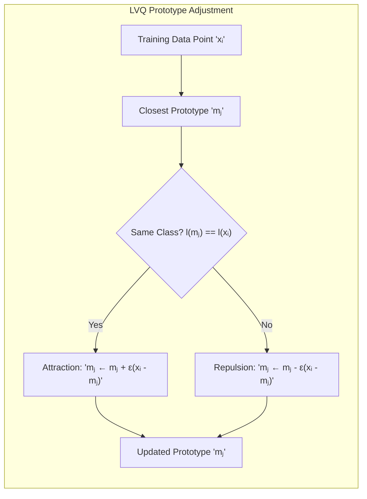
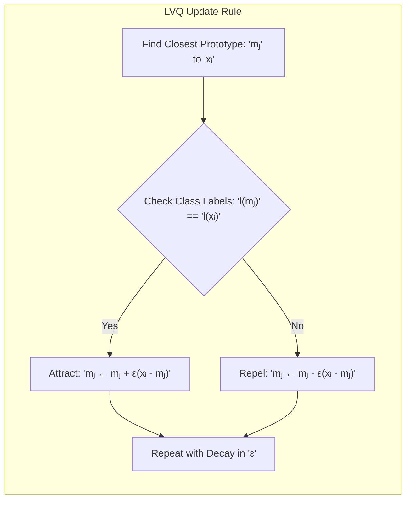
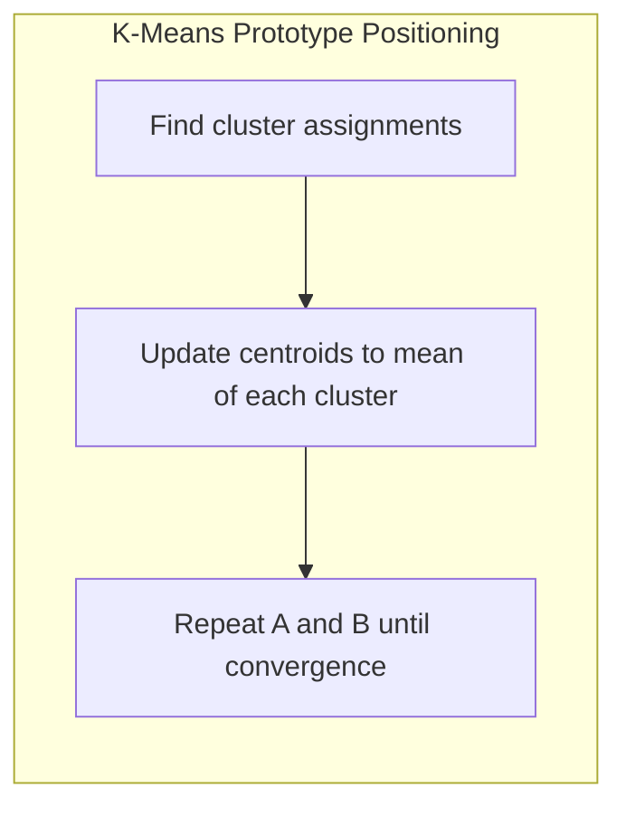

## Atração e Repulsão de Protótipos: Ajuste Dinâmico Guiado por Rótulos de Classe



### Introdução

Este capítulo explora o conceito de **atração e repulsão de protótipos**, um mecanismo fundamental no algoritmo **LVQ (Learning Vector Quantization)**, que permite ajustar dinamicamente o posicionamento dos protótipos com base nos rótulos de classe dos dados de treinamento [^13.2.2]. A ideia central é que, ao processar cada ponto de treinamento, os protótipos da mesma classe são "atraídos" pelo ponto, enquanto os protótipos de classes diferentes são "repelidos". Esse processo de atração e repulsão leva a um posicionamento estratégico dos protótipos nas regiões de decisão, resultando em modelos de classificação mais eficazes. Analisaremos como esse mecanismo opera, seu impacto no desempenho do modelo e como o LVQ se diferencia de outros métodos baseados em protótipos que não utilizam esse mecanismo de ajuste.

### O Mecanismo de Atração e Repulsão: Ajuste Supervisionado de Protótipos

O mecanismo de **atração e repulsão de protótipos** é uma característica fundamental do algoritmo **LVQ**, que o diferencia de outros métodos de protótipos como o K-Means [^13.2.2]. No LVQ, cada protótipo é ajustado com base na comparação entre seu rótulo de classe e o rótulo de classe do ponto de treinamento mais próximo.

A ideia central é que:

1.  **Atração:** Se o protótipo mais próximo de um ponto de treinamento pertence à mesma classe que o ponto, o protótipo é movido em direção ao ponto. Isso faz com que o protótipo se torne mais representativo dessa classe.
2.  **Repulsão:** Se o protótipo mais próximo de um ponto de treinamento pertence a uma classe diferente do ponto, o protótipo é movido em direção oposta ao ponto. Isso faz com que o protótipo se afaste de regiões onde ele não é representativo, e aumenta a discriminação entre as classes.

Esse mecanismo de atração e repulsão é guiado pelos rótulos de classe dos dados de treinamento, o que torna o LVQ um algoritmo de aprendizado supervisionado. O tamanho do passo de movimentação dos protótipos é controlado por um parâmetro chamado taxa de aprendizagem (*learning rate*), que é um hiperparâmetro do modelo. A taxa de aprendizado geralmente diminui com o tempo, o que garante que os protótipos converjam para uma solução estável.

**Lemma 50:** O mecanismo de atração e repulsão do LVQ ajusta os protótipos de forma dinâmica, posicionando-os em regiões estratégicas do espaço de *features* que melhor representam as fronteiras de decisão entre as classes.
*Prova*: Os protótipos são movidos iterativamente com base no rótulo das classes, aproximando protótipos da mesma classe e afastando protótipos de classes diferentes, criando regiões de decisão mais precisas. $\blacksquare$

**Corolário 50:** A taxa de aprendizado controla o tamanho do passo da movimentação dos protótipos, e valores muito altos levam a oscilações e dificuldade de convergência, enquanto valores muito baixos levam a um aprendizado lento e a modelos de desempenho inferior.

> 💡 **Exemplo Numérico:**
>
> Imagine que temos um protótipo $m_1 = [1, 1]$ representando a classe A e um ponto de treinamento $x_1 = [2, 2]$ também da classe A. Se a taxa de aprendizagem $\epsilon = 0.1$, a atualização do protótipo será:
>
> $m_1 \leftarrow m_1 + \epsilon (x_1 - m_1)$
> $m_1 \leftarrow [1, 1] + 0.1 ([2, 2] - [1, 1])$
> $m_1 \leftarrow [1, 1] + 0.1 [1, 1]$
> $m_1 \leftarrow [1.1, 1.1]$
>
> O protótipo $m_1$ se moveu em direção ao ponto $x_1$. Agora, se tivermos um protótipo $m_2 = [3, 3]$ representando a classe B e o mesmo ponto $x_1 = [2, 2]$ (da classe A), a atualização (repulsão) será:
>
> $m_2 \leftarrow m_2 - \epsilon (x_1 - m_2)$
> $m_2 \leftarrow [3, 3] - 0.1 ([2, 2] - [3, 3])$
> $m_2 \leftarrow [3, 3] - 0.1 [-1, -1]$
> $m_2 \leftarrow [3.1, 3.1]$
>
> O protótipo $m_2$ se moveu para longe do ponto $x_1$. Este exemplo ilustra como a atração e repulsão funcionam em termos numéricos.

> ⚠️ **Nota Importante**:  O mecanismo de atração e repulsão é uma característica fundamental do LVQ, que permite que o algoritmo ajuste os protótipos com base nas informações sobre os rótulos de classe.

> ❗ **Ponto de Atenção**:  O mecanismo de atração e repulsão, juntamente com a taxa de aprendizagem, é responsável por posicionar os protótipos em regiões de alta densidade de cada classe e próximo das fronteiras de decisão, o que leva a modelos discriminativos e com bom desempenho.

### Implementação do Mecanismo de Atração e Repulsão no LVQ

A implementação do mecanismo de atração e repulsão no LVQ é relativamente simples [^13.2.2]. Seja $x_i$ um ponto de treinamento e seja $m_j$ o protótipo mais próximo de $x_i$. O ajuste do protótipo $m_j$ é dado pelas seguintes regras:

1.  **Atração (Protótipos da Mesma Classe):** Se o rótulo de classe do protótipo $m_j$ for igual ao rótulo de classe do ponto $x_i$ (ou seja, $l(m_j) = l(x_i)$), então o protótipo é movido em direção ao ponto de treinamento:
    $$m_j \leftarrow m_j + \epsilon (x_i - m_j)$$
    onde $\epsilon$ é a taxa de aprendizagem.
2.  **Repulsão (Protótipos de Classes Diferentes):** Se o rótulo de classe do protótipo $m_j$ for diferente do rótulo de classe do ponto $x_i$ (ou seja, $l(m_j) \neq l(x_i)$), então o protótipo é movido em direção oposta ao ponto de treinamento:
    $$m_j \leftarrow m_j - \epsilon (x_i - m_j)$$

A taxa de aprendizado ($\epsilon$) geralmente diminui com o tempo, seguindo um esquema de decaimento pré-definido. A repetição dos passos de identificação do protótipo mais próximo e atualização do protótipo garante que os protótipos se posicionem estrategicamente no espaço de *features*.



**Lemma 51:** A aplicação da regra de atualização do LVQ, com atração de protótipos da mesma classe e repulsão de protótipos de classes diferentes, faz com que os protótipos se posicionem perto das fronteiras de decisão entre as classes, o que melhora o desempenho do modelo de classificação.
*Prova*: A regra de atualização garante a aproximação de protótipos da classe correta e o afastamento dos protótipos de outras classes, levando a uma melhor representação das fronteiras de decisão. $\blacksquare$

**Corolário 51:** O decaimento gradual da taxa de aprendizado garante que os protótipos convirjam para uma solução estável e evitam oscilações durante o processo de aprendizado.

> 💡 **Exemplo Numérico:**
>
> Vamos considerar uma situação com dois protótipos e um ponto de treinamento. Suponha que temos dois protótipos, $m_1 = [0.5, 0.5]$ (classe A) e $m_2 = [1.5, 1.5]$ (classe B), e um ponto de treinamento $x_1 = [0.8, 0.7]$ (classe A). Inicialmente, $m_1$ é o protótipo mais próximo de $x_1$. Usando uma taxa de aprendizagem inicial de $\epsilon = 0.2$ e aplicando a regra de atração:
>
> $m_1 \leftarrow [0.5, 0.5] + 0.2 ([0.8, 0.7] - [0.5, 0.5])$
> $m_1 \leftarrow [0.5, 0.5] + 0.2 [0.3, 0.2]$
> $m_1 \leftarrow [0.56, 0.54]$
>
> Agora, suponha que processamos outro ponto $x_2 = [1.2, 1.3]$ (classe B). O protótipo mais próximo é $m_2$. Aplicando a regra de atração:
>
> $m_2 \leftarrow [1.5, 1.5] + 0.2 ([1.2, 1.3] - [1.5, 1.5])$
> $m_2 \leftarrow [1.5, 1.5] + 0.2 [-0.3, -0.2]$
> $m_2 \leftarrow [1.44, 1.46]$
>
> Se, em vez disso, $x_2$ fosse da classe A, então $m_2$ seria repelido:
>
> $m_2 \leftarrow [1.5, 1.5] - 0.2 ([1.2, 1.3] - [1.5, 1.5])$
> $m_2 \leftarrow [1.5, 1.5] - 0.2 [-0.3, -0.2]$
> $m_2 \leftarrow [1.56, 1.54]$
>
> Este exemplo mostra como os protótipos se movem de acordo com a classe dos pontos de treinamento.

> ⚠️ **Nota Importante**: A implementação do mecanismo de atração e repulsão no LVQ envolve a atualização dos protótipos com base nas informações sobre os rótulos de classe dos dados de treinamento.

> ❗ **Ponto de Atenção**: O esquema de decaimento da taxa de aprendizagem e o valor inicial da taxa são hiperparâmetros que afetam a convergência e o desempenho do algoritmo LVQ.

### Comparação com o Posicionamento de Protótipos no K-Means

O posicionamento de protótipos no **K-Means** difere fundamentalmente do LVQ, pois o K-Means não utiliza informações sobre os rótulos de classe para ajustar os protótipos [^13.2.1]. No K-Means, os protótipos (centróides) são posicionados nos centros dos *clusters* de dados, buscando minimizar a variância intra-cluster. O K-Means não move os protótipos com o objetivo de discriminar as classes, como o LVQ, o que pode levar a protótipos que não representam adequadamente as fronteiras de decisão.



A ausência de um mecanismo de atração e repulsão no K-Means limita sua capacidade de modelar fronteiras de decisão complexas, especialmente em cenários onde as classes se sobrepõem ou apresentam formas irregulares. O K-Means é mais adequado para problemas onde as classes são aproximadamente convexas e linearmente separáveis, enquanto o LVQ é mais adequado para problemas com fronteiras de decisão não lineares e mais desafiadoras.

**Lemma 52:** O K-Means busca representar as regiões de dados com centros de clusters, mas não utiliza informações sobre rótulos das classes, limitando sua capacidade de representar adequadamente as fronteiras de decisão.
*Prova*: A regra de atualização do K-means move o centróide para a média dos pontos, e não há nenhuma influência do rótulo da classe sobre o posicionamento. $\blacksquare$

**Corolário 52:** A falta de um mecanismo de atração e repulsão no K-Means limita sua capacidade de posicionar estrategicamente os protótipos, o que pode levar a uma capacidade de generalização inferior para problemas de classificação complexos.

> 💡 **Exemplo Numérico:**
>
> Para ilustrar a diferença, imagine que temos duas classes, A e B, em um espaço 2D. A classe A forma um círculo em torno do ponto [1,1] e a classe B forma um círculo em torno do ponto [3,3].
>
> **K-Means:** Se aplicarmos K-Means com dois protótipos para todo o conjunto de dados, sem levar em conta as classes, os centróides provavelmente se posicionarão no meio dos dois círculos, sem necessariamente representar a fronteira de decisão.
>
> **LVQ:** O LVQ, ao contrário, usaria protótipos para cada classe e os moveria para as regiões de maior densidade de cada classe e para perto da fronteira, resultando em um modelo que discrimina melhor as classes.
>
> ```mermaid
> graph LR
>     A(Classe A) -->|K-Means Centroid| C
>     B(Classe B) -->|K-Means Centroid| C
>     A -->|LVQ Protótipo A| D
>     B -->|LVQ Protótipo B| E
>     style C fill:#f9f,stroke:#333,stroke-width:2px
>     style D fill:#ccf,stroke:#333,stroke-width:2px
>     style E fill:#ccf,stroke:#333,stroke-width:2px
> ```
>
> No diagrama acima, o centróide do K-Means (C) fica no meio, enquanto os protótipos do LVQ (D e E) se posicionam mais próximos das fronteiras das classes.

> ⚠️ **Nota Importante**: O K-Means não utiliza informações sobre os rótulos de classe no posicionamento dos protótipos, ao contrário do LVQ, que se baseia no mecanismo de atração e repulsão para ajustar os protótipos com base nos rótulos de classe.

> ❗ **Ponto de Atenção**:  A capacidade do LVQ de ajustar os protótipos com base nas informações sobre os rótulos de classe permite que ele crie fronteiras de decisão mais precisas e eficazes em comparação com o K-Means.

### Conclusão

O mecanismo de atração e repulsão de protótipos é uma característica fundamental do LVQ, que permite que o algoritmo posicione estrategicamente os protótipos no espaço de *features*, de forma a melhor representar a distribuição das classes e suas fronteiras de decisão. O ajuste dinâmico dos protótipos com base nos rótulos de classe diferencia o LVQ do K-Means e o torna mais adequado para lidar com fronteiras de decisão complexas, resultando em modelos de classificação com melhor capacidade de generalização e mais precisos. A compreensão desse mecanismo é essencial para utilizar e adaptar o LVQ a uma variedade de problemas de classificação e reconhecimento de padrões.

### Footnotes

[^13.2.2]: "In this technique due to Kohonen (1989), prototypes are placed strategically with respect to the decision boundaries in an ad-hoc way. LVQ is an online algorithm-observations are processed one at a time. The idea is that the training points attract prototypes of the correct class, and repel other prototypes. When the iterations settle down, prototypes should be close to the training points in their class." *(Trecho de "13. Prototype Methods and Nearest-Neighbors")*

[^13.2.1]: "K-means clustering is a method for finding clusters and cluster centers in a set of unlabeled data... To use K-means clustering for classification of labeled data, the steps are: apply K-means clustering to the training data in each class separately, using R prototypes per class; assign a class label to each of the K × R prototypes; classify a new feature x to the class of the closest prototype." *(Trecho de "13. Prototype Methods and Nearest-Neighbors")*
