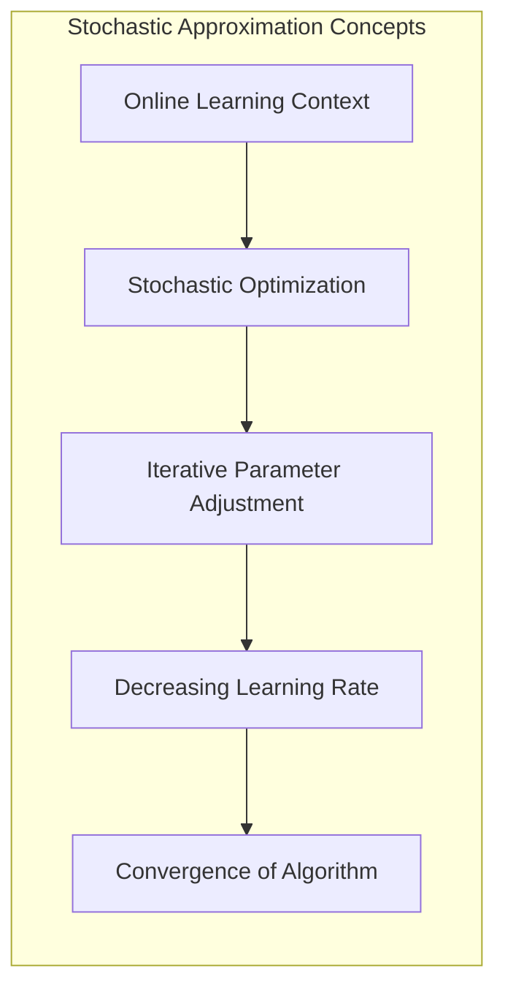
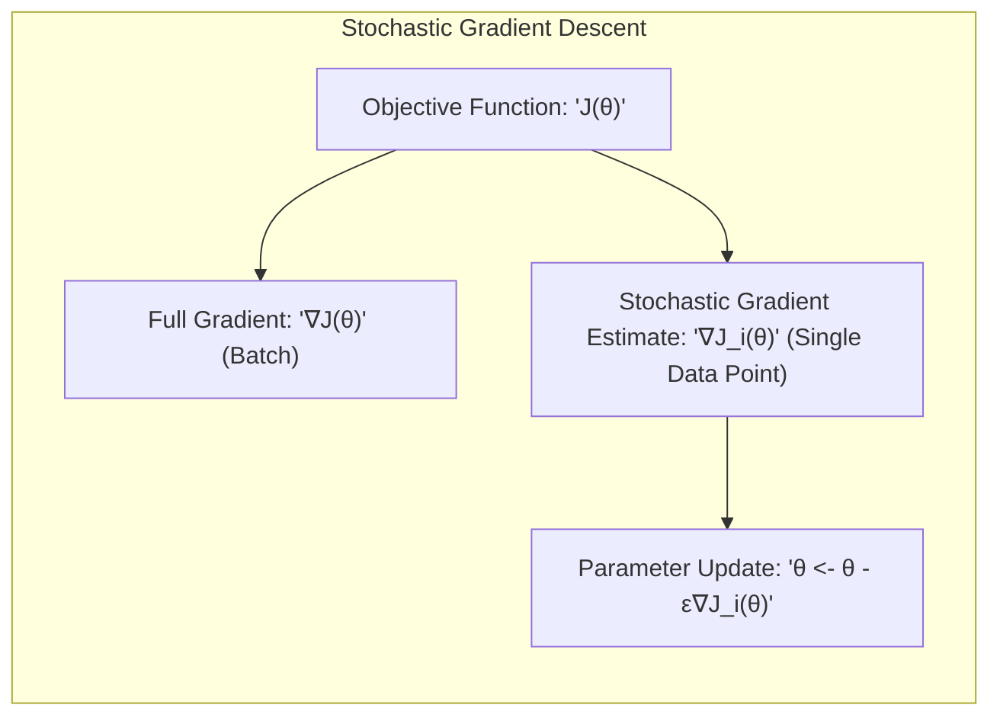
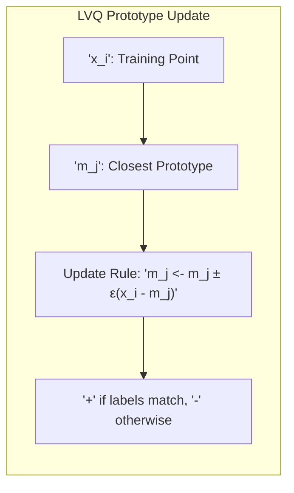
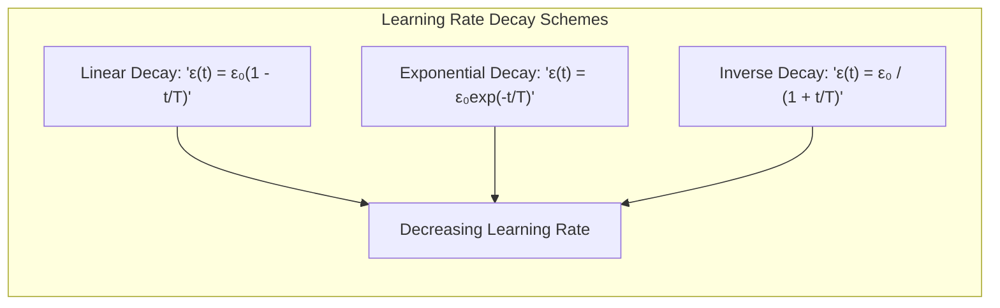

## Aproximação Estocástica: A Taxa de Aprendizado Decrescente e a Convergência em Métodos *Online*

### Introdução

Este capítulo explora o conceito de **aproximação estocástica** no contexto de métodos de aprendizado *online*, com foco especial na forma como a **taxa de aprendizado** é ajustada iterativamente ao longo do tempo [^13.2.2]. A taxa de aprendizado é um hiperparâmetro crucial em algoritmos como o LVQ (Learning Vector Quantization), que controla a magnitude das atualizações dos protótipos a cada observação. Analisaremos por que é fundamental que a taxa de aprendizado decresça com o tempo, e como esse decrescimento garante a convergência do algoritmo e evita oscilações indesejadas. Exploraremos também como o conceito de aproximação estocástica se relaciona com a otimização de modelos de aprendizado de máquina, e como as escolhas sobre o esquema de decaimento da taxa de aprendizado podem afetar o desempenho do modelo.

### Aproximação Estocástica: Uma Abordagem para Otimização *Online*

A **aproximação estocástica** é um ramo da otimização que se preocupa com a resolução de problemas de otimização em que as informações sobre a função objetivo são obtidas de forma estocástica ou ruidosa [^13.2.2]. No contexto do aprendizado *online*, o objetivo é ajustar os parâmetros do modelo (no caso do LVQ, os protótipos) iterativamente com base em cada observação de treinamento, com o objetivo de minimizar uma função de custo.

A aproximação estocástica é particularmente útil quando a função objetivo não pode ser avaliada completamente, ou quando o conjunto de dados é muito grande para ser processado em lote. Em vez de calcular o gradiente da função objetivo sobre todo o conjunto de dados, como seria feito em métodos de otimização em lote, a aproximação estocástica usa uma estimativa ruidosa do gradiente obtida com base em cada observação de treinamento individual.

A taxa de aprendizado desempenha um papel fundamental na aproximação estocástica. A cada iteração, o modelo é atualizado usando o gradiente estimado multiplicado pela taxa de aprendizado. Para garantir a convergência do algoritmo, a taxa de aprendizado deve decrescer ao longo do tempo. Inicialmente, quando o modelo está longe do ótimo, a taxa de aprendizado é maior, permitindo que o modelo explore rapidamente o espaço de parâmetros. Com o tempo, quando o modelo se aproxima do ótimo, a taxa de aprendizado diminui, permitindo que o modelo refine sua solução de forma mais precisa e evite oscilações em torno do ótimo.

**Lemma 53:** O uso de uma taxa de aprendizado decrescente garante a convergência dos algoritmos de otimização por aproximação estocástica, permitindo que o modelo se ajuste inicialmente de forma mais ampla e depois refine o ajuste de forma precisa.
*Prova*: Uma taxa de aprendizagem constante poderia levar o algoritmo a oscilar em torno do mínimo ou mesmo divergir, enquanto um decréscimo apropriado da taxa de aprendizagem garante que as atualizações do modelo se tornem menores ao longo do tempo, levando à estabilização em um ótimo local. $\blacksquare$

**Corolário 53:** O decréscimo da taxa de aprendizado segue princípios de otimização estocástica, onde o algoritmo explora o espaço de parâmetros no início e depois se concentra no refinamento da solução.

> 💡 **Exemplo Numérico:**
> Imagine que estamos ajustando um modelo de regressão linear usando descida do gradiente estocástico. Inicialmente, a taxa de aprendizado é alta, digamos $\epsilon_0 = 0.1$. Isso permite que os parâmetros do modelo mudem rapidamente em direção ao mínimo da função de custo. Conforme as iterações avançam, a taxa de aprendizado diminui. Por exemplo, após 100 iterações, a taxa de aprendizado pode ser $\epsilon_{100} = 0.01$. Isso significa que as atualizações dos parâmetros se tornam menores, refinando a solução e evitando grandes oscilações em torno do mínimo.
>
> Vamos supor que o erro atual seja grande, e o gradiente calculado $\nabla J$ seja igual a 10.
>
> **Iteração 1:** (Início do treinamento)
>
> $\epsilon_0 = 0.1$
>
> Atualização dos parâmetros: $\Delta \theta = - \epsilon_0 \nabla J = -0.1 * 10 = -1$
>
> **Iteração 100:** (Treinamento avançado)
>
> $\epsilon_{100} = 0.01$
>
> Atualização dos parâmetros: $\Delta \theta = - \epsilon_{100} \nabla J = -0.01 * 10 = -0.1$
>
> Observe como a magnitude da atualização do parâmetro diminuiu drasticamente, o que permite maior refinamento da solução.

> ⚠️ **Nota Importante**:  A aproximação estocástica é uma abordagem fundamental para otimização em ambientes *online*, onde os parâmetros do modelo são ajustados iterativamente com base em cada observação de treinamento.

> ❗ **Ponto de Atenção**: A taxa de aprendizado é um hiperparâmetro crítico que deve ser ajustado cuidadosamente para garantir a convergência e evitar instabilidades no processo de otimização.

### A Taxa de Aprendizado Decrescente no LVQ

No algoritmo **LVQ (Learning Vector Quantization)**, a taxa de aprendizado ($\epsilon$) controla o tamanho do passo da movimentação dos protótipos em cada iteração [^13.2.2]. A cada ponto de treinamento, o protótipo mais próximo é atualizado utilizando a seguinte regra:

$$m_j \leftarrow m_j \pm \epsilon (x_i - m_j)$$

O sinal + é usado quando o rótulo do protótipo coincide com o rótulo do ponto de treinamento, enquanto o sinal - é usado quando os rótulos são diferentes. A taxa de aprendizado ($\epsilon$) é tipicamente inicializada com um valor pequeno e decresce iterativamente ao longo do tempo, seguindo um esquema de decaimento predefinido.

Um esquema comum de decaimento da taxa de aprendizado é dado por:

$$\epsilon(t) = \frac{\epsilon_0}{1 + \frac{t}{T}}$$

Onde $\epsilon_0$ é o valor inicial da taxa de aprendizado, $t$ é o número da iteração atual e $T$ é um parâmetro que controla a taxa de decaimento. Outras formas de decaimento podem ser lineares ou exponenciais.

O uso de uma taxa de aprendizado decrescente tem várias vantagens:

1.  **Estabilidade:** No início do treinamento, quando os protótipos estão longe de sua localização ideal, uma taxa de aprendizado maior permite que os protótipos se movam rapidamente em direção aos pontos de treinamento. Ao longo do tempo, uma taxa de aprendizado menor garante que o modelo refine a solução com mais precisão e evite oscilações.
2.  **Convergência:** Uma taxa de aprendizado decrescente ajuda o algoritmo a convergir para uma solução estável, ou seja, um estado onde os protótipos não mudam mais significativamente ao longo do tempo.
3.  **Generalização:** Ao evitar oscilações e o *overfitting* nos dados de treino, um esquema de decaimento apropriado da taxa de aprendizagem permite que o modelo generalize melhor para dados não vistos.

**Lemma 54:** A utilização de uma taxa de aprendizagem decrescente no LVQ permite um ajuste mais eficiente dos protótipos ao longo do processo de aprendizagem, garantindo convergência para uma solução mais estável e com boa capacidade de generalização.
*Prova*: A taxa de aprendizagem decrescente permite que o modelo explore o espaço de parâmetros em passos maiores no início da otimização e refine a solução com passos menores ao longo do tempo, evitando grandes oscilações. $\blacksquare$

**Corolário 54:** A escolha do valor inicial da taxa de aprendizado e da taxa de decaimento tem um impacto significativo no desempenho do LVQ e deve ser otimizado utilizando validação cruzada.

> 💡 **Exemplo Numérico:**
>
> Suponha que temos um protótipo $m_j = [1, 1]$ e um ponto de treinamento $x_i = [3, 3]$, ambos pertencentes à mesma classe. Vamos usar a regra de atualização do LVQ com uma taxa de aprendizado decrescente. Inicialmente, $\epsilon_0 = 0.5$ e $T = 100$.
>
> **Iteração 1:**
>
> $\epsilon(1) = \frac{0.5}{1 + \frac{1}{100}} \approx 0.495$
>
> $m_j \leftarrow m_j + \epsilon(1) (x_i - m_j) = [1, 1] + 0.495([3, 3] - [1, 1]) = [1, 1] + 0.495[2, 2] = [1.99, 1.99]$
>
> **Iteração 50:**
>
> $\epsilon(50) = \frac{0.5}{1 + \frac{50}{100}} \approx 0.333$
>
> $m_j \leftarrow m_j + \epsilon(50) (x_i - m_j)$. Vamos assumir que após várias iterações, o protótipo $m_j$ já se moveu para $[2.5, 2.5]$.
>
> $m_j \leftarrow [2.5, 2.5] + 0.333([3, 3] - [2.5, 2.5]) = [2.5, 2.5] + 0.333[0.5, 0.5] = [2.6665, 2.6665]$
>
> **Iteração 100:**
>
> $\epsilon(100) = \frac{0.5}{1 + \frac{100}{100}} = 0.25$
>
> $m_j \leftarrow m_j + \epsilon(100) (x_i - m_j)$. Vamos assumir que após várias iterações, o protótipo $m_j$ já se moveu para $[2.8, 2.8]$.
>
> $m_j \leftarrow [2.8, 2.8] + 0.25([3, 3] - [2.8, 2.8]) = [2.8, 2.8] + 0.25[0.2, 0.2] = [2.85, 2.85]$
>
> Observe que a cada iteração, o protótipo se aproxima do ponto de treinamento, e o tamanho do passo diminui devido à taxa de aprendizado decrescente. Isso garante que o protótipo não oscile em torno do ponto de treinamento e convirja para uma posição estável.

> ⚠️ **Nota Importante**: A taxa de aprendizado decrescente no LVQ é crucial para garantir que o algoritmo convirja para uma solução estável e evite oscilações e *overfitting*.

> ❗ **Ponto de Atenção**:  A escolha do esquema de decaimento da taxa de aprendizado é tão importante quanto a escolha do valor inicial, e diferentes esquemas podem ser mais adequados dependendo das características do conjunto de dados.

### Esquemas de Decaimento e sua Relação com a Aproximação Estocástica

O esquema de decaimento da taxa de aprendizado é uma parte importante da implementação de métodos de aproximação estocástica, e sua escolha impacta diretamente o desempenho do algoritmo [^13.2.2]. Existem diferentes esquemas de decaimento que podem ser utilizados, e a escolha do esquema mais apropriado depende das características do problema.

Alguns esquemas de decaimento comuns são:

1.  **Decaimento Linear:** A taxa de aprendizado decresce linearmente ao longo do tempo, seguindo a fórmula $\epsilon(t) = \epsilon_0 (1 - \frac{t}{T})$, onde $T$ é o número total de iterações.
2.  **Decaimento Exponencial:** A taxa de aprendizado decresce exponencialmente ao longo do tempo, seguindo a fórmula $\epsilon(t) = \epsilon_0 \exp(-\frac{t}{T})$.
3.  **Decaimento Inverso:** A taxa de aprendizado decresce de forma inversa ao tempo, seguindo a fórmula $\epsilon(t) = \frac{\epsilon_0}{1 + \frac{t}{T}}$.

Todos esses esquemas garantem que a taxa de aprendizado decresça ao longo do tempo, com a diferença na velocidade do decaimento. Os esquemas de decaimento exponencial e inverso tendem a apresentar um decaimento mais rápido no início, enquanto o decaimento linear pode levar a uma redução mais lenta, dependendo dos parâmetros utilizados.

O conceito da aproximação estocástica surge da necessidade de otimizar funções objetivo complexas que são avaliadas com estimativas ruidosas, como é o caso do LVQ, onde os protótipos são atualizados com base na observação de um único ponto, o que representa uma estimativa ruidosa do gradiente da função objetivo global. O uso de uma taxa de aprendizado decrescente permite que o algoritmo se aproxime gradualmente do ótimo global.

**Lemma 55:** Os esquemas de decaimento da taxa de aprendizado se relacionam com a aproximação estocástica, pois garantem que o algoritmo se aproxime gradualmente do mínimo global, com passos maiores no início da otimização e passos menores ao longo do tempo.
*Prova*: Diferentes esquemas de decaimento da taxa de aprendizagem guiam o processo de aproximação do ótimo, com a velocidade de decaimento controlando a exploração e a convergência. $\blacksquare$

**Corolário 55:** A escolha do esquema de decaimento e dos valores de seus parâmetros influencia o desempenho do algoritmo, e devem ser ajustados experimentalmente.

> 💡 **Exemplo Numérico:**
>
> Vamos comparar os esquemas de decaimento linear, exponencial e inverso para uma taxa de aprendizado inicial $\epsilon_0 = 0.5$ e um número total de iterações $T=100$.
>
> | Iteração (t) | Decaimento Linear  $\epsilon(t) = 0.5(1 - \frac{t}{100})$ | Decaimento Exponencial $\epsilon(t) = 0.5\exp(-\frac{t}{100})$ | Decaimento Inverso $\epsilon(t) = \frac{0.5}{1 + \frac{t}{100}}$ |
> |--------------|--------------------------------------------------|----------------------------------------------------|-----------------------------------------------|
> | 0            | 0.5                                              | 0.5                                                | 0.5                                           |
> | 10           | 0.45                                             | 0.452                                              | 0.454                                         |
> | 25           | 0.375                                            | 0.389                                              | 0.4                                           |
> | 50           | 0.25                                             | 0.303                                              | 0.333                                         |
> | 75           | 0.125                                            | 0.235                                              | 0.285                                         |
> | 100          | 0                                                | 0.183                                              | 0.25                                          |
>
> Como podemos ver, o decaimento linear atinge 0 no final do treinamento, enquanto o exponencial e o inverso tendem a valores maiores. A escolha do esquema de decaimento influencia a velocidade de convergência do algoritmo. O decaimento exponencial e inverso tendem a ter um decaimento mais rápido no início e mais lento no final, o que pode ser adequado para explorar o espaço de parâmetros no início e refinar a solução no final.

> ⚠️ **Nota Importante**: A escolha do esquema de decaimento da taxa de aprendizado é tão importante quanto a escolha do valor inicial, e ambos precisam ser ajustados para garantir um bom desempenho do modelo.

> ❗ **Ponto de Atenção**:  A aproximação estocástica é um conceito fundamental para entender o comportamento do LVQ e de outros métodos de aprendizado *online*.

### Conclusão

A aproximação estocástica e o uso de taxas de aprendizado decrescentes são elementos cruciais em métodos de aprendizado *online*, como o LVQ. A compreensão de como a taxa de aprendizado é ajustada e como diferentes esquemas de decaimento afetam o processo de otimização é fundamental para a aplicação eficaz desses métodos. O decréscimo iterativo da taxa de aprendizado permite que o modelo se adapte continuamente aos novos dados, garanta a convergência e obtenha soluções mais estáveis com boa capacidade de generalização. O ajuste fino da taxa de aprendizado e de seus parâmetros de decaimento permite o aproveitamento máximo do potencial dos métodos de aproximação estocástica em problemas de aprendizado de máquina.

### Footnotes

[^13.2.2]: "In this technique due to Kohonen (1989), prototypes are placed strategically with respect to the decision boundaries in an ad-hoc way. LVQ is an online algorithm-observations are processed one at a time. The idea is that the training points attract prototypes of the correct class, and repel other prototypes. When the iterations settle down, prototypes should be close to the training points in their class. The learning rate e is decreased to zero with each iteration, following the guidelines for stochastic approximation learning rates (Section 11.4.)" *(Trecho de "13. Prototype Methods and Nearest-Neighbors")*
