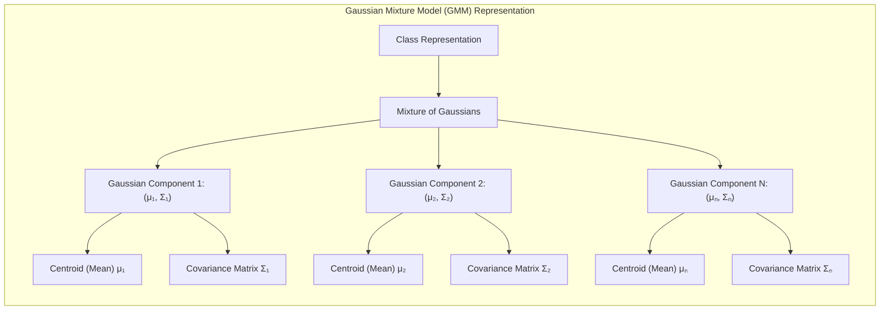
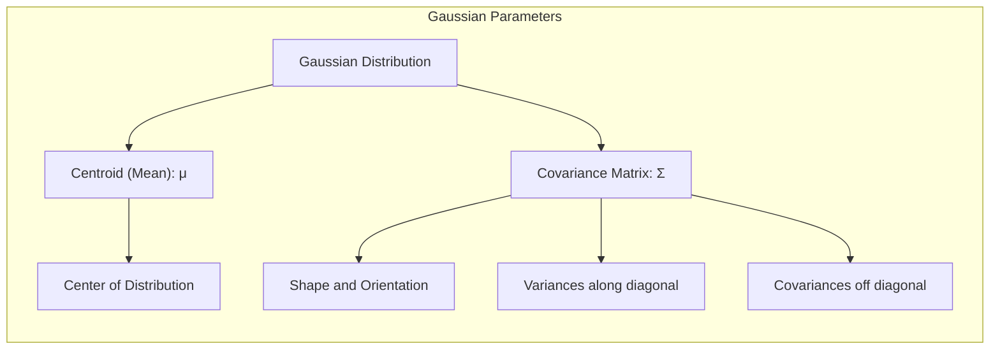
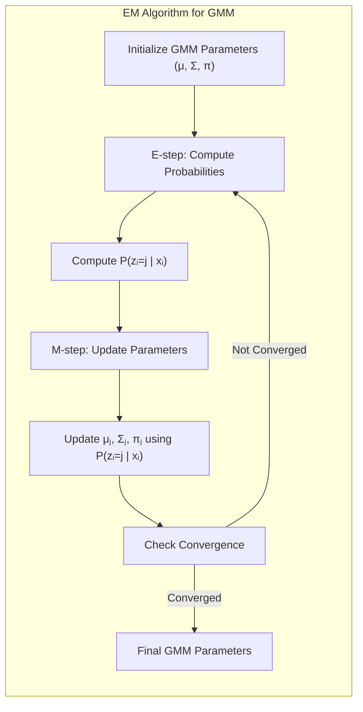
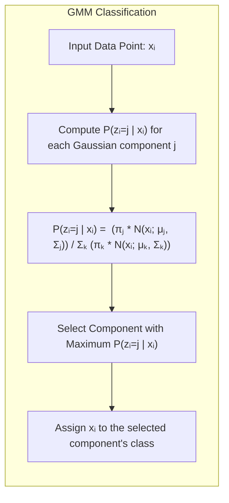

## Modelagem por Misturas Gaussianas: Representando Classes com Centróides e Matrizes de Covariância

### Introdução

Este capítulo explora o uso de **misturas gaussianas (GMMs)** como uma abordagem para modelar cada classe separadamente, representando-as por meio de uma distribuição gaussiana caracterizada por um **centróide** (média) e uma **matriz de covariância** [^13.2.3]. As GMMs são um método de protótipos que, diferentemente do K-Means e do LVQ (Learning Vector Quantization), utilizam distribuições probabilísticas para modelar a estrutura dos dados e representar cada classe por um conjunto de gaussianas, e como isso leva ao cálculo de probabilidades a posteriori para a classificação de novos pontos. Analisaremos como esses protótipos são ajustados pelo algoritmo EM (Expectation-Maximization), e como a abordagem difere da utilização de distâncias diretas a protótipos como no K-Means e LVQ.

### Modelagem de Classes com Distribuições Gaussianas

Uma abordagem alternativa para modelar as distribuições das classes em problemas de classificação é utilizar **distribuições gaussianas**, ou seja, modelar cada classe com uma ou mais distribuições normais (gaussianas) [^13.2.3]. Cada distribuição gaussiana é caracterizada por um **centróide (média)**, que representa o centro da distribuição, e uma **matriz de covariância**, que descreve a forma e a orientação da distribuição.

Ao utilizar várias gaussianas para modelar uma classe, temos uma **mistura gaussiana (GMM)**, que permite representar distribuições mais complexas, que não podem ser adequadamente representadas por uma única gaussiana. Em essência, a abordagem das GMMs busca aproximar a distribuição de cada classe utilizando uma combinação ponderada de gaussianas.

No contexto de métodos de protótipos, os parâmetros das gaussianas (média e matriz de covariância) atuam como protótipos, que são utilizados para classificar novos pontos de consulta. Ao invés de utilizar distâncias diretas entre pontos e protótipos, como no K-Means e LVQ, a classificação com GMMs utiliza probabilidades *a posteriori* que medem a probabilidade de o ponto de consulta pertencer a cada componente gaussiana.

**Lemma 59:** A utilização de distribuições gaussianas para modelar as classes permite representar distribuições complexas de dados por meio da combinação de múltiplas gaussianas, cada uma com seu centróide e matriz de covariância.
*Prova*: A escolha de uma distribuição gaussiana e a combinação de diferentes distribuições permite aproximar diversas formas de distribuições de dados. $\blacksquare$

**Corolário 59:** O número de componentes gaussianas utilizado em uma GMM é um hiperparâmetro que afeta a complexidade do modelo, e sua escolha deve balancear a capacidade do modelo de aproximar a distribuição dos dados e evitar o *overfitting*.

> ⚠️ **Nota Importante**: A abordagem das GMMs permite modelar cada classe utilizando uma distribuição gaussiana, ou combinação de gaussianas, e esses parâmetros são usados como protótipos para classificação.

> ❗ **Ponto de Atenção**:  A modelagem com gaussianas implica uma escolha de parâmetros que buscam ajustar os dados, e não uma divisão em regiões de alta densidade.

### Parâmetros de uma Gaussiana: Centróide e Matriz de Covariância

Uma distribuição gaussiana, também conhecida como distribuição normal, é caracterizada por dois parâmetros principais: o **centróide (média)** e a **matriz de covariância**.

1.  **Centróide (Média):** O centróide, representado por $\mu$, é um vetor que indica o centro da distribuição. Em um espaço de *features* de $p$ dimensões, o centróide é um vetor de $p$ componentes. Formalmente, o centróide é a média de todos os pontos que pertencem a essa gaussiana.
2.  **Matriz de Covariância:** A matriz de covariância, representada por $\Sigma$, descreve a forma e a orientação da distribuição. Ela indica a variabilidade dos dados em cada dimensão e as correlações entre diferentes dimensões. A matriz de covariância é uma matriz quadrada de dimensão $p \times p$, onde $p$ é o número de *features*. Os elementos da diagonal da matriz representam as variâncias de cada *feature*, enquanto os elementos fora da diagonal representam as covariâncias entre as *features*. Uma matriz de covariância diagonal significa que as *features* não são correlacionadas.

Esses parâmetros (centróide e matriz de covariância) atuam como protótipos que representam uma região do espaço de *features* com alta densidade de dados. Ao utilizar misturas gaussianas, cada componente gaussiana possui seu próprio centróide e matriz de covariância, permitindo modelar distribuições mais complexas e multimodais.

> 💡 **Exemplo Numérico:**
>
> Suponha que temos dados bidimensionais ($p=2$) representando duas características de flores (comprimento e largura da pétala). Para uma classe específica de flores, podemos ter um centróide (média) e uma matriz de covariância estimados a partir dos dados:
>
> Centróide (média): $\mu = \begin{bmatrix} 5.0 \\ 3.5 \end{bmatrix}$
>
> Matriz de Covariância: $\Sigma = \begin{bmatrix} 0.6 & 0.2 \\ 0.2 & 0.4 \end{bmatrix}$
>
> Aqui, o centróide indica que o comprimento médio da pétala é 5.0 e a largura média é 3.5. A matriz de covariância nos diz que há uma variância de 0.6 no comprimento da pétala, 0.4 na largura da pétala e uma covariância positiva de 0.2 entre as duas, indicando que, em geral, flores com pétalas mais longas também tendem a ter pétalas mais largas. Se a covariância fosse zero, significaria que o comprimento e a largura da pétala não estão linearmente correlacionados.
>
> Se tivéssemos uma matriz de covariância diagonal, como $\Sigma = \begin{bmatrix} 0.6 & 0 \\ 0 & 0.4 \end{bmatrix}$, isso indicaria que as características de comprimento e largura são independentes. Uma matriz de covariância esférica, como $\Sigma = \begin{bmatrix} 0.5 & 0 \\ 0 & 0.5 \end{bmatrix}$, indicaria que a variabilidade em todas as direções é a mesma.

**Lemma 60:** O centróide e a matriz de covariância de uma distribuição gaussiana capturam a localização, forma, orientação e variabilidade dos dados no espaço de *features*.
*Prova*: A média define a posição central, a variância define a dispersão e a covariância a relação linear entre as variáveis. $\blacksquare$

**Corolário 60:** Em GMMs, os protótipos de cada componente gaussiana são definidos por seus parâmetros (média e matriz de covariância).

> ⚠️ **Nota Importante**:  O centróide e a matriz de covariância são os parâmetros que definem a forma de uma distribuição gaussiana, e são utilizados como protótipos no contexto da modelagem por misturas gaussianas.

> ❗ **Ponto de Atenção**: A matriz de covariância é crucial para modelar as relações entre as *features*, e sua escolha (diagonal, cheia ou esférica) afeta a flexibilidade do modelo e o número de parâmetros a serem estimados.

### Ajuste de GMMs com o Algoritmo Expectation-Maximization (EM)

O ajuste dos parâmetros de uma **mistura gaussiana (GMM)**, que são os centróides e as matrizes de covariância de cada componente gaussiana, é realizado pelo **algoritmo Expectation-Maximization (EM)** [^13.2.3]. O algoritmo EM é um método iterativo que busca maximizar a verossimilhança dos dados sob o modelo de mistura gaussiana.

O algoritmo EM alterna entre duas etapas:

1.  **Expectation (E-step):** Nesta etapa, calcula-se a probabilidade de cada ponto de dados pertencer a cada componente gaussiana, dadas as estimativas atuais dos parâmetros das gaussianas. Essas probabilidades são calculadas utilizando a densidade gaussiana e a mistura de probabilidades *a priori*. Formalmente, calculam-se as probabilidades *a posteriori* de pertinência de um dado $x_i$ a cada uma das componentes gaussianas.
2.  **Maximization (M-step):** Nesta etapa, os parâmetros de cada componente gaussiana (média e matriz de covariância) são atualizados para maximizar a verossimilhança dos dados dados as probabilidades calculadas no passo E. Os novos parâmetros são calculados com base em uma versão ponderada dos dados de acordo com as probabilidades obtidas no passo E.

As etapas E e M são repetidas iterativamente até que a verossimilhança dos dados convirja ou até que um número máximo de iterações seja atingido. Ao final da iteração do EM, temos os parâmetros de cada componente gaussiana, que representam os protótipos para o modelo de mistura.

> 💡 **Exemplo Numérico:**
>
> Vamos considerar um exemplo simplificado com dois pontos de dados $x_1 = [1, 2]$ e $x_2 = [5, 6]$ e duas componentes gaussianas. Inicialmente, podemos supor que os parâmetros das gaussianas são:
>
> Componente 1: $\mu_1 = [0, 0]$, $\Sigma_1 = \begin{bmatrix} 1 & 0 \\ 0 & 1 \end{bmatrix}$, $\pi_1 = 0.5$
>
> Componente 2: $\mu_2 = [4, 4]$, $\Sigma_2 = \begin{bmatrix} 1 & 0 \\ 0 & 1 \end{bmatrix}$, $\pi_2 = 0.5$
>
> **E-step (Primeira iteração):**
> Calculamos a probabilidade de cada ponto pertencer a cada componente usando a densidade gaussiana e as probabilidades a priori. Vamos supor que a densidade gaussiana $\mathcal{N}(x; \mu, \Sigma)$ para um ponto $x$ é calculada usando a fórmula:
>
> $\mathcal{N}(x; \mu, \Sigma) = \frac{1}{\sqrt{(2\pi)^p |\Sigma|}} \exp\left(-\frac{1}{2}(x - \mu)^T \Sigma^{-1} (x - \mu)\right)$
>
> onde $p$ é a dimensão dos dados (2 neste caso) e $|\Sigma|$ é o determinante da matriz de covariância.
>
> Vamos calcular as probabilidades não normalizadas para $x_1$:
>
> $\mathcal{N}(x_1; \mu_1, \Sigma_1) \approx 0.013$
> $\mathcal{N}(x_1; \mu_2, \Sigma_2) \approx 0.00000016$
>
> E para $x_2$:
>
> $\mathcal{N}(x_2; \mu_1, \Sigma_1) \approx 0.00000016$
> $\mathcal{N}(x_2; \mu_2, \Sigma_2) \approx 0.013$
>
> As probabilidades a posteriori (normalizadas) são:
>
> $P(z_1 = 1 | x_1) = \frac{0.5 * 0.013}{0.5 * 0.013 + 0.5 * 0.00000016} \approx 1.0$
> $P(z_1 = 2 | x_1) = \frac{0.5 * 0.00000016}{0.5 * 0.013 + 0.5 * 0.00000016} \approx 0.0$
>
> $P(z_2 = 1 | x_2) = \frac{0.5 * 0.00000016}{0.5 * 0.00000016 + 0.5 * 0.013} \approx 0.0$
> $P(z_2 = 2 | x_2) = \frac{0.5 * 0.013}{0.5 * 0.00000016 + 0.5 * 0.013} \approx 1.0$
>
>
> **M-step (Primeira iteração):**
>
> Os novos parâmetros são calculados usando as probabilidades a posteriori como pesos. Por exemplo, as novas médias seriam:
>
> $\mu_1^{new} = \frac{1.0 * [1, 2] + 0.0 * [5, 6]}{1.0 + 0.0} = [1, 2]$
> $\mu_2^{new} = \frac{0.0 * [1, 2] + 1.0 * [5, 6]}{0.0 + 1.0} = [5, 6]$
>
> As matrizes de covariância e as probabilidades *a priori* também são atualizadas de forma semelhante.
>
> As etapas E e M são repetidas até a convergência dos parâmetros. Nesse caso, após algumas iterações, os parâmetros convergiriam para valores que ajustam bem as gaussianas aos dados.

**Lemma 61:** O algoritmo EM busca maximizar a verossimilhança dos dados dado o modelo de mistura gaussiana, ajustando os centróides e matrizes de covariância iterativamente até a convergência.
*Prova*: As etapas E e M garantem a convergência para um máximo local da função de verossimilhança. $\blacksquare$

**Corolário 61:** O algoritmo EM é uma ferramenta útil para estimar os parâmetros de modelos probabilísticos em que as variáveis latentes (as componentes da gaussiana para cada ponto) não são observadas, sendo útil em diversas aplicações de aprendizado de máquina.

> ⚠️ **Nota Importante**:  O algoritmo EM é um método iterativo para ajustar as componentes gaussianas do GMM, e permite estimar a média e a matriz de covariância de cada componente com base nos dados de treinamento.

> ❗ **Ponto de Atenção**: A escolha da inicialização dos parâmetros do modelo, assim como o número de componentes gaussianas, podem afetar a convergência do algoritmo EM, e devem ser tratadas com métodos específicos de inicialização e seleção de modelo.

### Classificação com GMMs: Probabilidades *a Posteriori*

Em modelos de **misturas gaussianas (GMMs)**, a classificação de novos pontos é realizada com base nas **probabilidades *a posteriori***, que medem a probabilidade de cada ponto de dados pertencer a cada componente gaussiana [^13.2.3].

Em vez de classificar um ponto atribuindo-o ao protótipo mais próximo, como no K-Means e LVQ, o ponto é atribuído à classe da componente gaussiana que produz a maior probabilidade *a posteriori*. Formalmente, a probabilidade *a posteriori* de um ponto $x_i$ pertencer à componente $j$ de uma mistura gaussiana com $K$ componentes é dada por:

$$P(z_i = j | x_i) = \frac{\pi_j \mathcal{N}(x_i; \mu_j, \Sigma_j)}{\sum_{k=1}^K \pi_k \mathcal{N}(x_i; \mu_k, \Sigma_k)}$$

onde $z_i$ é a componente gaussiana a qual o ponto $x_i$ pertence, $\pi_j$ é a probabilidade *a priori* da componente $j$, $\mathcal{N}(x_i; \mu_j, \Sigma_j)$ é a densidade gaussiana do ponto $x_i$ em relação à componente $j$ com média $\mu_j$ e covariância $\Sigma_j$.

Após calcular as probabilidades *a posteriori* de pertencer a cada componente gaussiana, o ponto é atribuído à classe da componente que tem a maior probabilidade *a posteriori*. Esta abordagem probabilística para classificação é mais robusta do que a atribuição baseada na distância ao protótipo mais próximo.

> 💡 **Exemplo Numérico:**
>
> Suponha que, após treinar um GMM com duas componentes, temos os seguintes parâmetros:
>
> Componente 1: $\mu_1 = [1, 1]$, $\Sigma_1 = \begin{bmatrix} 0.5 & 0 \\ 0 & 0.5 \end{bmatrix}$, $\pi_1 = 0.6$
>
> Componente 2: $\mu_2 = [5, 5]$, $\Sigma_2 = \begin{bmatrix} 0.8 & 0 \\ 0 & 0.8 \end{bmatrix}$, $\pi_2 = 0.4$
>
> Agora, queremos classificar um novo ponto $x = [2, 2]$. Calculamos a densidade gaussiana para cada componente:
>
> $\mathcal{N}(x; \mu_1, \Sigma_1) \approx 0.25$
> $\mathcal{N}(x; \mu_2, \Sigma_2) \approx 0.0005$
>
> As probabilidades *a posteriori* são:
>
> $P(z = 1 | x) = \frac{0.6 * 0.25}{0.6 * 0.25 + 0.4 * 0.0005} \approx 0.997$
> $P(z = 2 | x) = \frac{0.4 * 0.0005}{0.6 * 0.25 + 0.4 * 0.0005} \approx 0.003$
>
> O ponto $x = [2, 2]$ seria classificado como pertencente à Componente 1, pois tem uma probabilidade *a posteriori* muito maior de pertencer a essa componente (0.997) do que à Componente 2 (0.003).

**Lemma 62:** A classificação de novos pontos usando GMMs é realizada com base nas probabilidades *a posteriori* de pertencer a cada componente gaussiana, o que garante que a classificação seja feita com base na distribuição de probabilidade estimada pelos parâmetros das gaussianas.
*Prova*: A probabilidade *a posteriori* de um ponto pertencer a uma componente gaussiana é proporcional à verossimilhança daquele ponto dada a distribuição gaussiana, o que reflete a aderência do ponto àquela distribuição. $\blacksquare$

**Corolário 62:** A abordagem probabilística das GMMs permite que a classificação leve em consideração a incerteza na alocação de um ponto a cada componente, sendo mais robusta do que a classificação por distância.

> ⚠️ **Nota Importante**:  As GMMs utilizam uma abordagem probabilística para a classificação, atribuindo novos pontos à classe com maior probabilidade *a posteriori*, em vez de atribuir à classe do protótipo mais próximo.

> ❗ **Ponto de Atenção**:  A abordagem probabilística das GMMs pode levar a fronteiras de decisão mais suaves e melhor capacidade de generalização, quando comparadas a modelos que utilizam distâncias diretas.

### Conclusão

A modelagem de classes com distribuições gaussianas, através de GMMs, oferece uma abordagem flexível para a classificação, em que os protótipos são representados pelas médias e matrizes de covariância das gaussianas. O algoritmo EM é utilizado para ajustar os parâmetros dos protótipos, e a classificação é feita com base nas probabilidades *a posteriori* de cada ponto pertencer a cada gaussiana, resultando em uma representação mais precisa das distribuições e um procedimento de classificação probabilístico e mais robusto. Essa abordagem contrasta com modelos de protótipos que utilizam distâncias diretas e oferece uma alternativa com bom desempenho quando as distribuições dos dados são complexas ou multimodais.

### Footnotes

[^13.2.3]: "The Gaussian mixture model can also be thought of as a prototype method, similar in spirit to K-means and LVQ. We discuss Gaussian mixtures in some detail in Sections 6.8, 8.5 and 12.7. Each cluster is described in terms of a Gaussian density, which has a centroid (as in K-means), and a covariance matrix. The comparison becomes crisper if we restrict the component Gaussians to have a scalar covariance matrix (Exercise 13.1)...Similarly, when Gaussian mixture models are used to represent the feature density in each class, it produces smooth posterior probabilities." *(Trecho de "13. Prototype Methods and Nearest-Neighbors")*
