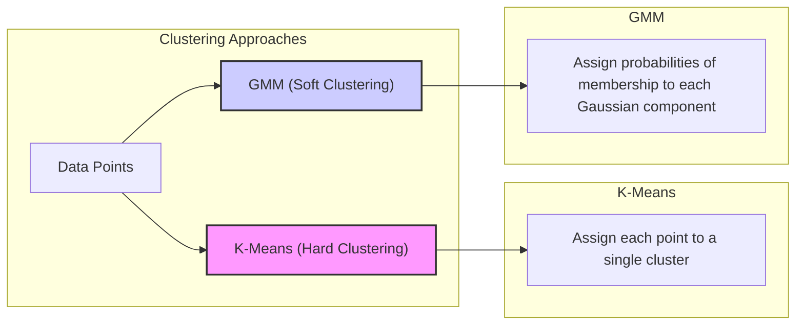
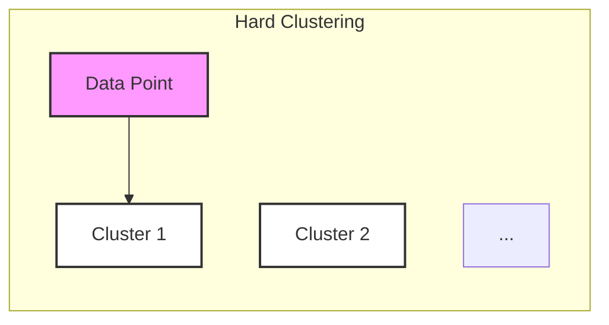
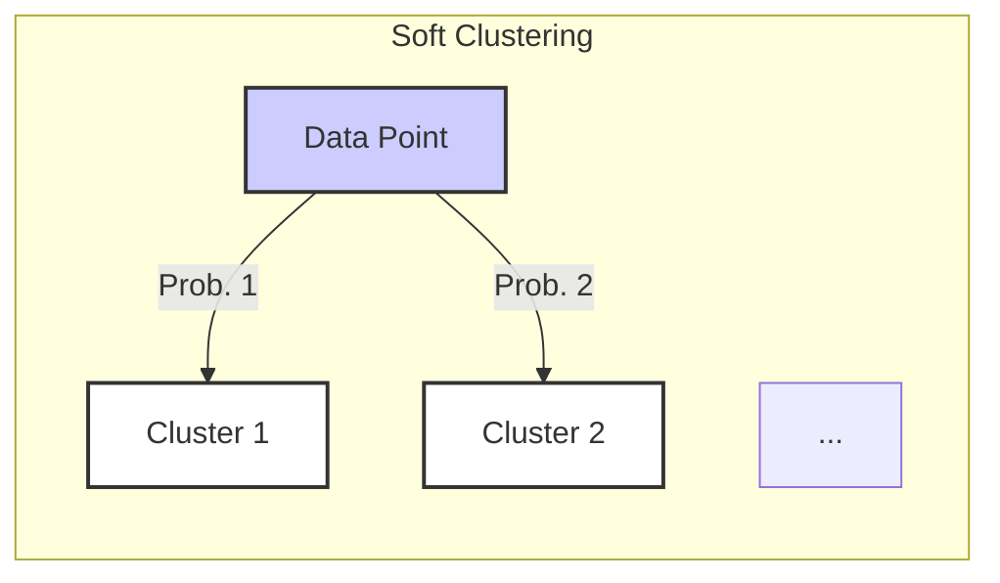
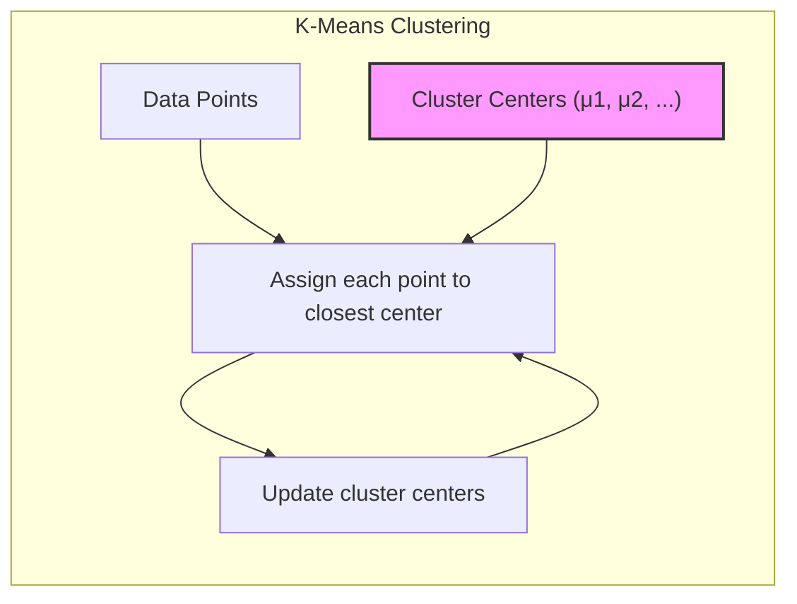
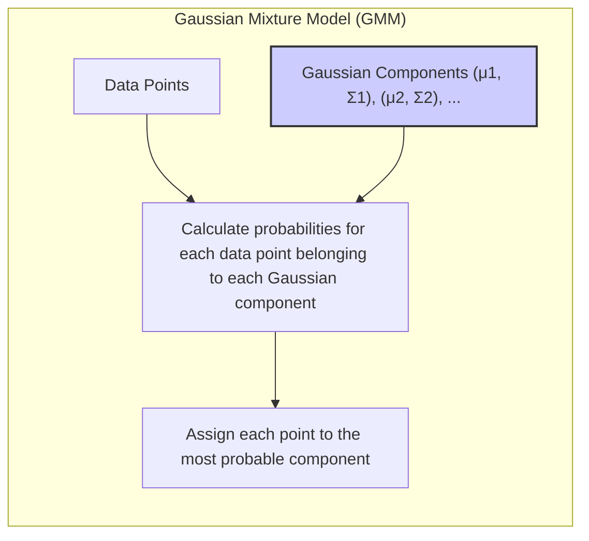
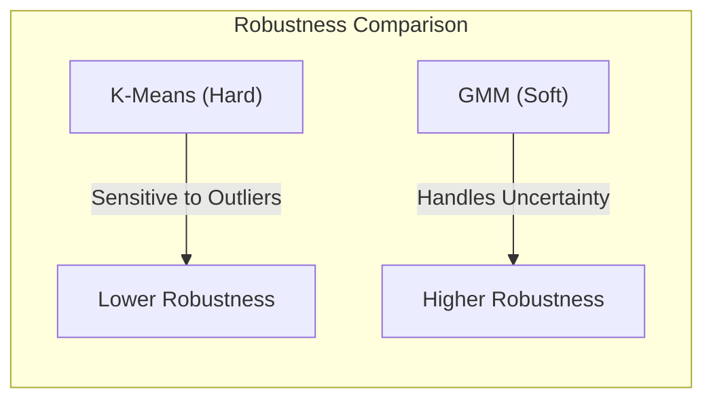
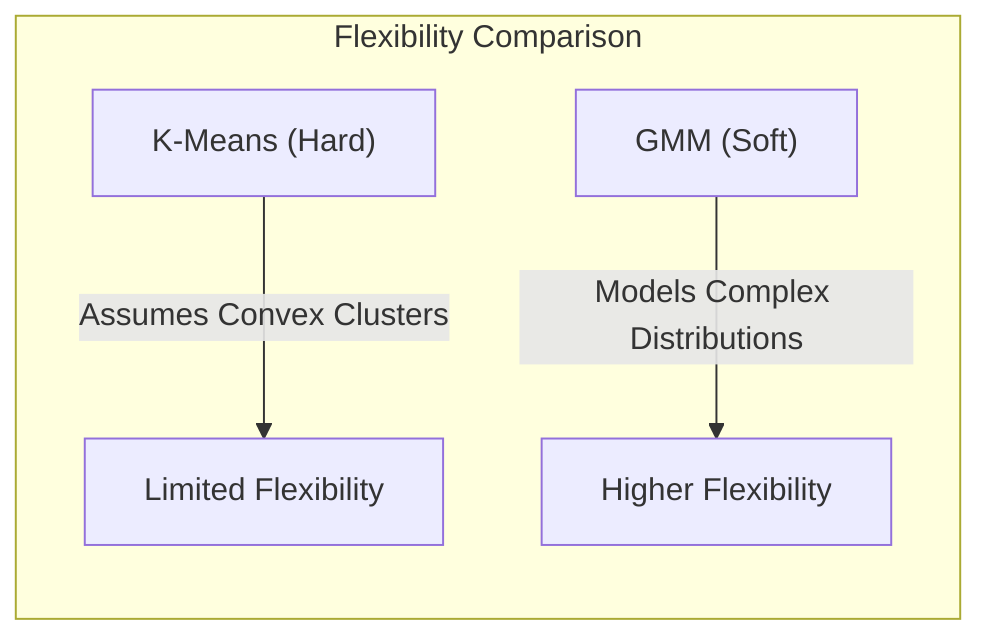
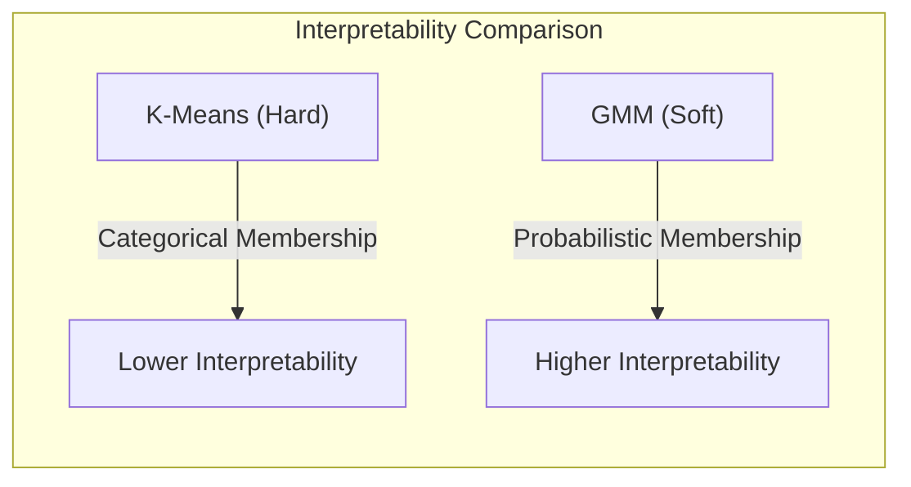
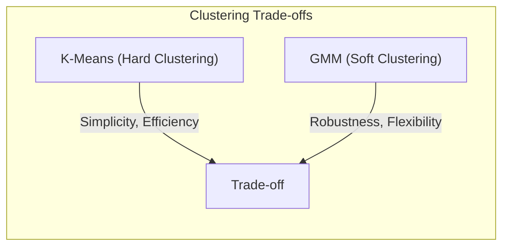

## *Soft Clustering* e Atribuição de Classes com Misturas Gaussianas: Uma Abordagem Probabilística em Contraste com o *Hard Clustering* do K-Means

<image: Diagrama comparando o *hard clustering* do K-Means com o *soft clustering* das Misturas Gaussianas, mostrando como o K-Means atribui cada ponto a um único cluster, enquanto as GMMs atribuem probabilidades de pertinência a cada componente gaussiana.>


### Introdução

Este capítulo compara o conceito de **soft clustering** e atribuição de classes com **misturas gaussianas (GMMs)** com o **hard clustering** do algoritmo **K-Means**, explorando como cada abordagem lida com a atribuição de pontos a *clusters* e como isso afeta o processo de classificação [^13.2.3]. No *hard clustering*, cada ponto é atribuído a um único *cluster* de forma exclusiva, enquanto no *soft clustering*, cada ponto recebe um grau de pertinência a cada *cluster* ou componente gaussiana. Analisaremos como essa diferença fundamental se manifesta nas abordagens do K-Means e das GMMs, e como a abordagem probabilística das GMMs pode levar a modelos mais robustos e capazes de lidar com incertezas nas atribuições de classe.

### *Hard Clustering* vs. *Soft Clustering*: Atribuições de Ponto a *Clusters*

A principal distinção entre **hard clustering** e **soft clustering** reside na forma como os pontos de dados são atribuídos aos *clusters*. No **hard clustering**, cada ponto de dados é atribuído a um único *cluster* de forma exclusiva, o que significa que cada ponto pertence a apenas um dos *clusters* definidos.

Por outro lado, no **soft clustering**, cada ponto de dados recebe um grau de pertinência a cada *cluster*, o que significa que um ponto pode pertencer a vários *clusters* com diferentes probabilidades ou pesos. O *soft clustering* é útil em situações onde a fronteira entre *clusters* não é clara, ou quando os pontos podem ser considerados como pertencendo parcialmente a diferentes agrupamentos.


No contexto de métodos de *clustering*, o K-Means é um exemplo clássico de *hard clustering*, enquanto as Misturas Gaussianas (GMMs) representam um exemplo de *soft clustering*. Essa diferença na forma como os pontos são atribuídos aos *clusters* impacta a maneira como os modelos são construídos e como as decisões de classificação são tomadas.

**Lemma 63:** No *hard clustering*, cada ponto é atribuído a um único *cluster*, enquanto no *soft clustering* cada ponto recebe um grau de pertinência a cada *cluster*, refletindo diferentes abordagens para representar a estrutura dos dados.
*Prova*: No *hard clustering*, o resultado de um algoritmo de *clustering* é uma partição do conjunto de dados em *clusters* disjuntos, enquanto no *soft clustering* o resultado é uma matriz de pertinências de cada ponto a cada *cluster*. $\blacksquare$

**Corolário 63:** A escolha entre *hard clustering* e *soft clustering* depende da natureza do problema, sendo o *soft clustering* mais adequado para dados ambíguos ou sobrepostos.

> ⚠️ **Nota Importante**: O *hard clustering* atribui cada ponto a um único *cluster*, enquanto o *soft clustering* atribui a cada ponto um grau de pertinência a cada *cluster*.

> ❗ **Ponto de Atenção**:  A escolha entre *hard clustering* e *soft clustering* impacta a forma como os modelos são ajustados e interpretados, e a melhor escolha depende dos objetivos da análise.

### K-Means: Uma Abordagem de *Hard Clustering*

O algoritmo **K-Means** é um exemplo clássico de **hard clustering**. No K-Means, cada ponto de dados é atribuído a um único *cluster* de forma exclusiva [^13.2.1]. A atribuição de um ponto a um *cluster* é feita com base na proximidade do ponto ao centro do *cluster*, onde a distância Euclidiana é a métrica mais comum.


Em cada iteração do K-Means, cada ponto é atribuído ao *cluster* cujo centro é o mais próximo. Isso significa que a cada ponto é dado um rótulo de *cluster* de forma exclusiva, e não há graus de pertinência a diferentes *clusters*. A etapa de atualização do K-Means calcula os novos centros dos *clusters* com base nos pontos que foram a eles atribuídos, mas sempre com o conceito de cada ponto pertencer a um único cluster.

O K-Means é uma abordagem simples e eficiente para encontrar agrupamentos nos dados, e seu objetivo principal é particionar os dados em *clusters* disjuntos. No entanto, essa natureza de *hard clustering* pode ser limitante em situações onde as fronteiras entre *clusters* não são claras ou quando os pontos podem pertencer parcialmente a mais de um grupo.

**Lemma 64:** O K-Means é um algoritmo de *hard clustering* que busca particionar o conjunto de dados em *clusters* disjuntos, atribuindo cada ponto a um único cluster.
*Prova*: A regra de atribuição do K-Means força cada ponto a ser alocado a um único centro de cluster, e o algoritmo busca um mínimo da variância intra-cluster, ou seja, um agrupamento disjunto. $\blacksquare$

**Corolário 64:** A atribuição exclusiva de cada ponto a um cluster pode ser limitante em situações onde os dados não apresentam *clusters* bem definidos e separados.

> ⚠️ **Nota Importante**: O K-Means é uma abordagem de *hard clustering*, onde cada ponto é atribuído a um único *cluster* de forma exclusiva, e não há graus de pertinência.

> ❗ **Ponto de Atenção**:  A abordagem de *hard clustering* do K-Means pode ser sensível a *outliers* e não consegue representar cenários onde as fronteiras entre *clusters* são sobrepostas.

> 💡 **Exemplo Numérico:**
Vamos considerar um exemplo simples com dois *clusters* e alguns pontos de dados. Suponha que temos os seguintes pontos em um espaço bidimensional:
```python
import numpy as np
import matplotlib.pyplot as plt
from sklearn.cluster import KMeans

# Dados de exemplo
X = np.array([[1, 2], [1.5, 1.8], [5, 8], [8, 8], [1, 0.6], [9, 11]])

# Inicializa o KMeans com 2 clusters
kmeans = KMeans(n_clusters=2, random_state=0, n_init = 'auto')

# Ajusta o modelo
kmeans.fit(X)

# Obtém os rótulos dos clusters e os centros
labels = kmeans.labels_
centers = kmeans.cluster_centers_

# Visualiza os clusters
plt.scatter(X[:, 0], X[:, 1], c=labels, cmap='viridis', edgecolors='k')
plt.scatter(centers[:, 0], centers[:, 1], c='red', marker='X', s=200, label='Centroids')
plt.title('K-Means Clustering')
plt.xlabel('Feature 1')
plt.ylabel('Feature 2')
plt.legend()
plt.show()

print("Labels:", labels)
print("Centroids:", centers)
```
Neste exemplo, o K-Means atribui cada ponto a um dos dois *clusters*, com base na distância Euclidiana aos seus respectivos centros. Os pontos [1, 2], [1.5, 1.8], [1, 0.6] são atribuídos a um *cluster*, enquanto [5, 8], [8, 8], [9, 11] são atribuídos ao outro. Cada ponto tem um único rótulo de *cluster*, demonstrando a natureza de *hard clustering* do K-Means.

### GMMs: Uma Abordagem de *Soft Clustering* e Atribuição de Classe Probabilística

As **Misturas Gaussianas (GMMs)** representam uma abordagem de **soft clustering**, onde cada ponto recebe um grau de pertinência a cada componente gaussiana, que por sua vez está associada a uma classe [^13.2.3]. Em vez de atribuir cada ponto a uma única componente, como no K-Means, as GMMs calculam a probabilidade de cada ponto pertencer a cada componente gaussiana.


Essa abordagem probabilística permite que os pontos sejam considerados como pertencendo parcialmente a diferentes componentes gaussianas, o que é mais flexível do que a atribuição exclusiva do K-Means. A classificação de novos pontos em uma abordagem de GMM é feita atribuindo a cada ponto um vetor de probabilidades que indica a probabilidade do ponto pertencer a cada componente, e a classe atribuída ao ponto é aquela com a maior probabilidade *a posteriori*.

Essa abordagem probabilística oferece uma forma mais robusta de lidar com incertezas e sobreposições nos dados. As GMMs também apresentam uma maior capacidade de representar distribuições complexas e multimodais, por meio da combinação de várias gaussianas.

**Lemma 65:** As GMMs utilizam *soft clustering*, atribuindo a cada ponto uma probabilidade de pertencer a cada componente gaussiana, e a classificação é feita com base na probabilidade *a posteriori* da componente gaussiana, o que permite representar incertezas e sobreposição de *clusters*.
*Prova*: A probabilidade *a posteriori* de um ponto pertencer a uma gaussiana é obtida diretamente das distribuições gaussianas, o que permite que um ponto possa ter diferentes níveis de pertinência para cada gaussiana. $\blacksquare$

**Corolário 65:** A abordagem probabilística das GMMs oferece maior robustez e flexibilidade na classificação, permitindo o tratamento de dados com diferentes níveis de incerteza e sobreposição de clusters.

> ⚠️ **Nota Importante**: As GMMs utilizam *soft clustering*, onde cada ponto recebe um grau de pertinência a cada componente gaussiana, e a classificação é baseada em probabilidades *a posteriori*.

> ❗ **Ponto de Atenção**:  A abordagem de *soft clustering* das GMMs permite representar a incerteza sobre a atribuição dos dados, e fornece um modelo mais flexível do que o *hard clustering* do K-Means.

> 💡 **Exemplo Numérico:**
Vamos usar os mesmos dados do exemplo anterior, mas agora com GMM.
```python
import numpy as np
import matplotlib.pyplot as plt
from sklearn.mixture import GaussianMixture

# Dados de exemplo
X = np.array([[1, 2], [1.5, 1.8], [5, 8], [8, 8], [1, 0.6], [9, 11]])

# Inicializa o GMM com 2 componentes
gmm = GaussianMixture(n_components=2, random_state=0)

# Ajusta o modelo
gmm.fit(X)

# Obtém as probabilidades de cada ponto pertencer a cada componente
probs = gmm.predict_proba(X)

# Obtém os rótulos dos clusters (para visualização)
labels = gmm.predict(X)

# Centros das gaussianas
centers = gmm.means_

# Visualiza os clusters
plt.scatter(X[:, 0], X[:, 1], c=labels, cmap='viridis', edgecolors='k')
plt.scatter(centers[:, 0], centers[:, 1], c='red', marker='X', s=200, label='Means')
plt.title('GMM Clustering')
plt.xlabel('Feature 1')
plt.ylabel('Feature 2')
plt.legend()
plt.show()


print("Probabilidades de Pertinência:\n", probs)
print("Labels:", labels)
print("Means:", centers)
```
Neste exemplo, o GMM calcula a probabilidade de cada ponto pertencer a cada uma das duas componentes gaussianas. Por exemplo, o ponto [1, 2] pode ter uma probabilidade de 0.95 de pertencer à primeira componente e 0.05 à segunda, enquanto o ponto [5, 8] pode ter probabilidades de 0.1 e 0.9, respectivamente. Isso demonstra que os pontos podem ter diferentes graus de pertinência, refletindo a natureza de *soft clustering* das GMMs. Os rótulos de cluster são obtidos atribuindo cada ponto ao cluster com maior probabilidade, mas as probabilidades de pertinência representam uma informação mais completa.

### Implicações da Atribuição *Soft* e *Hard* na Classificação

A diferença entre a atribuição *soft* e *hard* tem implicações diretas na forma como os modelos de classificação são construídos e utilizados:

1.  **Robustez:** A abordagem de *soft clustering* das GMMs permite que o modelo lide melhor com a incerteza na atribuição de pontos, resultando em modelos mais robustos e com melhor capacidade de generalização. No K-Means, a atribuição exclusiva de cada ponto a um único *cluster* pode levar a modelos mais sensíveis a ruídos ou *outliers*.

2.  **Flexibilidade:** A modelagem das distribuições por meio de GMMs permite que o modelo se adapte melhor a dados com distribuições complexas ou multimodais, enquanto a abordagem do K-Means assume que os *clusters* são aproximadamente convexos.

3.  **Interpretabilidade:** A abordagem probabilística das GMMs oferece uma forma mais rica de interpretar o funcionamento do modelo, onde a pertinência a cada classe é expressa por probabilidades, ao contrário do K-Means, onde a pertença a uma classe é categórica.

4.  **Informações sobre Incerteza:** Ao utilizar probabilidades *a posteriori*, os métodos GMM fornecem informações sobre a incerteza da classificação, indicando se um dado ponto de consulta é atribuído com alta ou baixa confiança.

**Lemma 66:** A atribuição *soft* permite aos modelos GMM lidar com incertezas e sobreposições entre os *clusters*, o que resulta em modelos mais robustos para classificação do que a atribuição *hard* do K-Means.
*Prova*: O uso de probabilidades *a posteriori* no GMM permite representar explicitamente a incerteza na classificação, e o modelo é capaz de se adaptar e lidar melhor com dados sobrepostos ou ambíguos. $\blacksquare$

**Corolário 66:** A capacidade de lidar com incerteza é uma vantagem do *soft clustering* em relação ao *hard clustering*, o que torna o *soft clustering* mais adequado para dados onde a definição das classes não é nítida.

> ⚠️ **Nota Importante**: A atribuição *soft* de pontos a *clusters* nas GMMs oferece maior flexibilidade e robustez em comparação com a atribuição *hard* do K-Means.

> ❗ **Ponto de Atenção**:  A escolha entre *hard clustering* e *soft clustering* depende da natureza dos dados e do nível de incerteza associado ao problema em questão.

### Conclusão

A distinção entre *soft clustering* e *hard clustering* é fundamental para compreender a abordagem de modelagem dos métodos de protótipos, e a escolha entre eles depende da natureza do problema e das características dos dados. O K-Means, com sua abordagem de *hard clustering*, busca particionar os dados em *clusters* disjuntos e de forma exclusiva, o que pode ser limitante em certas situações. As Misturas Gaussianas (GMMs), com sua abordagem de *soft clustering*, oferecem maior flexibilidade e robustez, permitindo que cada ponto tenha um grau de pertinência a diferentes componentes gaussianas e lidando de forma mais adequada com dados onde as fronteiras entre *clusters* não são claras. A escolha entre *hard clustering* e *soft clustering* deve considerar o *tradeoff* entre simplicidade, eficiência computacional, robustez e a necessidade de representar a incerteza e a sobreposição de dados no problema em questão.


### Footnotes

[^13.2.3]: "The Gaussian mixture model can also be thought of as a prototype method, similar in spirit to K-means and LVQ. We discuss Gaussian mixtures in some detail in Sections 6.8, 8.5 and 12.7...As a consequence, the Gaussian mixture model is often referred to as a soft clustering method, while K-means is hard...Similarly, when Gaussian mixture models are used to represent the feature density in each class, it produces smooth posterior probabilities." *(Trecho de "13. Prototype Methods and Nearest-Neighbors")*

[^13.2.1]: "K-means clustering is a method for finding clusters and cluster centers in a set of unlabeled data...To use K-means clustering for classification of labeled data, the steps are: apply K-means clustering to the training data in each class separately, using R prototypes per class; assign a class label to each of the K × R prototypes; classify a new feature x to the class of the closest prototype." *(Trecho de "13. Prototype Methods and Nearest-Neighbors")*
```
