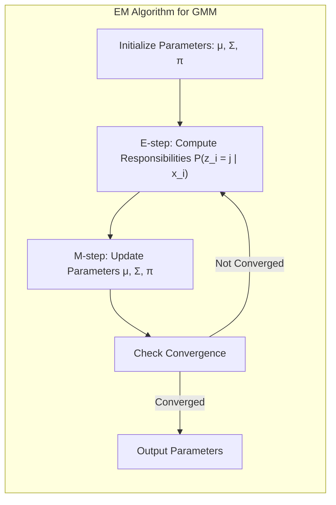
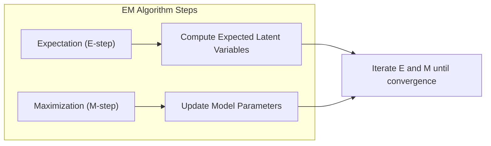
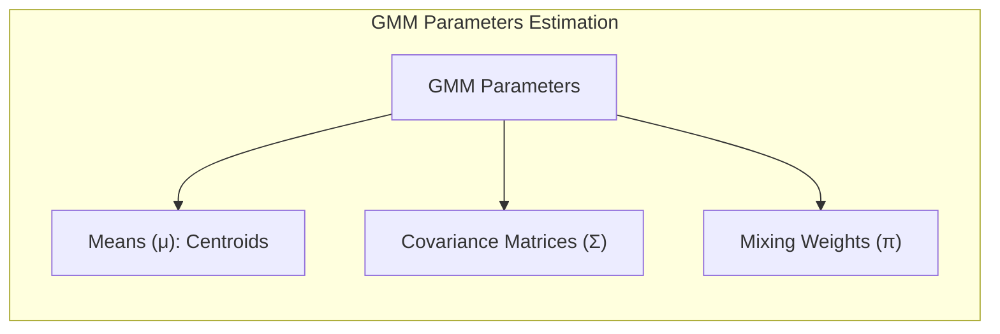
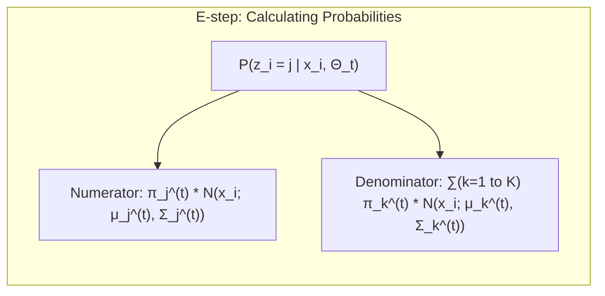
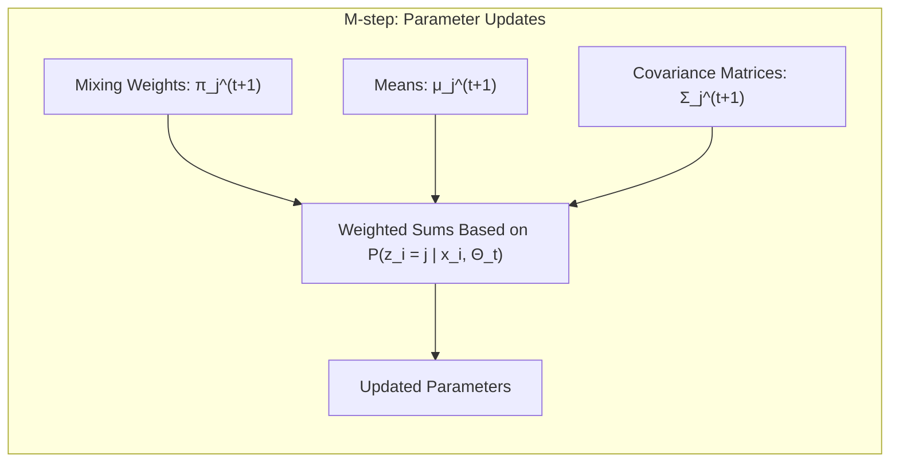

## Algoritmo EM: Estimativa de Parâmetros em Modelos de Misturas Gaussianas

### Introdução

Este capítulo detalha o **algoritmo Expectation-Maximization (EM)**, explorando seu papel na **estimativa de parâmetros** em modelos de **misturas gaussianas (GMMs)** [^13.2.3]. O algoritmo EM é uma técnica iterativa para encontrar estimativas de máxima verossimilhança para modelos probabilísticos, especialmente útil quando os dados são incompletos ou quando existem variáveis latentes que não são diretamente observadas. Analisaremos como o algoritmo EM opera, alternando entre as etapas de Expectation (E-step) e Maximization (M-step), e como essa alternância garante a convergência do algoritmo para uma solução que maximiza a verossimilhança dos dados. Discutiremos também a importância do algoritmo EM no contexto das GMMs e como ele difere de outros métodos de otimização.

### O Algoritmo EM: Uma Abordagem para Estimativa de Máxima Verossimilhança

O algoritmo **Expectation-Maximization (EM)** é um método iterativo para encontrar estimativas de máxima verossimilhança para modelos probabilísticos, especialmente em casos onde os dados são incompletos ou onde existem **variáveis latentes** que não são diretamente observadas [^13.2.3]. Em problemas de aprendizado de máquina, variáveis latentes são aquelas que não são diretamente medidas, mas que influenciam as observações que podem ser coletadas, como a pertença de um ponto a um cluster em modelos de mistura.

O algoritmo EM alterna entre duas etapas principais:

1.  **Expectation (E-step):** Nesta etapa, calcula-se a esperança das variáveis latentes, dados os parâmetros atuais do modelo e os dados observados. Essa etapa envolve a estimação de um conjunto de probabilidades, com base na distribuição do modelo.
2.  **Maximization (M-step):** Nesta etapa, os parâmetros do modelo são atualizados para maximizar a verossimilhança dos dados, dado os valores esperados das variáveis latentes calculados na etapa E.

O algoritmo EM repete iterativamente as etapas E e M até que uma condição de convergência seja atingida. A convergência significa que a verossimilhança dos dados não melhora mais significativamente entre iterações ou até que um número máximo de iterações seja atingido.

**Lemma 67:** O algoritmo EM busca encontrar estimativas de máxima verossimilhança para os parâmetros de um modelo, utilizando um processo iterativo que alterna entre a estimativa das variáveis latentes e a maximização da função de verossimilhança.
*Prova*: A etapa E calcula as probabilidades de cada ponto para as componentes gaussianas (variáveis latentes) utilizando a função de verossimilhança, e a etapa M utiliza essa probabilidade para recalcular os parâmetros das gaussianas, maximizando a verossimilhança com os novos parâmetros. $\blacksquare$

**Corolário 67:** O algoritmo EM converge para um máximo local da função de verossimilhança, e a inicialização dos parâmetros afeta a solução final, necessitando de estratégias de múltiplas inicializações.

> ⚠️ **Nota Importante**: O algoritmo EM é uma técnica iterativa para encontrar estimativas de máxima verossimilhança em modelos probabilísticos, especialmente útil quando existem variáveis latentes.

> ❗ **Ponto de Atenção**: A inicialização dos parâmetros e a escolha do número de componentes gaussianas são aspectos cruciais para a convergência e o desempenho do algoritmo EM.

### Aplicação do Algoritmo EM em Misturas Gaussianas (GMMs)

Em modelos de **misturas gaussianas (GMMs)**, o algoritmo EM é utilizado para estimar os parâmetros das componentes gaussianas, que são os protótipos do modelo [^13.2.3]. Os parâmetros que precisam ser estimados em uma GMM são as médias (centróides), as matrizes de covariância e os pesos das componentes gaussianas.

1.  **Inicialização:** O algoritmo EM começa com a inicialização aleatória dos parâmetros das gaussianas, onde um centróide e uma matriz de covariância são gerados para cada componente da mistura.
2.  **Expectation (E-step):** Nesta etapa, é calculada a probabilidade de cada ponto de dados pertencer a cada componente gaussiana, dadas as estimativas atuais dos parâmetros. As probabilidades são calculadas utilizando a densidade gaussiana e a mistura de probabilidades *a priori*. Formalmente, a probabilidade *a posteriori* de um ponto $x_i$ pertencer à componente $j$ é dada por:

$$P(z_i = j | x_i) = \frac{\pi_j \mathcal{N}(x_i; \mu_j, \Sigma_j)}{\sum_{k=1}^K \pi_k \mathcal{N}(x_i; \mu_k, \Sigma_k)}$$

Onde $z_i$ é a componente gaussiana a qual o ponto $x_i$ pertence, $\pi_j$ é a probabilidade *a priori* da componente $j$, $\mathcal{N}(x_i; \mu_j, \Sigma_j)$ é a densidade gaussiana do ponto $x_i$ em relação à componente $j$ com média $\mu_j$ e covariância $\Sigma_j$.
3.  **Maximization (M-step):** Nesta etapa, os parâmetros das gaussianas (média, matriz de covariância e pesos) são atualizados para maximizar a verossimilhança dos dados, usando as probabilidades calculadas na etapa E. As médias e as covariâncias são recalculadas como médias ponderadas por estas probabilidades.

O algoritmo EM itera entre as etapas E e M até que a verossimilhança dos dados convirja.

**Lemma 68:** A aplicação do algoritmo EM em GMMs busca estimar os parâmetros das gaussianas (centróides, matrizes de covariância e probabilidades *a priori*), de modo a maximizar a verossimilhança dos dados sob o modelo de mistura gaussiana.
*Prova*: As etapas E e M, iteradas até a convergência, garantem o ajuste dos parâmetros do modelo GMM com o objetivo de maximizar a verossimilhança dos dados. $\blacksquare$

**Corolário 68:** O resultado do algoritmo EM aplicado às GMMs é um conjunto de gaussianas que modelam a distribuição dos dados, onde cada gaussiana define um protótipo usado no processo de classificação.

> ⚠️ **Nota Importante**:  O algoritmo EM é utilizado para ajustar os parâmetros das gaussianas em GMMs, e permite modelar a distribuição dos dados de forma flexível e precisa.

> ❗ **Ponto de Atenção**:  A inicialização dos parâmetros e a escolha do número de componentes gaussianas são aspectos críticos que influenciam o desempenho do algoritmo EM e que devem ser definidos com cuidado e validação.

### Etapas E e M em Detalhe

A etapa de **Expectation (E-step)** no algoritmo EM para GMMs consiste em calcular a probabilidade de cada ponto de dados pertencer a cada componente gaussiana, dados os parâmetros atuais do modelo [^13.2.3]. Formalmente, a probabilidade do ponto $x_i$ pertencer à componente $j$ é dada por:

$$P(z_i = j | x_i, \Theta_t) = \frac{\pi_j^{(t)} \mathcal{N}(x_i; \mu_j^{(t)}, \Sigma_j^{(t)})}{\sum_{k=1}^K \pi_k^{(t)} \mathcal{N}(x_i; \mu_k^{(t)}, \Sigma_k^{(t)})}$$

Onde $t$ indica a iteração atual do algoritmo, $z_i$ é a variável latente que representa o cluster da gaussiana a qual $x_i$ pertence, $\Theta_t$ representa os parâmetros do modelo na iteração $t$, $\pi_j^{(t)}$ é a probabilidade *a priori* da componente $j$, $\mu_j^{(t)}$ é a média da componente $j$, $\Sigma_j^{(t)}$ é a matriz de covariância da componente $j$ e $\mathcal{N}$ é a distribuição normal.

> 💡 **Exemplo Numérico:**
>
> Vamos supor que temos um conjunto de dados bidimensional e estamos usando um modelo GMM com duas componentes gaussianas (K=2). Em uma dada iteração *t*, temos os seguintes parâmetros estimados:
>
> - Componente 1: $\pi_1^{(t)} = 0.4$, $\mu_1^{(t)} = [1, 1]$, $\Sigma_1^{(t)} = \begin{bmatrix} 1 & 0 \\ 0 & 1 \end{bmatrix}$
> - Componente 2: $\pi_2^{(t)} = 0.6$, $\mu_2^{(t)} = [5, 5]$, $\Sigma_2^{(t)} = \begin{bmatrix} 2 & 0 \\ 0 & 2 \end{bmatrix}$
>
> Vamos considerar um ponto de dado $x_i = [2, 2]$.
>
> **Passo 1: Calcular a densidade gaussiana para cada componente:**
>
> A densidade gaussiana é dada por:
>
> $\mathcal{N}(x; \mu, \Sigma) = \frac{1}{\sqrt{(2\pi)^k |\Sigma|}} \exp\left(-\frac{1}{2}(x-\mu)^T \Sigma^{-1} (x-\mu)\right)$
>
> Onde k é a dimensão do dado (k=2 neste caso).
>
> Para a componente 1:
>
> $\mathcal{N}(x_i; \mu_1^{(t)}, \Sigma_1^{(t)}) = \frac{1}{2\pi} \exp\left(-\frac{1}{2} \begin{bmatrix} 2-1 \\ 2-1 \end{bmatrix}^T \begin{bmatrix} 1 & 0 \\ 0 & 1 \end{bmatrix}^{-1} \begin{bmatrix} 2-1 \\ 2-1 \end{bmatrix}\right) = \frac{1}{2\pi} \exp\left(-\frac{1}{2} [1, 1] \begin{bmatrix} 1 \\ 1 \end{bmatrix}\right) = \frac{1}{2\pi} \exp(-1) \approx 0.0585$
>
> Para a componente 2:
>
> $\mathcal{N}(x_i; \mu_2^{(t)}, \Sigma_2^{(t)}) = \frac{1}{2\pi\sqrt{4}} \exp\left(-\frac{1}{2} \begin{bmatrix} 2-5 \\ 2-5 \end{bmatrix}^T \begin{bmatrix} 0.5 & 0 \\ 0 & 0.5 \end{bmatrix} \begin{bmatrix} 2-5 \\ 2-5 \end{bmatrix}\right) = \frac{1}{4\pi} \exp\left(-\frac{1}{2} [-3, -3] \begin{bmatrix} -1.5 \\ -1.5 \end{bmatrix}\right) = \frac{1}{4\pi} \exp(-4.5) \approx 0.0013$
>
> **Passo 2: Calcular a probabilidade a posteriori:**
>
> $P(z_i = 1 | x_i, \Theta_t) = \frac{0.4 \times 0.0585}{0.4 \times 0.0585 + 0.6 \times 0.0013} = \frac{0.0234}{0.0234 + 0.00078} \approx 0.967$
>
> $P(z_i = 2 | x_i, \Theta_t) = \frac{0.6 \times 0.0013}{0.4 \times 0.0585 + 0.6 \times 0.0013} = \frac{0.00078}{0.0234 + 0.00078} \approx 0.033$
>
> Assim, neste exemplo, o ponto $x_i = [2, 2]$ tem uma probabilidade de 96.7% de pertencer à componente 1 e 3.3% de pertencer à componente 2.

Na etapa de **Maximization (M-step)**, os parâmetros das componentes gaussianas são atualizados para maximizar a verossimilhança dos dados, usando os valores esperados das variáveis latentes calculadas na etapa E. Os novos valores para os parâmetros são dados por:

$$\pi_j^{(t+1)} = \frac{1}{N} \sum_{i=1}^N P(z_i = j | x_i, \Theta_t)$$
$$\mu_j^{(t+1)} = \frac{\sum_{i=1}^N P(z_i = j | x_i, \Theta_t) x_i}{\sum_{i=1}^N P(z_i = j | x_i, \Theta_t)}$$
$$\Sigma_j^{(t+1)} = \frac{\sum_{i=1}^N P(z_i = j | x_i, \Theta_t)(x_i - \mu_j^{(t+1)})(x_i - \mu_j^{(t+1)})^T}{\sum_{i=1}^N P(z_i = j | x_i, \Theta_t)}$$

Onde $N$ é o número de dados de treino, $\pi_j^{(t+1)}$, $\mu_j^{(t+1)}$ e $\Sigma_j^{(t+1)}$ são os novos parâmetros da componente $j$ na iteração $t+1$.

> 💡 **Exemplo Numérico:**
>
> Continuando o exemplo anterior, suponha que tenhamos três pontos de dados:
>
> $x_1 = [2, 2]$, $x_2 = [1, 0]$, $x_3 = [6, 6]$
>
> E as probabilidades calculadas na Etapa E para cada ponto e cada componente são:
>
> | Ponto | $P(z_i = 1 | x_i, \Theta_t)$ | $P(z_i = 2 | x_i, \Theta_t)$ |
> |-------|----------------------------|----------------------------|
> | $x_1$ | 0.967                      | 0.033                      |
> | $x_2$ | 0.99                       | 0.01                       |
> | $x_3$ | 0.02                       | 0.98                       |
>
> **Passo 1: Atualizar os pesos $\pi_j$:**
>
> $\pi_1^{(t+1)} = \frac{1}{3} (0.967 + 0.99 + 0.02) = \frac{1.977}{3} \approx 0.659$
>
> $\pi_2^{(t+1)} = \frac{1}{3} (0.033 + 0.01 + 0.98) = \frac{1.023}{3} \approx 0.341$
>
> **Passo 2: Atualizar as médias $\mu_j$:**
>
> $\mu_1^{(t+1)} = \frac{0.967 * [2, 2] + 0.99 * [1, 0] + 0.02 * [6, 6]}{0.967 + 0.99 + 0.02} = \frac{[1.934, 1.934] + [0.99, 0] + [0.12, 0.12]}{1.977} = \frac{[3.044, 2.054]}{1.977} \approx [1.54, 1.04]$
>
> $\mu_2^{(t+1)} = \frac{0.033 * [2, 2] + 0.01 * [1, 0] + 0.98 * [6, 6]}{0.033 + 0.01 + 0.98} = \frac{[0.066, 0.066] + [0.01, 0] + [5.88, 5.88]}{1.023} = \frac{[5.956, 5.946]}{1.023} \approx [5.82, 5.81]$
>
> **Passo 3: Atualizar as matrizes de covariância $\Sigma_j$:**
>
> Este passo envolve cálculos mais complexos, mas o princípio é similar:
>
> $\Sigma_j^{(t+1)} = \frac{\sum_{i=1}^N P(z_i = j | x_i, \Theta_t)(x_i - \mu_j^{(t+1)})(x_i - \mu_j^{(t+1)})^T}{\sum_{i=1}^N P(z_i = j | x_i, \Theta_t)}$
>
> Onde $(x_i - \mu_j^{(t+1)})(x_i - \mu_j^{(t+1)})^T$ é o produto externo do vetor $(x_i - \mu_j^{(t+1)})$ consigo mesmo.
>
> Por exemplo, para a primeira componente e o ponto $x_1$:
>
> $(x_1 - \mu_1^{(t+1)})(x_1 - \mu_1^{(t+1)})^T = \begin{bmatrix} 2 - 1.54 \\ 2 - 1.04 \end{bmatrix} \begin{bmatrix} 2 - 1.54 & 2 - 1.04 \end{bmatrix} = \begin{bmatrix} 0.46 \\ 0.96 \end{bmatrix} \begin{bmatrix} 0.46 & 0.96 \end{bmatrix} = \begin{bmatrix} 0.2116 & 0.4416 \\ 0.4416 & 0.9216 \end{bmatrix}$
>
> Este processo é repetido para todos os pontos e componentes, somando e normalizando pelo peso total para obter $\Sigma_j^{(t+1)}$.
>
> Estes novos parâmetros são então usados na próxima iteração da Etapa E.

**Lemma 69:** As etapas E e M do algoritmo EM aplicado a GMMs garantem que a verossimilhança dos dados, dado o modelo, não decresça em cada iteração.
*Prova*: A etapa E estima as probabilidades de pertinência de cada ponto a cada componente gaussiana, e a etapa M utiliza essas probabilidades para atualizar os parâmetros das gaussianas, garantindo a maximização da verossimilhança. $\blacksquare$

**Corolário 69:** As etapas E e M buscam um mínimo local da função de custo, por isso é necessário realizar múltiplas inicializações para buscar um resultado mais próximo do ótimo global.

> ⚠️ **Nota Importante**: As etapas E e M do algoritmo EM são calculadas iterativamente, buscando a convergência dos parâmetros do modelo GMM para valores que maximizem a verossimilhança dos dados.

> ❗ **Ponto de Atenção**: O algoritmo EM converge para um máximo local, e a escolha inicial dos parâmetros pode afetar a solução final.

### Conclusão

O algoritmo EM é uma ferramenta poderosa para estimar os parâmetros de modelos de misturas gaussianas, permitindo modelar distribuições complexas e multimodais. A alternância entre as etapas E e M garante a convergência para um máximo local da verossimilhança dos dados, e os parâmetros estimados (centróides e matrizes de covariância) são utilizados como protótipos para a classificação de novos pontos. A compreensão do funcionamento interno do algoritmo EM é essencial para utilizar e ajustar GMMs de forma eficaz em problemas de aprendizado de máquina.

### Footnotes

[^13.2.3]: "The Gaussian mixture model can also be thought of as a prototype method, similar in spirit to K-means and LVQ. We discuss Gaussian mixtures in some detail in Sections 6.8, 8.5 and 12.7. Each cluster is described in terms of a Gaussian density, which has a centroid (as in K-means), and a covariance matrix...The two steps of the alternating EM algorithm are very similar to the two steps in K-means: In the E-step, each observation is assigned a responsibility or weight for each cluster, based on the likelihood of each of the corresponding Gaussians. In the M-step, each observation contributes to the weighted means (and covariances) for every cluster." *(Trecho de "13. Prototype Methods and Nearest-Neighbors")*
