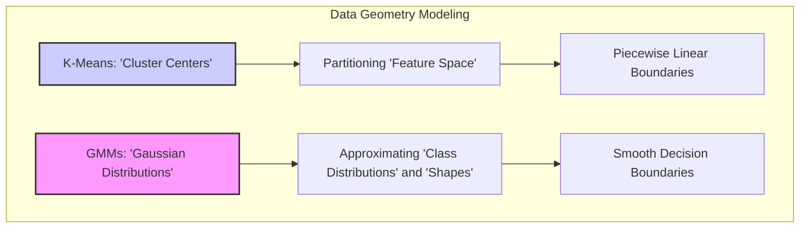
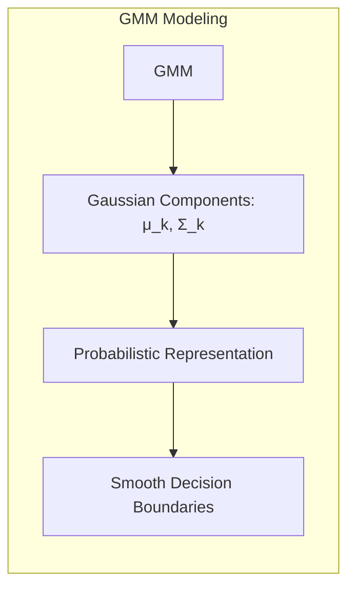
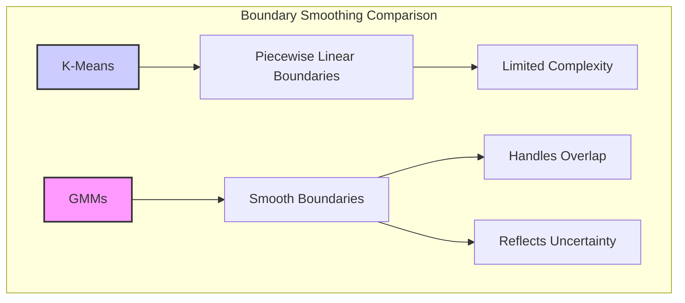
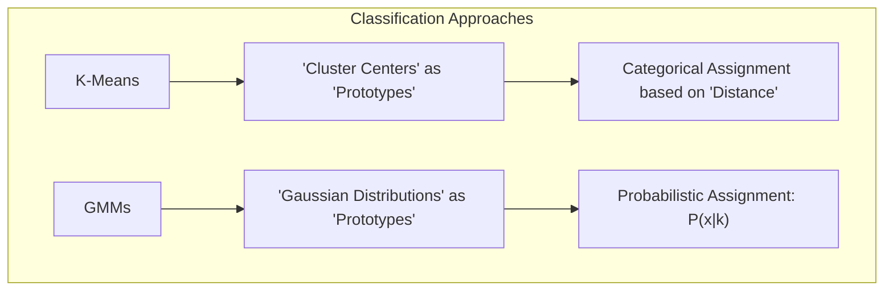
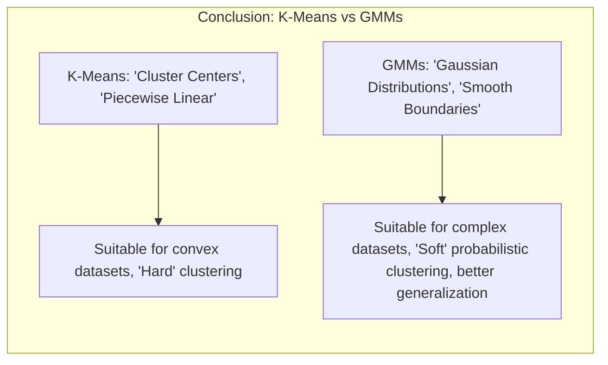

## Modelagem da Geometria dos Dados: Misturas Gaussianas vs. K-Means



### Introdução

Este capítulo compara a forma como as **misturas gaussianas (GMMs)** e o **K-Means** modelam a **geometria dos dados**, com foco em como cada técnica captura as distribuições das classes e suas fronteiras de decisão [^13.2.1], [^13.2.3]. Analisaremos como o K-Means utiliza centros de *clusters* para particionar o espaço de *features* e como as GMMs utilizam distribuições gaussianas, com seus centróides e matrizes de covariância, para aproximar as distribuições das classes. Exploraremos como essa diferença se manifesta na capacidade de modelar distribuições complexas e como as GMMs promovem um efeito de **suavização** nas fronteiras de decisão, resultando em classificações probabilísticas mais robustas do que as decisões categóricas obtidas pelo K-Means.

### K-Means: Particionamento e Representação por Centros de *Clusters*

O algoritmo **K-Means** modela a geometria dos dados utilizando um conjunto de **centros de *clusters*** que representam os centros das regiões de dados [^13.2.1]. O K-Means busca particionar o espaço de *features* em $R$ *clusters*, onde $R$ é um hiperparâmetro, atribuindo cada ponto de dados ao *cluster* cujo centro é o mais próximo. O resultado dessa partição é uma representação discreta do espaço de *features*, onde cada *cluster* é representado pelo seu centro.

A principal característica do K-Means é que as fronteiras entre os *clusters* são piecewise lineares, o que significa que as regiões de decisão formadas pelo K-means são compostas por segmentos de hiperplanos, e não necessariamente refletem a forma das regiões de dados, quando estas não são convexas. O K-Means não tenta modelar a distribuição dos dados, mas busca particionar o espaço de *features* em regiões disjuntas, onde cada região é representada por um ponto (seu centro).

**Lemma 70:** O K-Means modela a geometria dos dados por meio de centros de *clusters* e fronteiras piecewise lineares que particionam o espaço de *features*.
*Prova*: A regra de atribuição do K-means aloca cada ponto ao centro de cluster mais próximo, e a fronteira entre os *clusters* é definida pela igualdade entre as distâncias de um ponto aos centros de clusters. $\blacksquare$

**Corolário 70:** A abordagem do K-Means se baseia na distância a cada centróide, e não utiliza informação sobre a variância local ou sobre o formato da distribuição.

> ⚠️ **Nota Importante**: O K-Means modela a geometria dos dados utilizando centros de *clusters* e cria fronteiras de decisão piecewise lineares, o que pode ser limitado para distribuições de dados complexas.

> ❗ **Ponto de Atenção**: O K-Means não modela explicitamente a distribuição dos dados, mas busca encontrar agrupamentos de dados que são caracterizados por seus centros.

> 💡 **Exemplo Numérico:**
>
> Vamos considerar um conjunto de dados bidimensional com 6 pontos:
>
> $$X = \begin{bmatrix} 1 & 1 \\ 1 & 2 \\ 2 & 1 \\ 5 & 5 \\ 5 & 6 \\ 6 & 5 \end{bmatrix}$$
>
> Se aplicarmos o K-Means com $R=2$, o algoritmo pode convergir para dois centros de *cluster*, por exemplo:
>
> $$C_1 = \begin{bmatrix} 1.33 \\ 1.33 \end{bmatrix} \text{ e } C_2 = \begin{bmatrix} 5.33 \\ 5.33 \end{bmatrix}$$
>
> Os pontos $(1, 1)$, $(1, 2)$ e $(2, 1)$ seriam atribuídos ao *cluster* 1, e os pontos $(5, 5)$, $(5, 6)$ e $(6, 5)$ ao *cluster* 2. A fronteira de decisão, neste caso, seria uma linha reta que separa os dois grupos.
>
> ```mermaid
>  graph LR
>      A(1,1) --> C1(Cluster 1)
>      B(1,2) --> C1
>      C(2,1) --> C1
>      D(5,5) --> C2(Cluster 2)
>      E(5,6) --> C2
>      F(6,5) --> C2
>      style C1 fill:#f9f,stroke:#333,stroke-width:2px
>      style C2 fill:#ccf,stroke:#333,stroke-width:2px
> ```
>
> Note que o K-Means particiona o espaço com uma linha reta, e não considera a variância dos dados dentro de cada *cluster*.

### GMMs: Modelagem Probabilística e Suavização de Fronteiras

As **misturas gaussianas (GMMs)**, por outro lado, modelam a geometria dos dados utilizando distribuições gaussianas que descrevem a forma e a orientação das regiões de dados [^13.2.3]. Em vez de criar *clusters* separados por fronteiras lineares, as GMMs representam a distribuição de cada classe por meio de uma combinação de gaussianas, cada uma caracterizada por um centróide e uma matriz de covariância.


Essa abordagem probabilística permite que as GMMs capturem a complexidade da distribuição dos dados de forma mais precisa do que o K-Means. A sobreposição de gaussianas permite que a fronteira de decisão entre as classes seja mais suave, refletindo a incerteza nas regiões onde os dados de diferentes classes se sobrepõem. A classificação é baseada na probabilidade *a posteriori* de cada ponto pertencer a cada gaussiana, ou seja, é uma classificação probabilística que não atribui o ponto a um único agrupamento, mas sim um vetor de probabilidades de pertinência.

**Lemma 71:** As GMMs modelam a geometria dos dados por meio de distribuições gaussianas, que representam a média (centróide) e a variabilidade (matriz de covariância) dos dados, e promovem a suavização das fronteiras de decisão.
*Prova*: A utilização de gaussianas permite a aproximação de formas complexas, e a combinação de múltiplas gaussianas produz fronteiras suaves que capturam a incerteza das distribuições de cada classe. $\blacksquare$

**Corolário 71:** A natureza probabilística das GMMs permite representar a incerteza na atribuição das classes e criar modelos mais robustos para a classificação, em comparação com o modelo categórico resultante do K-Means.

> ⚠️ **Nota Importante**: As GMMs modelam a geometria dos dados por meio de distribuições gaussianas, criando fronteiras de decisão suaves e probabilísticas que representam a complexidade das distribuições.

> ❗ **Ponto de Atenção**: A modelagem probabilística das GMMs oferece uma representação mais rica da geometria dos dados, especialmente quando as classes apresentam sobreposição ou formas não convexas.

> 💡 **Exemplo Numérico:**
>
> Usando o mesmo conjunto de dados do exemplo anterior, $X$, uma GMM com duas gaussianas pode ajustar-se de forma diferente. Digamos que os parâmetros estimados para as gaussianas sejam:
>
> Gaussiana 1: $\mu_1 = \begin{bmatrix} 1.5 \\ 1.5 \end{bmatrix}$, $\Sigma_1 = \begin{bmatrix} 0.5 & 0 \\ 0 & 0.5 \end{bmatrix}$
>
> Gaussiana 2: $\mu_2 = \begin{bmatrix} 5.5 \\ 5.5 \end{bmatrix}$, $\Sigma_2 = \begin{bmatrix} 0.5 & 0 \\ 0 & 0.5 \end{bmatrix}$
>
> Para um novo ponto $x = \begin{bmatrix} 3 \\ 3 \end{bmatrix}$, o K-Means o atribuiria a um dos dois *clusters* de forma categórica, o mais próximo. No entanto, a GMM calcularia a probabilidade de $x$ pertencer a cada gaussiana.
>
> A probabilidade de um ponto $x$ pertencer à gaussiana $k$ é dada por:
>
> $$p(x|k) = \frac{1}{(2\pi)^{d/2}|\Sigma_k|^{1/2}} \exp\left(-\frac{1}{2}(x-\mu_k)^T\Sigma_k^{-1}(x-\mu_k)\right)$$
>
> Onde $d$ é a dimensão dos dados (2 neste caso). Calculando, obtemos que  $p(x|1) \approx 0.0000016$ e $p(x|2) \approx 0.0000016$. Note que como as gaussianas tem a mesma variância, a probabilidade de pertinencia é igual, e é bem baixa.
>
> A GMM não atribui $x$ a um *cluster* específico, mas fornece uma probabilidade de pertinência a cada gaussiana. A fronteira de decisão, neste caso, não é uma linha reta, mas uma região onde a probabilidade de pertinência às duas gaussianas é similar, promovendo uma suavização.

### A Suavização de Fronteiras: Uma Vantagem das GMMs

A capacidade de **suavização de fronteiras** é uma vantagem fundamental das GMMs em relação ao K-Means [^13.2.3]. Enquanto o K-Means cria fronteiras de decisão piecewise lineares, as GMMs utilizam distribuições gaussianas que permitem criar fronteiras de decisão suaves que refletem melhor a complexidade dos dados.


Nas regiões onde as distribuições das classes se sobrepõem, as GMMs fornecem probabilidades *a posteriori* que indicam a incerteza da classificação, enquanto o K-Means atribui o ponto a um único *cluster* com base na proximidade ao centróide mais próximo. Essa capacidade de lidar com incertezas e sobreposições torna as GMMs mais robustas em cenários onde as classes não são bem definidas ou onde existem dados com ruído.

A suavização das fronteiras nas GMMs resulta em uma melhor capacidade de generalização, pois o modelo não se ajusta a detalhes específicos do conjunto de treinamento, mas busca capturar a estrutura subjacente da distribuição dos dados. Além disso, a suavização reduz a sensibilidade do modelo a *outliers* e ruído, tornando o modelo mais adequado para cenários do mundo real.

**Lemma 72:** A utilização de gaussianas nas GMMs produz fronteiras de decisão suaves, que melhor representam a incerteza e sobreposição das distribuições, o que não ocorre com o K-Means.
*Prova*: A combinação de gaussianas com diferentes parâmetros (média e covariância) permite criar fronteiras de decisão complexas e suaves que se ajustam melhor aos dados. $\blacksquare$

**Corolário 72:** A suavização das fronteiras de decisão nas GMMs contribui para modelos mais robustos e com melhor capacidade de generalização do que as fronteiras categóricas resultantes do K-Means.

> ⚠️ **Nota Importante**: As GMMs promovem a suavização de fronteiras, o que permite modelos de classificação mais robustos e com melhor capacidade de lidar com incertezas nos dados.

> ❗ **Ponto de Atenção**: A modelagem da geometria dos dados com gaussianas e suavização de fronteiras é particularmente vantajosa em problemas onde as classes se sobrepõem ou onde existem ruídos nos dados.

> 💡 **Exemplo Numérico:**
>
> Considere um cenário onde temos duas classes de dados, uma com distribuição ligeiramente alongada e outra com distribuição mais circular. O K-Means, ao tentar particionar o espaço com fronteiras lineares, pode não conseguir capturar a forma das classes. Já uma GMM, com gaussianas com diferentes matrizes de covariância, pode ajustar-se melhor a essas formas.
>
> ```mermaid
>   graph LR
>       A[Dados Classe 1 - Alongada] --> C(GMM com Gaussiana Alongada)
>       B[Dados Classe 2 - Circular] --> D(GMM com Gaussiana Circular)
>       C --> F(Fronteira Suave)
>       D --> F
>       E[K-Means] --> G(Fronteira Linear)
>       style C fill:#f9f,stroke:#333,stroke-width:2px
>        style D fill:#ccf,stroke:#333,stroke-width:2px
>       style G fill:#eee,stroke:#333,stroke-width:2px
> ```
>
> A GMM, ao utilizar gaussianas, pode ajustar a forma de cada gaussiana à distribuição das classes, produzindo uma fronteira de decisão suave que reflete melhor a incerteza e a sobreposição entre as classes. O K-Means, por outro lado, resultaria em uma fronteira linear, o que não captura a complexidade das distribuições.

### Implicações para Classificação

A diferença na modelagem da geometria dos dados entre o K-Means e as GMMs tem implicações diretas no processo de classificação:

1.  **K-Means:** O K-Means utiliza centros de *clusters* como protótipos e atribui cada ponto à classe do protótipo mais próximo, o que resulta em uma classificação categórica baseada na distância.
2.  **GMMs:** As GMMs utilizam distribuições gaussianas como protótipos e atribuem a cada ponto um vetor de probabilidades *a posteriori*, o que permite que a classificação seja feita com base na probabilidade de pertinência a cada componente gaussiana, representando a incerteza na classificação.


Essa diferença na abordagem da classificação leva a diferentes resultados:

*   **Robustez:** As GMMs tendem a gerar modelos mais robustos do que o K-Means, devido à sua capacidade de lidar com incertezas e sobreposições nos dados.
*   **Suavidade:** As fronteiras de decisão das GMMs são mais suaves, e evitam regiões de decisão muito complexas e específicas a pontos de treinamento, o que aumenta a capacidade de generalização.
*   **Incerteza:** As GMMs fornecem informações sobre a incerteza da classificação, ao contrário do K-Means que atribui um rótulo categórico.

**Lemma 73:** A classificação com GMMs, baseada em probabilidades *a posteriori*, permite expressar a incerteza na classificação e gerar modelos mais robustos do que o K-Means, que produz classificações categóricas baseadas apenas em distâncias.
*Prova*: A abordagem probabilística do GMM fornece informação sobre a pertinência de cada ponto a cada componente gaussiana e, portanto, permite tomar decisões de classificação com base nessa incerteza. $\blacksquare$

**Corolário 73:** A abordagem probabilística de classificação das GMMs oferece uma representação mais rica do problema, com informações sobre a incerteza da classificação e a possibilidade de tomar decisões mais robustas.

> ⚠️ **Nota Importante**: As GMMs oferecem uma abordagem probabilística para classificação com informações sobre a incerteza da decisão, enquanto o K-Means oferece uma abordagem categórica, baseada na proximidade ao centroide mais próximo.

> ❗ **Ponto de Atenção**: A escolha entre K-Means e GMMs depende do problema, da complexidade dos dados e da necessidade de representar incertezas nas classificações.

> 💡 **Exemplo Numérico:**
>
> Imagine que estamos classificando imagens de frutas em duas classes: maçãs e laranjas. O K-Means pode atribuir uma imagem de uma maçã ligeiramente alaranjada (devido à iluminação, por exemplo) à classe "laranja", por ser o centroide mais próximo.
>
> Uma GMM, por outro lado, pode ter uma gaussiana para maçãs e outra para laranjas, mas com sobreposição. A imagem da maçã alaranjada teria uma probabilidade alta de pertencer à gaussiana de maçãs e uma probabilidade menor de pertencer à gaussiana de laranjas. Isso permite uma classificação mais robusta e que considera a incerteza na decisão.
>
> | Método | Classificação de Maçã Alaranjada | Tipo de Classificação | Incerteza |
> |--------|----------------------------------|----------------------|-----------|
> | K-Means | Laranja                         | Categórica           | Não       |
> | GMM    | 0.8 Maçã, 0.2 Laranja            | Probabilística        | Sim       |
>
> A tabela mostra como o K-Means atribui a imagem a uma classe de forma categórica, enquanto a GMM fornece uma probabilidade de pertinência a cada classe, expressando a incerteza da decisão.

### Conclusão

A modelagem da geometria dos dados por meio de GMMs oferece uma abordagem mais flexível e robusta do que o K-Means, especialmente quando as distribuições das classes apresentam complexidade, sobreposições ou não convexidade. As GMMs modelam as distribuições dos dados por meio de distribuições gaussianas, utilizando um processo de *soft clustering* que permite a suavização das fronteiras de decisão, o que resulta em modelos mais precisos e com melhor capacidade de generalização. A escolha do método mais adequado depende das características dos dados e dos objetivos do problema, sendo que o K-Means representa um ponto de partida para dados convexos e o GMM para dados de maior complexidade.



### Footnotes

[^13.2.1]: "K-means clustering is a method for finding clusters and cluster centers in a set of unlabeled data...To use K-means clustering for classification of labeled data, the steps are: apply K-means clustering to the training data in each class separately, using R prototypes per class; assign a class label to each of the K × R prototypes; classify a new feature x to the class of the closest prototype." *(Trecho de "13. Prototype Methods and Nearest-Neighbors")*

[^13.2.3]: "The Gaussian mixture model can also be thought of as a prototype method, similar in spirit to K-means and LVQ. We discuss Gaussian mixtures in some detail in Sections 6.8, 8.5 and 12.7...As a consequence, the Gaussian mixture model is often referred to as a soft clustering method, while K-means is hard...Similarly, when Gaussian mixture models are used to represent the feature density in each class, it produces smooth posterior probabilities." *(Trecho de "13. Prototype Methods and Nearest-Neighbors")*
