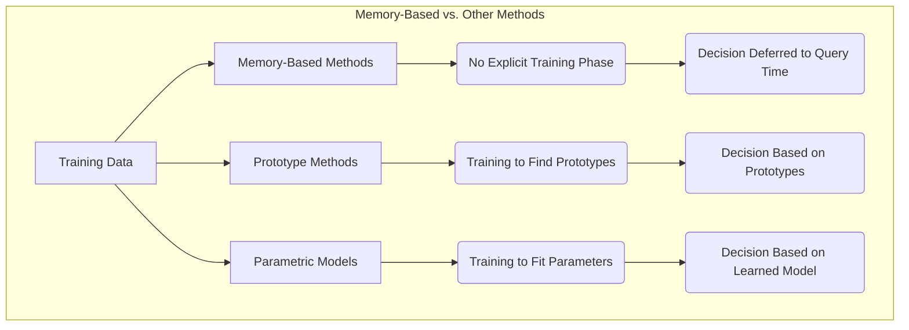
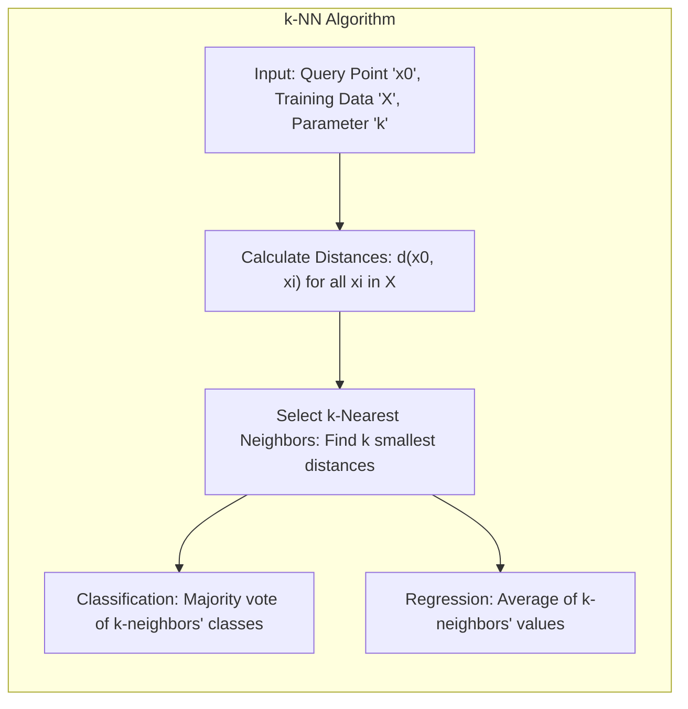
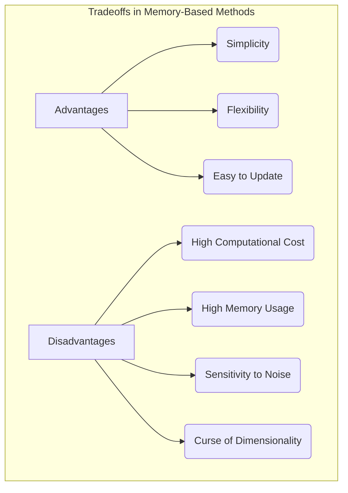
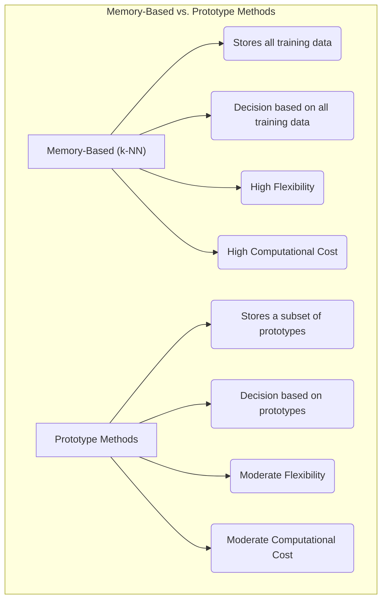

```markdown
## Métodos Baseados em Memória: Decisão Adiadas e Ausência de Treinamento



### Introdução

Este capítulo explora a natureza dos **métodos baseados em memória**, destacando sua principal característica: a **ausência de uma fase de treinamento explícita**, onde a **decisão** de classificação é adiada até que um **ponto de consulta** seja apresentado [^13.3]. Diferentemente de modelos paramétricos ou métodos de protótipos que requerem uma fase de aprendizado onde parâmetros são ajustados, os métodos baseados em memória armazenam o conjunto de dados de treinamento e utilizam este conjunto diretamente para classificar novos pontos, sem uma etapa de otimização. Analisaremos como o método de k-vizinhos mais próximos (k-NN) se encaixa nessa categoria, sua abordagem de classificação e como ele contrasta com outras técnicas de aprendizado de máquina que envolvem uma fase de treinamento separada.

### Métodos Baseados em Memória: Decisão Adiadas e Sem Treinamento Explícito

**Métodos baseados em memória** são um tipo de técnica de aprendizado de máquina que se caracteriza pela **ausência de uma fase de treinamento explícita** [^13.3]. Ao invés de utilizar o conjunto de dados de treinamento para ajustar parâmetros de um modelo, os métodos baseados em memória simplesmente armazenam todo o conjunto de dados e realizam a classificação ou regressão diretamente com base nas informações desse conjunto quando um ponto de consulta é apresentado.

A principal característica desses métodos é que a **decisão** de classificação ou regressão é adiada até que um novo ponto de consulta seja apresentado. Isso significa que o modelo não realiza nenhum processamento dos dados de treinamento antes de ser utilizado, e todo o trabalho é feito "sob demanda", quando um novo ponto precisa ser classificado ou previsto.

O método de k-vizinhos mais próximos (k-NN) é o exemplo mais comum de método baseado em memória. No k-NN, a classificação de um novo ponto é feita com base na votação majoritária entre os $k$ pontos de treinamento mais próximos ao ponto de consulta. Em regressão, o valor previsto é a média dos valores dos $k$ vizinhos mais próximos.

**Lemma 74:** Métodos baseados em memória não realizam treinamento explícito e adiam a decisão de classificação ou regressão até que um ponto de consulta seja apresentado, utilizando o conjunto de dados de treinamento diretamente no momento da decisão.
*Prova*: A definição dos métodos baseados em memória implica que nenhuma fase de treinamento separada é realizada para obter parâmetros e que a classificação é feita diretamente no momento da consulta, utilizando as informações das instâncias de treino. $\blacksquare$

**Corolário 74:** Métodos baseados em memória são também chamados de *lazy learners*, pois não realizam cálculos ou aprendizado com o conjunto de treino em uma fase separada, mas quando um novo ponto precisa ser classificado.

> ⚠️ **Nota Importante**: Métodos baseados em memória não envolvem uma fase de treinamento explícita, adiando a decisão até que um ponto de consulta seja apresentado.

> ❗ **Ponto de Atenção**: A decisão é feita com base na comparação do novo ponto com todo o conjunto de treinamento, o que pode ser computacionalmente custoso, especialmente em grandes conjuntos de dados.

### k-Vizinhos Mais Próximos (k-NN): Um Exemplo de Método Baseado em Memória

O método de **k-Vizinhos Mais Próximos (k-NN)** é um exemplo clássico de método baseado em memória [^13.3]. No k-NN, todo o conjunto de dados de treinamento é armazenado em memória, e a decisão de classificação (ou regressão) é realizada somente quando um novo ponto de consulta é apresentado.



Para classificar um novo ponto $x_0$, o k-NN executa os seguintes passos:

1.  **Cálculo das Distâncias:** A distância entre o ponto de consulta $x_0$ e todos os pontos de treinamento $x_i$ é calculada usando alguma métrica de distância (normalmente a distância Euclidiana).
2.  **Seleção dos Vizinhos Mais Próximos:** Os $k$ pontos de treinamento mais próximos do ponto de consulta $x_0$ são selecionados.
3.  **Classificação por Votação Majoritária:** O ponto de consulta $x_0$ é atribuído à classe que é mais frequente entre os $k$ vizinhos mais próximos.

Em problemas de regressão, o valor previsto para o ponto de consulta $x_0$ é a média dos valores da variável dependente dos $k$ vizinhos mais próximos.

**Lemma 75:** O k-NN não realiza treinamento explícito, mas utiliza os dados de treinamento no momento da classificação para decidir sobre a classe de um ponto novo, e a complexidade computacional desse cálculo depende do tamanho do conjunto de treino e do número de *features*.
*Prova*: O algoritmo do k-NN calcula a distância do ponto de consulta para todos os pontos do conjunto de treino no momento da consulta. $\blacksquare$

**Corolário 75:** O k-NN é um algoritmo não-paramétrico e a escolha do hiperparâmetro k influencia o balanço entre viés e variância do modelo.

> 💡 **Exemplo Numérico:**
>
> Vamos considerar um problema de classificação binária com um conjunto de treinamento composto por 5 pontos em um espaço bidimensional:
>
> - $A = (1, 1)$, Classe 0
> - $B = (2, 2)$, Classe 0
> - $C = (4, 3)$, Classe 1
> - $D = (5, 5)$, Classe 1
> - $E = (6, 2)$, Classe 1
>
> Agora, vamos classificar um novo ponto de consulta $x_0 = (3, 3)$ usando o k-NN com $k=3$.
>
> **Passo 1: Cálculo das distâncias** (usando a distância Euclidiana):
>
> - Distância entre $x_0$ e $A$: $\sqrt{(3-1)^2 + (3-1)^2} = \sqrt{8} \approx 2.83$
> - Distância entre $x_0$ e $B$: $\sqrt{(3-2)^2 + (3-2)^2} = \sqrt{2} \approx 1.41$
> - Distância entre $x_0$ e $C$: $\sqrt{(3-4)^2 + (3-3)^2} = \sqrt{1} = 1$
> - Distância entre $x_0$ e $D$: $\sqrt{(3-5)^2 + (3-5)^2} = \sqrt{8} \approx 2.83$
> - Distância entre $x_0$ e $E$: $\sqrt{(3-6)^2 + (3-2)^2} = \sqrt{10} \approx 3.16$
>
> **Passo 2: Seleção dos 3 vizinhos mais próximos:**
>
> Os 3 vizinhos mais próximos de $x_0$ são $C$ (1), $B$ (1.41) e $A$ (2.83).
>
> **Passo 3: Classificação por votação majoritária:**
>
> Os 3 vizinhos mais próximos são:
> - $C$ (Classe 1)
> - $B$ (Classe 0)
> - $A$ (Classe 0)
>
> A classe mais frequente entre os vizinhos é a Classe 0 (2 votos contra 1 voto da Classe 1). Portanto, o ponto de consulta $x_0 = (3,3)$ seria classificado como Classe 0.
>
> Este exemplo ilustra como o k-NN realiza a classificação sem uma fase de treinamento explícita, utilizando as informações do conjunto de dados no momento da consulta.

> ⚠️ **Nota Importante**: O k-NN é um método baseado em memória, que adia a decisão até que um novo ponto de consulta seja apresentado, usando o conjunto de dados de treinamento para realizar a classificação.

> ❗ **Ponto de Atenção**: A complexidade computacional do k-NN cresce com o tamanho do conjunto de treinamento, e o cálculo da distância para todos os pontos é uma das suas principais limitações.

### Vantagens e Desvantagens dos Métodos Baseados em Memória

Métodos baseados em memória apresentam algumas vantagens e desvantagens em comparação com outras abordagens de aprendizado de máquina:

**Vantagens:**

1.  **Simplicidade:** Métodos baseados em memória são simples de implementar, pois não requerem uma fase de treinamento complexa.
2.  **Flexibilidade:** Esses métodos são capazes de modelar fronteiras de decisão complexas e não lineares, adaptando-se à estrutura dos dados.
3.  **Facilidade de Atualização:** A inclusão de novas amostras de treinamento em um método baseado em memória é direta, pois não é necessário reajustar um modelo.

**Desvantagens:**

1.  **Alto Custo Computacional:** A classificação de um novo ponto requer o cálculo das distâncias entre o novo ponto e todos os pontos do conjunto de treinamento, o que pode ser computacionalmente custoso para grandes conjuntos de dados.
2.  **Alto Consumo de Memória:** O armazenamento do conjunto de treinamento completo requer grandes quantidades de memória, o que pode ser um problema em cenários com recursos computacionais limitados.
3.  **Sensibilidade ao Ruído:** Métodos baseados em memória podem ser sensíveis a *outliers* e ruídos no conjunto de treinamento.
4. **Maldição da dimensionalidade:** O desempenho de métodos baseados em memória em espaços de alta dimensionalidade degrada com o aumento do número de dimensões.



**Lemma 76:** Métodos baseados em memória apresentam um *tradeoff* entre simplicidade e capacidade de adaptação à forma dos dados, e seu desempenho é influenciado pelo tamanho do conjunto de treinamento e pela dimensionalidade do espaço de *features*.
*Prova*: A utilização de todo o conjunto de treino para classificação traz flexibilidade, mas a ausência de ajuste do modelo implica maior suscetibilidade a pontos atípicos e maiores custos computacionais. $\blacksquare$

**Corolário 76:** Técnicas de redução de dimensionalidade e de seleção de pontos de treino podem ser utilizadas para mitigar algumas das limitações de métodos baseados em memória.

> ⚠️ **Nota Importante**: Métodos baseados em memória oferecem simplicidade e flexibilidade, mas apresentam alto custo computacional e consumo de memória, além de sensibilidade ao ruído.

> ❗ **Ponto de Atenção**: A escolha entre métodos baseados em memória e outras abordagens de aprendizado de máquina deve levar em consideração as características do conjunto de dados, os requisitos computacionais e a necessidade de interpretabilidade do modelo.

### Métodos de Protótipos: Um *Tradeoff* entre Simplicidade e Representação

Em comparação com métodos baseados em memória, os **métodos de protótipos** oferecem um *tradeoff* entre simplicidade e capacidade de representação dos dados [^13.2]. Métodos de protótipos não realizam o aprendizado em uma fase separada, mas reduzem a representação do conjunto de dados por um subconjunto de protótipos. Em vez de armazenar todo o conjunto de treinamento, os métodos de protótipos armazenam um conjunto menor de protótipos que representam a distribuição das classes, resultando em menor custo computacional e de armazenamento.

A decisão de classificação é feita com base na proximidade do ponto de consulta aos protótipos, e não utilizando todo o conjunto de treino, como no k-NN. Essa abordagem reduz a complexidade dos cálculos e permite classificar dados em cenários com grandes conjuntos de dados.

No entanto, a representação por protótipos envolve a criação de uma representação simplificada da distribuição dos dados, o que pode levar a perda de detalhes finos e a modelos menos flexíveis do que o k-NN em casos específicos.

**Lemma 77:** Métodos de protótipos oferecem uma alternativa aos métodos baseados em memória que equilibra simplicidade com representatividade dos dados por meio da criação de protótipos.
*Prova*: Métodos de protótipos como K-means, LVQ e GMM utilizam uma quantidade menor de pontos para representar os dados de treinamento, resultando em modelos mais simples e com menor custo computacional do que o k-NN. $\blacksquare$

**Corolário 77:** A escolha entre métodos baseados em memória e protótipos envolve um *tradeoff* entre flexibilidade e custo computacional, com o k-NN sendo mais flexível, mas mais custoso, e métodos de protótipos oferecendo um bom balanço em termos de simplicidade, representatividade e custo.



> 💡 **Exemplo Numérico:**
>
> Suponha que temos um conjunto de dados com duas classes e queremos usar um método de protótipos baseado em K-means. Inicialmente, selecionamos 2 protótipos aleatoriamente para cada classe, totalizando 4 protótipos. Após algumas iterações do algoritmo K-means, os protótipos convergem para os seguintes pontos:
>
> - Protótipo 1 (Classe 0): (1.5, 1.5)
> - Protótipo 2 (Classe 0): (2.5, 2.5)
> - Protótipo 3 (Classe 1): (4.5, 3.5)
> - Protótipo 4 (Classe 1): (5.5, 4.5)
>
> Agora, ao classificar o mesmo ponto de consulta $x_0 = (3, 3)$, o método de protótipos calculará a distância de $x_0$ para cada protótipo e o atribuirá à classe do protótipo mais próximo:
>
> - Distância de $x_0$ ao Protótipo 1: $\sqrt{(3-1.5)^2 + (3-1.5)^2} = \sqrt{4.5} \approx 2.12$
> - Distância de $x_0$ ao Protótipo 2: $\sqrt{(3-2.5)^2 + (3-2.5)^2} = \sqrt{0.5} \approx 0.71$
> - Distância de $x_0$ ao Protótipo 3: $\sqrt{(3-4.5)^2 + (3-3.5)^2} = \sqrt{2.5} \approx 1.58$
> - Distância de $x_0$ ao Protótipo 4: $\sqrt{(3-5.5)^2 + (3-4.5)^2} = \sqrt{8.5} \approx 2.92$
>
> O protótipo mais próximo é o Protótipo 2 (Classe 0), portanto $x_0$ seria classificado como Classe 0.
>
> Este exemplo demonstra como métodos de protótipos reduzem a representação do conjunto de dados, diminuindo o custo computacional comparado com o k-NN, que utilizaria todos os dados de treino.

> ⚠️ **Nota Importante**: Métodos de protótipos oferecem um *tradeoff* entre simplicidade e capacidade de representação, enquanto métodos baseados em memória priorizam a flexibilidade e a ausência de treinamento explícito.

> ❗ **Ponto de Atenção**: A escolha entre métodos baseados em memória e métodos de protótipos depende do problema, da quantidade de dados, das necessidades computacionais e da precisão desejada.

### Conclusão

Métodos baseados em memória, como o k-NN, representam um paradigma de aprendizado de máquina que se caracteriza pela ausência de uma fase de treinamento explícita e pelo adiamento da decisão de classificação até que um ponto de consulta seja apresentado. Essa abordagem oferece simplicidade e flexibilidade, mas pode ser computacionalmente custosa e sensível ao ruído. Métodos de protótipos, por outro lado, oferecem um *tradeoff* entre simplicidade e representação dos dados por meio de um conjunto reduzido de protótipos, e um bom equilíbrio entre flexibilidade, capacidade de generalização e eficiência computacional. A escolha entre métodos baseados em memória e métodos de protótipos deve considerar a natureza do problema, a quantidade de dados, os recursos disponíveis e a necessidade de interpretabilidade do modelo.

### Footnotes

[^13.3]: "These classifiers are memory-based, and require no model to be fit. Given a query point xo, we find the k training points x(r), r = 1,..., k closest in distance to xo, and then classify using majority vote among the k neighbors." *(Trecho de "13. Prototype Methods and Nearest-Neighbors")*

[^13.2]: "Throughout this chapter, our training data consists of the N pairs (x1,91),...,(xn, 9N) where gi is a class label taking values in {1, 2, . . ., K}. Prototype methods represent the training data by a set of points in feature space. These prototypes are typically not examples from the training sample, except in the case of 1-nearest-neighbor classification discussed later. Each prototype has an associated class label, and classification of a query point x is made to the class of the closest prototype. "Closest" is usually defined by Euclidean distance in the feature space, after each feature has been standardized to have overall mean 0 and variance 1 in the training sample." *(Trecho de "13. Prototype Methods and Nearest-Neighbors")*

[^13.2.1]: "K-means clustering is a method for finding clusters and cluster centers in a set of unlabeled data...To use K-means clustering for classification of labeled data, the steps are: apply K-means clustering to the training data in each class separately, using R prototypes per class; assign a class label to each of the K × R prototypes; classify a new feature x to the class of the closest prototype." *(Trecho de "13. Prototype Methods and Nearest-Neighbors")*
```