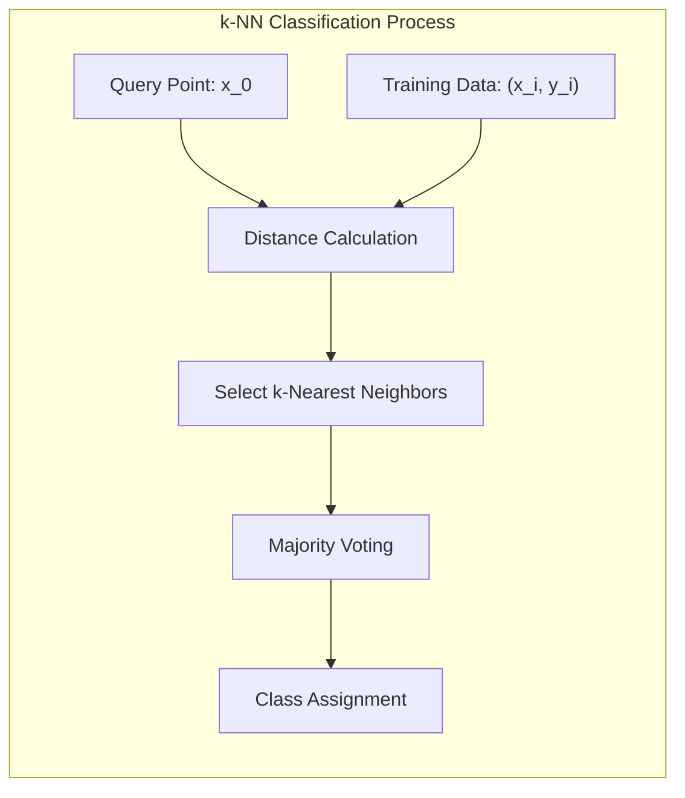
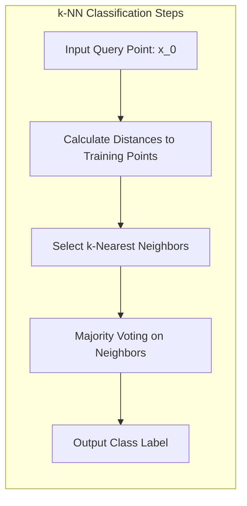
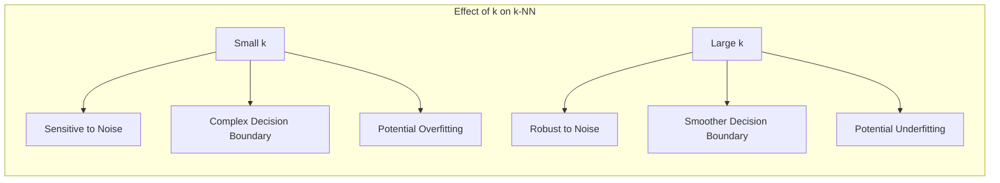

## Classificação por Votação Majoritária: Atribuindo um Ponto à Classe Mais Frequente entre Seus k-Vizinhos

### Introdução

Este capítulo detalha o processo de **classificação por votação majoritária** no contexto do método de **k-vizinhos mais próximos (k-NN)**, explorando como um ponto de consulta é atribuído à classe mais frequente entre seus $k$ vizinhos mais próximos no conjunto de treinamento [^13.3]. A ideia central do k-NN é que pontos próximos no espaço de *features* tendem a pertencer à mesma classe, e a classificação por votação majoritária é uma forma de agregar a informação dos vizinhos mais próximos para determinar a classe de um novo ponto. Analisaremos como esse mecanismo de votação opera, como a escolha do valor de $k$ influencia o processo de classificação, e como a votação majoritária se diferencia de outras abordagens de classificação.

### Classificação por Votação Majoritária: Agregando Informação dos Vizinhos

A **classificação por votação majoritária** é um método de classificação utilizado no algoritmo k-NN que atribui um ponto de consulta à classe mais frequente entre seus $k$ vizinhos mais próximos no conjunto de treinamento [^13.3]. Em vez de usar um único protótipo como referência, como em outros métodos de classificação, o k-NN utiliza as informações dos $k$ vizinhos mais próximos para tomar uma decisão sobre a classe do novo ponto.

O processo de classificação por votação majoritária envolve os seguintes passos:

1.  **Seleção dos k Vizinhos:** Para um novo ponto de consulta $x_0$, os $k$ pontos de treinamento mais próximos de $x_0$ são identificados, usando alguma métrica de distância (normalmente a distância Euclidiana).
2.  **Votação:** Cada um dos $k$ vizinhos "vota" em sua respectiva classe, isto é, cada vizinho contribui com seu rótulo de classe.
3.  **Atribuição:** O ponto de consulta $x_0$ é atribuído à classe que recebeu o maior número de votos entre os $k$ vizinhos mais próximos.

Em caso de empate (duas ou mais classes recebem o mesmo número de votos), a decisão pode ser tomada de forma aleatória entre as classes empatadas ou com outros métodos de desempate.

**Lemma 78:** A classificação por votação majoritária no k-NN atribui um novo ponto à classe que é mais frequente entre seus $k$ vizinhos mais próximos, ou seja, na região local ao ponto, utilizando a distribuição das classes nessa região para tomar a decisão.
*Prova*: Por definição do algoritmo do k-NN, a classe mais frequente entre os vizinhos é a classe atribuída ao novo ponto. $\blacksquare$

**Corolário 78:** A escolha do número de vizinhos $k$ tem um impacto significativo na decisão final, e o valor de $k$ influencia a complexidade da fronteira de decisão, com valores menores levando a fronteiras mais irregulares, e valores maiores a fronteiras mais suaves.

> 💡 **Exemplo Numérico:**
>
> Imagine que temos um conjunto de treinamento com pontos em duas classes (A e B) no espaço bidimensional. Consideremos um ponto de consulta $x_0 = (2.5, 2.5)$ e os seguintes pontos de treinamento com suas respectivas classes:
>
> *   $x_1 = (1, 1)$, Classe A
> *   $x_2 = (1, 2)$, Classe A
> *   $x_3 = (2, 2)$, Classe A
> *   $x_4 = (3, 3)$, Classe B
> *   $x_5 = (4, 4)$, Classe B
> *   $x_6 = (3, 1)$, Classe B
>
> Se usarmos $k=3$, os 3 vizinhos mais próximos de $x_0$ são $x_2$, $x_3$ e $x_4$. Dois deles são da classe A e um da classe B. Portanto, o ponto $x_0$ seria classificado como A. Se usarmos $k=5$, os 5 vizinhos mais próximos seriam $x_1$, $x_2$, $x_3$, $x_4$ e $x_6$. Nesse caso, teríamos três votos para a classe A e dois votos para a classe B, e o ponto $x_0$ seria classificado como A. A mudança no valor de $k$ não alterou a classificação nesse caso, mas em outros casos, isso poderia acontecer.

> ⚠️ **Nota Importante**: A classificação por votação majoritária no k-NN agrega as informações sobre os rótulos de classe dos $k$ vizinhos mais próximos para determinar a classe de um novo ponto.

> ❗ **Ponto de Atenção**:  O valor de $k$ (número de vizinhos) é um hiperparâmetro crucial do k-NN, que afeta a complexidade do modelo e deve ser ajustado utilizando técnicas de validação cruzada.

### Passos da Classificação no k-NN: Cálculo das Distâncias e Votação

O processo de classificação no k-NN envolve dois passos principais: o **cálculo das distâncias** e a **votação majoritária**.

1.  **Cálculo das Distâncias:** Para um novo ponto de consulta $x_0$, é necessário calcular a distância entre $x_0$ e todos os pontos de treinamento no conjunto de dados original. A métrica de distância mais utilizada é a distância Euclidiana, mas outras métricas como a distância de Manhattan ou a distância de Mahalanobis podem ser utilizadas, dependendo da natureza dos dados. A distância Euclidiana entre dois pontos $x = (x_1, x_2, \ldots, x_p)$ e $y = (y_1, y_2, \ldots, y_p)$ é definida como:

$$d(x, y) = \sqrt{\sum_{i=1}^p (x_i - y_i)^2}$$

Onde $p$ é o número de *features* dos dados. Após calcular a distância de $x_0$ a todos os pontos de treinamento, os $k$ pontos mais próximos de $x_0$ são selecionados.

2.  **Votação Majoritária:** Após a seleção dos $k$ vizinhos mais próximos, cada vizinho "vota" em sua respectiva classe, e a classe atribuída ao ponto de consulta $x_0$ é a que receber o maior número de votos. A função da votação é agregar as informações locais sobre a distribuição de classes na vizinhança do ponto de consulta.

**Lemma 79:** O cálculo das distâncias permite identificar os k-vizinhos mais próximos de um dado ponto, enquanto a votação majoritária atribui o ponto à classe mais frequente naquela vizinhança, agregando as informações de classes próximas.
*Prova*: O processo de votação agrega informações de classes vizinhas e fornece uma forma robusta de classificação, no sentido de que a decisão é baseada na maioria e não em um único vizinho. $\blacksquare$

**Corolário 79:** A escolha da métrica de distância afeta o desempenho do k-NN, e o uso de métricas de distância adaptativas pode melhorar o resultado.

> 💡 **Exemplo Numérico:**
>
> Vamos usar os pontos do exemplo anterior e calcular as distâncias. Considere $x_0 = (2.5, 2.5)$ e os pontos $x_1 = (1, 1)$, $x_2 = (1, 2)$, $x_3 = (2, 2)$, $x_4 = (3, 3)$, $x_5 = (4, 4)$ e $x_6 = (3, 1)$. As distâncias euclidianas são:
>
> *   $d(x_0, x_1) = \sqrt{(2.5-1)^2 + (2.5-1)^2} = \sqrt{1.5^2 + 1.5^2} = \sqrt{4.5} \approx 2.12$
> *   $d(x_0, x_2) = \sqrt{(2.5-1)^2 + (2.5-2)^2} = \sqrt{1.5^2 + 0.5^2} = \sqrt{2.5} \approx 1.58$
> *   $d(x_0, x_3) = \sqrt{(2.5-2)^2 + (2.5-2)^2} = \sqrt{0.5^2 + 0.5^2} = \sqrt{0.5} \approx 0.71$
> *   $d(x_0, x_4) = \sqrt{(2.5-3)^2 + (2.5-3)^2} = \sqrt{(-0.5)^2 + (-0.5)^2} = \sqrt{0.5} \approx 0.71$
> *   $d(x_0, x_5) = \sqrt{(2.5-4)^2 + (2.5-4)^2} = \sqrt{(-1.5)^2 + (-1.5)^2} = \sqrt{4.5} \approx 2.12$
> *   $d(x_0, x_6) = \sqrt{(2.5-3)^2 + (2.5-1)^2} = \sqrt{(-0.5)^2 + (1.5)^2} = \sqrt{2.5} \approx 1.58$
>
> Se escolhermos $k=3$, os 3 vizinhos mais próximos seriam $x_3$, $x_4$, e $x_2$. A distância é usada para selecionar os vizinhos, e a votação é usada para atribuir a classe.

> ⚠️ **Nota Importante**: O processo de classificação no k-NN envolve o cálculo da distância entre um ponto de consulta e todos os pontos de treinamento e a atribuição do ponto à classe mais frequente entre seus vizinhos.

> ❗ **Ponto de Atenção**: O cálculo da distância para todos os pontos de treino é a etapa mais custosa do k-NN e o uso de algoritmos de busca eficiente pode reduzir essa complexidade.

### Influência do Parâmetro *k* na Classificação

O valor do parâmetro $k$ (número de vizinhos) tem uma influência crucial na classificação com o k-NN, e a escolha adequada do valor de $k$ é um desafio importante [^13.3].

1.  **Pequenos Valores de k:** Valores pequenos de $k$ tornam o modelo mais sensível ao ruído nos dados de treinamento. Nesse caso, o modelo é muito dependente das informações locais, e pode ter dificuldade em generalizar para novos pontos fora da região de treino, levando a *overfitting*.
2.  **Grandes Valores de k:** Valores grandes de $k$ tornam o modelo menos sensível ao ruído, pois a decisão é baseada em um número maior de vizinhos. No entanto, o modelo torna-se mais enviesado, pois passa a incluir pontos mais distantes e que podem não ser representativos da região de decisão local, levando a *underfitting*.

A escolha do valor ideal de $k$ deve ser feita por validação cruzada, buscando um valor que equilibre o viés e a variância do modelo, e minimize o erro de classificação para dados não utilizados no ajuste. O valor de $k$ deve ser escolhido de acordo com as características de distribuição e complexidade das classes no conjunto de dados.

**Lemma 80:** A escolha do número de vizinhos $k$ no k-NN influencia o balanço entre viés e variância do modelo, com valores pequenos de $k$ tornando o modelo mais sensível a ruídos e valores grandes suavizando as fronteiras de decisão.
*Prova*: Valores baixos de $k$ consideram apenas informações de pontos muito próximos, o que torna a decisão sensível a variações locais, e valores altos incluem informações de regiões mais afastadas que podem introduzir viés. $\blacksquare$

**Corolário 80:** A escolha do valor ideal de $k$ é um problema de otimização que deve ser resolvido com validação cruzada ou outras técnicas de seleção de modelo.

> 💡 **Exemplo Numérico:**
>
> Suponha que temos um conjunto de dados com duas classes, A e B, e estamos usando k-NN para classificar um ponto novo.
>
> *   **Caso 1: k = 1**
>     Se $k=1$, o ponto novo será classificado com a classe do seu vizinho mais próximo. Se esse vizinho for um outlier ou um ponto ruidoso, a classificação pode estar errada. Isso leva a uma fronteira de decisão muito irregular, seguindo cada ponto de treino.
>
> *   **Caso 2: k = 5**
>     Se $k=5$, a classificação será baseada na maioria das classes entre os 5 vizinhos mais próximos. Isso torna a classificação mais robusta a ruídos, mas pode suavizar demais a fronteira de decisão, misturando regiões de classes diferentes.
>
> *   **Caso 3: k = número total de pontos de treino**
>     Se $k$ for o número total de pontos de treino, o k-NN sempre classificará o ponto novo na classe mais frequente no conjunto de treino, independentemente da sua posição. Isso é um caso extremo de underfitting, pois o modelo ignora completamente a estrutura local dos dados.
>
> Usando validação cruzada, podemos testar diferentes valores de $k$ e escolher aquele que nos dá a melhor acurácia em dados não utilizados no treino.

> ⚠️ **Nota Importante**: A escolha do valor de $k$ é um hiperparâmetro crucial do k-NN que deve ser otimizado, buscando equilibrar a sensibilidade ao ruído e a capacidade de generalização.

> ❗ **Ponto de Atenção**: A escolha adequada de $k$ é um aspecto crítico para o desempenho do k-NN, e deve ser determinada com base nas características do conjunto de dados.

### Conclusão

A classificação por votação majoritária no k-NN é um método simples e eficaz que utiliza as informações sobre as classes dos $k$ vizinhos mais próximos para atribuir um rótulo a um novo ponto de consulta. A escolha adequada do valor de $k$ é essencial para garantir um bom desempenho do modelo, equilibrando a sensibilidade ao ruído com a capacidade de generalização. A simplicidade e adaptabilidade do k-NN o tornam uma ferramenta útil em diversas aplicações de classificação e reconhecimento de padrões.

### Footnotes

[^13.3]: "These classifiers are memory-based, and require no model to be fit. Given a query point xo, we find the k training points x(r), r = 1,..., k closest in distance to xo, and then classify using majority vote among the k neighbors." *(Trecho de "13. Prototype Methods and Nearest-Neighbors")*
