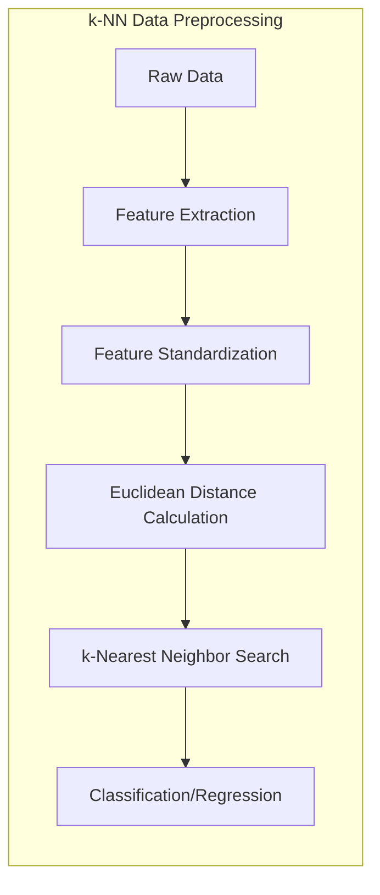
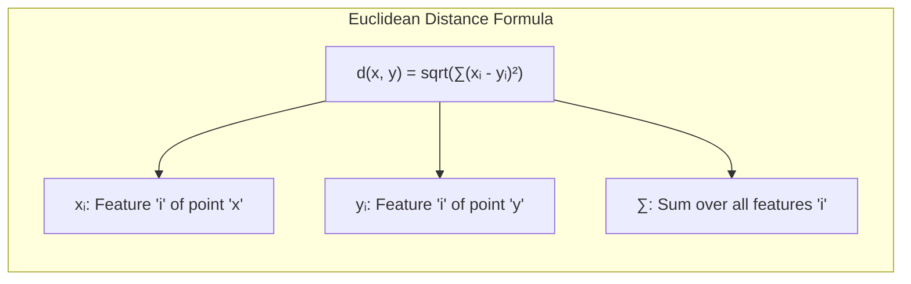
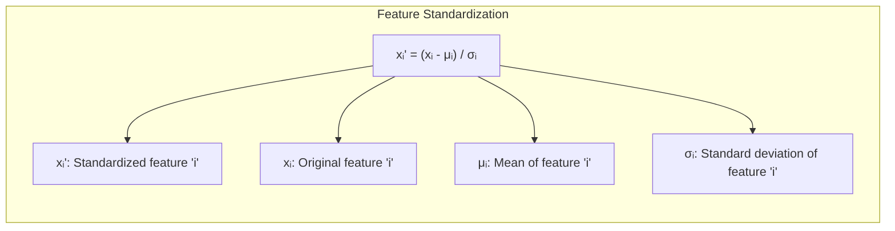
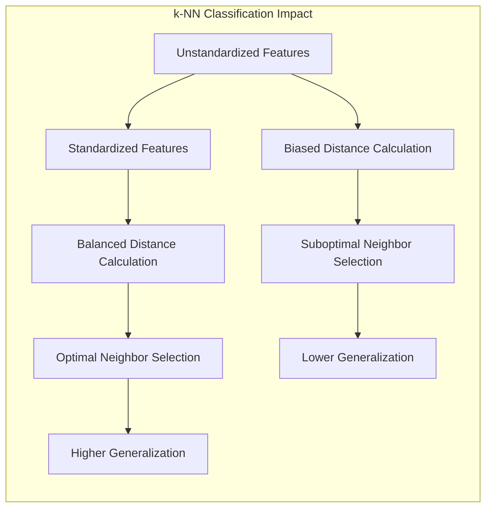
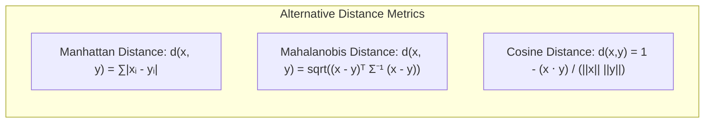

## Distância Euclidiana no k-NN: A Necessidade de Padronização das *Features*

### Introdução

Este capítulo aborda a importância da **distância Euclidiana** como métrica de proximidade no algoritmo **k-vizinhos mais próximos (k-NN)**, com ênfase na necessidade de **padronizar** as *features* antes de calcular a distância [^13.3]. A distância Euclidiana é uma métrica amplamente utilizada por sua simplicidade e interpretabilidade, mas sua aplicação direta a dados brutos pode levar a resultados enviesados quando as *features* apresentam escalas diferentes. Analisaremos como a padronização das *features*, que envolve centralizar e normalizar cada dimensão para ter média zero e variância um, é crucial para garantir que a distância Euclidiana reflita a proximidade real entre os pontos, e como a padronização é um passo essencial no pré-processamento de dados para o k-NN.

### Distância Euclidiana: Uma Métrica de Proximidade no Espaço de *Features*

A **distância Euclidiana** é uma métrica de distância amplamente utilizada para medir a proximidade entre dois pontos em um espaço de *features* [^13.3]. No contexto do k-NN, a distância Euclidiana é usada para identificar os $k$ pontos de treinamento mais próximos de um novo ponto de consulta, sendo uma medida direta da distância "em linha reta" entre dois pontos.

Formalmente, a distância Euclidiana entre dois pontos $x = (x_1, x_2, \ldots, x_p)$ e $y = (y_1, y_2, \ldots, y_p)$ em um espaço de *features* de $p$ dimensões é definida como:

$$d(x, y) = \sqrt{\sum_{i=1}^p (x_i - y_i)^2}$$

Onde $x_i$ e $y_i$ são os valores das *features* $i$ dos pontos $x$ e $y$, respectivamente. A distância Euclidiana é intuitiva e fácil de calcular, mas sua aplicação direta a dados com diferentes escalas nas *features* pode levar a resultados enviesados, favorecendo *features* com maiores valores absolutos, e diminuindo a importância de *features* com escalas menores.

**Lemma 81:** A distância Euclidiana é uma métrica que quantifica a proximidade entre dois pontos no espaço de *features*, mas é sensível à escala das *features*, o que significa que *features* com maiores valores absolutos podem ter maior influência na distância.
*Prova*: A soma das diferenças quadráticas no cálculo da distância euclidiana faz com que features em uma escala maior tenham impacto muito maior na distância do que features em escalas menores. $\blacksquare$

> 💡 **Exemplo Numérico:**
> Considere dois pontos em um espaço de duas dimensões (features), $x = (1, 100)$ e $y = (2, 102)$.
>
> 1.  **Cálculo da Distância Euclidiana Sem Padronização:**
>
>     $d(x, y) = \sqrt{(1-2)^2 + (100-102)^2} = \sqrt{(-1)^2 + (-2)^2} = \sqrt{1 + 4} = \sqrt{5} \approx 2.236$
>
>     Nesse caso, a segunda feature (com valores em torno de 100) domina o cálculo da distância, enquanto a primeira feature (com valores em torno de 1) tem pouca influência.
>
>     Agora, vamos considerar dois pontos $x = (1, 100)$ e $z = (1, 101)$.
>     $d(x, z) = \sqrt{(1-1)^2 + (100-101)^2} = \sqrt{0^2 + (-1)^2} = \sqrt{1} = 1$.
>     Embora a diferença na segunda feature entre x e z seja menor que a diferença entre x e y, a distância entre x e z é menor, por conta do maior valor absoluto da segunda feature.
>
>     Se as features tivessem sido padronizadas, a distância entre x e y e x e z seria mais representativa da diferença real entre os pontos.
>
> 2.  **Cálculo da Distância Euclidiana com Padronização:**
>     Vamos supor que, após a padronização, os pontos transformados sejam $x' = (-1, -1)$ e $y' = (1, 1)$, e $z' = (-1, 0)$.
>     $d(x', y') = \sqrt{(-1 - 1)^2 + (-1 - 1)^2} = \sqrt{(-2)^2 + (-2)^2} = \sqrt{8} \approx 2.828$
>     $d(x', z') = \sqrt{(-1 - -1)^2 + (-1 - 0)^2} = \sqrt{0^2 + (-1)^2} = \sqrt{1} = 1$
>
>     Com a padronização, a contribuição de cada feature para a distância é equilibrada. A diferença entre $x'$ e $y'$ e $x'$ e $z'$ é mais representativa da diferença real entre os pontos.
>
>  Este exemplo ilustra como a falta de padronização pode distorcer a noção de proximidade no espaço de features.

**Corolário 81:** A padronização das *features* é essencial para garantir que todas as *features* contribuam de forma igual para o cálculo da distância Euclidiana e, consequentemente, para a escolha dos vizinhos mais próximos no k-NN.

> ⚠️ **Nota Importante**:  A distância Euclidiana é uma métrica amplamente utilizada para calcular a proximidade entre pontos no espaço de *features*, mas sua aplicação direta a dados não padronizados pode levar a resultados enviesados.

> ❗ **Ponto de Atenção**: A padronização das *features* é um passo crucial no pré-processamento de dados para o k-NN, garantindo que todas as *features* tenham a mesma influência no cálculo da distância.

### Padronização das *Features*: Média Zero e Variância Unitária

A **padronização das *features***, também conhecida como *z-score normalization*, é uma técnica de pré-processamento que transforma os dados de forma que cada *feature* tenha média zero e variância unitária. Essa transformação é realizada subtraindo a média de cada *feature* e dividindo pelo seu desvio padrão [^13.2].

Formalmente, para cada *feature* $x_i$ no conjunto de dados, o valor padronizado $x_i'$ é obtido por:

$$x_i' = \frac{x_i - \mu_i}{\sigma_i}$$

Onde $\mu_i$ é a média da *feature* $x_i$ no conjunto de treinamento e $\sigma_i$ é o desvio padrão da *feature* $x_i$ no conjunto de treinamento. A média e o desvio padrão são calculados com base no conjunto de treinamento e são usados para padronizar tanto o conjunto de treinamento quanto o conjunto de teste, o que é crucial para evitar *data leakage*.

A padronização tem como objetivo remover a influência da escala dos *features* no cálculo da distância Euclidiana, permitindo que todas as *features* contribuam de forma igual para a medida de proximidade. Sem a padronização, *features* com escalas maiores podem dominar o cálculo da distância, o que leva a resultados enviesados no k-NN e outros métodos de classificação que utilizam a distância Euclidiana.

**Lemma 82:** A padronização de *features* garante que cada *feature* tenha média zero e variância unitária, o que remove a influência da escala das *features* e permite que a distância Euclidiana reflita a proximidade real entre os pontos.
*Prova*: A transformação por padronização, por definição, garante que a média dos valores seja 0 e a variância 1, o que faz com que todas as *features* contribuam em igual medida para a distância. $\blacksquare$

> 💡 **Exemplo Numérico:**
>
> Vamos considerar um conjunto de dados com duas *features*, com os seguintes valores para um ponto $x$:
>
> *   *Feature 1*: Valores: \[2, 4, 6, 8, 10]
> *   *Feature 2*: Valores: \[100, 200, 300, 400, 500]
>
> 1.  **Cálculo da Média e Desvio Padrão para cada Feature:**
>
>     *   *Feature 1*:
>         *   Média ($\mu_1$): $(2+4+6+8+10)/5 = 6$
>         *   Desvio Padrão ($\sigma_1$): $\sqrt{((2-6)^2 + (4-6)^2 + (6-6)^2 + (8-6)^2 + (10-6)^2)/5} = \sqrt{(16+4+0+4+16)/5} = \sqrt{40/5} = \sqrt{8} \approx 2.83$
>     *   *Feature 2*:
>         *   Média ($\mu_2$): $(100+200+300+400+500)/5 = 300$
>         *   Desvio Padrão ($\sigma_2$): $\sqrt{((100-300)^2 + (200-300)^2 + (300-300)^2 + (400-300)^2 + (500-300)^2)/5} = \sqrt{(40000+10000+0+10000+40000)/5} = \sqrt{100000/5} = \sqrt{20000} \approx 141.42$
>
> 2.  **Padronização de um novo ponto $x = (5, 350)$:**
>
>     *   *Feature 1* padronizada: $x_1' = \frac{5 - 6}{2.83} = \frac{-1}{2.83} \approx -0.35$
>     *   *Feature 2* padronizada: $x_2' = \frac{350 - 300}{141.42} = \frac{50}{141.42} \approx 0.35$
>
>     O ponto $x$ padronizado é $x' = (-0.35, 0.35)$. Note que os valores foram transformados para uma escala comparável, com média próxima de 0 e variância próxima de 1.

**Corolário 82:** A padronização é uma etapa fundamental para utilizar a distância Euclidiana no k-NN, garantindo que todas as *features* tenham o mesmo impacto na escolha dos vizinhos mais próximos.

> ⚠️ **Nota Importante**: A padronização das *features* é um passo crucial no pré-processamento de dados para o k-NN, garantindo que a distância Euclidiana reflita a proximidade real entre os pontos.

> ❗ **Ponto de Atenção**: A padronização deve ser feita utilizando a média e o desvio padrão do conjunto de treinamento, evitando que o conjunto de teste influencie a transformação, o que pode levar a resultados enviesados.

### Impacto da Padronização na Classificação com k-NN

A padronização das *features* tem um impacto significativo na classificação com o algoritmo k-NN, pois ela influencia a forma como os vizinhos mais próximos são identificados [^13.3]. Sem a padronização, as distâncias calculadas com a métrica Euclidiana podem ser dominadas por *features* que têm valores absolutos maiores, o que leva a resultados subótimos.

Com as *features* padronizadas, a distância Euclidiana passa a refletir a proximidade real entre os pontos no espaço de *features*, e o algoritmo k-NN seleciona os vizinhos que são realmente similares ao ponto de consulta, e não os vizinhos que apresentam maiores valores em *features* com escalas maiores. Isso resulta em modelos com melhor capacidade de generalização e mais robustos a ruído e variações nos dados de treinamento.

A padronização também auxilia a diminuir o impacto da maldição da dimensionalidade, pois ao colocar todas as *features* na mesma escala, a importância de cada dimensão passa a ser mais comparável.

**Lemma 83:** A padronização das *features* melhora o desempenho do k-NN, pois a distância Euclidiana passa a refletir melhor a similaridade entre os pontos, e as *features* contribuem igualmente para a escolha dos vizinhos mais próximos.
*Prova*: Sem a padronização, features com escalas maiores dominam o cálculo da distância, enquanto com a padronização, todos os features passam a ter a mesma importância. $\blacksquare$

> 💡 **Exemplo Numérico:**
>
> Vamos supor um problema de classificação com duas classes, representadas por círculos azuis e vermelhos, e duas *features*: *idade* (em anos) e *renda* (em reais). Os dados são:
>
> *   Classe Azul: \[ (25, 2000), (30, 2500), (35, 3000) ]
> *   Classe Vermelha: \[ (60, 8000), (65, 8500), (70, 9000) ]
>
> 1.  **Classificação sem Padronização:**
>     Vamos classificar o ponto de consulta $x = (50, 5000)$ usando k-NN com k=1.
>     *   Distâncias para os pontos da classe azul:
>         *   $d(x, (25, 2000)) = \sqrt{(50-25)^2 + (5000-2000)^2} = \sqrt{25^2 + 3000^2} \approx 3000.10$
>         *   $d(x, (30, 2500)) = \sqrt{(50-30)^2 + (5000-2500)^2} = \sqrt{20^2 + 2500^2} \approx 2500.08$
>         *  $d(x, (35, 3000)) = \sqrt{(50-35)^2 + (5000-3000)^2} = \sqrt{15^2 + 2000^2} \approx 2000.06$
>     *   Distâncias para os pontos da classe vermelha:
>          *   $d(x, (60, 8000)) = \sqrt{(50-60)^2 + (5000-8000)^2} = \sqrt{10^2 + 3000^2} \approx 3000.02$
>          *   $d(x, (65, 8500)) = \sqrt{(50-65)^2 + (5000-8500)^2} = \sqrt{15^2 + 3500^2} \approx 3500.03$
>          *   $d(x, (70, 9000)) = \sqrt{(50-70)^2 + (5000-9000)^2} = \sqrt{20^2 + 4000^2} \approx 4000.05$
>
>     O vizinho mais próximo é (35, 3000), da classe azul.
>     No entanto, o ponto de consulta (50, 5000) é mais próximo em termos de idade dos pontos da classe vermelha, mas a renda (que tem valores maiores) acaba dominando a distância, levando a uma classificação incorreta.
>
> 2.  **Classificação com Padronização:**
>     Após a padronização dos dados, vamos supor que os pontos transformados sejam:
>     *   Classe Azul: \[ (-1.2, -1.2), (-0.8, -0.8), (-0.4, -0.4) ]
>     *   Classe Vermelha: \[ (1.2, 1.2), (1.6, 1.6), (2.0, 2.0) ]
>     *   Ponto de consulta: $x' = (0.4, 0.4)$
>
>     *   Distâncias para os pontos da classe azul:
>          *   $d(x', (-1.2, -1.2)) = \sqrt{(0.4+1.2)^2 + (0.4+1.2)^2} = \sqrt{1.6^2 + 1.6^2} \approx 2.26$
>          *   $d(x', (-0.8, -0.8)) = \sqrt{(0.4+0.8)^2 + (0.4+0.8)^2} = \sqrt{1.2^2 + 1.2^2} \approx 1.69$
>          *   $d(x', (-0.4, -0.4)) = \sqrt{(0.4+0.4)^2 + (0.4+0.4)^2} = \sqrt{0.8^2 + 0.8^2} \approx 1.13$
>     *   Distâncias para os pontos da classe vermelha:
>          *   $d(x', (1.2, 1.2)) = \sqrt{(0.4-1.2)^2 + (0.4-1.2)^2} = \sqrt{(-0.8)^2 + (-0.8)^2} \approx 1.13$
>          *   $d(x', (1.6, 1.6)) = \sqrt{(0.4-1.6)^2 + (0.4-1.6)^2} = \sqrt{(-1.2)^2 + (-1.2)^2} \approx 1.69$
>          *   $d(x', (2.0, 2.0)) = \sqrt{(0.4-2.0)^2 + (0.4-2.0)^2} = \sqrt{(-1.6)^2 + (-1.6)^2} \approx 2.26$
>     O vizinho mais próximo é (1.2, 1.2), da classe vermelha, o que é uma classificação mais coerente com a localização do ponto de consulta no espaço de features.

**Corolário 83:** Modelos k-NN com dados padronizados tem menor viés e melhor capacidade de generalização, pois os vizinhos mais próximos selecionados são mais representativos da região local ao ponto de consulta.

> ⚠️ **Nota Importante**: A padronização das *features* é essencial para a utilização da distância Euclidiana no k-NN, garantindo que a escolha dos vizinhos mais próximos seja feita de forma correta e equilibrada.

> ❗ **Ponto de Atenção**: A padronização dos dados é um passo essencial para evitar que *features* com escalas maiores dominem o cálculo da distância e para garantir o bom funcionamento do k-NN.

### Métricas de Distância Alternativas: Adaptação à Estrutura dos Dados

Embora a distância Euclidiana seja a métrica mais comum no k-NN, existem outras métricas de distância que podem ser utilizadas em situações específicas para adaptar a escolha dos vizinhos mais próximos à estrutura dos dados [^13.3].

Algumas métricas de distância alternativas incluem:

1.  **Distância de Manhattan:** Também conhecida como distância da cidade ou distância L1, a distância de Manhattan é a soma dos valores absolutos das diferenças entre as coordenadas dos pontos:

    $$d(x, y) = \sum_{i=1}^p |x_i - y_i|$$

   A distância de Manhattan pode ser mais apropriada do que a distância Euclidiana em espaços onde as dimensões não são uniformemente escaladas, ou para dados categóricos, sendo menos suscetível a *outliers* em comparação com a distância Euclidiana.

2.  **Distância de Mahalanobis:** A distância de Mahalanobis leva em consideração a covariância entre as *features*, o que pode ser útil em dados onde as *features* são correlacionadas:

    $$d(x, y) = \sqrt{(x - y)^T \Sigma^{-1} (x - y)}$$

   Onde $\Sigma$ é a matriz de covariância das *features*. A distância de Mahalanobis pode ser utilizada quando a distribuição dos dados não é isotrópica, o que implica que as *features* têm diferentes variâncias ou covariâncias.
3.  **Distância Cossenoidal:** A distância cossenoidal mede o ângulo entre dois vetores, e não a distância entre seus pontos finais. A distância cossenoidal é dada por:

     $$d(x,y) = 1 - \frac{x \cdot y}{||x|| ||y||}$$

    Onde $x \cdot y$ é o produto interno dos vetores $x$ e $y$, e $||x||$ e $||y||$ são os seus módulos. Esta métrica é utilizada quando o padrão do dado (sua direção) é mais importante do que sua magnitude, como em documentos de texto ou análise de imagens.

> 💡 **Exemplo Numérico:**
>
> Vamos comparar a distância Euclidiana e a distância de Manhattan para dois pontos $x = (3, 4)$ e $y = (7, 1)$.
>
> 1.  **Distância Euclidiana:**
>
>     $d(x, y) = \sqrt{(3-7)^2 + (4-1)^2} = \sqrt{(-4)^2 + (3)^2} = \sqrt{16 + 9} = \sqrt{25} = 5$
>
> 2.  **Distância de Manhattan:**
>
>     $d(x, y) = |3-7| + |4-1| = |-4| + |3| = 4 + 3 = 7$
>
>  A distância de Manhattan é maior que a distância Euclidiana nesse caso. A distância de Manhattan é mais sensível a diferenças nas coordenadas individuais, enquanto a distância Euclidiana leva em consideração a distância em linha reta entre os pontos.
>
> Vamos agora calcular a distância cossenoidal entre dois vetores: $x = (1, 0)$ e $y = (1, 1)$.
>
> 1.  **Distância Cossenoidal:**
>     $x \cdot y = (1 * 1) + (0 * 1) = 1$
>     $||x|| = \sqrt{1^2 + 0^2} = 1$
>     $||y|| = \sqrt{1^2 + 1^2} = \sqrt{2}$
>     $d(x,y) = 1 - \frac{1}{1 * \sqrt{2}} = 1 - \frac{1}{\sqrt{2}} \approx 1 - 0.707 = 0.293$
>
> Se calcularmos a distância cossenoidal entre $x = (1, 0)$ e $z = (2, 0)$, que estão na mesma direção, temos:
>
> $x \cdot z = (1 * 2) + (0 * 0) = 2$
> $||x|| = 1$
> $||z|| = \sqrt{2^2 + 0^2} = 2$
> $d(x,z) = 1 - \frac{2}{1 * 2} = 1 - 1 = 0$
>
> A distância cossenoidal entre x e z é 0, pois eles estão na mesma direção, independentemente da sua magnitude.

**Lemma 84:** A escolha da métrica de distância no k-NN deve levar em consideração a estrutura dos dados e a natureza das *features*, o que pode melhorar o desempenho do modelo e a escolha dos vizinhos mais apropriados.
*Prova*: O uso de uma métrica de distância apropriada garante que a comparação entre os pontos seja feita utilizando critérios adequados para a natureza dos dados, levando a modelos mais precisos e com melhor desempenho. $\blacksquare$

**Corolário 84:** A padronização é especialmente importante quando se usa a distância Euclidiana, mas mesmo para outras métricas, o pré-processamento dos dados pode aumentar a sua capacidade de discriminação.

> ⚠️ **Nota Importante**: Embora a distância Euclidiana seja a métrica mais comum, a escolha da métrica de distância no k-NN deve ser feita com base na estrutura dos dados e na necessidade de lidar com especificidades dos dados.

> ❗ **Ponto de Atenção**: Métricas de distância adaptativas podem melhorar o desempenho do k-NN, especialmente em espaços de alta dimensão.

### Conclusão

A distância Euclidiana é uma métrica de proximidade amplamente utilizada no k-NN, mas sua aplicação direta a dados com escalas diferentes nas *features* pode levar a resultados enviesados. A padronização das *features*, com média zero e variância um, é um passo essencial no pré-processamento de dados para o k-NN, garantindo que todas as *features* tenham o mesmo impacto no cálculo da distância. A escolha de uma métrica de distância apropriada, que leve em consideração a estrutura dos dados, pode melhorar ainda mais o desempenho do k-NN, especialmente em casos onde a distância Euclidiana não é a métrica mais adequada.

### Footnotes

[^13.3]: "These classifiers are memory-based, and require no model to be fit. Given a query point xo, we find the k training points x(r), r = 1,..., k closest in distance to xo, and then classify using majority vote among the k neighbors." *(Trecho de "13. Prototype Methods and Nearest-Neighbors")*

[^13.2]: "Throughout this chapter, our training data consists of the N pairs (x1,91),...,(xn, 9N) where gi is a class label taking values in {1, 2, . . ., K}. Prototype methods represent the training data by a set of points in feature space. These prototypes are typically not examples from the training sample, except in the case of 1-nearest-neighbor classification discussed later. Each prototype has an associated class label, and classification of a query point x is made to the class of the closest prototype. "Closest" is usually defined by Euclidean distance in the feature space, after each feature has been standardized to have overall mean 0 and variance 1 in the training sample." *(Trecho de "13. Prototype Methods and Nearest-Neighbors")*
