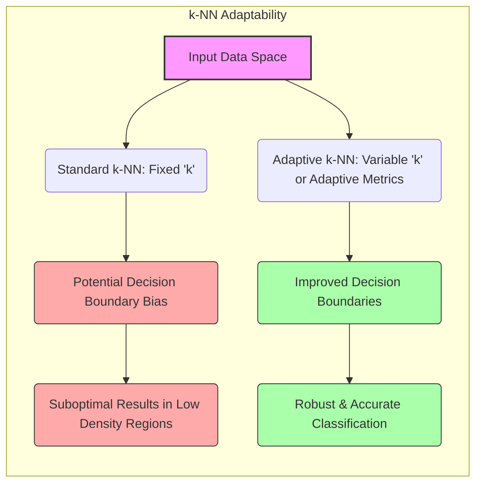
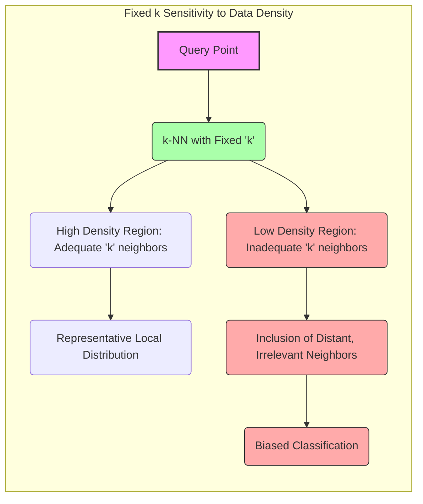
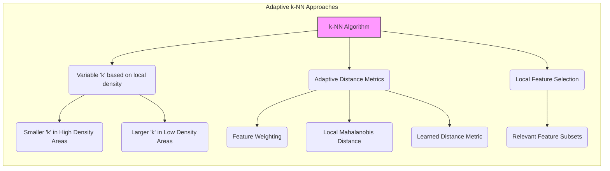
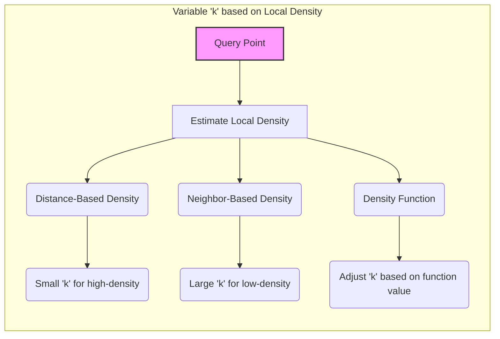
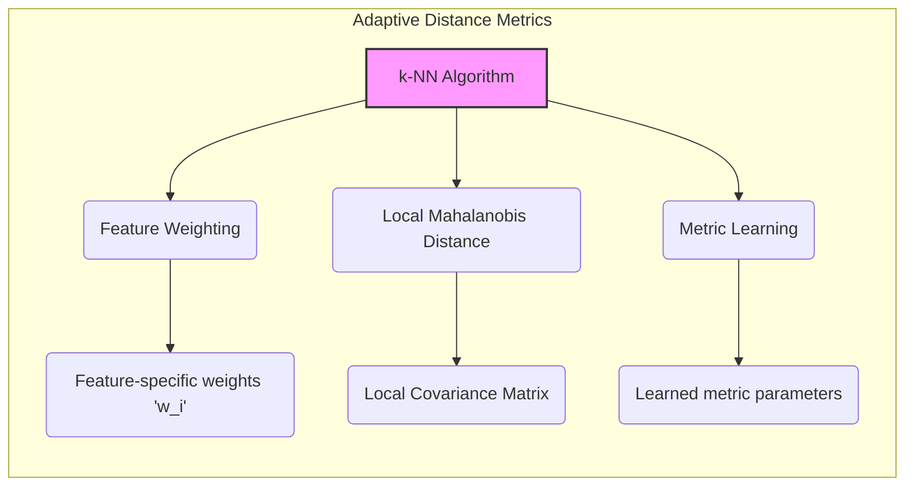

## Adaptabilidade Local do k-NN: Ajustando a Vizinhança à Densidade dos Dados

### Introdução

Este capítulo explora a capacidade de **adaptabilidade local** do método de **k-vizinhos mais próximos (k-NN)**, com foco em como o algoritmo pode se ajustar a diferentes **densidades de dados** no espaço de *features* [^13.4]. Uma limitação da abordagem padrão do k-NN, com um valor constante de $k$, é que a escolha da vizinhança não se adapta à densidade local dos dados, o que pode levar a resultados subótimos em regiões de baixa densidade. Analisaremos como estratégias de adaptação da vizinhança, por meio da variação do valor de $k$ ou do uso de métricas de distância adaptativas, podem permitir que o k-NN se ajuste às características locais dos dados, resultando em modelos mais precisos e robustos.

### A Limitação do k Constante: Sensibilidade à Densidade dos Dados

O método padrão de **k-vizinhos mais próximos (k-NN)** utiliza um valor constante para o número de vizinhos ($k$) ao classificar um novo ponto de consulta [^13.3]. Embora essa abordagem seja simples e intuitiva, ela apresenta uma limitação importante: a **sensibilidade à densidade dos dados**.

Em regiões do espaço de *features* onde os dados são densos, ou seja, onde existem muitos pontos de treinamento próximos, a escolha de um valor constante de $k$ pode ser adequada, pois os $k$ vizinhos mais próximos representam bem a distribuição local das classes. No entanto, em regiões onde a densidade dos dados é baixa, a escolha de um mesmo valor de $k$ pode levar a resultados subótimos.

Em regiões de baixa densidade, a escolha de um valor constante de $k$ pode incluir vizinhos que estão muito distantes do ponto de consulta e, consequentemente, que não são representativos da distribuição local das classes. Isso pode levar a decisões enviesadas, onde o ponto de consulta é atribuído a uma classe incorreta devido à influência de vizinhos distantes.

**Lemma 85:** A escolha de um número fixo de vizinhos k no k-NN torna o modelo sensível às variações na densidade dos dados, o que pode levar a resultados subótimos quando a densidade do conjunto de dados não é uniforme no espaço de *features*.
*Prova*: Um valor fixo de $k$ faz com que a região de decisão, com um raio baseado na distância dos k-ésimos vizinhos, não seja proporcional à densidade dos dados. $\blacksquare$

**Corolário 85:** Uma estratégia que permita adaptar o tamanho da vizinhança à densidade local dos dados pode melhorar o desempenho do k-NN em problemas com distribuições não uniformes no espaço de *features*.

> ⚠️ **Nota Importante**: A escolha de um valor constante para o parâmetro k no k-NN não leva em consideração as variações na densidade dos dados, o que pode levar a resultados enviesados.

> ❗ **Ponto de Atenção**:  Em regiões de baixa densidade, a escolha de um valor constante de k pode fazer com que o algoritmo considere vizinhos que estão muito distantes do ponto de consulta.

> 💡 **Exemplo Numérico:**
> Imagine um conjunto de dados 2D com duas classes, "A" e "B". Em uma região, temos 10 pontos da classe "A" agrupados, e em outra, temos apenas 2 pontos da classe "B" mais dispersos. Se usarmos k=3, ao classificar um novo ponto próximo aos pontos de "B", podemos acabar incluindo 2 vizinhos de "A" e 1 de "B", classificando erroneamente o ponto como "A" devido à baixa densidade de "B". Se ajustássemos k para 1, o ponto seria corretamente classificado como "B". Este exemplo ilustra como um k fixo pode ser problemático em áreas de baixa densidade.

### Adaptação da Vizinhança: k Variável e Métricas Adaptativas

Para lidar com a limitação da sensibilidade à densidade dos dados, existem abordagens que buscam adaptar a vizinhança no k-NN, seja por meio da variação do valor de $k$, seja por meio do uso de **métricas de distância adaptativas** [^13.4].

1.  **k Variável:** Em vez de usar um valor constante de $k$, uma estratégia é variar o valor de $k$ de acordo com a densidade local dos dados. Em regiões de alta densidade, o valor de $k$ pode ser menor, pois os vizinhos mais próximos já representam bem a distribuição local. Em regiões de baixa densidade, o valor de $k$ pode ser maior, para que um número suficiente de vizinhos seja considerado. A dificuldade desse método está na definição de um parâmetro local de densidade.
2.  **Métricas de Distância Adaptativas:** Outra abordagem é utilizar métricas de distância que se adaptam à estrutura local dos dados. Por exemplo, o uso de distâncias ponderadas pode dar maior peso às *features* que são mais relevantes para a discriminação das classes em uma região específica do espaço de *features*. O uso da distância de Mahalanobis, que leva em consideração a matriz de covariância local, pode ser útil em casos onde a distribuição dos dados não é isotrópica.
3.  **Seleção de *Features* Local:** A seleção de um subconjunto de *features* relevantes em cada região, antes da aplicação do algoritmo k-NN, pode ser utilizada para tornar o algoritmo adaptável às características locais.

**Lemma 86:** Métodos de adaptação da vizinhança, como o uso de um k variável ou de métricas de distância adaptativas, permitem ao k-NN se ajustar à densidade local dos dados, resultando em modelos mais robustos e precisos.
*Prova*: A utilização de um número variável de vizinhos ou de métricas adaptativas permite que a região de decisão do k-NN se ajuste à densidade local dos dados. $\blacksquare$

**Corolário 86:** Métodos adaptativos permitem que o k-NN contorne a influência da maldição da dimensionalidade, pois passam a considerar apenas informações de regiões locais e relevantes no espaço de *features*.

> ⚠️ **Nota Importante**:  A adaptação da vizinhança no k-NN por meio de um k variável ou de métricas de distância adaptativas busca lidar com a sensibilidade do modelo a variações na densidade dos dados.

> ❗ **Ponto de Atenção**: A escolha de uma abordagem adaptativa deve levar em consideração a complexidade computacional e a dificuldade de estimar os parâmetros necessários para a adaptação.

### Variação de k com a Densidade Local

A variação do valor de $k$ com a **densidade local** é uma forma de adaptar o k-NN às características dos dados em diferentes regiões do espaço de *features*. A ideia central é que, em regiões de alta densidade, onde os pontos estão próximos uns dos outros, um valor menor de $k$ é suficiente para capturar a estrutura local dos dados. Em regiões de baixa densidade, onde os pontos são mais dispersos, um valor maior de $k$ é necessário para evitar decisões enviesadas.

Existem diferentes abordagens para definir o valor de $k$ de forma adaptativa:

1.  **Densidade Baseada em Distância:** A densidade local pode ser estimada com base na distância entre um ponto de consulta e seus vizinhos mais próximos. Um valor pequeno de $k$ pode ser utilizado em regiões onde a distância entre o ponto de consulta e seus vizinhos é pequena, e um valor maior de $k$ é utilizado em regiões onde essa distância é maior.
2.  **Densidade Baseada em Vizinhos:** A densidade pode ser estimada com base no número de vizinhos em um raio pré-definido do ponto de consulta. Se o número de vizinhos dentro desse raio for grande, a densidade é considerada alta, e vice-versa.
3.  **Funções de Densidade:** Em modelos mais sofisticados, uma função de densidade pode ser aprendida com os dados, e o valor de $k$ é ajustado com base no valor dessa função no ponto de consulta.

A escolha da abordagem adequada para adaptar o valor de $k$ depende das características do conjunto de dados e da complexidade do problema de classificação. É fundamental que essa adaptação utilize apenas as informações disponíveis no conjunto de treino e nas informações locais ao ponto de consulta, para evitar a influência de dados que não são representativos da região.

**Lemma 87:** A variação do valor de $k$ com a densidade local permite ajustar a vizinhança na escolha dos vizinhos mais próximos de forma adaptativa, levando a uma melhor escolha dos pontos que influenciam a decisão de classificação.
*Prova*: Ao ajustar o valor de $k$ à densidade local, a região de decisão é mais adequada à distribuição local das classes. $\blacksquare$

**Corolário 87:** A adaptação de $k$ com a densidade local pode ser feita com métodos de estimação de densidade, ou com cálculos simples baseados nas distâncias ao ponto de consulta.

> ⚠️ **Nota Importante**: A variação do valor de $k$ com a densidade local é uma forma de adaptar o k-NN a distribuições de dados não uniformes, permitindo um melhor aproveitamento da informação da vizinhança.

> ❗ **Ponto de Atenção**:  A estimação da densidade local pode ser um desafio computacional, e a escolha do método de estimação deve ser feita considerando as características dos dados e o custo computacional.

> 💡 **Exemplo Numérico:**
> Vamos supor que para um novo ponto de consulta $x_q$, calculamos a distância para os seus 5 vizinhos mais próximos. As distâncias são: $d_1 = 0.1$, $d_2 = 0.2$, $d_3 = 0.6$, $d_4 = 0.7$, e $d_5 = 0.8$. Podemos usar a distância média dos 2 vizinhos mais próximos ($d_{avg} = (0.1 + 0.2)/2 = 0.15$) como medida de densidade local. Se $d_{avg}$ for menor que um limiar (por exemplo, 0.3), indicando alta densidade, podemos usar $k=3$. Se $d_{avg}$ for maior que 0.3, indicando baixa densidade, podemos usar $k=5$. Assim, o valor de k é adaptado à densidade da região.

### Métricas Adaptativas: Influência das *Features* na Escolha dos Vizinhos

O uso de **métricas de distância adaptativas** é outra abordagem para permitir que o k-NN se ajuste à estrutura local dos dados [^13.4]. Em vez de utilizar uma métrica de distância fixa, como a distância Euclidiana, as métricas adaptativas procuram ponderar a importância de cada *feature* no cálculo da distância, com base na relevância da *feature* para a classificação em uma determinada região do espaço de *features*.

Algumas abordagens para métricas de distância adaptativas incluem:

1.  **Ponderação das *Features*:** Atribuir pesos diferentes a cada *feature* no cálculo da distância Euclidiana, com base na importância da *feature* na região do ponto de consulta. Por exemplo, se a classe se separa melhor na dimensão 1, a distância associada a essa dimensão pode receber um peso maior do que a distância em outras dimensões.
2.  **Distância de Mahalanobis Local:** Calcular a matriz de covariância local dos dados ao redor do ponto de consulta e utilizar a distância de Mahalanobis, que leva em consideração a correlação entre as *features*.
3.  **Aprendizado de Métricas:** Aprender uma métrica de distância a partir dos dados de treinamento, de forma a melhor representar a similaridade entre os pontos no espaço de *features*. Isso pode ser feito utilizando algoritmos de aprendizado de métricas, que ajustam os parâmetros da métrica de distância para maximizar a capacidade de discriminação entre as classes.

**Lemma 88:** Métricas de distância adaptativas permitem que o k-NN se ajuste à estrutura local dos dados, ponderando a importância de cada *feature* na região do ponto de consulta.
*Prova*: Ao dar pesos maiores para as *features* relevantes na região do ponto de consulta, a métrica de distância passa a refletir melhor a estrutura de dados naquele local. $\blacksquare$

**Corolário 88:** A escolha de uma métrica de distância adaptativa pode melhorar o desempenho do k-NN, especialmente quando as *features* têm diferentes relevâncias para classificação em diferentes regiões do espaço de *features*.

> ⚠️ **Nota Importante**: Métricas de distância adaptativas permitem que o k-NN se ajuste à estrutura local dos dados, ponderando a importância das *features* com base em sua relevância na região do ponto de consulta.

> ❗ **Ponto de Atenção**: A escolha e implementação de métricas de distância adaptativas podem aumentar a complexidade do algoritmo k-NN.

> 💡 **Exemplo Numérico:**
> Suponha um problema de classificação com duas *features*, $x_1$ e $x_2$. Em uma região do espaço de *features*, $x_1$ é muito mais importante para distinguir as classes do que $x_2$. Podemos usar uma métrica ponderada para calcular a distância entre um ponto de consulta $x_q = (x_{q1}, x_{q2})$ e um ponto de treinamento $x_i = (x_{i1}, x_{i2})$:
>
> $d(x_q, x_i) = w_1 |x_{q1} - x_{i1}| + w_2 |x_{q2} - x_{i2}|$
>
> Se nesta região, a importância de $x_1$ é 3 vezes maior que a de $x_2$, podemos definir $w_1 = 0.75$ e $w_2 = 0.25$ (de forma que $w_1 + w_2 = 1$). Em outra região, onde $x_2$ seja mais relevante, os pesos podem ser ajustados. Se, por exemplo, $x_2$ for 2 vezes mais importante que $x_1$, então $w_1 = 1/3$ e $w_2 = 2/3$. Assim, a métrica de distância adapta-se à relevância local das *features*.

### Conclusão

A capacidade de adaptação local do k-NN é uma característica importante que permite que o algoritmo lide de forma mais eficaz com conjuntos de dados com distribuições não uniformes. A escolha de um valor constante de $k$ pode levar a resultados subótimos em regiões de baixa densidade, e a variação do valor de $k$ e o uso de métricas de distância adaptativas permitem que o k-NN se ajuste de forma mais precisa às características locais dos dados. A compreensão dessas abordagens de adaptação local é fundamental para a aplicação eficaz do k-NN em diversos problemas de classificação e reconhecimento de padrões.

### Footnotes

[^13.4]: "When nearest-neighbor classification is carried out in a high-dimensional feature space, the nearest neighbors of a point can be very far away, causing bias and degrading the performance of the rule. To quantify this, consider N data points uniformly distributed in the unit cube [0, 1]P... In general, this calls for adapting the metric used in nearest-neighbor classification, so that the resulting neighborhoods stretch out in directions for which the class probabilities don't change much." *(Trecho de "13. Prototype Methods and Nearest-Neighbors")*

[^13.3]: "These classifiers are memory-based, and require no model to be fit. Given a query point xo, we find the k training points x(r), r = 1,..., k closest in distance to xo, and then classify using majority vote among the k neighbors." *(Trecho de "13. Prototype Methods and Nearest-Neighbors")*
