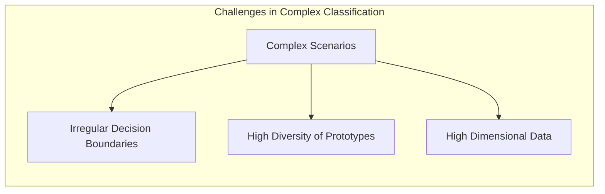
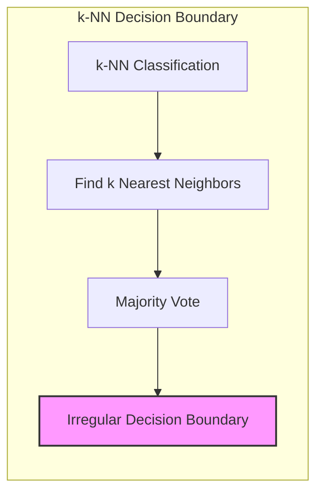
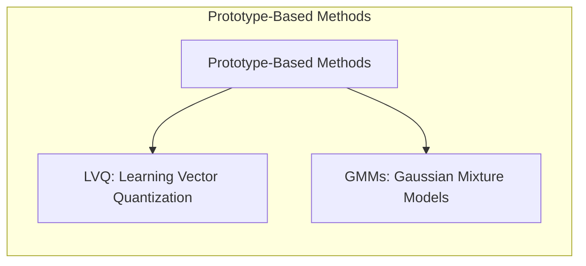
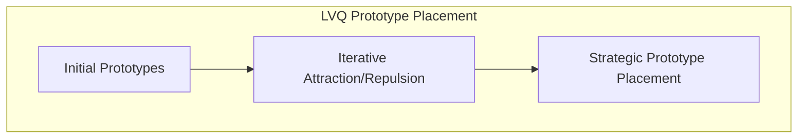
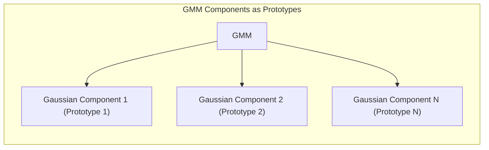
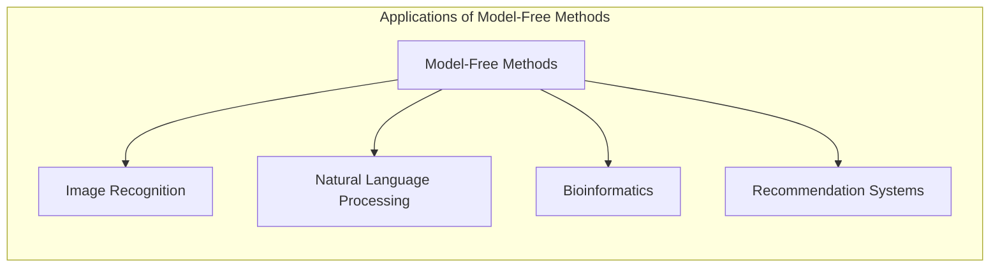

## Desempenho dos Métodos *Model-Free*: Sucesso em Problemas Complexos com Fronteiras Irregulares e Diversidade de Protótipos

```mermaid
graph LR
    subgraph "Model-Free Methods vs. Linear Models"
        direction LR
        A["Complex Problems with Irregular Boundaries and Diverse Prototypes"]
        B["Model-Free Methods (k-NN, LVQ, GMMs)"]
        C["Linear Models (Logistic Regression, LDA)"]
        A --> B
        A --> C
        B -- "Effective" --> D["Accurate Classification"]
        C -- "Limited" --> E["Poor Performance"]
        D -- "Adaptable to Complex Data Distributions"
        E -- "Struggles with Non-linear Boundaries"
     end
```

### Introdução

Este capítulo explora o **desempenho** dos métodos *model-free* em problemas complexos de classificação e reconhecimento de padrões, com ênfase em sua capacidade de lidar com **fronteiras de decisão irregulares** e a presença de muitas amostras representativas, ou seja, **protótipos**, por classe [^13.1]. Métodos como o k-vizinhos mais próximos (k-NN), o Learning Vector Quantization (LVQ) e as Misturas Gaussianas (GMMs) se destacam por sua flexibilidade e capacidade de se adaptar a distribuições complexas de dados, o que os torna particularmente úteis em cenários onde os modelos lineares tradicionais apresentam limitações. Analisaremos como a combinação de técnicas de protótipos e métodos baseados em memória resulta em modelos capazes de lidar com desafios complexos que surgem em dados do mundo real.

### A Eficácia dos Métodos *Model-Free* em Cenários Complexos

Os métodos *model-free*, incluindo o k-NN e métodos baseados em protótipos como LVQ e GMMs, têm demonstrado grande eficácia em uma variedade de problemas complexos de classificação, especialmente em cenários onde as distribuições das classes apresentam características que dificultam a aplicação de modelos lineares [^13.1].

Esses cenários complexos se caracterizam por:

1.  **Fronteiras de Decisão Irregulares:** As fronteiras entre as classes não seguem um padrão linear, mas apresentam formas complexas e não lineares. Modelos lineares, como a regressão logística ou o LDA (Linear Discriminant Analysis), podem ter dificuldades para capturar essas fronteiras irregulares, o que limita seu desempenho.
2.  **Diversidade de Protótipos por Classe:** Cada classe pode apresentar uma grande variabilidade interna, e ser representada por diversos "protótipos", que não necessariamente estão todos próximos uns dos outros no espaço de *features*. Modelos que assumem uma forma específica de distribuição de classes (ex. gaussianas unimodais) podem não representar de forma adequada essa variabilidade.
3. **Dados de Alta Dimensionalidade:** Métodos lineares em espaços de alta dimensionalidade podem ter desempenho comprometido devido à dispersão dos dados e ao problema da maldição da dimensionalidade.



A capacidade dos métodos *model-free* de lidar com esses desafios se deve, principalmente, à sua flexibilidade e à sua capacidade de se adaptar a estruturas complexas nos dados. A ausência de um modelo paramétrico e a representação dos dados por protótipos ou vizinhos próximos permitem que esses métodos capturem as nuances da distribuição de dados de forma mais eficaz do que modelos paramétricos.

**Lemma 89:** Métodos *model-free* apresentam bom desempenho em problemas com fronteiras de decisão irregulares e variabilidade de protótipos nas classes, devido à sua flexibilidade e capacidade de adaptação à complexidade da distribuição de dados.
*Prova*: Métodos baseados em protótipos utilizam protótipos estrategicamente posicionados que capturam a forma de cada classe, enquanto que métodos como o k-NN tomam decisões baseados em informações locais e não em modelos globais. $\blacksquare$

**Corolário 89:** Modelos lineares, que assumem fronteiras de decisão lineares, podem apresentar dificuldades em problemas onde essa suposição não é válida.

> ⚠️ **Nota Importante**: Métodos *model-free* são particularmente eficazes em cenários complexos com fronteiras de decisão irregulares e grande diversidade de protótipos nas classes.

> ❗ **Ponto de Atenção**: A capacidade de se adaptar à complexidade dos dados é uma vantagem dos métodos *model-free* em relação a modelos lineares ou outros métodos com suposições sobre a forma da distribuição dos dados.

### k-Vizinhos Mais Próximos (k-NN): Sucesso em Problemas com Fronteiras Irregulares

O método de **k-vizinhos mais próximos (k-NN)** é um exemplo de sucesso de método *model-free* em problemas de classificação com **fronteiras de decisão irregulares** [^13.3]. A capacidade do k-NN de modelar fronteiras de decisão complexas se deve ao fato de que a decisão de classificação é baseada na informação local dos $k$ vizinhos mais próximos, sem assumir nenhuma forma específica para a fronteira de decisão.

Em problemas onde a fronteira de decisão não é linear, ou apresenta regiões com curvaturas complexas, o k-NN pode obter resultados superiores a modelos lineares, pois não impõe nenhuma restrição à forma das fronteiras de decisão. A escolha do valor de $k$ influencia a suavidade da fronteira de decisão, com valores menores de $k$ resultando em fronteiras mais irregulares, e valores maiores levando a fronteiras mais suaves. Técnicas de adaptação local do valor de $k$ também aumentam a capacidade do modelo de lidar com distribuições de dados heterogêneas.



O k-NN tem apresentado resultados notáveis em problemas com dados de alta dimensionalidade, como reconhecimento de imagens e análise de texto, onde a estrutura dos dados é complexa e irregular, e modelos lineares frequentemente têm desempenho limitado.

> 💡 **Exemplo Numérico:**
> Considere um problema de classificação binária onde temos duas classes, A e B, distribuídas de forma não linear em um espaço 2D. As amostras da classe A formam um círculo no centro do espaço, enquanto as amostras da classe B estão distribuídas ao redor desse círculo.
> ```python
> import numpy as np
> import matplotlib.pyplot as plt
> from sklearn.neighbors import KNeighborsClassifier
>
> # Gera dados não lineares
> np.random.seed(42)
> radius = np.random.uniform(2, 4, 100)
> angle = np.random.uniform(0, 2 * np.pi, 100)
> X_A = np.array([radius * np.cos(angle), radius * np.sin(angle)]).T
> y_A = np.zeros(100)
>
> radius = np.random.uniform(0, 1.5, 100)
> angle = np.random.uniform(0, 2 * np.pi, 100)
> X_B = np.array([radius * np.cos(angle), radius * np.sin(angle)]).T
> y_B = np.ones(100)
>
> X = np.concatenate((X_A, X_B))
> y = np.concatenate((y_A, y_B))
>
> # Treina o modelo k-NN com k=3
> knn = KNeighborsClassifier(n_neighbors=3)
> knn.fit(X, y)
>
> # Cria uma malha para visualização das fronteiras de decisão
> x_min, x_max = X[:, 0].min() - 1, X[:, 0].max() + 1
> y_min, y_max = X[:, 1].min() - 1, X[:, 1].max() + 1
> xx, yy = np.meshgrid(np.arange(x_min, x_max, 0.02),
>                      np.arange(y_min, y_max, 0.02))
>
> Z = knn.predict(np.c_[xx.ravel(), yy.ravel()])
> Z = Z.reshape(xx.shape)
>
> # Plotagem da fronteira de decisão
> plt.contourf(xx, yy, Z, alpha=0.4)
> plt.scatter(X[:, 0], X[:, 1], c=y, edgecolors='k')
> plt.title('Fronteira de Decisão k-NN (k=3)')
> plt.xlabel('Feature 1')
> plt.ylabel('Feature 2')
> plt.show()
> ```
> Neste exemplo, o k-NN com `k=3` consegue modelar a fronteira de decisão circular entre as duas classes, algo que um modelo linear teria dificuldade em fazer. A visualização mostra como o modelo se adapta à forma complexa da distribuição dos dados.

**Lemma 90:** A abordagem local do k-NN, com base na informação dos $k$ vizinhos mais próximos, permite que o modelo se adapte a fronteiras de decisão irregulares, o que não é possível em modelos lineares.
*Prova*: A decisão do k-NN é tomada com base na vizinhança do ponto de consulta, o que permite que o modelo represente regiões de decisão de qualquer forma, e não apenas lineares. $\blacksquare$

**Corolário 90:** O k-NN é uma escolha adequada para problemas com fronteiras de decisão complexas e não lineares, onde o objetivo é classificar o ponto baseado nas informações de sua vizinhança.

> ⚠️ **Nota Importante**: O k-NN é uma abordagem eficaz para lidar com fronteiras de decisão irregulares devido à sua capacidade de modelar as distribuições dos dados localmente.

> ❗ **Ponto de Atenção**:  Embora o k-NN seja flexível, a escolha do valor de k e da métrica de distância é crucial para um bom desempenho do modelo, e a ausência de ajuste do modelo o torna sensível ao ruído e ao tamanho dos dados.

### Métodos de Protótipos: Modelagem de Classes com Diversidade de Protótipos

Métodos de protótipos, como o **LVQ (Learning Vector Quantization)** e as **GMMs (Misturas Gaussianas)**, também se destacam por seu bom desempenho em problemas onde as classes apresentam uma **diversidade de protótipos** [^13.2.2], [^13.2.3]. Nesses problemas, a distribuição de cada classe é complexa e pode ser representada de forma mais adequada por diversos protótipos, e não por um único centróide, como em modelos lineares.



O LVQ utiliza um mecanismo de atração e repulsão que permite posicionar os protótipos de forma estratégica em relação às fronteiras de decisão, o que faz com que o modelo capture a diversidade interna de cada classe. Ao mover os protótipos de acordo com o rótulo das amostras de treino, o LVQ consegue modelar classes com diversas regiões de alta densidade, criando protótipos com capacidade de discriminação entre classes.

As GMMs, por sua vez, utilizam uma combinação de gaussianas para modelar a distribuição de cada classe, o que lhes permite representar formas complexas e multimodais. Cada gaussiana atua como um protótipo, e a combinação de diversas gaussianas permite que o modelo capture a variabilidade interna de cada classe, incluindo a presença de diversos "protótipos" que representam diferentes regiões da distribuição.



> 💡 **Exemplo Numérico:**
> Para ilustrar o LVQ, considere um problema com duas classes, onde cada classe é composta por dois agrupamentos distintos (protótipos).
> ```python
> import numpy as np
> import matplotlib.pyplot as plt
> from neupy import algorithms
>
> # Gera dados com dois protótipos por classe
> np.random.seed(42)
> class_1_prot_1 = np.random.multivariate_normal([1, 1], [[0.1, 0], [0, 0.1]], 50)
> class_1_prot_2 = np.random.multivariate_normal([3, 3], [[0.1, 0], [0, 0.1]], 50)
> class_2_prot_1 = np.random.multivariate_normal([1, 3], [[0.1, 0], [0, 0.1]], 50)
> class_2_prot_2 = np.random.multivariate_normal([3, 1], [[0.1, 0], [0, 0.1]], 50)
>
> X_class_1 = np.concatenate((class_1_prot_1, class_1_prot_2))
> y_class_1 = np.zeros(100)
>
> X_class_2 = np.concatenate((class_2_prot_1, class_2_prot_2))
> y_class_2 = np.ones(100)
>
> X = np.concatenate((X_class_1, X_class_2))
> y = np.concatenate((y_class_1, y_class_2))
>
> # Treina o LVQ com 4 protótipos
> lvqnet = algorithms.LVQ(n_inputs=2, n_classes=2, n_prototypes=4)
> lvqnet.train(X, y, epochs=100)
>
> # Plota os dados e os protótipos
> plt.scatter(X[:, 0], X[:, 1], c=y, edgecolors='k', label='Dados')
> prototypes = lvqnet.prototypes
> plt.scatter(prototypes[:,0], prototypes[:,1], c=['r', 'r', 'b', 'b'], marker='*', s=200, label='Protótipos')
> plt.title('LVQ com Protótipos')
> plt.xlabel('Feature 1')
> plt.ylabel('Feature 2')
> plt.legend()
> plt.show()
> ```
> Neste exemplo, o LVQ ajusta quatro protótipos, dois para cada classe. Os protótipos (estrelas) se posicionam de forma a representar cada um dos agrupamentos de cada classe. Um modelo linear, por outro lado, teria dificuldade em modelar esta distribuição, pois tentaria separar as classes com uma única reta, ignorando a complexidade da distribuição.

> 💡 **Exemplo Numérico:**
> Para ilustrar as GMMs, vamos gerar dados com duas classes, onde cada classe tem duas gaussianas, representando dois protótipos distintos.
> ```python
> import numpy as np
> import matplotlib.pyplot as plt
> from sklearn.mixture import GaussianMixture
>
> # Gera dados com dois protótipos por classe
> np.random.seed(42)
> class_1_prot_1 = np.random.multivariate_normal([1, 1], [[0.3, 0], [0, 0.3]], 100)
> class_1_prot_2 = np.random.multivariate_normal([3, 3], [[0.3, 0], [0, 0.3]], 100)
> class_2_prot_1 = np.random.multivariate_normal([1, 3], [[0.3, 0], [0, 0.3]], 100)
> class_2_prot_2 = np.random.multivariate_normal([3, 1], [[0.3, 0], [0, 0.3]], 100)
>
> X_class_1 = np.concatenate((class_1_prot_1, class_1_prot_2))
> y_class_1 = np.zeros(200)
>
> X_class_2 = np.concatenate((class_2_prot_1, class_2_prot_2))
> y_class_2 = np.ones(200)
>
> X = np.concatenate((X_class_1, X_class_2))
> y = np.concatenate((y_class_1, y_class_2))
>
> # Treina o GMM com 2 componentes por classe
> gmm = GaussianMixture(n_components=4, random_state=42)
> gmm.fit(X)
>
> # Plota os dados e as gaussianas
> plt.scatter(X[:, 0], X[:, 1], c=y, edgecolors='k', label='Dados')
>
> # Cria uma malha para visualização das gaussianas
> x_min, x_max = X[:, 0].min() - 1, X[:, 0].max() + 1
> y_min, y_max = X[:, 1].min() - 1, X[:, 1].max() + 1
> xx, yy = np.meshgrid(np.arange(x_min, x_max, 0.02),
>                      np.arange(y_min, y_max, 0.02))
> Z = -gmm.score_samples(np.c_[xx.ravel(), yy.ravel()])
> Z = Z.reshape(xx.shape)
> plt.contourf(xx, yy, Z, cmap='RdBu', alpha=0.3)
>
> plt.title('GMM com Protótipos Gaussianos')
> plt.xlabel('Feature 1')
> plt.ylabel('Feature 2')
> plt.legend()
> plt.show()
> ```
> Neste exemplo, o GMM com 4 componentes consegue modelar a distribuição de cada classe com duas gaussianas (protótipos). Cada gaussiana representa um agrupamento dentro da classe, mostrando como o GMM captura a diversidade de protótipos. A sobreposição das gaussianas reflete a complexidade da distribuição.



**Lemma 91:** O LVQ e as GMMs são métodos que permitem modelar classes com diversidade de protótipos, o que possibilita representar a complexidade das distribuições de dados de cada classe.
*Prova*: O LVQ usa o mecanismo de atração e repulsão para posicionar protótipos discriminativos e o GMM combina várias gaussianas, onde cada gaussiana atua como um protótipo da distribuição. $\blacksquare$

**Corolário 91:** A capacidade de modelar classes com diversidade de protótipos torna LVQ e GMMs mais adequados que os modelos lineares em aplicações onde as classes não apresentam uma estrutura unimodal e de distribuição simples.

> ⚠️ **Nota Importante**:  LVQ e GMMs são capazes de representar classes com variabilidade interna, usando múltiplos protótipos para capturar a diversidade da distribuição de dados de cada classe.

> ❗ **Ponto de Atenção**: Métodos de protótipos, como LVQ e GMMs, são mais adequados que modelos lineares quando a distribuição dos dados é complexa e quando não existe um único protótipo representativo para cada classe.

### Exemplos de Sucesso: Reconhecimento de Imagens e Outras Aplicações

Os métodos *model-free* têm demonstrado sucesso em uma variedade de problemas complexos, incluindo:

1.  **Reconhecimento de Imagens:** O k-NN e o LVQ têm sido utilizados com sucesso em problemas de reconhecimento de dígitos manuscritos, objetos em imagens e outros problemas de visão computacional, onde as fronteiras de decisão são complexas e os dados apresentam alta dimensionalidade [^13.3.3], [^13.3.2].
2.  **Processamento de Linguagem Natural:** Métodos baseados em memória e protótipos têm sido utilizados em problemas de classificação de texto, análise de sentimentos e reconhecimento de entidades nomeadas, onde a complexidade da linguagem e a variabilidade dos dados tornam a modelagem com métodos paramétricos um desafio.
3.  **Bioinformática:** Métodos de protótipos têm sido usados em análise de dados biológicos, como a classificação de sequências de DNA e RNA, onde os dados apresentam grande variabilidade e as fronteiras de decisão são irregulares.
4.  **Sistemas de Recomendação:** Métodos como k-NN têm sido utilizados em sistemas de recomendação para identificar itens que sejam similares aos interesses do usuário, tendo em conta que padrões complexos de relacionamento entre usuários e itens frequentemente tornam modelos lineares menos adequados.



Esses exemplos ilustram a versatilidade e a capacidade de adaptação dos métodos *model-free* a diferentes tipos de problemas, o que os torna valiosos para aplicações do mundo real.

**Lemma 92:** Métodos *model-free* têm apresentado resultados eficazes em diversas aplicações reais, incluindo reconhecimento de imagens, processamento de linguagem natural, bioinformática e sistemas de recomendação, o que demonstra sua capacidade de modelar problemas complexos e com características não lineares.
*Prova*: Diversos trabalhos comprovam a capacidade de métodos *model-free* em modelar problemas complexos do mundo real. $\blacksquare$

**Corolário 92:** A escolha entre métodos *model-free* e outros modelos de aprendizado de máquina deve ser feita considerando a complexidade dos dados, a necessidade de adaptação e a interpretabilidade dos resultados.

> ⚠️ **Nota Importante**:  Métodos *model-free* têm demonstrado sucesso em uma ampla variedade de aplicações, o que evidencia sua capacidade de lidar com dados complexos e diversos.

> ❗ **Ponto de Atenção**:  A escolha do método mais apropriado depende da natureza do problema, da quantidade de dados disponíveis e dos requisitos computacionais e de interpretabilidade.

### Conclusão

Os métodos *model-free* oferecem uma abordagem eficaz para lidar com a complexidade de dados do mundo real, caracterizados por fronteiras de decisão irregulares e a presença de muitos protótipos por classe. A flexibilidade do k-NN e a capacidade de modelar classes por meio de protótipos nos algoritmos LVQ e GMMs permitem que esses modelos obtenham resultados notáveis em problemas que desafiam os modelos lineares tradicionais. A escolha do método mais adequado depende das características do problema, da disponibilidade de dados e dos requisitos de interpretabilidade e performance.

### Footnotes

[^13.1]: "In this chapter we discuss some simple and essentially model-free methods for classification and pattern recognition. Because they are highly unstructured, they typically are not useful for understanding the nature of the relationship between the features and class outcome. However, as black box prediction engines, they can be very effective, and are often among the best performers in real data problems." *(Trecho de "13. Prototype Methods and Nearest-Neighbors")*

[^13.3]: "These classifiers are memory-based, and require no model to be fit. Given a query point xo, we find the k training points x(r), r = 1,..., k closest in distance to xo, and then classify using majority vote among the k neighbors." *(Trecho de "13. Prototype Methods and Nearest-Neighbors")*

[^13.2.2]: "In this technique due to Kohonen (1989), prototypes are placed strategically with respect to the decision boundaries in an ad-hoc way. LVQ is an online algorithm-observations are processed one at a time. The idea is that the training points attract prototypes of the correct class, and repel other prototypes. When the iterations settle down, prototypes should be close to the training points in their class." *(Trecho de "13. Prototype Methods and Nearest-Neighbors")*

[^13.2.3]: "The Gaussian mixture model can also be thought of as a prototype method, similar in spirit to K-means and LVQ. We discuss Gaussian mixtures in some detail in Sections 6.8, 8.5 and 12.7. Each cluster is described in terms of a Gaussian density, which has a centroid (as in K-means), and a covariance matrix. The comparison becomes crisper if we restrict the component Gaussians to have a scalar covariance matrix (Exercise 13.1)...Similarly, when Gaussian mixture models are used to represent the feature density in each class, it produces smooth posterior probabilities." *(Trecho de "13. Prototype Methods and Nearest-Neighbors")*
