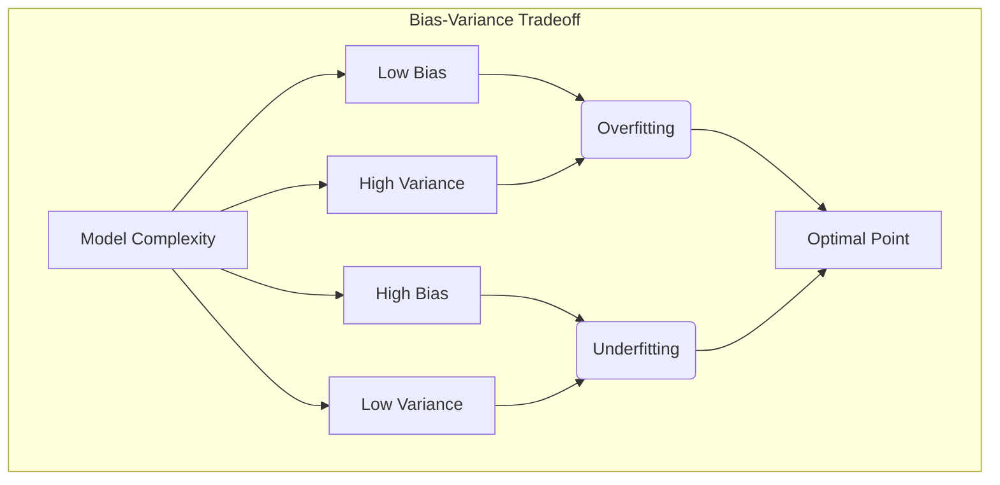
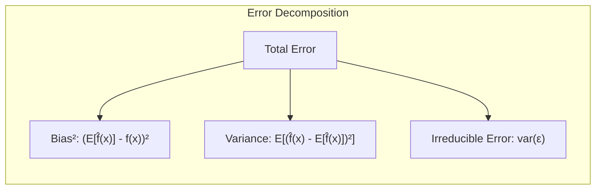
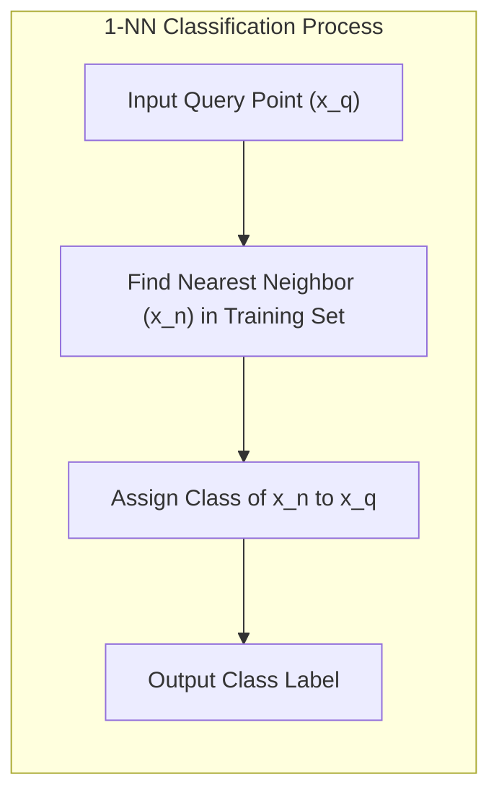
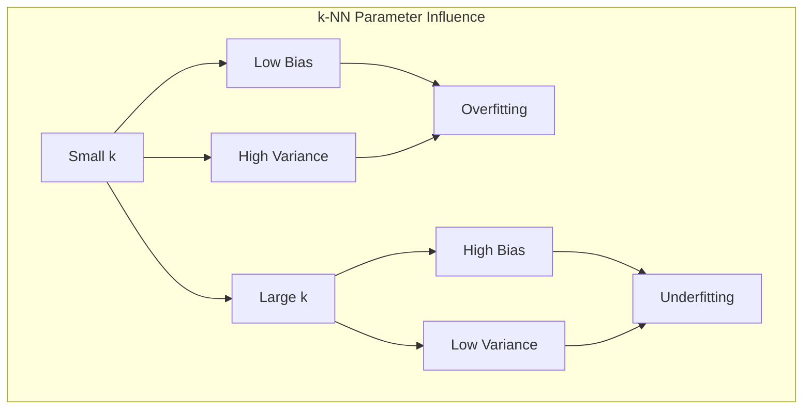
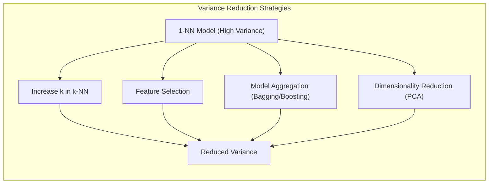

## Viés e Variância no k-NN: O Caso do 1-NN com Baixo Viés e Alta Variância



### Introdução

Este capítulo explora os conceitos de **viés** e **variância** no contexto do método de **1-vizinho mais próximo (1-NN)**, destacando como este algoritmo apresenta uma característica particular: **baixo viés e alta variância** [^13.3]. Analisaremos como a natureza do 1-NN, que se baseia na informação de um único vizinho mais próximo, impacta seu viés (erro sistemático) e variância (sensibilidade às variações no conjunto de treinamento). Compreenderemos como essa relação entre viés e variância é fundamental para o desempenho do 1-NN e como essa relação se manifesta também em outros modelos de aprendizado de máquina.

### Viés e Variância: Descrevendo o Erro de um Modelo

Os conceitos de **viés** e **variância** são ferramentas importantes para analisar o erro de modelos de aprendizado de máquina, e representam diferentes tipos de erro que um modelo pode apresentar.

1.  **Viés (Bias):** O viés representa o erro sistemático de um modelo. Um modelo com alto viés tende a simplificar demais a relação entre as *features* e o resultado, levando a erros sistemáticos e a *underfitting*. Um modelo com baixo viés se adapta bem aos dados de treinamento e é capaz de modelar relações complexas, mas pode ser mais suscetível a *overfitting*.

2.  **Variância (Variance):** A variância representa a sensibilidade de um modelo a flutuações aleatórias no conjunto de treinamento. Um modelo com alta variância é sensível a pequenas mudanças nos dados de treinamento, o que pode levar a uma alta variabilidade nas predições, e a *overfitting*. Um modelo com baixa variância é mais estável e suas predições não variam muito de acordo com o conjunto de treinamento.

O ideal é que um modelo apresente baixo viés e baixa variância, mas na prática, existe um *tradeoff* entre esses dois tipos de erro. A escolha do modelo mais adequado deve levar em consideração esse *tradeoff*, e o objetivo é encontrar um modelo que equilibre o viés e a variância para minimizar o erro total.



**Lemma 93:** O viés e a variância são componentes do erro total de um modelo de aprendizado de máquina, e representam diferentes tipos de erro: um erro sistemático (viés) e a sensibilidade a flutuações nos dados de treino (variância).
*Prova*: O erro total de um modelo pode ser decomposto em três componentes: o viés (bias), a variância e o erro irredutível. $\blacksquare$

**Corolário 93:** O *tradeoff* entre viés e variância é fundamental para a escolha do modelo mais adequado para um determinado problema, e o objetivo é minimizar o erro total por meio do ajuste do modelo.

> ⚠️ **Nota Importante**: O viés representa o erro sistemático do modelo, enquanto a variância representa a sensibilidade do modelo a variações no conjunto de treinamento.

> ❗ **Ponto de Atenção**:  O objetivo em aprendizado de máquina é encontrar um modelo que minimize tanto o viés quanto a variância, o que geralmente envolve um compromisso entre esses dois tipos de erro.

### O 1-NN: Baixo Viés e Alta Variância

O método de **1-vizinho mais próximo (1-NN)** é um exemplo de um classificador que apresenta **baixo viés e alta variância** [^13.3]. A razão para essa característica está na forma como o 1-NN realiza a classificação: ele atribui um novo ponto à classe do único ponto de treinamento mais próximo, sem considerar outros vizinhos ou nenhuma estrutura global dos dados.

1.  **Baixo Viés:** O baixo viés do 1-NN se deve à sua capacidade de se adaptar a qualquer forma da fronteira de decisão entre as classes. Ao classificar um ponto de consulta com base em um único vizinho mais próximo, o 1-NN se ajusta perfeitamente aos dados de treinamento e captura até as menores variações nas regiões de classes, e não introduz um viés do modelo. Isso faz com que a fronteira de decisão do 1-NN seja muito irregular, mas com baixo viés.
2.  **Alta Variância:** A alta variância do 1-NN se deve à sua sensibilidade a pequenas mudanças no conjunto de treinamento. Se o ponto de treinamento mais próximo de um ponto de consulta mudar devido a uma pequena alteração nos dados de treinamento, a classificação pode ser diferente. Essa sensibilidade às flutuações nos dados de treinamento torna o 1-NN um modelo com alta variância.

A combinação de baixo viés e alta variância faz com que o 1-NN seja um modelo que se adapta bem aos dados de treinamento, mas com um alto risco de *overfitting*. O modelo pode apresentar excelentes resultados no conjunto de treinamento, mas seu desempenho em dados não vistos pode ser ruim, pois é sensível ao ruído e às características de cada amostra em particular.

> 💡 **Exemplo Numérico:**
>
> Vamos considerar um cenário de classificação binária com duas classes (A e B). Temos um conjunto de treinamento pequeno com 5 pontos:
>
> - Classe A: (1, 1), (2, 2)
> - Classe B: (4, 4), (5, 5), (6, 6)
>
> Agora, vamos analisar como o 1-NN se comporta com diferentes conjuntos de treinamento ligeiramente alterados.
>
> **Conjunto de Treinamento 1 (Original):**
>
> ```
> Classe A: (1, 1), (2, 2)
> Classe B: (4, 4), (5, 5), (6, 6)
> ```
>
> Um novo ponto (3, 3) seria classificado como Classe A, pois o ponto (2, 2) é o mais próximo.
>
> **Conjunto de Treinamento 2 (com pequena mudança):**
>
> Vamos adicionar um novo ponto da classe A e remover um ponto da classe B.
>
> ```
> Classe A: (1, 1), (2, 2), (3.5, 3.5)
> Classe B: (4, 4), (5, 5)
> ```
>
> O mesmo ponto (3, 3) agora seria classificado como Classe B, pois (4, 4) é o ponto mais próximo.
>
> Essa mudança na classificação de um mesmo ponto, devido a uma pequena alteração no conjunto de treinamento, ilustra a **alta variância** do 1-NN. O modelo se adaptou muito ao novo ponto (3.5, 3.5), alterando a decisão para pontos próximos. O modelo tem **baixo viés** porque ele consegue classificar corretamente os pontos do conjunto de treinamento, mas a alta variância o torna instável.



**Lemma 94:** O 1-NN apresenta baixo viés devido à sua capacidade de se adaptar à forma dos dados, mas apresenta alta variância devido à sua sensibilidade a flutuações no conjunto de treinamento, que pode gerar instabilidade em sua capacidade de generalização.
*Prova*: O baixo viés surge da escolha do vizinho mais próximo como representativo da região local, o que garante um ajuste ao conjunto de treino, mas a alta variância é consequência da instabilidade na escolha desse vizinho. $\blacksquare$

**Corolário 94:** A combinação de baixo viés e alta variância faz com que o 1-NN seja um modelo com boa capacidade de ajuste a dados complexos, mas também com um risco de *overfitting*.

> ⚠️ **Nota Importante**:  O 1-NN apresenta baixo viés, pois se ajusta bem aos dados de treinamento, mas apresenta alta variância devido à sua sensibilidade a flutuações nos dados.

> ❗ **Ponto de Atenção**:  O 1-NN pode apresentar bom desempenho no conjunto de treinamento, mas seu desempenho em dados não vistos é afetado por sua alta variância.

### Relação entre Viés e Variância no k-NN: O Papel do Parâmetro *k*

No contexto do k-NN, o parâmetro $k$ (número de vizinhos) desempenha um papel fundamental na relação entre viés e variância [^13.3].

1.  **Valores Pequenos de k:** Valores pequenos de $k$ (ex: $k=1$) tornam o modelo mais sensível a detalhes do conjunto de treinamento, como ruído e *outliers*, o que resulta em modelos de baixo viés e alta variância. O modelo se ajusta de forma muito precisa aos dados de treinamento, mas tem dificuldade para generalizar.
2.  **Valores Grandes de k:** Valores grandes de $k$ fazem com que o modelo considere um número maior de vizinhos para tomar a decisão, o que leva a modelos mais estáveis e menos sensíveis a flutuações nos dados de treinamento, reduzindo sua variância. No entanto, essa escolha também aumenta o viés do modelo, pois regiões mais amplas no espaço de *features* são consideradas no momento da classificação, o que faz com que o modelo não capture a estrutura local dos dados.

A escolha do valor ideal de $k$ no k-NN envolve um *tradeoff* entre viés e variância: valores pequenos levam a modelos com baixo viés e alta variância, enquanto valores grandes levam a modelos com alto viés e baixa variância. O objetivo é escolher um valor de $k$ que equilibre o viés e a variância, de forma a minimizar o erro total de generalização do modelo. Métodos de validação cruzada podem ser usados para escolher o valor ótimo do parâmetro $k$.



> 💡 **Exemplo Numérico:**
>
> Vamos usar o mesmo conjunto de dados do exemplo anterior, mas agora com k=3:
>
> **Conjunto de Treinamento:**
>
> ```
> Classe A: (1, 1), (2, 2), (3.5, 3.5)
> Classe B: (4, 4), (5, 5), (6, 6)
> ```
>
> Para classificar o ponto (3, 3) com k=3, calculamos os 3 vizinhos mais próximos:
>
> 1.  (2, 2) - Classe A
> 2.  (3.5, 3.5) - Classe A
> 3.  (4, 4) - Classe B
>
> A classe mais frequente entre os 3 vizinhos é A (2 votos contra 1 de B), portanto, o ponto (3, 3) é classificado como Classe A.
>
> Agora, vamos comparar com o caso do 1-NN:
>
> | k | Ponto (3,3) | Classificação |
> |---|---|---|
> | 1 | (3,3) | B |
> | 3 | (3,3) | A |
>
> Com k=3, o modelo se torna menos sensível a pequenas variações no conjunto de treinamento, reduzindo a variância. A decisão agora é influenciada por mais pontos, o que leva a uma decisão mais estável. No entanto, a fronteira de decisão agora é menos flexível, o que pode aumentar o viés do modelo.

**Lemma 95:** No k-NN, a escolha do parâmetro $k$ tem um impacto direto no equilíbrio entre viés e variância, com valores baixos de $k$ levando a modelos de baixa viés e alta variância, e valores altos de $k$ levando a modelos de alto viés e baixa variância.
*Prova*: Valores baixos de k levam o modelo a considerar apenas vizinhos muito próximos, o que faz com que o modelo siga o conjunto de dados de treino com precisão, mas com alta variabilidade caso esse vizinhos próximos sejam afetados por ruídos. Valores altos fazem o modelo ignorar as particularidades do conjunto de treino e basear sua decisão em áreas mais amplas, levando a maior viés. $\blacksquare$

**Corolário 95:** A escolha do valor de $k$ é um aspecto fundamental do k-NN, e a validação cruzada é um método para escolher o valor de $k$ que otimiza o balanço entre viés e variância.

> ⚠️ **Nota Importante**: O parâmetro $k$ no k-NN controla o equilíbrio entre viés e variância, e a escolha adequada de $k$ é essencial para obter um bom desempenho do modelo.

> ❗ **Ponto de Atenção**: A escolha ideal de k varia de acordo com as características do problema e do conjunto de dados, e deve ser obtida por meio de validação cruzada.

### Estratégias para Reduzir a Variância do 1-NN

Devido à sua alta variância, o 1-NN pode não ser a melhor escolha em muitas aplicações práticas. No entanto, existem algumas estratégias que podem ser usadas para reduzir a variância do 1-NN e melhorar seu desempenho:

1.  **Utilização do k-NN:** Aumentar o valor de $k$ no k-NN é a forma mais simples de reduzir a variância do modelo, utilizando informação de mais de um vizinho para classificar um ponto.
2.  **Seleção de Características:** Remover *features* irrelevantes ou ruidosas do conjunto de dados pode ajudar a reduzir o impacto de flutuações aleatórias na distância e a melhorar a robustez do modelo.
3.  **Agregação de Modelos:** Utilizar o 1-NN como parte de um modelo maior, onde as previsões de vários 1-NN são agregadas para produzir um resultado mais estável. Por exemplo, o uso de *bagging* ou *boosting* sobre modelos 1-NN.
4.  **Redução de Dimensionalidade:** Projetar os dados em um espaço de baixa dimensionalidade pode reduzir o impacto da maldição da dimensionalidade, que aumenta a variância dos modelos k-NN em altas dimensões.



> 💡 **Exemplo Numérico:**
>
> Suponha que temos um conjunto de dados com 10 *features*, mas apenas 2 *features* são relevantes para a classificação. O 1-NN usando todas as 10 *features* pode ser muito sensível a ruídos nas *features* irrelevantes, levando a uma alta variância.
>
> **Conjunto de Dados Original:**
>
> 10 *features* (2 relevantes + 8 irrelevantes/ruidosas)
>
> Se aplicarmos uma técnica de seleção de *features* e reduzirmos o número de *features* para 2, o 1-NN se torna menos sensível a ruídos e, portanto, tem sua variância reduzida.
>
> **Conjunto de Dados Após Seleção de *Features*:**
>
> 2 *features* (apenas as relevantes)
>
> Outra estratégia seria utilizar *Principal Component Analysis (PCA)* para projetar os dados em um espaço de baixa dimensionalidade. Vamos supor que as duas primeiras componentes principais capturam a maior parte da variância dos dados:
>
> **Conjunto de Dados Após PCA:**
>
> 2 componentes principais
>
> Em ambos os casos, o 1-NN terá uma variância menor, pois o modelo se torna mais robusto a ruídos e flutuações nas *features* originais.

**Lemma 96:** A utilização de estratégias para reduzir a variância do 1-NN melhora a capacidade de generalização do modelo para dados não vistos e aumenta a sua robustez a ruídos no conjunto de dados de treinamento.
*Prova*: Utilizar as informações de mais de um vizinho ou de subespaços com menor dimensionalidade estabiliza a decisão, tornando o modelo menos dependente de detalhes específicos do ponto mais próximo. $\blacksquare$

**Corolário 96:** A escolha da abordagem adequada para reduzir a variância do 1-NN depende das características do conjunto de dados e dos objetivos do problema de classificação.

> ⚠️ **Nota Importante**:  Existem diversas estratégias que podem ser usadas para reduzir a variância do 1-NN, como o uso do k-NN, seleção de *features*, agregação de modelos e redução de dimensionalidade.

> ❗ **Ponto de Atenção**:  A escolha da estratégia mais adequada para lidar com a alta variância do 1-NN deve ser feita considerando o equilíbrio entre viés e variância e a complexidade computacional do modelo.

### Conclusão

O 1-NN é um classificador que apresenta baixo viés e alta variância, o que o torna uma ferramenta adequada para capturar padrões complexos nos dados, mas também sensível a flutuações nos dados de treinamento. A compreensão dessa relação entre viés e variância é fundamental para a aplicação eficaz do 1-NN e para a escolha de outras abordagens que busquem um equilíbrio entre esses dois tipos de erro. A escolha do número de vizinhos $k$ no k-NN é uma das formas de ajustar o balanço entre viés e variância.

### Footnotes

[^13.3]: "These classifiers are memory-based, and require no model to be fit. Given a query point xo, we find the k training points x(r), r = 1,..., k closest in distance to xo, and then classify using majority vote among the k neighbors...Because it uses only the training point closest to the query point, the bias of the 1-nearest-neighbor estimate is often low, but the variance is high." *(Trecho de "13. Prototype Methods and Nearest-Neighbors")*
