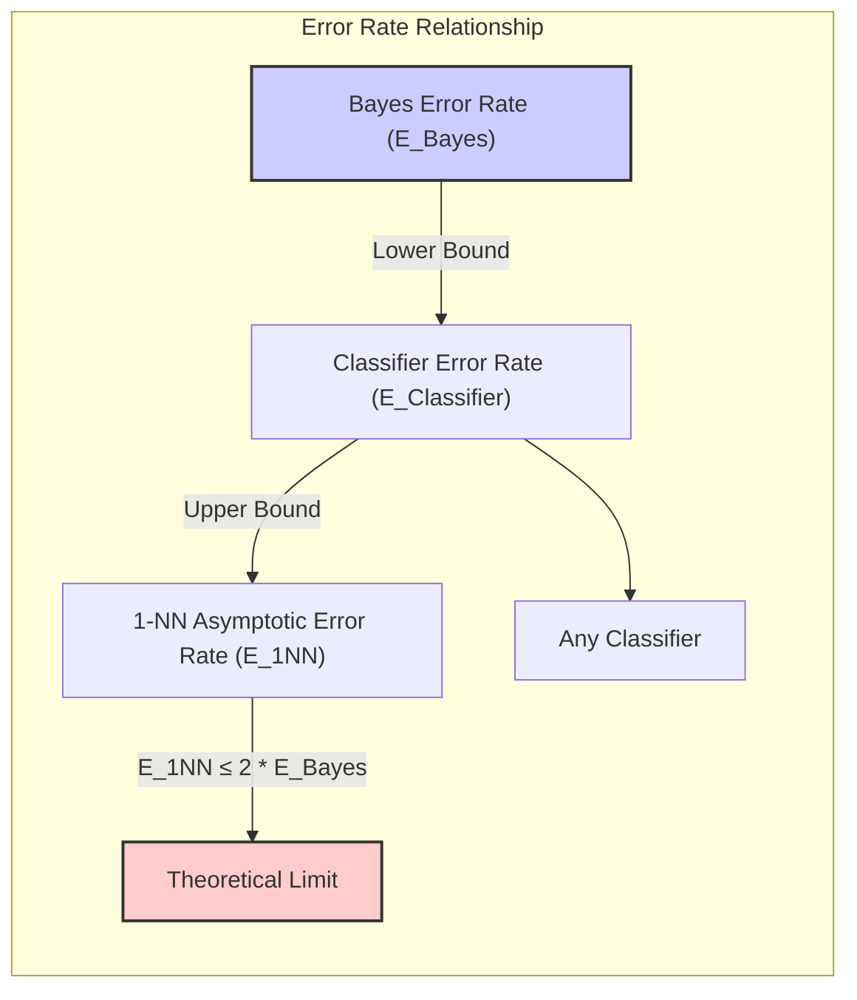
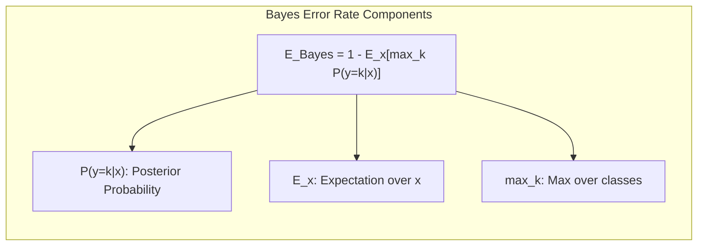
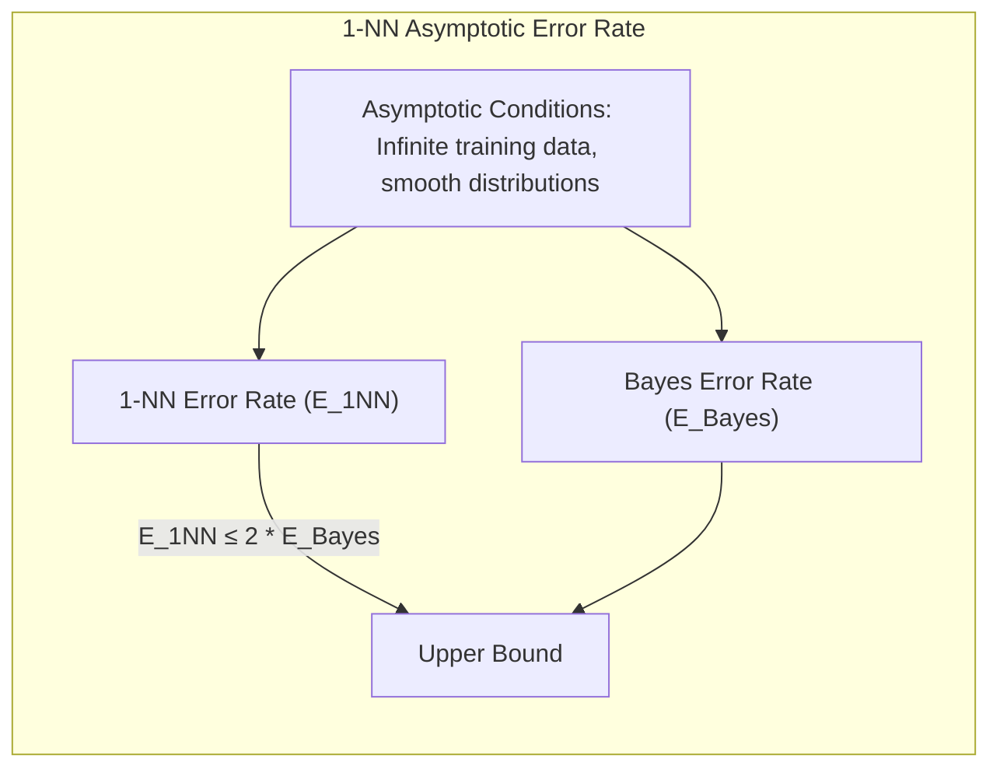
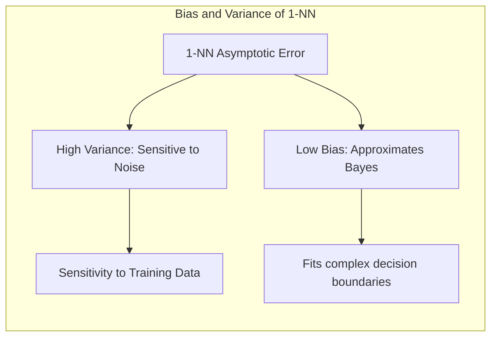

## Taxa de Erro Assintótica do 1-NN: Limitada a Duas Vezes a Taxa de Erro de Bayes

### Introdução

Este capítulo explora a **taxa de erro assintótica** do método de **1-vizinho mais próximo (1-NN)**, demonstrando como essa taxa é limitada a, no máximo, duas vezes a **taxa de erro de Bayes** [^13.3]. A taxa de erro de Bayes é o menor erro possível para qualquer classificador, considerando a distribuição de probabilidade das classes. Analisaremos como esse limite superior da taxa de erro do 1-NN é derivado, e o que esse resultado implica sobre o desempenho do 1-NN em problemas de classificação. Discutiremos também como esse resultado se relaciona com o conceito de viés e variância, e como o desempenho do 1-NN se compara a outras abordagens de classificação.

### Taxa de Erro de Bayes: O Limite Inferior do Erro de Classificação

A **taxa de erro de Bayes** é um conceito fundamental em teoria da classificação, que define o **limite inferior** do erro para qualquer classificador, considerando a distribuição de probabilidade das classes [^13.3]. Em outras palavras, nenhum classificador pode apresentar um desempenho melhor do que a taxa de erro de Bayes, pois esse erro representa a incerteza inerente na atribuição de rótulos de classe, dado o conhecimento das distribuições das classes.

Formalmente, a taxa de erro de Bayes em um problema de classificação com $K$ classes é dada por:

$$E_{Bayes} = 1 - \mathbb{E}_x \left[ \max_k P(y=k|x) \right]$$

Onde $P(y=k|x)$ é a probabilidade *a posteriori* de um ponto $x$ pertencer à classe $k$, e a esperança é tomada sobre todas as possíveis observações $x$. Essa expressão quantifica a probabilidade do classificador Bayesiano cometer um erro, e representa o melhor desempenho que um classificador pode ter.

O classificador Bayesiano, que minimiza a taxa de erro de Bayes, atribui cada ponto de consulta à classe com a maior probabilidade *a posteriori*. Em muitos casos práticos, a probabilidade *a posteriori* é desconhecida, e os algoritmos de aprendizado de máquina buscam aproximar essa probabilidade com base nos dados de treinamento.

**Lemma 97:** A taxa de erro de Bayes representa o limite inferior do erro para qualquer classificador, dado o conhecimento das distribuições de probabilidade das classes.
*Prova*: O classificador Bayesiano é definido como aquele que minimiza a probabilidade de erro, e essa probabilidade é a taxa de erro de Bayes. $\blacksquare$

**Corolário 97:** Nenhum classificador pode atingir um desempenho melhor do que o classificador bayesiano, o que torna a taxa de erro de Bayes um limite inferior para a avaliação de classificadores.

> ⚠️ **Nota Importante**: A taxa de erro de Bayes representa o melhor desempenho possível para qualquer classificador, e nenhum classificador pode ter um desempenho melhor do que esse.

> ❗ **Ponto de Atenção**: A taxa de erro de Bayes é um conceito teórico, que nem sempre pode ser alcançado na prática devido à dificuldade de estimar as verdadeiras distribuições das classes.

> 💡 **Exemplo Numérico:**
>
> Considere um problema de classificação binária com duas classes, A e B. Suponha que, para um ponto de dados específico $x$, as probabilidades a posteriori sejam $P(y=A|x) = 0.7$ e $P(y=B|x) = 0.3$. O classificador Bayesiano atribuiria $x$ à classe A, pois tem a maior probabilidade.
>
> Agora, vamos considerar outro ponto de dados $x'$ onde $P(y=A|x') = 0.4$ e $P(y=B|x') = 0.6$. Aqui, o classificador Bayesiano atribuiria $x'$ à classe B. A taxa de erro de Bayes calcula a probabilidade média de erro para todos os pontos $x$.
>
> Para simplificar, vamos supor que temos apenas esses dois pontos de dados. O erro para $x$ é 0 (pois foi classificado corretamente como A), e para $x'$ é 0 (classificado corretamente como B). Se tivéssemos um ponto $x''$ com $P(y=A|x'') = 0.49$ e $P(y=B|x'') = 0.51$, o classificador Bayesiano atribuiria $x''$ à classe B, e o erro para este ponto seria 0. No entanto, se um classificador não-bayesiano classificasse $x''$ como A, teria um erro.
>
> Se os dados fossem distribuídos de forma que a taxa de erro de Bayes fosse, por exemplo, 0.1 (10%), isso significa que, mesmo com o melhor classificador possível, haveria 10% de chance de erro devido à sobreposição das distribuições das classes.

### Taxa de Erro Assintótica do 1-NN: Uma Limitação Superior

A **taxa de erro assintótica** do método de **1-vizinho mais próximo (1-NN)** é um resultado teórico que demonstra que, em condições assintóticas, a taxa de erro do 1-NN é sempre limitada a duas vezes a taxa de erro de Bayes [^13.3]. Essa condição assintótica pressupõe que a quantidade de dados de treino tende ao infinito e que a distribuição dos dados no espaço de *features* é suave.

O resultado da taxa de erro assintótica do 1-NN pode ser expresso como:

$$E_{1NN} \leq 2 E_{Bayes}$$

Onde $E_{1NN}$ é a taxa de erro assintótica do 1-NN, e $E_{Bayes}$ é a taxa de erro de Bayes. Esse resultado significa que, mesmo que o 1-NN use a informação de apenas um vizinho mais próximo, sua taxa de erro nunca será mais do que o dobro da taxa de erro do classificador ideal (Bayesiano).

A derivação desse resultado envolve a análise da probabilidade de erro do 1-NN em condições ideais, onde o ponto de consulta coincide com um dos pontos de treinamento. Nesses casos, o erro do 1-NN surge da probabilidade de que o vizinho mais próximo tenha um rótulo de classe diferente do ponto de consulta, o que resulta em um erro que é, no máximo, duas vezes maior do que o erro do classificador de Bayes.

**Lemma 98:** A taxa de erro assintótica do 1-NN é limitada a duas vezes a taxa de erro de Bayes, ou seja, o 1-NN não pode ter um desempenho pior do que o dobro da taxa de erro do melhor classificador possível.
*Prova*: A prova do resultado assume que a amostra de teste coincide com a amostra de treinamento, e que o erro será a probabilidade de o vizinho mais próximo ter classe diferente do ponto de treino, que é, no máximo, duas vezes o erro de Bayes. $\blacksquare$

**Corolário 98:** A taxa de erro assintótica do 1-NN representa um limite superior para o erro que esse classificador pode atingir sob condições ideais.

> ⚠️ **Nota Importante**: A taxa de erro assintótica do 1-NN é limitada a duas vezes a taxa de erro de Bayes, o que demonstra que o 1-NN é um classificador razoavelmente eficiente, mesmo com sua simplicidade.

> ❗ **Ponto de Atenção**:  O resultado da taxa de erro assintótica do 1-NN é válido apenas sob condições ideais, e o desempenho do 1-NN em problemas reais pode ser afetado por fatores como a dimensão do espaço de *features*, a presença de ruído e a natureza das distribuições das classes.

> 💡 **Exemplo Numérico:**
>
> Imagine um cenário simplificado onde a taxa de erro de Bayes, calculada com base nas distribuições de probabilidade das classes, seja de 5% (0.05). De acordo com o resultado teórico, a taxa de erro assintótica do classificador 1-NN, em condições ideais (muitos dados e distribuições suaves), seria, no máximo, o dobro dessa taxa, ou seja, 10% (0.10). Isso significa que, mesmo usando apenas o vizinho mais próximo para fazer a classificação, a chance de erro do 1-NN não excederia 10%, enquanto o classificador ideal teria um erro de 5%.
>
> Vamos detalhar um pouco mais. Suponha que temos um ponto de teste $x_t$ que coincide com um ponto de treinamento $x_i$. O 1-NN classifica $x_t$ com o rótulo de $x_i$. O erro ocorrerá se o vizinho mais próximo de $x_i$ (chamemos de $x_j$) tiver um rótulo diferente de $x_i$. A probabilidade desse erro é, no máximo, duas vezes a probabilidade de erro do classificador de Bayes.
>
>  Por exemplo, se $P(y=A|x_i) = 0.9$ e $P(y=B|x_i) = 0.1$, o classificador de Bayes classificaria $x_i$ como A, e a probabilidade de erro seria 0.1. Se o vizinho mais próximo de $x_i$ for de outra classe (B) e o 1-NN o classificar como B, o erro é cometido. A probabilidade desse erro é limitada a $2 \times 0.1 = 0.2$ (20%). Isso ilustra a ideia de que a taxa de erro do 1-NN é limitada por duas vezes a taxa de erro de Bayes.

### Relação com Viés e Variância

A relação entre a taxa de erro assintótica do 1-NN e a taxa de erro de Bayes pode ser interpretada em termos de **viés** e **variância** [^13.3].

1.  **Baixo Viés:** A taxa de erro do 1-NN aproxima-se da taxa de erro de Bayes sob condições assintóticas, o que indica que o 1-NN tem um baixo viés. O 1-NN é capaz de se ajustar a fronteiras de decisão complexas, sem impor suposições fortes sobre a distribuição dos dados.
2.  **Alta Variância:** No entanto, o fato de que a taxa de erro do 1-NN é limitada a duas vezes a taxa de erro de Bayes reflete a alta variância do 1-NN. O 1-NN é muito sensível a ruídos e flutuações nos dados de treinamento, o que pode levar a uma grande variação nas suas predições.

Apesar de seu baixo viés, a alta variância do 1-NN pode limitar seu desempenho em problemas práticos, e é por isso que outras técnicas, como o k-NN com $k>1$, ou o uso de métodos de regularização e redução de dimensionalidade são importantes para obter melhor capacidade de generalização.

**Lemma 99:** A taxa de erro assintótica do 1-NN reflete seu baixo viés (capacidade de aproximar o classificador Bayesiano) e sua alta variância (sensibilidade ao conjunto de treino e flutuações).
*Prova*: A relação entre o erro de Bayes e o erro assintótico do 1-NN surge das características do algoritmo, que se baseia em um único vizinho, o que leva ao baixo viés e à alta variância. $\blacksquare$

**Corolário 99:** O k-NN com $k>1$ pode melhorar o desempenho do 1-NN ao reduzir a sua alta variância, embora também introduza um pequeno aumento do viés.

> ⚠️ **Nota Importante**:  A taxa de erro assintótica do 1-NN reflete o *tradeoff* entre baixo viés e alta variância característico desse classificador.

> ❗ **Ponto de Atenção**: Embora o 1-NN seja um classificador eficaz, sua alta variância pode limitar seu desempenho em alguns problemas práticos, sendo necessário considerar abordagens que equilibrem viés e variância.

> 💡 **Exemplo Numérico:**
>
> Considere um conjunto de dados com pontos em duas classes (A e B) em um espaço bidimensional. Com o 1-NN, a fronteira de decisão pode ser muito irregular, seguindo de perto os pontos de treinamento. Se um ponto de teste estiver próximo a um ponto de treinamento da classe A, ele será classificado como A, mesmo que haja muitos pontos da classe B ligeiramente mais distantes. Isso ilustra a alta variância, pois pequenas mudanças no conjunto de treinamento podem levar a grandes mudanças nas fronteiras de decisão.
>
> Em termos de viés, o 1-NN tenta se ajustar da melhor forma possível aos dados de treinamento, sem impor uma estrutura pré-definida. Isso o torna um classificador de baixo viés, pois ele consegue capturar padrões complexos nos dados.
>
> Para visualizar o efeito da variância, imagine que você tenha um conjunto de dados de treinamento ligeiramente diferente (talvez com alguns pontos adicionais ou pontos ligeiramente movidos). O classificador 1-NN ajustaria suas fronteiras de decisão a esses novos pontos, o que poderia levar a classificações diferentes para alguns pontos de teste. Essa sensibilidade a variações no conjunto de treinamento é a manifestação da alta variância.
>
> Por outro lado, um classificador linear, por exemplo, teria uma fronteira de decisão reta e seria menos afetado por pequenas mudanças nos dados de treinamento (menor variância), mas poderia não se ajustar bem a dados com fronteiras mais complexas (maior viés). O 1-NN, com sua alta variância, se adapta melhor a fronteiras complexas, mas pode ser mais sensível ao ruído.

### Conclusão

A taxa de erro assintótica do 1-NN, limitada a duas vezes a taxa de erro de Bayes, é um resultado importante que define um limite superior para o erro desse classificador sob condições ideais. A combinação de baixo viés e alta variância torna o 1-NN uma ferramenta versátil, mas que deve ser usada com cuidado em problemas reais. A compreensão desses conceitos é fundamental para a escolha e aplicação adequada do 1-NN e para o desenvolvimento de métodos de classificação mais eficazes.

### Footnotes

[^13.3]: "These classifiers are memory-based, and require no model to be fit. Given a query point xo, we find the k training points x(r), r = 1,..., k closest in distance to xo, and then classify using majority vote among the k neighbors...A famous result of Cover and Hart (1967) shows that asymptotically the error rate of the 1-nearest-neighbor classifier is never more than twice the Bayes rate. The rough idea of the proof is as follows (using squared-error loss). We assume that the query point coincides with one of the training points, so that the bias is zero." *(Trecho de "13. Prototype Methods and Nearest-Neighbors")*
