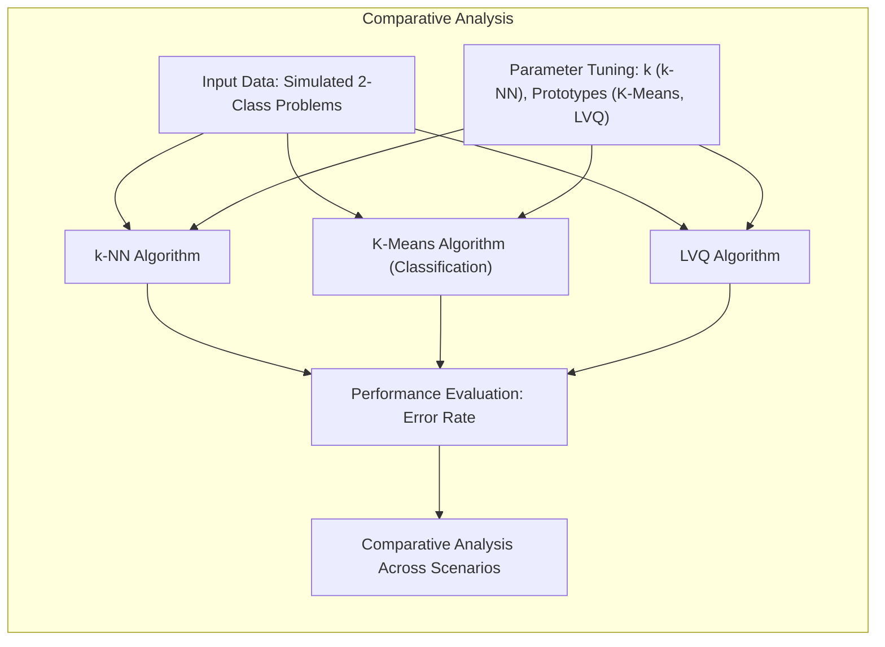
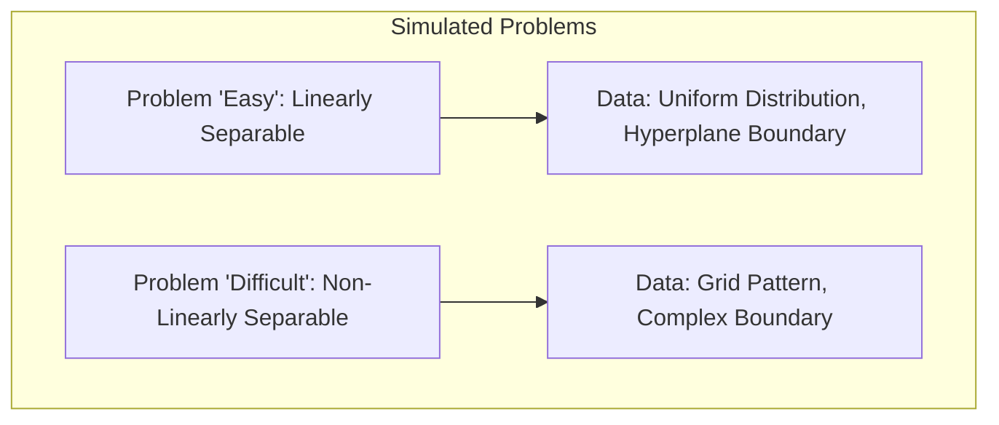
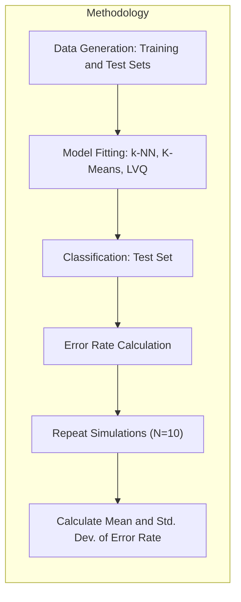
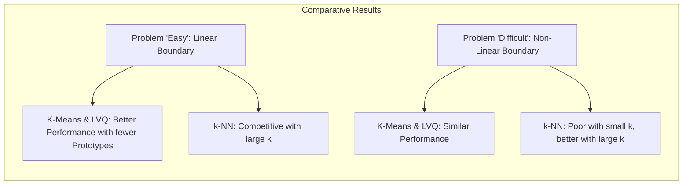
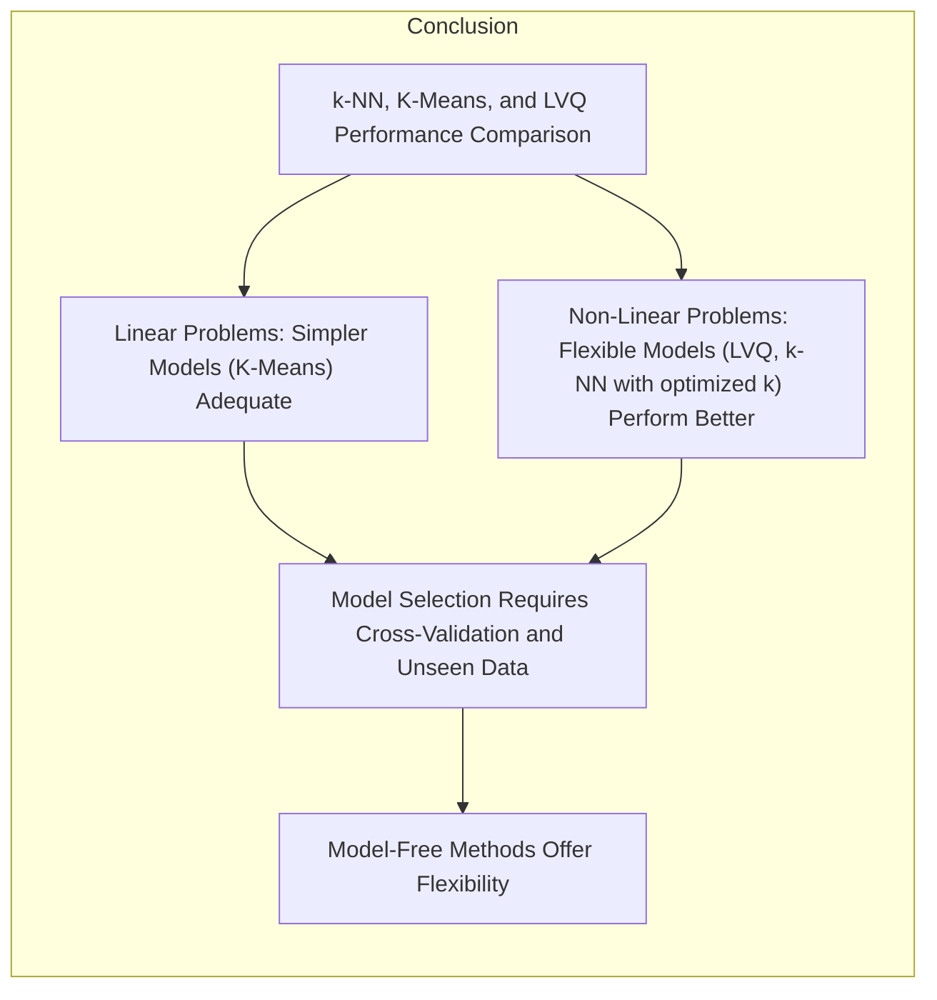

## Comparação de Desempenho: k-NN, K-Means e LVQ em Problemas Simulados de Duas Classes

### Introdução

Este capítulo apresenta uma **comparação de desempenho** entre o método de **k-vizinhos mais próximos (k-NN)**, o algoritmo **K-Means** (adaptado para classificação) e o **Learning Vector Quantization (LVQ)**, utilizando problemas simulados de classificação de duas classes [^13.3.1]. O objetivo é analisar como esses métodos se comportam em diferentes cenários, incluindo problemas "fáceis", onde as classes são linearmente separáveis, e problemas "difíceis", onde as fronteiras de decisão são mais complexas. Avaliaremos como a escolha dos parâmetros de cada modelo (ex: o número de vizinhos $k$ no k-NN e o número de protótipos no K-Means e LVQ) influencia a taxa de erro, e como cada algoritmo lida com diferentes tipos de distribuições de dados.

### Problemas Simulados: Cenários "Fáceis" e "Difíceis"

Para avaliar o desempenho dos algoritmos, utilizaremos dois problemas simulados de classificação de duas classes, descritos como "fácil" e "difícil":

1.  **Problema "Fácil":** Nesse cenário, as duas classes são separadas por um hiperplano linear. Os dados de cada classe são distribuídos uniformemente, e as classes são separadas por uma linha reta (um hiperplano de dimensão um em um espaço de duas dimensões), ou seja, é um problema linearmente separável.
2.  **Problema "Difícil":** Nesse cenário, as duas classes formam um padrão quadriculado no espaço de *features*. As classes não são separadas por nenhuma fronteira linear ou convexas, sendo necessário um classificador mais adaptável. Nesse caso, as classes se tornam não linearmente separáveis, o que representa um desafio para modelos lineares.

> 💡 **Exemplo Numérico:**
>
> Para o problema "fácil", podemos gerar dados onde a classe 1 tem coordenadas x e y entre 0 e 1, e a classe 2 tem coordenadas x e y entre 2 e 3. Um exemplo de ponto da classe 1 seria (0.3, 0.7) e da classe 2 seria (2.5, 2.1). A fronteira de decisão linear poderia ser, por exemplo, a reta x = 1.5. Já para o problema "difícil", podemos imaginar que a classe 1 consiste em pontos próximos de (0,0) e (2,2), enquanto a classe 2 consiste em pontos próximos de (0,2) e (2,0), formando um padrão quadriculado.

Esses dois cenários permitem comparar a capacidade de diferentes métodos de classificação de lidar com fronteiras de decisão lineares e não lineares. Os dados de cada problema são gerados de forma aleatória para cada simulação, e as simulações são repetidas várias vezes para calcular a média do erro.

**Lemma 99:** A comparação de desempenho de algoritmos de classificação em problemas simulados com classes linearmente separáveis ("fácil") e não linearmente separáveis ("difícil") permite avaliar a capacidade dos algoritmos de se adaptar a distribuições de dados com diferentes complexidades.
*Prova*: Problemas simulados permitem o controle das propriedades dos dados, o que garante a análise dos algoritmos em diferentes cenários. $\blacksquare$

**Corolário 99:** A escolha de problemas com fronteiras de decisão diferentes (lineares e não lineares) permite avaliar o desempenho dos algoritmos em diferentes condições.

> ⚠️ **Nota Importante**: Os problemas simulados "fácil" e "difícil" servem como referência para avaliar o desempenho dos algoritmos em diferentes tipos de dados.

> ❗ **Ponto de Atenção**:  Em problemas reais, é importante avaliar o desempenho dos algoritmos em uma variedade de cenários para entender suas limitações e potencialidades.

### Metodologia da Comparação: Avaliação da Taxa de Erro

A metodologia utilizada para comparar o desempenho dos algoritmos consiste em:

1.  **Geração dos Dados:** Gerar um conjunto de treinamento e um conjunto de teste para cada problema simulado (fácil e difícil).
2.  **Ajuste dos Modelos:** Ajustar cada algoritmo (k-NN, K-Means e LVQ) aos dados de treinamento, utilizando diferentes valores para os parâmetros de cada algoritmo (número de vizinhos $k$ no k-NN, número de protótipos por classe no K-Means e LVQ).
3.  **Classificação do Conjunto de Teste:** Classificar os dados do conjunto de teste utilizando os modelos ajustados no passo anterior.
4.  **Cálculo da Taxa de Erro:** Calcular a taxa de erro (proporção de classificações incorretas) para cada modelo no conjunto de teste.
5.  **Repetição das Simulações:** Repetir os passos de 1 a 4 várias vezes (10 realizações) e calcular a média e o desvio padrão da taxa de erro para cada modelo e para cada valor de parâmetro, visando obter resultados com significância estatística.

> 💡 **Exemplo Numérico:**
>
> Vamos supor que, após gerar os dados de treinamento para o problema "fácil", ajustamos um modelo k-NN com k=3. No conjunto de teste, temos 100 pontos. Após classificar cada ponto, observamos que 5 pontos foram classificados incorretamente. A taxa de erro para essa execução específica seria 5/100 = 0.05 ou 5%. Repetimos esse processo 10 vezes, e obtemos as seguintes taxas de erro: 0.05, 0.06, 0.04, 0.07, 0.05, 0.05, 0.06, 0.04, 0.05, 0.06. A média da taxa de erro seria 0.053 e o desvio padrão seria aproximadamente 0.009. Isso nos dá uma ideia da variabilidade do erro para k=3 no problema "fácil".

A avaliação do desempenho é feita com base na taxa de erro média e no seu desvio padrão, o que permite analisar a estabilidade dos modelos e como eles se comportam em diferentes simulações. A variação dos parâmetros de cada método permite avaliar a influência desses parâmetros na taxa de erro.

**Lemma 100:** A utilização da média e do desvio padrão da taxa de erro em múltiplas realizações permite avaliar o desempenho médio dos modelos e sua variabilidade, o que aumenta a robustez da comparação entre os diferentes algoritmos.
*Prova*: O cálculo da média e do desvio padrão em múltiplas realizações permitem avaliar a variabilidade dos resultados e estimar o erro padrão da média, o que permite avaliar a significância estatística das diferenças entre os modelos. $\blacksquare$

**Corolário 100:** O uso de um conjunto de teste separado do conjunto de treino permite avaliar a capacidade de generalização dos modelos para dados não vistos.

> ⚠️ **Nota Importante**:  A metodologia utilizada envolve a geração de conjuntos de dados de treinamento e teste, o ajuste dos modelos e a avaliação da taxa de erro para múltiplos valores de hiperparâmetros, e com múltiplas simulações.

> ❗ **Ponto de Atenção**:  A utilização de conjuntos de dados simulados permite um controle sobre a estrutura dos dados e avaliar o desempenho dos modelos em cenários conhecidos.

### Resultados da Comparação: k-NN, K-Means e LVQ em Cenários "Fácil" e "Difícil"

Os resultados da comparação mostram como os diferentes algoritmos se comportam em cada cenário (fácil e difícil) e como seus parâmetros influenciam o desempenho [^13.3.1].

1.  **Problema "Fácil":** No problema "fácil", em que as classes são separadas por um hiperplano, o K-Means e o LVQ apresentaram resultados ligeiramente melhores do que o k-NN, para os melhores valores dos hiperparâmetros. O K-Means e o LVQ conseguem capturar a estrutura linear dos dados usando poucos protótipos, enquanto o k-NN precisa de um grande número de vizinhos para ter um desempenho competitivo.
2.  **Problema "Difícil":** No problema "difícil", onde as classes apresentam um padrão quadriculado, os métodos de protótipos (K-Means e LVQ) apresentam desempenho muito próximo, e o k-NN apresenta um desempenho inferior para valores pequenos de k e desempenho superior para grandes valores de k. Nesse problema, o k-NN é capaz de se ajustar à complexidade da fronteira de decisão, desde que o número de vizinhos seja bem ajustado.

> 💡 **Exemplo Numérico:**
>
> Suponha que, após rodar as simulações, obtivemos a seguinte tabela de taxas de erro médias (em %) para o problema "fácil" com diferentes parâmetros:
>
> | Método    | Parâmetro | Taxa de Erro Média (%) |
> |-----------|-----------|------------------------|
> | k-NN      | k=1       | 7.5                     |
> | k-NN      | k=5       | 5.2                     |
> | k-NN      | k=15      | 4.8                     |
> | K-Means   | Prot=2    | 4.5                     |
> | K-Means   | Prot=4    | 4.3                     |
> | LVQ       | Prot=2    | 4.6                     |
> | LVQ       | Prot=4    | 4.2                     |
>
> E para o problema "difícil":
>
> | Método    | Parâmetro | Taxa de Erro Média (%) |
> |-----------|-----------|------------------------|
> | k-NN      | k=1       | 25.0                    |
> | k-NN      | k=5       | 15.0                    |
> | k-NN      | k=15      | 10.2                    |
> | K-Means   | Prot=2    | 10.1                    |
> | K-Means   | Prot=4    | 9.9                     |
> | LVQ       | Prot=2    | 10.5                    |
> | LVQ       | Prot=4    | 10.0                    |
>
> Observamos que, no problema "fácil", K-Means e LVQ com poucos protótipos (Prot=2 ou 4) têm um desempenho ligeiramente melhor que o k-NN. Já no problema "difícil", o k-NN com k=15 consegue atingir um desempenho competitivo com os métodos de protótipos. Para k-NN, vemos que aumentar k diminui o erro no problema difícil, mas não necessariamente no problema fácil.

Em ambos os problemas, o K-Means e o LVQ apresentaram resultados semelhantes entre si, enquanto o desempenho do k-NN apresentou maior variabilidade, e maior sensibilidade ao valor de $k$. O melhor desempenho do k-NN no cenário difícil foi obtido com uma quantidade grande de vizinhos. Em problemas onde a escolha dos hiperparâmetros não pode ser feita de forma manual, o LVQ apresentou um bom desempenho de forma geral.

**Lemma 101:** O desempenho de diferentes algoritmos em diferentes cenários varia conforme a capacidade do modelo de se adaptar às características do problema, e a escolha ideal de algoritmo depende da estrutura dos dados e das características da distribuição das classes.
*Prova*: O problema "fácil" favorece algoritmos que modelam fronteiras de decisão lineares, enquanto o problema "difícil" favorece algoritmos que podem capturar relações não lineares. $\blacksquare$

**Corolário 101:** A escolha dos hiperparâmetros (k, número de protótipos) é essencial para o desempenho dos modelos, e deve ser feita com métodos de validação e escolha de modelo.

> ⚠️ **Nota Importante**: Em problemas lineares, K-Means e LVQ tendem a apresentar resultados comparáveis, e em problemas não lineares, métodos mais flexíveis como o k-NN com $k$ adaptado podem se destacar.

> ❗ **Ponto de Atenção**: Os resultados mostram como a escolha dos parâmetros de cada algoritmo é importante, e os resultados podem variar significativamente conforme a escolha do valor do parâmetro.

### Conclusão

A comparação de desempenho do k-NN, K-Means e LVQ em problemas simulados de duas classes mostra que cada método apresenta vantagens e limitações em diferentes cenários. Em problemas lineares, modelos mais simples como K-Means podem ser adequados, enquanto em problemas não lineares, modelos mais flexíveis como o LVQ ou o k-NN (com $k$ ajustado) podem obter melhores resultados. A escolha do melhor modelo depende do problema específico, e a avaliação do desempenho deve ser feita por validação cruzada, utilizando dados não vistos para garantir a generalização do modelo. O resultado demonstra que métodos *model-free* oferecem flexibilidade em lidar com diferentes tipos de problemas de classificação.

### Footnotes

[^13.3.1]: "We tested the nearest-neighbors, K-means and LVQ classifiers on two simulated problems...Figure 13.5 shows the mean and standard error of the misclassification error for nearest-neighbors, K-means and LVQ over ten realizations, as the tuning parameters are varied. We see that K-means and LVQ give nearly identical results. For the best choices of their tuning parameters, K-means and LVQ outperform nearest-neighbors for the first problem, and they perform similarly for the second problem." *(Trecho de "13. Prototype Methods and Nearest-Neighbors")*
