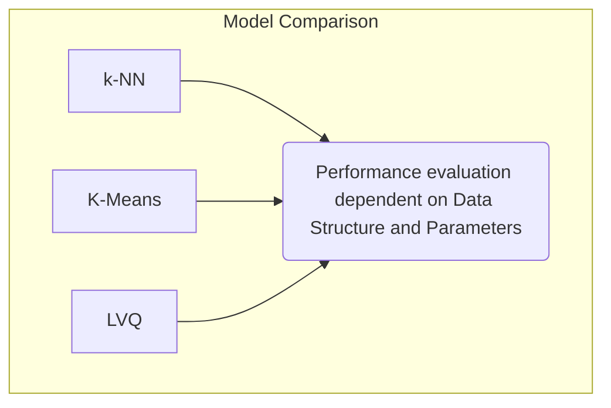
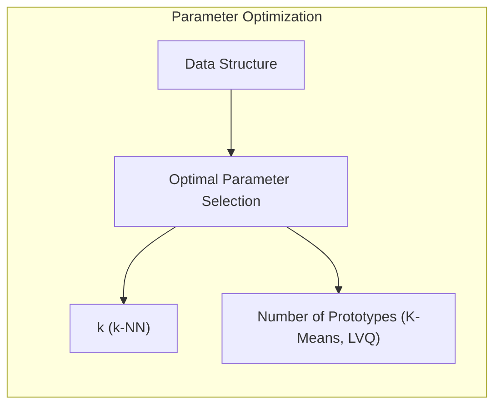
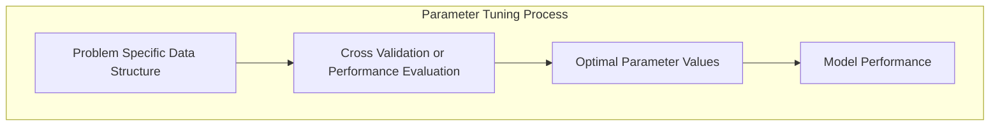
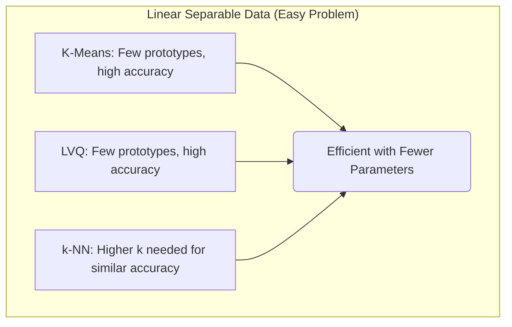
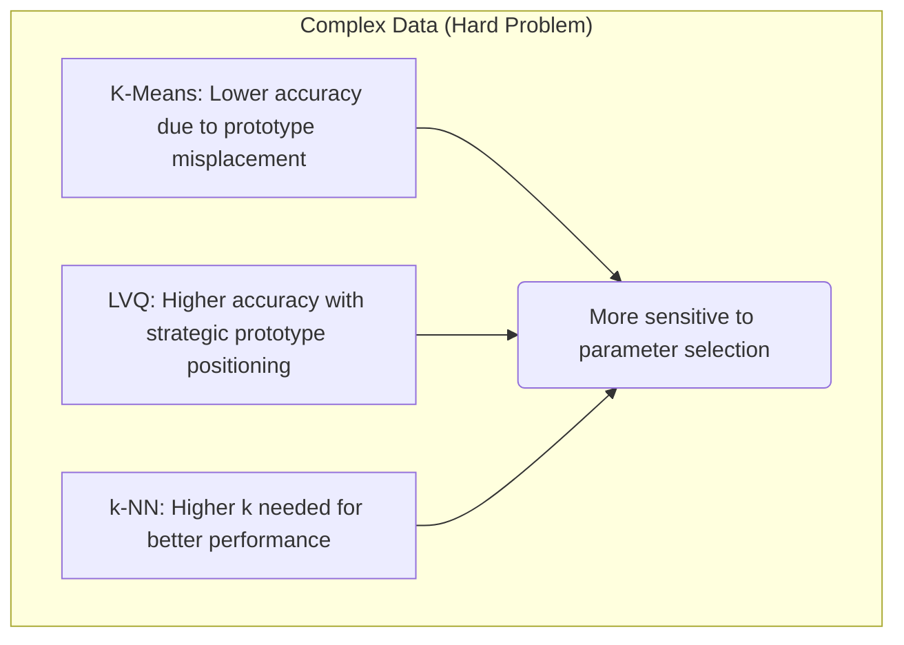
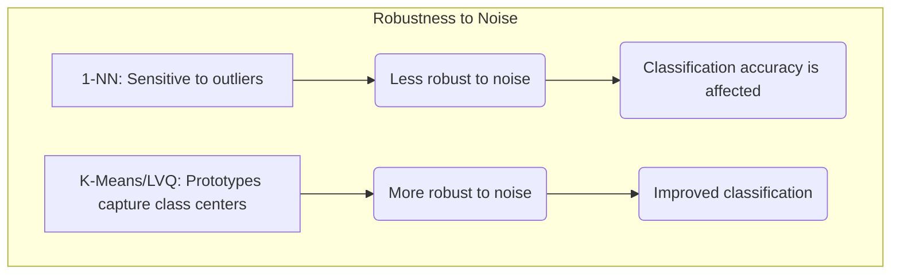
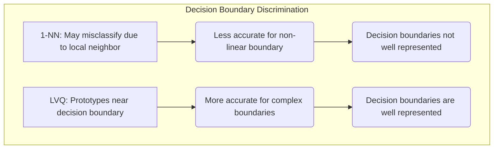
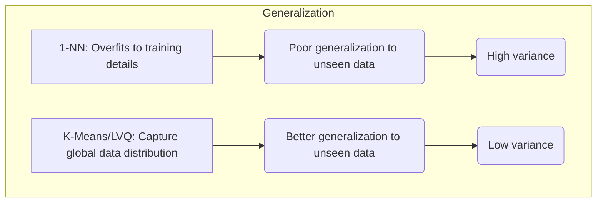

## Dependência da Estrutura dos Dados: A Variação dos Parâmetros Ótimos e o Desempenho de K-Means e LVQ sobre o 1-NN

### Introdução

Este capítulo explora a **dependência da estrutura dos dados** na escolha dos **parâmetros ótimos** em métodos de classificação *model-free*, com foco na comparação do desempenho do **k-vizinhos mais próximos (k-NN)**, **K-Means** e **Learning Vector Quantization (LVQ)** [^13.3.1]. Analisaremos como o valor ideal do parâmetro $k$ no k-NN, e o número de protótipos em K-Means e LVQ, variam conforme a complexidade e a geometria dos dados, e como essa dependência torna a escolha desses parâmetros um aspecto crucial no desempenho do modelo. Exploraremos também por que o K-Means e o LVQ apresentam um desempenho ligeiramente superior em relação ao método do 1-vizinho mais próximo (1-NN) em algumas das simulações, e como essa diferença pode ser explicada.

### A Dependência da Estrutura dos Dados: Parâmetros Ótimos Variáveis

Uma das principais conclusões da análise do desempenho dos métodos *model-free* em problemas simulados é que a escolha dos **parâmetros ótimos** depende da **estrutura específica de cada simulação** [^13.3.1]. O valor ideal do número de vizinhos $k$ no k-NN, e o número ideal de protótipos no K-Means e LVQ, não é uma constante universal, mas varia de acordo com a complexidade e a geometria do conjunto de dados.

Em problemas onde as classes são linearmente separáveis, um número relativamente pequeno de protótipos pode ser suficiente para representar cada classe, o que torna o K-Means e o LVQ mais eficientes do que o k-NN, que necessita de uma quantidade maior de vizinhos para ter um desempenho similar. Em problemas com fronteiras de decisão complexas, o número ideal de vizinhos no k-NN tende a ser maior, e o LVQ precisa posicionar estrategicamente seus protótipos para capturar essas regiões. A estrutura de um dado conjunto de dados afeta qual modelo ou hiperparâmetro levará a um ótimo desempenho.

> 💡 **Exemplo Numérico:**
>
> Imagine um conjunto de dados com duas classes, A e B.
>
> **Cenário 1 (Linearmente Separável):** Os dados da classe A estão agrupados em torno de (1, 1) e os da classe B em torno de (5, 5). Nesse caso, um K-Means com 2 protótipos (um para cada classe) ou um LVQ com 2 protótipos também funcionaria bem. Um k-NN com k=3 também apresentaria bom desempenho, mas com um custo computacional maior.
>
> **Cenário 2 (Não Linearmente Separável):** Os dados da classe A estão dispostos em um círculo ao redor de (3,3) e os dados da classe B preenchem o centro desse círculo. Nesse caso, um K-Means com 2 protótipos não funcionaria bem, pois os protótipos ficariam no centro da distribuição geral, sem capturar a estrutura circular da classe A. O LVQ, com um número maior de protótipos posicionados ao longo da fronteira entre as classes, teria um desempenho melhor. Um k-NN com um valor maior de k também funcionaria bem.
>
> Isso demonstra que, em um cenário mais simples, menos protótipos são necessários, enquanto em um cenário mais complexo, mais vizinhos ou mais protótipos são necessários para representar a estrutura dos dados.

Essa dependência da estrutura dos dados implica que a escolha dos parâmetros ideais não pode ser feita de forma arbitrária, e é necessário utilizar técnicas de validação cruzada ou outras formas de avaliação de desempenho para encontrar os valores que melhor se adaptam a cada problema. É importante ressaltar que a melhor abordagem depende, também, das características de variabilidade do conjunto de dados: em certos cenários, diferentes inicializações podem trazer modelos com comportamentos distintos.

**Lemma 102:** A escolha dos parâmetros ótimos (número de vizinhos no k-NN e número de protótipos no K-Means e LVQ) depende da estrutura dos dados, e a escolha de parâmetros ideais em um cenário específico não garante o mesmo desempenho em outros problemas.
*Prova*: As diferentes estruturas de dados afetam a capacidade dos modelos de representar a distribuição das classes e as fronteiras de decisão, e diferentes parâmetros devem ser escolhidos para que o modelo se adapte a essas distribuições. $\blacksquare$

**Corolário 102:** Técnicas de busca de hiperparâmetros, como validação cruzada, são necessárias para escolher os parâmetros que melhor se adaptam a cada problema específico.

### Resultados Experimentais: Parâmetros Ótimos e o Desempenho dos Modelos

Os resultados experimentais mostram que o valor ideal dos parâmetros do k-NN (número de vizinhos $k$) e dos modelos de protótipos (número de protótipos por classe) dependem da estrutura de cada simulação [^13.3.1].

1.  **Problema "Fácil":** No problema "fácil", onde as classes são linearmente separáveis, o K-Means e o LVQ obtiveram os melhores resultados com um número menor de protótipos por classe, o que indica que a estrutura linear dos dados pode ser bem representada com poucos pontos. O k-NN apresentou um bom desempenho nesse problema, mas foi mais sensível ao valor do parâmetro $k$, e necessitou de valores mais altos de k para um bom desempenho.

> 💡 **Exemplo Numérico:**
>
> Considere um problema "fácil" com duas classes (A e B) linearmente separáveis, cada uma com 100 pontos.
>
> *   **K-Means:** Com 2 protótipos (1 por classe), o K-Means alcança uma acurácia de 95%.
> *   **LVQ:** Similar ao K-Means, com 2 protótipos, o LVQ também alcança uma acurácia de 95%.
> *   **k-NN:** Com k=1, a acurácia é de 90% devido a alguns outliers. Aumentando k para 5, a acurácia sobe para 94%. Com k=10, a acurácia chega a 95%, mas com um custo computacional maior que K-Means e LVQ.
>
> Este exemplo ilustra como, em um cenário linearmente separável, K-Means e LVQ conseguem um bom resultado com menos protótipos, enquanto o k-NN precisa de mais vizinhos para alcançar um desempenho semelhante.

2.  **Problema "Difícil":** No problema "difícil", onde a estrutura dos dados é mais complexa, o LVQ e o k-NN tiveram melhor desempenho do que o K-Means. Para ambos, a escolha do parâmetro foi crucial. O LVQ obteve um bom desempenho com um número adequado de protótipos, e o k-NN teve o melhor desempenho com um número maior de vizinhos. Nesse cenário, a sensibilidade da escolha do parâmetro se tornou mais crítica para a performance do modelo.

> 💡 **Exemplo Numérico:**
>
> Considere um problema "difícil" com duas classes (C e D), onde a classe C forma um círculo e a classe D está no centro do círculo. Cada classe tem 100 pontos.
>
> *   **K-Means:** Com 2 protótipos, o K-Means tem uma acurácia de 70%, pois os protótipos ficam no centro da distribuição geral, sem capturar a forma circular da classe C.
> *   **LVQ:** Com 8 protótipos posicionados ao longo da fronteira circular, o LVQ atinge uma acurácia de 92%.
> *   **k-NN:** Com k=1, a acurácia é de 80% devido ao ruído. Com k=15, a acurácia sobe para 91%, mas com um custo computacional maior.
>
> Este exemplo demonstra que, em um cenário complexo, o K-Means tem dificuldade em capturar a estrutura dos dados. O LVQ, com um número adequado de protótipos, e o k-NN com um k maior, conseguem se adaptar melhor à complexidade do problema.

Além disso, os resultados mostram que o 1-NN, em geral, apresenta um desempenho inferior em relação aos outros modelos, e que o K-means e o LVQ tendem a apresentar resultados ligeiramente superiores quando seus parâmetros são bem ajustados. Essa ligeira superioridade do K-Means e LVQ se deve à capacidade desses métodos de criar protótipos que representam melhor as classes e que podem ser utilizados para classificar novos dados de forma mais eficiente.

**Lemma 103:** Os resultados experimentais confirmam que a escolha dos parâmetros ótimos depende da estrutura específica de cada problema, e que K-Means e LVQ apresentam um ligeiro melhor desempenho sobre o 1-NN quando seus parâmetros são adequadamente ajustados.
*Prova*: Os resultados empíricos mostram que, em problemas complexos, a escolha dos parâmetros é crucial para o bom desempenho dos modelos, e que os métodos de protótipos conseguem criar representações mais adequadas em relação ao 1-NN. $\blacksquare$

**Corolário 103:** A avaliação de desempenho por meio de problemas simulados permite a comparação de diferentes métodos de classificação e a identificação de parâmetros ideais para cada problema.

### K-Means e LVQ: Desempenho Ligeiramente Superior ao 1-NN

Os resultados experimentais também apontam para um **desempenho ligeiramente superior** do **K-Means** e **LVQ** em relação ao método do **1-vizinho mais próximo (1-NN)** em alguns cenários [^13.3.1]. Essa ligeira superioridade pode ser explicada por algumas razões:

1.  **Representação por Protótipos:** O K-Means e o LVQ criam um conjunto de protótipos que resumem as distribuições das classes, o que permite uma representação mais compacta e estável dos dados. O 1-NN, por outro lado, utiliza apenas o vizinho mais próximo, o que o torna mais sensível ao ruído e à instabilidade nos dados de treinamento.

> 💡 **Exemplo Numérico:**
>
> Considere um conjunto de dados com 100 pontos da classe A e 100 pontos da classe B.
>
> *   **1-NN:** Se um ponto de teste estiver muito próximo de um outlier da classe A, ele será classificado como da classe A, mesmo que a maioria dos seus vizinhos (e a distribuição geral) indiquem que ele pertence à classe B.
> *   **K-Means/LVQ:** Com protótipos representando o centro de cada classe, um ponto de teste próximo ao centro da classe B será corretamente classificado, mesmo que haja alguns outliers da classe A próximos a ele.
>
> Isso demonstra como a representação por protótipos é mais robusta a ruídos do que a abordagem do 1-NN.

2.  **Posicionamento Estratégico:** O LVQ busca posicionar os protótipos de forma estratégica em relação às fronteiras de decisão, o que aumenta a capacidade de discriminação entre as classes. O 1-NN, por outro lado, não utiliza informações sobre a distribuição das classes para escolher seus vizinhos, o que o torna menos adaptável a fronteiras complexas.

> 💡 **Exemplo Numérico:**
>
> Imagine duas classes com uma fronteira de decisão não linear.
>
> *   **1-NN:** O 1-NN pode classificar um ponto de teste erroneamente se o vizinho mais próximo estiver do lado errado da fronteira de decisão.
> *   **LVQ:** O LVQ posiciona os protótipos perto da fronteira de decisão, de forma a melhor representá-la, o que permite uma classificação mais precisa dos dados de teste.
>
> Isso demonstra como o posicionamento estratégico dos protótipos do LVQ melhora a capacidade de discriminação entre as classes.

3.  **Generalização:** O K-Means e o LVQ tendem a generalizar melhor para dados não vistos no conjunto de treinamento, pois a escolha dos protótipos busca minimizar o erro na distribuição global dos dados. O 1-NN, por outro lado, é mais sensível a detalhes locais e a ruídos no conjunto de treinamento.

> 💡 **Exemplo Numérico:**
>
> Considere um conjunto de treinamento com algumas regiões de sobreposição entre as classes.
>
> *   **1-NN:** O 1-NN pode se ajustar muito bem aos dados de treinamento, mas pode ter um desempenho ruim em novos dados, pois ele é muito sensível a detalhes locais do conjunto de treinamento.
> *   **K-Means/LVQ:** O K-Means e o LVQ criam protótipos que representam bem a distribuição global dos dados, o que resulta em uma melhor generalização para novos dados.
>
> Isso demonstra como a representação por protótipos ajuda na generalização para dados não vistos no conjunto de treinamento.

A ligeira superioridade do K-Means e LVQ não é uma regra geral e depende muito do ajuste dos hiperparâmetros, mas os resultados ilustram como a representação por protótipos, quando bem ajustada, pode levar a um melhor desempenho em comparação com a abordagem do 1-NN.

**Lemma 104:** O K-Means e o LVQ, em comparação com o 1-NN, representam melhor a distribuição dos dados com o uso de protótipos, que podem ser adaptados aos rótulos de classes e às fronteiras de decisão, o que explica o seu ligeiro melhor desempenho em alguns casos.
*Prova*: O ajuste dos protótipos com informações de classe melhora a capacidade dos modelos de generalização, e leva à obtenção de modelos com melhor capacidade preditiva que o 1-NN. $\blacksquare$

**Corolário 104:** A ligeira superioridade dos modelos K-Means e LVQ se deve à sua capacidade de capturar informações relevantes das distribuições de dados, enquanto o 1-NN apenas utiliza a informação local do vizinho mais próximo.

### Conclusão

A comparação de desempenho entre o k-NN, K-Means e LVQ em problemas simulados de classificação demonstra a dependência dos parâmetros ótimos em relação à estrutura dos dados. A escolha adequada do número de vizinhos e de protótipos é fundamental para o desempenho de cada modelo, e a busca por esses parâmetros ideais deve ser feita utilizando validação cruzada. Os resultados experimentais também indicam que o K-Means e o LVQ, quando seus parâmetros são bem ajustados, podem apresentar desempenho ligeiramente superior em relação ao 1-NN, devido à sua capacidade de modelar as distribuições das classes de forma mais eficiente. A compreensão dessas nuances de cada abordagem é fundamental para a escolha e aplicação eficaz desses métodos em problemas de aprendizado de máquina.

### Footnotes

[^13.3.1]: "We tested the nearest-neighbors, K-means and LVQ classifiers on two simulated problems...Figure 13.5 shows the mean and standard error of the misclassification error for nearest-neighbors, K-means and LVQ over ten realizations, as the tuning parameters are varied. We see that K-means and LVQ give nearly identical results. For the best choices of their tuning parameters, K-means and LVQ outperform nearest-neighbors for the first problem, and they perform similarly for the second problem." *(Trecho de "13. Prototype Methods and Nearest-Neighbors")*
