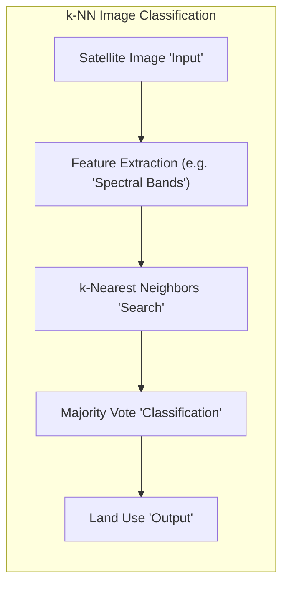
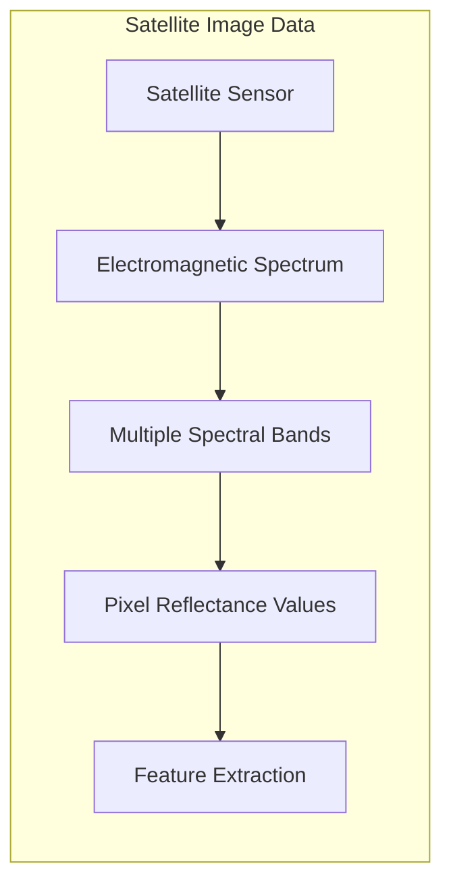
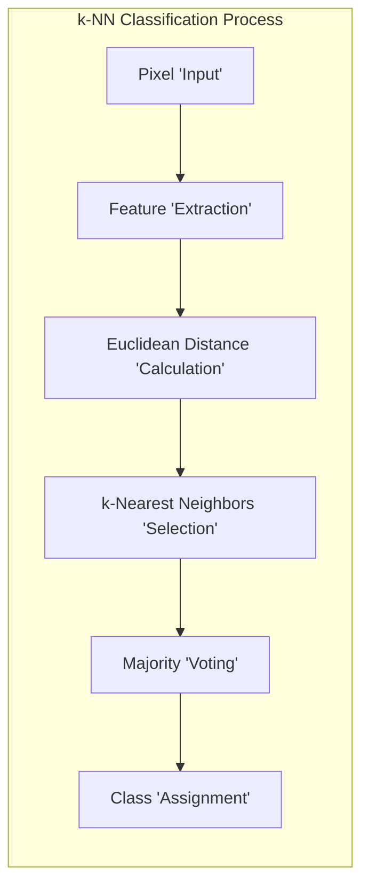
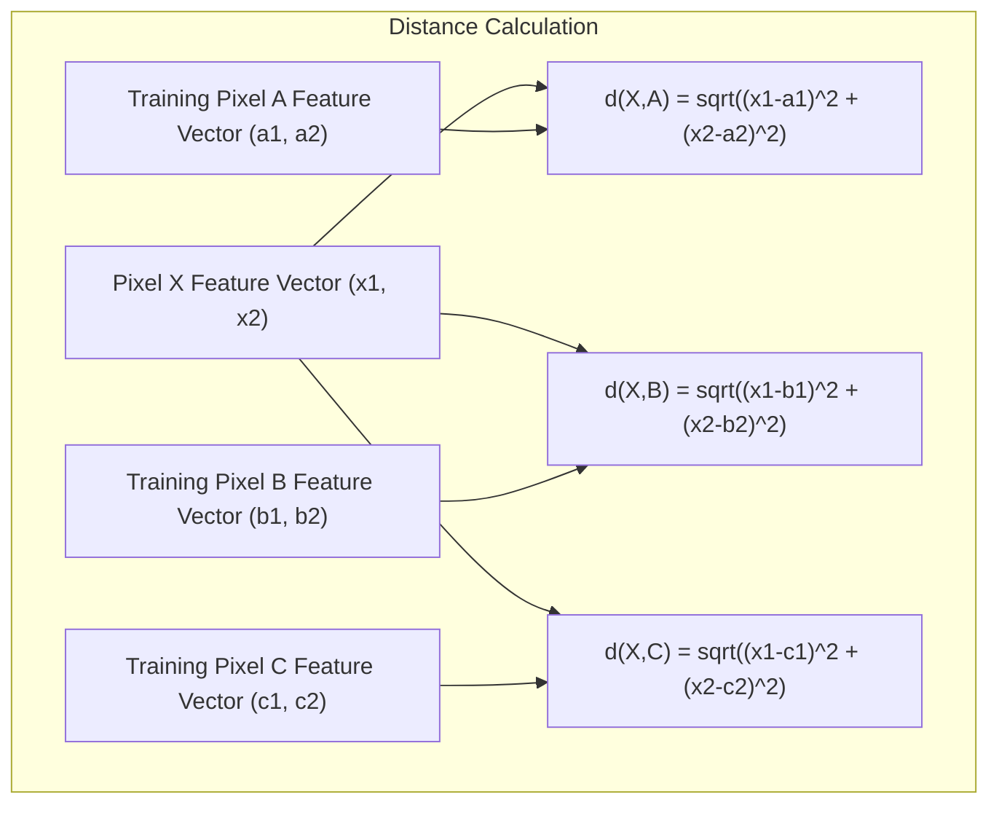
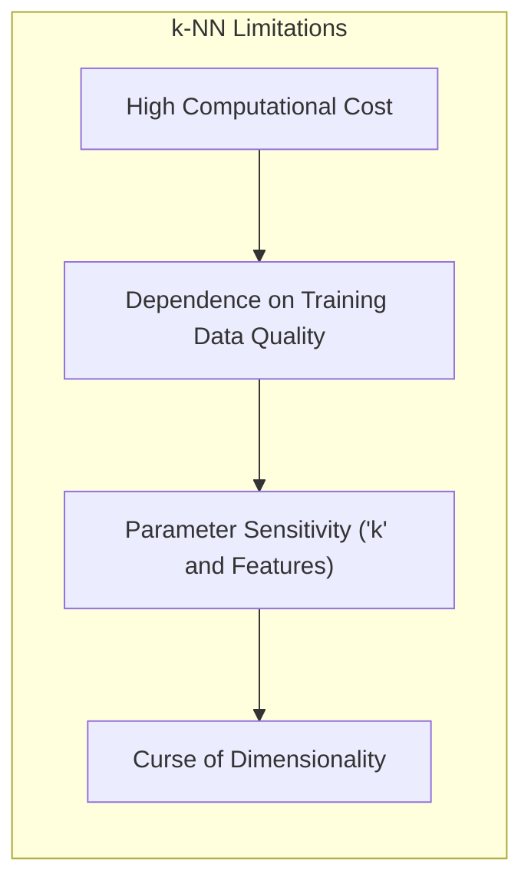

## Classificação de Imagens de Satélite com k-NN: Uma Aplicação Prática de Métodos *Model-Free*



### Introdução

Este capítulo explora a aplicação prática do método de **k-vizinhos mais próximos (k-NN)** para a **classificação de imagens de satélite**, demonstrando como essa técnica *model-free* pode ser utilizada para identificar diferentes usos do solo com base nas informações espectrais dos pixels [^13.3.2]. As imagens de satélite são formadas por múltiplos canais (espectrais) que capturam a reflectância da superfície em diferentes faixas de frequência, e esses dados espectrais podem ser utilizados como *features* para classificar cada pixel da imagem em diferentes categorias de uso do solo, tais como solo, vegetação, água, construções, etc. Analisaremos como o k-NN utiliza a informação espectral de cada pixel e de seus vizinhos para realizar essa classificação, e como essa abordagem se destaca em comparação com métodos mais tradicionais de classificação de imagens.

### Imagens de Satélite e Classificação de Uso do Solo

**Imagens de satélite** são obtidas por sensores remotos a bordo de satélites que capturam a reflectância da superfície terrestre em diferentes faixas do espectro eletromagnético [^13.3.2]. Cada pixel da imagem contém informações sobre a intensidade da luz refletida em diferentes canais (bandas), e essas informações espectrais podem ser utilizadas como *features* para classificar o uso do solo naquele local.

O problema da **classificação de uso do solo** consiste em atribuir cada pixel de uma imagem de satélite a uma categoria predefinida de uso do solo, como solo nu, vegetação, água, construções, etc. Essa tarefa é fundamental para diversas aplicações, como monitoramento ambiental, planejamento urbano, agricultura, gestão de recursos hídricos e avaliação de impactos ambientais.

Modelos de classificação que exploram as informações espectrais de cada pixel ou de conjuntos de pixels vizinhos podem ser usados para automatizar o processo de identificação de diferentes usos do solo a partir das imagens de satélite. Uma abordagem interessante para essa tarefa é o k-NN, que se baseia na similaridade entre as informações espectrais dos pixels para realizar a classificação, sem a necessidade de uma fase de treinamento explícita.



**Lemma 105:** A classificação de uso do solo em imagens de satélite busca identificar e classificar cada pixel de acordo com as características espectrais que permitem identificar a que tipo de uso ele se relaciona.
*Prova*: A identificação de diferentes usos do solo é feita através da análise de diferentes padrões de reflectância em várias faixas do espectro eletromagnético, e esses padrões são diferentes para cada classe. $\blacksquare$

**Corolário 105:** A informação espectral de cada pixel pode ser utilizada como *features* para a classificação do uso do solo, e a escolha de quais *features* utilizar é um passo importante para a eficácia do modelo.

> ⚠️ **Nota Importante**: As imagens de satélite fornecem informações sobre a reflectância da superfície em diferentes faixas espectrais, e essas informações podem ser utilizadas como *features* para a classificação do uso do solo.

> ❗ **Ponto de Atenção**: A escolha de quais *features* extrair da imagem, como a combinação de canais, a aplicação de filtros ou a extração de informações de vizinhança, influencia o desempenho do modelo.

### k-NN para Classificação de Imagens: Extração de *Features* e Votação Majoritária

A aplicação do método de **k-vizinhos mais próximos (k-NN)** para classificação de imagens de satélite envolve os seguintes passos:

1.  **Extração de *Features*:** Para cada pixel da imagem, extraem-se as *features* que serão utilizadas para a classificação. As *features* podem ser os valores de reflectância de cada pixel em cada canal espectral, ou podem ser *features* mais complexas, como a média ou o desvio padrão das reflectâncias em uma vizinhança do pixel. Em casos mais sofisticados, informações de textura ou transformações matemáticas podem ser usadas. No exemplo do capítulo [^13.3.2], são extraídas as *features* do pixel central e dos 8 vizinhos em cada um dos 4 canais espectrais, um total de 36 *features*.
2.  **Busca dos k Vizinhos:** Para cada pixel a ser classificado, os $k$ pontos de treino mais próximos no espaço de *features* são selecionados, com base na distância Euclidiana ou outra métrica apropriada.
3.  **Votação Majoritária:** A classe do pixel é definida pela votação majoritária entre os rótulos de uso do solo dos $k$ vizinhos mais próximos.



Essa abordagem permite classificar cada pixel da imagem com base na informação espectral do próprio pixel e de seus vizinhos, sem a necessidade de um modelo de treinamento explícito. A escolha de quais *features* utilizar, e do valor de $k$, tem um impacto direto no desempenho do modelo.

**Lemma 106:** A classificação de imagens de satélite com k-NN envolve a extração de *features* espectrais de cada pixel e a atribuição de cada pixel à classe mais frequente entre os k vizinhos mais próximos no espaço de *features*.
*Prova*: O algoritmo do k-NN utiliza a proximidade no espaço de *features* como um guia para a classificação, e o processo de votação agrega a informação dos rótulos dos vizinhos para determinar a classe de um ponto de consulta. $\blacksquare$

**Corolário 106:** A escolha das *features* e da métrica de distância influencia a forma como os vizinhos mais próximos são identificados e a eficácia do processo de classificação.

> ⚠️ **Nota Importante**:  A classificação de imagens de satélite com k-NN envolve a extração de *features*, a busca dos vizinhos mais próximos e a votação majoritária.

> ❗ **Ponto de Atenção**: A qualidade das *features* extraídas da imagem é um fator crítico para o sucesso do k-NN, e a escolha adequada das *features* é fundamental para obter bons resultados.

### Exemplo Prático: Classificação de Cenas Agrícolas com k-NN

Um exemplo prático da aplicação do k-NN na classificação de imagens de satélite é a classificação de cenas agrícolas, onde o objetivo é identificar diferentes tipos de uso do solo em áreas de agricultura [^13.3.2].

Em uma simulação descrita no capítulo original, foram utilizadas imagens de satélite LANDSAT de uma área agrícola na Austrália, em quatro bandas espectrais (duas no espectro visível e duas no infravermelho). Para cada pixel, foram extraídas as *features* correspondentes às reflectâncias do pixel central e de seus 8 vizinhos, em cada uma das quatro bandas. Isso resulta em um vetor de *features* com 36 componentes para cada pixel (9 pontos na imagem x 4 bandas).

Após a extração dessas *features*, o k-NN foi utilizado para classificar cada pixel da imagem em uma de sete categorias de uso do solo: solo vermelho, algodão, vegetação, restolho, solo cinza, solo cinza úmido e solo cinza muito úmido. A classificação foi realizada utilizando a votação majoritária entre os 5 vizinhos mais próximos para cada pixel, com uma taxa de erro de cerca de 9.5%, o que foi o melhor resultado entre vários métodos testados.

Esse exemplo ilustra como o k-NN pode ser utilizado para classificar imagens de satélite, utilizando apenas a informação espectral dos pixels e de sua vizinhança, sem a necessidade de um modelo de treinamento explícito ou a hipótese de distribuições gaussianas.

> 💡 **Exemplo Numérico:**
>
> Vamos simplificar o exemplo para ilustrar o processo de extração de *features* e classificação com k-NN. Imagine que temos uma imagem de satélite com apenas 3 pixels (A, B, e C) e 2 bandas espectrais (Banda 1 e Banda 2). Os valores de reflectância para cada pixel em cada banda são:
>
> | Pixel | Banda 1 | Banda 2 | Classe Real |
> |-------|---------|---------|-------------|
> | A     | 10      | 20      | Vegetação   |
> | B     | 12      | 22      | Vegetação   |
> | C     | 50      | 10      | Solo        |
>
> Para classificar um novo pixel, digamos o pixel "X", com valores de reflectância (11, 21), usando k-NN com k=1, calculamos a distância Euclidiana entre X e cada pixel de treino:
>
> $d(X, A) = \sqrt{(11-10)^2 + (21-20)^2} = \sqrt{1^2 + 1^2} = \sqrt{2} \approx 1.41$
> $d(X, B) = \sqrt{(11-12)^2 + (21-22)^2} = \sqrt{(-1)^2 + (-1)^2} = \sqrt{2} \approx 1.41$
> $d(X, C) = \sqrt{(11-50)^2 + (21-10)^2} = \sqrt{(-39)^2 + 11^2} = \sqrt{1521 + 121} = \sqrt{1642} \approx 40.52$
>
> Os pixels A e B são os mais próximos de X. Como k=1, selecionamos o primeiro vizinho (A ou B - neste caso, tanto faz, pois ambos estão à mesma distância).  Como ambos A e B são da classe "Vegetação", o pixel X seria classificado como "Vegetação".
>
> Se tivéssemos usado k=3, incluiríamos C na votação. Nesse cenário, com 2 pixels de "Vegetação" e 1 pixel de "Solo", o pixel X ainda seria classificado como "Vegetação" pela votação majoritária.
>
> Este exemplo ilustra a ideia principal do k-NN: a classificação se baseia na proximidade dos pontos no espaço de *features* e na votação majoritária entre os vizinhos mais próximos.



**Lemma 107:** A aplicação do k-NN para classificação de cenas agrícolas com imagens de satélite permite classificar cada pixel com base na informação espectral de sua vizinhança, e demonstrar a capacidade do k-NN para lidar com dados complexos.
*Prova*: As informações locais espectrais de cada pixel e de seus vizinhos são utilizadas para a classificação, resultando em um bom desempenho do modelo. $\blacksquare$

**Corolário 107:** O resultado do k-NN na classificação de imagens de satélite mostra que este método é capaz de se adaptar à diversidade dos dados de uma imagem multiespectral.

> ⚠️ **Nota Importante**: A aplicação do k-NN para classificação de imagens de satélite permite utilizar a informação espectral de cada pixel e de seus vizinhos para determinar o uso do solo, sem requerer uma fase de treinamento explícita.

> ❗ **Ponto de Atenção**: A escolha de quais *features* utilizar para cada pixel e a escolha do valor de k influencia o desempenho do modelo, e é importante utilizar métodos de validação cruzada para escolher os melhores valores.

### Limitações e Extensões do k-NN para Classificação de Imagens

Embora o k-NN tenha demonstrado bom desempenho na classificação de imagens de satélite, ele apresenta algumas limitações que devem ser consideradas:

1.  **Alto Custo Computacional:** O cálculo da distância entre cada pixel e todos os pontos de treinamento é computacionalmente custoso para imagens grandes, o que pode limitar sua aplicabilidade em tempo real.
2.  **Dependência da Qualidade dos Dados de Treinamento:** O k-NN é dependente da qualidade e representatividade dos dados de treinamento, o que torna sua performance limitada para problemas onde os dados de treino não representam bem o conjunto de dados original, ou são ruidosos.
3.  **Sensibilidade à Escolha de Parâmetros:** A escolha do valor de $k$ e das *features* utilizadas influencia fortemente o desempenho do modelo, o que exige ajuste cuidadoso dos parâmetros.
4. **Maldição da Dimensionalidade:** Em imagens com muitas bandas espectrais, o k-NN pode ser afetado pela maldição da dimensionalidade, que diminui a capacidade de representatividade da proximidade dos vizinhos.



Existem diversas extensões do k-NN que buscam mitigar essas limitações, incluindo o uso de métricas de distância adaptativas, a seleção de *features* relevantes, a redução de dimensionalidade e o uso de protótipos para representação dos dados, que podem ser combinadas ao uso do método de k vizinhos.

> 💡 **Exemplo Numérico (Maldição da Dimensionalidade):**
>
> Imagine que temos os mesmos pixels A, B e C, mas agora com 100 bandas espectrais. Os valores de reflectância em cada banda são gerados aleatoriamente, e os pixels A e B são da mesma classe, enquanto C é de outra classe. Em um espaço de baixa dimensão (2 bandas), como no exemplo anterior, A e B tendem a ser vizinhos e C distante. No entanto, em um espaço de 100 dimensões, a distância entre todos os pixels tende a convergir, dificultando a separação entre classes.
>
> Para ilustrar, vamos simular distâncias usando numpy:
> ```python
> import numpy as np
>
> # Dados de exemplo em duas dimensões
> A_2d = np.array([10, 20])
> B_2d = np.array([12, 22])
> C_2d = np.array([50, 10])
>
> # Dados de exemplo em 100 dimensões
> np.random.seed(42) # Para reproducibilidade
> A_100d = np.random.rand(100) * 100
> B_100d = A_100d + np.random.rand(100) * 5
> C_100d = np.random.rand(100) * 100 + 50
>
> # Função para calcular a distância Euclidiana
> def euclidean_distance(p1, p2):
>    return np.sqrt(np.sum((p1 - p2)**2))
>
> # Calculando as distâncias
> dist_AB_2d = euclidean_distance(A_2d, B_2d)
> dist_AC_2d = euclidean_distance(A_2d, C_2d)
> dist_BC_2d = euclidean_distance(B_2d, C_2d)
>
> dist_AB_100d = euclidean_distance(A_100d, B_100d)
> dist_AC_100d = euclidean_distance(A_100d, C_100d)
> dist_BC_100d = euclidean_distance(B_100d, C_100d)
>
> print(f"Distâncias em 2D: AB={dist_AB_2d:.2f}, AC={dist_AC_2d:.2f}, BC={dist_BC_2d:.2f}")
> print(f"Distâncias em 100D: AB={dist_AB_100d:.2f}, AC={dist_AC_100d:.2f}, BC={dist_BC_100d:.2f}")
> ```
>
> O resultado mostrará que as distâncias em 2D têm uma clara diferença entre vizinhos da mesma classe (AB) e vizinhos de classes diferentes (AC e BC). Já em 100D, as distâncias entre todos os pares tendem a se aproximar, dificultando a identificação dos vizinhos mais próximos que compartilham a mesma classe. Isso ilustra como a alta dimensionalidade pode prejudicar o desempenho do k-NN.

**Lemma 108:** Embora o k-NN seja um método eficaz para classificação de imagens de satélite, ele apresenta limitações como a dependência da qualidade e quantidade dos dados, o alto custo computacional e sensibilidade à escolha de parâmetros.
*Prova*: O custo de calcular a distância para todos os pontos do conjunto de treino torna o algoritmo menos interessante em conjuntos de dados maiores, e sua performance é limitada pela falta de um modelo explícito ajustado aos dados. $\blacksquare$

**Corolário 108:** Extensões do k-NN como a redução de dimensionalidade, seleção de *features* e otimização de parâmetros podem mitigar algumas das limitações do k-NN.

> ⚠️ **Nota Importante**: O k-NN é uma abordagem eficaz para a classificação de imagens de satélite, mas apresenta limitações que devem ser consideradas ao utilizá-lo em problemas práticos.

> ❗ **Ponto de Atenção**: A escolha de *features* relevantes, a escolha do número de vizinhos $k$ e a utilização de algoritmos de busca eficientes podem melhorar o desempenho do k-NN para aplicações de classificação de imagens.

### Conclusão

A aplicação do método k-NN para classificação de imagens de satélite demonstra a utilidade e versatilidade desse método para problemas de classificação complexos. A capacidade de modelar fronteiras de decisão irregulares e utilizar a informação local dos pixels vizinhos torna o k-NN uma ferramenta poderosa para identificar diferentes usos do solo a partir de imagens multiespectrais. Embora o k-NN apresente limitações como o alto custo computacional e a sensibilidade à escolha dos parâmetros, suas vantagens em termos de simplicidade e adaptabilidade o tornam uma abordagem importante e eficaz. A combinação do k-NN com técnicas de pré-processamento de dados e seleção de *features* pode melhorar ainda mais o desempenho do modelo em aplicações do mundo real.

### Footnotes

[^13.3.2]: "The STATLOG project (Michie et al., 1994) used part of a LANDSAT image as a benchmark for classification (82 × 100 pixels). Figure 13.6 shows four heat-map images...Five-nearest-neighbors produced the predicted map shown in the bottom right panel, and was computed as follows. For each pixel we extracted an 8-neighbor feature map-the pixel itself and its 8 immediate neighbors" *(Trecho de "13. Prototype Methods and Nearest-Neighbors")*

[^13.3]: "These classifiers are memory-based, and require no model to be fit. Given a query point xo, we find the k training points x(r), r = 1,..., k closest in distance to xo, and then classify using majority vote among the k neighbors." *(Trecho de "13. Prototype Methods and Nearest-Neighbors")*
