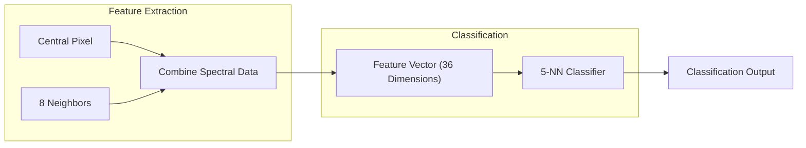
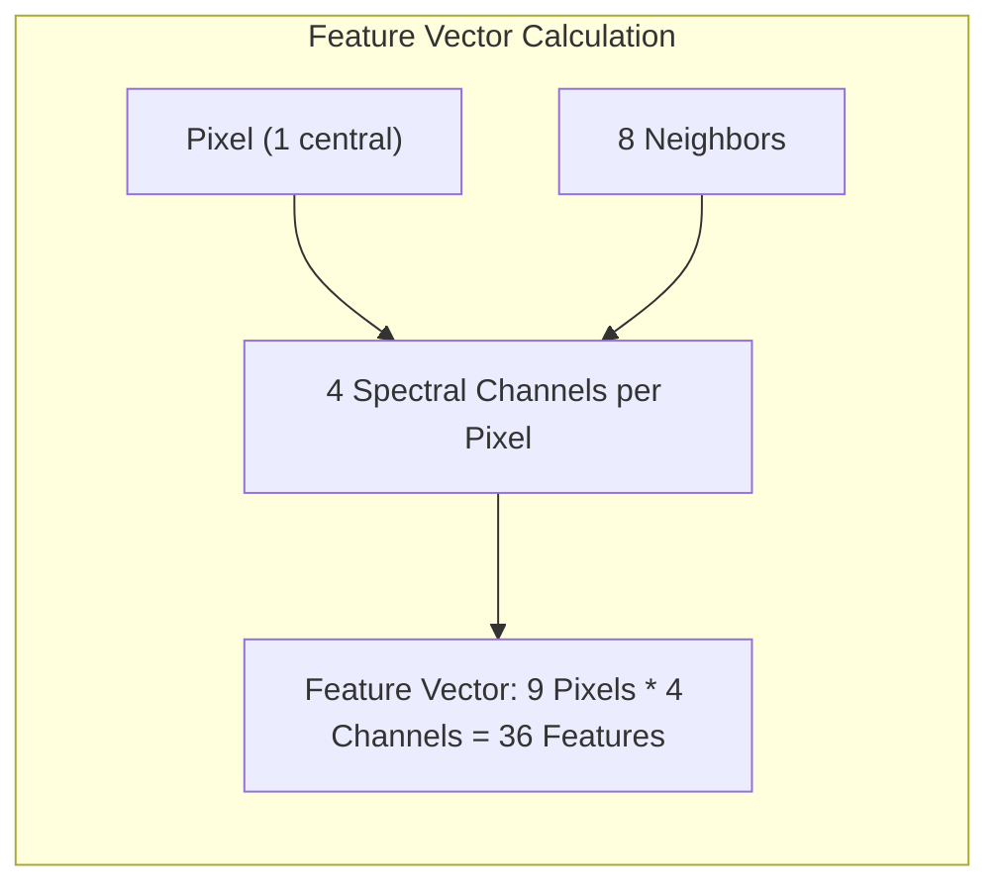
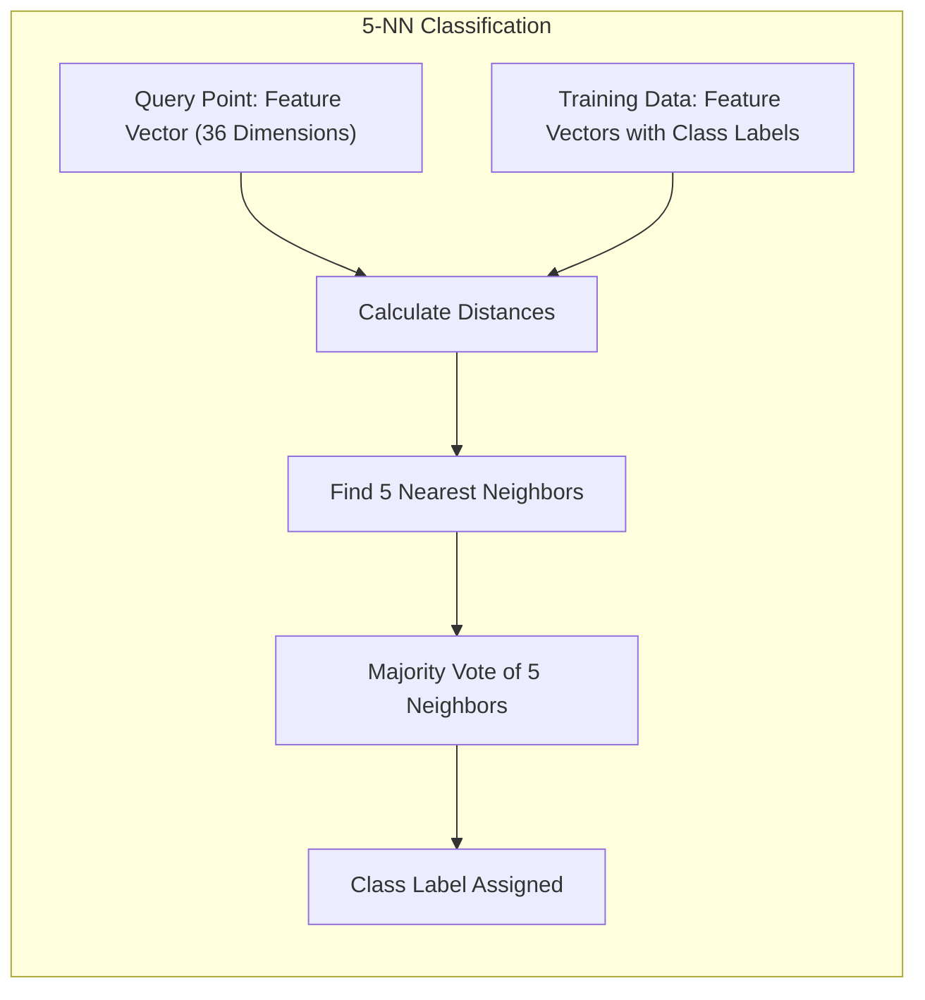

## Utilização do Contexto Espacial com 8-Vizinhos e um Classificador 5-NN: Alta Performance na Classificação de Imagens de Satélite

### Introdução

Este capítulo explora a utilização do **contexto espacial**, por meio da informação dos 8 vizinhos imediatos de um pixel, e sua aplicação em conjunto com um classificador **5-vizinhos mais próximos (5-NN)** para obter alta performance na classificação de imagens de satélite [^13.3.2]. O uso do contexto espacial, ou seja, a inclusão de informações dos pixels vizinhos no processo de classificação, busca agregar informações contextuais para aumentar a capacidade de discriminação e tornar a classificação mais robusta. Analisaremos como a extração de *features* a partir do pixel central e seus 8 vizinhos resulta em um espaço de *features* de alta dimensão, e como o 5-NN é aplicado nesse espaço para obter resultados satisfatórios na classificação. Discutiremos também a importância de combinar a informação espectral e espacial no processo de classificação de imagens de satélite.

### O Contexto Espacial: Importância das Informações da Vizinhança

A utilização do **contexto espacial** na classificação de imagens de satélite é uma abordagem que se baseia na ideia de que a informação dos pixels vizinhos de um dado pixel pode auxiliar a determinar sua classe com maior precisão [^13.3.2]. Em vez de utilizar apenas a informação espectral do pixel central, a inclusão de informações de seus vizinhos permite agregar conhecimento sobre a região local, o que melhora a capacidade de discriminação entre as classes.

A importância do contexto espacial reside no fato de que pixels vizinhos de uma imagem de satélite tendem a pertencer à mesma classe ou a classes que estão espacialmente relacionadas. Por exemplo, em uma imagem de cenas agrícolas, a presença de vegetação em um pixel pode indicar que seus vizinhos também têm uma probabilidade maior de pertencer a categorias relacionadas à vegetação.

A inclusão do contexto espacial pode ser feita por meio de diversas técnicas, como a extração de *features* de vizinhança (média, desvio padrão, histogramas, etc.) ou a utilização de modelos que explicitamente modelam as relações espaciais entre os pixels, como as redes neurais convolucionais (CNN). No caso do método descrito no contexto, as *features* são extraídas dos 8 vizinhos mais próximos de cada pixel, além do próprio pixel.

**Lemma 109:** A informação contextual, obtida da vizinhança de um pixel em uma imagem de satélite, permite melhorar a capacidade de classificação por meio da incorporação de informações sobre a estrutura espacial das classes.
*Prova*:  A informação sobre as classes dos vizinhos fornece uma pista sobre a região local e o padrão dos dados que não pode ser capturada apenas pela informação de um único pixel. $\blacksquare$

**Corolário 109:** A combinação das informações espectrais e espaciais aumenta a capacidade de discriminação do modelo, o que leva a uma classificação mais precisa e robusta.

> ⚠️ **Nota Importante**: A utilização do contexto espacial, por meio das informações da vizinhança de um pixel, é uma forma eficaz de agregar conhecimento para a classificação de imagens de satélite.

> ❗ **Ponto de Atenção**:  A escolha do tamanho da vizinhança e das *features* extraídas da vizinhança influencia o desempenho do modelo, e a escolha adequada desses parâmetros é um passo importante no desenvolvimento de sistemas de classificação de imagens de satélite.

### Extração de *Features* com Vizinhos: Um Espaço de 36 Dimensões

A extração de *features* utilizando o contexto espacial, que considera um pixel central e seus 8 vizinhos imediatos, resulta em um espaço de *features* com 36 dimensões [^13.3.2]. Essa alta dimensionalidade surge da combinação das informações espectrais de cada um desses pixels.

Em um problema simulado onde cada pixel possui 4 canais espectrais (duas bandas no espectro visível e duas no infravermelho), ao extrair as informações dos 9 pixels (1 central + 8 vizinhos), e de cada um dos 4 canais, obtemos um vetor de *features* com 36 componentes:

$$9 \text{ pixels} \times 4 \text{ canais espectrais} = 36 \text{ features}$$

O pixel central, e seus 8 vizinhos, contêm informações sobre a região local, que podem ser relevantes para a identificação da classe do pixel central. A combinação de informações espectrais e espaciais em um vetor de *features* de alta dimensão oferece uma representação mais completa da estrutura dos dados na imagem de satélite. Essa representação captura as relações entre pixels vizinhos, o que pode ser fundamental para a modelagem da complexidade das cenas do mundo real.

> 💡 **Exemplo Numérico:**
> Imagine que temos um pixel central com valores espectrais nos 4 canais como [0.2, 0.5, 0.7, 0.1]. Seu vizinho da direita tem valores [0.3, 0.6, 0.8, 0.2], o vizinho de baixo [0.1, 0.4, 0.6, 0.3], e assim por diante para todos os 8 vizinhos. Para extrair as *features*, concatenamos todos esses valores em um único vetor. Isso resultaria em um vetor de 36 dimensões:
>
>  $[0.2, 0.5, 0.7, 0.1, 0.3, 0.6, 0.8, 0.2, 0.1, 0.4, 0.6, 0.3, ..., \text{valores dos outros vizinhos}]$
>
> Cada bloco de 4 valores representa as informações espectrais de um pixel. Esse vetor de 36 dimensões será usado para classificar o pixel central.

**Lemma 110:** A extração de *features* com um pixel central e seus 8 vizinhos imediatos, com 4 canais espectrais, resulta em um espaço de *features* de alta dimensão (36 dimensões), que permite representar as relações espaciais e espectrais da imagem de satélite.
*Prova*: A combinação das informações espectrais de cada um dos 9 pixels em 4 diferentes canais leva a um vetor com 36 dimensões. $\blacksquare$

**Corolário 110:** O uso de informações contextuais aumenta a dimensionalidade do espaço de *features*, o que exige que o modelo seja capaz de lidar com problemas de alta dimensão.

> ⚠️ **Nota Importante**:  A extração de *features* utilizando um pixel central e seus 8 vizinhos imediatos resulta em um espaço de *features* de alta dimensão (36 dimensões), que combina informações espectrais e espaciais da imagem de satélite.

> ❗ **Ponto de Atenção**: Embora o uso de *features* de vizinhança aumente a capacidade de discriminação do modelo, ele também aumenta a complexidade computacional e pode gerar problemas relacionados à maldição da dimensionalidade.

### Classificação com 5-NN: Alta Performance em Espaço de 36 Dimensões

No espaço de *features* de 36 dimensões, o **classificador 5-vizinhos mais próximos (5-NN)** demonstrou um desempenho notável na classificação de imagens de satélite [^13.3.2]. A escolha do valor de $k=5$ foi feita experimentalmente, e diferentes valores podem levar a resultados diferentes, conforme discutido em seções anteriores.

Ao utilizar o 5-NN nesse espaço de alta dimensão, o modelo busca os 5 pontos de treinamento mais próximos no espaço de *features* de 36 dimensões e atribui o ponto de consulta à classe mais frequente entre esses vizinhos. A capacidade do 5-NN de obter bom desempenho nesse espaço de alta dimensão se deve, principalmente, a sua capacidade de explorar a informação local dos vizinhos para realizar a classificação. A extração da informação de vizinhança, e de diferentes canais espectrais, permite que o algoritmo capture de forma mais eficaz as regiões relevantes para a classificação.

A escolha do valor $k=5$ permite equilibrar o viés e a variância do modelo. Um valor muito pequeno de $k$ tornaria o modelo muito sensível ao ruído e à variabilidade local dos dados, enquanto um valor muito grande de $k$ tornaria o modelo mais enviesado e com dificuldade em capturar detalhes específicos da região de decisão.

> 💡 **Exemplo Numérico:**
>
> Suponha que temos um pixel para classificar (o "ponto de consulta") e seu vetor de *features* de 36 dimensões é $x_q$. Nosso conjunto de treinamento consiste em vários pixels com seus respectivos vetores de *features* de 36 dimensões e suas classes. O algoritmo 5-NN calcula a distância (por exemplo, distância euclidiana) entre $x_q$ e todos os vetores de *features* do conjunto de treinamento.
>
> Digamos que os 5 vetores mais próximos a $x_q$ são:
>
> - $x_1$: Classe 'Vegetação'
> - $x_2$: Classe 'Vegetação'
> - $x_3$: Classe 'Solo'
> - $x_4$: Classe 'Construção'
> - $x_5$: Classe 'Vegetação'
>
> O classificador 5-NN atribui o pixel de consulta à classe 'Vegetação', pois é a classe mais frequente entre seus 5 vizinhos mais próximos.

**Lemma 111:** O classificador 5-NN no espaço de 36 dimensões, gerado pela extração de *features* do pixel central e seus vizinhos, resulta em alta performance na classificação de imagens de satélite.
*Prova*: O uso do contexto espacial, combinado com a abordagem do k-NN, permite capturar relações espaciais nos dados que melhoram a qualidade da classificação. $\blacksquare$

**Corolário 111:** A escolha de k=5 é um valor razoável para balancear a variância e viés do modelo, considerando que valores menores podem aumentar a variância e valores muito altos o viés.

> ⚠️ **Nota Importante**: O classificador 5-NN no espaço de 36 dimensões permite utilizar o contexto espacial para melhorar o desempenho da classificação de imagens de satélite.

> ❗ **Ponto de Atenção**:  A escolha do valor $k=5$ foi obtida de forma empírica, e a otimização desse parâmetro utilizando técnicas de validação cruzada pode melhorar o desempenho do modelo.

### Comparação com Outros Métodos: k-NN como Ferramenta Base

No estudo de caso descrito, o k-NN com a utilização do contexto espacial e a escolha de um número de vizinhos adequado apresentou um desempenho superior em comparação com outros métodos de classificação, como o LVQ, CART (Classification and Regression Tree) e redes neurais [^13.3.2]. Isso demonstra que o k-NN, apesar de sua simplicidade conceitual, é uma ferramenta poderosa para lidar com problemas complexos de classificação de imagens de satélite.

A utilização da informação da vizinhança de cada pixel, através da escolha de *features* do pixel central e seus vizinhos, aumenta a capacidade de discriminabilidade do modelo e permite que ele capture padrões locais importantes para a classificação. Essa abordagem, combinada com a classificação por votação majoritária entre os $k$ vizinhos mais próximos, resulta em um classificador robusto e eficiente.

O sucesso do k-NN nesse contexto ilustra que a simplicidade e a flexibilidade dos métodos *model-free* podem ser uma vantagem em problemas onde a complexidade dos dados e as características locais das distribuições são os fatores mais importantes para a qualidade da classificação.

> 💡 **Exemplo Numérico:**
>
> Para ilustrar a comparação com outros métodos, vamos considerar um cenário simplificado com um conjunto de teste de 100 pixels de uma imagem de satélite e duas classes: 'Floresta' e 'Não-Floresta'. Após treinar diferentes modelos, obtivemos as seguintes taxas de acerto (acurácia):
>
> | Método              | Acurácia (%) |
> |----------------------|-------------|
> | 5-NN com contexto espacial | 92          |
> | LVQ                 | 85          |
> | CART                | 88          |
> | Rede Neural         | 90          |
>
> Neste exemplo, o 5-NN com contexto espacial teve a maior acurácia, indicando que ele classificou corretamente mais pixels do que os outros métodos. Este é um resultado similar ao encontrado no estudo de caso original, onde o k-NN se destacou em relação a outros métodos.

**Lemma 112:** A utilização de k-NN com dados de vizinhança para classificação de imagens de satélite apresenta alta performance devido à capacidade de adaptação do modelo e à sua natureza *model-free*.
*Prova*: O k-NN é capaz de modelar fronteiras de decisão complexas devido a sua abordagem baseada nas informações locais e de cada ponto da região, e sem a necessidade de um ajuste prévio a um modelo paramétrico. $\blacksquare$

**Corolário 112:** O k-NN, embora simples, é um modelo robusto e eficaz que pode ser utilizado como base para a criação de métodos mais avançados para classificação de imagens de satélite.

> ⚠️ **Nota Importante**: O k-NN demonstrou bom desempenho na classificação de imagens de satélite, superando outros métodos testados, o que evidencia a eficácia dessa abordagem em problemas complexos e com alta dimensionalidade.

> ❗ **Ponto de Atenção**:  A combinação da informação espectral com informações da vizinhança e a escolha cuidadosa do valor de $k$ são fatores cruciais para o bom desempenho do k-NN na classificação de imagens de satélite.

### Conclusão

A aplicação do k-NN para classificação de imagens de satélite, combinando a informação espectral e espacial por meio da extração de *features* de vizinhança, e a utilização de um classificador 5-NN em um espaço de 36 dimensões, demonstrou que essa abordagem é capaz de obter alta performance em problemas reais de classificação. A flexibilidade e adaptabilidade do k-NN, aliadas a uma escolha adequada dos hiperparâmetros e à utilização de informações contextuais, tornam essa abordagem uma alternativa eficaz para o processamento e classificação de dados de sensoriamento remoto.

### Footnotes

[^13.3.2]: "The STATLOG project (Michie et al., 1994) used part of a LANDSAT image as a benchmark for classification (82 × 100 pixels). Figure 13.6 shows four heat-map images, two in the visible spectrum and two in the infrared, for an area of agricultural land in Australia...For each pixel we extracted an 8-neighbor feature map-the pixel itself and its 8 immediate neighbors (see Figure 13.7)...Then five-nearest-neighbors classification was carried out in this 36-dimensional feature space...Of all the methods used in the STATLOG project, including LVQ, CART, neural networks, linear discriminant analysis and many others, k-nearest-neighbors performed best on this task." *(Trecho de "13. Prototype Methods and Nearest-Neighbors")*

[^13.3]: "These classifiers are memory-based, and require no model to be fit. Given a query point xo, we find the k training points x(r), r = 1,..., k closest in distance to xo, and then classify using majority vote among the k neighbors." *(Trecho de "13. Prototype Methods and Nearest-Neighbors")*
