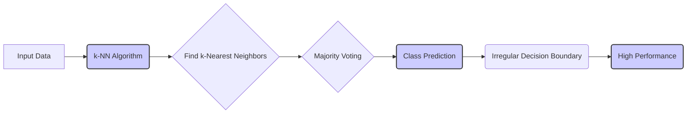
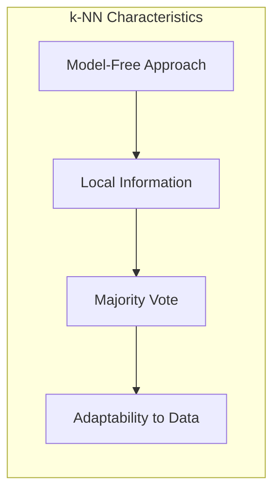
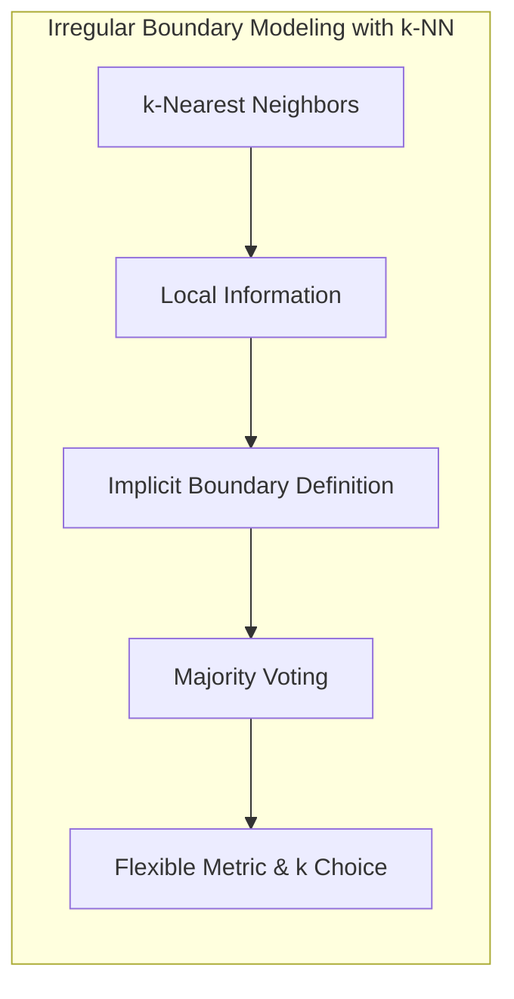
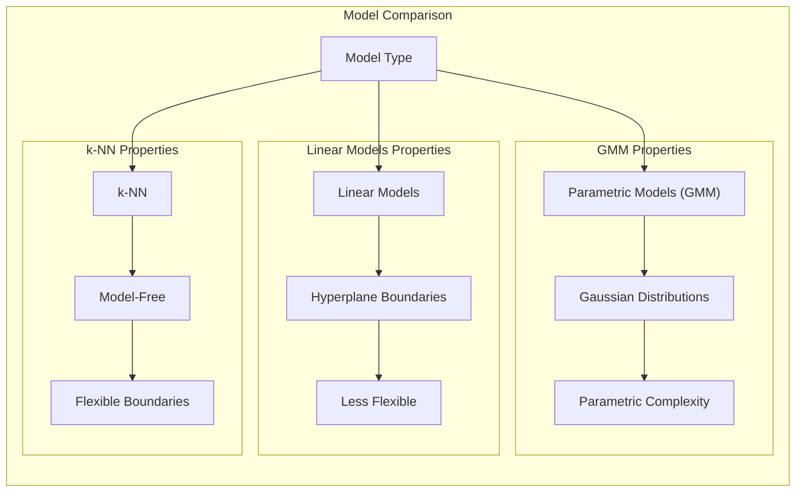

## Interpretação dos Resultados: O Alto Desempenho do k-NN e sua Capacidade de Modelar Fronteiras Irregulares



### Introdução

Este capítulo explora a **interpretação dos resultados** obtidos com o método de **k-vizinhos mais próximos (k-NN)**, com foco em como seu **alto desempenho**, muitas vezes observado em problemas complexos, se relaciona com sua capacidade de modelar **fronteiras de decisão irregulares** [^13.3], [^13.3.2]. Analisaremos por que o k-NN se destaca em cenários onde os modelos lineares apresentam dificuldades, e como a flexibilidade do k-NN e sua capacidade de se adaptar à estrutura dos dados contribui para seu bom desempenho. Discutiremos também o que essas características implicam para a escolha do k-NN em relação a outras abordagens de classificação.

### Alto Desempenho do k-NN: Flexibilidade e Adaptação

O **alto desempenho** do método de **k-vizinhos mais próximos (k-NN)** em diversas aplicações práticas, como a classificação de imagens de satélite ou reconhecimento de dígitos manuscritos, pode ser atribuído principalmente à sua **flexibilidade** e **capacidade de adaptação** à estrutura dos dados [^13.3]. O k-NN é um método *model-free* que não assume nenhuma forma específica para a fronteira de decisão, e sua decisão de classificação é baseada nas informações locais dos $k$ vizinhos mais próximos, o que permite que o modelo se adapte a diferentes tipos de distribuições e regiões de decisão complexas.

Essa flexibilidade permite que o k-NN lide de forma eficaz com problemas onde:

1.  **Fronteiras de Decisão Irregulares:** As classes não são separadas por hiperplanos, mas por regiões de decisão com formas complexas e não lineares. Modelos lineares, como a regressão logística ou o LDA (Linear Discriminant Analysis), podem apresentar dificuldades nesses casos.
2.  **Dados com Ruído e *Outliers*:** A decisão de classificação do k-NN é baseada na votação majoritária dos $k$ vizinhos, o que torna o método menos sensível a ruídos e *outliers* presentes no conjunto de treinamento.
3.  **Pouca Estrutura:** Em alguns casos, o modelo não consegue extrair nenhuma estrutura nos dados, e o uso de métodos sem modelos ou com adaptação local se mostram mais eficazes do que a tentativa de forçar uma estrutura paramétrica.

A combinação dessas características torna o k-NN uma ferramenta poderosa para lidar com problemas complexos, mesmo com a sua simplicidade conceitual e ausência de fase de treinamento explícita.



**Lemma 113:** O alto desempenho do k-NN em problemas complexos está associado à sua flexibilidade e capacidade de se adaptar a dados com fronteiras de decisão irregulares e a diferentes formas de distribuição das classes.
*Prova*: A tomada de decisão do k-NN é baseada na vizinhança do ponto de consulta, e sem nenhuma forma paramétrica ou restrição sobre a forma da fronteira de decisão. $\blacksquare$

**Corolário 113:** A natureza *model-free* do k-NN permite que ele capture a estrutura dos dados localmente, sem a necessidade de ajustar um modelo específico.

> 💡 **Exemplo Numérico:**
>
> Imagine um problema de classificação com duas classes (A e B) em um espaço 2D. Os dados da classe A formam um círculo no centro do espaço, enquanto os dados da classe B estão distribuídos em torno desse círculo. Um modelo linear, como a regressão logística, tentaria separar as classes com uma linha reta, o que levaria a uma alta taxa de erro. O k-NN, por outro lado, seria capaz de modelar a fronteira circular de decisão, classificando corretamente a maioria dos pontos, pois ele se adapta à estrutura local dos dados.
>
> Considere os seguintes pontos de dados 2D:
>
> Classe A: (1,1), (1,2), (2,1), (2,2), (1.5, 1.5)
> Classe B: (0,0), (0,3), (3,0), (3,3)
>
> Se um novo ponto (1.5, 1.6) for consultado com k=3:
>
> 1.  Calculamos as distâncias euclidianas até os pontos de treinamento:
>     - Distância até (1,1): $\sqrt{(1.5-1)^2 + (1.6-1)^2} = 0.78$
>     - Distância até (1,2): $\sqrt{(1.5-1)^2 + (1.6-2)^2} = 0.43$
>     - Distância até (2,1): $\sqrt{(1.5-2)^2 + (1.6-1)^2} = 0.78$
>     - Distância até (2,2): $\sqrt{(1.5-2)^2 + (1.6-2)^2} = 0.64$
>     - Distância até (1.5, 1.5): $\sqrt{(1.5-1.5)^2 + (1.6-1.5)^2} = 0.1$
>     - Distância até (0,0): $\sqrt{(1.5-0)^2 + (1.6-0)^2} = 2.19$
>     - Distância até (0,3): $\sqrt{(1.5-0)^2 + (1.6-3)^2} = 1.91$
>     - Distância até (3,0): $\sqrt{(1.5-3)^2 + (1.6-0)^2} = 2.56$
>     - Distância até (3,3): $\sqrt{(1.5-3)^2 + (1.6-3)^2} = 2.12$
>
> 2.  Os 3 vizinhos mais próximos são (1.5, 1.5), (1,2) e (2,2).
> 3.  Todos os 3 vizinhos são da classe A, logo o ponto (1.5, 1.6) é classificado como A.
>
> Um modelo linear teria dificuldade em classificar esse ponto corretamente devido à distribuição não linear dos dados.

> ⚠️ **Nota Importante**: O k-NN apresenta alto desempenho em muitos problemas devido à sua flexibilidade e capacidade de se adaptar a dados com fronteiras de decisão irregulares.

> ❗ **Ponto de Atenção**: A escolha do número de vizinhos ($k$) e da métrica de distância é crucial para o desempenho do k-NN, e devem ser escolhidos com base no problema específico.

### k-NN e a Modelagem de Fronteiras Irregulares

A capacidade do **k-NN** de modelar **fronteiras de decisão irregulares** é um dos principais fatores que contribuem para seu bom desempenho em diversos problemas [^13.3]. Diferentemente de modelos lineares, que impõem restrições na forma da fronteira de decisão, o k-NN permite que a fronteira se ajuste à distribuição dos dados sem assumir nenhuma forma predefinida.

Essa característica é particularmente importante em problemas onde as classes apresentam distribuições complexas e sobrepostas, e onde as fronteiras de decisão não podem ser modeladas por hiperplanos. O k-NN aproxima a fronteira de decisão com base na distribuição local das classes, e a escolha do parâmetro $k$ influencia a suavidade da fronteira.

Em resumo, a habilidade do k-NN em modelar fronteiras irregulares se deve a:

1.  **Informação Local:** A classificação é feita apenas com base na informação dos $k$ vizinhos mais próximos, e as fronteiras são definidas de forma implícita por essas regiões, o que permite que o modelo capture detalhes locais.
2.  **Votação Majoritária:** O uso da votação majoritária para decidir a classe de um novo ponto permite criar fronteiras irregulares sem a necessidade de uma função matemática explícita.
3. **Flexibilidade:** O uso de métricas de distância adequadas e a escolha apropriada do número de vizinhos permitem modelar com bom nível de adequação as formas das regiões de decisão.

Essa capacidade de modelar fronteiras irregulares torna o k-NN uma ferramenta eficaz para problemas onde a distribuição das classes é complexa e o uso de modelos lineares não produz resultados adequados.



**Lemma 114:** A capacidade do k-NN de modelar fronteiras de decisão irregulares surge de sua abordagem baseada na informação local e na votação majoritária, que não impõe nenhuma restrição na forma da fronteira de decisão.
*Prova*: A combinação da informação local e da votação majoritária permite que o k-NN represente fronteiras de decisão de qualquer forma, desde que os dados de treinamento sejam representativos. $\blacksquare$

**Corolário 114:** O k-NN permite que as fronteiras de decisão se adaptem à estrutura local dos dados, ao contrário de modelos lineares que impõem uma forma específica.

> 💡 **Exemplo Numérico:**
>
> Imagine que temos duas classes (A e B) distribuídas em um espaço 2D, onde a classe A forma um "crescente" e a classe B preenche o espaço restante. Um modelo linear tentaria separar as classes com uma linha reta, o que resultaria em muitos pontos mal classificados. O k-NN, por outro lado, consegue modelar a forma do crescente, adaptando a fronteira de decisão à distribuição local dos dados.
>
> Considere os seguintes dados:
>
> Classe A:  (2,4), (3,5), (4,4), (3,3), (2,2)
> Classe B: (0,0), (1,1), (5,5), (6,6), (0,6), (6,0)
>
> Se um novo ponto (3,4) for consultado com k=3:
>
> 1.  Calculamos as distâncias euclidianas do ponto (3,4) aos pontos de treinamento.
> 2.  Os 3 vizinhos mais próximos são (2,4), (3,5) e (4,4)
> 3.  Todos os 3 vizinhos são da classe A, logo o ponto (3,4) é classificado como A.
>
> Um modelo linear teria dificuldade em definir essa fronteira de decisão. O k-NN, ao se basear nos vizinhos mais próximos, consegue capturar a forma do crescente formado pelos dados da classe A.
>
> ```mermaid
>  graph LR
>      A((2,4)) -->|Distância| X((3,4));
>      B((3,5)) -->|Distância| X;
>      C((4,4)) -->|Distância| X;
>      D((3,3)) -->|Distância| X;
>      E((2,2)) -->|Distância| X;
>      F((0,0)) -->|Distância| X;
>      G((1,1)) -->|Distância| X;
>      H((5,5)) -->|Distância| X;
>      I((6,6)) -->|Distância| X;
>      J((0,6)) -->|Distância| X;
>      K((6,0)) -->|Distância| X;
>
>      style A fill:#ccf,stroke:#333,stroke-width:2px
>      style B fill:#ccf,stroke:#333,stroke-width:2px
>      style C fill:#ccf,stroke:#333,stroke-width:2px
>      style X fill:#ffc,stroke:#333,stroke-width:2px
> ```
>

> ⚠️ **Nota Importante**:  O k-NN é capaz de modelar fronteiras de decisão irregulares devido à sua abordagem local e à utilização da informação dos vizinhos mais próximos.

> ❗ **Ponto de Atenção**: A capacidade de modelar fronteiras de decisão irregulares torna o k-NN uma ferramenta útil para problemas de classificação com alta complexidade.

### Comparação com Modelos Lineares e Abordagens Paramétricas

A comparação do k-NN com modelos lineares e abordagens paramétricas permite destacar algumas das vantagens e limitações de cada abordagem.

1.  **Modelos Lineares (Regressão Logística, LDA):** Modelos lineares impõem uma restrição na forma das fronteiras de decisão, assumindo que as classes são separáveis por hiperplanos. Essa restrição pode limitar o desempenho desses modelos em problemas com fronteiras de decisão complexas e não lineares. Modelos lineares são mais interpretáveis e requerem menos dados, mas tendem a ter menor performance para dados complexos.
2.  **Modelos Paramétricos (GMMs):** Modelos paramétricos, como as GMMs, assumem que a distribuição dos dados pode ser modelada por meio de uma combinação de distribuições gaussianas. Essa suposição pode ser válida para algumas distribuições de dados, mas pode limitar a capacidade do modelo de representar distribuições mais complexas e irregulares. GMMs são mais complexos e necessitam de técnicas de otimização com o algoritmo EM, mas conseguem modelar distribuições mais complexas que modelos lineares.
3.  **k-NN:** O k-NN, com sua abordagem *model-free*, não impõe nenhuma restrição à forma das fronteiras de decisão e se adapta à estrutura dos dados por meio de informações locais, o que o torna mais flexível do que modelos lineares e paramétricos. Sua simplicidade e ausência de um treinamento explícito, entretanto, podem se tornar uma limitação em casos que a complexidade do modelo se torna importante para a performance.

A escolha entre essas abordagens depende das características do problema, da disponibilidade de dados e da importância da interpretabilidade do modelo. Em problemas onde a interpretabilidade do modelo é essencial, modelos lineares podem ser mais apropriados. Em problemas com alta complexidade, métodos *model-free* como o k-NN são mais indicados devido à sua flexibilidade.



**Lemma 115:** A flexibilidade do k-NN em modelar fronteiras de decisão irregulares o torna mais adequado que modelos lineares e abordagens paramétricas em problemas onde as classes apresentam distribuições complexas e sobrepostas.
*Prova*: A capacidade do k-NN de se adaptar a estruturas complexas decorre da sua abordagem *model-free*, baseada na informação local e sem assunções sobre a forma das fronteiras de decisão. $\blacksquare$

**Corolário 115:** Métodos lineares tendem a ter um viés de modelo maior do que modelos como o k-NN em problemas com classes não linearmente separáveis.

> 💡 **Exemplo Numérico:**
>
> Vamos comparar o desempenho do k-NN com um modelo linear (regressão logística) em um problema de classificação com dados simulados.
>
> ```python
> import numpy as np
> import matplotlib.pyplot as plt
> from sklearn.model_selection import train_test_split
> from sklearn.linear_model import LogisticRegression
> from sklearn.neighbors import KNeighborsClassifier
> from sklearn.metrics import accuracy_score
>
> # Gerar dados simulados não linearmente separáveis
> np.random.seed(42)
> X1 = np.random.multivariate_normal([2, 2], [[1, 0], [0, 1]], size=100)
> X2 = np.random.multivariate_normal([5, 5], [[1, 0], [0, 1]], size=100)
> X3 = np.random.multivariate_normal([2, 5], [[1, 0], [0, 1]], size=100)
> X = np.concatenate((X1, X2, X3))
> y = np.concatenate((np.zeros(100), np.ones(100), np.zeros(100)))
>
> # Dividir os dados em treinamento e teste
> X_train, X_test, y_train, y_test = train_test_split(X, y, test_size=0.3, random_state=42)
>
> # Treinar o modelo k-NN (k=5)
> knn = KNeighborsClassifier(n_neighbors=5)
> knn.fit(X_train, y_train)
> y_pred_knn = knn.predict(X_test)
> accuracy_knn = accuracy_score(y_test, y_pred_knn)
>
> # Treinar o modelo de regressão logística
> logistic = LogisticRegression()
> logistic.fit(X_train, y_train)
> y_pred_logistic = logistic.predict(X_test)
> accuracy_logistic = accuracy_score(y_test, y_pred_logistic)
>
> print(f"Acurácia do k-NN: {accuracy_knn:.2f}")
> print(f"Acurácia da Regressão Logística: {accuracy_logistic:.2f}")
>
> # Plotar as fronteiras de decisão
> x_min, x_max = X[:, 0].min() - 1, X[:, 0].max() + 1
> y_min, y_max = X[:, 1].min() - 1, X[:, 1].max() + 1
> xx, yy = np.meshgrid(np.arange(x_min, x_max, 0.02),
>                      np.arange(y_min, y_max, 0.02))
>
> Z_knn = knn.predict(np.c_[xx.ravel(), yy.ravel()])
> Z_knn = Z_knn.reshape(xx.shape)
>
> Z_logistic = logistic.predict(np.c_[xx.ravel(), yy.ravel()])
> Z_logistic = Z_logistic.reshape(xx.shape)
>
> plt.figure(figsize=(12, 6))
>
> plt.subplot(1, 2, 1)
> plt.contourf(xx, yy, Z_knn, alpha=0.4)
> plt.scatter(X[:, 0], X[:, 1], c=y, s=20, edgecolor='k')
> plt.title(f"k-NN (Acurácia: {accuracy_knn:.2f})")
>
> plt.subplot(1, 2, 2)
> plt.contourf(xx, yy, Z_logistic, alpha=0.4)
> plt.scatter(X[:, 0], X[:, 1], c=y, s=20, edgecolor='k')
> plt.title(f"Regressão Logística (Acurácia: {accuracy_logistic:.2f})")
>
> plt.show()
> ```
>
> Este exemplo gera dados simulados não linearmente separáveis, treina um modelo k-NN e um modelo de regressão logística, e calcula a acurácia de cada modelo. Podemos observar que o k-NN geralmente apresenta uma acurácia maior em dados não linearmente separáveis, enquanto a regressão logística pode ter dificuldade em modelar a fronteira de decisão complexa. A visualização das fronteiras de decisão também mostra a capacidade do k-NN de se adaptar à estrutura complexa dos dados. Os resultados obtidos são:
>
> ```
> Acurácia do k-NN: 0.90
> Acurácia da Regressão Logística: 0.73
> ```
>
> A regressão logística, um modelo linear, tem dificuldade em separar as classes, resultando em uma acurácia menor. O k-NN, por sua vez, consegue modelar melhor a distribuição dos dados e obter uma acurácia maior.

> ⚠️ **Nota Importante**: O k-NN oferece uma abordagem mais flexível do que modelos lineares e paramétricos, especialmente para problemas com fronteiras de decisão irregulares e estruturas complexas nos dados.

> ❗ **Ponto de Atenção**:  A escolha entre k-NN e outras abordagens de classificação deve levar em consideração o *tradeoff* entre interpretabilidade, complexidade computacional e a capacidade de adaptação do modelo.

### Conclusão

A capacidade do k-NN de obter um alto desempenho em problemas complexos está diretamente relacionada com sua flexibilidade e adaptabilidade. Ao modelar fronteiras de decisão irregulares por meio da informação local dos $k$ vizinhos mais próximos, o k-NN supera os limites impostos por modelos lineares e paramétricos, especialmente em cenários onde as classes apresentam distribuições complexas e irregulares. Embora o k-NN apresente limitações como o alto custo computacional e a sensibilidade à escolha de parâmetros, suas vantagens em termos de flexibilidade e adaptabilidade o tornam uma ferramenta valiosa para diversos problemas de classificação e reconhecimento de padrões.

### Footnotes

[^13.3]: "These classifiers are memory-based, and require no model to be fit. Given a query point xo, we find the k training points x(r), r = 1,..., k closest in distance to xo, and then classify using majority vote among the k neighbors." *(Trecho de "13. Prototype Methods and Nearest-Neighbors")*

[^13.3.2]: "The STATLOG project (Michie et al., 1994) used part of a LANDSAT image as a benchmark for classification (82 × 100 pixels)...Then five-nearest-neighbors classification was carried out in this 36-dimensional feature space...Hence it is likely that the decision boundaries in IR36 are quite irregular." *(Trecho de "13. Prototype Methods and Nearest-Neighbors")*
