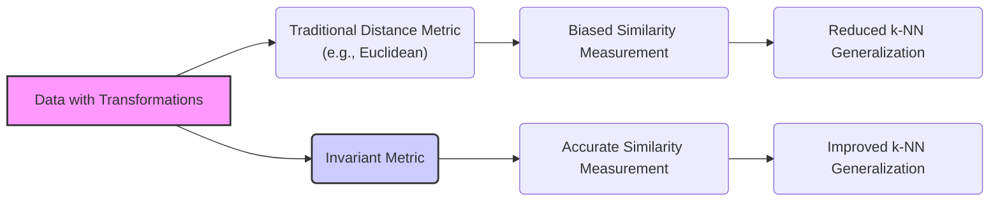
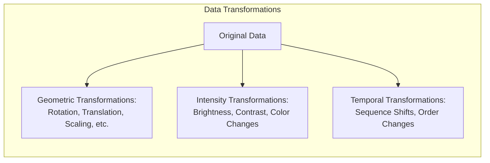
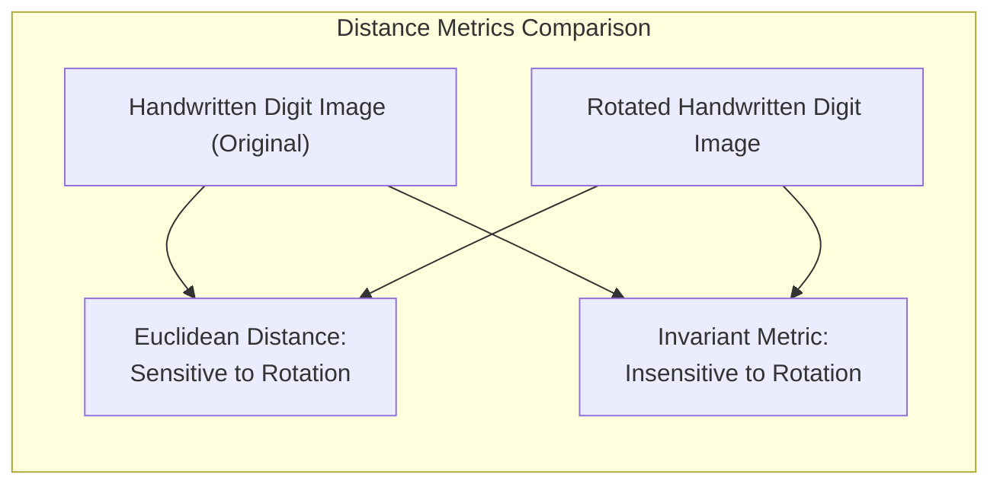
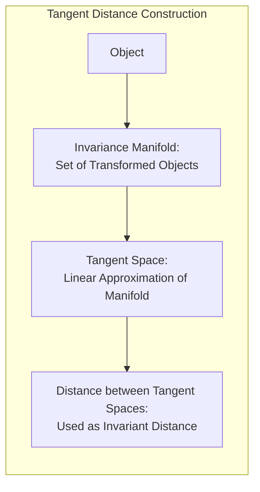
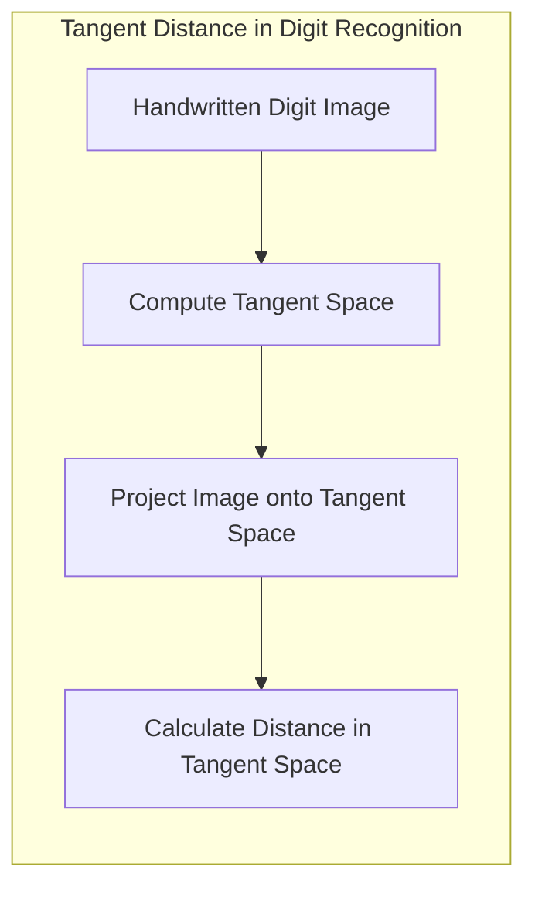

## Métricas Invariantes: Incorporando a Invariância a Transformações na Medida de Proximidade

### Introdução

Este capítulo explora o conceito de **métricas invariantes**, que são projetadas para medir a similaridade entre objetos que são transformações uns dos outros [^13.3.3]. Em muitos problemas de aprendizado de máquina, os dados podem apresentar transformações naturais, como rotações, translações, mudanças de escala ou outras distorções. Métricas de distância tradicionais, como a distância Euclidiana, podem ser sensíveis a essas transformações, levando a resultados enviesados na classificação ou reconhecimento de padrões. Analisaremos como as métricas invariantes são construídas para lidar com esse problema, e como elas permitem que o k-NN generalize melhor em cenários onde os dados apresentam essas transformações. Discutiremos também o conceito de distância tangente como uma forma de construir métricas invariantes e como elas são aplicadas em reconhecimento de padrões.

### A Necessidade de Métricas Invariantes: Lidando com Transformações nos Dados

Em muitos problemas de classificação e reconhecimento de padrões, os dados apresentam transformações que podem afetar a forma como a similaridade entre os objetos é medida [^13.3.3]. Essas transformações podem ser:

1.  **Transformações Geométricas:** Rotações, translações, mudanças de escala, deformações, e outras transformações que afetam a posição, orientação e forma dos objetos.
2.  **Transformações de Intensidade:** Mudanças no brilho, contraste, cor, e outras transformações que afetam os valores das *features*.
3.  **Transformações Temporais:** Mudanças na ordem de sequência, deslocamentos ou outras transformações que afetam dados temporais.

As métricas de distância tradicionais, como a distância Euclidiana, são sensíveis a essas transformações. Por exemplo, ao calcular a distância entre duas imagens de um mesmo objeto, a distância Euclidiana pode ser alta se uma das imagens for rotacionada ou transladada, mesmo que o objeto seja essencialmente o mesmo nas duas imagens.

Para lidar com esse problema, são utilizadas **métricas invariantes**, que são projetadas para medir a similaridade entre objetos que são transformações uns dos outros. A invariância é uma propriedade desejável das métricas de distância, que permite que o modelo de aprendizado ignore as transformações que não são relevantes para a classificação ou reconhecimento do padrão.

**Lemma 116:** Métricas invariantes permitem medir a similaridade entre objetos que são transformações uns dos outros, o que aumenta a capacidade de generalização do modelo e reduz a influência de variações nos dados que não são relevantes para a classificação.
*Prova*: Uma métrica invariante resulta no mesmo valor de distância quando aplicada entre pontos e suas transformações, representando apenas similaridade estrutural entre as instâncias e não sua posição no espaço. $\blacksquare$

> 💡 **Exemplo Numérico:**
> Imagine que temos duas representações de um mesmo objeto, representadas por vetores de características (features). O objeto original é representado por $x_1 = [1, 2]$, e uma versão rotacionada do mesmo objeto é $x_2 = [2, -1]$. Usando a distância euclidiana, temos:
>
> $d(x_1, x_2) = \sqrt{(2-1)^2 + (-1-2)^2} = \sqrt{1^2 + (-3)^2} = \sqrt{10} \approx 3.16$
>
> Agora, suponha que a rotação não seja relevante para a classificação. Uma métrica invariante à rotação idealmente retornaria uma distância muito menor (ou até 0), indicando que os objetos são essencialmente o mesmo. Este exemplo ilustra como a distância Euclidiana pode ser enganosa quando transformações estão presentes. Uma métrica invariante, como a distância tangente, seria projetada para lidar com esse problema, conforme explicado posteriormente.

**Corolário 116:** O uso de métricas invariantes é essencial em problemas onde os dados apresentam transformações que não devem influenciar a classificação ou reconhecimento de padrões.

> ⚠️ **Nota Importante**: Métricas invariantes são projetadas para medir a similaridade entre objetos que são transformações uns dos outros, removendo a influência de transformações irrelevantes.

> ❗ **Ponto de Atenção**:  A escolha de uma métrica invariante adequada depende das transformações que se espera encontrar nos dados e da necessidade de generalizar em relação a essas transformações.

### Distância Euclidiana vs. Métricas Invariantes: Um Exemplo com Rotação de Dígitos Manuscritos

Para ilustrar a diferença entre a **distância Euclidiana** e as **métricas invariantes**, podemos considerar o exemplo do reconhecimento de dígitos manuscritos, onde as imagens dos dígitos podem apresentar variações em sua orientação (rotação) [^13.3.3].

A distância Euclidiana entre duas imagens de dígitos manuscritos é calculada com base na diferença entre os valores de seus pixels correspondentes. No entanto, se uma imagem for rotacionada, os valores dos pixels mudarão significativamente, mesmo que o dígito em si seja o mesmo. Isso significa que a distância Euclidiana será grande entre uma imagem original e uma imagem rotacionada do mesmo dígito, o que dificulta a classificação correta.

Uma métrica invariante à rotação, por outro lado, seria capaz de medir a similaridade entre as duas imagens, mesmo que uma delas esteja rotacionada. Essa métrica ignoraria a rotação e focaria na forma essencial do dígito, permitindo que o classificador identifique as duas imagens como pertencentes à mesma classe. O conceito de distância tangente busca realizar essa comparação entre objetos com pequenas transformações, através da comparação da projeção desses objetos em um espaço tangente no ponto de operação.

**Lemma 117:** A distância Euclidiana é sensível a transformações geométricas como a rotação, o que limita sua capacidade de medir a similaridade entre objetos que apresentam essas transformações, enquanto métodos que utilizam o conceito de distância tangente podem obter resultados melhores.
*Prova*: A distância euclidiana mede apenas a distância entre dois pontos, mas não considera que uma rotação de um objeto pode não alterar sua similaridade intrínseca. $\blacksquare$

> 💡 **Exemplo Numérico:**
> Considere duas imagens de um dígito '3', representadas como vetores de pixels. A imagem original, $I_1$, tem pixels com valores (após normalização) como:
>
> $I_1 = [0.1, 0.2, 0.7, 0.8, 0.3, 0.4, 0.9, 0.7, 0.2]$
>
> E a imagem rotacionada, $I_2$, tem pixels com valores:
>
> $I_2 = [0.2, 0.7, 0.8, 0.3, 0.4, 0.9, 0.7, 0.2, 0.1]$
>
> A distância Euclidiana entre $I_1$ e $I_2$ é:
>
> $d(I_1, I_2) = \sqrt{(0.2-0.1)^2 + (0.7-0.2)^2 + (0.8-0.7)^2 + (0.3-0.8)^2 + (0.4-0.3)^2 + (0.9-0.4)^2 + (0.7-0.9)^2 + (0.2-0.7)^2 + (0.1-0.2)^2}$
> $d(I_1, I_2) = \sqrt{0.01 + 0.25 + 0.01 + 0.25 + 0.01 + 0.25 + 0.04 + 0.25 + 0.01} = \sqrt{1.08} \approx 1.04$
>
> Essa distância é relativamente alta. Uma métrica invariante à rotação idealmente retornaria uma distância menor, pois ambas as imagens representam o mesmo dígito, apenas com uma rotação diferente. Métricas invariantes, como a distância tangente, tentam minimizar o efeito dessas transformações.

**Corolário 117:** A métricas invariantes, que consideram transformações nos dados, são essenciais para que modelos de classificação e reconhecimento possam generalizar para novos dados com transformações.

> ⚠️ **Nota Importante**:  A distância Euclidiana é sensível a transformações, como rotações, o que pode levar a resultados enviesados.

> ❗ **Ponto de Atenção**: Métricas invariantes são necessárias para medir a similaridade entre objetos que podem apresentar transformações relevantes, o que melhora a capacidade de generalização.

### Distância Tangente: Aproximando a Invariância por Rotação

A **distância tangente** é uma abordagem para construir métricas invariantes que aproximam a invariância a transformações geométricas por meio da consideração das transformações de vizinhança [^13.3.3]. A ideia central da distância tangente é representar a variação de uma imagem devido a pequenas transformações por um espaço tangente, e calcular a distância entre os objetos com base na distância entre os espaços tangentes.

O processo de construção da distância tangente pode ser descrito da seguinte forma:

1.  **Manifold de Invariância:** Para cada objeto (por exemplo, uma imagem de um dígito), é construído um *manifold* (variedade) que representa as possíveis transformações do objeto. No caso de rotação, o *manifold* é uma curva no espaço de *features* que representa todas as imagens resultantes da rotação da imagem original.
2.  **Espaço Tangente:** Para cada objeto, é construído um espaço tangente, que aproxima o *manifold* de invariância na vizinhança do objeto. O espaço tangente é representado por um subespaço linear que captura as direções de variação das transformações.
3.  **Distância entre Espaços Tangentes:** A distância entre dois objetos é calculada com base na distância entre seus respectivos espaços tangentes. Essa distância é geralmente a distância Euclidiana entre os pontos de projeção de cada objeto em seu espaço tangente.

A distância tangente aproxima a invariância em relação às transformações, pois mede a distância entre os espaços tangentes, que representam as possíveis variações que um objeto pode sofrer devido a essas transformações. A utilização de espaços tangentes para calcular a distância resulta em uma métrica que é menos sensível a pequenas transformações, e mais adequada para cenários onde os objetos podem variar devido a essas transformações.

**Lemma 118:** A distância tangente aproxima a invariância a transformações por meio da modelagem das transformações através de um espaço tangente, que captura as variações do objeto devido a estas transformações.
*Prova*: O conceito da distância tangente surge da aproximação da variedade de transformações por um subespaço linear, o espaço tangente. $\blacksquare$

> 💡 **Exemplo Numérico:**
> Considere uma imagem de um dígito '7' representado como um vetor $x$. Para construir o espaço tangente para rotações, podemos aplicar pequenas rotações à imagem $x$ e obter imagens ligeiramente rotacionadas, como $x + \delta_1$, $x + \delta_2$, etc., onde $\delta_i$ representa a mudança no vetor de pixels devido à pequena rotação.
>
> O espaço tangente, $T_x$, é então construído como o espaço linear gerado pelos vetores de mudança $\delta_i$. Se considerarmos apenas uma rotação em sentido horário e anti-horário, podemos ter dois vetores de base para o espaço tangente, representando os gradientes da imagem em relação à rotação.
>
> Para calcular a distância tangente entre duas imagens $x_1$ e $x_2$, projetamos $x_1$ e $x_2$ em seus respectivos espaços tangentes, $T_{x_1}$ e $T_{x_2}$. Sejam as projeções $p_{x_1}$ e $p_{x_2}$. A distância tangente é então calculada como a distância euclidiana entre $p_{x_1}$ e $p_{x_2}$. Esse processo aproxima a invariância, pois considera as variações que a rotação causa na imagem.

**Corolário 118:** O uso de espaços tangentes permite aproximar uma métrica invariante a rotações, e outras transformações, e reduzir a necessidade de ter muitos exemplos de dados para cada classe.

> ⚠️ **Nota Importante**: A distância tangente é uma abordagem para construir métricas invariantes a transformações, utilizando espaços tangentes para aproximar as variações devidas a transformações nos dados.

> ❗ **Ponto de Atenção**:  A computação da distância tangente pode ser computacionalmente custosa, e seu uso pode ser mais apropriado para conjuntos de dados com transformações específicas.

### A Aplicação da Distância Tangente: Reconhecimento de Dígitos Manuscritos

A aplicação da **distância tangente** em problemas de reconhecimento de dígitos manuscritos tem demonstrado resultados notáveis, especialmente na criação de modelos que sejam capazes de reconhecer dígitos mesmo quando apresentam rotações, e outras distorções [^13.3.3].

Ao utilizar a distância tangente para calcular a proximidade entre as imagens de dígitos, o modelo se torna menos sensível a pequenas rotações, e outros tipos de transformações, o que melhora sua capacidade de generalização. A distância tangente é calculada com base na projeção das imagens nos espaços tangentes, que são obtidos por meio de pequenas rotações das imagens, ou por métodos mais sofisticados de suavização.

> 💡 **Exemplo Numérico:**
> Vamos considerar um cenário simplificado com um dígito '2'. Primeiro, criamos o espaço tangente para uma imagem original do '2'. Isso envolve gerar pequenas variações da imagem, como rotações em ângulos de -5 e +5 graus. Os vetores que representam essas variações formam a base do espaço tangente.
>
> Agora, temos duas imagens, $I_{2a}$ (original) e $I_{2b}$ (levemente rotacionada). Ao invés de calcular a distância Euclidiana direta entre $I_{2a}$ e $I_{2b}$, projetamos ambas em seus respectivos espaços tangentes. As projeções são $P_{2a}$ e $P_{2b}$. A distância tangente é então a distância Euclidiana entre $P_{2a}$ e $P_{2b}$.
>
> Este processo garante que a distância entre as imagens seja menor, mesmo que uma delas esteja rotacionada, pois considera a estrutura invariante do dígito.

A utilização de k-NN com distância tangente no problema de reconhecimento de dígitos manuscritos ilustra a importância de métricas invariantes em problemas onde os dados podem apresentar variações, e a capacidade de se adaptar a diferentes formas de representação dos dados. O uso de dados aumentados através de transformações nos dados pode ser uma alternativa quando a computação da distância tangente se torna inviável ou não necessária.

**Lemma 119:** A aplicação da distância tangente no reconhecimento de dígitos manuscritos permite que o modelo seja menos sensível a transformações como rotações e generaliza melhor para dados não vistos no treinamento.
*Prova*: O uso da distância tangente faz com que a decisão seja baseada na similaridade entre formas e não na posição dos objetos no espaço. $\blacksquare$

**Corolário 119:** A métrica de distância tangente apresenta resultados superiores à distância Euclidiana no reconhecimento de dígitos manuscritos por ser invariante a pequenas variações nos dados de entrada.

> ⚠️ **Nota Importante**: A distância tangente é uma métrica invariante que permite que o k-NN obtenha bom desempenho em problemas de reconhecimento de dígitos manuscritos, onde as rotações e variações nas formas dos dígitos são comuns.

> ❗ **Ponto de Atenção**:  A computação da distância tangente pode ser computacionalmente custosa, e sua utilização deve ser avaliada em relação ao ganho de desempenho e ao custo computacional.

### Conclusão

A incorporação da invariância a transformações na medida de proximidade é um conceito importante em problemas de aprendizado de máquina, onde os dados podem apresentar transformações que não são relevantes para a tarefa em questão. Métricas invariantes, como a distância tangente, permitem que os modelos de classificação e reconhecimento de padrões generalizem melhor para dados que apresentam essas transformações, e que modelos como o k-NN possam apresentar desempenho superior em cenários onde dados de treino e teste podem ser diferentes devido a rotação, translação, ou outras transformações. A escolha de uma métrica adequada, que leve em consideração as características do problema e as transformações que podem ocorrer, é fundamental para o desenvolvimento de sistemas de aprendizado de máquina eficazes e robustos.

### Footnotes

[^13.3.3]: "In some problems, the training features are invariant under certain natural transformations. The nearest-neighbor classifier can exploit such invariances by incorporating them into the metric used to measure the distances between objects...The problem is handwritten digit recognition...Hence we want our nearest-neighbor classifier to consider these two '3's to be close together (similar)." *(Trecho de "13. Prototype Methods and Nearest-Neighbors")*
