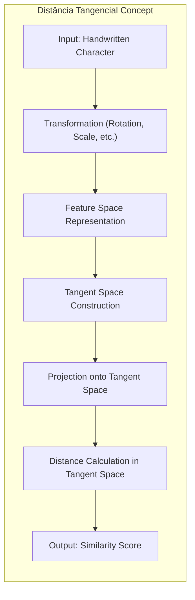
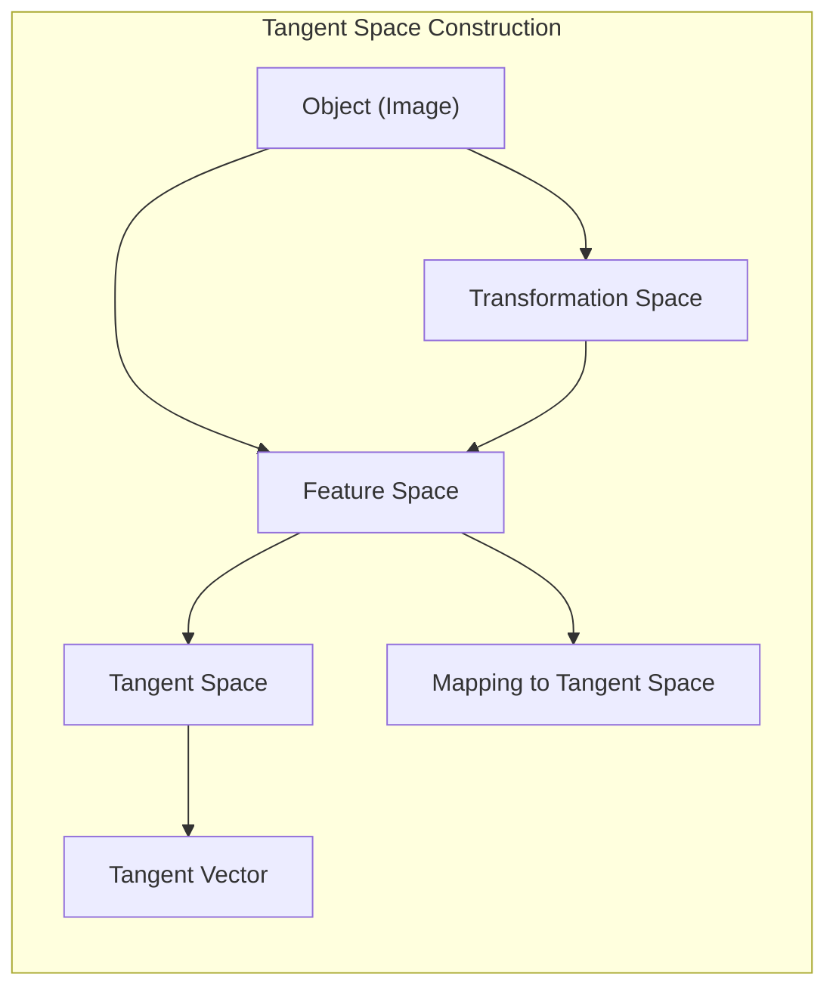
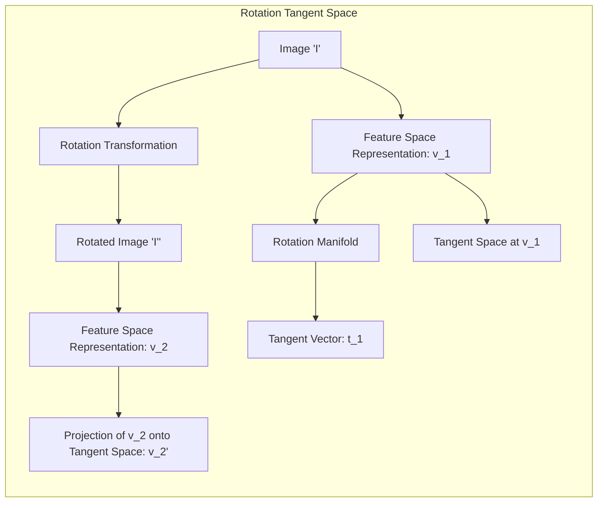
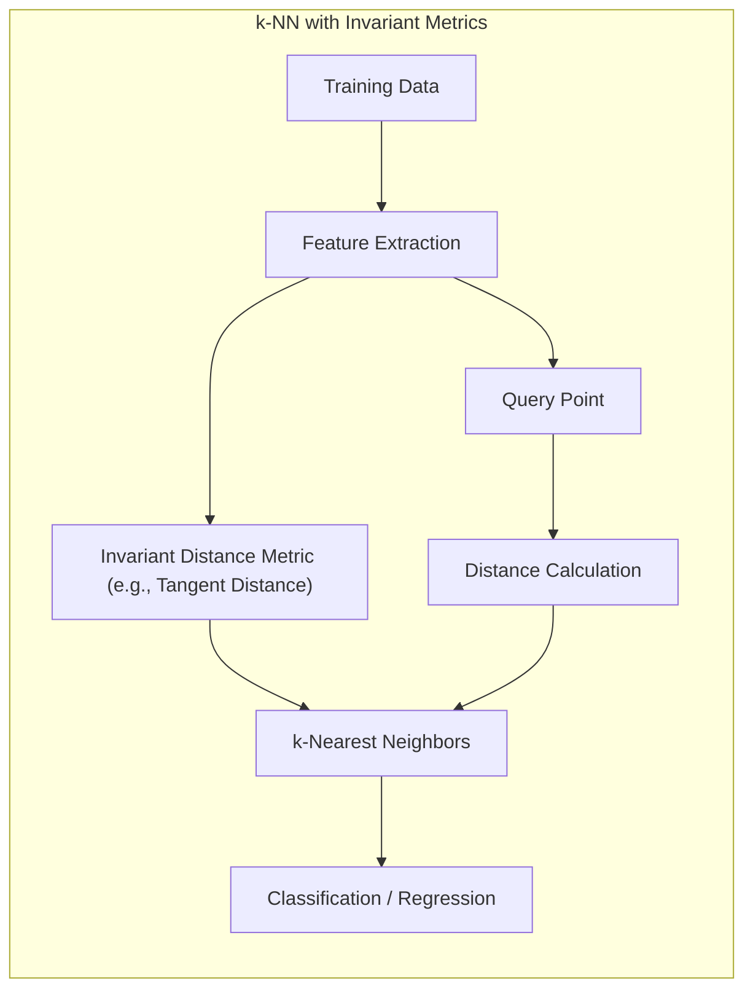

## Distância Tangencial no Reconhecimento de Caracteres Manuscritos: Incorporando Invariância a Rotações, Escalas e Outras Transformações

### Introdução

Este capítulo explora o uso da **distância tangencial** para o **reconhecimento de caracteres manuscritos**, demonstrando como essa métrica pode ser utilizada para tornar o processo de reconhecimento invariante a transformações como **rotação**, **escala** e outros tipos de distorções que ocorrem naturalmente na escrita à mão [^13.3.3]. Analisaremos como a distância tangencial é construída para modelar a variação nos dados devido a essas transformações e como ela permite que modelos de classificação, como o k-NN (k-vizinhos mais próximos), identifiquem caracteres que são semelhantes, mesmo quando apresentam pequenas variações em sua apresentação. Discutiremos também as vantagens e limitações dessa abordagem, e seu impacto na capacidade de generalização dos modelos de reconhecimento de caracteres.

### Reconhecimento de Caracteres Manuscritos: Um Desafio de Invariância

O problema do **reconhecimento de caracteres manuscritos** é um desafio clássico em aprendizado de máquina e visão computacional, devido à grande variedade na forma como as pessoas escrevem [^13.3.3]. Um mesmo caractere, como um dígito ou uma letra, pode apresentar diversas variações em sua aparência, tais como:

1.  **Rotação:** O caractere pode estar ligeiramente rotacionado em relação à sua orientação padrão.
2.  **Escala:** O caractere pode variar em tamanho (escala).
3.  **Translação:** O caractere pode estar posicionado em diferentes locais no espaço da imagem.
4.  **Espessura:** O traço do caractere pode variar em espessura ou intensidade.
5. **Forma:** O caractere pode apresentar pequenas distorções ou irregularidades em sua forma.

Essas variações são inerentes ao processo de escrita à mão e representam um desafio para modelos de reconhecimento de padrões, pois as imagens dos caracteres apresentam transformações que não são relevantes para sua identificação.

A utilização de métricas de distância tradicionais, como a distância Euclidiana, para medir a similaridade entre os caracteres pode ser problemática, pois essa métrica é sensível a transformações como rotação e translação. Para lidar com esse problema, são necessárias métricas que sejam **invariantes** a essas transformações, ou seja, métricas que avaliem a similaridade entre caracteres com diferentes transformações.

**Lemma 120:** O reconhecimento de caracteres manuscritos é desafiador devido à grande variedade nas formas de escrita, o que torna necessário o uso de métricas que sejam invariantes a transformações como rotação e escala.
*Prova*: As variações na escrita manual fazem com que um mesmo caractere seja apresentado de diferentes formas, e métricas invariantes são necessárias para ignorar essas variações e se concentrar na estrutura do caractere. $\blacksquare$

**Corolário 120:** Métricas de distância tradicionais, como a Euclidiana, são sensíveis a transformações e necessitam de outras técnicas para a criação de modelos mais robustos e com bom poder de generalização.

> ⚠️ **Nota Importante**:  O reconhecimento de caracteres manuscritos é um problema que exige que os modelos sejam capazes de lidar com as variações naturais da escrita à mão, como rotação, escala e outras transformações.

> ❗ **Ponto de Atenção**: A utilização de métricas de distância tradicionais, como a distância Euclidiana, pode levar a resultados subótimos em problemas de reconhecimento de caracteres manuscritos devido a sua sensibilidade às transformações.

### A Distância Tangencial: Aproximando a Invariância a Transformações

A **distância tangencial** é uma abordagem para construir métricas de distância que aproximam a invariância a transformações, utilizando o conceito de um espaço tangente para modelar as variações de um objeto devido a pequenas transformações [^13.3.3].

A ideia central da distância tangencial é que pequenas transformações de um objeto (como uma rotação pequena de um dígito manuscrito) podem ser aproximadas por uma trajetória linear em um espaço de *features* de alta dimensão, e que essa trajetória é a tangente da função que mapeia o espaço de transformação para o espaço de *features*.

Para calcular a distância tangencial entre duas imagens, o procedimento geral é:

1.  **Variedade de Transformações:** Para cada imagem, considerar um conjunto de transformações que podem ser aplicadas (rotações, escalas, etc.) e modelar essas transformações como uma variedade, ou uma curva, no espaço de *features*.
2.  **Espaço Tangente:** Para cada imagem, definir um espaço tangente à variedade de transformações no ponto de operação. Esse espaço tangente representa o espaço local onde a imagem pode variar por pequenas transformações. O espaço tangente é definido pelos vetores que indicam como a imagem varia devido a diferentes transformações (ex: derivada da imagem por um pequeno ângulo de rotação).
3.  **Projeção e Distância:** Projetar as imagens nos seus respectivos espaços tangentes e utilizar a distância Euclidiana entre os pontos projetados para definir a distância entre os objetos. A distância tangente é definida como a distância mínima entre o espaço tangente de uma imagem e o espaço tangente de outra imagem, considerando transformações de um objeto que o tornam mais similar ao outro.

**Lemma 121:** A distância tangencial aproxima a invariância a transformações por meio da utilização do espaço tangente, que modela as variações de um objeto devido a pequenas transformações.
*Prova*: A utilização do espaço tangente garante que transformações lineares sejam adequadamente representadas, e que a distância seja calculada levando-as em consideração. $\blacksquare$

**Corolário 121:** O cálculo da distância tangencial envolve a estimativa das derivadas da imagem sob pequenas transformações, que podem ser realizadas por diferenciação numérica ou por outros métodos de suavização.

> ⚠️ **Nota Importante**: A distância tangencial é uma abordagem para construir métricas invariantes, usando espaços tangentes para aproximar as transformações dos objetos.

> ❗ **Ponto de Atenção**:  A computação da distância tangente pode ser complexa e computacionalmente custosa, o que pode limitar sua aplicação em tempo real.

### Aplicação da Distância Tangencial: Um Exemplo com Rotação

Um exemplo prático da aplicação da distância tangencial é o reconhecimento de dígitos manuscritos, onde as imagens podem variar devido a pequenas rotações [^13.3.3]. Para entender como a distância tangente funciona, vamos considerar duas imagens de um mesmo dígito "3", onde uma delas é rotacionada em relação à outra.

1.  **Variedade de Rotações:** Para cada imagem, definimos uma variedade de rotações, que representa todas as formas que o dígito pode ter em rotações pequenas. Essa variedade pode ser aproximada por uma curva no espaço de *features* da imagem.
2.  **Espaço Tangente:** Em cada imagem, construímos um espaço tangente à variedade de rotação, que é a linha tangente à curva da variedade no ponto de operação. A tangente representa a direção na qual a imagem se modifica ao ser ligeiramente rotacionada.
3.  **Projeção e Distância:** Para calcular a distância entre as duas imagens, projetamos uma das imagens no espaço tangente da outra imagem, e calculamos a distância Euclidiana entre os pontos projetados. Essa distância representa a distância tangencial entre as duas imagens.

Com essa abordagem, a distância tangencial é capaz de capturar a similaridade entre as imagens mesmo que elas apresentem pequenas rotações, o que não seria possível com o cálculo da distância Euclidiana original entre os pontos de treino.

> 💡 **Exemplo Numérico:**
>
> Vamos supor que temos duas imagens do dígito "3", representadas como vetores de *features* em um espaço de alta dimensão. A imagem original, $I_1$, é representada pelo vetor $v_1 = [1, 2, 3, \ldots, n]$, e a imagem rotacionada, $I_2$, é representada pelo vetor $v_2 = [1.2, 1.8, 3.3, \ldots, n']$, onde $n$ e $n'$ são as dimensões do vetor de características.
>
> 1.  **Variedade de Rotações:** Para $I_1$, modelamos a variedade de rotações como uma função que transforma $v_1$ em um conjunto de vetores rotacionados.
>
> 2.  **Espaço Tangente:** Calculamos o vetor tangente $t_1$ em $v_1$ que representa a direção no espaço de *features* onde a rotação de $I_1$ ocorre.  Suponha que $t_1 = [0.1, -0.2, 0.3, \ldots, 0.1]$.
>
> 3.  **Projeção e Distância:**
>     - Projetamos $v_2$ no espaço tangente de $v_1$. Para isso, encontramos o ponto $v_2'$ no espaço tangente de $v_1$ que é mais próximo de $v_2$. Isso pode ser feito subtraindo a componente de $v_2$ que é ortogonal ao espaço tangente de $v_1$.
>     - Calculamos a distância Euclidiana entre $v_1$ e $v_2'$. Se $v_2$ é projetado em $v_1' = v_1 + \alpha t_1$ (onde $\alpha$ é um escalar encontrado pela projeção), a distância tangencial é dada por $||v_1' - v_2||$.
>
>     - **Cálculo da Projeção:** Para simplificar, vamos supor que o espaço tangente é unidimensional, então a projeção de $v_2$ em $t_1$ é dada por:
>     $\alpha = \frac{(v_2 - v_1) \cdot t_1}{||t_1||^2}$
>     Onde $\cdot$ é o produto escalar.
>     Se, por exemplo, $(v_2 - v_1) = [0.2, -0.2, 0.3, ...] $ e $t_1 = [0.1, -0.2, 0.3, \ldots, 0.1]$
>     $\alpha = \frac{0.2*0.1 + (-0.2)*(-0.2) + \ldots}{0.1^2 + (-0.2)^2 + \ldots} = 0.6$ (valor hipotético)
>     $v_1' = v_1 + 0.6t_1$.
>     Finalmente, a distância tangencial é $||v_1' - v_2||$.
>
>     - **Distância Euclidiana:** Para comparar, a distância Euclidiana seria $||v_1 - v_2||$, que seria maior, pois não considera a rotação.
>
>     - **Interpretação:** A distância tangencial é menor que a distância Euclidiana porque leva em consideração a transformação de rotação. Isso permite que o classificador k-NN considere essas duas imagens como similares, mesmo com a rotação.

**Lemma 122:** A aplicação da distância tangencial para o reconhecimento de dígitos manuscritos com rotação permite que o modelo seja menos sensível a essa transformação e generalize melhor.
*Prova*: A métrica de distância tangencial compara a forma dos dígitos através da comparação dos espaços tangentes, e não na sua representação no espaço das features. $\blacksquare$

**Corolário 122:** A distância tangencial permite a classificação correta de dígitos rotacionados, pois ela mede a similaridade entre as formas dos dígitos e não a sua posição no espaço de *features*.

> ⚠️ **Nota Importante**: O exemplo da rotação de dígitos manuscritos ilustra como a distância tangencial permite medir a similaridade entre objetos que podem variar devido a transformações geométricas.

> ❗ **Ponto de Atenção**: O cálculo da distância tangente requer conhecimento sobre as transformações esperadas, e a construção dos espaços tangentes pode ser complexa.

### Métricas Invariantes e k-NN: Melhorando a Generalização

A incorporação de **métricas invariantes** no método de **k-vizinhos mais próximos (k-NN)** permite melhorar significativamente a capacidade de generalização do modelo em problemas onde os dados podem apresentar transformações [^13.3.3].

Ao utilizar uma métrica invariante, o k-NN passa a selecionar os vizinhos mais próximos com base na similaridade da forma do objeto, e não na sua representação específica no espaço de *features*. Isso significa que o modelo se torna mais robusto a variações na apresentação dos dados, e pode classificar corretamente novos pontos mesmo que eles apresentem transformações diferentes.

A escolha da métrica de distância é um aspecto fundamental na construção de modelos eficazes de classificação e reconhecimento de padrões, e o uso de métricas invariantes é uma abordagem poderosa para lidar com problemas onde os dados apresentam transformações que são relevantes para a tarefa em questão.

**Lemma 123:** O uso de métricas invariantes no k-NN melhora a capacidade de generalização do modelo, pois as decisões são baseadas em características invariantes às transformações, e não na representação específica dos dados no espaço de *features*.
*Prova*: Métricas invariantes levam o k-NN a tomar decisões que não são dependentes das transformações, e dessa forma a similaridade entre objetos com transformações é mantida. $\blacksquare$

**Corolário 123:** A combinação de k-NN e métricas invariantes oferece uma abordagem flexível para lidar com problemas complexos com variações na apresentação dos dados.

> ⚠️ **Nota Importante**:  A utilização de métricas invariantes no k-NN melhora a capacidade de generalização do modelo, tornando-o mais robusto a transformações nos dados.

> ❗ **Ponto de Atenção**:  A implementação de métricas invariantes pode aumentar a complexidade do cálculo da distância, e a escolha da métrica mais adequada deve ser feita considerando a natureza do problema.

### Conclusão

A utilização da distância tangencial, e de outras métricas invariantes, é uma forma eficaz de lidar com transformações como rotação, escala e outras distorções que ocorrem naturalmente em dados do mundo real. Ao incorporar a invariância a transformações na medida de proximidade, modelos de classificação como o k-NN podem se tornar mais robustos, precisos e com melhor capacidade de generalização para dados que apresentem variações na sua representação. A escolha da métrica de distância mais apropriada é fundamental para o sucesso em problemas de reconhecimento de padrões onde a capacidade de lidar com diferentes tipos de variações e transformações é uma premissa fundamental.

### Footnotes

[^13.3.3]: "In some problems, the training features are invariant under certain natural transformations. The nearest-neighbor classifier can exploit such invariances by incorporating them into the metric used to measure the distances between objects. Here we give an example where this idea was used with great success, and the resulting classifier outperformed all others at the time of its development (Simard et al., 1993). The problem is handwritten digit recognition...Hence we want our nearest-neighbor classifier to consider these two '3's to be close together (similar)." *(Trecho de "13. Prototype Methods and Nearest-Neighbors")*
