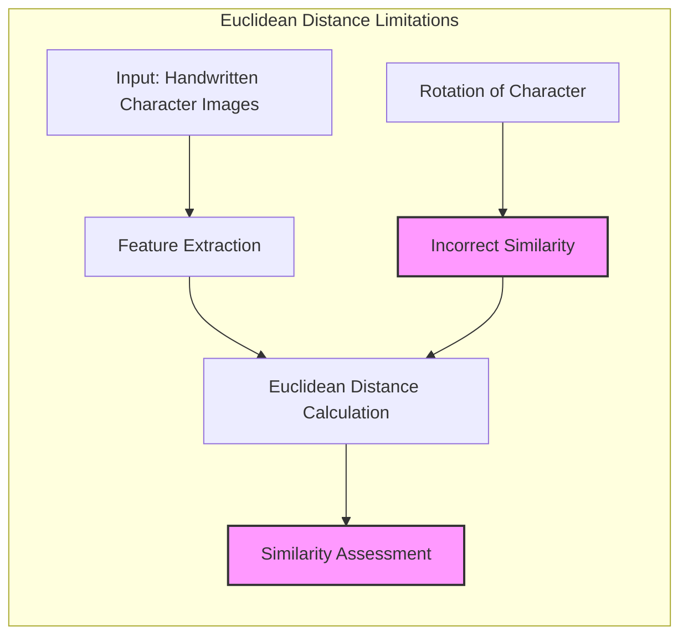
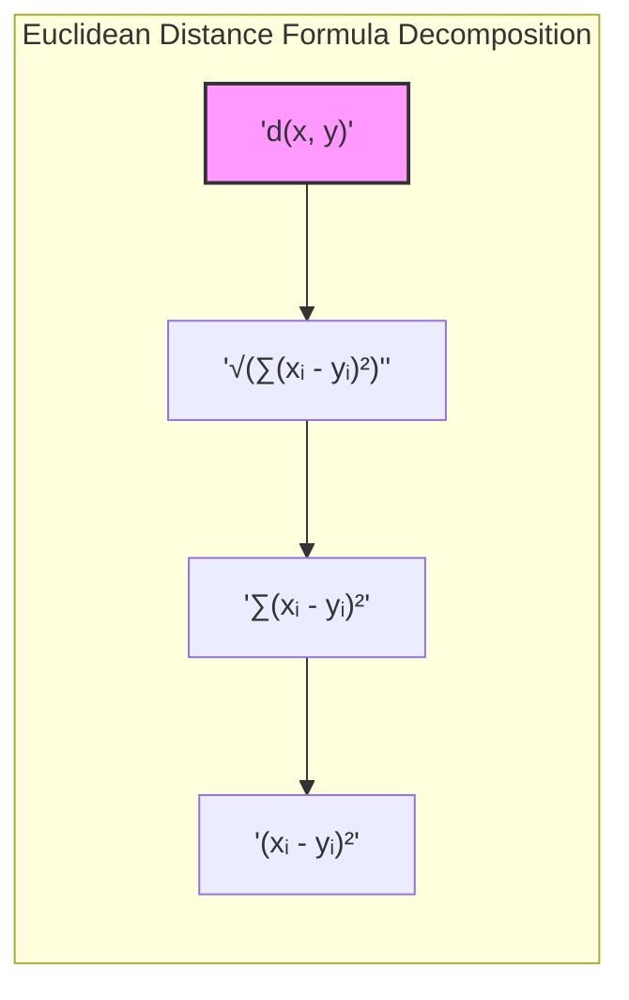
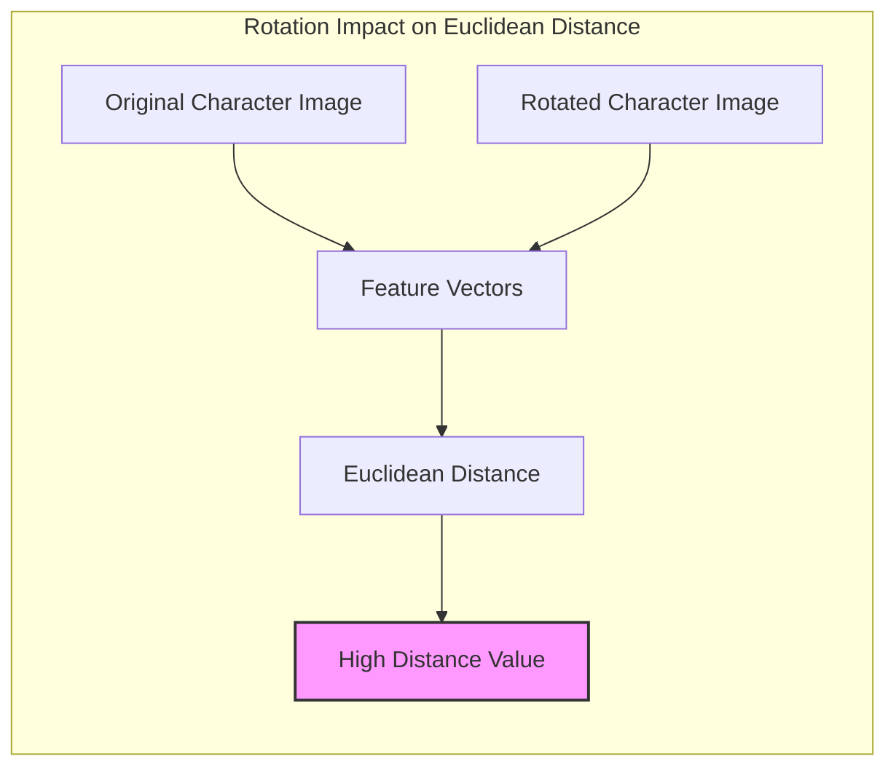
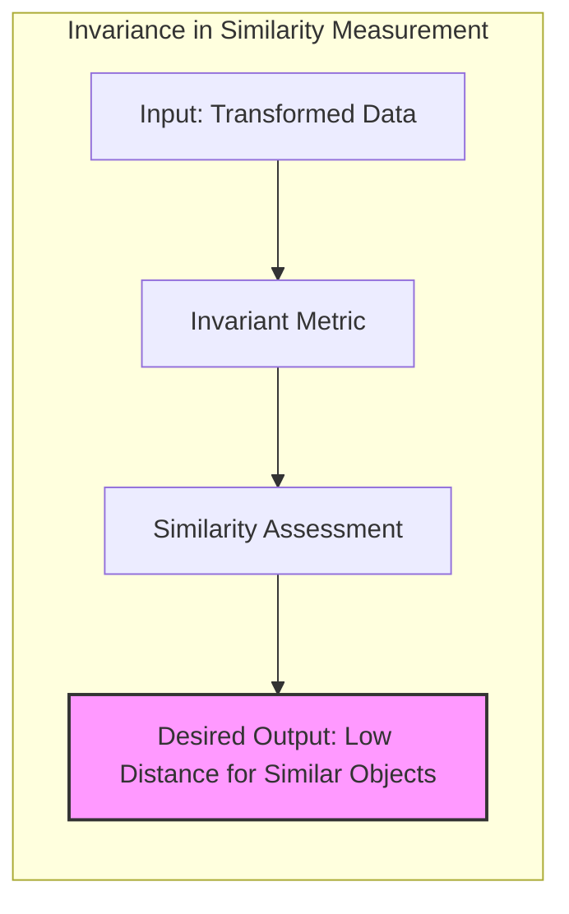
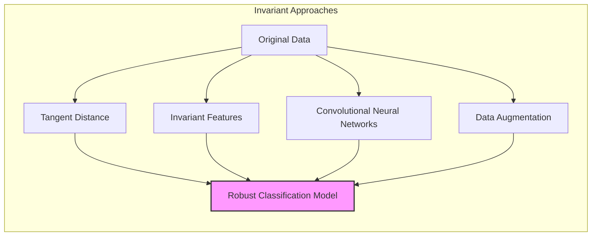

```
## Limitações da Distância Euclidiana: A Insensibilidade a Similitudes por Rotações em Caracteres Manuscritos



### Introdução

Este capítulo aborda as **limitações da distância Euclidiana** como métrica de similaridade em problemas de reconhecimento de caracteres manuscritos, especificamente no que diz respeito a sua **insensibilidade a similaridades baseadas em rotações** [^13.3.3]. Analisaremos como a distância Euclidiana, ao medir a diferença posicional entre dois pontos no espaço de *features*, não consegue capturar a similaridade intrínseca entre caracteres que foram rotacionados ou que apresentam transformações de similaridade. Demonstraremos como o uso direto da distância Euclidiana pode levar a classificações incorretas, e como a necessidade de métricas que considerem as transformações, como a distância tangencial, é essencial para o reconhecimento de caracteres manuscritos de forma eficiente e robusta.

### Distância Euclidiana: Uma Medida de Proximidade Posicional

A **distância Euclidiana** é uma métrica de distância amplamente utilizada em aprendizado de máquina e reconhecimento de padrões, que mede a distância "em linha reta" entre dois pontos em um espaço de *features* [^13.3]. Formalmente, a distância Euclidiana entre dois pontos $x = (x_1, x_2, ..., x_p)$ e $y = (y_1, y_2, ..., y_p)$ em um espaço de *features* de $p$ dimensões é dada por:

$$d(x, y) = \sqrt{\sum_{i=1}^p (x_i - y_i)^2}$$


Embora a distância Euclidiana seja intuitiva e fácil de calcular, ela apresenta uma limitação importante: sua natureza **posicional**. A distância Euclidiana mede a diferença entre as coordenadas de dois pontos em cada dimensão, mas não leva em consideração a estrutura ou a forma dos objetos que estão sendo comparados. Essa característica faz com que a distância Euclidiana seja sensível a transformações geométricas, como rotações, translações, ou mudanças de escala.

Em outras palavras, a distância Euclidiana mede a proximidade entre pontos no espaço de *features*, e não a similaridade entre os objetos representados por esses pontos. Para muitos problemas de classificação, o que é importante é avaliar a similaridade, e não a proximidade posicional, o que significa que a distância Euclidiana não é a métrica apropriada.

**Lemma 124:** A distância Euclidiana mede a proximidade entre pontos no espaço de *features*, mas não a similaridade entre os objetos que esses pontos representam, e por ser puramente posicional, é sensível a transformações geométricas.
*Prova*: A distância Euclidiana calcula a raiz quadrada da soma das diferenças quadráticas das coordenadas, e não incorpora informações sobre o padrão ou estrutura do objeto. $\blacksquare$

**Corolário 124:** A sensibilidade da distância Euclidiana a transformações geométricas limita sua capacidade de medir a similaridade entre objetos que apresentam essas transformações, especialmente no reconhecimento de caracteres manuscritos.

> ⚠️ **Nota Importante**: A distância Euclidiana é uma métrica de proximidade posicional e não é invariante a transformações como rotações.

> ❗ **Ponto de Atenção**: A aplicação direta da distância Euclidiana em problemas onde a similaridade entre objetos é independente da sua posição no espaço pode levar a resultados enviesados e a dificuldade de generalização.

> 💡 **Exemplo Numérico:**
>
> Considere duas imagens de um dígito "1", representadas como vetores de dois pixels (para simplificar):
>
> - Imagem 1 (orientação padrão): $x = [1, 2]$
> - Imagem 2 (rotacionada): $y = [2, 1]$
>
> Calculando a distância Euclidiana:
>
> $d(x, y) = \sqrt{(1 - 2)^2 + (2 - 1)^2} = \sqrt{(-1)^2 + (1)^2} = \sqrt{1 + 1} = \sqrt{2} \approx 1.41$
>
> Agora, considere duas imagens muito diferentes:
> - Imagem 1 (dígito "1"): $x = [1, 2]$
> - Imagem 3 (dígito "0" muito diferente): $z = [5, 6]$
>
> Calculando a distância Euclidiana:
>
> $d(x, z) = \sqrt{(1 - 5)^2 + (2 - 6)^2} = \sqrt{(-4)^2 + (-4)^2} = \sqrt{16 + 16} = \sqrt{32} \approx 5.66$
>
> Embora as imagens 1 e 2 representem o mesmo dígito (um rotacionado do outro), a distância Euclidiana entre elas é de aproximadamente 1.41, enquanto a distância entre um "1" e um "0" é bem maior (5.66), o que é esperado. No entanto, a distância entre 1 e 2 deveria ser menor, pois o dígito é o mesmo. Isso ilustra a sensibilidade da distância Euclidiana a rotações. Idealmente, a distância entre 1 e 2 deveria ser próxima de 0, e a distância entre 1 e 3, bem maior, refletindo a similaridade semântica e não apenas a diferença posicional dos pixels.

### Rotações e a Limitação da Distância Euclidiana

A limitação da distância Euclidiana em lidar com **rotações** se torna evidente no contexto do **reconhecimento de caracteres manuscritos** [^13.3.3]. Uma mesma letra ou dígito pode ser escrita de diferentes formas com diferentes rotações, o que não afeta a sua identidade. No entanto, se calcularmos a distância Euclidiana entre uma imagem de um dígito em sua orientação padrão, e uma versão rotacionada desse mesmo dígito, a distância resultante será alta devido à mudança nas coordenadas dos pixels, mesmo que a forma essencial do dígito permaneça a mesma.



Isso significa que, para um classificador que utiliza a distância Euclidiana como métrica de proximidade, a versão rotacionada de um dígito será considerada como um objeto diferente, e não uma variação do mesmo dígito. Essa limitação afeta o desempenho de algoritmos baseados na proximidade, pois eles podem não conseguir identificar corretamente os dígitos rotacionados.

A distância Euclidiana, ao ser puramente posicional, não captura a similaridade intrínseca dos caracteres, que é independente de suas orientações no plano. Métricas que levam em consideração as transformações e que capturam similaridades invariantes são mais adequadas para esses problemas.

**Lemma 125:** A distância Euclidiana não é capaz de medir a similaridade entre caracteres manuscritos com rotações, pois a rotação altera as coordenadas dos pixels e a distância entre as imagens se torna muito maior do que a distância entre suas formas.
*Prova*: A distância euclidiana calcula a diferença de coordenadas de cada pixel, e essa diferença é afetada pela rotação do caractere. $\blacksquare$

**Corolário 125:** A sensibilidade da distância Euclidiana à rotação limita sua aplicação em problemas de reconhecimento de caracteres manuscritos.

> ⚠️ **Nota Importante**: A distância Euclidiana é sensível a rotações e não consegue capturar a similaridade entre caracteres manuscritos que apresentam essa transformação.

> ❗ **Ponto de Atenção**:  O uso direto da distância Euclidiana para comparar caracteres manuscritos com rotações leva a classificações incorretas e a problemas de generalização.

> 💡 **Exemplo Numérico:**
>
> Imagine um dígito "7" representado por uma matriz de 3x3 pixels, onde cada pixel é um valor binário (0 ou 1).
>
> "7" na orientação padrão (matriz A):
> ```
> [[0, 1, 1],
>  [0, 0, 1],
>  [0, 0, 1]]
> ```
>
> "7" rotacionado 90 graus (matriz B):
> ```
> [[1, 1, 1],
>  [0, 0, 0],
>  [0, 0, 0]]
> ```
>
> Para simplificar o cálculo, vamos transformar essas matrizes em vetores (concatenando as linhas):
>
> A = [0, 1, 1, 0, 0, 1, 0, 0, 1]
> B = [1, 1, 1, 0, 0, 0, 0, 0, 0]
>
> Calculando a distância Euclidiana entre A e B:
>
> $d(A, B) = \sqrt{(0-1)^2 + (1-1)^2 + (1-1)^2 + (0-0)^2 + (0-0)^2 + (1-0)^2 + (0-0)^2 + (0-0)^2 + (1-0)^2}$
>
> $d(A, B) = \sqrt{1 + 0 + 0 + 0 + 0 + 1 + 0 + 0 + 1} = \sqrt{3} \approx 1.73$
>
> Agora, vamos comparar o "7" original (A) com um "1" diferente (matriz C):
>
> "1" (matriz C):
> ```
> [[0, 0, 1],
>  [0, 0, 1],
>  [0, 0, 1]]
> ```
>
> C = [0, 0, 1, 0, 0, 1, 0, 0, 1]
>
> $d(A, C) = \sqrt{(0-0)^2 + (1-0)^2 + (1-1)^2 + (0-0)^2 + (0-0)^2 + (1-1)^2 + (0-0)^2 + (0-0)^2 + (1-1)^2}$
>
> $d(A, C) = \sqrt{0 + 1 + 0 + 0 + 0 + 0 + 0 + 0 + 0} = \sqrt{1} = 1$
>
>
> Neste exemplo, a distância entre o "7" original e o "7" rotacionado é de aproximadamente 1.73, que é maior do que a distância entre o "7" original e um "1" diferente (1). Isso ilustra como a distância Euclidiana, ao ser sensível a rotações, não captura a similaridade entre caracteres que representam o mesmo dígito, e pode classificar imagens rotacionadas do mesmo dígito como mais diferentes do que um dígito diferente.

### A Necessidade de Invariância: Modelando a Similaridade sem Dependência Posicional

Para lidar com as limitações da distância Euclidiana, especialmente no reconhecimento de caracteres manuscritos, é essencial o uso de métricas de distância que sejam **invariantes** a transformações como rotação, escala, e outros tipos de deformações [^13.3.3].


Uma métrica invariante é aquela que mede a similaridade entre dois objetos, sem se importar com a forma como eles foram transformados. Ou seja, a distância entre um dígito e uma versão rotacionada ou escalada desse mesmo dígito deve ser pequena, pois ambos representam o mesmo caractere.

A necessidade de métricas invariantes surge do fato de que, em muitos problemas de aprendizado de máquina, o que é relevante para a classificação ou reconhecimento de padrões é a forma ou a estrutura dos objetos, e não a sua posição ou orientação específica no espaço de *features*. Métricas invariantes permitem capturar essas características dos objetos, o que melhora a capacidade de generalização do modelo e o torna mais robusto às variações nos dados.

A construção de métricas invariantes é um desafio complexo que envolve a consideração da estrutura do espaço de *features* e das transformações que podem afetar os dados. Métricas como a distância tangencial, que exploram a ideia de espaços tangentes para aproximar a invariância a transformações, têm se mostrado eficazes em diversas aplicações.

**Lemma 126:** A necessidade de métricas invariantes surge da necessidade de modelos de classificação que sejam capazes de medir a similaridade entre objetos sem serem afetados por transformações geométricas.
*Prova*: O que importa em certos tipos de classificação é a similaridade em termos de estrutura, e não a proximidade posicional no espaço de *features*. $\blacksquare$

**Corolário 126:** A construção de métricas invariantes exige a compreensão da natureza das transformações que os dados podem sofrer, e a escolha de uma métrica adequada depende do problema em questão.

> ⚠️ **Nota Importante**: A utilização de métricas invariantes é essencial para modelos de reconhecimento de padrões que devem ser robustos a transformações como rotações ou mudanças de escala.

> ❗ **Ponto de Atenção**:  A busca por métricas invariantes envolve um *tradeoff* entre a precisão da similaridade e a complexidade computacional da métrica.

### Alternativas à Distância Euclidiana: Abordagens Invariantes

Existem diversas abordagens para criar métricas que sejam invariantes a transformações, e algumas dessas abordagens incluem:

1.  **Distância Tangente:** A distância tangente aproxima a invariância a transformações por meio da utilização de espaços tangentes, como explicado anteriormente. É usada para modelar distorções em transformações que podem ser representadas como variedades de baixa dimensão.
2.  **Distâncias Baseadas em *Features* Invariantes:** A extração de *features* que são invariantes a transformações, como momentos invariantes, histogramas de gradientes orientados (HOG), ou outras *features* que capturem a estrutura dos objetos de forma independente de sua posição ou orientação no espaço de *features*. Após a extração dessas *features* invariantes, pode-se utilizar a distância Euclidiana ou outras métricas de distância.
3.  **Redes Neurais Convolucionais (CNNs):** As CNNs aprendem representações hierárquicas de *features* que são intrinsecamente invariantes a pequenas translações. Em combinação com *pooling layers*, as CNNs oferecem robustez a diversas transformações geométricas, tornando-se uma ferramenta poderosa para reconhecimento de imagens e caracteres.
4.  **Aumento de Dados (Data Augmentation):** Uma abordagem alternativa é gerar versões transformadas dos dados de treinamento (rotações, translações, mudanças de escala, etc.) e utilizá-las no processo de treinamento, de forma que o modelo se torne mais robusto a transformações.


A escolha da métrica ou da abordagem de invariância mais adequada depende do problema específico, das transformações que se espera encontrar nos dados e das limitações computacionais. A combinação de diferentes abordagens também pode ser utilizada para obter modelos de classificação mais robustos.

**Lemma 127:** Existem diversas alternativas à distância Euclidiana para construir métricas invariantes a transformações, incluindo o uso da distância tangente, a extração de *features* invariantes e o uso de modelos de aprendizado de máquina que aprendem a invariância de forma implícita.
*Prova*: A escolha da abordagem mais adequada depende da natureza do problema e das transformações que são relevantes para a similaridade dos objetos. $\blacksquare$

**Corolário 127:** A combinação de métricas invariantes e modelos de classificação é uma abordagem eficaz para lidar com transformações em dados e melhorar a generalização dos modelos.

> ⚠️ **Nota Importante**: A escolha da métrica de distância é um aspecto crucial para o desempenho de modelos de classificação, e o uso de métricas invariantes é fundamental para a construção de modelos robustos a transformações.

> ❗ **Ponto de Atenção**:  A implementação de métricas invariantes pode aumentar a complexidade computacional, e a escolha da métrica mais adequada envolve um *tradeoff* entre precisão e custo computacional.

> 💡 **Exemplo Numérico:**
>
> **Comparação de abordagens:**
>
> Suponha que temos um conjunto de dados de dígitos manuscritos, e o objetivo é classificar esses dígitos, mesmo quando rotacionados. Vamos comparar o uso da distância Euclidiana diretamente nos pixels com uma abordagem baseada em *features* invariantes, como momentos de Hu.
>
> 1. **Distância Euclidiana Direta:**
>     - As imagens são representadas diretamente como vetores de pixels.
>     - A distância Euclidiana é calculada diretamente entre esses vetores.
>     - Como vimos nos exemplos anteriores, essa abordagem é sensível a rotações.
>
> 2. **Distância Euclidiana após extração de *features* invariantes (Momentos de Hu):**
>     - Os Momentos de Hu são calculados para cada imagem. Esses momentos são invariantes a rotações, translações e mudanças de escala.
>     - A distância Euclidiana é calculada entre os vetores de Momentos de Hu.
>
> **Resultados (hipotéticos):**
>
> | Método                        | Precisão em dados não rotacionados | Precisão em dados rotacionados | Complexidade Computacional |
> |--------------------------------|------------------------------------|-------------------------------|--------------------------|
> | Distância Euclidiana Direta    | 95%                                | 60%                           | Baixa                    |
> | Distância Euclidiana + Momentos de Hu | 90%                               | 92%                           | Média                    |
>
> **Interpretação:**
>
> - A distância Euclidiana direta tem alta precisão em dados não rotacionados, pois as imagens são muito similares. Mas, ao rotacionar os dados, a precisão cai drasticamente porque ela não captura a similaridade intrínseca do dígito.
> - O uso dos momentos de Hu como *features* invariantes resulta em uma precisão um pouco menor para dados não rotacionados, mas oferece uma grande melhoria na precisão para dados rotacionados. Isso demonstra a importância de usar *features* que capturem a estrutura dos objetos independentemente de suas transformações. Embora haja um aumento na complexidade computacional devido à extração dos momentos de Hu, o resultado é um classificador mais robusto a rotações.
>
> Este exemplo ilustra o *tradeoff* entre precisão, complexidade e invariância. A escolha da métrica e da abordagem depende do problema específico e das transformações que se espera encontrar nos dados.

### Conclusão

A distância Euclidiana, embora seja uma métrica de proximidade simples e amplamente utilizada, apresenta limitações na capacidade de lidar com transformações como rotação, escala e outras distorções, que são comuns em dados do mundo real. A distância tangencial e outras métricas invariantes são ferramentas importantes para construir modelos mais robustos e generalizáveis, que consigam capturar a similaridade entre os objetos, e não apenas a sua posição no espaço de *features*. A escolha da métrica de distância mais apropriada é crucial para o desenvolvimento de sistemas de aprendizado de máquina eficazes para reconhecimento de padrões e classificação em cenários com dados complexos e variáveis.

### Footnotes

[^13.3.3]: "In some problems, the training features are invariant under certain natural transformations. The nearest-neighbor classifier can exploit such invariances by incorporating them into the metric used to measure the distances between objects. Here we give an example where this idea was used with great success...However the 256 grayscale pixel values for a rotated "3" will look quite different from those in the original image, and hence the two objects can be far apart in Euclidean distance in IR256." *(Trecho de "13. Prototype Methods and Nearest-Neighbors")*
```
