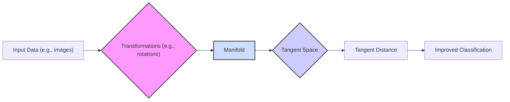
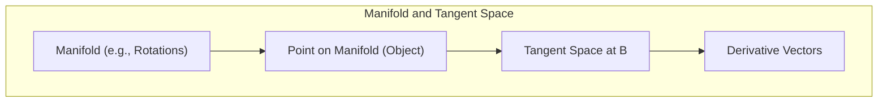
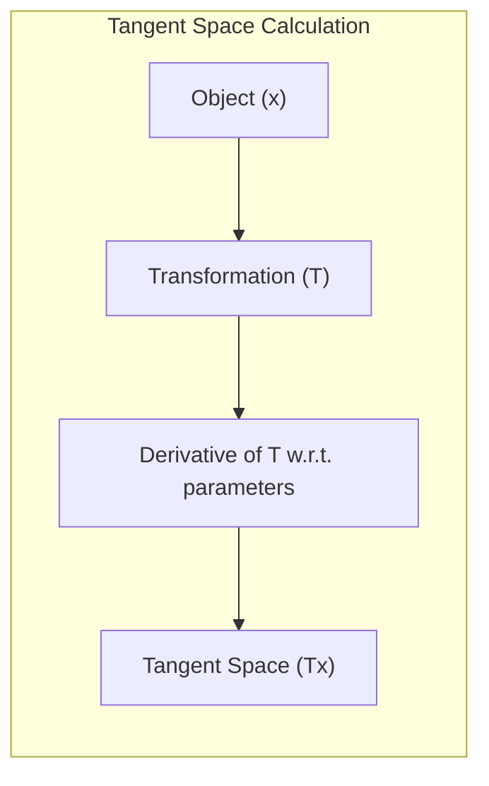
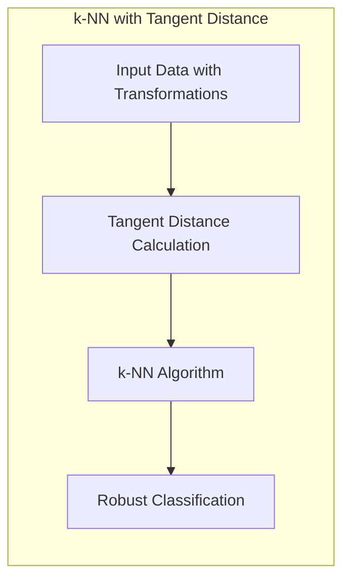

## Distância Tangente: Aproximando a Invariância por meio de Espaços Tangentes e Variedades



### Introdução

Este capítulo explora a **distância tangente**, uma abordagem sofisticada para aproximar a **invariância** a transformações em problemas de reconhecimento de padrões e classificação, especialmente útil em cenários onde os dados podem apresentar rotações, deformações, mudanças de escala e outras transformações [^13.3.3]. A ideia central da distância tangente é modelar a variação dos dados devido a essas transformações através da utilização de **espaços tangentes** e **variedades**, e como essa abordagem permite que modelos de classificação, como o k-NN, capturem melhor a similaridade entre objetos que são variações uns dos outros. Analisaremos como a distância tangente é definida, calculada e aplicada em problemas de reconhecimento de caracteres manuscritos, demonstrando sua capacidade de lidar com transformações complexas e como ela se difere da distância Euclidiana e outras métricas mais simples.

### Espaços Tangentes e Variedades: Modelando a Variação dos Dados

A construção da **distância tangente** se baseia na modelagem das transformações que os dados podem sofrer utilizando conceitos da geometria diferencial, como **espaços tangentes** e **variedades** [^13.3.3].

1.  **Variedades (Manifolds):** Uma variedade é uma superfície, curva ou região no espaço de *features* que representa um conjunto de objetos que são transformações uns dos outros. Por exemplo, as rotações de um dígito manuscrito podem ser representadas como uma curva no espaço de *features*, onde cada ponto da curva corresponde a uma rotação diferente do dígito. Essa curva é chamada de *manifold* de rotação. As transformações de um dado ponto são assumidas como sendo uma variedade de baixa dimensionalidade no espaço de *features* de alta dimensionalidade.

> 💡 **Exemplo Numérico:**
> Imagine um dígito "3" representado por um vetor de 256 pixels (uma imagem de 16x16 em tons de cinza). Se rotacionarmos este dígito em incrementos de 1 grau, cada rotação gera uma nova imagem, e cada imagem é um ponto no espaço de 256 dimensões. O conjunto dessas imagens rotacionadas forma uma curva (uma variedade) nesse espaço. Essa variedade captura as variações do dígito "3" devido à rotação.

2.  **Espaços Tangentes:** Para cada ponto (objeto) no espaço de *features*, é definido um espaço tangente que aproxima o *manifold* de transformações na vizinhança daquele ponto. O espaço tangente é um subespaço linear que captura as direções nas quais a imagem se modifica com pequenas transformações (ex: vetores das derivadas). As linhas tangentes representam as possíveis variações do objeto no espaço de *features* por efeito de pequenas transformações.



> 💡 **Exemplo Numérico:**
> Para o dígito "3" do exemplo anterior, se pegarmos a imagem original e calcularmos a derivada (a taxa de variação) dos pixels quando o dígito é ligeiramente rotacionado, obteremos um vetor que aponta na direção em que a imagem muda devido à rotação. Esse vetor, e outros vetores calculados para outras transformações, formam a base do espaço tangente naquele ponto (imagem do dígito). Este espaço tangente aproxima a variedade da rotação localmente.

A definição de espaços tangentes e variedades permite que a distância tangencial capture a similaridade entre objetos que são transformações uns dos outros, e esses espaços tangentes são definidos por meio das derivadas, no ponto, de cada transformação.

**Lemma 128:** Espaços tangentes são aproximações lineares de variedades, que representam a variação dos dados por meio de transformações específicas na vizinhança do ponto, e que servem de base para a construção da distância tangencial.
*Prova*: Os espaços tangentes aproximam o *manifold* de transformações por um subespaço linear que captura as direções de variação das transformações. $\blacksquare$

**Corolário 128:** A distância tangencial entre dois objetos é baseada na distância entre os seus espaços tangentes, o que a torna invariante a pequenas transformações.

> ⚠️ **Nota Importante**: A distância tangencial utiliza espaços tangentes e variedades para modelar as transformações que os objetos podem sofrer, e como esses espaços representam a similaridade entre objetos transformados.

> ❗ **Ponto de Atenção**:  A construção do *manifold* e do espaço tangente envolve a definição das transformações e a derivação das suas derivadas, o que pode ser computacionalmente custoso.

### Construção da Distância Tangente: Projeção e Cálculo da Proximidade

A **construção da distância tangente** envolve os seguintes passos:

1.  **Definição das Transformações:** Definir as transformações que podem afetar os dados e que devem ser consideradas invariantes. No caso de dígitos manuscritos, essas transformações podem incluir rotações, translações, mudanças de escala, cisalhamento (shearing) e variações na espessura.
2.  **Cálculo do Espaço Tangente:** Para cada objeto (imagem) e cada transformação, calcular as derivadas da imagem com relação ao parâmetro da transformação, no ponto de operação. Essas derivadas correspondem ao espaço tangente à variedade da transformação. Por exemplo, para a rotação de um dígito, calcula-se a derivada da imagem em relação ao ângulo de rotação.



> 💡 **Exemplo Numérico:**
> Suponha que a imagem de um dígito "3" seja representada por um vetor $x \in \mathbb{R}^{256}$. Se a transformação de rotação for dada por $R(\theta)$, onde $\theta$ é o ângulo de rotação, a derivada da imagem em relação a $\theta$ (em $\theta=0$) é dada por $\frac{\partial R(\theta)x}{\partial \theta}|_{\theta=0}$. Este vetor de derivadas é um dos vetores que formam a base do espaço tangente. Se tivermos outras transformações (translação, escala), calculamos derivadas para elas também.

3.  **Projeção nos Espaços Tangentes:** Dado dois objetos a serem comparados, cada um é projetado no espaço tangente do outro.
4.  **Cálculo da Distância:** A distância entre os objetos é definida como a distância Euclidiana entre os objetos projetados nos espaços tangentes. Essa distância é calculada como a menor distância entre dois pontos, um em cada espaço tangente. Essa projeção busca o ponto no espaço tangente de um objeto que é mais similar ao outro objeto.

Em geral, a distância tangente é calculada como:

$$d_{tangente}(x,y) = \min_{\alpha, \beta} || x + T_x \alpha - (y+T_y \beta) ||$$

Onde $x$ e $y$ são dois objetos, $T_x$ e $T_y$ são as bases dos espaços tangentes de $x$ e $y$ respectivamente, e $\alpha$ e $\beta$ são coeficientes de combinação linear que minimizam a distância no espaço de *features*.

```mermaid
graph LR
    subgraph "Tangent Distance Calculation"
    direction TB
        A["Object x"]
        B["Tangent Space Tx"]
        C["Object y"]
        D["Tangent Space Ty"]
        E["Projection of x onto Ty (x + Tx * alpha)"]
        F["Projection of y onto Tx (y + Ty * beta)"]
        G["Distance between E and F: "|| x + T_x*alpha - (y + T_y*beta) ||" "]
        A --> B
        C --> D
        A & B --> E
        C & D --> F
        E & F --> G
    end
```

> 💡 **Exemplo Numérico:**
> Seja $x$ o vetor de pixels de uma imagem do dígito "3" e $y$ o vetor de pixels de outra imagem do dígito "3" ligeiramente rotacionada. Sejam $T_x$ e $T_y$ as matrizes que representam os espaços tangentes de $x$ e $y$, respectivamente. Digamos que $T_x$ e $T_y$ sejam matrizes de 256x2, com as colunas representando as derivadas em relação à rotação e translação. Para encontrar a distância tangente, precisamos encontrar os coeficientes $\alpha = [\alpha_1, \alpha_2]^T$ e $\beta = [\beta_1, \beta_2]^T$ que minimizam a distância.
>
> Suponha que $x$ seja o vetor $[0.1, 0.2, \ldots, 0.9]$ (256 componentes), $y$ seja $[0.2, 0.1, \ldots, 0.8]$, $T_x$ seja uma matriz com as derivadas [deriv\_rot\_x, deriv\_trans\_x], e $T_y$ seja [deriv\_rot\_y, deriv\_trans\_y].
>
>  Calculamos $x + T_x \alpha$ e $y + T_y \beta$ para diferentes valores de $\alpha$ e $\beta$ e encontramos os valores que minimizam $|| x + T_x \alpha - (y+T_y \beta) ||$.
>
> Se encontrarmos, por exemplo, $\alpha = [0.01, -0.02]$ e $\beta = [0.03, 0.01]$, então a distância tangente será $|| x + T_x [0.01, -0.02]^T - (y+T_y [0.03, 0.01]^T) ||$.
>
> Esta distância será menor do que a distância euclidiana direta entre $x$ e $y$ se as transformações modeladas por $T_x$ e $T_y$ forem relevantes.

A aproximação por espaços tangentes captura a informação da similaridade local e garante a invariância a transformações, que é capturada pela projeção no espaço tangente.

**Lemma 129:** A distância tangente é definida como a menor distância entre um objeto e o espaço tangente de outro, o que a torna invariante a pequenas transformações modeladas por tais espaços tangentes.
*Prova*: A projeção de um objeto no espaço tangente de outro faz com que seja utilizada a mínima distância entre as transformações do objeto projetado, que por definição é invariante. $\blacksquare$

**Corolário 129:** O cálculo da distância tangente envolve a estimação de derivadas e a projeção dos objetos em espaços tangentes, o que aumenta a complexidade computacional da métrica.

> ⚠️ **Nota Importante**: A distância tangente é construída por meio da projeção dos objetos em seus espaços tangentes, que capturam as variações devido a transformações.

> ❗ **Ponto de Atenção**:  A definição e cálculo dos espaços tangentes é um passo complexo da aplicação de distância tangente.

### Distância Tangente e k-NN: Melhorando a Robustez a Transformações

A aplicação da **distância tangente** em conjunto com o algoritmo **k-vizinhos mais próximos (k-NN)** permite melhorar a capacidade de generalização do modelo e torná-lo mais robusto a transformações como rotações, escalas e outras variações [^13.3.3]. Ao utilizar a distância tangente, o k-NN passa a selecionar os vizinhos mais próximos com base na similaridade entre as formas dos objetos, e não na sua representação posicional no espaço de *features*.



Com essa abordagem, o k-NN passa a ser capaz de classificar caracteres manuscritos mesmo que eles apresentem pequenas variações devido às transformações, o que melhora o desempenho do modelo em relação ao uso da distância Euclidiana. A distância tangente permite que o k-NN identifique vizinhos que são realmente similares, mesmo que eles tenham sido transformados de formas que a distância euclidiana não consegue identificar.

> 💡 **Exemplo Numérico:**
> Imagine que temos um conjunto de dados de dígitos manuscritos, alguns dos quais estão ligeiramente rotacionados. Se usarmos a distância euclidiana no k-NN, um "3" rotacionado pode ser considerado mais distante de um "3" não rotacionado do que de um "8" não rotacionado, pois os pixels terão valores muito diferentes. No entanto, se usarmos a distância tangente, o "3" rotacionado será considerado muito próximo do "3" não rotacionado, pois a distância tangente leva em conta a transformação de rotação. Isso torna o k-NN mais robusto a variações nos dados.

A combinação da flexibilidade do k-NN com o poder de métricas invariantes, como a distância tangente, resulta em modelos de reconhecimento de padrões mais robustos e capazes de lidar com as variações que surgem em dados do mundo real.

**Lemma 130:** O uso da distância tangente no k-NN melhora a capacidade de generalização do modelo e o torna mais robusto a transformações, pois a similaridade é avaliada considerando as transformações que os objetos podem sofrer.
*Prova*: O uso de distâncias tangentes permite o reconhecimento de objetos mesmo com transformações, pois o que importa é a similaridade estrutural e não a similaridade posicional. $\blacksquare$

**Corolário 130:** A combinação de k-NN e distância tangente oferece um *tradeoff* entre complexidade e robustez, que pode ser vantajosa em problemas de reconhecimento de padrões com muitas transformações nos dados.

> ⚠️ **Nota Importante**: O uso da distância tangente no k-NN permite que o modelo se adapte a transformações que afetam os dados, o que melhora sua capacidade de generalização e sua robustez a ruídos.

> ❗ **Ponto de Atenção**:  O cálculo da distância tangente pode ser computacionalmente custoso e sua implementação envolve a definição das transformações e o cálculo das derivadas, o que requer cuidado em sua aplicação.

### Conclusão

A distância tangente é uma abordagem poderosa para aproximar a invariância a transformações como rotação, escala e outras distorções, e essa abordagem utiliza conceitos de espaços tangentes e variedades para modelar as transformações, permitindo que o k-NN capture a similaridade entre objetos de forma mais eficaz do que a distância Euclidiana. A utilização da distância tangente no k-NN resulta em modelos de reconhecimento de padrões mais robustos e com melhor capacidade de generalização, que são capazes de lidar com as variações que ocorrem naturalmente nos dados do mundo real. A escolha entre distância Euclidiana, distância tangente e outras métricas de distância deve ser feita com base na natureza do problema e na necessidade de lidar com transformações específicas.

### Footnotes

[^13.3.3]: "In some problems, the training features are invariant under certain natural transformations. The nearest-neighbor classifier can exploit such invariances by incorporating them into the metric used to measure the distances between objects...Hence we want our nearest-neighbor classifier to consider these two "3"s to be close together (similar). However the 256 grayscale pixel values for a rotated "3" will look quite different from those in the original image, and hence the two objects can be far apart in Euclidean distance in IR256...We wish to remove the effect of rotation in measuring distances between two digits of the same class. Consider the set of pixel values consisting of the original "3" and its rotated versions. This is a one-dimensional curve in IR256..." *(Trecho de "13. Prototype Methods and Nearest-Neighbors")*
