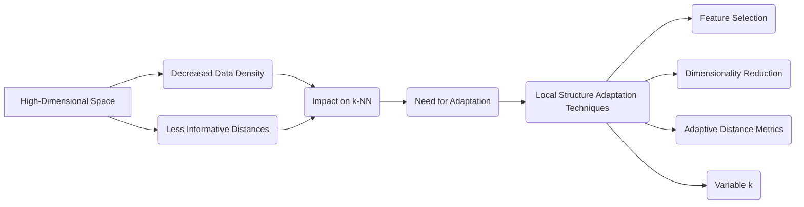
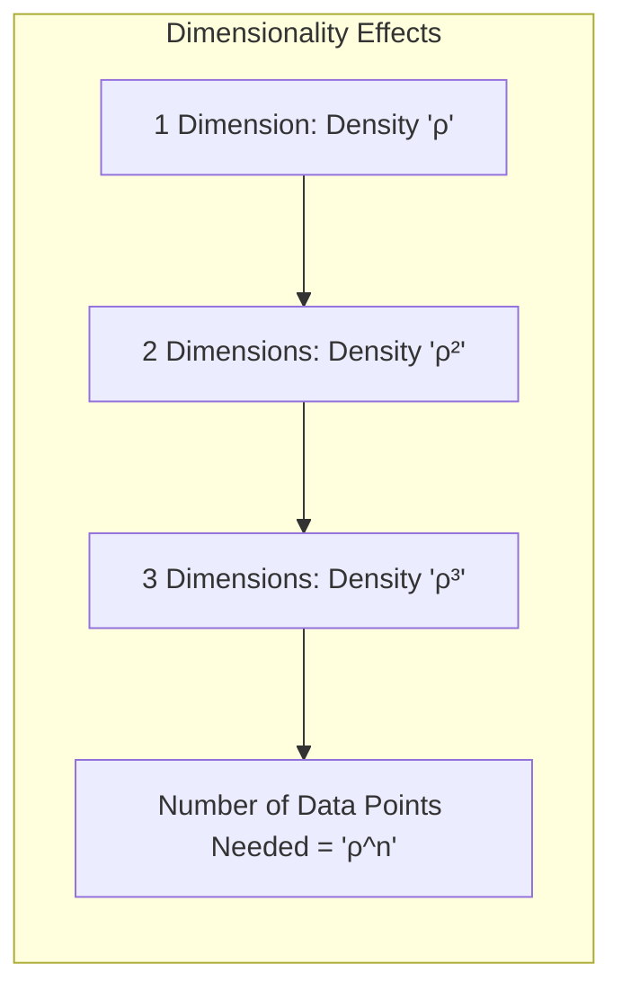
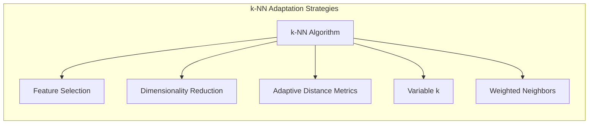
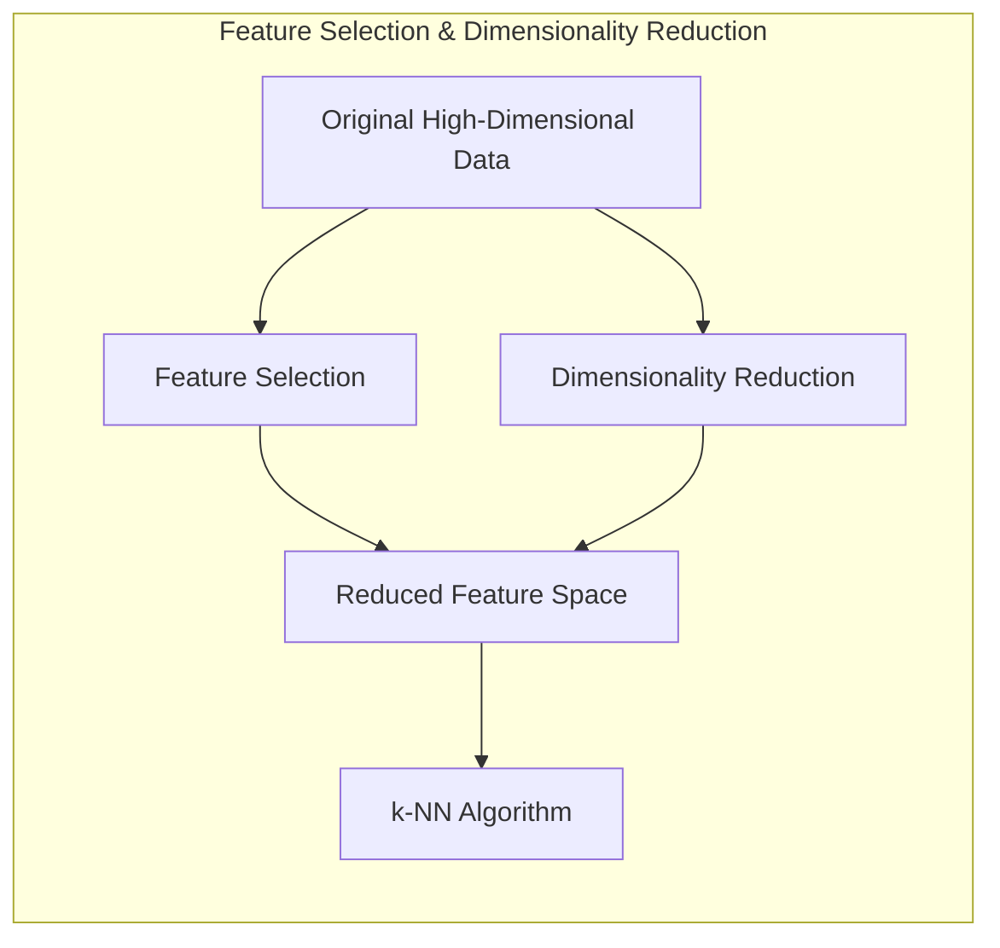
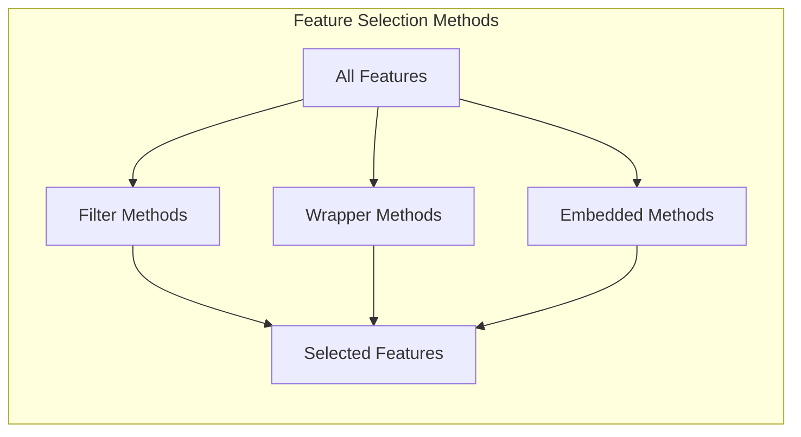
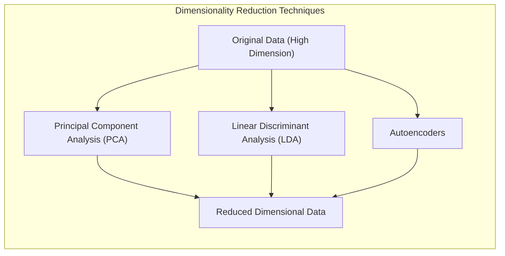
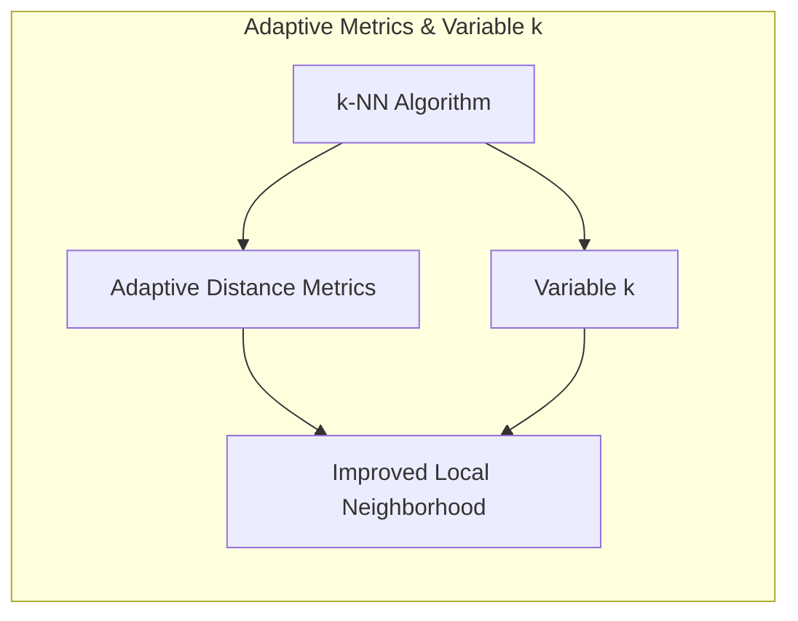
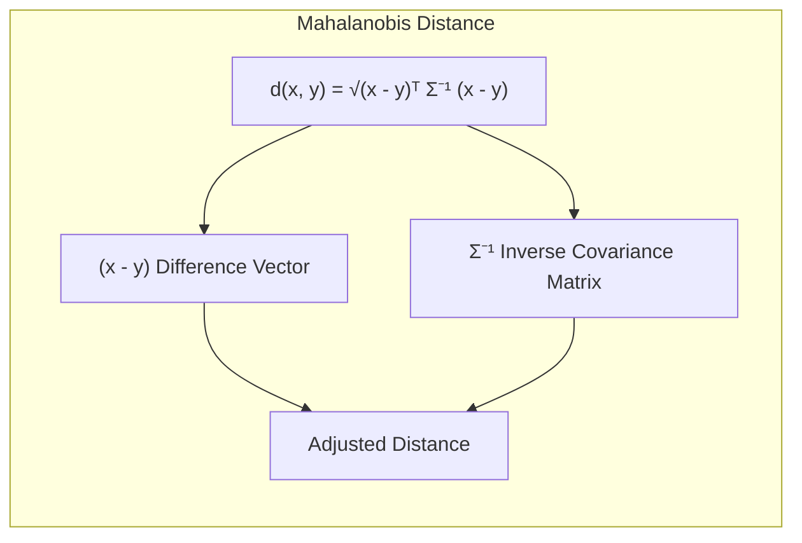
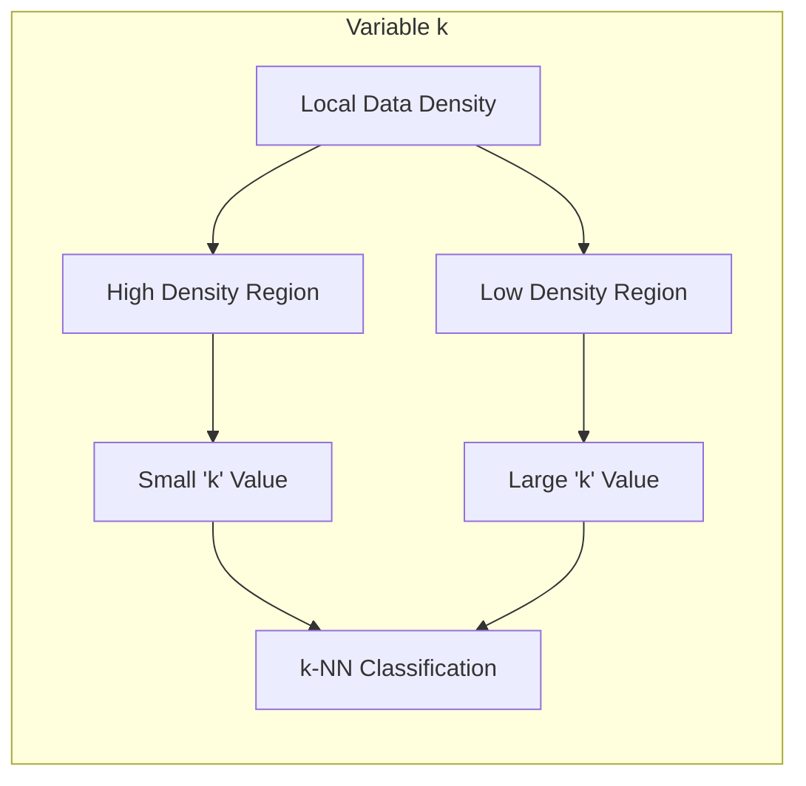

## O Problema da Alta Dimensionalidade: A Maldição da Dimensionalidade e a Adaptação do k-NN à Estrutura Local dos Dados



### Introdução

Este capítulo explora o problema da **alta dimensionalidade** em aprendizado de máquina, com foco na **maldição da dimensionalidade** e suas implicações para o método de **k-vizinhos mais próximos (k-NN)** [^13.4]. Em espaços de *features* de alta dimensão, a densidade dos dados diminui e a distância entre os pontos se torna menos informativa, o que afeta o desempenho do k-NN e outros algoritmos que dependem de métricas de distância. Analisaremos como a **adaptação do k-NN à estrutura local dos dados** pode mitigar esses problemas, utilizando técnicas como seleção de *features*, redução de dimensionalidade, métricas de distância adaptativas e o uso de k variável, e como essas adaptações podem melhorar a capacidade de generalização do modelo em cenários com dados de alta dimensão.

### A Maldição da Dimensionalidade: Um Desafio em Espaços de Alta Dimensão

A **maldição da dimensionalidade** é um fenômeno que ocorre em espaços de *features* com alta dimensão, onde a densidade dos dados diminui exponencialmente com o aumento da dimensão [^13.4]. À medida que o número de *features* (dimensões) aumenta, o volume do espaço de *features* também aumenta, e a distância entre os pontos se torna mais uniforme, ou seja, as distâncias entre os pontos se tornam maiores, mas a diferença entre elas diminui, o que diminui a capacidade do algoritmo k-NN de selecionar os vizinhos mais próximos relevantes e a qualidade do modelo.

> 💡 **Exemplo Numérico:**
>Imagine um conjunto de dados com apenas uma feature, onde os pontos estão distribuídos em um intervalo de 0 a 10. Se tivermos 10 pontos, a densidade é de aproximadamente 1 ponto por unidade de intervalo. Agora, considere adicionar uma segunda feature, também variando de 0 a 10. O espaço agora é um quadrado de 10x10, e se mantivermos os mesmos 10 pontos, eles estarão muito mais esparsos. Para manter a mesma densidade, precisaríamos de 100 pontos (10^2). Se adicionarmos uma terceira dimensão (0 a 10), o espaço se torna um cubo de 10x10x10, e precisaríamos de 1000 pontos (10^3) para ter a mesma densidade original. Isso demonstra o crescimento exponencial da necessidade de dados para manter a densidade em espaços de alta dimensão.
>
>  Em termos de distância, em uma dimensão, a distância média entre pontos pode ser relativamente pequena. Em duas dimensões, a distância média já aumenta, e assim por diante. Além disso, a diferença entre a distância do vizinho mais próximo e o mais distante tende a diminuir, tornando a escolha do vizinho menos informativa.


A maldição da dimensionalidade apresenta os seguintes desafios:

1.  **Densidade de Dados Diminui:** Em espaços de alta dimensão, os dados se tornam cada vez mais esparsos, ou seja, a quantidade de dados por unidade de volume diminui exponencialmente com o aumento da dimensão.
2.  **Distância Perde Informatividade:** A distância entre os pontos se torna menos informativa, pois a distância entre um ponto e seus vizinhos mais próximos tende a aumentar, e a diferença entre as distâncias tende a diminuir com o aumento da dimensionalidade, fazendo com que a escolha dos vizinhos não seja tão relevante.
3.  **Overfitting:** Modelos de aprendizado de máquina, como o k-NN, podem se tornar suscetíveis ao *overfitting* em espaços de alta dimensão, devido à sua capacidade de se adaptar ao ruído nos dados.

A maldição da dimensionalidade é um problema sério em muitas aplicações de aprendizado de máquina, incluindo reconhecimento de imagens, processamento de linguagem natural, e bioinformática, onde o número de *features* pode ser muito grande.

**Lemma 131:** A maldição da dimensionalidade surge do fato de que a densidade de dados diminui exponencialmente com o aumento da dimensão, tornando a distância entre os pontos menos informativa, e levando a modelos com menor capacidade de generalização.
*Prova*: O volume de um espaço de alta dimensão aumenta exponencialmente com o número de dimensões, tornando os dados mais esparsos, e as distâncias menos discriminativas. $\blacksquare$

**Corolário 131:** A maldição da dimensionalidade impõe a necessidade de adaptar métodos de aprendizado de máquina, como o k-NN, para lidar com dados de alta dimensão.

### Adaptação do k-NN à Estrutura Local: Mitigando os Efeitos da Maldição

Para mitigar os efeitos da **maldição da dimensionalidade** no k-NN, existem diversas abordagens que buscam adaptar a classificação à **estrutura local dos dados** [^13.4]. A ideia central é que a escolha dos vizinhos mais próximos seja feita com base em informações relevantes sobre a região do espaço de *features* onde o ponto de consulta se encontra. Algumas das abordagens incluem:



1.  **Seleção de *Features*:** Selecionar um subconjunto de *features* que sejam relevantes para a classificação em uma determinada região do espaço de *features*. A seleção de *features* pode ser feita por métodos de filtro, *wrapper* ou *embedded methods*.
2.  **Redução de Dimensionalidade:** Utilizar técnicas de redução de dimensionalidade, como a análise de componentes principais (PCA) ou outras abordagens lineares e não lineares, para projetar os dados em um subespaço de menor dimensão onde as informações relevantes são preservadas.
3.  **Métricas de Distância Adaptativas:** Criar métricas de distância que se adaptem à estrutura local dos dados, dando maior peso às *features* que são mais importantes para a classificação em cada região do espaço de *features*.
4.  **k Variável:** Utilizar um valor variável de $k$ que se adapta à densidade local dos dados. Em regiões de alta densidade, um menor número de vizinhos pode ser suficiente, enquanto em regiões de baixa densidade, um número maior de vizinhos é utilizado.
5.  **Vizinhos Ponderados:** Atribuir pesos diferentes aos vizinhos mais próximos, dando maior peso aos vizinhos que são mais relevantes para a classificação, com base na distância ou outras medidas.

**Lemma 132:** A adaptação do k-NN à estrutura local dos dados permite mitigar os efeitos da maldição da dimensionalidade, melhorando a capacidade do modelo de selecionar os vizinhos mais próximos que são relevantes para a classificação.
*Prova*: Ao adaptar a vizinhança do k-NN ou a métrica de distância à estrutura local dos dados, a seleção de vizinhos passa a levar em consideração informações mais relevantes para a classificação. $\blacksquare$

**Corolário 132:** A combinação de técnicas de redução de dimensionalidade, seleção de *features* e métricas de distância adaptativas pode resultar em modelos k-NN mais robustos e com melhor capacidade de generalização em problemas de alta dimensão.

### Abordagens de Adaptação: Seleção de *Features* e Redução de Dimensionalidade

A **seleção de *features*** e a **redução de dimensionalidade** são técnicas que buscam reduzir o número de *features* utilizadas pelo k-NN, o que pode mitigar o impacto da maldição da dimensionalidade [^13.4].



1.  **Seleção de *Features*:** A seleção de *features* consiste em identificar e utilizar apenas um subconjunto de *features* que são mais relevantes para a classificação. Existem diferentes métodos de seleção de *features*, incluindo:
    *   **Métodos de Filtro:** Avaliar a relevância das *features* de forma independente do modelo de classificação, utilizando métricas como a correlação ou informação mútua.
    *   **Métodos *Wrapper*:** Selecionar um subconjunto de *features* que maximize o desempenho do modelo, avaliando o desempenho do k-NN com diferentes subconjuntos de *features*.
    *   **Métodos *Embedded*:** Realizar a seleção de *features* como parte do processo de treinamento do modelo, como no caso de algoritmos que utilizam regularização L1.

> 💡 **Exemplo Numérico:**
> Suponha que temos um conjunto de dados com 10 *features* para classificar imagens de gatos e cachorros. Algumas dessas *features* podem ser: tamanho da imagem, número de cores, média de brilho, detecção de bordas, presença de orelhas triangulares, presença de focinho alongado, etc.
>
>  **Método de Filtro:** Poderíamos calcular a correlação entre cada *feature* e a classe (gato/cachorro). Se a *feature* "presença de orelhas triangulares" tiver uma alta correlação com a classe "gato" e baixa correlação com a classe "cachorro", e a *feature* "presença de focinho alongado" tiver o oposto, essas *features* seriam consideradas mais relevantes. *Features* como "tamanho da imagem" ou "número de cores" poderiam ter baixa correlação com a classe e ser descartadas.
>
>  **Método *Wrapper*:** Começaríamos com um conjunto inicial de *features* (por exemplo, todas as 10) e treinaríamos um modelo k-NN. Em seguida, avaliaríamos o desempenho (precisão, recall, etc.). Poderíamos então remover uma *feature* e avaliar novamente, repetindo esse processo para todas as combinações possíveis de *features* ou usando uma busca gulosa. O subconjunto de *features* que resultar no melhor desempenho do k-NN seria selecionado.
>
>  **Método *Embedded*:** Se usássemos um modelo de classificação que inclua regularização L1 (como um modelo linear com regularização Lasso), o processo de treinamento já selecionaria as *features* mais relevantes, atribuindo pesos próximos de zero às *features* menos importantes.



2.  **Redução de Dimensionalidade:** A redução de dimensionalidade consiste em projetar os dados em um espaço de menor dimensão, mantendo a estrutura das *features* relevantes. Técnicas de redução de dimensionalidade incluem:
    *   **Análise de Componentes Principais (PCA):** Projetar os dados em um subespaço de baixa dimensão que capture a maior parte da variância dos dados.
    *   **Análise Discriminante Linear (LDA):** Projetar os dados em um subespaço de baixa dimensão onde as classes são mais separáveis.
    * **Autoencoders:** Redes neurais que podem comprimir os dados em espaços de menor dimensão com diferentes graus de não linearidade.

> 💡 **Exemplo Numérico:**
> Imagine um conjunto de dados com duas *features* altamente correlacionadas, como altura em centímetros e altura em polegadas. Essas *features* essencialmente representam a mesma informação. O PCA identificaria essa correlação e criaria uma nova *feature* (componente principal) que captura a variância máxima dos dados, eliminando a redundância. Se tivéssemos mais *features*, o PCA poderia reduzir a dimensionalidade para um número menor de componentes principais, mantendo a maior parte da informação relevante.
>
> ```python
> import numpy as np
> from sklearn.decomposition import PCA
>
> # Dados de exemplo (2 features, 5 amostras)
> X = np.array([[170, 67], [160, 60], [180, 75], [165, 62], [175, 70]])
>
> # Aplicando PCA para reduzir para 1 componente
> pca = PCA(n_components=1)
> X_reduced = pca.fit_transform(X)
>
> print("Dados originais:\n", X)
> print("\nDados reduzidos (PCA):\n", X_reduced)
> print("\nVariância explicada:", pca.explained_variance_ratio_)
> ```
>
> Este exemplo mostra como o PCA transforma os dados para um espaço de menor dimensão, mantendo a maior parte da variância. A `variância explicada` indica a quantidade de informação retida na nova componente.



**Lemma 133:** A seleção de *features* e a redução de dimensionalidade permitem diminuir o número de *features* utilizadas pelo k-NN, o que reduz a complexidade computacional e mitiga o impacto da maldição da dimensionalidade.
*Prova*: A escolha de um subespaço reduzido de *features* faz com que as informações redundantes e ruidosas não sejam mais utilizadas no cálculo da distância. $\blacksquare$

**Corolário 133:** Técnicas de seleção de *features* e redução de dimensionalidade podem ser utilizadas para melhorar o desempenho do k-NN em problemas de alta dimensão, ou em problemas onde algumas dimensões não contém informações relevantes para a decisão.

### Abordagens de Adaptação: Métricas Adaptativas e k Variável

Outras abordagens para adaptar o k-NN à estrutura local dos dados incluem o uso de **métricas de distância adaptativas** e a escolha de um **valor variável para *k*** [^13.4].



1.  **Métricas de Distância Adaptativas:** Essas métricas buscam dar maior peso às *features* que são mais relevantes para a classificação em uma determinada região do espaço de *features*. Por exemplo, a distância de Mahalanobis, que considera a covariância entre *features*, pode ser utilizada em vez da distância Euclidiana para dar diferentes pesos às *features* no cálculo da distância.

> 💡 **Exemplo Numérico:**
>Imagine um conjunto de dados com duas *features*, onde a *feature* 1 varia muito e a *feature* 2 varia pouco. A distância Euclidiana trataria ambas as *features* igualmente, mas a distância de Mahalanobis levaria em conta a variância diferente de cada *feature*. Se a variância da *feature* 1 for muito maior que a da *feature* 2, a distância de Mahalanobis diminuiria o impacto da *feature* 1 no cálculo da distância, pois ela é mais ruidosa.
>
>  A distância de Mahalanobis entre dois pontos $x$ e $y$ é definida como:
>
>  $$d(x, y) = \sqrt{(x - y)^T \Sigma^{-1} (x - y)}$$
>
> onde $\Sigma$ é a matriz de covariância dos dados.
>
>  Suponha que temos os pontos $x = [1, 2]$ e $y = [3, 4]$ e a matriz de covariância é:
>
> $$\Sigma = \begin{bmatrix} 4 & 1 \\ 1 & 1 \end{bmatrix}$$
>
>  Primeiro, calculamos a inversa da matriz de covariância:
>
> $$\Sigma^{-1} = \frac{1}{(4*1 - 1*1)} \begin{bmatrix} 1 & -1 \\ -1 & 4 \end{bmatrix} = \frac{1}{3} \begin{bmatrix} 1 & -1 \\ -1 & 4 \end{bmatrix} = \begin{bmatrix} 1/3 & -1/3 \\ -1/3 & 4/3 \end{bmatrix}$$
>
>  Em seguida, calculamos a diferença entre os pontos:
>
> $$x - y = \begin{bmatrix} 1 - 3 \\ 2 - 4 \end{bmatrix} = \begin{bmatrix} -2 \\ -2 \end{bmatrix}$$
>
>  Agora, calculamos a distância de Mahalanobis:
>
> $$d(x, y) = \sqrt{\begin{bmatrix} -2 & -2 \end{bmatrix} \begin{bmatrix} 1/3 & -1/3 \\ -1/3 & 4/3 \end{bmatrix} \begin{bmatrix} -2 \\ -2 \end{bmatrix}} = \sqrt{\begin{bmatrix} -2 & -2 \end{bmatrix} \begin{bmatrix} 2/3 \\ -10/3 \end{bmatrix}} = \sqrt{4/3 + 20/3} = \sqrt{24/3} = \sqrt{8} \approx 2.83$$
>
> A distância Euclidiana entre $x$ e $y$ seria $\sqrt{(1-3)^2 + (2-4)^2} = \sqrt{4 + 4} = \sqrt{8} \approx 2.83$. Neste caso específico, as distâncias coincidem, mas ao usar a matriz de covariância, a métrica de Mahalanobis leva em conta a forma da distribuição dos dados. Se a covariância fosse diferente, as distâncias seriam diferentes.



2.  **k Variável:** Essa abordagem busca adaptar o número de vizinhos ($k$) utilizado pelo k-NN de acordo com a densidade local dos dados. Em regiões com alta densidade de dados, um valor menor de $k$ pode ser suficiente para capturar a estrutura local, enquanto em regiões de baixa densidade, um valor maior de $k$ pode ser necessário para obter uma boa estimação da distribuição local das classes.

> 💡 **Exemplo Numérico:**
> Imagine um conjunto de dados com regiões de alta densidade (muitos pontos próximos) e regiões de baixa densidade (pontos mais esparsos). Em uma região de alta densidade, usar um $k$ pequeno (por exemplo, 3) pode ser suficiente para classificar um novo ponto, pois os vizinhos mais próximos são muito representativos da região. No entanto, em uma região de baixa densidade, um $k$ maior (por exemplo, 10) pode ser necessário para incluir vizinhos relevantes e evitar ruído.
>
>  Uma forma de implementar o k variável é usando uma função que relaciona o valor de k com a densidade local. Por exemplo, poderíamos definir que $k = \sqrt{n}$, onde $n$ é o número de pontos dentro de um raio de distância pré-definido. Em regiões mais densas, $n$ seria maior e, portanto, $k$ também seria maior (mas o resultado de $k$ seria menor que $n$ por causa da raiz quadrada), e vice versa.



A combinação dessas abordagens pode levar a modelos de k-NN mais robustos e eficazes em problemas com alta dimensionalidade e com diferentes níveis de densidade.

**Lemma 134:** Métricas de distância adaptativas e o uso de um valor variável de $k$ no k-NN permitem que o modelo se adapte às características locais dos dados, o que é particularmente útil em espaços de alta dimensão, onde a distribuição de dados não é uniforme.
*Prova*: A utilização de métricas de distância adaptativas permite a escolha de vizinhos mais próximos em relação a uma medida de proximidade que leva em conta a estrutura local dos dados, e a adaptação do valor de $k$ permite que o modelo considere apenas a região local para fazer a classificação. $\blacksquare$

**Corolário 134:** A combinação de métodos de adaptação local no k-NN resulta em um modelo mais flexível e que equilibra a influência de características locais e globais do conjunto de dados.

### Conclusão

A maldição da dimensionalidade é um desafio fundamental em problemas de aprendizado de máquina que utilizam métricas de distância, e o k-NN não é uma exceção. A adaptação do k-NN à estrutura local dos dados, seja por meio da seleção de *features*, redução de dimensionalidade, métricas adaptativas ou a variação de $k$, permite mitigar os efeitos da maldição da dimensionalidade e obter modelos mais robustos e eficazes para problemas de alta dimensão. A escolha da abordagem mais apropriada depende da natureza dos dados, da complexidade do problema e da necessidade de equilíbrio entre a complexidade do modelo e sua capacidade de generalização.

### Footnotes

[^13.4]: "When nearest-neighbor classification is carried out in a high-dimensional feature space, the nearest neighbors of a point can be very far away, causing bias and degrading the performance of the rule...In general, this calls for adapting the metric used in nearest-neighbor classification, so that the resulting neighborhoods stretch out in directions for which the class probabilities don't change much." *(Trecho de "13. Prototype Methods and Nearest-Neighbors")*
