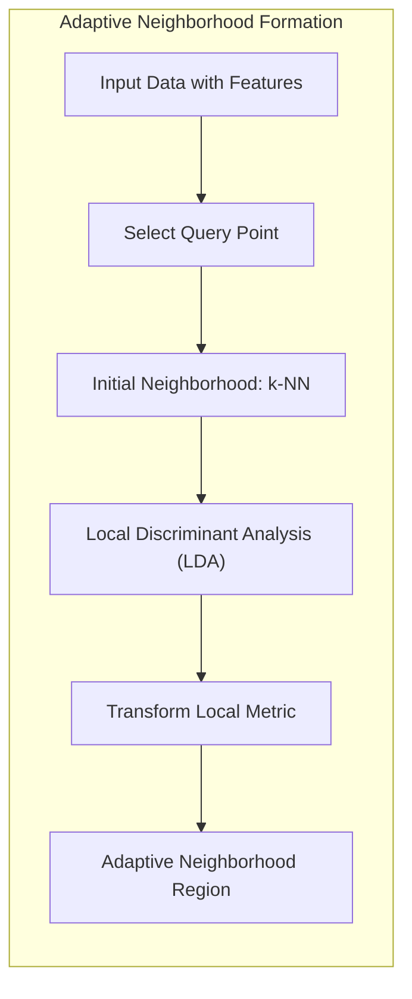
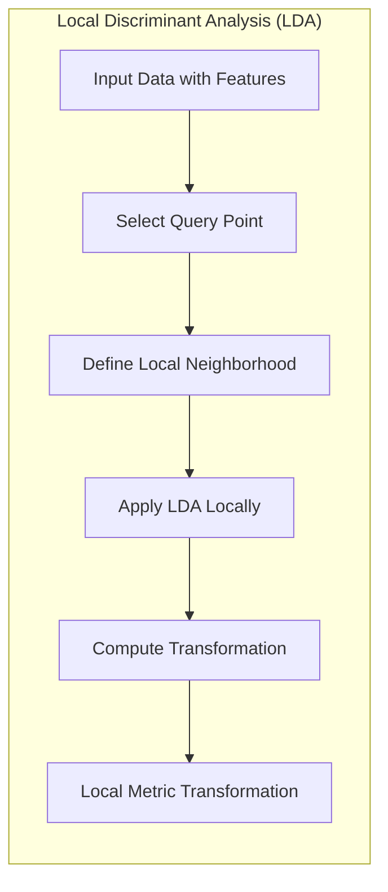
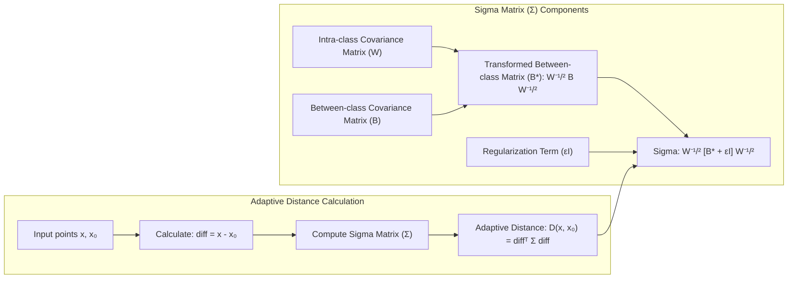

## Vizinhanças Adaptativas: Estendendo Regiões de Proximidade e Métricas Transformadas Localmente com Análise Discriminante Local



### Introdução

Este capítulo explora o conceito de **vizinhanças adaptativas** no contexto do método de **k-vizinhos mais próximos (k-NN)**, com foco em como estender as regiões de proximidade e utilizar **métricas transformadas localmente**, por meio da **análise discriminante local**, para melhorar a capacidade de o k-NN capturar a estrutura dos dados e realizar classificações mais precisas em diferentes regiões do espaço de *features* [^13.4]. Analisaremos como essas abordagens buscam mitigar os efeitos da maldição da dimensionalidade e como a adaptação das vizinhanças ao contexto local permite que o k-NN lide melhor com variações na densidade dos dados e com fronteiras de decisão complexas.

### Vizinhanças Adaptativas: Estendendo a Proximidade no k-NN

A abordagem padrão do **k-NN** utiliza uma região de proximidade circular ou esférica em torno do ponto de consulta, onde a distância entre o ponto de consulta e seus vizinhos é medida utilizando uma métrica predefinida (geralmente a distância Euclidiana) [^13.3]. No entanto, essa abordagem pode ser limitante em problemas onde a estrutura dos dados varia em diferentes regiões do espaço de *features*.

O conceito de **vizinhanças adaptativas** busca estender a noção de proximidade no k-NN, utilizando regiões de vizinhança com formas que se adaptem à estrutura local dos dados. Em vez de considerar vizinhos igualmente em todas as direções, as vizinhanças adaptativas procuram estender a região de proximidade nas direções em que a distribuição dos dados apresenta maior relevância para a classificação, e encurtar em direções irrelevantes ou com baixa variabilidade.

Essa abordagem permite capturar melhor as relações entre os dados nas regiões locais, e adaptar o processo de classificação à estrutura dos dados, mitigando os efeitos da maldição da dimensionalidade e melhorando a capacidade de generalização do modelo. A adaptação das vizinhanças pode ser feita por meio de diferentes técnicas, como o estiramento das regiões de proximidade, a utilização de métricas de distância locais ou a combinação de diferentes abordagens.

**Lemma 135:** A utilização de vizinhanças adaptativas permite que o k-NN capture a estrutura local dos dados de forma mais eficiente do que o uso de regiões de proximidade fixas, o que pode melhorar a precisão das decisões de classificação em espaços de alta dimensão e com distribuições complexas.
*Prova*: A capacidade de adaptar a região de proximidade permite que o modelo capture as características da região, e que a proximidade seja medida em relação a uma métrica adaptada ao contexto. $\blacksquare$

**Corolário 135:** As vizinhanças adaptativas são especialmente úteis em problemas onde a densidade e as propriedades das classes variam em diferentes regiões do espaço de *features*.

> 💡 **Exemplo Numérico:**
>
> Imagine um problema de classificação com duas classes, onde os dados da classe A estão concentrados em uma região alongada ao longo do eixo x, e os dados da classe B estão concentrados em uma região alongada ao longo do eixo y. Se usarmos o k-NN padrão com distância Euclidiana, um ponto de consulta na borda da classe A pode ter vizinhos da classe B como os mais próximos, levando a uma classificação incorreta. No entanto, se usarmos vizinhanças adaptativas que se alongam ao longo do eixo x para pontos na região da classe A e ao longo do eixo y para pontos na região da classe B, o k-NN poderá identificar os vizinhos mais relevantes e melhorar a precisão da classificação.
>
> Para ilustrar, vamos gerar dados sintéticos e comparar o k-NN padrão com uma versão adaptativa:
>
> ```python
> import numpy as np
> import matplotlib.pyplot as plt
> from sklearn.neighbors import KNeighborsClassifier
> from sklearn.metrics import accuracy_score
>
> # Gera dados sintéticos
> np.random.seed(42)
> class_a_x = np.random.normal(2, 0.5, 100)
> class_a_y = np.random.normal(2, 0.1, 100)
> class_b_x = np.random.normal(2, 0.1, 100)
> class_b_y = np.random.normal(4, 0.5, 100)
>
> X = np.vstack((np.column_stack((class_a_x, class_a_y)), np.column_stack((class_b_x, class_b_y))))
> y = np.array([0] * 100 + [1] * 100)
>
> # k-NN padrão
> knn = KNeighborsClassifier(n_neighbors=5)
> knn.fit(X, y)
> y_pred_std = knn.predict(X)
> acc_std = accuracy_score(y, y_pred_std)
>
> # k-NN adaptativo (simplificado, para fins de ilustração)
> # Neste exemplo, vamos alongar manualmente a vizinhança para os pontos da classe A
> # ao longo do eixo x e para os pontos da classe B ao longo do eixo y.
> # Uma implementação real da vizinhança adaptativa seria mais complexa.
> def adaptive_distance(x1, x2, class_label):
>     if class_label == 0: # Classe A
>         return np.sqrt((x1[0] - x2[0])**2 + 10*(x1[1] - x2[1])**2)
>     else: # Classe B
>         return np.sqrt(10*(x1[0] - x2[0])**2 + (x1[1] - x2[1])**2)
>
> def predict_adaptive_knn(X_train, y_train, x_test, k):
>     distances = []
>     for i, x_train in enumerate(X_train):
>         distances.append((adaptive_distance(x_test, x_train, y_train[i]), y_train[i]))
>     distances.sort(key=lambda x: x[0])
>     neighbors = distances[:k]
>     labels = [label for _, label in neighbors]
>     return max(set(labels), key=labels.count)
>
> y_pred_adapt = np.array([predict_adaptive_knn(X, y, x, 5) for x in X])
> acc_adapt = accuracy_score(y, y_pred_adapt)
>
> print(f"Acurácia k-NN Padrão: {acc_std:.2f}")
> print(f"Acurácia k-NN Adaptativo (simplificado): {acc_adapt:.2f}")
>
> # Visualização (simplificada)
> plt.figure(figsize=(8, 6))
> plt.scatter(X[:, 0], X[:, 1], c=y, cmap='viridis', edgecolors='k')
> plt.title("Dados Sintéticos e Classificação (Simplificada)")
> plt.xlabel("Feature 1")
> plt.ylabel("Feature 2")
> plt.show()
> ```
>
> Este exemplo ilustra um caso simplificado onde a vizinhança adaptativa consegue um desempenho melhor (maior acurácia) do que o k-NN padrão.

> ⚠️ **Nota Importante**: Vizinhanças adaptativas permitem que o k-NN ajuste a região de proximidade de acordo com a estrutura local dos dados, o que é útil em espaços de alta dimensão.

> ❗ **Ponto de Atenção**: A implementação de vizinhanças adaptativas pode aumentar a complexidade computacional do k-NN, e a escolha da abordagem mais adequada depende do problema específico.

### Métricas Transformadas Localmente: Análise Discriminante Local

Uma abordagem para construir **métricas de distância adaptativas** é utilizar a **análise discriminante local**, que consiste em aplicar o conceito da análise discriminante linear (LDA) em vizinhanças locais do espaço de *features*, de forma que as métricas de distância se adaptem ao contexto local [^13.4].



A **análise discriminante linear (LDA)** é um método de redução de dimensionalidade que busca encontrar um subespaço linear onde as classes são mais separáveis [^4.3]. A LDA maximiza a distância entre as médias das classes e minimiza a variância dentro das classes. Em vez de aplicar a LDA globalmente, a **análise discriminante local** aplica a LDA em regiões locais do espaço de *features*, calculando as transformações que melhor separam as classes em torno de cada ponto de consulta. A ideia central é adaptar o cálculo da distância às características da distribuição local dos dados.

A abordagem de métricas transformadas localmente envolve os seguintes passos:

1.  **Formação da Vizinhança:** Para cada ponto de consulta, são selecionados os pontos de treinamento mais próximos (por exemplo, os $k$ vizinhos mais próximos, ou usando um raio fixo).
2.  **Análise Discriminante Local:** Aplica-se a LDA localmente na vizinhança de cada ponto de consulta, calculando a projeção linear que maximiza a separação entre classes na região local.
3.  **Transformação da Métrica:** A distância entre o ponto de consulta e seus vizinhos é calculada utilizando uma métrica que leva em consideração a projeção obtida na LDA.

Com essa abordagem, a métrica de distância passa a se adaptar às características locais dos dados e o k-NN passa a utilizar uma métrica que considera as relações entre as *features* para selecionar os vizinhos mais relevantes.

**Lemma 136:** A análise discriminante local permite calcular métricas transformadas localmente que consideram a estrutura de dados e a separação entre classes na vizinhança de um ponto de consulta.
*Prova*: Ao calcular as projeções com LDA localmente, é possível ajustar a métrica de distância para maximizar a separação entre classes naquela região do espaço de features. $\blacksquare$

**Corolário 136:** O uso de métricas transformadas localmente aumenta a capacidade do k-NN de se adaptar à estrutura local dos dados, o que melhora seu desempenho em problemas com alta dimensionalidade e distribuições de dados complexas.

> 💡 **Exemplo Numérico:**
>
> Suponha que temos um conjunto de dados com duas classes, onde a classe 1 tem uma distribuição com média $\mu_1 = [1, 1]^T$ e a classe 2 com média $\mu_2 = [3, 3]^T$. Vamos criar dados sintéticos com covariância intra-classe $W$ e calcular a matriz de covariância entre classes $B$.
>
> ```python
> import numpy as np
> from sklearn.discriminant_analysis import LinearDiscriminantAnalysis
>
> # Dados sintéticos
> np.random.seed(42)
> mean1 = np.array([1, 1])
> mean2 = np.array([3, 3])
> cov = np.array([[1, 0.8], [0.8, 1]])
> X1 = np.random.multivariate_normal(mean1, cov, 100)
> X2 = np.random.multivariate_normal(mean2, cov, 100)
> X = np.vstack((X1, X2))
> y = np.array([0] * 100 + [1] * 100)
>
> # Calcula a LDA global
> lda = LinearDiscriminantAnalysis()
> lda.fit(X, y)
> X_lda = lda.transform(X)
>
> # Calcula a LDA local (exemplo com um ponto de consulta)
> query_point = X[0]
> k = 10
> distances = np.sqrt(np.sum((X - query_point)**2, axis=1))
> neighbors_indices = np.argsort(distances)[:k]
> X_local = X[neighbors_indices]
> y_local = y[neighbors_indices]
>
> lda_local = LinearDiscriminantAnalysis()
> lda_local.fit(X_local, y_local)
>
> # Projeta o ponto de consulta no espaço transformado
> query_point_lda_local = lda_local.transform(query_point.reshape(1, -1))
>
> print("LDA Global - Projeção de todos os pontos")
> print(X_lda[:5])
> print("\nLDA Local - Projeção do ponto de consulta")
> print(query_point_lda_local)
> ```
>
> Neste exemplo, a LDA global transforma os dados em um espaço onde as classes são mais separáveis. A LDA local, aplicada à vizinhança do ponto de consulta, realiza uma transformação que é específica para aquela região, o que pode ser mais adequado para capturar a estrutura local dos dados. A distância entre pontos é então calculada no espaço transformado pela LDA local.

> ⚠️ **Nota Importante**: A utilização da análise discriminante local permite calcular métricas de distância que se adaptam à estrutura local dos dados, e que dão maior peso a regiões de maior discriminabilidade entre as classes.

> ❗ **Ponto de Atenção**: A implementação de métricas transformadas localmente pode aumentar a complexidade computacional do k-NN, e exige um cuidado na escolha dos parâmetros do modelo, da janela de vizinhança e do subespaço de projeção.

### A Fórmula da Distância Adaptativa: Estendendo e Alongando as Regiões de Proximidade

A fórmula da **distância adaptativa** utilizada no método de **discriminant adaptive nearest-neighbor (DANN)** combina o uso de métricas transformadas localmente e a extensão da vizinhança [^13.4]. Essa fórmula busca estender a região de proximidade do k-NN nas direções em que a probabilidade das classes varia menos, e contrair a região nas direções onde as probabilidades mudam mais.

A distância adaptativa entre um ponto $x$ e um ponto de consulta $x_0$ é dada por:

$$D(x, x_0) = (x - x_0)^T \Sigma (x - x_0)$$

onde $\Sigma$ é uma matriz que define a forma da vizinhança, e que é dada por:

$$ \Sigma = W^{-1/2}[W^{-1/2} B W^{-1/2} + \epsilon I] W^{-1/2} = W^{-1/2}[B^* + \epsilon I]W^{-1/2} $$

Onde $W$ é a matriz de covariância intra-classe, $B$ é a matriz de covariância entre as médias das classes, $B^* = W^{-1/2}BW^{-1/2}$ é a versão transformada de $B$ e $\epsilon$ é um parâmetro de regularização.



A matriz $W$ normaliza as *features* e a matriz $B$ estende ou contrai a vizinhança, de forma a dar maior peso às direções em que a informação é mais relevante para a classificação.

Essa fórmula adapta a métrica de distância para estender a vizinhança em direções ortogonais à fronteira de decisão local, utilizando a informação da variabilidade dos dados na vizinhança, e as matrizes $W$ e $B$ podem ser definidas localmente.

**Lemma 137:** A fórmula da distância adaptativa do DANN estende a região de proximidade nas direções onde a variação das probabilidades de classe é menor, e contrai nas direções onde a variação é maior, de forma a melhor capturar a estrutura local dos dados e da fronteira de decisão.
*Prova*: A matriz $\Sigma$ tem como componentes as matrizes de covariância intra e inter-classe, que permitem estender a vizinhança nas direções de baixa variabilidade entre classes e contrair nas de alta variabilidade. $\blacksquare$

**Corolário 137:** A combinação da projeção e da extensão da vizinhança permite que o k-NN seja mais robusto e se adapte às particularidades de cada região do espaço de *features*.

> 💡 **Exemplo Numérico:**
>
> Vamos calcular a distância adaptativa com dados sintéticos. Considere duas classes, onde a classe 1 tem média $\mu_1 = [1, 1]^T$ e a classe 2 tem média $\mu_2 = [3, 3]^T$. A matriz de covariância dentro da classe é $W$, e entre as classes é $B$.
>
> Primeiro, vamos gerar dados sintéticos e calcular as matrizes $W$ e $B$.
>
> ```python
> import numpy as np
>
> # Dados sintéticos
> np.random.seed(42)
> mean1 = np.array([1, 1])
> mean2 = np.array([3, 3])
> cov = np.array([[1, 0.5], [0.5, 1]]) # Covariância intra-classe
> X1 = np.random.multivariate_normal(mean1, cov, 100)
> X2 = np.random.multivariate_normal(mean2, cov, 100)
> X = np.vstack((X1, X2))
> y = np.array([0] * 100 + [1] * 100)
>
> # Calcula a matriz de covariância intra-classe (W)
> W = np.cov(X.T)
>
> # Calcula as médias das classes
> mean_class1 = np.mean(X[y == 0], axis=0)
> mean_class2 = np.mean(X[y == 1], axis=0)
>
> # Calcula a matriz de covariância entre classes (B)
> global_mean = np.mean(X, axis=0)
> B = np.outer(mean_class1 - global_mean, mean_class1 - global_mean) + \
>     np.outer(mean_class2 - global_mean, mean_class2 - global_mean)
>
> # Parâmetro de regularização
> epsilon = 0.01
>
> # Calcula a matriz Sigma
> W_sqrt_inv = np.linalg.inv(np.sqrt(W))
> B_star = W_sqrt_inv @ B @ W_sqrt_inv
> Sigma = W_sqrt_inv @ (B_star + epsilon * np.eye(2)) @ W_sqrt_inv
>
> # Ponto de consulta e um ponto vizinho
> x0 = X[0]
> x = X[1]
>
> # Calcula a distância adaptativa
> diff = x - x0
> adaptive_dist = diff.T @ Sigma @ diff
>
> print("Matriz de covariância intra-classe (W):")
> print(W)
> print("\nMatriz de covariância entre classes (B):")
> print(B)
> print("\nMatriz Sigma:")
> print(Sigma)
> print(f"\nDistância adaptativa entre x0 e x: {adaptive_dist:.4f}")
> ```
>
> Neste exemplo, calculamos as matrizes $W$ e $B$ a partir dos dados sintéticos. Usamos estas matrizes para calcular $\Sigma$ e, por fim, a distância adaptativa entre dois pontos. A matriz $\Sigma$ ajusta a distância de forma que regiões com maior variabilidade entre classes tenham maior peso na distância.

> ⚠️ **Nota Importante**: A fórmula da distância adaptativa no DANN utiliza informações da vizinhança para estender as regiões de proximidade nas direções relevantes e construir uma métrica local.

> ❗ **Ponto de Atenção**: O cálculo da distância adaptativa envolve o cálculo das matrizes de covariância local, o que pode ser computacionalmente custoso, mas a modelagem adaptativa pode trazer melhorias significativas na precisão do modelo.

### Conclusão

A utilização de vizinhanças adaptativas e métricas transformadas localmente, por meio da análise discriminante local, permite que o k-NN lide melhor com a maldição da dimensionalidade e com as variações na densidade dos dados em diferentes regiões do espaço de *features*. A adaptação da vizinhança e da métrica de distância permite que o modelo selecione vizinhos mais relevantes para a classificação e que capture a estrutura local dos dados de forma mais precisa, resultando em modelos mais robustos e com melhor capacidade de generalização em problemas complexos. A escolha entre as diferentes formas de adaptação do k-NN deve ser feita considerando as características dos dados e a complexidade do problema de classificação.

### Footnotes

[^13.4]: "When nearest-neighbor classification is carried out in a high-dimensional feature space, the nearest neighbors of a point can be very far away, causing bias and degrading the performance of the rule. To quantify this, consider N data points uniformly distributed in the unit cube [0, 1]P...In general, this calls for adapting the metric used in nearest-neighbor classification, so that the resulting neighborhoods stretch out in directions for which the class probabilities don't change much." *(Trecho de "13. Prototype Methods and Nearest-Neighbors")*

[^4.3]: "Linear Discriminant Analysis (LDA) is a classical method for classification. It assumes that the classes are normally distributed and that their covariance matrices are the same." *(Trecho de "4. Linear Methods for Classification")*
