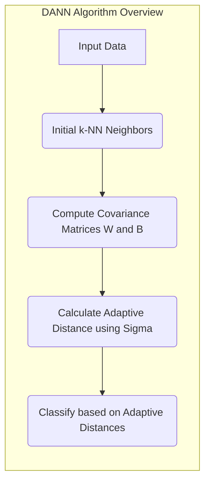
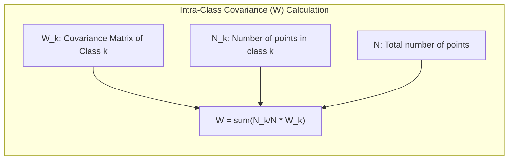
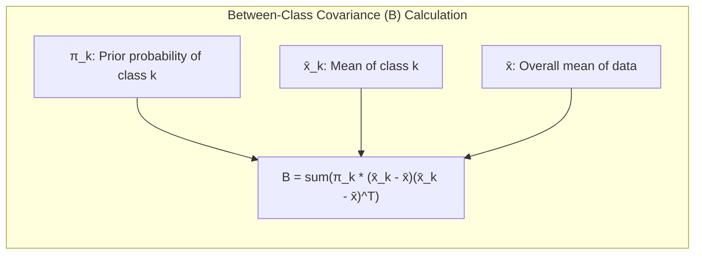
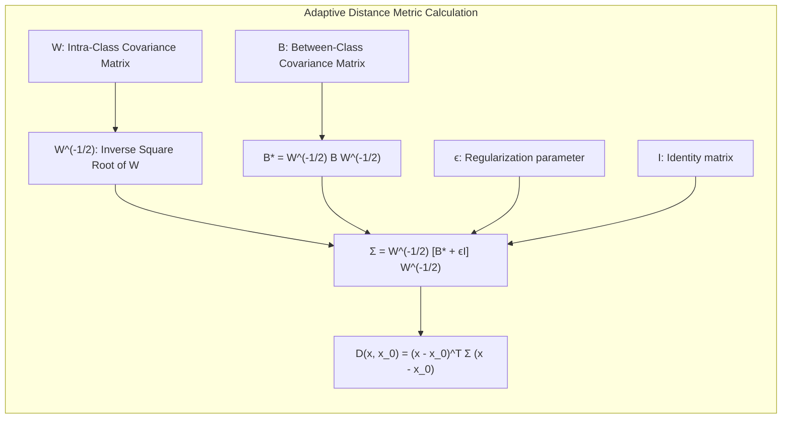
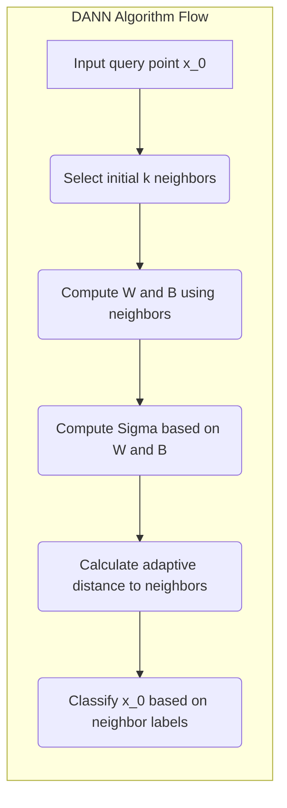

## DANN: Discriminant Adaptive Nearest Neighbors - Adaptação Local com Matrizes de Covariância Entre Classes

### Introdução

Este capítulo explora em profundidade o algoritmo **Discriminant Adaptive Nearest Neighbors (DANN)**, um método avançado de classificação que utiliza **adaptações locais** da métrica de distância com base nas **matrizes de covariância entre classes** [^13.4]. O DANN busca melhorar o desempenho do método k-NN, mitigando o impacto da maldição da dimensionalidade e adaptando a região de vizinhança à estrutura local dos dados. Analisaremos como o DANN utiliza as informações das matrizes de covariância entre classes para estender ou contrair a vizinhança do k-NN, e como essa adaptação local melhora a capacidade do modelo de discriminar entre as classes em diferentes regiões do espaço de *features*. Abordaremos também a formulação matemática do algoritmo DANN e seus princípios subjacentes.

### O DANN: Adaptação Local com Matrizes de Covariância Entre Classes

O algoritmo **Discriminant Adaptive Nearest Neighbors (DANN)** é um método de classificação que busca adaptar a métrica de distância utilizada no k-NN com base nas características locais do conjunto de dados [^13.4]. O DANN utiliza as **matrizes de covariância entre classes** para determinar como estender ou contrair a vizinhança em diferentes regiões do espaço de *features*, com o objetivo de maximizar a capacidade de discriminação entre as classes.

A ideia central do DANN é que, em cada região do espaço de *features*, a forma ideal da vizinhança do k-NN depende da estrutura local dos dados. Em regiões onde as classes são bem separadas, uma vizinhança menor pode ser suficiente para obter uma boa classificação, enquanto em regiões onde as classes são mais sobrepostas, é necessário considerar uma vizinhança maior, com foco nas direções que melhor discriminam entre as classes.

A utilização das matrizes de covariância entre classes permite estimar a direção de maior variabilidade entre as classes na região local, e o DANN utiliza essa informação para estender a vizinhança nas direções ortogonais a essa direção de maior variabilidade. Isso faz com que o k-NN capture as características relevantes da distribuição local das classes, o que melhora seu desempenho em problemas complexos com diferentes níveis de densidade e sobreposição das classes.

**Lemma 138:** O algoritmo DANN utiliza as matrizes de covariância entre classes para ajustar a métrica de distância localmente, estendendo as vizinhanças nas direções em que as classes são mais separáveis e contraindo nas direções em que as classes são menos separáveis.
*Prova*: Ao utilizar informações das matrizes de covariância entre classes, o DANN consegue adaptar a métrica de distância à estrutura local dos dados. $\blacksquare$

**Corolário 138:** O DANN é uma técnica que se adapta às distribuições dos dados por meio de um mecanismo de adaptação local.

> ⚠️ **Nota Importante**:  O algoritmo DANN utiliza as matrizes de covariância entre classes para adaptar a métrica de distância localmente, melhorando a discriminação entre as classes.

> ❗ **Ponto de Atenção**:  O DANN busca minimizar a influência de dimensões irrelevantes ou ruidosas, focando as informações da vizinhança nas dimensões que melhor separam as classes.

### Formulação Matemática do DANN: Matriz de Covariância e Distância Adaptativa

A formulação matemática do algoritmo DANN envolve o uso de matrizes de covariância para definir a métrica de distância adaptativa. Para cada ponto de consulta $x_0$, são calculadas as seguintes matrizes:

1.  **Matriz de Covariância Intra-Classe (W):** A matriz $W$ é a matriz de covariância *pooled* dentro da classe, calculada com base nos $k$ vizinhos mais próximos de $x_0$. Formalmente, $W$ é dada por:

    $$W = \sum_{k=1}^{K} \frac{N_k}{N}W_k$$

    Onde $K$ é o número de classes, $N_k$ é o número de pontos da classe $k$, $N$ é o número total de pontos e $W_k$ é a matriz de covariância da classe $k$.

2.  **Matriz de Covariância Entre Classes (B):** A matriz $B$ é a matriz de covariância entre as médias das classes, que é dada por:

    $$B = \sum_{k=1}^{K} \pi_k (\bar{x}_k - \bar{x}) (\bar{x}_k - \bar{x})^T$$

   Onde $\pi_k$ é a probabilidade *a priori* da classe $k$, $\bar{x}_k$ é a média da classe $k$, e $\bar{x}$ é a média geral dos dados.

> 💡 **Exemplo Numérico:**
>
> Vamos considerar um exemplo simplificado com duas classes (K=2) e um conjunto de dados bidimensional. Suponha que temos 6 vizinhos mais próximos para um ponto de consulta $x_0$. Os dados são:
>
> - Classe 1 (3 pontos): $x_{11} = [1, 1]$, $x_{12} = [2, 1]$, $x_{13} = [1, 2]$
> - Classe 2 (3 pontos): $x_{21} = [4, 4]$, $x_{22} = [5, 5]$, $x_{23} = [4, 5]$
>
> Primeiro, calculamos as médias de cada classe:
>
> $\bar{x}_1 = \frac{[1, 1] + [2, 1] + [1, 2]}{3} = [\frac{4}{3}, \frac{4}{3}]$
>
> $\bar{x}_2 = \frac{[4, 4] + [5, 5] + [4, 5]}{3} = [\frac{13}{3}, \frac{14}{3}]$
>
> A média geral $\bar{x}$ é:
>
> $\bar{x} = \frac{[1, 1] + [2, 1] + [1, 2] + [4, 4] + [5, 5] + [4, 5]}{6} = [\frac{17}{6}, \frac{18}{6}] = [\frac{17}{6}, 3]$
>
> Assumindo que as probabilidades a priori são $\pi_1 = \pi_2 = 0.5$, podemos calcular as matrizes de covariância intra-classe $W_1$ e $W_2$:
>
> $W_1 = \frac{1}{3-1} \sum_{i=1}^{3} (x_{1i} - \bar{x}_1)(x_{1i} - \bar{x}_1)^T$
>
> $W_2 = \frac{1}{3-1} \sum_{i=1}^{3} (x_{2i} - \bar{x}_2)(x_{2i} - \bar{x}_2)^T$
>
>
>  Calculando $W_1$:
>
>  $x_{11} - \bar{x}_1 = [1,1] - [\frac{4}{3}, \frac{4}{3}] = [-\frac{1}{3}, -\frac{1}{3}]$
>
>  $x_{12} - \bar{x}_1 = [2,1] - [\frac{4}{3}, \frac{4}{3}] = [\frac{2}{3}, -\frac{1}{3}]$
>
>  $x_{13} - \bar{x}_1 = [1,2] - [\frac{4}{3}, \frac{4}{3}] = [-\frac{1}{3}, \frac{2}{3}]$
>
> $W_1 =  \frac{1}{2} \left( [-\frac{1}{3}, -\frac{1}{3}] [-\frac{1}{3}, -\frac{1}{3}]^T + [\frac{2}{3}, -\frac{1}{3}] [\frac{2}{3}, -\frac{1}{3}]^T + [-\frac{1}{3}, \frac{2}{3}] [-\frac{1}{3}, \frac{2}{3}]^T \right) $
>
> $W_1 =  \frac{1}{2} \left( \begin{bmatrix} \frac{1}{9} & \frac{1}{9} \\ \frac{1}{9} & \frac{1}{9} \end{bmatrix} + \begin{bmatrix} \frac{4}{9} & -\frac{2}{9} \\ -\frac{2}{9} & \frac{1}{9} \end{bmatrix} + \begin{bmatrix} \frac{1}{9} & -\frac{2}{9} \\ -\frac{2}{9} & \frac{4}{9} \end{bmatrix} \right) = \frac{1}{2} \begin{bmatrix} \frac{6}{9} & -\frac{3}{9} \\ -\frac{3}{9} & \frac{6}{9} \end{bmatrix} = \begin{bmatrix} \frac{1}{3} & -\frac{1}{6} \\ -\frac{1}{6} & \frac{1}{3} \end{bmatrix}$
>
>  Calculando $W_2$:
>
>  $x_{21} - \bar{x}_2 = [4,4] - [\frac{13}{3}, \frac{14}{3}] = [-\frac{1}{3}, -\frac{2}{3}]$
>
>  $x_{22} - \bar{x}_2 = [5,5] - [\frac{13}{3}, \frac{14}{3}] = [\frac{2}{3}, \frac{1}{3}]$
>
>  $x_{23} - \bar{x}_2 = [4,5] - [\frac{13}{3}, \frac{14}{3}] = [-\frac{1}{3}, \frac{1}{3}]$
>
> $W_2 =  \frac{1}{2} \left( [-\frac{1}{3}, -\frac{2}{3}] [-\frac{1}{3}, -\frac{2}{3}]^T + [\frac{2}{3}, \frac{1}{3}] [\frac{2}{3}, \frac{1}{3}]^T + [-\frac{1}{3}, \frac{1}{3}] [-\frac{1}{3}, \frac{1}{3}]^T \right) $
>
> $W_2 =  \frac{1}{2} \left( \begin{bmatrix} \frac{1}{9} & \frac{2}{9} \\ \frac{2}{9} & \frac{4}{9} \end{bmatrix} + \begin{bmatrix} \frac{4}{9} & \frac{2}{9} \\ \frac{2}{9} & \frac{1}{9} \end{bmatrix} + \begin{bmatrix} \frac{1}{9} & -\frac{1}{9} \\ -\frac{1}{9} & \frac{1}{9} \end{bmatrix} \right) = \frac{1}{2} \begin{bmatrix} \frac{6}{9} & \frac{3}{9} \\ \frac{3}{9} & \frac{6}{9} \end{bmatrix} = \begin{bmatrix} \frac{1}{3} & \frac{1}{6} \\ \frac{1}{6} & \frac{1}{3} \end{bmatrix}$
>
>  A matriz de covariância intra-classe *pooled* $W$ é:
>
> $W = \frac{3}{6} W_1 + \frac{3}{6} W_2 = \frac{1}{2} \begin{bmatrix} \frac{1}{3} & -\frac{1}{6} \\ -\frac{1}{6} & \frac{1}{3} \end{bmatrix} + \frac{1}{2} \begin{bmatrix} \frac{1}{3} & \frac{1}{6} \\ \frac{1}{6} & \frac{1}{3} \end{bmatrix} = \begin{bmatrix} \frac{1}{3} & 0 \\ 0 & \frac{1}{3} \end{bmatrix}$
>
> Agora, calculamos a matriz de covariância entre classes $B$:
>
> $B = 0.5 *([\frac{4}{3}, \frac{4}{3}] - [\frac{17}{6}, 3])([\frac{4}{3}, \frac{4}{3}] - [\frac{17}{6}, 3])^T + 0.5 *([\frac{13}{3}, \frac{14}{3}] - [\frac{17}{6}, 3])([\frac{13}{3}, \frac{14}{3}] - [\frac{17}{6}, 3])^T$
>
> $B = 0.5 * [-\frac{3}{6}, -\frac{5}{3}] [-\frac{3}{6}, -\frac{5}{3}]^T + 0.5 * [\frac{9}{6}, \frac{5}{3}] [\frac{9}{6}, \frac{5}{3}]^T$
>
> $B = 0.5 * \begin{bmatrix} \frac{9}{36} & \frac{15}{18} \\ \frac{15}{18} & \frac{25}{9} \end{bmatrix} + 0.5 * \begin{bmatrix} \frac{81}{36} & \frac{45}{18} \\ \frac{45}{18} & \frac{25}{9} \end{bmatrix} = \begin{bmatrix} \frac{90}{72} & \frac{60}{36} \\ \frac{60}{36} & \frac{50}{18} \end{bmatrix} = \begin{bmatrix} \frac{5}{4} & \frac{5}{3} \\ \frac{5}{3} & \frac{25}{9} \end{bmatrix}$

A métrica de distância adaptativa do DANN é então definida como:

$$D(x, x_0) = (x - x_0)^T \Sigma (x - x_0)$$

Onde $\Sigma$ é a matriz que define a forma da vizinhança, e que é dada por:

$$ \Sigma = W^{-1/2}[W^{-1/2} B W^{-1/2} + \epsilon I]W^{-1/2} = W^{-1/2}[B^* + \epsilon I]W^{-1/2} $$

Onde $B^* = W^{-1/2} B W^{-1/2}$ é a versão transformada de $B$ para a matriz de covariância intra-classe, e $\epsilon$ é um parâmetro de regularização (tipicamente $\epsilon = 1$), que impede que a matriz seja singular e estende a vizinhança para evitar usar apenas os vizinhos mais próximos.

> 💡 **Exemplo Numérico (continuação):**
>
> Continuando o exemplo anterior, vamos calcular $\Sigma$. Primeiro, calculamos $W^{-1/2}$. Como $W = \begin{bmatrix} \frac{1}{3} & 0 \\ 0 & \frac{1}{3} \end{bmatrix}$, então $W^{-1/2} = \begin{bmatrix} \sqrt{3} & 0 \\ 0 & \sqrt{3} \end{bmatrix}$.
>
> Agora, calculamos $B^* = W^{-1/2} B W^{-1/2}$:
>
> $B^* = \begin{bmatrix} \sqrt{3} & 0 \\ 0 & \sqrt{3} \end{bmatrix} \begin{bmatrix} \frac{5}{4} & \frac{5}{3} \\ \frac{5}{3} & \frac{25}{9} \end{bmatrix} \begin{bmatrix} \sqrt{3} & 0 \\ 0 & \sqrt{3} \end{bmatrix} = \begin{bmatrix} \frac{15}{4} & 5 \\ 5 & \frac{25}{3} \end{bmatrix}$
>
>  Com $\epsilon = 1$, calculamos $\Sigma$:
>
> $\Sigma = W^{-1/2}[B^* + \epsilon I]W^{-1/2} = \begin{bmatrix} \sqrt{3} & 0 \\ 0 & \sqrt{3} \end{bmatrix} \left( \begin{bmatrix} \frac{15}{4} & 5 \\ 5 & \frac{25}{3} \end{bmatrix} + \begin{bmatrix} 1 & 0 \\ 0 & 1 \end{bmatrix} \right) \begin{bmatrix} \sqrt{3} & 0 \\ 0 & \sqrt{3} \end{bmatrix} $
>
> $\Sigma = \begin{bmatrix} \sqrt{3} & 0 \\ 0 & \sqrt{3} \end{bmatrix} \begin{bmatrix} \frac{19}{4} & 5 \\ 5 & \frac{28}{3} \end{bmatrix} \begin{bmatrix} \sqrt{3} & 0 \\ 0 & \sqrt{3} \end{bmatrix} = \begin{bmatrix} \frac{57}{4} & 15 \\ 15 & 28 \end{bmatrix} $
>
>
> Portanto, a distância adaptativa entre um ponto $x$ e o ponto de consulta $x_0$ será calculada usando essa matriz $\Sigma$.

A matriz $W$ normaliza os dados e a matriz $B$ estende a vizinhança nas direções em que os dados se separam melhor por classes, e assim direciona o algoritmo a selecionar os vizinhos mais relevantes em relação às classes.

**Lemma 139:** A formulação matemática do DANN utiliza as matrizes de covariância intra e entre classes para definir uma métrica de distância adaptativa, que estende as vizinhanças nas direções de maior separação entre as classes.
*Prova*: A fórmula de distância utiliza matrizes de covariância intra e entre classes, que guiam a escolha da vizinhança baseada na informação das classes. $\blacksquare$

**Corolário 139:** A métrica adaptativa do DANN leva em consideração a estrutura local dos dados, permitindo o uso de informações sobre as classes para a escolha de vizinhos relevantes para a classificação.

> ⚠️ **Nota Importante**: A fórmula da distância adaptativa do DANN utiliza as matrizes de covariância intra e entre classes para estender a vizinhança nas direções de maior separabilidade entre as classes.

> ❗ **Ponto de Atenção**: O cálculo da métrica de distância adaptativa do DANN envolve o cálculo das matrizes de covariância localmente, o que pode aumentar o custo computacional do algoritmo.

### Funcionamento do DANN: Ajustando a Vizinhança à Distribuição Local

O funcionamento do algoritmo **DANN (Discriminant Adaptive Nearest Neighbors)** pode ser descrito da seguinte forma:

1.  **Formação da Vizinhança:** Para um ponto de consulta $x_0$, são selecionados os $k$ vizinhos mais próximos no conjunto de treinamento utilizando alguma métrica de distância inicial (por exemplo, a distância Euclidiana).
2.  **Cálculo das Matrizes de Covariância:** Com base nos $k$ vizinhos selecionados, são calculadas as matrizes de covariância intra-classe (W) e entre classes (B) utilizando apenas os dados dos vizinhos selecionados.
3.  **Cálculo da Distância Adaptativa:** Utilizando a fórmula da distância adaptativa do DANN, calcula-se a distância entre o ponto de consulta $x_0$ e cada um de seus $k$ vizinhos, o que inclui a matriz  $\Sigma$.
4.  **Classificação:** A classificação de $x_0$ é feita com base na votação majoritária dos rótulos de classe dos $k$ vizinhos, utilizando a métrica de distância adaptativa.

> 💡 **Exemplo Numérico:**
>
>  Vamos considerar um ponto de consulta $x_0 = [3, 3]$ e usar os dados do exemplo anterior. Inicialmente, com a distância euclidiana, os 6 vizinhos mais próximos são os mesmos que usamos para calcular as matrizes de covariância.
>
>  1. **Cálculo da Distância Adaptativa:** Utilizando a matriz $\Sigma$ calculada previamente e a fórmula da distância adaptativa:
>
>  $D(x, x_0) = (x - x_0)^T \Sigma (x - x_0)$.
>
> Para o ponto $x_{11} = [1, 1]$:
>
>  $x_{11} - x_0 = [-2, -2]$
>
> $D(x_{11}, x_0) = [-2, -2] \begin{bmatrix} \frac{57}{4} & 15 \\ 15 & 28 \end{bmatrix} [-2, -2]^T$
>
> $D(x_{11}, x_0) = [-2, -2] \begin{bmatrix} \frac{57}{4} * -2 + 15 * -2 \\ 15 * -2 + 28 * -2 \end{bmatrix} = [-2, -2] \begin{bmatrix} -28.5 - 30 \\ -30 - 56 \end{bmatrix} = [-2, -2] \begin{bmatrix} -58.5 \\ -86 \end{bmatrix} = 117 + 172 = 289$
>
> Para o ponto $x_{21} = [4, 4]$:
>
>  $x_{21} - x_0 = [1, 1]$
>
> $D(x_{21}, x_0) = [1, 1] \begin{bmatrix} \frac{57}{4} & 15 \\ 15 & 28 \end{bmatrix} [1, 1]^T$
>
> $D(x_{21}, x_0) = [1, 1] \begin{bmatrix} \frac{57}{4} + 15 \\ 15 + 28 \end{bmatrix} = [1, 1] \begin{bmatrix} 29.25 \\ 43 \end{bmatrix} = 29.25 + 43 = 72.25$
>
> Calculando as distâncias adaptativas para todos os vizinhos, podemos notar que a ordem dos vizinhos pode mudar em relação à distância euclidiana inicial.
>
> 2. **Classificação:** Suponha que k=3. Os três vizinhos mais próximos, segundo a distância adaptativa, são usados para classificar $x_0$ com base na votação majoritária. Se dois desses três vizinhos pertencem à classe 1, então $x_0$ será classificado como pertencente à classe 1.

O resultado desse processo é um classificador k-NN que se adapta à estrutura local dos dados, utilizando uma métrica de distância que leva em consideração as informações sobre as classes na vizinhança do ponto de consulta.

**Lemma 140:** O algoritmo DANN ajusta a vizinhança com base em informações das matrizes de covariância das classes na região local de um ponto de consulta, e usa uma métrica de distância que estende a vizinhança nas direções de maior separabilidade entre classes.
*Prova*: A utilização da métrica de distância adaptativa garante que as distâncias usadas para selecionar os vizinhos sejam adaptadas à distribuição local dos dados e às relações entre classes. $\blacksquare$

**Corolário 140:** O DANN é um método para aproximar a vizinhança do k-NN à estrutura de dados local e de otimizar a escolha de vizinhos com alta capacidade de discriminação.

> ⚠️ **Nota Importante**:  O DANN utiliza as matrizes de covariância entre classes para estender a vizinhança de acordo com a informação local e as direções de maior separação entre as classes.

> ❗ **Ponto de Atenção**:  A implementação do DANN envolve o cálculo das matrizes de covariância localmente para cada ponto de consulta, o que pode tornar o processo computacionalmente mais custoso do que outras abordagens de k-NN.

### Vantagens e Aplicações do DANN

O algoritmo **DANN (Discriminant Adaptive Nearest Neighbors)** apresenta diversas vantagens e aplicações:

1.  **Adaptação à Estrutura Local:** O DANN se adapta à estrutura local dos dados, o que o torna capaz de lidar com variações na densidade e com fronteiras de decisão complexas.
2.  **Mitigação da Maldição da Dimensionalidade:** O uso de métricas adaptativas permite que o DANN selecione os vizinhos mais próximos de forma mais eficiente em espaços de alta dimensão, o que mitiga os efeitos da maldição da dimensionalidade.
3.  **Robustez:** O DANN é mais robusto a *outliers* e ruído, pois a escolha dos vizinhos é feita com base nas direções de maior separação entre as classes, o que reduz a influência de vizinhos que não são representativos da distribuição local dos dados.
4. **Boa Performance:** O DANN frequentemente apresenta bom desempenho em problemas de classificação complexos, e superou outros métodos em uma série de tarefas de classificação, demonstrando seu potencial em aplicações reais.

O DANN tem sido utilizado com sucesso em diversas aplicações, incluindo classificação de imagens, reconhecimento de fala, análise de dados biológicos, entre outras. A capacidade de adaptar a métrica de distância e a vizinhança à estrutura local dos dados torna o DANN uma ferramenta poderosa em problemas de aprendizado de máquina.

**Lemma 141:** O DANN utiliza informações das matrizes de covariância das classes para adaptar a métrica de distância e aumentar a capacidade de discriminação entre as classes em diferentes regiões do espaço de *features*, obtendo melhor performance em relação a outras abordagens do k-NN.
*Prova*: A adaptação local da métrica faz com que o DANN selecione os vizinhos mais relevantes para a classificação, melhorando o desempenho em cenários complexos. $\blacksquare$

**Corolário 141:** O DANN é uma ferramenta versátil e eficiente, capaz de se adaptar a diversas distribuições de dados e com bom desempenho em diversos problemas do mundo real.

> ⚠️ **Nota Importante**: O DANN combina a flexibilidade do k-NN com a capacidade de adaptar a métrica de distância à estrutura local dos dados, resultando em modelos mais robustos e eficazes.

> ❗ **Ponto de Atenção**:  A implementação do DANN envolve o cálculo de diversas matrizes, o que pode tornar o processo computacionalmente mais custoso do que outras abordagens do k-NN.

### Conclusão

O algoritmo DANN representa uma evolução do método k-NN, que permite que o modelo se adapte à estrutura local dos dados por meio do uso de matrizes de covariância entre classes. A adaptação da vizinhança e a utilização de métricas transformadas localmente fazem com que o DANN seja mais robusto e preciso em problemas com alta dimensionalidade, com distribuições não uniformes, e com fronteiras de decisão complexas. O algoritmo DANN oferece uma abordagem eficaz para a criação de modelos de classificação de alta performance em problemas do mundo real e a compreensão de seu funcionamento interno auxilia a melhor compreender e utilizar as informações contextuais em modelos *model-free*.

### Footnotes

[^13.4]: "Friedman (1994a) proposed a method in which rectangular neighborhoods are found adaptively by successively carving away edges of a box containing the training data. Here we describe the discriminant adaptive nearest-neighbor (DANN) rule of Hastie and Tibshirani (1996a)...At each query point a neighborhood of say 50 points is formed, and the class distribution among the points is used to decide how to deform the neighborhood--that is, to adapt the metric. The adapted metric is then used in a nearest-neighbor rule at the query point...The discriminant adaptive nearest-neighbor (DANN) metric at a query point xo is defined by D(x, xo) = (x − xo)T Σ(x − xo), where Σ = W-1/2[W-1/2 B W-1/2 + ϵI]W-1/2" *(Trecho de "13. Prototype Methods and Nearest-Neighbors")*

[^4.3]: "Linear Discriminant Analysis (LDA) is a classical method for classification. It assumes that the classes are normally distributed and that their covariance matrices are the same." *(Trecho de "4. Linear Methods for Classification")*
