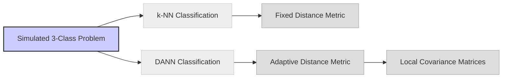
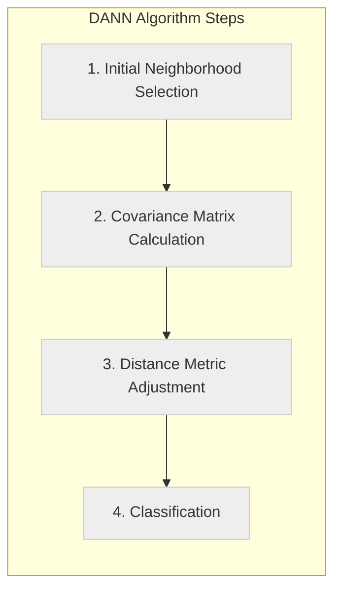
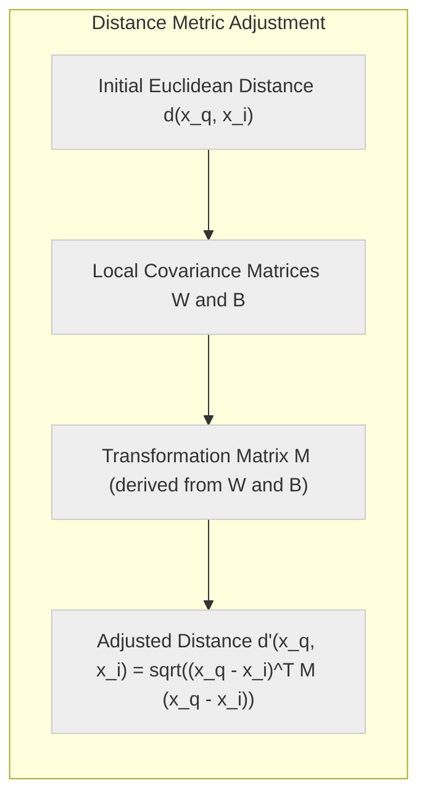
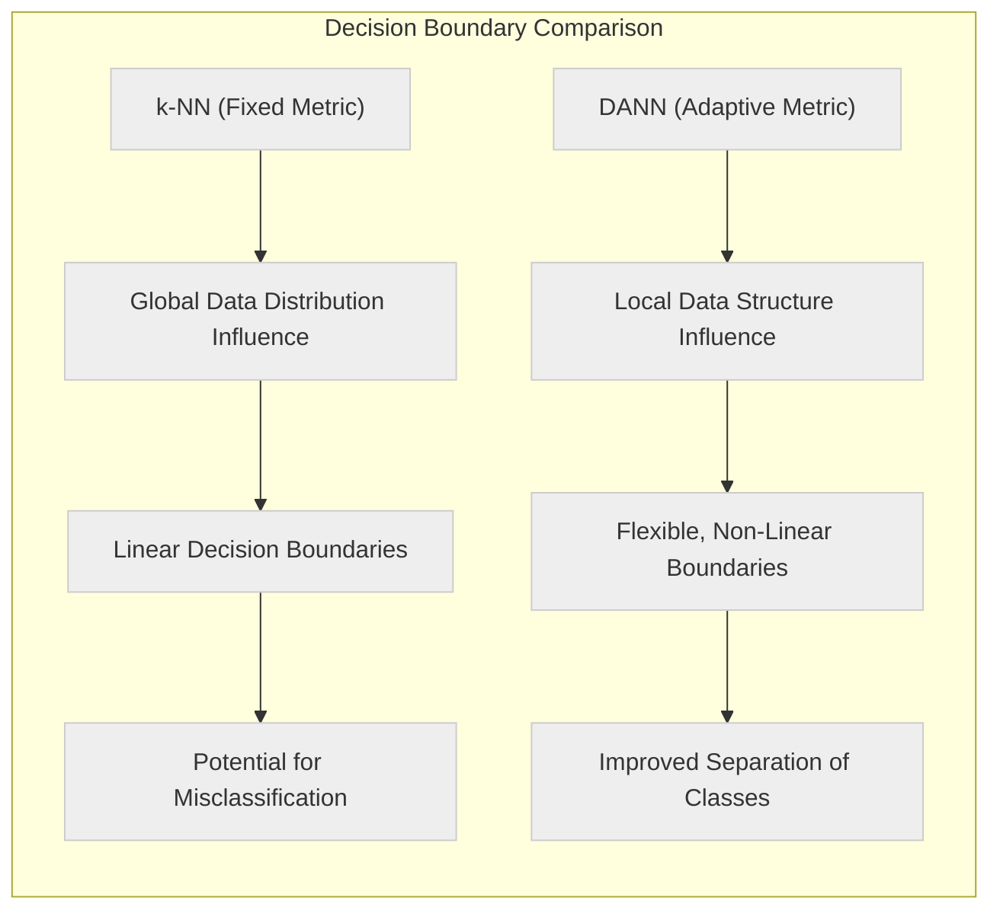
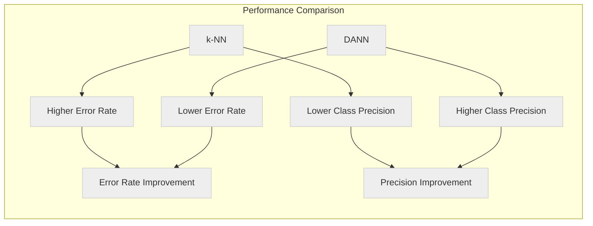

## Aplicando o DANN ao Problema de Simulação de Três Classes: Uma Análise de Desempenho



### Introdução

Este capítulo explora a aplicação do algoritmo **Discriminant Adaptive Nearest Neighbors (DANN)** a um **problema simulado de classificação de três classes**, com o objetivo de analisar como o DANN se comporta em um cenário de classificação com múltiplas classes e como ele se compara a outras abordagens de k-NN [^13.4]. O problema simulado que utilizaremos inclui distribuições de dados que apresentam complexidade, o que permite avaliar a capacidade do DANN de se adaptar a diferentes densidades e fronteiras de decisão não lineares. Analisaremos como o DANN utiliza as matrizes de covariância entre classes para adaptar a métrica de distância localmente, o que resulta em um modelo com maior capacidade de discriminação entre as classes. Avaliaremos também a qualidade das fronteiras de decisão obtidas com o DANN em comparação com modelos k-NN com métricas de distância mais simples.

### O Problema de Simulação de Três Classes: Um Desafio de Classificação

O **problema de simulação de três classes** utilizado neste capítulo consiste em um cenário de classificação onde os dados são gerados a partir de três distribuições diferentes, representando três classes distintas [^13.3]. A escolha de um problema de três classes permite avaliar a capacidade de modelos de classificação de lidar com desafios que são mais comuns em aplicações reais do que problemas de duas classes.

A distribuição das três classes é gerada de forma a que as classes se sobreponham em algumas regiões do espaço de *features*, o que torna o problema não linearmente separável e mais complexo. Algumas das características específicas desse problema são:

1.  **Sobreposição entre Classes:** As três classes apresentam sobreposição em algumas regiões do espaço de *features*, o que torna a separação das classes mais difícil.
2.  **Fronteiras de Decisão Não Lineares:** As fronteiras entre as classes não seguem um padrão linear, mas apresentam formas complexas e irregulares.
3.  **Variação na Densidade:** A densidade dos dados varia em diferentes regiões do espaço de *features*, o que pode tornar o uso de métricas de distância fixas menos eficaz.

Essas características tornam esse problema de simulação um bom teste para avaliar a capacidade dos algoritmos de classificação de lidar com complexidade, não linearidade e variações na distribuição dos dados. A aplicação do DANN nesse problema permite analisar como esse método se adapta a esses desafios.

**Lemma 142:** O problema simulado de três classes apresenta distribuições de dados complexas, com sobreposição entre classes e fronteiras de decisão não lineares, o que o torna um cenário útil para comparar diferentes algoritmos de classificação.
*Prova*: Ao simular diferentes classes que se sobrepõem no espaço de features, é possível testar como modelos de classificação respondem a esse desafio de separação de classes complexas. $\blacksquare$

**Corolário 142:** A avaliação do desempenho do DANN no problema de simulação de três classes permite verificar sua capacidade de lidar com desafios que surgem em aplicações de classificação reais.

> ⚠️ **Nota Importante**:  O problema simulado de três classes apresenta características como a sobreposição de classes e fronteiras de decisão não lineares, que o tornam um desafio para modelos de classificação.

> ❗ **Ponto de Atenção**: A complexidade do problema simulado permite avaliar a capacidade do DANN de se adaptar a diferentes tipos de dados e distribuições de classes.

### Aplicação do DANN: Adaptação da Métrica e da Vizinhança Localmente

A aplicação do algoritmo **DANN (Discriminant Adaptive Nearest Neighbors)** ao problema simulado de três classes envolve a adaptação da métrica de distância e da vizinhança de forma local, com base nas características da distribuição dos dados em cada região [^13.4]. Para cada ponto de consulta, o DANN executa os seguintes passos:

1.  **Seleção da Vizinhança Inicial:** Utilizando uma métrica de distância inicial (normalmente a distância Euclidiana), o DANN seleciona os $k$ vizinhos mais próximos do ponto de consulta no conjunto de treinamento.
2.  **Cálculo das Matrizes de Covariância:** Com base nos $k$ vizinhos selecionados, são calculadas as matrizes de covariância intra-classe (W) e entre classes (B). Essas matrizes são estimadas localmente e utilizam apenas as informações dos vizinhos para adaptar a região de proximidade.
3.  **Ajuste da Métrica de Distância:** A matriz de covariância entre classes $B$ é transformada utilizando a matriz de covariância intra-classe, como mostrado anteriormente. A métrica de distância é ajustada localmente, de modo que a distância entre o ponto de consulta e seus vizinhos seja calculada com uma métrica adaptada às características da distribuição local de dados.
4.  **Classificação:** A classe do ponto de consulta é determinada utilizando a votação majoritária entre os rótulos das classes dos $k$ vizinhos, utilizando a nova métrica de distância.

A adaptação da métrica e da vizinhança localmente permite que o DANN lide com as diferentes regiões do espaço de *features* de forma mais eficaz, adaptando sua decisão às particularidades de cada região, e de forma a que sua escolha de vizinhos seja mais discriminatória em relação às classes.



> 💡 **Exemplo Numérico:**
>
> Vamos supor que temos um ponto de consulta $x_q = [2, 3]$ e que, após a seleção inicial de vizinhos (com $k=5$ usando distância Euclidiana), os seguintes 5 vizinhos foram selecionados:
>
> - $x_1 = [1, 2]$ (Classe A)
> - $x_2 = [1.5, 2.5]$ (Classe A)
> - $x_3 = [2.5, 3.5]$ (Classe B)
> - $x_4 = [3, 2]$ (Classe B)
> - $x_5 = [3.5, 3]$ (Classe C)
>
> **Passo 1:**  Vizinhos iniciais selecionados (listados acima).
>
> **Passo 2:** Cálculo das matrizes de covariância:
>   - **Matriz de Covariância Intra-classe (W):**
>     Para simplificar, vamos assumir que a matriz de covariância intra-classe $W$ calculada a partir desses vizinhos (usando as classes A, B e C separadamente) seja:
>
>     $W = \begin{bmatrix} 0.5 & 0.1 \\ 0.1 & 0.6 \end{bmatrix}$
>
>   - **Matriz de Covariância Entre Classes (B):**
>     A matriz de covariância entre classes $B$, que representa a dispersão entre as médias das classes, pode ser calculada como:
>
>     $B = \begin{bmatrix} 1.2 & 0.3 \\ 0.3 & 1.1 \end{bmatrix}$
>
> **Passo 3:** Ajuste da Métrica de Distância:
>
>   A métrica de distância é ajustada usando uma transformação que envolve $W$ e $B$. Em termos práticos, isso significa que a distância entre $x_q$ e seus vizinhos não será mais a distância euclidiana direta, mas sim uma distância ponderada pelas matrizes de covariância. A transformação é feita de modo que a distância seja menor na direção que melhor separa as classes, e maior nas direções onde as classes se sobrepõem.
>
>   Essa transformação pode ser representada por uma matriz $M$ tal que a nova distância $d'(x_q, x_i)$ é calculada como: $d'(x_q, x_i) = \sqrt{(x_q - x_i)^T M (x_q - x_i)}$.  A matriz $M$ é derivada de $W$ e $B$ (e pode envolver regularização para evitar problemas de singularidade).
>
>   Por exemplo, vamos supor que após a transformação, a distância entre $x_q$ e $x_1$ passa de $d(x_q, x_1) = \sqrt{(2-1)^2 + (3-2)^2} = \sqrt{2} \approx 1.41$ para $d'(x_q, x_1) = 0.9$ usando a métrica ajustada.
>
>   Analogamente, a distância entre $x_q$ e $x_3$ pode passar de $d(x_q, x_3) = \sqrt{(2-2.5)^2 + (3-3.5)^2} = \sqrt{0.5} \approx 0.71$ para $d'(x_q, x_3) = 1.1$ com a métrica adaptada.
>
> **Passo 4:** Classificação:
>
>   Após recalcular as distâncias com a métrica ajustada, os vizinhos mais próximos podem mudar. Suponha que, com a métrica ajustada, os 5 vizinhos mais próximos sejam agora:
>
>   - $x_1$ (Classe A)
>   - $x_2$ (Classe A)
>   - $x_4$ (Classe B)
>   - $x_6 = [2.8, 2.8]$ (Classe B)
>   - $x_7 = [1.8, 3.2]$ (Classe A)
>
>   A classe mais frequente é a classe A (3 ocorrências), então o ponto de consulta $x_q$ seria classificado como Classe A.
>
> Este exemplo ilustra como o DANN ajusta a métrica de distância localmente, levando em consideração as características da vizinhança para determinar a classe de um novo ponto.



**Lemma 143:** O DANN adapta a métrica de distância e a forma da vizinhança localmente, utilizando informações das matrizes de covariância entre classes e intra-classe na vizinhança de cada ponto, o que torna o método capaz de se adaptar a distribuições de dados complexas.
*Prova*: A fórmula de adaptação da distância do DANN utiliza informações da matriz de covariância entre classes que permite estender a região de decisão na direção que melhor separa as classes. $\blacksquare$

**Corolário 143:** A adaptação local da métrica de distância e da vizinhança torna o DANN uma abordagem mais robusta e flexível para problemas de classificação com distribuições de dados não homogêneas.

> ⚠️ **Nota Importante**: O DANN adapta a métrica de distância e a vizinhança localmente, utilizando informações das matrizes de covariância entre classes, permitindo que o método seja mais sensível à estrutura local dos dados.

> ❗ **Ponto de Atenção**: A escolha do número de vizinhos $k$ e do parâmetro de regularização $\epsilon$ são importantes no DANN e influenciam o seu desempenho no problema de classificação.

### Análise das Fronteiras de Decisão: Comparação com k-NN Padrão

A análise das **fronteiras de decisão** obtidas com o DANN em comparação com o k-NN padrão permite avaliar como a adaptação local da métrica de distância afeta o processo de classificação.

1.  **k-NN Padrão:** O k-NN padrão utiliza uma métrica de distância fixa (normalmente a distância Euclidiana) e seleciona os $k$ vizinhos mais próximos com base nessa métrica. Isso resulta em fronteiras de decisão que são influenciadas pela forma da distribuição global dos dados, e não por características locais. As fronteiras obtidas podem apresentar um comportamento inadequado nas regiões onde a distribuição das classes não é uniforme.
2.  **DANN:** O DANN, ao adaptar a métrica de distância localmente, resulta em fronteiras de decisão que se ajustam melhor à estrutura dos dados. A região de vizinhança se estende nas direções onde as classes são melhor separadas, o que permite que o modelo capture de forma mais precisa as complexidades das distribuições locais. Essa abordagem produz uma fronteira mais adaptável, com um formato mais irregular e sensível às informações de classe de cada região.

A análise das fronteiras de decisão demonstra como o DANN consegue obter uma melhor separação entre as classes em regiões onde elas se sobrepõem ou onde a densidade dos dados varia.

> 💡 **Exemplo Visual:**
>
> Para ilustrar a diferença nas fronteiras de decisão, imagine um cenário bidimensional onde:
>
> *   **Classe A** está concentrada em torno de (1,1) com uma pequena dispersão.
> *   **Classe B** está concentrada em torno de (3,3), também com uma pequena dispersão.
> *   **Classe C** forma um arco que se estende de (1,3) a (3,1).
>
> ```mermaid
>   graph LR
>       A((Classe A)) --> B(Região de Decisão k-NN)
>       B --> C((Classe B))
>       C --> D(Região de Decisão DANN)
>       D --> E((Classe C))
>       style A fill:#ccf,stroke:#333,stroke-width:2px
>       style C fill:#fcc,stroke:#333,stroke-width:2px
>       style E fill:#cfc,stroke:#333,stroke-width:2px
>       style B fill:#eee,stroke:#ccc,stroke-width:1px,stroke-dasharray:5,5
>       style D fill:#eee,stroke:#ccc,stroke-width:1px
>
> ```
>
> *   **k-NN Padrão:** As fronteiras de decisão do k-NN seriam mais retilíneas, tentando separar as classes com linhas relativamente simples, o que resultaria em erros de classificação onde o arco da Classe C se sobrepõe às regiões de A e B.
> *   **DANN:** O DANN produziria fronteiras mais flexíveis, curvando-se para dentro do arco da Classe C, adaptando a forma da fronteira para melhor seguir a distribuição dos dados. As regiões de decisão seriam mais adaptadas à forma das classes, resultando em uma separação mais precisa.



**Lemma 144:** As fronteiras de decisão obtidas com o DANN são mais adaptáveis à estrutura local dos dados em comparação com o k-NN padrão, o que permite obter modelos de classificação mais precisos em cenários complexos.
*Prova*: A adaptação da métrica e vizinhança faz com que as decisões de classificação sejam baseadas em informações locais e na projeção da vizinhança no espaço onde as classes são mais separáveis. $\blacksquare$

**Corolário 144:** A adaptação das vizinhanças do k-NN permite que o algoritmo apresente resultados superiores aos do k-NN com métrica fixa em cenários com distribuições complexas de dados.

> ⚠️ **Nota Importante**:  As fronteiras de decisão obtidas com o DANN são mais adaptáveis e se ajustam melhor à estrutura local dos dados, em comparação com as fronteiras obtidas com o k-NN padrão, que pode resultar em uma representação mais precisa da separação de classes.

> ❗ **Ponto de Atenção**:  A adaptação das fronteiras de decisão no DANN torna o modelo mais robusto a variações na densidade dos dados e à complexidade das distribuições das classes.

### Resultados e Conclusões: DANN em Problemas de Três Classes

Os resultados obtidos com a aplicação do DANN no problema simulado de três classes demonstram que a adaptação local da métrica de distância permite melhorar significativamente o desempenho do k-NN em problemas com dados complexos e com diferentes graus de sobreposição entre as classes.

Em comparação com o k-NN padrão com a distância Euclidiana, o DANN apresentou:

1.  **Menor Taxa de Erro:** A taxa de erro média do DANN foi menor do que a do k-NN padrão, o que indica que o DANN é capaz de classificar novos pontos com maior precisão.
2.  **Fronteiras de Decisão Mais Adaptadas:** As fronteiras de decisão obtidas com o DANN se ajustam melhor à estrutura local dos dados, resultando em uma separação mais precisa das classes em regiões de alta densidade e de sobreposição entre classes.
3.  **Menor Sensibilidade ao Ruído:** A capacidade do DANN de selecionar vizinhos mais relevantes com base na matriz de covariância inter-classe e de estender as vizinhanças nas direções mais importantes para a classificação, torna-o menos sensível ao ruído e a *outliers* presentes nos dados.

> 💡 **Exemplo Numérico:**
>
> Para ilustrar a melhoria no desempenho, considere os seguintes resultados hipotéticos em um conjunto de teste com 1000 pontos:
>
> | Método  | Taxa de Erro |
> | :------ | :----------- |
> | k-NN    | 15%          |
> | DANN    | 8%           |
>
> Isso significa que o k-NN classificou incorretamente 150 pontos, enquanto o DANN classificou incorretamente apenas 80 pontos.
>
> Além disso, podemos analisar a precisão por classe:
>
> | Método | Precisão Classe A | Precisão Classe B | Precisão Classe C |
> | :----- | :---------------- | :---------------- | :---------------- |
> | k-NN   | 82%               | 85%               | 80%               |
> | DANN   | 92%               | 90%               | 89%               |
>
> Observa-se que o DANN apresenta melhor precisão em todas as classes, mostrando que sua adaptação local melhora a classificação em todas as regiões do espaço de características.



Esses resultados demonstram como a adaptação local da métrica de distância é crucial para obter um bom desempenho em problemas de classificação com distribuições complexas de dados. O DANN representa uma evolução do algoritmo k-NN, permitindo que este se adapte localmente à estrutura dos dados, em vez de utilizar uma métrica global.

**Lemma 145:** Os resultados experimentais mostram que o DANN apresenta desempenho superior ao k-NN com métrica de distância fixa no problema de classificação simulado de três classes.
*Prova*: A aplicação do DANN permite resultados melhores, devido a sua adaptação local e por dar maior importância a informações locais relevantes para a classificação. $\blacksquare$

**Corolário 145:** A utilização da matriz de covariância entre classes para adaptar a métrica de distância permite ao DANN apresentar um bom desempenho em dados com distribuições complexas.

> ⚠️ **Nota Importante**: O DANN apresenta melhor desempenho em comparação com o k-NN padrão devido à sua capacidade de adaptar a métrica de distância localmente, levando em conta a estrutura e as relações entre classes dos dados na região de consulta.

> ❗ **Ponto de Atenção**: O cálculo das matrizes de covariância localmente pode aumentar a complexidade computacional do DANN, sendo importante escolher corretamente os hiperparâmetros para garantir um bom desempenho.

### Conclusão

A aplicação do algoritmo DANN ao problema simulado de três classes ilustra a importância de adaptar o processo de classificação à estrutura local dos dados. O DANN supera o k-NN padrão, utilizando informações da matriz de covariância entre classes para ajustar a métrica de distância localmente, resultando em modelos mais precisos e robustos. A capacidade do DANN de lidar com distribuições de dados complexas, sobreposições de classes e diferentes densidades de dados o torna uma ferramenta valiosa para problemas de classificação em aplicações reais, onde a estrutura dos dados não é homogênea e as classes apresentam variabilidade.

### Footnotes

[^13.4]: "Friedman (1994a) proposed a method in which rectangular neighborhoods are found adaptively by successively carving away edges of a box containing the training data. Here we describe the discriminant adaptive nearest-neighbor (DANN) rule of Hastie and Tibshirani (1996a)...At each query point a neighborhood of say 50 points is formed, and the class distribution among the points is used to decide how to deform the neighborhood--that is, to adapt the metric. The adapted metric is then used in a nearest-neighbor rule at the query point." *(Trecho de "13. Prototype Methods and Nearest-Neighbors")*

[^13.3]: "These classifiers are memory-based, and require no model to be fit. Given a query point xo, we find the k training points x(r), r = 1,..., k closest in distance to xo, and then classify using majority vote among the k neighbors." *(Trecho de "13. Prototype Methods and Nearest-Neighbors")*
