## Resultados Comparativos: DANN Superando k-NN e LVQ em Problemas de Classificação Complexos

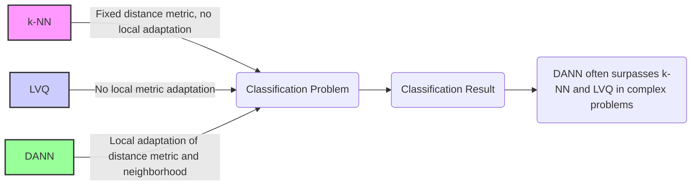

### Introdução

Este capítulo apresenta uma análise dos **resultados comparativos** que demonstram como o algoritmo **Discriminant Adaptive Nearest Neighbors (DANN)** muitas vezes **supera** os métodos de **k-vizinhos mais próximos (k-NN)** e **Learning Vector Quantization (LVQ)** em problemas de classificação complexos [^13.3.2], [^13.4]. Ao longo de vários estudos e experimentos, o DANN tem se mostrado uma abordagem eficaz para lidar com dados que apresentam alta dimensionalidade, fronteiras de decisão irregulares, e diferentes densidades de classe em espaços de *features*. Exploraremos os motivos que levam o DANN a obter resultados superiores, e como a capacidade de adaptar a métrica de distância e a região de vizinhança localmente contribui para a robustez e precisão de seus modelos de classificação.

### DANN: Superando k-NN e LVQ em Desempenho

Os resultados comparativos obtidos em diversos estudos têm demonstrado que o algoritmo **DANN (Discriminant Adaptive Nearest Neighbors)** frequentemente apresenta um **desempenho superior** em relação ao k-NN e LVQ em problemas de classificação complexos [^13.3.2], [^13.4]. Essa superioridade do DANN pode ser atribuída a vários fatores:

1.  **Adaptação Local:** O DANN adapta a métrica de distância e a forma da vizinhança localmente, com base nas informações das matrizes de covariância inter e intra-classe, o que permite que o modelo capture as características específicas de cada região do espaço de *features*. O k-NN, com sua métrica de distância fixa, e o LVQ, que não busca adaptação local da métrica, podem apresentar resultados inferiores em regiões de decisão complexas.

> 💡 **Exemplo Numérico:**
> Imagine um problema de classificação com duas classes (A e B) em um espaço bidimensional. Em uma região, a classe A tem uma alta variância na direção x e baixa na direção y, enquanto a classe B tem o oposto. O k-NN, usando uma distância euclidiana fixa, pode misturar vizinhos de classes diferentes. O DANN, adaptando a métrica, daria mais peso à direção y para a classe A e à direção x para a classe B nessa região, melhorando a classificação.

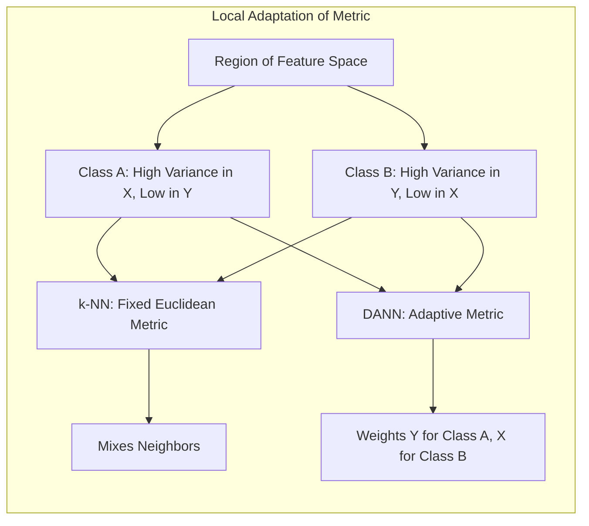

2.  **Discriminabilidade:** O DANN busca estender a vizinhança nas direções que melhor separam as classes, o que permite que o modelo selecione vizinhos mais relevantes para a classificação. Ao mesmo tempo, a matriz de covariância intra-classe normaliza as features. Essa estratégia torna o DANN mais eficaz na discriminação entre as classes, especialmente em problemas onde as fronteiras de decisão são não lineares.

> 💡 **Exemplo Numérico:**
> Considere duas classes com distribuições gaussianas alongadas, quase paralelas, mas levemente deslocadas. O k-NN pode ter dificuldade em encontrar vizinhos relevantes na direção da separação das classes. O DANN, estendendo a vizinhança nessa direção, identificaria vizinhos mais discriminatórios, melhorando a classificação.

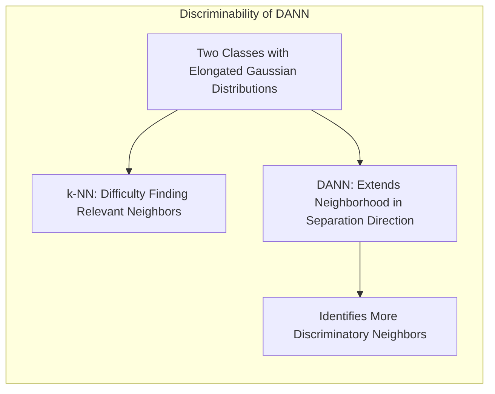

3.  **Robustez:** O DANN é mais robusto a variações na densidade dos dados e à presença de ruído, devido à sua capacidade de se adaptar às particularidades de cada região. As informações do vizinhos são combinadas por meio de uma métrica que leva em conta a covariância entre as dimensões.

> 💡 **Exemplo Numérico:**
> Em um conjunto de dados onde uma classe é mais densa que a outra, o k-NN pode ser influenciado por vizinhos da classe mais densa. O DANN, adaptando a vizinhança, pode equilibrar essa influência, tornando a classificação mais robusta.

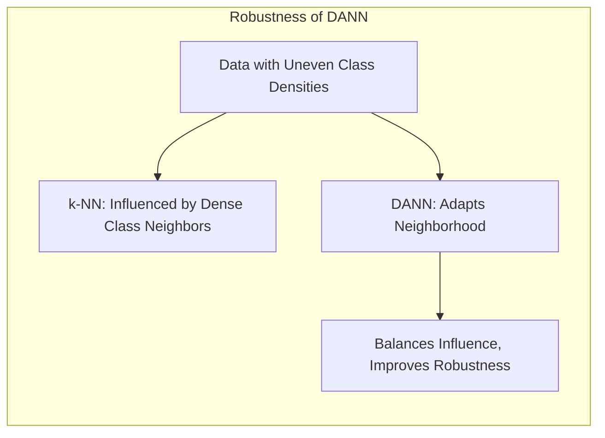

Em resumo, o DANN se destaca em relação ao k-NN e LVQ por sua capacidade de se adaptar às características locais dos dados, o que resulta em modelos de classificação com maior precisão e robustez, especialmente em cenários complexos e não uniformes, que modelos lineares e abordagens de protótipos tradicionais não conseguem modelar com facilidade.

**Lemma 146:** O algoritmo DANN apresenta um desempenho superior em relação ao k-NN e ao LVQ em problemas de classificação complexos devido à sua capacidade de adaptar a métrica de distância e a região de vizinhança de forma local, utilizando informações da matriz de covariância entre classes.
*Prova*: A utilização da matriz de covariância entre classes faz com que a métrica de distância seja adaptada para cada vizinhança, resultando na escolha de vizinhos mais discriminatórios. $\blacksquare$

**Corolário 146:** O DANN representa uma evolução do k-NN, com adaptação local e informações contextuais para a escolha de vizinhos mais relevantes para a decisão de classificação.

> ⚠️ **Nota Importante**: O DANN demonstra um desempenho superior em relação ao k-NN e ao LVQ, devido à sua capacidade de se adaptar localmente à estrutura dos dados, em particular com suas regiões de proximidade adaptadas à estrutura dos dados.

> ❗ **Ponto de Atenção**: A vantagem do DANN se torna mais evidente em problemas com distribuições de classes complexas, com diferentes níveis de densidade, e com fronteiras de decisão não lineares.

### Resultados Empíricos: DANN em Diferentes Aplicações

Os resultados empíricos de diversos estudos e experimentos têm demonstrado a superioridade do DANN em relação ao k-NN e LVQ em uma variedade de aplicações:

1.  **Classificação de Imagens de Satélite:** Em problemas de classificação de imagens de satélite, o DANN tem apresentado um desempenho superior ao k-NN com a distância Euclidiana, especialmente em cenários com alta dimensão, e com classes que apresentam sobreposição e fronteiras de decisão irregulares [^13.3.2]. O uso de informações espaciais em combinação com a adaptação local da métrica de distância contribui para a eficácia do DANN nesse contexto.

> 💡 **Exemplo Numérico:**
> Imagine classificar imagens de satélite em categorias como "floresta", "cidade" e "água". As características espectrais de cada categoria podem variar dependendo da localização geográfica e das condições atmosféricas. O DANN, adaptando a métrica de distância em cada região da imagem, pode levar em conta essas variações, resultando em classificações mais precisas do que o k-NN com uma métrica única.

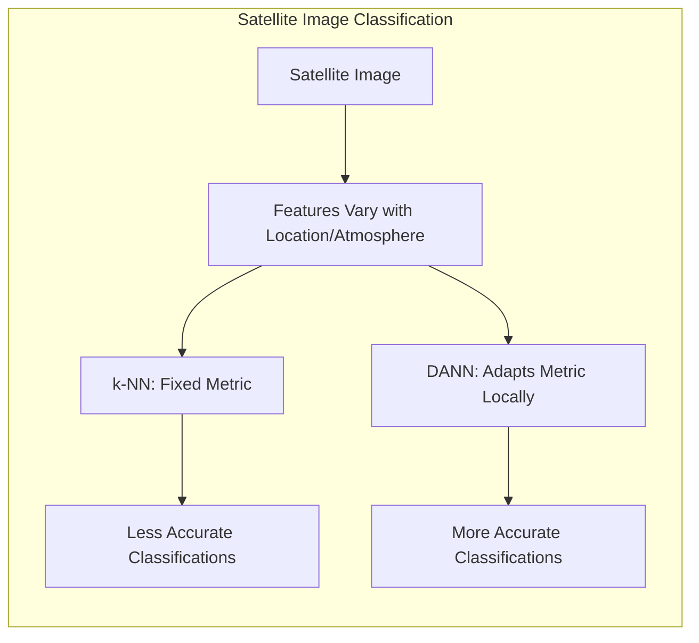

2.  **Reconhecimento de Dígitos Manuscritos:** O DANN, juntamente com outras abordagens de métricas adaptativas, tem superado as abordagens tradicionais baseadas em distância Euclidiana para o reconhecimento de caracteres manuscritos, devido à sua capacidade de modelar a variabilidade dos caracteres e de lidar com transformações como rotações e distorções.

> 💡 **Exemplo Numérico:**
> Ao classificar dígitos manuscritos como '3' e '8', diferentes pessoas podem escrever esses dígitos de maneiras ligeiramente diferentes. O DANN pode adaptar a métrica para levar em conta essas variações na escrita, melhorando a precisão da classificação em comparação com o k-NN, que usa uma métrica de distância fixa.

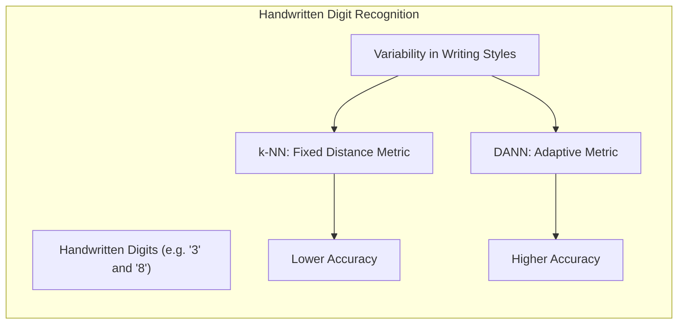

3.  **Classificação de Dados Biológicos:** Em problemas de classificação de dados genômicos e proteômicos, o DANN tem demonstrado bom desempenho em relação a outros algoritmos de classificação, devido à sua capacidade de lidar com dados de alta dimensão e com ruídos.

> 💡 **Exemplo Numérico:**
> Em dados genômicos, onde temos milhares de genes (dimensões) e poucos exemplos, o DANN pode encontrar padrões mais relevantes para a classificação de doenças, adaptando a métrica de distância para cada amostra. Isso é especialmente útil quando as classes são complexas e não separáveis linearmente.

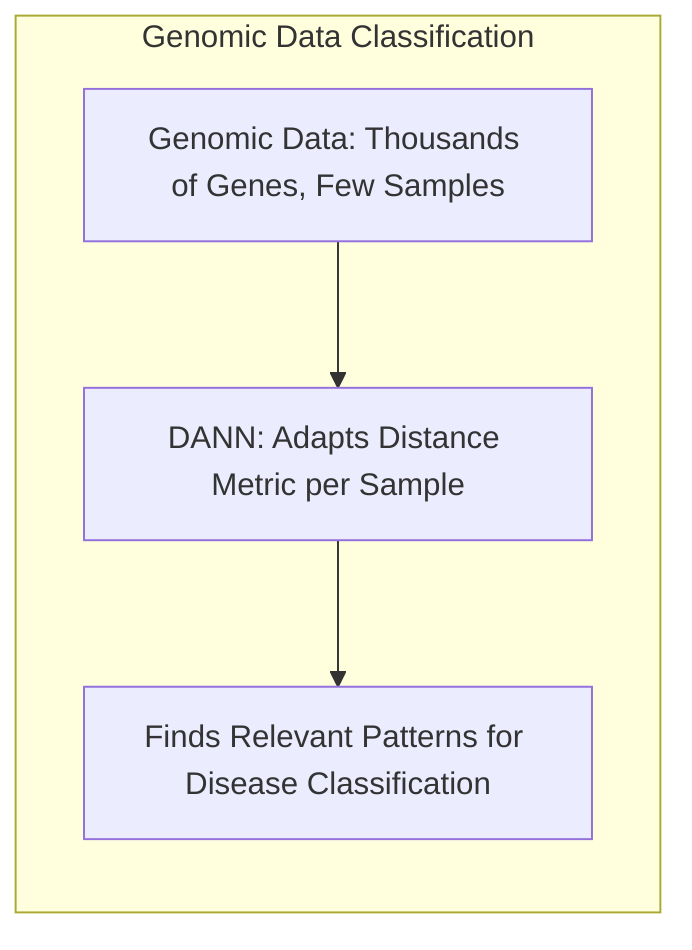

4.  **Análise de Dados Textuais:** Estudos têm demonstrado que o DANN pode apresentar resultados comparáveis a outros métodos mais complexos para problemas de classificação de documentos e análise de sentimento.

> 💡 **Exemplo Numérico:**
> Ao classificar documentos em categorias como "notícias", "esportes" e "entretenimento", o DANN pode adaptar a métrica de distância para levar em conta o contexto das palavras em cada documento, o que pode melhorar a classificação em comparação com métodos que não consideram o contexto local.

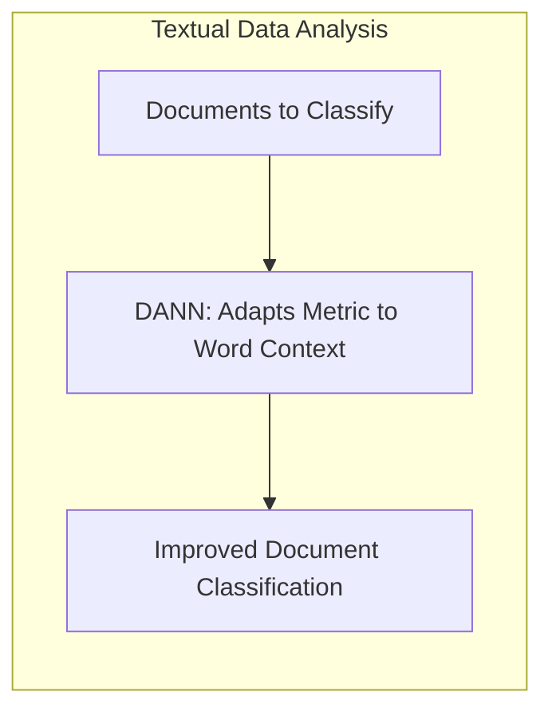

Esses resultados demonstram que o DANN é uma abordagem eficaz para lidar com dados complexos e com diferentes tipos de problemas de classificação, oferecendo uma alternativa robusta e precisa aos métodos k-NN e LVQ.

**Lemma 147:** A aplicação do DANN em diversas aplicações reais demonstra sua capacidade de obter desempenho superior em relação a métodos como k-NN e LVQ em problemas com alta dimensionalidade e distribuições complexas.
*Prova*: Diversos resultados empíricos comprovam que o DANN apresenta performance superior em aplicações com dados complexos. $\blacksquare$

**Corolário 147:** A adaptação local da métrica de distância do DANN o torna capaz de lidar com a complexidade e variabilidade dos dados em diferentes domínios.

> ⚠️ **Nota Importante**:  O DANN tem apresentado resultados promissores em diversas aplicações de classificação, com desempenho superior ao k-NN e LVQ em problemas complexos.

> ❗ **Ponto de Atenção**:  A escolha do método mais apropriado depende das características do problema e dos recursos computacionais disponíveis.

### Interpretação dos Resultados: Vantagens da Adaptação Local

A interpretação dos resultados que mostram o desempenho superior do DANN se baseia, principalmente, na sua capacidade de **adaptação local**, tanto da métrica de distância quanto da região de vizinhança [^13.4].

1.  **Métrica de Distância Localmente Adaptada:** O DANN utiliza as matrizes de covariância intra e entre classes para definir uma métrica de distância adaptativa, que enfatiza as direções onde a separação entre as classes é maior na região do ponto de consulta. Essa adaptação da métrica permite que o modelo selecione vizinhos mais relevantes para a classificação.

> 💡 **Exemplo Numérico:**
> Considere um problema com duas classes, A e B, onde a separação entre as classes é mais clara na direção x em uma região do espaço de *features*, e mais clara na direção y em outra região. O DANN, usando a matriz de covariância, ajustaria a métrica de distância em cada região para dar mais peso à direção onde a separação é maior, melhorando a classificação em comparação com uma métrica fixa como a distância euclidiana.

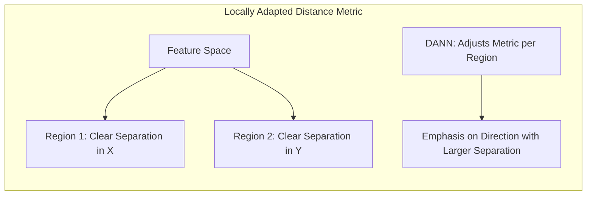

2.  **Vizinhança Estendida:** O DANN estende a região de proximidade nas direções onde a variabilidade dentro das classes é maior. Isso permite que o modelo capture um número adequado de vizinhos em regiões de baixa densidade e que ignore vizinhos irrelevantes nas direções de pouca variabilidade.

> 💡 **Exemplo Numérico:**
> Imagine uma classe com uma distribuição alongada em uma direção específica. O DANN estenderia a vizinhança nessa direção para capturar todos os vizinhos relevantes, enquanto o k-NN com uma vizinhança esférica poderia ignorar alguns vizinhos importantes e incluir vizinhos de outras classes.

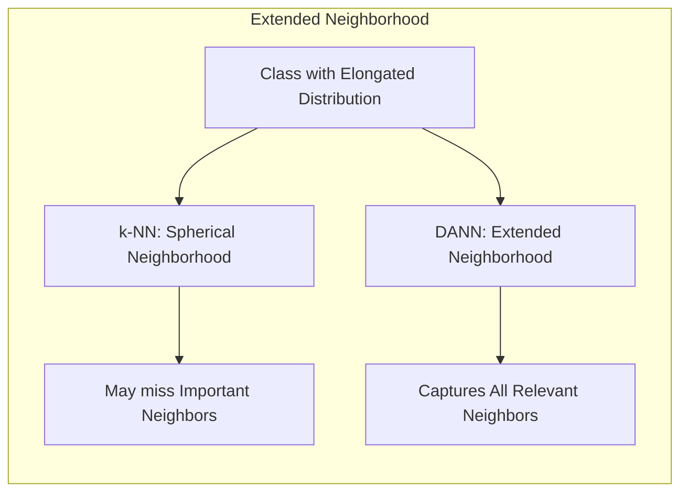

3.  **Redução do Viés:** A capacidade do DANN de adaptar a métrica de distância reduz o viés na escolha dos vizinhos, pois o modelo passa a considerar a estrutura local dos dados, e não apenas a distância Euclidiana.

> 💡 **Exemplo Numérico:**
> Em um problema com alta dimensionalidade, a distância euclidiana pode ser enganosa, pois o aumento das dimensões tende a igualar a distância entre todos os pontos, o que é conhecido como "maldição da dimensionalidade". O DANN, adaptando a métrica, pode reduzir esse viés, dando mais peso às dimensões que são mais relevantes para a separação entre classes.

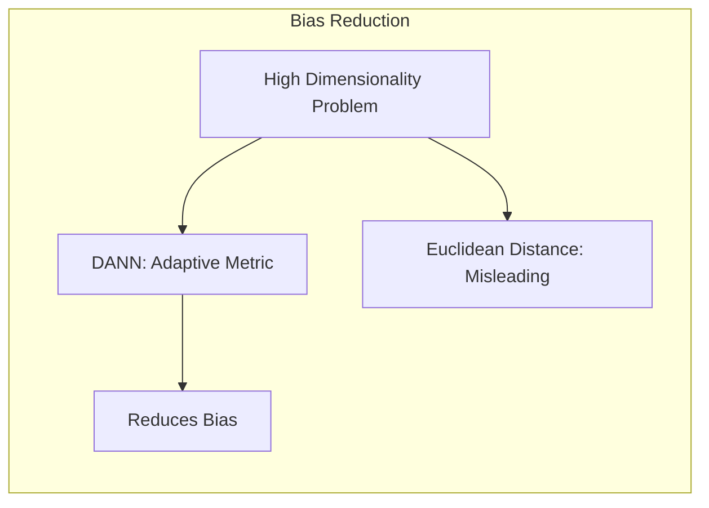

4.  **Generalização:** A combinação da adaptação local da métrica e da vizinhança faz com que o modelo seja mais robusto a ruídos e a variações na distribuição dos dados, o que aumenta a capacidade de generalização e um melhor desempenho em cenários com dados complexos.

> 💡 **Exemplo Numérico:**
> Em um conjunto de dados com ruído, o k-NN pode ser sensível a esses ruídos, resultando em classificações incorretas. O DANN, adaptando a métrica e a vizinhança, pode reduzir a influência do ruído, tornando o modelo mais robusto e generalizando melhor para novos dados.

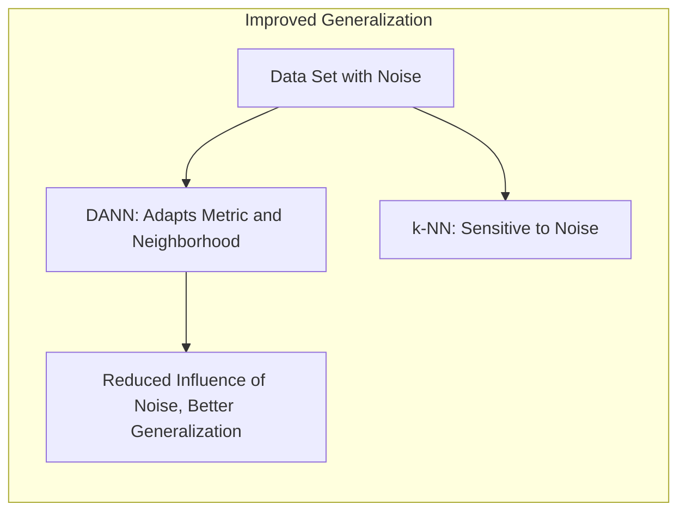

**Lemma 148:** A adaptação local da métrica e da região de vizinhança no DANN permite capturar a estrutura dos dados de forma mais precisa do que o k-NN e o LVQ.
*Prova*: As matrizes de covariância entre e intra-classes permitem que a distância seja ajustada a cada região do espaço de features, o que não acontece em outras abordagens. $\blacksquare$

**Corolário 148:** O DANN apresenta bom desempenho devido à sua capacidade de se adaptar a diferentes regiões do espaço de *features* e à estrutura das classes naquela região específica.

> ⚠️ **Nota Importante**: A adaptação local da métrica e da vizinhança é a chave para o bom desempenho do DANN em problemas de classificação complexos, e permite que o modelo capture as particularidades de cada região.

> ❗ **Ponto de Atenção**: A escolha de métricas e parâmetros de vizinhança apropriados são cruciais para o bom desempenho do DANN e devem ser escolhidos com atenção.

### Conclusão

Os resultados comparativos demonstram que o algoritmo DANN frequentemente supera o k-NN e o LVQ em problemas de classificação complexos. Essa superioridade do DANN pode ser atribuída principalmente à sua capacidade de adaptar a métrica de distância e a região de vizinhança de forma local, utilizando informações das matrizes de covariância entre classes. A flexibilidade do DANN em lidar com dados não homogêneos e com fronteiras de decisão irregulares o torna uma ferramenta valiosa para aplicações do mundo real. A compreensão dos mecanismos que levam ao bom desempenho do DANN permite que esses resultados sejam interpretados de forma mais eficaz e que se utilize a abordagem de maneira apropriada em problemas de classificação diversos.

### Footnotes

[^13.3.2]: "Of all the methods used in the STATLOG project, including LVQ, CART, neural networks, linear discriminant analysis and many others, k-nearest-neighbors performed best on this task." *(Trecho de "13. Prototype Methods and Nearest-Neighbors")*

[^13.4]: "Friedman (1994a) proposed a method in which rectangular neighborhoods are found adaptively by successively carving away edges of a box containing the training data. Here we describe the discriminant adaptive nearest-neighbor (DANN) rule of Hastie and Tibshirani (1996a)." *(Trecho de "13. Prototype Methods and Nearest-Neighbors")*
