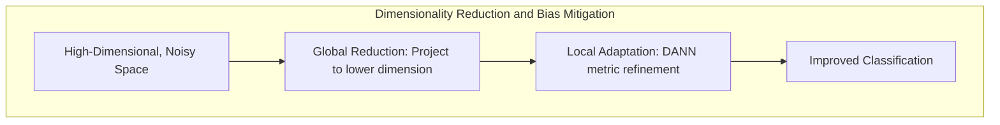
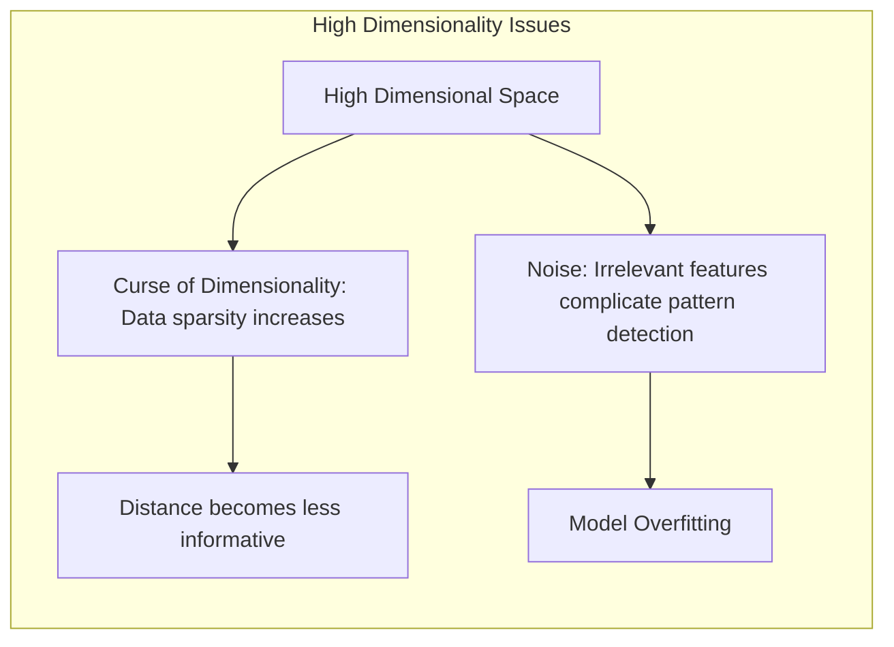
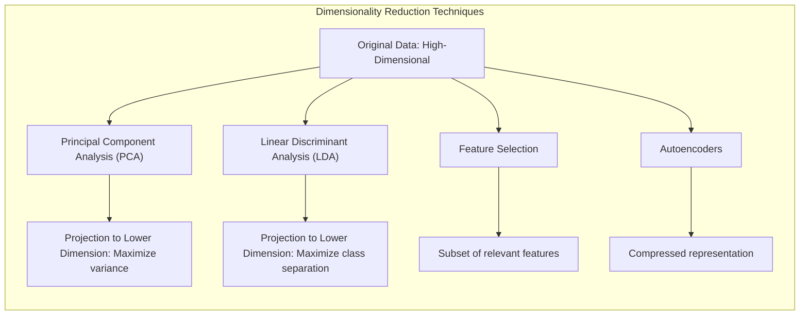
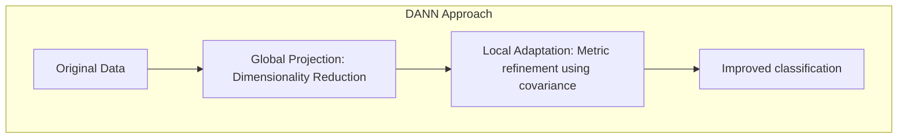
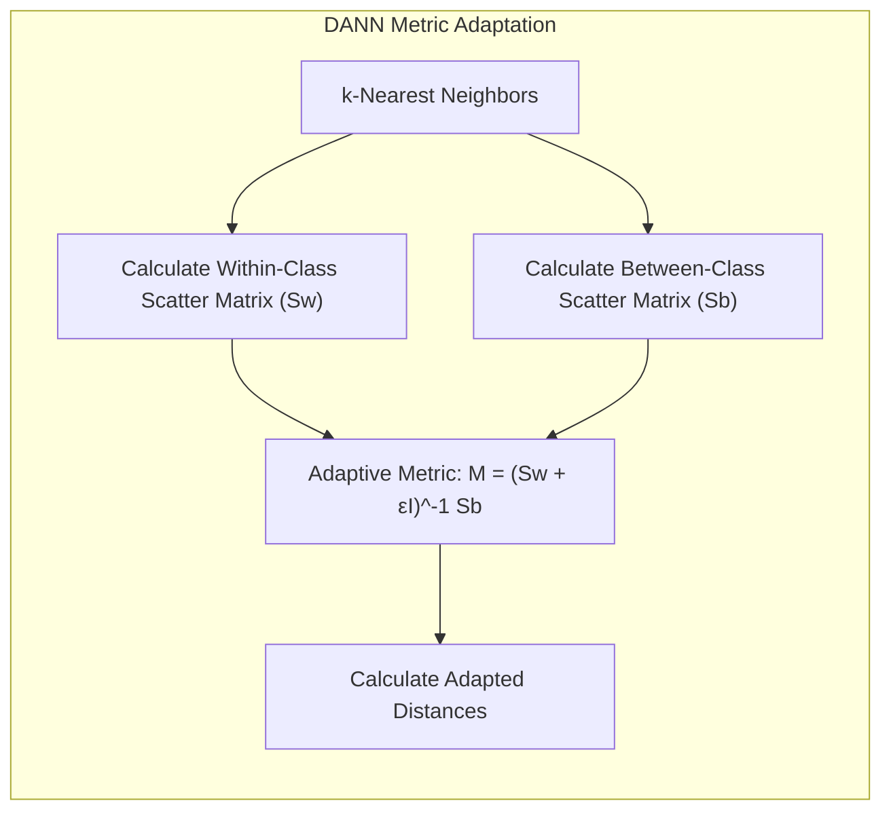
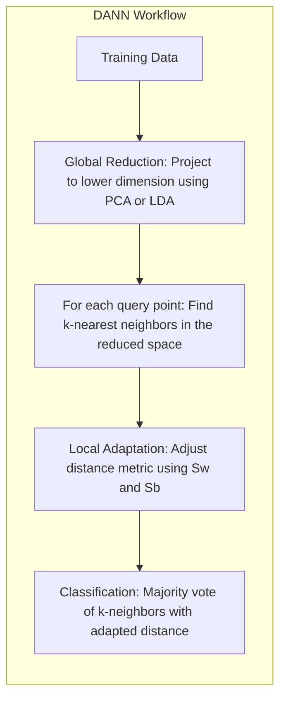

## Combinando Técnicas Locais e Globais: Redução de Dimensionalidade e Mitigação do Viés em Espaços Ruidosos



### Introdução

Este capítulo explora a combinação de **técnicas locais** e **globais** para lidar com os desafios da **alta dimensionalidade** e do **ruído** em problemas de classificação, com foco especial em como a **projeção em espaços de menor dimensão** e a utilização de métodos adaptativos locais podem mitigar tanto a complexidade computacional quanto o viés que podem surgir em espaços ruidosos [^13.4.2]. Analisaremos como a redução de dimensionalidade, uma técnica global, pode ser combinada com o **Discriminant Adaptive Nearest Neighbors (DANN)**, uma técnica local, para obter modelos de classificação mais robustos, precisos e eficientes. Discutiremos também como essa combinação permite que o modelo capture melhor a estrutura dos dados e melhore seu desempenho em aplicações do mundo real.

### A Complexidade de Espaços de Alta Dimensão com Ruído

Problemas de classificação em espaços de alta dimensão, onde o número de *features* é grande, são frequentemente afetados por dois desafios principais:

1.  **Maldição da Dimensionalidade:** Conforme abordado em capítulos anteriores, a **maldição da dimensionalidade** faz com que a densidade dos dados diminua exponencialmente com o aumento da dimensão, o que torna a distância entre os pontos menos informativa e dificulta a seleção dos vizinhos mais relevantes. Isso afeta a capacidade de modelos como o k-NN (k-vizinhos mais próximos) de realizar classificações precisas.
2.  **Ruído:** A presença de *features* irrelevantes ou ruidosas aumenta a dificuldade de encontrar padrões relevantes nos dados, e pode levar a modelos com *overfitting*, ou seja, modelos que aprendem a identificar padrões que não existem no mundo real.



A combinação desses dois fatores – alta dimensionalidade e ruído – torna o problema de classificação mais desafiador e exige a utilização de técnicas que permitam lidar com esses problemas.

Para mitigar esses problemas, é importante combinar a redução da dimensionalidade com abordagens locais. A redução da dimensionalidade, utilizada como uma abordagem global, projeta os dados em um espaço de menor dimensão, o que diminui o número de *features*, reduz a complexidade computacional e diminui o ruído. Métodos locais, como o DANN, fazem um ajuste fino da métrica e região de proximidade para a estrutura local dos dados, melhorando a capacidade do modelo de se adaptar a distribuições complexas.

**Lemma 149:** A combinação de alta dimensionalidade e ruído torna o problema de classificação mais complexo, e exige a utilização de técnicas que reduzam a dimensão do problema e se adaptem localmente à estrutura dos dados.
*Prova*: O número de dimensões aumenta o tamanho do espaço de *features* e o ruído faz com que informações relevantes sejam menos perceptíveis. $\blacksquare$

**Corolário 149:** A combinação de técnicas globais (redução de dimensionalidade) e locais (adaptação de métrica com DANN) permite lidar com a complexidade e o ruído em problemas de alta dimensão.

> ⚠️ **Nota Importante**: Em espaços de alta dimensão com ruído, é necessário combinar técnicas de redução de dimensionalidade com métodos adaptativos locais para obter resultados eficazes.

> ❗ **Ponto de Atenção**:  A escolha das técnicas de redução de dimensionalidade e adaptação local deve ser feita com base nas características específicas do problema em questão.

### Redução de Dimensionalidade: Projetando para um Subespaço Relevante

A **redução de dimensionalidade** é um processo que busca transformar os dados originais em um espaço de menor dimensão, mantendo as informações mais relevantes para a classificação [^13.4.2]. O objetivo é reduzir a complexidade do espaço de *features* e diminuir o impacto do ruído, projetando os dados em um subespaço que capture a estrutura mais relevante dos dados.

Existem diversas técnicas para redução de dimensionalidade, e algumas das mais comuns incluem:

1.  **Análise de Componentes Principais (PCA):** A PCA é uma técnica linear que busca projetar os dados em um subespaço ortogonal de menor dimensão, onde a variância dos dados é maximizada. A PCA identifica as dimensões que mais variam, e elimina aquelas que apresentam baixa variância.
2.  **Análise Discriminante Linear (LDA):** A LDA é uma técnica supervisionada que busca projetar os dados em um subespaço de menor dimensão onde as classes são mais separáveis. A LDA maximiza a distância entre as médias das classes e minimiza a variância dentro das classes.
3.  **Seleção de *Features*:** A seleção de *features* consiste em identificar e utilizar apenas um subconjunto das *features* originais que sejam mais relevantes para a classificação.
4. **Autoencoders:** Algoritmos de aprendizado profundo que comprimem os dados em espaços de menor dimensão, e que podem ser usados para reconstruir a entrada a partir do espaço comprimido, garantindo que a informação seja preservada.



A redução de dimensionalidade é uma etapa importante para melhorar o desempenho de modelos de classificação em espaços de alta dimensão, pois permite diminuir o número de *features*, reduzir o ruído e melhorar a capacidade de generalização do modelo.

**Lemma 150:** A redução de dimensionalidade permite projetar os dados em um espaço de menor dimensão, onde as *features* relevantes são preservadas e a complexidade do problema é reduzida, atenuando a maldição da dimensionalidade.
*Prova*: A projeção em subespaços de baixa dimensão reduz a quantidade de *features* ruidosas e irrelevantes. $\blacksquare$

**Corolário 150:** A combinação de redução de dimensionalidade e outros métodos de classificação podem resultar em modelos mais robustos e eficientes para lidar com problemas de alta dimensão.

> ⚠️ **Nota Importante**: A redução de dimensionalidade é uma técnica importante para lidar com a maldição da dimensionalidade, projetando os dados em um subespaço de menor dimensão que preserva informações relevantes.

> ❗ **Ponto de Atenção**:  A escolha da técnica de redução de dimensionalidade deve levar em consideração as características dos dados e o objetivo da tarefa de classificação.

> 💡 **Exemplo Numérico:**
>
> Vamos considerar um conjunto de dados com 100 amostras e 50 *features*, onde cada amostra pertence a uma de duas classes. As *features* são geradas aleatoriamente, com algumas delas (digamos, 5) sendo mais informativas para a separação das classes e o restante representando ruído.
>
> 1.  **Dados de Entrada:**
>
> ```python
> import numpy as np
> from sklearn.preprocessing import StandardScaler
>
> np.random.seed(42)
> n_samples = 100
> n_features = 50
> n_informative = 5
>
> X = np.random.randn(n_samples, n_features)
> # Gerar classes com base nas primeiras features
> y = np.where(X[:, :n_informative].sum(axis=1) > 0, 1, 0)
>
> # Normalizar os dados
> scaler = StandardScaler()
> X_scaled = scaler.fit_transform(X)
> ```
>
> 2.  **Aplicação da PCA:**
>
> ```python
> from sklearn.decomposition import PCA
>
> pca = PCA(n_components=10) # Reduz para 10 dimensões
> X_pca = pca.fit_transform(X_scaled)
>
> print("Shape original:", X_scaled.shape)
> print("Shape após PCA:", X_pca.shape)
> print("Variância explicada por cada componente:", pca.explained_variance_ratio_)
> ```
>
>   Neste exemplo, a PCA reduz o espaço de 50 para 10 dimensões, mantendo a maior parte da variância dos dados. Os valores `explained_variance_ratio_` indicam a importância de cada componente principal. Por exemplo, os primeiros componentes tendem a ter valores maiores, indicando que eles capturam mais informações dos dados.
>
> 3.  **Visualização (Opcional):**
>
>   Poderíamos visualizar os dados reduzidos em 2 dimensões para ter uma ideia da separabilidade das classes.
>
> ```python
> import matplotlib.pyplot as plt
>
> pca_2d = PCA(n_components=2)
> X_pca_2d = pca_2d.fit_transform(X_scaled)
>
> plt.figure(figsize=(8, 6))
> plt.scatter(X_pca_2d[:, 0], X_pca_2d[:, 1], c=y, cmap='viridis', edgecolor='k')
> plt.xlabel('Componente Principal 1')
> plt.ylabel('Componente Principal 2')
> plt.title('PCA 2D')
> plt.colorbar(label='Classe')
> plt.show()
> ```
>
>   Essa visualização mostra como os dados são projetados em um espaço de menor dimensão, potencialmente facilitando a classificação. A PCA ajuda a remover as *features* menos informativas.

### DANN: Adaptação Local e Projeção Global

O algoritmo **DANN (Discriminant Adaptive Nearest Neighbors)** combina uma abordagem de projeção global em subespaços de menor dimensão com uma adaptação local da métrica de distância [^13.4.2]. Essa combinação permite que o DANN lide de forma eficaz com dados de alta dimensão e com a complexidade das distribuições das classes.

1.  **Projeção Global:** O DANN utiliza técnicas de redução de dimensionalidade, como PCA ou LDA, para projetar os dados em um subespaço de menor dimensão antes de aplicar o k-NN. Essa etapa global diminui a complexidade computacional do modelo e atenua os efeitos da maldição da dimensionalidade.
2.  **Adaptação Local:** No subespaço de baixa dimensão, o DANN utiliza as informações das matrizes de covariância intra e inter-classe para adaptar a métrica de distância e a região de vizinhança de forma local, como discutido em capítulos anteriores. Essa adaptação local permite que o modelo refine suas decisões de classificação.



A combinação dessas abordagens permite que o DANN capture tanto as características globais dos dados (com a redução de dimensionalidade) quanto as particularidades locais da distribuição de classes (com a adaptação da métrica), o que resulta em modelos mais robustos e precisos. A redução de dimensionalidade atua na eliminação de ruídos e dimensões irrelevantes para a classificação, enquanto a adaptação local permite o ajuste fino para cada região.

**Lemma 151:** A combinação da redução de dimensionalidade com a adaptação local da métrica no DANN permite que o modelo capture tanto a estrutura global quanto as particularidades locais dos dados.
*Prova*: A projeção global diminui a complexidade do problema de classificação e a adaptação local refina a decisão usando as informações contextuais dos vizinhos. $\blacksquare$

**Corolário 151:** O DANN equilibra a necessidade de lidar com alta dimensionalidade com a capacidade de se adaptar às características locais dos dados.

> ⚠️ **Nota Importante**: O DANN combina redução de dimensionalidade com adaptação local da métrica, o que resulta em modelos mais eficazes em espaços de alta dimensão com ruído.

> ❗ **Ponto de Atenção**:  A ordem em que as abordagens global e local são aplicadas pode influenciar o resultado do modelo, e essa ordem depende da complexidade do problema e das características dos dados.

> 💡 **Exemplo Numérico:**
>
> Continuando o exemplo anterior, vamos ilustrar como a adaptação local da métrica no DANN funciona, considerando um ponto de consulta e seus vizinhos no espaço reduzido pela PCA.
>
> 1.  **Ponto de Consulta e Vizinhos:**
>
>     Vamos usar o primeiro ponto do conjunto de dados como ponto de consulta e encontrar seus 5 vizinhos mais próximos.
>
> ```python
> from sklearn.neighbors import NearestNeighbors
>
> query_point = X_pca[0, :].reshape(1, -1)
> knn = NearestNeighbors(n_neighbors=5)
> knn.fit(X_pca)
> distances, indices = knn.kneighbors(query_point)
> neighbors = X_pca[indices[0]]
> neighbor_labels = y[indices[0]]
>
> print("Índices dos vizinhos:", indices)
> print("Labels dos vizinhos:", neighbor_labels)
> ```
>
> 2.  **Matrizes de Covariância:**
>
>     Agora, calculamos as matrizes de covariância intra-classe e inter-classe para os vizinhos.
>
> ```python
> def calculate_covariance_matrices(neighbors, labels):
>     unique_labels = np.unique(labels)
>     Sw = np.zeros((neighbors.shape[1], neighbors.shape[1])) # Within-class scatter
>     Sb = np.zeros((neighbors.shape[1], neighbors.shape[1])) # Between-class scatter
>     overall_mean = np.mean(neighbors, axis=0)
>
>     for label in unique_labels:
>         class_neighbors = neighbors[labels == label]
>         class_mean = np.mean(class_neighbors, axis=0)
>         Sw += np.cov(class_neighbors, rowvar=False) * (len(class_neighbors) - 1)
>         Sb += (class_mean - overall_mean).reshape(-1, 1) @ (class_mean - overall_mean).reshape(1, -1) * len(class_neighbors)
>
>     return Sw, Sb
>
> Sw, Sb = calculate_covariance_matrices(neighbors, neighbor_labels)
>
> print("Matriz de Covariância Intra-Classe (Sw):\n", Sw)
> print("Matriz de Covariância Inter-Classe (Sb):\n", Sb)
> ```
>
> 3.  **Adaptação da Métrica:**
>
>     A métrica de distância é adaptada usando uma combinação das matrizes de covariância. No DANN, a métrica adaptada é geralmente dada por:
>     $M = (S_w + \epsilon I)^{-1} S_b$, onde $\epsilon$ é um pequeno valor para regularização (por exemplo, 0.001) e $I$ é a matriz identidade. A distância entre dois pontos $x_i$ e $x_j$ usando essa métrica é dada por $d(x_i, x_j) = (x_i - x_j)^T M (x_i - x_j)$. Essa métrica ajusta a importância das dimensões de acordo com a separabilidade das classes.
>
> ```python
> epsilon = 0.001
> identity_matrix = np.eye(Sw.shape[0])
> M = np.linalg.inv(Sw + epsilon * identity_matrix) @ Sb
>
> def adapted_distance(x1, x2, M):
>    diff = (x1 - x2).reshape(-1,1)
>    return diff.T @ M @ diff
>
> print("Métrica Adaptada (M):\n", M)
> # Calcular a distância adaptada entre o ponto de consulta e seu primeiro vizinho
> adapted_dist = adapted_distance(query_point, neighbors[0], M)
> print("Distância Adaptada:", adapted_dist)
> ```
>
>    Esta métrica adaptada é usada para recalcular as distâncias entre o ponto de consulta e seus vizinhos, dando maior peso às dimensões que melhor separam as classes. O cálculo da distância adaptada demonstra como o DANN pondera diferentes dimensões do espaço de *features* para levar em conta a estrutura local dos dados.



### Funcionamento Prático: Combinação de Técnicas Globais e Locais

O funcionamento prático do DANN que combina técnicas globais e locais pode ser resumido nos seguintes passos:

1.  **Redução de Dimensionalidade (Global):** O primeiro passo é aplicar uma técnica de redução de dimensionalidade, como PCA ou LDA, a todo o conjunto de treinamento, projetando os dados em um subespaço de menor dimensão.
2.  **Formação da Vizinhança (Local):** Para cada ponto de consulta no subespaço de menor dimensão, são selecionados seus $k$ vizinhos mais próximos utilizando alguma métrica de distância (normalmente a distância Euclidiana).
3.  **Adaptação da Métrica (Local):** Com base nos $k$ vizinhos selecionados, são calculadas as matrizes de covariância intra e entre classes, e a métrica de distância é ajustada localmente utilizando a fórmula do DANN.
4.  **Classificação (Local):** A classificação do ponto de consulta é realizada utilizando a votação majoritária entre as classes dos $k$ vizinhos, com base na métrica de distância adaptada.



Essa combinação de técnicas globais (redução de dimensionalidade) e locais (adaptação da métrica) permite que o DANN se beneficie das vantagens de ambas as abordagens: a redução do ruído e da complexidade computacional, e a capacidade de capturar as características específicas de cada região do espaço de *features*.

**Lemma 152:** A combinação de técnicas globais, como a redução de dimensionalidade, com técnicas locais como a adaptação da métrica no DANN, permite criar modelos mais robustos e eficazes em problemas com dados de alta dimensão, ruídos e distribuições complexas.
*Prova*: A redução de dimensionalidade diminui o efeito da maldição da dimensionalidade, e a adaptação local da métrica garante que a decisão final leve em consideração a informação específica de cada vizinhança. $\blacksquare$

**Corolário 152:** A aplicação do DANN em problemas do mundo real tem demonstrado o poder da combinação de técnicas globais e locais para lidar com a complexidade dos dados.

> ⚠️ **Nota Importante**: A combinação de técnicas globais e locais permite que o DANN lide de forma mais eficiente com a complexidade e o ruído presentes em dados de alta dimensão.

> ❗ **Ponto de Atenção**: A escolha da técnica de redução de dimensionalidade e dos parâmetros da adaptação local deve ser feita com base nas características do problema e nos dados disponíveis.

### Conclusão

A combinação de técnicas locais e globais, como a redução de dimensionalidade e a adaptação local da métrica com o DANN, é uma abordagem eficaz para lidar com os desafios da alta dimensionalidade e do ruído em problemas de classificação. A projeção em subespaços de menor dimensão diminui a complexidade computacional e atenua o efeito da maldição da dimensionalidade, enquanto a adaptação da métrica com as informações da matriz de covariância entre classes permite que o modelo se adapte à distribuição local dos dados e realize a classificação de forma mais precisa e robusta. O DANN representa, portanto, uma evolução do k-NN, que combina as vantagens de ambas as abordagens.

### Footnotes

[^13.4.2]: "The discriminant-adaptive nearest-neighbor method carries out local dimension reduction that is, dimension reduction separately at each query point. In many problems we can also benefit from global dimension reduction, that is, apply a nearest-neighbor rule in some optimally chosen subspace of the original feature space...Hastie and Tibshirani (1996a) discuss a variation of the discriminant-adaptive nearest-neighbor method for this purpose. At each training point $x_i$, the between-centroids sum of squares matrix $B_i$ is computed, and then these matrices are averaged over all training points: $B = 1/N * \sum B_i$." *(Trecho de "13. Prototype Methods and Nearest-Neighbors")*

[^13.4]: "When nearest-neighbor classification is carried out in a high-dimensional feature space, the nearest neighbors of a point can be very far away, causing bias and degrading the performance of the rule...In general, this calls for adapting the metric used in nearest-neighbor classification, so that the resulting neighborhoods stretch out in directions for which the class probabilities don't change much." *(Trecho de "13. Prototype Methods and Nearest-Neighbors")*

[^4.3]:  "Linear Discriminant Analysis (LDA) is a classical method for classification. It assumes that the classes are normally distributed and that their covariance matrices are the same." * (Trecho de "4. Linear Methods for Classification")*
