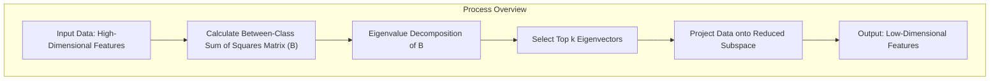
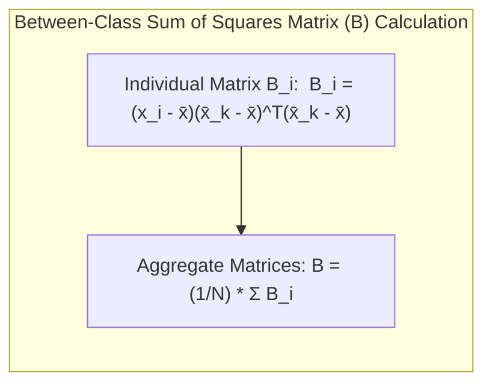
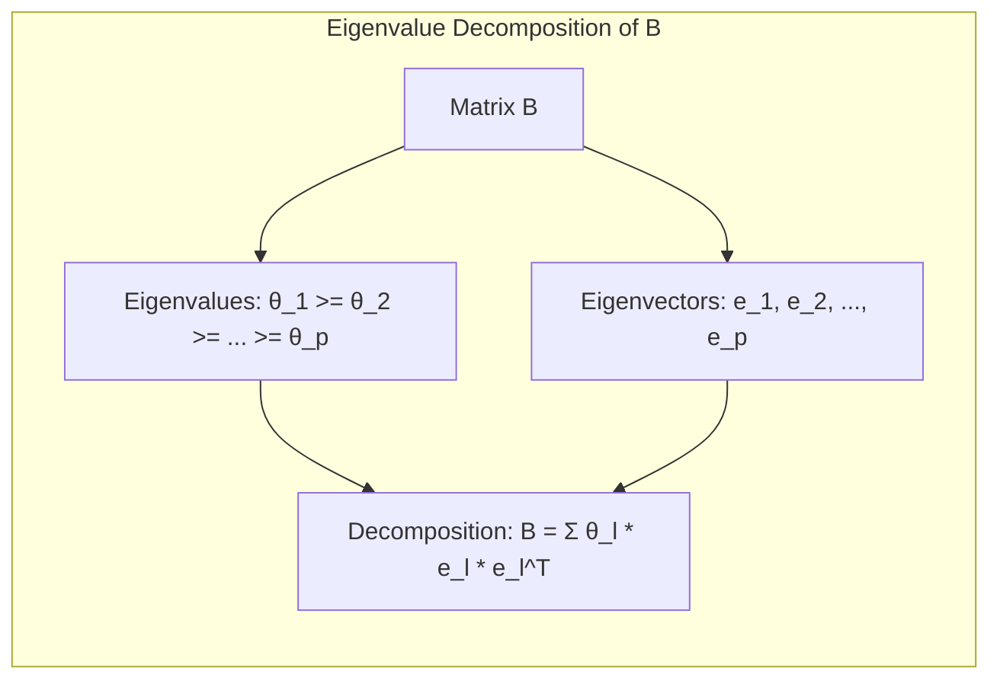
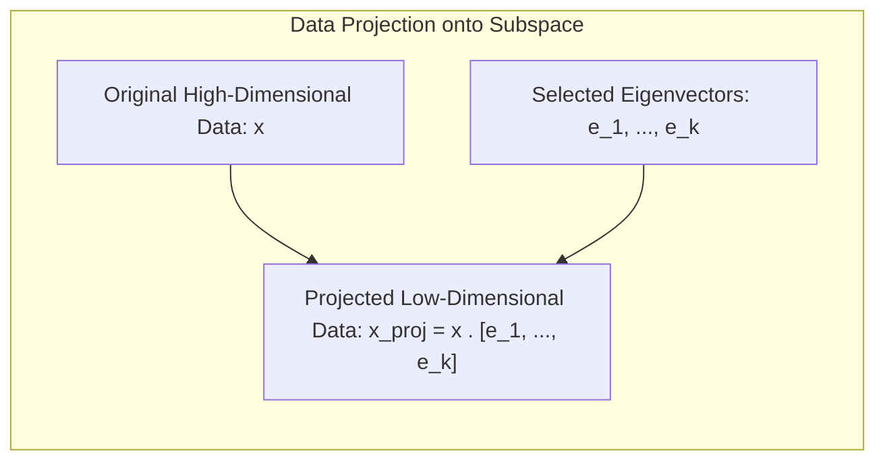
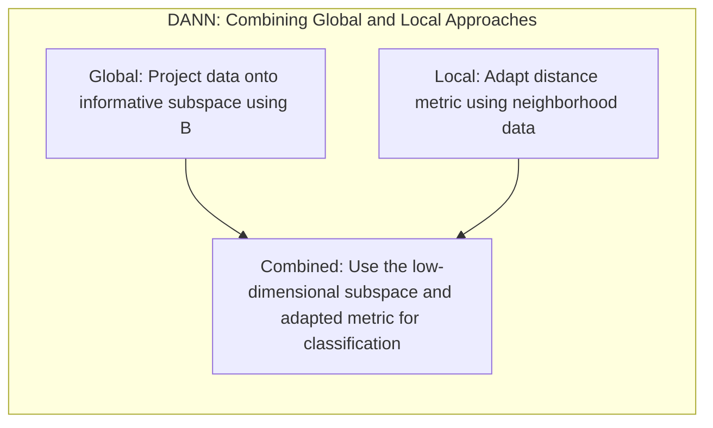

## Identificação de Subespaços Informativos de Baixa Dimensão com Matrizes de Soma de Quadrados Entre Classes e Decomposição em Autovetores

### Introdução

Este capítulo explora a identificação de **subespaços informativos de baixa dimensão** utilizando as **matrizes de soma de quadrados entre classes** e sua **decomposição em autovetores**, com o objetivo de reduzir a dimensionalidade dos dados e melhorar o desempenho de modelos de classificação [^13.4.2]. Em espaços de *features* de alta dimensão, onde a maldição da dimensionalidade pode prejudicar o aprendizado, é crucial identificar e utilizar apenas as *features* mais relevantes para a discriminação entre as classes. Analisaremos como as matrizes de soma de quadrados entre classes capturam a variabilidade entre as classes e como a decomposição em autovetores pode ser utilizada para identificar os subespaços que melhor separam as classes. Discutiremos também como essa abordagem pode ser utilizada para criar modelos de classificação mais eficientes e eficazes.

### Matrizes de Soma de Quadrados Entre Classes: Capturando a Variabilidade entre Grupos

As **matrizes de soma de quadrados entre classes (between-class sum of squares matrices)** são ferramentas fundamentais em análise discriminante que buscam capturar a variabilidade entre as médias das classes em um problema de classificação [^13.4.2]. Em vez de modelar a variabilidade individual dos dados, as matrizes de soma de quadrados entre classes focam na variabilidade que se relaciona com as diferenças entre os grupos (classes).

Para cada ponto de treino $x_i$, define-se uma matriz de soma de quadrados entre classes $B_i$ como:
$$B_i = (x_i - \bar{x})(\bar{x_k}-\bar{x})^T (\bar{x_k}-\bar{x})$$
Onde $\bar{x_k}$ é a média da classe a qual $x_i$ pertence, e $\bar{x}$ é a média global dos dados. Cada matriz $B_i$ busca medir o quanto esse ponto contribui para a variância entre as classes. Em seguida, essas matrizes $B_i$ são agregadas em uma matriz $B$ que representa a variabilidade entre classes, através da soma dessas matrizes e normalizando pelo número de amostras $N$:
$$B = \frac{1}{N} \sum_{i=1}^{N} B_i$$

A matriz $B$ resultante é uma representação da dispersão entre as classes no espaço de *features* original, e busca capturar em quais direções a diferenciação entre as classes é mais evidente. Em problemas com várias classes, essa matriz pode ser utilizada para guiar a projeção dos dados em um espaço de baixa dimensão onde as classes são melhor separadas.

**Lemma 153:** As matrizes de soma de quadrados entre classes capturam a variabilidade entre as médias das classes, e seus autovetores representam as direções de maior variação entre as classes.
*Prova*: A definição da matriz de covariância entre classes se baseia na variação da média de cada classe em relação a média geral, o que faz com que as direções com maior variância representem as direções onde as classes são mais separáveis. $\blacksquare$

**Corolário 153:** A matriz de soma de quadrados entre classes fornece uma representação da dispersão entre as classes, que é fundamental para identificar as *features* mais relevantes para a discriminação entre elas.

> ⚠️ **Nota Importante**: As matrizes de soma de quadrados entre classes capturam a variabilidade entre as médias das classes, o que fornece informações sobre as direções em que as classes são mais separáveis.

> ❗ **Ponto de Atenção**: O cálculo da matriz de covariância entre classes pode ser afetado por *outliers* e ruídos nos dados, o que pode requerer técnicas de pré-processamento.

> 💡 **Exemplo Numérico:**
> Vamos considerar um conjunto de dados com duas classes e duas *features*. Os dados são:
>
> Classe 1: $x_1 = [1, 2]$, $x_2 = [2, 3]$, $x_3 = [1, 3]$
> Classe 2: $x_4 = [4, 5]$, $x_5 = [5, 6]$, $x_6 = [4, 6]$
>
> Primeiro, calculamos as médias de cada classe:
> $\bar{x}_1 = \frac{1}{3}([1,2] + [2,3] + [1,3]) = [\frac{4}{3}, \frac{8}{3}]$
> $\bar{x}_2 = \frac{1}{3}([4,5] + [5,6] + [4,6]) = [\frac{13}{3}, \frac{17}{3}]$
>
> A média global é:
> $\bar{x} = \frac{1}{6}([1,2] + [2,3] + [1,3] + [4,5] + [5,6] + [4,6]) = [\frac{17}{6}, \frac{25}{6}]$
>
> Agora, calculamos as matrizes $B_i$:
>
> Para $x_1$:
> $B_1 = ([1,2] - [\frac{17}{6}, \frac{25}{6}])([\frac{4}{3}, \frac{8}{3}] - [\frac{17}{6}, \frac{25}{6}])^T = [-\frac{11}{6}, -\frac{13}{6}][-\frac{3}{6}, -\frac{3}{6}]^T = \begin{bmatrix} \frac{33}{36} & \frac{33}{36} \\ \frac{39}{36} & \frac{39}{36} \end{bmatrix}$
>
> De forma similar, calculamos $B_2, B_3, B_4, B_5, B_6$.
>
> Finalmente, calculamos a matriz B:
> $B = \frac{1}{6}(B_1 + B_2 + B_3 + B_4 + B_5 + B_6)$
>
> Após o cálculo (omitido por brevidade), obtemos uma matriz B que representa a dispersão entre as classes. Os autovetores dessa matriz apontarão para as direções onde as classes são mais separadas.

### Decomposição em Autovetores: Identificando Subespaços Informativos

A **decomposição em autovetores** das matrizes de soma de quadrados entre classes é uma técnica que permite identificar os **subespaços informativos de baixa dimensão** onde a variabilidade entre as classes é maximizada [^13.4.2]. Os autovetores representam as direções no espaço de *features* que maximizam a variabilidade entre classes, e os autovalores associados indicam a magnitude da variância nessas direções.

A decomposição em autovetores da matriz $B$ pode ser expressa como:

$$B = \sum_{l=1}^p \theta_l e_l e_l^T$$

Onde $\theta_l$ são os autovalores da matriz $B$, e $e_l$ são os autovetores correspondentes, e $p$ é o número de *features*. Os autovalores são ordenados em ordem decrescente ($\theta_1 \geq \theta_2 \geq \ldots \geq \theta_p$).

Os autovetores associados aos maiores autovalores definem um subespaço de baixa dimensão que captura a maior parte da variabilidade entre as classes. Ao projetar os dados nesse subespaço, as *features* relevantes para a discriminação entre classes são preservadas, enquanto as *features* irrelevantes ou ruidosas são atenuadas.

O número de autovetores a serem utilizados para definir o subespaço de baixa dimensão é um hiperparâmetro do modelo, e pode ser definido com base nos autovalores correspondentes, mantendo apenas as dimensões com autovalores grandes, ou por outras técnicas de seleção.

**Lemma 154:** A decomposição em autovetores das matrizes de soma de quadrados entre classes identifica os subespaços de menor dimensionalidade onde a variabilidade entre as classes é maximizada.
*Prova*: Ao ordenar os autovalores, a decomposição em autovetores identifica as direções do espaço que possuem a maior variância entre as classes, que são as mais importantes para discriminar entre elas. $\blacksquare$

**Corolário 154:** A projeção dos dados nos subespaços de alta variância entre classes resulta em dados onde o sinal de classe é mais fácil de detectar e utilizar.

> ⚠️ **Nota Importante**: A decomposição em autovetores da matriz de soma de quadrados entre classes identifica os subespaços de menor dimensão onde a variabilidade entre as classes é mais relevante.

> ❗ **Ponto de Atenção**:  A escolha do número de autovetores que definem o subespaço de menor dimensão influencia o equilíbrio entre a redução da dimensionalidade e a preservação das informações relevantes.

> 💡 **Exemplo Numérico:**
> Continuando o exemplo anterior, vamos supor que após calcular a matriz $B$, sua decomposição em autovetores nos dá os seguintes resultados:
>
> Autovalores: $\theta_1 = 5.2$, $\theta_2 = 0.1$
> Autovetores: $e_1 = [0.707, 0.707]$, $e_2 = [-0.707, 0.707]$
>
> Como $\theta_1$ é muito maior que $\theta_2$, o primeiro autovetor $e_1$ representa a direção de maior variabilidade entre as classes. Se quisermos reduzir a dimensionalidade para 1, projetaríamos os dados nesse autovetor.
>
> Para projetar o ponto $x_1 = [1, 2]$ no subespaço definido por $e_1$, calcularíamos:
> $x_1^{proj} = x_1 \cdot e_1 = [1, 2] \cdot [0.707, 0.707] = 1 \times 0.707 + 2 \times 0.707 = 2.121$
>
> Assim, o ponto $x_1$ seria representado por um único valor $2.121$ no subespaço de baixa dimensão. Os outros pontos seriam projetados de forma similar.

### Utilizando os Subespaços: Projetando os Dados e Reduzindo o Viés

Após identificar os subespaços informativos de baixa dimensão utilizando a decomposição em autovetores, os dados são projetados nesse subespaço, o que reduz a dimensionalidade do problema e permite que métodos de classificação como o k-NN atuem de forma mais eficiente [^13.4.2].

A projeção dos dados no subespaço de baixa dimensão é feita por meio da multiplicação dos dados pelo conjunto de autovetores que define o subespaço, selecionados com base na magnitude de seus autovalores. Essa projeção tem os seguintes efeitos:

1.  **Redução da Dimensionalidade:** O número de *features* utilizadas pelo modelo é reduzido, o que diminui a complexidade computacional e a suscetibilidade à maldição da dimensionalidade.
2.  **Preservação da Variabilidade Entre Classes:** A projeção é feita em um subespaço onde a variabilidade entre as classes é maximizada, o que permite manter as informações relevantes para a discriminação entre as classes.
3.  **Redução do Ruído:** Ao projetar os dados em um subespaço de baixa dimensão, as *features* menos relevantes são atenuadas, o que reduz o impacto do ruído e melhora a capacidade de generalização do modelo.

Com essa abordagem, é possível construir modelos de classificação mais eficazes, combinando técnicas de redução de dimensionalidade (projeção global) com técnicas de adaptação local da métrica (DANN), o que garante que o modelo se adapte à estrutura dos dados e capture as informações relevantes para a classificação.

**Lemma 155:** A projeção dos dados nos subespaços identificados pela decomposição em autovetores permite reduzir a dimensionalidade e preservar informações sobre as classes, o que melhora a capacidade do modelo de lidar com dados complexos de alta dimensão.
*Prova*: A projeção para um subespaço definido pelos autovetores que correspondem a maiores autovalores permite que o modelo se foque nas dimensões com maior variabilidade entre classes, e que são, portanto, as mais discriminantes. $\blacksquare$

**Corolário 155:** A combinação da projeção com métodos locais como o DANN cria uma metodologia que busca um equilíbrio entre simplicidade computacional (redução da dimensão) e melhor capacidade de generalização.

> ⚠️ **Nota Importante**:  A projeção dos dados em um subespaço de baixa dimensão permite reduzir a complexidade computacional e o impacto do ruído no processo de classificação.

> ❗ **Ponto de Atenção**: A escolha do número de autovetores para definir a dimensionalidade do subespaço, e a técnica de redução de dimensionalidade utilizada, influenciam o desempenho do modelo.

### DANN e Subespaços Informativos: Combinando Abordagens Globais e Locais

O algoritmo **DANN (Discriminant Adaptive Nearest Neighbors)**, como descrito anteriormente, combina o uso de **subespaços informativos** de baixa dimensão com a **adaptação local da métrica de distância** [^13.4.2]. Essa combinação permite que o DANN lide de forma eficaz com problemas de classificação complexos, que apresentam dados de alta dimensão, ruído, e distribuições não uniformes.

O DANN utiliza a decomposição em autovetores das matrizes de soma de quadrados entre classes para identificar os subespaços de baixa dimensão, e em seguida projeta os dados nesses subespaços. No subespaço de baixa dimensão, o DANN aplica o mecanismo de adaptação local da métrica, utilizando as informações da vizinhança do ponto de consulta, e a matriz de covariância entre as classes para definir a métrica de distância.

Essa abordagem combina as vantagens das técnicas globais (redução de dimensionalidade) e locais (adaptação da métrica):

1.  **Redução da Dimensionalidade:** A projeção dos dados em um subespaço de menor dimensão diminui a complexidade computacional e atenua o efeito da maldição da dimensionalidade.
2.  **Adaptação Local:** A adaptação local da métrica de distância com base na estrutura dos dados permite que o modelo capture as particularidades de cada região do espaço de *features* e que modele fronteiras de decisão complexas.
3.  **Redução de Viés e Variância:** A combinação da redução de dimensionalidade e da adaptação local da métrica de distância reduz tanto o viés como a variância do modelo, o que permite um melhor desempenho de generalização.

A combinação dessas técnicas torna o DANN uma abordagem eficaz para lidar com problemas de classificação com dados de alta dimensão, ruído e complexidade na distribuição das classes.

**Lemma 156:** A combinação da redução de dimensionalidade com adaptação local da métrica no DANN permite que o modelo capture tanto as características globais quanto as particularidades locais dos dados, apresentando melhor performance em comparação com outras abordagens.
*Prova*: A redução de dimensionalidade atua na mitigação do problema da maldição da dimensionalidade, e a adaptação local permite que o modelo selecione os vizinhos mais relevantes para a decisão. $\blacksquare$

**Corolário 156:** O DANN utiliza uma metodologia que equilibra a necessidade de modelos simples com a necessidade de adaptar os modelos a dados complexos.

> ⚠️ **Nota Importante**:  O DANN combina redução de dimensionalidade com adaptação local da métrica, o que permite que o modelo capture tanto a estrutura global quanto as particularidades locais dos dados.

> ❗ **Ponto de Atenção**: A implementação do DANN envolve a escolha da técnica de redução de dimensionalidade e o cálculo das matrizes de covariância localmente, o que pode aumentar a sua complexidade computacional.

### Conclusão

A identificação de subespaços informativos de baixa dimensão por meio das matrizes de soma de quadrados entre classes e sua decomposição em autovetores é uma abordagem poderosa para reduzir a complexidade e o ruído em espaços de *features* de alta dimensão. A combinação dessa abordagem com a adaptação local da métrica de distância no DANN permite criar modelos de classificação mais eficazes e robustos, capazes de lidar com dados complexos e variáveis. O DANN representa, portanto, uma evolução do k-NN que combina o melhor de ambas as abordagens: a capacidade de trabalhar com vizinhanças locais, e a utilização de informações globais para melhorar o desempenho.

### Footnotes

[^13.4.2]: "The discriminant-adaptive nearest-neighbor method carries out local dimension reduction that is, dimension reduction separately at each query point. In many problems we can also benefit from global dimension reduction, that is, apply a nearest-neighbor rule in some optimally chosen subspace of the original feature space...At each training point xi, the between-centroids sum of squares matrix Bi is computed, and then these matrices are averaged over all training points: B = 1/N * Σ Bi...Let e1, e2,..., ep be the eigenvectors of the matrix B, ordered from largest to smallest eigenvalue θk." *(Trecho de "13. Prototype Methods and Nearest-Neighbors")*
