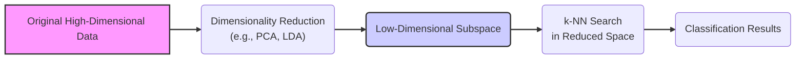
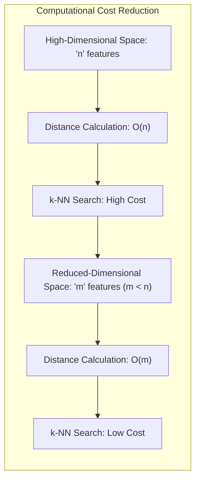
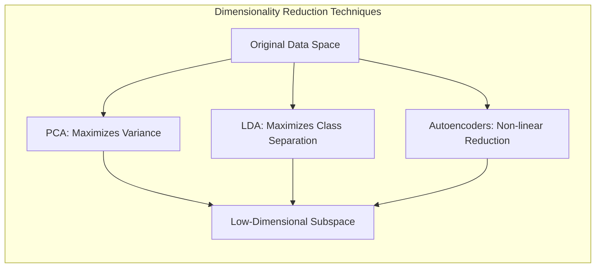
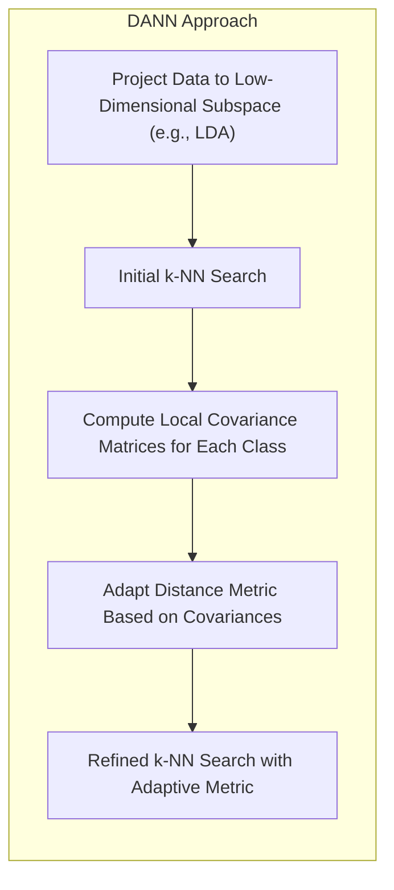
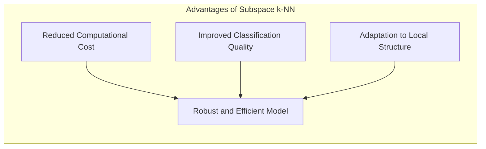

## Busca de Vizinhos Mais Próximos em Subespaços Reduzidos: Eficiência e Precisão na Classificação

### Introdução

Este capítulo explora a aplicação da **busca de vizinhos mais próximos** em **subespaços reduzidos**, demonstrando como a combinação de técnicas de redução de dimensionalidade com o método de **k-vizinhos mais próximos (k-NN)** pode levar a modelos de classificação mais eficientes e precisos [^13.4.2]. Em problemas de alta dimensão, o cálculo das distâncias entre os pontos no espaço original pode ser computacionalmente custoso e levar a resultados enviesados devido à maldição da dimensionalidade. Analisaremos como a projeção dos dados em um subespaço de menor dimensão permite realizar a busca dos vizinhos mais próximos de forma mais rápida e eficiente, e como a escolha adequada do subespaço e do método de redução de dimensionalidade influencia o desempenho do modelo.

### Busca de Vizinhos em Subespaços Reduzidos: Eficiência Computacional

A busca de vizinhos mais próximos em um espaço de *features* de alta dimensão pode ser computacionalmente custosa, especialmente quando o conjunto de dados de treinamento é grande. A projeção dos dados em um **subespaço reduzido** diminui o número de *features* utilizadas pelo k-NN, o que leva a uma **melhora significativa na eficiência computacional** do processo de busca dos vizinhos mais próximos.

A redução de dimensionalidade permite que o cálculo das distâncias entre os pontos seja realizado em um espaço com menor número de dimensões, o que reduz o número de operações necessárias para identificar os $k$ vizinhos mais próximos de um ponto de consulta. Essa redução da complexidade computacional é particularmente importante em aplicações de aprendizado de máquina onde a classificação precisa ser realizada de forma rápida e eficiente, como o processamento de fluxos de dados ou o reconhecimento de padrões em tempo real.

Além da redução da complexidade computacional, a busca de vizinhos em um subespaço reduzido também pode melhorar a qualidade da classificação, por atenuar o efeito da maldição da dimensionalidade. Ao projetar os dados em um espaço de menor dimensão onde as *features* mais relevantes são preservadas, o k-NN pode selecionar vizinhos mais representativos e obter uma melhor aproximação da distribuição local das classes.

**Lemma 157:** A busca de vizinhos mais próximos em um subespaço reduzido, obtido por meio de técnicas como PCA ou LDA, permite reduzir a complexidade computacional e o impacto da maldição da dimensionalidade.
*Prova*: A redução do número de *features* no espaço de busca diminui a quantidade de operações de cálculo da distância para cada ponto, o que resulta em uma busca mais eficiente. $\blacksquare$

**Corolário 157:** A projeção para subespaços de menor dimensão preserva as informações relevantes para a classificação e aumenta a eficiência do k-NN.

> ⚠️ **Nota Importante**: A busca de vizinhos em um subespaço reduzido diminui a complexidade computacional do k-NN e permite selecionar os vizinhos mais relevantes.

> ❗ **Ponto de Atenção**: A escolha da técnica de redução de dimensionalidade e da dimensionalidade do subespaço influencia o desempenho do modelo e deve ser feita considerando as características do problema.

> 💡 **Exemplo Numérico:**
> Imagine que temos um conjunto de dados com 1000 pontos e 100 *features*. Para encontrar os vizinhos mais próximos de um ponto de consulta, o k-NN precisa calcular a distância entre esse ponto e os 1000 pontos usando as 100 *features*. Se usarmos a distância euclidiana, isso implica em $1000 \times 100$ cálculos de diferença, $1000 \times 100$ operações de elevação ao quadrado e $1000$ somas.
>
> Agora, suponha que aplicamos PCA e reduzimos a dimensionalidade para 10 *features*. O k-NN agora precisa calcular a distância entre o ponto de consulta e os 1000 pontos, mas usando apenas 10 *features*. Isso reduz o número de cálculos de diferença para $1000 \times 10$, o número de operações de elevação ao quadrado para $1000 \times 10$ e o número de somas para $1000$.
>
> Essa redução na dimensionalidade diminui drasticamente o custo computacional da busca. Além disso, ao utilizar PCA, as *features* que mais contribuem para a variância dos dados são preservadas, o que ajuda a manter a qualidade da classificação.

### Técnicas de Projeção: PCA e LDA para Subespaços Informativos

A escolha da técnica de **redução de dimensionalidade** utilizada para projetar os dados em um subespaço de menor dimensão é um passo importante no processo de criação de modelos k-NN mais eficientes [^13.4.2]. Algumas das técnicas mais comuns incluem:

1.  **Análise de Componentes Principais (PCA):** A PCA é uma técnica linear não supervisionada que busca encontrar as direções (componentes principais) que maximizam a variância dos dados, e as utiliza para projetar os dados em um subespaço de menor dimensão. A PCA preserva a informação da distribuição dos dados que explica a maior parte da variância do conjunto de treino, e não considera a informação sobre os rótulos das classes.
2.  **Análise Discriminante Linear (LDA):** A LDA é uma técnica linear supervisionada que busca encontrar as direções que maximizam a separação entre as médias das classes, e a utiliza para projetar os dados em um subespaço de menor dimensão. A LDA busca otimizar o subespaço de forma a maximizar a discriminação entre as classes.
3.  **Autoencoders:** Autoencoders são redes neurais que comprimem os dados em espaços de menor dimensão, e podem ser utilizados como uma alternativa não linear para obter subespaços de baixa dimensão.

A escolha da técnica de projeção depende das características dos dados e do objetivo da tarefa de classificação. Se o objetivo principal é reduzir a dimensionalidade, a PCA pode ser suficiente. Se o objetivo é maximizar a separação entre as classes, a LDA pode ser mais apropriada. O uso de autoencoders permite uma redução de dimensionalidade não linear.

**Lemma 158:** A escolha da técnica de projeção, como PCA ou LDA, influencia a forma como o subespaço de menor dimensão é definido, e a escolha mais adequada depende da natureza dos dados e do problema de classificação.
*Prova*: PCA prioriza a variabilidade dos dados, enquanto LDA prioriza a separação entre classes. $\blacksquare$

**Corolário 158:** Técnicas de redução de dimensionalidade preservam a informação relevante para a classificação no subespaço, o que permite melhorar a eficiência do k-NN.

> ⚠️ **Nota Importante**:  A escolha da técnica de projeção influencia a estrutura do subespaço de baixa dimensão e o desempenho do k-NN nesse espaço.

> ❗ **Ponto de Atenção**:  A PCA é uma técnica não supervisionada, enquanto a LDA é supervisionada, o que torna a LDA mais adequada quando a informação da classe é relevante para a projeção dos dados.

> 💡 **Exemplo Numérico:**
> Suponha que temos um conjunto de dados com duas classes (A e B) e três *features* ($x_1$, $x_2$, $x_3$).
>
> **PCA:** Ao aplicar PCA, podemos descobrir que a maior parte da variabilidade dos dados é explicada pelas *features* $x_1$ e $x_2$, e que a *feature* $x_3$ contribui muito pouco para a variabilidade. Assim, a PCA projetaria os dados em um subespaço de duas dimensões, usando $x_1$ e $x_2$.
>
> **LDA:** Se as classes A e B forem bem separadas em relação à *feature* $x_3$, mesmo que $x_3$ tenha baixa variabilidade, a LDA pode gerar um subespaço onde a *feature* $x_3$ tenha mais importância, pois ela discrimina as classes.
>
> A escolha entre PCA e LDA dependerá do problema. Se a separação entre as classes não for um fator importante e a variabilidade for o foco principal, PCA é melhor. Se a separação entre as classes for importante, LDA é mais adequado.

### Busca com Distâncias Adaptativas no Subespaço Projetado

Em conjunto com a projeção dos dados em um subespaço de baixa dimensão, é possível utilizar métricas de distância adaptativas para refinar a busca dos vizinhos mais próximos, como no algoritmo **DANN (Discriminant Adaptive Nearest Neighbors)** [^13.4.2].

Nesse cenário, o DANN utiliza a decomposição de autovetores das matrizes de covariância entre classes para criar um subespaço de projeção (como LDA), e a busca dos vizinhos mais próximos é realizada no subespaço reduzido. Após a seleção dos vizinhos, a métrica de distância adaptativa do DANN é aplicada para refinar a busca dos vizinhos e selecionar aqueles que são mais relevantes para a classificação.

Essa abordagem combina as vantagens das técnicas globais (redução de dimensionalidade) com as vantagens das técnicas locais (adaptação da métrica de distância), o que permite que o k-NN obtenha o melhor desempenho possível no problema de classificação.

Ao utilizar uma métrica adaptativa no subespaço reduzido, o k-NN se torna mais robusto a ruído e outliers, pois a métrica enfatiza as características mais relevantes para a classificação na região local, e se beneficia da redução do problema e informações locais para um ajuste fino.

**Lemma 159:** A busca de vizinhos no subespaço projetado com métricas adaptativas, como no DANN, combina a eficiência da projeção com a capacidade de adaptação local da métrica de distância, e resulta em modelos mais robustos e precisos.
*Prova*: Ao utilizar o subespaço projetado, o algoritmo de classificação pode focar nas informações mais discriminativas, e ao utilizar métricas adaptativas, os vizinhos mais relevantes para a decisão local podem ser selecionados. $\blacksquare$

**Corolário 159:** O uso de métricas adaptativas em espaços de baixa dimensionalidade melhora a capacidade de discriminação entre as classes e a robustez dos modelos.

> ⚠️ **Nota Importante**: A busca de vizinhos com métricas adaptativas em subespaços de baixa dimensão combina as vantagens de diferentes abordagens para obter melhor desempenho em problemas de classificação complexos.

> ❗ **Ponto de Atenção**: A implementação de técnicas de projeção e métricas de distância adaptativas aumenta a complexidade do algoritmo k-NN, e sua utilização deve ser avaliada em relação aos benefícios que oferece.

> 💡 **Exemplo Numérico:**
>
> Suponha que após aplicar PCA, reduzimos os dados para 2 dimensões, e temos um novo ponto a ser classificado. No espaço reduzido, os 5 vizinhos mais próximos (usando distância euclidiana padrão) são selecionados.
>
> **DANN:** O DANN, após a seleção dos vizinhos, calcularia uma matriz de covariância local para cada classe dentro desses 5 vizinhos. Digamos que a classe A tenha uma alta variância na primeira dimensão e baixa na segunda, e a classe B tenha o oposto.
>
> A métrica adaptativa do DANN então daria mais peso à primeira dimensão para os vizinhos da classe A e mais peso à segunda dimensão para os vizinhos da classe B. Isso significa que, ao classificar o novo ponto, a distância para os vizinhos da classe A será calculada com um peso maior na primeira dimensão, enquanto que a distância para os vizinhos da classe B terá um peso maior na segunda dimensão.
>
> Isso refina a busca de vizinhos, dando mais peso às dimensões que melhor separam as classes localmente, tornando o método mais robusto ao ruído.

### Vantagens e Aplicações: Modelos Mais Eficientes e Robusto

A combinação da projeção em um subespaço reduzido com a busca dos vizinhos mais próximos utilizando métricas adaptativas resulta em modelos de classificação mais eficientes e robustos, que apresentam as seguintes vantagens:

1.  **Redução da Complexidade Computacional:** A busca dos vizinhos mais próximos é realizada em um subespaço de menor dimensão, o que reduz o número de operações necessárias para calcular as distâncias e o tempo de classificação.
2.  **Melhora da Qualidade da Classificação:** A projeção dos dados para um subespaço informativo permite selecionar os vizinhos mais relevantes para a classificação, atenuando o efeito do ruído e melhorando a capacidade de generalização do modelo.
3.  **Adaptação à Estrutura Local:** A utilização de métricas de distância adaptativas permite que o modelo se ajuste à estrutura local dos dados, o que o torna mais robusto a variações na distribuição e no ruído dos dados.

Essa combinação de técnicas globais e locais tem sido utilizada em diversas aplicações, incluindo classificação de imagens, reconhecimento de voz, análise de dados genômicos, entre outras, com resultados promissores. A capacidade de lidar com a alta dimensionalidade e a complexidade dos dados torna essa abordagem uma alternativa eficaz para a construção de modelos de aprendizado de máquina mais eficientes e robustos.

**Lemma 160:** A combinação de técnicas de redução de dimensionalidade e métodos adaptativos, como o DANN, resulta em modelos mais eficientes computacionalmente, com boa capacidade de generalização e robustos a ruído.
*Prova*: A redução de dimensionalidade atua na eliminação de *features* irrelevantes, e a adaptação local permite que o modelo tome decisões mais precisas. $\blacksquare$

**Corolário 160:** A combinação de técnicas globais e locais permite que o k-NN seja adaptado a diferentes tipos de problemas, obtendo resultados eficientes em contextos complexos.

> ⚠️ **Nota Importante**: A combinação da busca em subespaços reduzidos com métricas adaptativas permite construir modelos k-NN mais eficientes e robustos para problemas com alta dimensionalidade.

> ❗ **Ponto de Atenção**: A escolha da técnica de redução de dimensionalidade e da métrica adaptativa depende do problema específico e requer uma avaliação cuidadosa da estrutura dos dados.

### Conclusão

A busca de vizinhos mais próximos em subespaços reduzidos, combinada com métricas adaptativas, é uma abordagem eficaz para lidar com a maldição da dimensionalidade e melhorar o desempenho do k-NN em problemas de classificação complexos. A combinação de técnicas globais de redução de dimensionalidade com abordagens locais de adaptação da métrica de distância permite que o k-NN seja mais eficiente, preciso e robusto, o que o torna uma ferramenta ainda mais valiosa em aplicações do mundo real. A compreensão desses conceitos e suas implicações é fundamental para projetar modelos de aprendizado de máquina que sejam capazes de lidar com desafios da alta dimensionalidade e da complexidade dos dados.

### Footnotes

[^13.4.2]: "The discriminant-adaptive nearest-neighbor method carries out local dimension reduction that is, dimension reduction separately at each query point. In many problems we can also benefit from global dimension reduction, that is, apply a nearest-neighbor rule in some optimally chosen subspace of the original feature space...At each training point xi, the between-centroids sum of squares matrix Bi is computed, and then these matrices are averaged over all training points...Operationally, we project the data into the leading four-dimensional subspace, and then carry out nearest neighbor classification." *(Trecho de "13. Prototype Methods and Nearest-Neighbors")*
