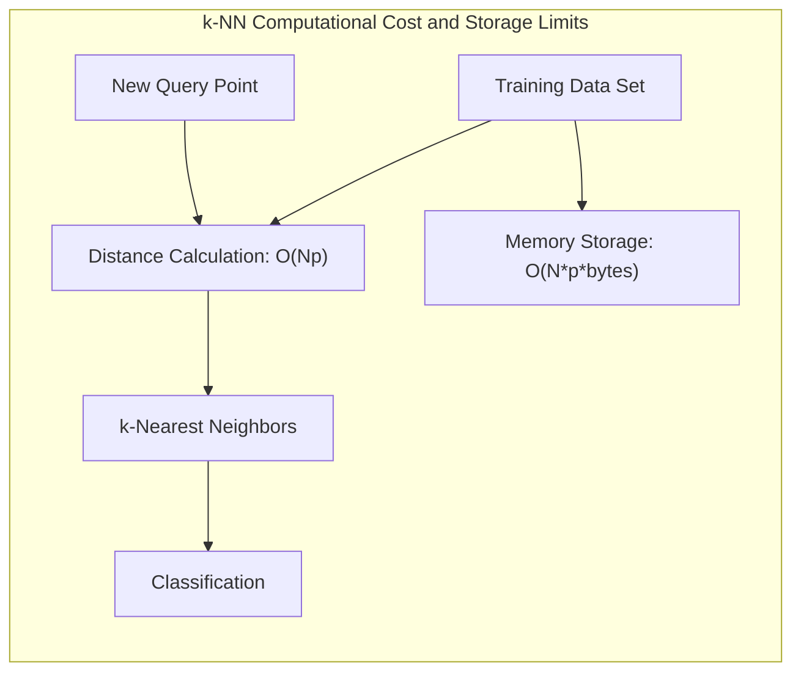
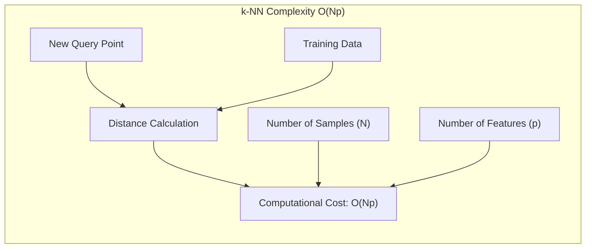
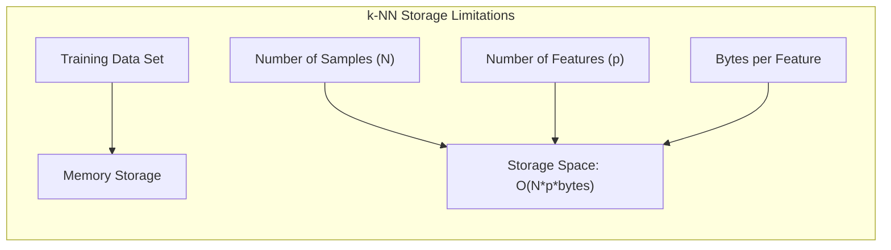
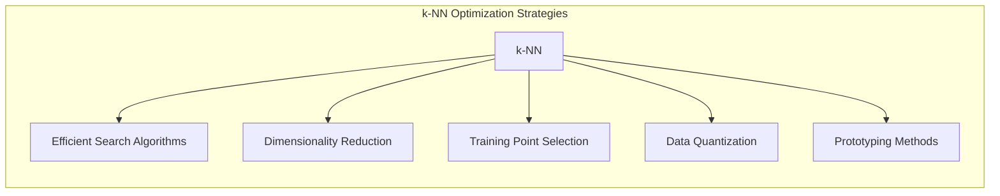

## Custo Computacional do k-NN: Complexidade O(Np) e as Limitações de Armazenamento em Grandes Conjuntos de Dados



### Introdução

Este capítulo explora o **custo computacional** associado ao método de **k-vizinhos mais próximos (k-NN)**, com foco em como a complexidade de **O(Np)** para cada nova amostra, onde $N$ é o número de amostras e $p$ o número de *features*, e como o **armazenamento do conjunto de dados completo** se torna uma limitação em problemas com grandes conjuntos de dados [^13.3]. Analisaremos como a necessidade de calcular a distância entre um novo ponto de consulta e todos os pontos de treinamento no conjunto de dados original torna o k-NN computacionalmente caro, especialmente em cenários com alta dimensionalidade e grande número de amostras, e como essa limitação afeta a escalabilidade do método. Abordaremos também as estratégias de otimização e outras técnicas que podem ser utilizadas para reduzir o custo computacional do k-NN.

### Complexidade Computacional do k-NN: Custo O(Np) por Amostra

A principal limitação do método de **k-vizinhos mais próximos (k-NN)** em termos de custo computacional reside na necessidade de calcular a distância entre cada novo ponto de consulta e todos os pontos de treinamento [^13.3]. A complexidade computacional dessa operação é **O(Np)**, onde $N$ é o número de amostras de treinamento e $p$ é o número de *features*.



O custo de O(Np) significa que o tempo necessário para classificar um novo ponto cresce linearmente tanto com o número de amostras ($N$) quanto com o número de *features* ($p$). Isso torna o k-NN computacionalmente caro em cenários com grandes conjuntos de dados, onde tanto $N$ quanto $p$ podem ser muito altos.

Essa complexidade computacional é uma consequência da natureza do k-NN, que adia a decisão de classificação até que um ponto de consulta seja apresentado. Ao invés de utilizar uma fase de treinamento separada para ajustar um modelo, o k-NN realiza todos os cálculos necessários no momento da classificação. Embora essa abordagem seja flexível e adaptável, ela também implica um alto custo computacional, o que pode limitar a escalabilidade do k-NN para problemas com grandes conjuntos de dados.

**Lemma 161:** O cálculo da distância entre um novo ponto de consulta e todos os pontos de treinamento, que é necessário no k-NN para encontrar os vizinhos mais próximos, resulta em uma complexidade computacional de O(Np), onde N é o número de amostras de treinamento e p é o número de *features*.
*Prova*: O algoritmo do k-NN calcula a distância entre um ponto e N pontos com p *features* cada, o que leva a uma complexidade de O(Np). $\blacksquare$

**Corolário 161:** A complexidade computacional do k-NN torna o algoritmo menos eficiente em problemas com grandes conjuntos de dados e alta dimensionalidade, com uma complexidade que cresce linearmente em relação a esses parâmetros.

> 💡 **Exemplo Numérico:**
>
> Imagine um cenário em que você tem um conjunto de dados com 10.000 amostras ($N = 10000$) e cada amostra possui 50 *features* ($p = 50$). Ao classificar um novo ponto usando k-NN, você precisará calcular a distância entre esse ponto e cada uma das 10.000 amostras. Isso significa que você terá que realizar um total de 10.000 * 50 = 500.000 operações de cálculo de distância para cada ponto que você quer classificar. Se você aumentar o número de amostras para 100.000 ($N = 100000$), o número de operações sobe para 100.000 * 50 = 5.000.000. Isso demonstra como o custo computacional do k-NN aumenta linearmente com o número de amostras e *features*.
>
> ```python
> import numpy as np
>
> # Cenário 1: N = 10000, p = 50
> N1 = 10000
> p1 = 50
> total_dist_calc1 = N1 * p1
> print(f"Cenário 1: N={N1}, p={p1}, Total de cálculos de distância = {total_dist_calc1}")
>
> # Cenário 2: N = 100000, p = 50
> N2 = 100000
> p2 = 50
> total_dist_calc2 = N2 * p2
> print(f"Cenário 2: N={N2}, p={p2}, Total de cálculos de distância = {total_dist_calc2}")
> ```
>
> Este exemplo ilustra o crescimento do custo computacional com o aumento do número de amostras, mostrando a natureza O(Np) do k-NN.

> ⚠️ **Nota Importante**:  O k-NN apresenta uma complexidade computacional de O(Np) por amostra, o que torna o método caro em problemas com grandes conjuntos de dados.

> ❗ **Ponto de Atenção**: O custo computacional do k-NN pode ser proibitivo em aplicações onde a classificação precisa ser realizada em tempo real ou para dados de grande escala.

### Limitações de Armazenamento: O Desafio de Grandes Conjuntos de Dados

Além da complexidade computacional, outra limitação importante do k-NN é a necessidade de **armazenar todo o conjunto de dados de treinamento** na memória, o que pode se tornar um problema em cenários com grandes conjuntos de dados [^13.3]. Essa característica, típica de métodos baseados em memória, dificulta a aplicação do k-NN em problemas onde a quantidade de dados é muito grande e os recursos de armazenamento são limitados.



A necessidade de armazenar todo o conjunto de dados de treinamento é uma consequência da natureza *model-free* do k-NN, que não realiza uma fase de treinamento explícita para gerar parâmetros. O k-NN simplesmente guarda todos os dados e os utiliza para classificar novos pontos, o que leva a um uso de memória crescente conforme o tamanho do conjunto de treinamento aumenta.

Essa limitação de armazenamento torna o k-NN menos escalável do que outras abordagens de aprendizado de máquina que utilizam modelos paramétricos e que requerem o armazenamento de um conjunto de parâmetros e não dos dados de treino.

**Lemma 162:** A necessidade de armazenar o conjunto de dados de treinamento completo torna o k-NN um método pouco escalável para problemas com grandes volumes de dados.
*Prova*: O k-NN precisa guardar cada ponto para o cálculo da distância e a classificação de novos dados, e o espaço de armazenamento aumenta linearmente com o tamanho do conjunto de treino. $\blacksquare$

**Corolário 162:**  O alto consumo de memória e a complexidade computacional limitam a aplicabilidade do k-NN em problemas com grandes conjuntos de dados, onde é necessário considerar alternativas com menor custo computacional e de memória.

> 💡 **Exemplo Numérico:**
>
> Considere um conjunto de dados com 1 milhão de amostras ($N = 1,000,000$) e cada amostra tem 100 *features* ($p = 100$). Se cada *feature* for armazenada como um número de ponto flutuante de 64 bits (8 bytes), o espaço total necessário para armazenar o conjunto de dados será:
>
> $ Espaço = N \times p \times bytes\_por\_feature $
> $ Espaço = 1,000,000 \times 100 \times 8 $ bytes
> $ Espaço = 800,000,000 $ bytes
> $ Espaço = 800 $ MB (aproximadamente)
>
> Isso significa que para armazenar o conjunto de dados na memória, você precisaria de cerca de 800 MB de RAM. Se você tiver vários conjuntos de dados ou conjuntos de dados ainda maiores, o requisito de memória rapidamente se torna uma limitação. Para datasets com 10 milhões de amostras, o espaço necessário seria de 8GB, e para 100 milhões de amostras, 80GB.
>
> ```python
> # Exemplo de cálculo do espaço de armazenamento
> N = 1000000 # 1 milhão de amostras
> p = 100     # 100 features
> bytes_per_feature = 8 # 8 bytes por feature (float64)
>
> storage_space_bytes = N * p * bytes_per_feature
> storage_space_mb = storage_space_bytes / (1024 * 1024)
>
> print(f"Espaço de armazenamento necessário: {storage_space_mb:.2f} MB")
> ```
>
> Este exemplo demonstra como o armazenamento de grandes conjuntos de dados pode se tornar um problema real, limitando a aplicabilidade do k-NN em cenários com recursos de memória restritos.

> ⚠️ **Nota Importante**: O k-NN exige o armazenamento de todo o conjunto de dados de treinamento, o que pode se tornar um problema em cenários com grandes volumes de dados.

> ❗ **Ponto de Atenção**:  A necessidade de armazenar todo o conjunto de dados e o alto custo computacional de encontrar os vizinhos mais próximos torna o k-NN menos adequado para aplicações que exigem um tempo de resposta rápido e eficiente.

### Estratégias para Reduzir o Custo Computacional e de Armazenamento

Existem diversas estratégias para reduzir o **custo computacional** e de **armazenamento** do k-NN, que incluem:

1.  **Algoritmos de Busca Eficiente:** A utilização de algoritmos de busca eficientes, como árvores KD ou *ball trees*, pode reduzir significativamente o tempo necessário para encontrar os vizinhos mais próximos, melhorando a eficiência computacional do k-NN. Esses algoritmos utilizam estruturas de dados que facilitam a busca em dados de alta dimensionalidade, sem necessitar o cálculo da distância para todos os pontos de treino.
2.  **Redução de Dimensionalidade:** A projeção dos dados em subespaços de menor dimensão, utilizando técnicas como PCA (Análise de Componentes Principais) ou LDA (Análise Discriminante Linear), permite reduzir o número de *features* e, consequentemente, o custo computacional da busca por vizinhos.
3.  **Seleção de Pontos de Treinamento:** A utilização de técnicas de seleção de pontos de treinamento para identificar e descartar amostras redundantes ou ruidosas no conjunto de treinamento. Métodos como os algoritmos de edição e condensação podem ser utilizados para reduzir o número de pontos de treino.
4.  **Quantização de Dados:** A redução da precisão dos valores das *features*, utilizando técnicas de quantização, pode diminuir o custo de armazenamento, ao reduzir o número de bits necessários para representar os dados.
5. **Métodos de Prototipagem:** Modelos de protótipos como o LVQ e GMMs podem ser usados para representar os dados de treino através de um número menor de protótipos, o que diminui a necessidade de armazenar todos os dados de treino.



A escolha da abordagem mais apropriada depende das características específicas de cada problema, e a combinação de diferentes técnicas pode levar a resultados mais eficientes.

**Lemma 163:** A utilização de algoritmos de busca eficientes, técnicas de redução de dimensionalidade, seleção de pontos de treinamento e quantização de dados permite reduzir tanto o custo computacional quanto o custo de armazenamento do k-NN.
*Prova*: As técnicas apresentadas permitem reduzir o número de dimensões, a quantidade de dados de treino, e reduzir a necessidade de cálculos repetitivos, impactando o custo de armazenamento e computacional do k-NN. $\blacksquare$

**Corolário 163:** A escolha da abordagem de otimização mais apropriada depende do *tradeoff* entre eficiência computacional, precisão e complexidade do modelo, e deve ser definida por meio de avaliação de desempenho.

> 💡 **Exemplo Numérico:**
>
> Vamos ilustrar como a redução de dimensionalidade via PCA pode impactar o custo computacional. Suponha que temos um conjunto de dados com 10.000 amostras ($N = 10000$) e 200 *features* ($p=200$). Ao aplicar o PCA, reduzimos o número de *features* para 50 ($p_{reduzido} = 50$).
>
> **Custo Computacional Antes do PCA:**
> Para classificar um novo ponto, o k-NN precisaria calcular a distância entre esse ponto e as 10.000 amostras, cada uma com 200 *features*. O número de operações de cálculo de distância seria $N \times p = 10000 \times 200 = 2.000.000$.
>
> **Custo Computacional Depois do PCA:**
> Após aplicar o PCA e reduzir o número de *features* para 50, o k-NN agora precisaria calcular a distância entre o novo ponto e as 10.000 amostras, cada uma com 50 *features*. O número de operações de cálculo de distância seria $N \times p_{reduzido} = 10000 \times 50 = 500.000$.
>
> A redução de dimensionalidade levou a uma diminuição do custo computacional em 75%, tornando o k-NN mais eficiente.
>
> ```python
> # Exemplo de redução de custo com PCA
> N = 10000
> p_original = 200
> p_reduzido = 50
>
> custo_original = N * p_original
> custo_reduzido = N * p_reduzido
> reducao_percentual = ((custo_original - custo_reduzido) / custo_original) * 100
>
> print(f"Custo original: {custo_original}")
> print(f"Custo reduzido: {custo_reduzido}")
> print(f"Redução percentual no custo: {reducao_percentual:.2f}%")
> ```
>
> Este exemplo demonstra como a redução de dimensionalidade pode trazer ganhos computacionais significativos. A redução do número de *features* também leva a uma redução no espaço de armazenamento necessário.

> ⚠️ **Nota Importante**: Existem diversas estratégias para reduzir o custo computacional e de armazenamento do k-NN, e a escolha da melhor abordagem depende do problema específico e dos recursos computacionais disponíveis.

> ❗ **Ponto de Atenção**: É fundamental avaliar o *tradeoff* entre a redução do custo computacional e a manutenção da capacidade de generalização dos modelos ao aplicar técnicas de otimização do k-NN.

### Conclusão

O método k-NN apresenta uma complexidade computacional de O(Np) por amostra, e a necessidade de armazenar o conjunto de treinamento completo limita sua aplicação em problemas de grande escala. No entanto, a utilização de algoritmos de busca eficiente, técnicas de redução de dimensionalidade, seleção de pontos de treino, e outros métodos de otimização permite que o k-NN possa ser aplicado em diversos problemas, e que a escolha da melhor estratégia de otimização deve considerar o *tradeoff* entre eficiência computacional, precisão e complexidade do modelo. A compreensão dessas limitações e das abordagens para mitigá-las é essencial para a utilização eficaz do k-NN em problemas do mundo real.

### Footnotes

[^13.3]: "These classifiers are memory-based, and require no model to be fit. Given a query point xo, we find the k training points x(r), r = 1,..., k closest in distance to xo, and then classify using majority vote among the k neighbors." *(Trecho de "13. Prototype Methods and Nearest-Neighbors")*
