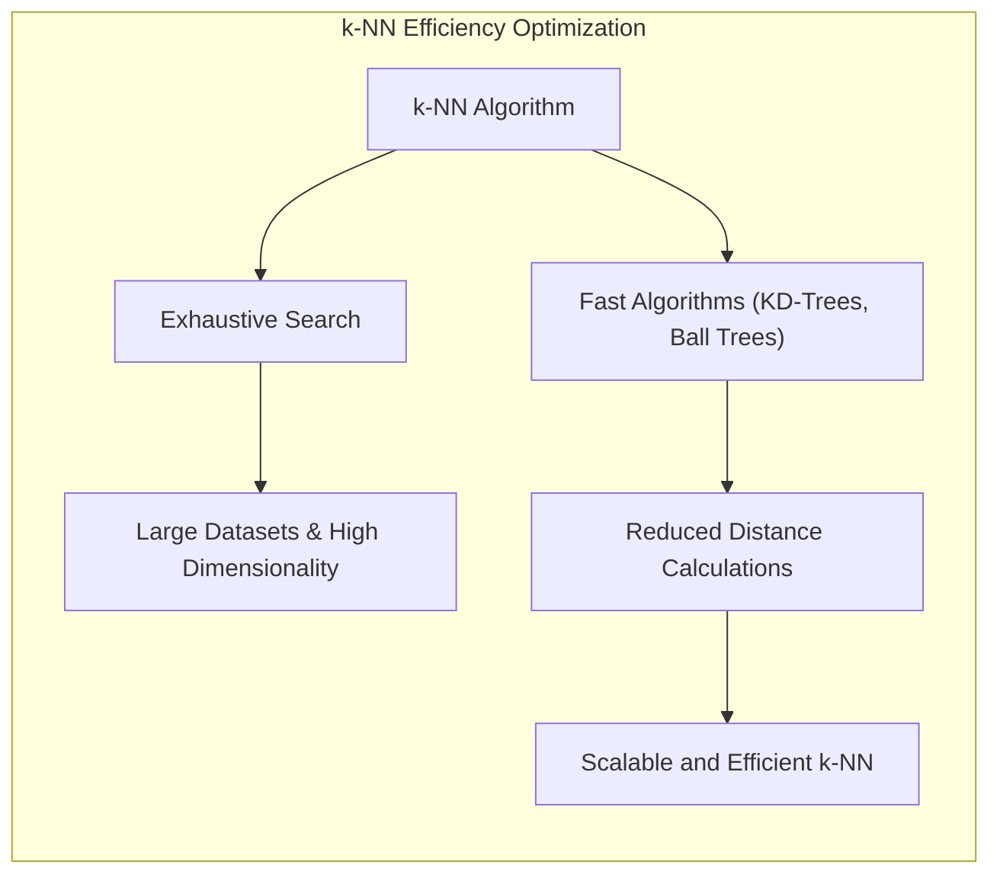
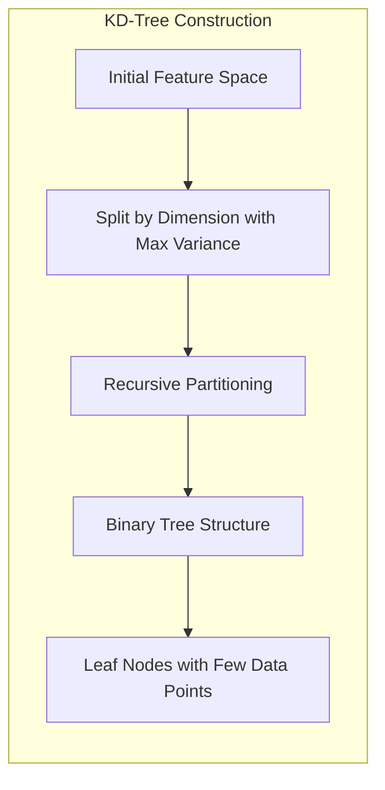
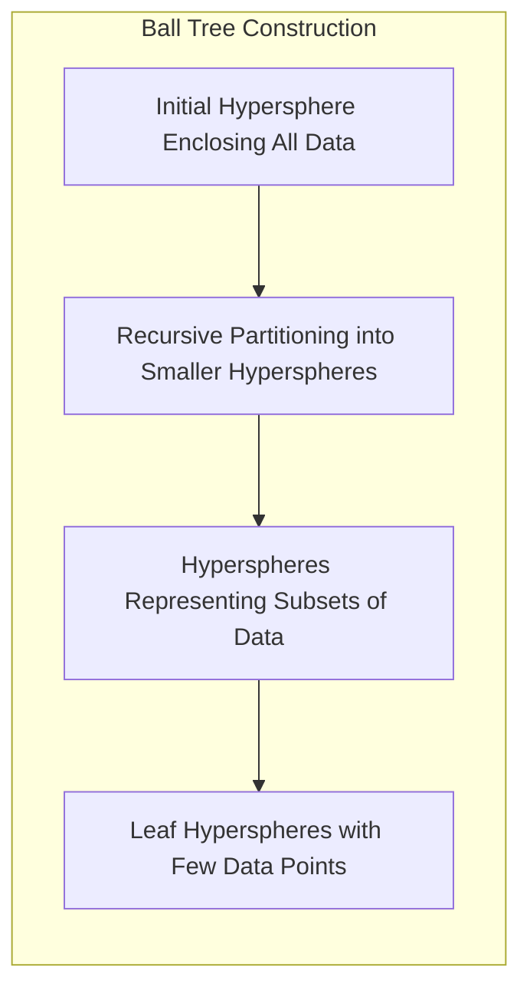
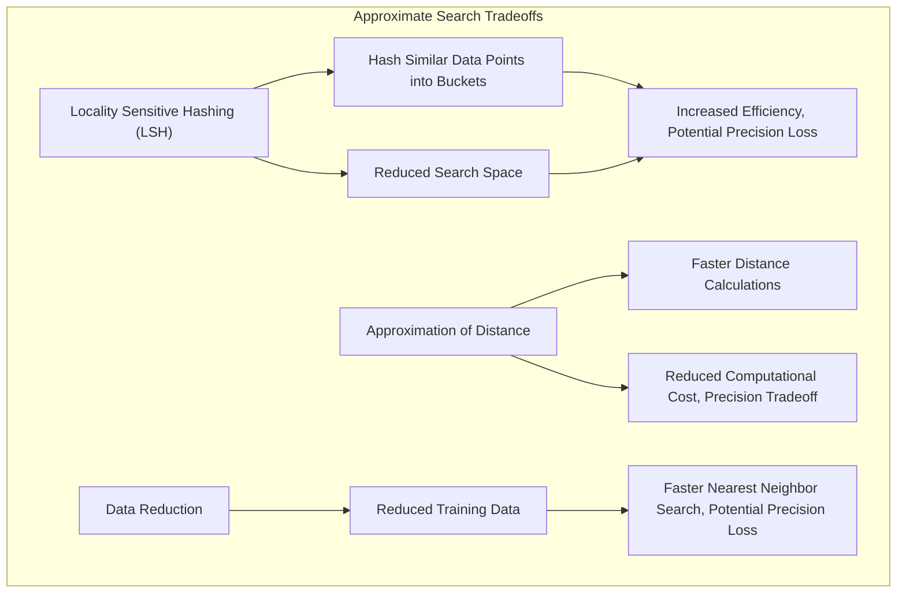
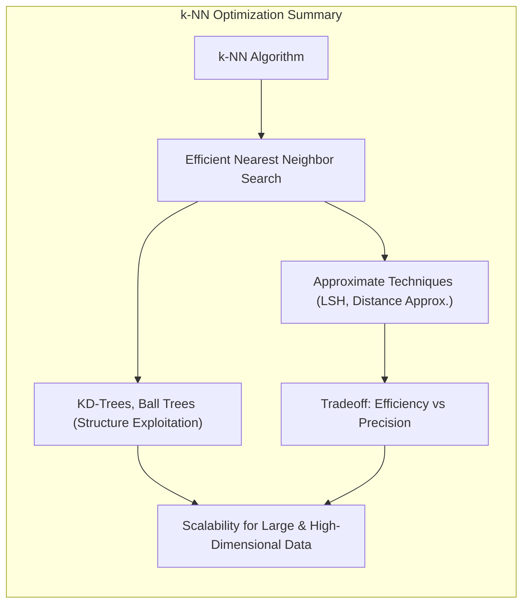

## Algoritmos Rápidos para Busca de Vizinhos Mais Próximos: Otimizando a Eficiência do k-NN

<imagem: Diagrama comparando o funcionamento de algoritmos de busca eficientes, como árvores KD e ball trees, com a busca exaustiva, mostrando como esses algoritmos exploram a estrutura dos dados para reduzir o número de cálculos de distância necessários para encontrar os vizinhos mais próximos, e como isso melhora a eficiência computacional do k-NN.>

### Introdução

Este capítulo explora **algoritmos rápidos** para a busca de **vizinhos mais próximos**, com foco em como esses algoritmos otimizam a eficiência computacional do método de **k-vizinhos mais próximos (k-NN)** [^13.5]. Em problemas de aprendizado de máquina com grandes conjuntos de dados e alta dimensionalidade, a busca exaustiva, que calcula a distância entre o ponto de consulta e todos os pontos de treinamento, pode ser proibitivamente cara. Analisaremos como algoritmos como as árvores KD e as *ball trees* exploram a estrutura dos dados para reduzir o número de cálculos de distância necessários para identificar os $k$ vizinhos mais próximos, e como a utilização desses algoritmos é crucial para tornar o k-NN escalável e eficiente em diversas aplicações práticas.



### Busca Exaustiva vs. Busca Eficiente: Reduzindo a Complexidade Computacional

A abordagem mais direta para encontrar os $k$ vizinhos mais próximos de um ponto de consulta é realizar uma **busca exaustiva**, onde a distância entre o ponto de consulta e todos os pontos de treinamento é calculada e os $k$ pontos mais próximos são selecionados [^13.3]. Essa abordagem tem uma complexidade computacional de **O(Np)**, onde $N$ é o número de amostras de treinamento e $p$ é o número de *features*. Conforme visto em seções anteriores, essa complexidade pode se tornar proibitiva para grandes conjuntos de dados.

> 💡 **Exemplo Numérico:**
> Imagine um conjunto de dados com 10.000 amostras ($N = 10.000$) e 10 *features* ($p = 10$). Em uma busca exaustiva, para encontrar os vizinhos mais próximos de um único ponto de consulta, você teria que calcular a distância entre esse ponto e todas as 10.000 amostras. Isso resulta em 10.000 cálculos de distância, cada um envolvendo operações sobre as 10 *features*. Se cada cálculo de distância levasse, por exemplo, 1 microsegundo, a busca exaustiva levaria 10 milissegundos. Agora, imagine repetir isso para muitos pontos de consulta, ou para conjuntos de dados muito maiores. É fácil perceber que o custo computacional pode se tornar um gargalo.

Para reduzir o custo computacional da busca dos vizinhos, foram desenvolvidos **algoritmos de busca eficiente** que exploram a estrutura dos dados para realizar a busca sem a necessidade de calcular a distância para todos os pontos do conjunto de treinamento. Esses algoritmos utilizam estruturas de dados e técnicas de busca que permitem ignorar pontos que não são candidatos a vizinhos mais próximos, e identificar rapidamente os $k$ pontos mais próximos de um dado ponto.

Alguns dos algoritmos de busca eficientes mais utilizados incluem:

1.  **Árvores KD (KD-Trees):** As árvores KD são estruturas de dados que particionam o espaço de *features* de forma recursiva, criando uma árvore binária que facilita a busca por vizinhos próximos.
2.  **Ball Trees:** As *ball trees* são estruturas de dados que particionam o espaço de *features* em hiperesferas (balls), o que torna a busca por vizinhos mais rápida em espaços de alta dimensão.


**Lemma 164:** Algoritmos de busca eficiente, como árvores KD e *ball trees*, permitem reduzir o custo computacional da busca dos vizinhos mais próximos em comparação com a busca exaustiva, por meio da utilização de estruturas de dados que exploram a estrutura dos dados para minimizar o número de cálculos de distância.
*Prova*: As estruturas de árvores KD e *ball trees* dividem o espaço de features de forma recursiva e permitem ignorar as regiões do espaço onde os pontos não são vizinhos, evitando o cálculo desnecessário de distâncias. $\blacksquare$

**Corolário 164:** O uso de algoritmos de busca eficiente é essencial para tornar o k-NN escalável para grandes conjuntos de dados e problemas de alta dimensão.

> ⚠️ **Nota Importante**: Algoritmos de busca eficiente, como árvores KD e *ball trees*, reduzem o custo computacional da busca por vizinhos mais próximos, o que torna o k-NN mais escalável.

> ❗ **Ponto de Atenção**:  A escolha do algoritmo de busca eficiente mais apropriado depende das características do conjunto de dados, e algumas abordagens são mais adequadas do que outras para determinados cenários.

### Árvores KD: Particionamento Recursivo do Espaço de *Features*

As **árvores KD (KD-trees)** são estruturas de dados que particionam o espaço de *features* de forma recursiva, criando uma árvore binária que facilita a busca por vizinhos mais próximos [^13.5]. A construção de uma árvore KD envolve os seguintes passos:

1.  **Divisão do Espaço:** O espaço de *features* é dividido em duas regiões utilizando um hiperplano ortogonal a uma das dimensões. A dimensão utilizada para a divisão é escolhida de forma a maximizar a variância das *features* na região.
2.  **Particionamento Recursivo:** Cada região obtida é dividida recursivamente, criando uma árvore binária. A cada nível da árvore, uma dimensão diferente é utilizada para a divisão.
3.  **Folhas da Árvore:** As folhas da árvore representam regiões do espaço de *features* que contém poucos pontos, onde a busca por vizinhos mais próximos pode ser realizada diretamente.

> 💡 **Exemplo Numérico:**
> Considere um conjunto de dados bidimensional com os seguintes pontos: `[(2,3), (5,4), (9,6), (4,7), (8,1), (7,2)]`. Uma árvore KD poderia ser construída da seguinte forma:
>
> 1.  **Nível 1:** A primeira divisão pode ser feita na dimensão x (primeira coordenada), usando a mediana dos valores x, que é 6. Isso divide os pontos em dois grupos: `[(2,3), (5,4), (4,7)]` (esquerda) e `[(9,6), (8,1), (7,2)]` (direita).
> 2.  **Nível 2:** Para o grupo da esquerda, a divisão é feita na dimensão y (segunda coordenada), usando a mediana dos valores y, que é 4. Isso cria dois novos grupos: `[(2,3)]` e `[(5,4), (4,7)]`. Para o grupo da direita, a divisão também é feita na dimensão y, com mediana 2, criando: `[(8,1), (7,2)]` e `[(9,6)]`.
> 3.  **Nível 3:** As folhas da árvore são os pontos individuais ou grupos pequenos de pontos.
>
> Este particionamento recursivo cria uma estrutura de árvore que permite uma busca mais rápida por vizinhos próximos.
>
> ```mermaid
> graph LR
>     A((6, mediana x)) --> B((4, mediana y));
>     A --> C((2, mediana y));
>     B --> D((2,3));
>     B --> E((5,4), (4,7));
>     C --> F((8,1), (7,2));
>     C --> G((9,6));
> ```
>
> A busca por vizinhos agora pode navegar por essa árvore, em vez de calcular a distância para todos os pontos.



Para buscar os $k$ vizinhos mais próximos de um ponto de consulta utilizando uma árvore KD, o algoritmo segue os seguintes passos:

1.  **Busca na Árvore:** O algoritmo navega pela árvore, seguindo as regiões mais próximas ao ponto de consulta, até chegar a uma região folha.
2.  **Busca Local:** Na região folha, as distâncias entre o ponto de consulta e todos os pontos são calculadas.
3.  **Seleção dos k Vizinhos:** Os $k$ pontos mais próximos são selecionados, e a busca retorna para os níveis superiores da árvore, para verificar se em outros ramos mais próximos existem pontos que podem se tornar vizinhos.
4.  **Refinamento:** Os vizinhos são comparados com os resultados obtidos nos outros ramos, a fim de garantir que os $k$ vizinhos retornados são, de fato, os mais próximos.

A estrutura da árvore KD permite que a busca por vizinhos seja realizada em tempo muito inferior ao da busca exaustiva.

**Lemma 165:** As árvores KD particionam recursivamente o espaço de *features*, criando uma estrutura hierárquica que facilita a busca por vizinhos mais próximos, reduzindo o número de cálculos de distância necessários.
*Prova*: Ao organizar os dados em uma estrutura de árvore, o algoritmo de busca pode focar em apenas um ramo da árvore, evitando o cálculo de distâncias em regiões que não são relevantes para o ponto de consulta. $\blacksquare$

**Corolário 165:** O uso de árvores KD permite uma busca de vizinhos mais rápida do que a busca exaustiva, o que melhora a eficiência computacional do k-NN.

> ⚠️ **Nota Importante**: As árvores KD são estruturas de dados que particionam recursivamente o espaço de *features*, facilitando a busca por vizinhos mais próximos.

> ❗ **Ponto de Atenção**: A construção de árvores KD é uma etapa que requer computação, mas o ganho na velocidade da busca nos vizinhos compensa esse custo inicial.

### *Ball Trees*: Particionamento por Hiperesferas em Espaços de Alta Dimensão

As **ball trees** são estruturas de dados que particionam o espaço de *features* por meio de **hiperesferas (balls)**, o que as torna mais adequadas do que árvores KD para a busca de vizinhos em espaços de alta dimensão [^13.5]. A construção de uma *ball tree* envolve os seguintes passos:

1.  **Definição da Hiperesfera Raiz:** A raiz da *ball tree* representa uma hiperesfera que envolve todos os pontos do conjunto de dados. O centro e o raio da hiperesfera são definidos com base nos dados.
2.  **Particionamento Recursivo:** A hiperesfera raiz é dividida em duas hiperesferas menores que representam subconjuntos dos dados, com os respectivos centros e raios.
3.  **Repetição:** Esse particionamento recursivo continua até que as hiperesferas nas folhas da árvore contenham poucos pontos de dados.

> 💡 **Exemplo Numérico:**
> Considere o mesmo conjunto de dados bidimensional do exemplo da árvore KD: `[(2,3), (5,4), (9,6), (4,7), (8,1), (7,2)]`. Uma *ball tree* poderia ser construída da seguinte forma:
>
> 1.  **Nível 1:** A hiperesfera raiz engloba todos os pontos. O centro pode ser a média dos pontos, e o raio a distância máxima de um ponto ao centro.
> 2.  **Nível 2:** A hiperesfera raiz é dividida em duas hiperesferas menores. Por exemplo, uma hiperesfera poderia conter `[(2,3), (5,4), (4,7)]`, e a outra `[(9,6), (8,1), (7,2)]`. Os centros e raios de cada hiperesfera são calculados de acordo com os pontos que elas contém.
> 3.  **Nível 3:** O particionamento continua recursivamente até que as folhas contenham poucos pontos.
>
> ```mermaid
> graph LR
>     A(Hiperesfera Raiz) --> B(Hiperesfera 1);
>     A --> C(Hiperesfera 2);
>     B --> D(Hiperesfera 1.1);
>     B --> E(Hiperesfera 1.2);
>     C --> F(Hiperesfera 2.1);
>     C --> G(Hiperesfera 2.2);
> ```
>
> A busca por vizinhos agora pode navegar por essa árvore, verificando as hiperesferas mais próximas do ponto de consulta.



Para buscar os $k$ vizinhos mais próximos de um ponto de consulta utilizando uma *ball tree*, o algoritmo realiza os seguintes passos:

1.  **Busca na Árvore:** O algoritmo navega na árvore, visitando as hiperesferas mais próximas do ponto de consulta.
2.  **Cálculo da Distância:** A distância entre o ponto de consulta e as hiperesferas é calculada, e algumas hiperesferas são descartadas na busca, sem precisar computar a distância entre o ponto de consulta e todos os pontos nelas contidos.
3.  **Seleção dos k Vizinhos:**  Os $k$ pontos contidos nas hiperesferas mais próximas são selecionados.

A vantagem da *ball tree* em relação à árvore KD é que a busca por vizinhos pode ser feita de forma mais eficiente em espaços de alta dimensão, pois as hiperesferas se adaptam melhor à distribuição dos dados nesses espaços, enquanto a árvore KD tem um modelo mais rígido de partição.

**Lemma 166:** As *ball trees* particionam recursivamente o espaço de *features* por meio de hiperesferas, o que permite uma busca por vizinhos mais eficiente que a busca exaustiva em espaços de alta dimensão.
*Prova*: As hiperesferas permitem representar regiões com fronteiras mais apropriadas que a divisão em hiperplanos feita pelas árvores KD, sendo também mais eficientes na implementação. $\blacksquare$

**Corolário 166:** O uso de *ball trees* reduz o número de cálculos de distância necessários para a busca por vizinhos no k-NN, o que torna o método mais escalável para dados de alta dimensão.

> ⚠️ **Nota Importante**: *Ball trees* são estruturas de dados que particionam o espaço de *features* utilizando hiperesferas, o que permite uma busca por vizinhos mais eficiente em espaços de alta dimensão.

> ❗ **Ponto de Atenção**:  A construção de *ball trees* também requer um custo computacional, mas o ganho em desempenho na busca de vizinhos geralmente compensa esse custo.

### Abordagens de Aproximação: *Tradeoffs* entre Eficiência e Precisão

Além de árvores KD e *ball trees*, existem outras abordagens que buscam aproximar a busca por vizinhos mais próximos de forma a aumentar a eficiência computacional e de armazenamento [^13.5]. Essas abordagens envolvem *tradeoffs* entre a eficiência e a precisão, e alguns dos métodos incluem:

1.  **Locality Sensitive Hashing (LSH):** O LSH é uma técnica que utiliza funções de hash para mapear pontos de dados para *buckets* de forma que pontos similares tendam a cair no mesmo *bucket* ou em *buckets* vizinhos. A busca por vizinhos é realizada apenas nos *buckets* relevantes, o que acelera a busca.
2.  **Aproximação da Distância:** A aproximação de distâncias utiliza técnicas matemáticas para aproximar o cálculo da distância Euclidiana, reduzindo o número de operações necessárias. O uso de distâncias aproximadas resulta em modelos mais rápidos mas com menor precisão na busca por vizinhos.
3. **Redução de Dados:** Modelos de protótipos ou outros métodos de condensação de dados podem ser utilizados para reduzir a quantidade de dados de treinamento, o que diminui o número de distâncias a serem calculadas no momento da classificação.

> 💡 **Exemplo Numérico:**
> Imagine que você está usando LSH para buscar vizinhos mais próximos em um conjunto de dados de imagens. As funções de hash podem ser projetadas de forma que imagens similares (por exemplo, variações da mesma cena) tenham hashes similares. Quando você busca os vizinhos de uma nova imagem, o LSH rapidamente direciona a busca para o *bucket* onde as imagens similares estão, evitando a necessidade de comparar com todas as outras imagens. Isso resulta em um grande ganho de eficiência, embora alguns vizinhos mais próximos possam ser perdidos por estarem em outros *buckets*.



A escolha da técnica de busca mais apropriada depende do tipo de problema e dos requisitos de desempenho. Para dados com alta dimensionalidade e grande volume, a combinação de técnicas de redução de dimensionalidade com busca aproximada por vizinhos é frequente, a fim de obter um equilíbrio entre a velocidade e a qualidade da classificação.

**Lemma 167:** Algoritmos de busca aproximada, como LSH, ou métodos que comprimem os dados de treino, permitem diminuir ainda mais o custo computacional, com o *tradeoff* de uma redução na precisão da busca por vizinhos mais próximos.
*Prova*: As abordagens de aproximação buscam diminuir o número de operações para cálculo de distância ou o número de pontos utilizados para a decisão de classificação, reduzindo a qualidade da aproximação, mas com aumento de velocidade na classificação. $\blacksquare$

**Corolário 167:** O *tradeoff* entre eficiência e precisão na busca de vizinhos deve ser levado em conta para a escolha das técnicas de otimização mais apropriadas para cada tipo de problema.

> ⚠️ **Nota Importante**:  A escolha de técnicas de busca aproximada para vizinhos no k-NN envolve um *tradeoff* entre eficiência computacional e precisão, e a melhor abordagem depende das necessidades do problema específico.

> ❗ **Ponto de Atenção**:  A utilização de técnicas de aproximação na busca por vizinhos pode levar à introdução de novos parâmetros de ajuste, e a escolha desses parâmetros é relevante para garantir um bom desempenho do modelo.

### Conclusão

A busca eficiente por vizinhos mais próximos é essencial para tornar o k-NN escalável para grandes conjuntos de dados e problemas de alta dimensionalidade. Algoritmos como árvores KD e *ball trees* exploram a estrutura dos dados para reduzir o número de cálculos de distância, enquanto técnicas de aproximação oferecem um *tradeoff* entre eficiência e precisão. A escolha do algoritmo de busca e das técnicas de otimização mais apropriados depende das características do problema específico, e o uso adequado dessas técnicas permite que o k-NN seja uma ferramenta eficaz para problemas complexos de classificação e reconhecimento de padrões.



### Footnotes

[^13.5]: "One drawback of nearest-neighbor rules in general is the computational load, both in finding the neighbors and storing the entire training set...There are fast algorithms for finding nearest-neighbors (Friedman et al., 1975; Friedman et al., 1977) which can reduce this load somewhat. Hastie and Simard (1998) reduce the computations for tangent distance by developing analogs of K-means clustering in the context of this invariant metric." *(Trecho de "13. Prototype Methods and Nearest-Neighbors")*

[^13.3]: "These classifiers are memory-based, and require no model to be fit. Given a query point xo, we find the k training points x(r), r = 1,..., k closest in distance to xo, and then classify using majority vote among the k neighbors." *(Trecho de "13. Prototype Methods and Nearest-Neighbors")*
