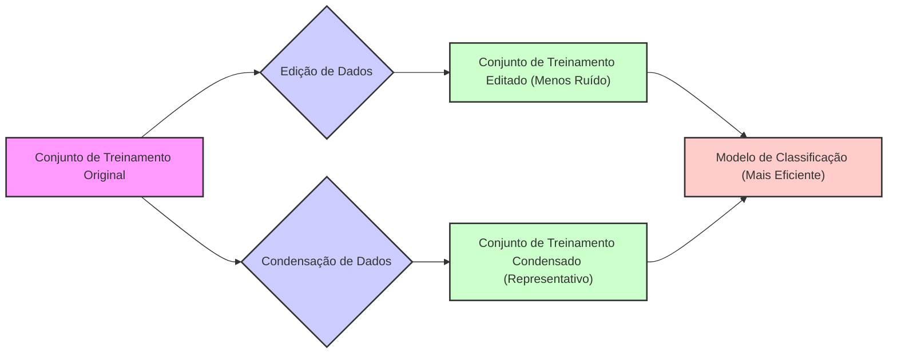
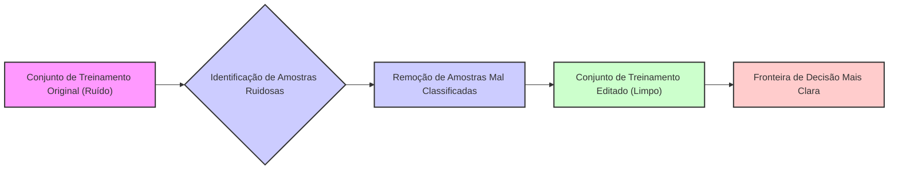
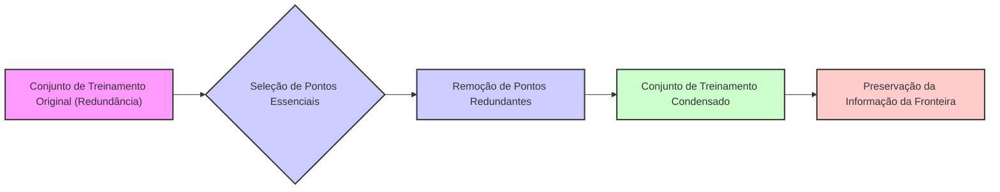
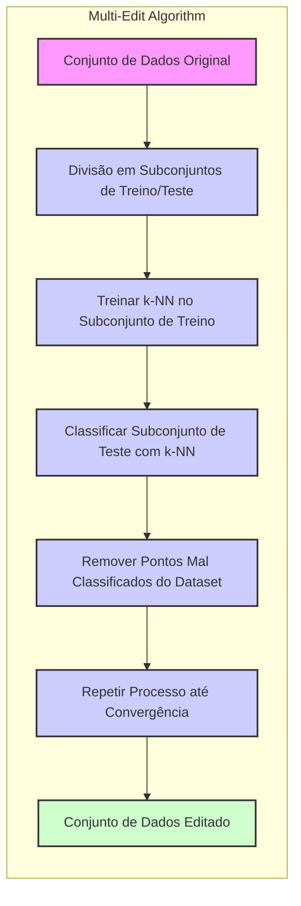
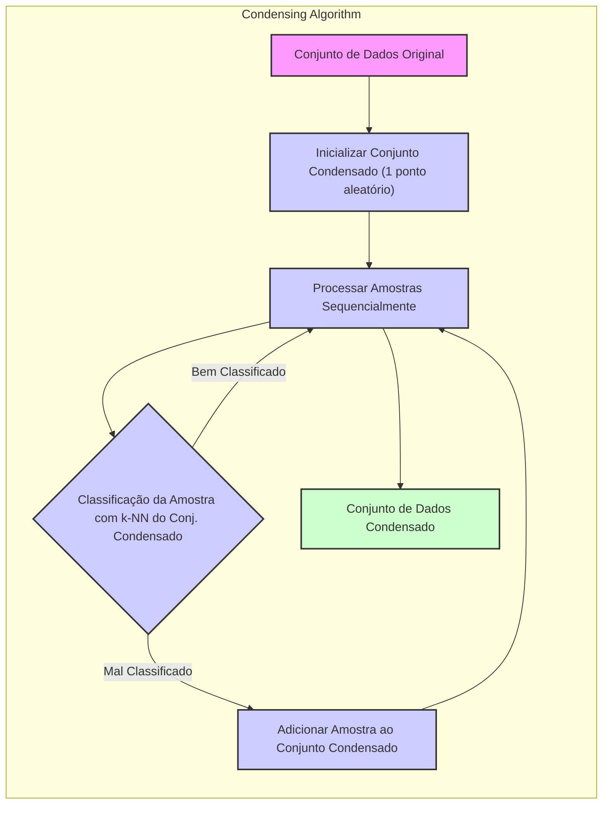
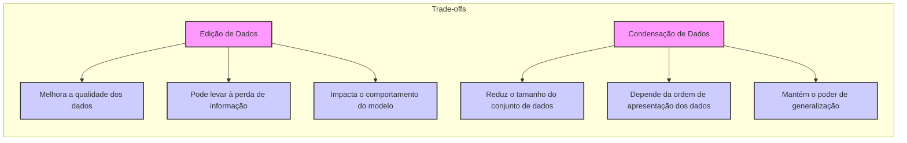

## Edição e Condensação de Dados: Reduzindo o Conjunto de Treinamento para um Aprendizado Mais Eficiente



### Introdução

Este capítulo explora as técnicas de **edição de dados** e **condensação de dados**, que têm como objetivo **reduzir o tamanho do conjunto de treinamento** em métodos de aprendizado de máquina, particularmente no contexto do método de **k-vizinhos mais próximos (k-NN)** [^13.5]. Ao remover amostras redundantes, ruidosas ou pouco informativas do conjunto de treinamento, é possível aliviar a carga computacional e de armazenamento do k-NN, e ainda melhorar sua capacidade de generalização. Analisaremos como algoritmos como o multi-edit e o *condensing* funcionam, seus princípios subjacentes, como esses métodos podem aumentar a eficiência de modelos baseados em instâncias, e como essas abordagens se diferenciam de outros métodos de redução de dimensionalidade.

### A Necessidade de Edição e Condensação de Dados

Em muitas aplicações de aprendizado de máquina, o conjunto de dados de treinamento pode ser muito grande, o que implica em custos computacionais e de armazenamento elevados. Além disso, o conjunto de treinamento pode conter amostras redundantes, ruidosas, ou pouco informativas, que não contribuem significativamente para o processo de aprendizado, ou podem até mesmo prejudicar o desempenho do modelo. A **edição de dados** e a **condensação de dados** são técnicas que buscam mitigar esses problemas, selecionando um subconjunto de amostras de treinamento que sejam representativas da distribuição dos dados e que sejam suficientes para que o modelo obtenha um bom desempenho.

A **edição de dados** busca remover amostras ruidosas ou mal classificadas do conjunto de treinamento, que podem prejudicar o modelo de aprendizado, e melhorar a qualidade da base de dados. Por exemplo, ao eliminar pontos que estão no lado "errado" da fronteira de decisão, as regiões de decisão se tornam mais representativas do espaço de *features*.



A **condensação de dados**, por sua vez, busca selecionar um subconjunto de amostras que mantenham a informação essencial do conjunto de dados original, descartando amostras redundantes e preservando a informação para o processo de classificação, removendo pontos que estão "dentro" de um grupo de amostras.



**Lemma 168:** A edição e a condensação de dados são técnicas que visam reduzir o tamanho do conjunto de treinamento, removendo amostras ruidosas, mal classificadas ou redundantes, e preservando a informação necessária para o processo de aprendizado.
*Prova*: O processo de condensação busca os pontos mais relevantes para definição da fronteira de decisão, removendo pontos redundantes, e o processo de edição busca remover pontos com classes incorretas. $\blacksquare$

**Corolário 168:** O uso de técnicas de edição e condensação de dados tem como objetivo construir modelos de aprendizado de máquina mais eficientes, com menor custo computacional e de armazenamento, e com boa capacidade de generalização.

> ⚠️ **Nota Importante**: A edição e a condensação de dados são estratégias para reduzir o tamanho do conjunto de treinamento, removendo dados que não são importantes para a modelagem.

> ❗ **Ponto de Atenção**: A escolha de quais amostras remover do conjunto de treinamento deve ser feita com cuidado, a fim de evitar a perda de informações relevantes para o modelo.

### O Algoritmo *Multi-Edit*: Limpando o Conjunto de Treinamento

O algoritmo **multi-edit** é uma técnica de edição de dados que busca identificar e remover amostras mal classificadas ou ruidosas do conjunto de treinamento [^13.5]. O algoritmo opera dividindo iterativamente o conjunto de dados em subconjuntos de treinamento e teste, ajustando um modelo k-NN no subconjunto de treinamento, e removendo os pontos mal classificados do subconjunto de teste.



O procedimento do algoritmo multi-edit é:

1.  **Divisão do Conjunto de Dados:** O conjunto de dados original é dividido em subconjuntos de treinamento e teste, de forma cíclica.
2.  **Ajuste do Modelo:** Um modelo k-NN é ajustado ao subconjunto de treinamento, usando um valor predefinido de $k$.
3.  **Classificação do Subconjunto de Teste:** O modelo k-NN é utilizado para classificar os pontos do subconjunto de teste.
4.  **Remoção de Pontos Mal Classificados:** Os pontos do subconjunto de teste que são classificados incorretamente são removidos do conjunto de dados original.
5.  **Repetição:** Os passos 1 a 4 são repetidos, trocando os papéis dos subconjuntos de treino e teste, até que não haja mais pontos a serem removidos.

O algoritmo multi-edit utiliza o conceito da validação cruzada para remover pontos que não pertencem às fronteiras de decisão, e que podem prejudicar a capacidade de generalização do modelo. Ao remover os pontos que são mais difíceis de classificar, o algoritmo multi-edit busca deixar apenas aqueles pontos que são mais representativos das regiões de cada classe.

**Lemma 169:** O algoritmo multi-edit busca remover amostras mal classificadas ou ruidosas do conjunto de treinamento, de forma iterativa com divisões cíclicas dos dados e o uso de um algoritmo k-NN para identificar a classificação correta das instâncias.
*Prova*: A divisão do conjunto de dados em subconjuntos de treino e teste e a classificação cruzada dos dados em cada iteração permite identificar as amostras que são mal classificadas e removê-las do conjunto. $\blacksquare$

**Corolário 169:** O algoritmo multi-edit auxilia na construção de modelos mais robustos e com maior capacidade de generalização, ao remover amostras que introduzem ruído ou que não são representativas da estrutura dos dados.

> ⚠️ **Nota Importante**: O algoritmo multi-edit utiliza divisões iterativas do conjunto de dados para remover amostras mal classificadas, tornando o conjunto de treinamento mais limpo e representativo.

> ❗ **Ponto de Atenção**: A escolha do valor de $k$ no algoritmo multi-edit influencia o número de amostras removidas e pode afetar o desempenho do modelo.

> 💡 **Exemplo Numérico:**
>
> Vamos considerar um conjunto de dados simples com 10 amostras e duas classes (0 e 1). Inicialmente, temos:
>
> ```
> Data = [[1, 2, 0], [1.5, 1.8, 0], [5, 8, 1], [8, 8, 1], [1, 0.6, 0], [9, 1, 1], [0.5, 1, 0], [7, 9, 1], [1.2, 1.5, 1], [8.3, 7.2, 1]]
> ```
> Onde cada amostra é representada como `[feature_1, feature_2, class]`.
>
> Vamos aplicar o multi-edit com $k=3$. Na primeira iteração, dividimos os dados em treino (7 amostras) e teste (3 amostras). Suponha que as amostras de índice 0, 1, 2, 3, 4, 5 e 6 formem o conjunto de treino, e 7, 8 e 9 o teste.
>
> 1.  **Treino:** Usamos as amostras 0,1,2,3,4,5 e 6 para treinar o modelo k-NN.
> 2.  **Teste:** Usamos o modelo k-NN para classificar as amostras 7, 8 e 9.
> 3.  **Remoção:** Suponha que a amostra 8 é classificada incorretamente (originalmente da classe 1, classificada como 0). Removemos essa amostra do dataset original.
>
> Repetimos o processo com diferentes partições treino/teste. No final, amostras mal classificadas, como a 8,  são removidas, resultando em um dataset mais limpo. Se o ponto [1.2, 1.5, 1] for removido nesta etapa, o dataset final seria:
>
> ```
> Data_edited = [[1, 2, 0], [1.5, 1.8, 0], [5, 8, 1], [8, 8, 1], [1, 0.6, 0], [9, 1, 1], [0.5, 1, 0], [7, 9, 1], [8.3, 7.2, 1]]
> ```
>
> O algoritmo multi-edit iteraria até que não houvesse mais amostras a serem removidas, produzindo um conjunto de treinamento mais limpo e mais representativo.

### O Algoritmo *Condensing*: Seleção de Pontos Representativos da Fronteira

O algoritmo de **condensação** de dados, por sua vez, busca selecionar um subconjunto de amostras que sejam representativas das fronteiras de decisão entre as classes, removendo amostras que sejam redundantes ou pouco informativas [^13.5]. O algoritmo inicia com um conjunto de treinamento vazio e adiciona a ele os pontos que são considerados mais importantes para a classificação.



O procedimento do algoritmo *condensing* é:

1.  **Inicialização:** O conjunto de dados condensado é inicializado com um único ponto do conjunto de treinamento, escolhido de forma aleatória.
2.  **Processamento Sequencial:** Os outros pontos do conjunto de treinamento são processados sequencialmente.
3.  **Adição de Pontos:** Um ponto é adicionado ao conjunto de dados condensado apenas se ele for classificado incorretamente por um k-NN treinado sobre o conjunto de dados condensado até então.

O algoritmo *condensing* procura identificar os pontos de treinamento que são mais relevantes para a definição das fronteiras de decisão e remover aqueles pontos que não adicionam informações para a classificação. A remoção de pontos que estão "longe" das fronteiras de decisão reduz o tamanho do conjunto de dados de treinamento, sem comprometer o desempenho do modelo.

**Lemma 170:** O algoritmo *condensing* busca selecionar um conjunto de amostras que representem a fronteira de decisão, removendo as amostras que são redundantes e menos informativas para a classificação.
*Prova*: A adição de um ponto ao conjunto de treino apenas quando ele é mal classificado, garante que pontos redundantes em regiões de uma única classe são removidos. $\blacksquare$

**Corolário 170:** A abordagem do algoritmo *condensing* foca na seleção de pontos de treino que delimitam as fronteiras de decisão, reduzindo o tamanho do conjunto de treino sem comprometer a performance.

> ⚠️ **Nota Importante**: O algoritmo *condensing* busca reduzir o tamanho do conjunto de dados de treinamento selecionando pontos que representem as fronteiras de decisão, e descarta as amostras que não adicionam informações para a classificação.

> ❗ **Ponto de Atenção**:  O algoritmo *condensing* depende da ordem em que os pontos são processados, o que pode levar a conjuntos de dados condensados diferentes dependendo da ordem de apresentação das amostras.

> 💡 **Exemplo Numérico:**
>
> Usando o mesmo conjunto de dados inicial do exemplo anterior:
>
> ```
> Data = [[1, 2, 0], [1.5, 1.8, 0], [5, 8, 1], [8, 8, 1], [1, 0.6, 0], [9, 1, 1], [0.5, 1, 0], [7, 9, 1], [1.2, 1.5, 1], [8.3, 7.2, 1]]
> ```
>
> 1. **Inicialização:** Escolhemos aleatoriamente a primeira amostra `[1, 2, 0]` como o primeiro ponto do conjunto condensado.
>
>    ```
>    Condensed_Data = [[1, 2, 0]]
>    ```
> 2.  **Processamento Sequencial:** Processamos o resto das amostras em ordem.
>     - Amostra `[1.5, 1.8, 0]`: Usamos o k-NN (com k=1, por exemplo) treinado com `Condensed_Data` para classificar esta amostra. Como ela seria classificada corretamente (classe 0), ela não é adicionada.
>     - Amostra `[5, 8, 1]`: Usamos o k-NN para classificar. Suponha que ela seja classificada incorretamente (como classe 0), então adicionamos ela ao conjunto condensado.
>
>        ```
>        Condensed_Data = [[1, 2, 0], [5, 8, 1]]
>        ```
>     - Amostra `[8, 8, 1]`: Classificamos com o k-NN treinado em `Condensed_Data`. Suponha que ela seja classificada corretamente. Não adicionamos.
>     - Amostra `[1, 0.6, 0]`: Classificamos com k-NN. Suponha que seja classificada corretamente. Não adicionamos.
>     - Amostra `[9, 1, 1]`: Classificamos com k-NN. Suponha que seja classificada incorretamente. Adicionamos ao conjunto.
>
>        ```
>        Condensed_Data = [[1, 2, 0], [5, 8, 1], [9, 1, 1]]
>        ```
>
>     - O processo continua para as amostras restantes. Ao final, `Condensed_Data` conterá apenas os pontos que foram inicialmente mal classificados com os pontos previamente selecionados, resultando em um conjunto menor de amostras representativas das fronteiras de decisão.
>
> O dataset condensado pode, por exemplo, ser:
>
> ```
> Condensed_Data = [[1, 2, 0], [5, 8, 1], [9, 1, 1], [0.5, 1, 0], [7, 9, 1]]
> ```
>
> Note que a ordem das amostras influencia no resultado final, e que o algoritmo busca os pontos necessários para definir as fronteiras de decisão, removendo a redundância.

### *Tradeoffs* e Aplicações de Métodos de Edição e Condensação

As técnicas de **edição e condensação de dados** oferecem *tradeoffs* importantes entre a redução do tamanho do conjunto de treinamento e a manutenção da capacidade de generalização do modelo:

1.  **Edição de Dados:** A edição de dados, como no algoritmo multi-edit, pode melhorar a qualidade dos dados de treinamento e a capacidade de generalização do modelo, mas a remoção de muitos pontos pode levar à perda de informação e pode influenciar o comportamento do modelo em certos tipos de dados.

2.  **Condensação de Dados:** A condensação de dados, como no algoritmo *condensing*, pode reduzir significativamente o tamanho do conjunto de treinamento, o que diminui a complexidade computacional e de armazenamento, mas o algoritmo depende da ordem de apresentação dos dados. Em contrapartida, modelos treinados com bases de dados condensadas conseguem manter bom poder de generalização para novas amostras.



Em relação a outras técnicas de redução de dimensionalidade, como PCA ou LDA, a edição e condensação de dados têm a vantagem de operar diretamente no espaço original de *features*, sem transformações dos dados, o que torna esses métodos mais adequados para o caso em que a interpretabilidade das features originais seja importante.

Essas técnicas são especialmente úteis em problemas onde o conjunto de treinamento é muito grande ou contém dados ruidosos e são particularmente importantes em aplicações onde o uso do k-NN é limitado pela sua complexidade computacional ou de armazenamento.

**Lemma 171:** As técnicas de edição e condensação de dados buscam um *tradeoff* entre a redução do tamanho do conjunto de treinamento e a manutenção da capacidade de generalização do modelo.
*Prova*: Ao remover amostras que são mal classificadas ou redundantes, esses métodos buscam obter modelos com menor complexidade e bom desempenho preditivo. $\blacksquare$

**Corolário 171:** A escolha entre edição e condensação de dados depende da natureza do problema e do foco da redução, sendo a edição focada na melhoria da qualidade dos dados, e a condensação na redução do conjunto sem grande perda da informação.

> ⚠️ **Nota Importante**:  Técnicas de edição e condensação oferecem alternativas importantes para lidar com as limitações do k-NN em problemas com grandes conjuntos de dados, permitindo a redução do custo computacional e de armazenamento.

> ❗ **Ponto de Atenção**:  A escolha da técnica mais adequada para reduzir o tamanho do conjunto de treinamento deve ser feita com base na análise das características dos dados e nos requisitos de desempenho do modelo.

### Conclusão

A edição e a condensação de dados são técnicas valiosas para lidar com problemas de aprendizado de máquina que envolvem grandes conjuntos de dados, particularmente em abordagens baseadas em memória como o k-NN. Ao remover amostras ruidosas, mal classificadas ou redundantes, essas técnicas permitem que o modelo se torne mais eficiente computacionalmente, com menor custo de armazenamento, e com boa capacidade de generalização. A escolha da melhor técnica depende do problema específico e dos *tradeoffs* entre a redução do tamanho dos dados e a manutenção da informação necessária para a classificação. A compreensão dessas técnicas e suas limitações é importante para a utilização eficaz do k-NN e de outros algoritmos de aprendizado baseados em instâncias.

### Footnotes

[^13.5]: "Reducing the storage requirements is more difficult, and various editing and condensing procedures have been proposed. The idea is to isolate a subset of the training set that suffices for nearest-neighbor predictions, and throw away the remaining training data...The multi-edit algorithm of Devijver and Kittler (1982) divides the data cyclically into training and test sets...The condensing procedure of Hart (1968) goes further, trying to keep only important exterior points of these clusters...These procedures are surveyed in Dasarathy (1991) and Ripley (1996). They can also be applied to other learning procedures besides nearest-neighbors." *(Trecho de "13. Prototype Methods and Nearest-Neighbors")*
