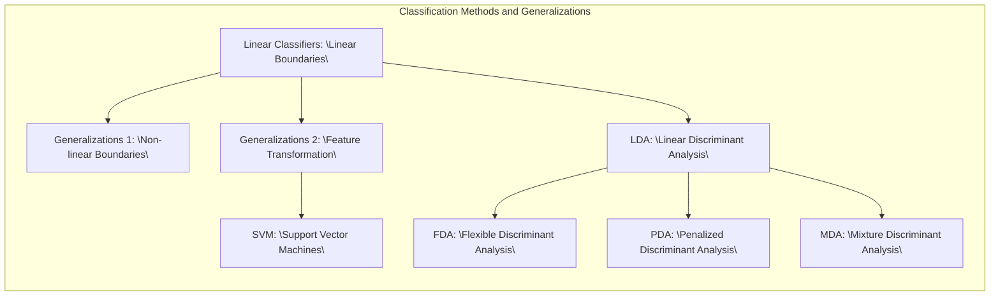
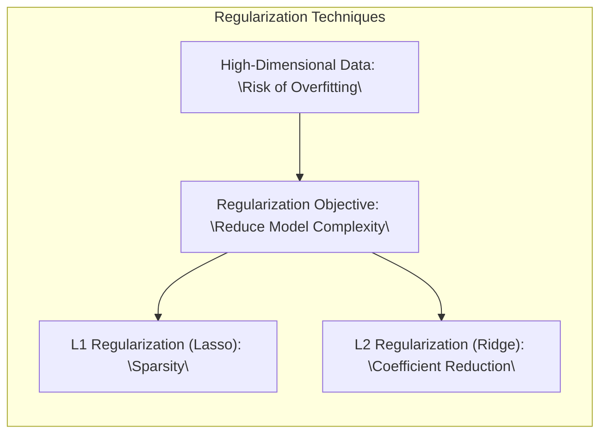

## Título: Generalizações de Fronteiras Lineares para Classificação: SVMs, FDA e Análises Discriminantes Flexíveis



### Introdução

Em muitos problemas de classificação, a simplicidade das fronteiras de decisão lineares, apesar de sua interpretabilidade e eficiência computacional, frequentemente se revela insuficiente para capturar a complexidade inerente aos dados. O capítulo anterior, por exemplo, introduziu a ideia de **hiperplanos separadores ótimos** em um cenário onde as classes eram linearmente separáveis [^12.1]. No entanto, na prática, os conjuntos de dados raramente apresentam essa característica ideal, exibindo sobreposição entre classes e padrões complexos que desafiam a capacidade dos modelos lineares.

A motivação para as técnicas apresentadas neste capítulo reside na necessidade de generalizar as abordagens de classificação linear, expandindo-as para além das limitações impostas pela linearidade. Essas generalizações se manifestam de duas formas principais: através da criação de fronteiras não lineares no espaço original de *features* ou pela transformação dos dados para um espaço de *features* de maior dimensão, onde uma fronteira linear possa ser mais eficaz. Essa segunda abordagem permite, por exemplo, a aplicação de métodos como **Support Vector Machines (SVMs)**, que constroem fronteiras lineares em um espaço transformado, mas correspondem a fronteiras não lineares no espaço original [^12.1].

Além disso, este capítulo também aborda generalizações da **Análise Discriminante Linear (LDA)**, incluindo a **Análise Discriminante Flexível (FDA)**, **Análise Discriminante Penalizada (PDA)**, e **Análise Discriminante por Misturas (MDA)**. Estas técnicas visam superar as limitações da LDA, que assume que as classes são gaussianas com uma matriz de covariância comum, uma restrição que pode não se sustentar em muitos conjuntos de dados reais. As técnicas de generalização exploradas neste capítulo oferecem abordagens para lidar com a alta dimensionalidade e a não linearidade inerentes a problemas complexos de classificação, buscando um equilíbrio entre a complexidade do modelo e a capacidade de generalização. A seguir, cada um desses conceitos será explorado em detalhe, demonstrando como cada método aborda e resolve as limitações das fronteiras de decisão lineares.

### Conceitos Fundamentais

**Conceito 1: Limitações da Separação Linear**

O problema de classificação linear, conforme abordado em [^12.1], busca encontrar uma **fronteira linear** capaz de separar as classes de forma ideal. No entanto, muitas vezes os dados apresentam distribuições complexas que impedem tal separação. A utilização de métodos lineares, como a regressão linear aplicada a uma matriz de indicadores, introduz um viés considerável, especialmente quando as classes não são bem separadas ou quando a relação entre as *features* e as classes é não linear. Por exemplo, em problemas com classes sobrepostas ou com relações complexas entre as variáveis, um modelo linear pode apresentar alto viés, resultando em uma má performance de classificação, tanto nos dados de treinamento quanto nos dados não vistos.

> 💡 **Exemplo Numérico:**
> Considere um dataset com duas *features* ($x_1$ e $x_2$) e duas classes (0 e 1) dispostas em um padrão circular, onde a classe 0 está no centro e a classe 1 em volta. Um modelo linear tentará traçar uma linha reta para separar as classes, o que resultará em muitos pontos classificados incorretamente.
>
> ```python
> import numpy as np
> import matplotlib.pyplot as plt
> from sklearn.linear_model import LogisticRegression
>
> # Gerar dados circulares
> np.random.seed(0)
> n_samples = 200
> radius = 5
> angles = np.random.uniform(0, 2*np.pi, n_samples)
> inner_radius = radius * 0.5
> x1_inner = inner_radius * np.cos(angles[:n_samples//2]) + np.random.normal(0, 0.5, n_samples//2)
> x2_inner = inner_radius * np.sin(angles[:n_samples//2]) + np.random.normal(0, 0.5, n_samples//2)
> x1_outer = radius * np.cos(angles[n_samples//2:]) + np.random.normal(0, 0.5, n_samples//2)
> x2_outer = radius * np.sin(angles[n_samples//2:]) + np.random.normal(0, 0.5, n_samples//2)
>
> X = np.vstack((np.column_stack((x1_inner, x2_inner)), np.column_stack((x1_outer, x2_outer))))
> y = np.array([0] * (n_samples//2) + [1] * (n_samples//2))
>
> # Treinar um modelo de regressão logística
> model = LogisticRegression()
> model.fit(X, y)
>
> # Gerar pontos para a fronteira de decisão
> x_min, x_max = X[:, 0].min() - 1, X[:, 0].max() + 1
> y_min, y_max = X[:, 1].min() - 1, X[:, 1].max() + 1
> xx, yy = np.meshgrid(np.arange(x_min, x_max, 0.02), np.arange(y_min, y_max, 0.02))
> Z = model.predict(np.c_[xx.ravel(), yy.ravel()])
> Z = Z.reshape(xx.shape)
>
> # Plotar os dados e a fronteira de decisão
> plt.figure(figsize=(8,6))
> plt.contourf(xx, yy, Z, alpha=0.3, cmap='RdBu')
> plt.scatter(X[:n_samples//2, 0], X[:n_samples//2, 1], c='r', marker='o', label='Classe 0')
> plt.scatter(X[n_samples//2:, 0], X[n_samples//2:, 1], c='b', marker='x', label='Classe 1')
> plt.xlabel('$x_1$')
> plt.ylabel('$x_2$')
> plt.title('Fronteira de Decisão Linear em Dados Não Lineares')
> plt.legend()
> plt.show()
> ```
>
> Este exemplo demonstra visualmente que uma fronteira de decisão linear não consegue separar as classes de forma eficaz. A regressão logística, um método linear, produz uma linha reta como fronteira, resultando em muitos erros de classificação.

**Lemma 1:** A regressão linear aplicada a uma matriz de indicadores busca minimizar a soma dos erros quadrados entre as classes e a fronteira de decisão linear. Este método, embora simples, pode ser altamente influenciado por *outliers* e não captura relações não lineares, levando a um desempenho abaixo do ótimo em datasets complexos. Além disso, assume implicitamente que as classes são linearmente separáveis, uma suposição que raramente se sustenta na prática [^12.2].

```mermaid
graph TB
    subgraph "Linear Regression for Classification"
        direction TB
        A["Input Data: \"Features and Indicator Matrix\""]
        B["Linear Model: \"Y = Xβ + ε\""]
        C["Least Squares Optimization: \"Minimize ||Y - Xβ||²\""]
        D["Linear Decision Boundary"]
        A --> B
        B --> C
        C --> D
        style C fill:#f9f,stroke:#333,stroke-width:2px
    end
```

A demonstração desse lemma é direta, considerando que o método de mínimos quadrados busca otimizar os parâmetros $\beta$ e $\beta_0$ na equação $f(x) = x^T\beta + \beta_0$, de forma a minimizar a soma dos erros quadráticos entre a predição e os rótulos das classes. No entanto, para problemas com classes não linearmente separáveis, esta abordagem não consegue capturar a complexidade dos dados, levando a um mau ajuste e alta variância em novos dados.

**Conceito 2: Análise Discriminante Linear (LDA)**

A **Linear Discriminant Analysis (LDA)**, detalhada em [^12.1], [^12.2] e [^12.4], é um método que assume que os dados de cada classe seguem uma distribuição normal multivariada com uma matriz de covariância comum. A LDA busca encontrar uma projeção linear que maximize a separação entre as médias das classes e minimize a variância dentro de cada classe. As decisões de classificação são baseadas na distância de Mahalanobis, que incorpora a covariância das variáveis. Apesar da sua utilidade, a LDA impõe restrições significativas, como a suposição de normalidade e covariância comum, que podem ser violadas em dados reais. Além disso, a LDA gera fronteiras de decisão lineares, que podem não ser adequadas para datasets com padrões de separação complexos.

> 💡 **Exemplo Numérico:**
>
> Suponha que temos duas classes, A e B, com as seguintes médias e matriz de covariância comum:
>
> $\mu_A = \begin{bmatrix} 1 \\ 1 \end{bmatrix}$, $\mu_B = \begin{bmatrix} 3 \\ 3 \end{bmatrix}$, $\Sigma = \begin{bmatrix} 1 & 0.5 \\ 0.5 & 1 \end{bmatrix}$
>
> A LDA calcula a função discriminante para cada classe:
>
> $\delta_k(x) = x^T \Sigma^{-1} \mu_k - \frac{1}{2} \mu_k^T \Sigma^{-1} \mu_k + \log \pi_k$
>
> Primeiro, calculamos $\Sigma^{-1}$:
>
> $\Sigma^{-1} = \frac{1}{1 - 0.5^2} \begin{bmatrix} 1 & -0.5 \\ -0.5 & 1 \end{bmatrix} = \begin{bmatrix} 1.33 & -0.67 \\ -0.67 & 1.33 \end{bmatrix}$
>
> Assumindo probabilidades *a priori* iguais ($\pi_A = \pi_B = 0.5$), temos $\log \pi_A = \log \pi_B = \log 0.5 \approx -0.693$.
>
> Agora, calculemos as funções discriminantes:
>
> $\delta_A(x) = x^T \begin{bmatrix} 1.33 & -0.67 \\ -0.67 & 1.33 \end{bmatrix} \begin{bmatrix} 1 \\ 1 \end{bmatrix} - \frac{1}{2} \begin{bmatrix} 1 & 1 \end{bmatrix} \begin{bmatrix} 1.33 & -0.67 \\ -0.67 & 1.33 \end{bmatrix} \begin{bmatrix} 1 \\ 1 \end{bmatrix} - 0.693$
>
> $\delta_A(x) = x^T \begin{bmatrix} 0.66 \\ 0.66 \end{bmatrix} - \frac{1}{2} \begin{bmatrix} 1 & 1 \end{bmatrix} \begin{bmatrix} 0.66 \\ 0.66 \end{bmatrix} - 0.693$
>
> $\delta_A(x) = 0.66x_1 + 0.66x_2 - 0.66 - 0.693 = 0.66x_1 + 0.66x_2 - 1.353$
>
> $\delta_B(x) = x^T \begin{bmatrix} 1.33 & -0.67 \\ -0.67 & 1.33 \end{bmatrix} \begin{bmatrix} 3 \\ 3 \end{bmatrix} - \frac{1}{2} \begin{bmatrix} 3 & 3 \end{bmatrix} \begin{bmatrix} 1.33 & -0.67 \\ -0.67 & 1.33 \end{bmatrix} \begin{bmatrix} 3 \\ 3 \end{bmatrix} - 0.693$
>
> $\delta_B(x) = x^T \begin{bmatrix} 2 \\ 2 \end{bmatrix} - \frac{1}{2} \begin{bmatrix} 3 & 3 \end{bmatrix} \begin{bmatrix} 2 \\ 2 \end{bmatrix} - 0.693$
>
> $\delta_B(x) = 2x_1 + 2x_2 - 6 - 0.693 = 2x_1 + 2x_2 - 6.693$
>
> A fronteira de decisão é definida quando $\delta_A(x) = \delta_B(x)$:
>
> $0.66x_1 + 0.66x_2 - 1.353 = 2x_1 + 2x_2 - 6.693$
>
> $1.34x_1 + 1.34x_2 = 5.34$
>
> $x_1 + x_2 = 3.99 \approx 4$
>
> Esta é uma linha reta no espaço de *features*, ilustrando como a LDA gera fronteiras lineares.

```mermaid
graph TB
    subgraph "Linear Discriminant Analysis (LDA)"
        direction TB
        A["Data Assumption: \"Multivariate Gaussian with Common Covariance\""]
        B["Calculate Class Means \"μ_k\""]
        C["Estimate Common Covariance \"Σ\""]
        D["Discriminant Function: \"δ_k(x) = xᵀΣ⁻¹μ_k - 1/2μ_kᵀΣ⁻¹μ_k + log(π_k)\""]
         E["Decision Boundary: \"δ_k(x) = δ_l(x)\""]
        A --> B
        A --> C
        B & C --> D
        D --> E
        style D fill:#ccf,stroke:#333,stroke-width:2px
    end
```

**Corolário 1:**  A LDA, sob a suposição de que as classes seguem distribuições normais com covariâncias iguais, gera fronteiras de decisão lineares. A função discriminante linear da LDA pode ser expressa como:

$$ \delta_k(x) = x^T \Sigma^{-1} \mu_k - \frac{1}{2} \mu_k^T \Sigma^{-1} \mu_k + \log \pi_k $$

onde $\Sigma$ é a matriz de covariância comum, $\mu_k$ é a média da classe $k$, e $\pi_k$ é a probabilidade *a priori* da classe $k$. Essa equação demonstra que a fronteira entre classes $k$ e $l$ é definida quando $\delta_k(x) = \delta_l(x)$, o que resulta em uma equação linear em $x$. A suposição de covariância comum também implica que a forma das classes é similar, diferindo apenas em suas médias. Em situações onde as covariâncias entre classes são distintas ou não normais, as fronteiras de decisão geradas pela LDA podem não ser adequadas [^12.3].

**Conceito 3: Regressão Logística**

A **Regressão Logística**, discutida em [^12.1] e [^12.3], é um método probabilístico para classificação binária que modela a probabilidade de pertencer a uma classe usando uma função sigmoide (ou logística). A regressão logística utiliza o *logit* para transformar a probabilidade em um modelo linear das *features*. O ajuste dos parâmetros é obtido através da maximização da verossimilhança, onde a função de *log-likelihood* é otimizada. Embora mais flexível que a LDA, a regressão logística também gera fronteiras de decisão lineares, representando uma limitação em datasets complexos com relações não lineares.

> 💡 **Exemplo Numérico:**
>
> Suponha que temos duas classes (0 e 1) e uma *feature* ($x$). A regressão logística modela a probabilidade de pertencer à classe 1 como:
>
> $P(y=1|x) = \frac{1}{1 + e^{-(\beta_0 + \beta_1 x)}}$
>
> Vamos assumir que, após o treinamento, encontramos os seguintes parâmetros: $\beta_0 = -2$ e $\beta_1 = 1$.
>
> Para um valor de $x = 1$, a probabilidade de pertencer à classe 1 é:
>
> $P(y=1|x=1) = \frac{1}{1 + e^{-(-2 + 1*1)}} = \frac{1}{1 + e^{1}} \approx \frac{1}{1 + 2.718} \approx 0.269$
>
> Para um valor de $x = 3$, a probabilidade de pertencer à classe 1 é:
>
> $P(y=1|x=3) = \frac{1}{1 + e^{-(-2 + 1*3)}} = \frac{1}{1 + e^{-1}} \approx \frac{1}{1 + 0.368} \approx 0.731$
>
> A fronteira de decisão é o valor de $x$ onde $P(y=1|x) = 0.5$. Isso ocorre quando $\beta_0 + \beta_1 x = 0$.  Neste caso:
>
> $-2 + 1x = 0$
>
> $x = 2$
>
> A fronteira de decisão é uma linha vertical em $x=2$ neste exemplo unidimensional, mas em um espaço multidimensional, seria um hiperplano linear.
>
> ```python
> import numpy as np
> import matplotlib.pyplot as plt
> from sklearn.linear_model import LogisticRegression
>
> # Gerar dados de exemplo
> np.random.seed(0)
> X = np.linspace(-5, 10, 100).reshape(-1, 1)
> y = (1 / (1 + np.exp(-(X - 2))) > np.random.rand(100, 1)).astype(int).flatten()
>
> # Treinar um modelo de regressão logística
> model = LogisticRegression()
> model.fit(X, y)
>
> # Gerar pontos para a fronteira de decisão
> x_min, x_max = X.min() - 1, X.max() + 1
> xx = np.linspace(x_min, x_max, 500).reshape(-1, 1)
> prob = model.predict_proba(xx)[:, 1]
>
> # Plotar os dados e a probabilidade
> plt.figure(figsize=(8, 6))
> plt.scatter(X, y, c=y, cmap='RdBu', edgecolors='k')
> plt.plot(xx, prob, label='Probabilidade de Classe 1')
> plt.axvline(x=-model.intercept_[0] / model.coef_[0][0], color='black', linestyle='--', label='Fronteira de Decisão')
> plt.xlabel('Feature (x)')
> plt.ylabel('Probabilidade')
> plt.title('Regressão Logística: Probabilidade e Fronteira de Decisão')
> plt.legend()
> plt.grid(True)
> plt.show()
> ```
>
> O gráfico mostra a probabilidade de pertencer à classe 1 em função da *feature* x, assim como a fronteira de decisão linear.

```mermaid
graph TB
    subgraph "Logistic Regression"
        direction TB
        A["Logit Transformation: \"log(p/(1-p)) = β₀ + β₁x\""]
        B["Sigmoid Function: \"p(y=1|x) = 1 / (1 + exp(-(β₀ + β₁x)))\""]
        C["Maximum Likelihood Estimation: \"Maximize Log-Likelihood\""]
        D["Linear Decision Boundary"]
         A --> B
        B --> C
        C --> D
        style C fill:#aaf,stroke:#333,stroke-width:2px
    end
```

> ⚠️ **Nota Importante**: Tanto a LDA quanto a regressão logística são métodos lineares que podem ser insuficientes para classificar dados complexos. **Baseado em [^12.1] e [^12.2]**.

> ❗ **Ponto de Atenção**: A suposição de normalidade das classes na LDA é uma restrição que pode limitar seu desempenho em muitos conjuntos de dados reais. **Conforme indicado em [^12.3]**.

> ✔️ **Destaque**: A regressão logística, apesar de mais flexível que a LDA, também gera fronteiras de decisão lineares, o que representa uma limitação em datasets complexos. **Baseado no tópico [^12.4]**.

### Regressão Linear e Mínimos Quadrados para Classificação

```mermaid
graph TB
    subgraph "Linear Regression with Indicator Matrix"
        direction TB
        A["Input: \"Features X and Indicator Matrix Y\""]
         B["Regression Model per Class: \"Y_k = Xβ_k\""]
        C["Class Prediction: \"argmax_k (Xβ_k)\""]
        A --> B
        B --> C
        style B fill:#afa,stroke:#333,stroke-width:2px
    end
```

A regressão linear pode ser adaptada para problemas de classificação através da técnica de **regressão de indicadores**, em que cada classe é codificada por uma variável indicadora. O objetivo passa a ser modelar essas variáveis indicadoras em função das *features* através de um modelo linear. Para um problema de classificação com $K$ classes, criamos $K$ variáveis indicadoras, $Y_k$, onde $Y_{ik} = 1$ se a $i$-ésima observação pertence à classe $k$ e $Y_{ik} = 0$ caso contrário. Em seguida, aplicamos um modelo linear para cada classe:

$$Y_k = X\beta_k + \epsilon_k$$

Onde $X$ é a matriz de *features*, $\beta_k$ são os coeficientes para a classe $k$ e $\epsilon_k$ é o erro. As classes são então preditas com base na classe que resulta no maior valor de $X\beta_k$.  Este método, apesar de simples e direto, apresenta limitações importantes.

> 💡 **Exemplo Numérico:**
>
> Considere um problema de classificação com 3 classes (A, B e C) e 2 *features* ($x_1$ e $x_2$). Temos 6 amostras, duas de cada classe, com os seguintes valores:
>
> Classe A: $(x_1 = 1, x_2 = 1)$, $(x_1 = 2, x_2 = 2)$
>
> Classe B: $(x_1 = 4, x_2 = 1)$, $(x_1 = 5, x_2 = 2)$
>
> Classe C: $(x_1 = 1, x_2 = 4)$, $(x_1 = 2, x_2 = 5)$
>
> Criamos as variáveis indicadoras $Y_A$, $Y_B$ e $Y_C$, onde:
>
> $Y_A = [1, 1, 0, 0, 0, 0]$
>
> $Y_B = [0, 0, 1, 1, 0, 0]$
>
> $Y_C = [0, 0, 0, 0, 1, 1]$
>
> A matriz de *features* $X$ é:
>
> $X = \begin{bmatrix} 1 & 1 \\ 2 & 2 \\ 4 & 1 \\ 5 & 2 \\ 1 & 4 \\ 2 & 5 \end{bmatrix}$
>
> Aplicamos a regressão linear para cada classe: $Y_k = X\beta_k$. Vamos assumir que os coeficientes $\beta_k$ estimados são:
>
> $\beta_A = \begin{bmatrix} -0.2 \\ 0.4 \end{bmatrix}$, $\beta_B = \begin{bmatrix} 0.1 \\ 0.2 \end{bmatrix}$, $\beta_C = \begin{bmatrix} 0.3 \\ -0.1 \end{bmatrix}$
>
> Para uma nova amostra $x = (3, 3)$, calculamos $X\beta_k$:
>
> $X\beta_A = \begin{bmatrix} 3 & 3 \end{bmatrix} \begin{bmatrix} -0.2 \\ 0.4 \end{bmatrix} = -0.6 + 1.2 = 0.6$
>
> $X\beta_B = \begin{bmatrix} 3 & 3 \end{bmatrix} \begin{bmatrix} 0.1 \\ 0.2 \end{bmatrix} = 0.3 + 0.6 = 0.9$
>
> $X\beta_C = \begin{bmatrix} 3 & 3 \end{bmatrix} \begin{bmatrix} 0.3 \\ -0.1 \end{bmatrix} = 0.9 - 0.3 = 0.6$
>
> A amostra seria classificada como pertencente à classe B, pois $X\beta_B$ é o maior.
>
> Note que os valores de $X\beta_k$ não são probabilidades.

**Lemma 2:** A regressão linear de indicadores, mesmo para problemas de classificação com apenas duas classes, pode apresentar problemas, como o “masking problem”, que ocorre quando a codificação binária impede que o modelo capture adequadamente a separabilidade dos dados. Para mais de duas classes, a regressão linear de indicadores não garante que a predição pertença ao intervalo $[0,1]$, como seria desejável em uma abordagem probabilística.

A demonstração desse lemma se baseia na análise da natureza da regressão linear, que não restringe as predições a um intervalo específico. Isso pode levar a uma interpretação inadequada das predições como probabilidades. O “masking problem” surge quando a regressão linear busca modelar a variável indicadora com base nas *features*, sem levar em conta a estrutura de separação entre as classes.

Apesar da sua simplicidade, a regressão de indicadores é sensível a *outliers*, e a qualidade da separação linear dependerá da distribuição dos dados no espaço das *features*, como indicado em [^12.2].

**Corolário 2:** Em certas situações, a regressão linear de indicadores pode gerar resultados similares aos da LDA, especialmente quando as classes são bem separadas e as covariâncias dentro de cada classe são semelhantes. No entanto, a regressão linear de indicadores não é uma abordagem probabilística e não oferece uma interpretação direta das predições como probabilidades de pertencimento a cada classe.

A demonstração desse corolário envolve a comparação entre a forma da função discriminante da LDA e a projeção no espaço gerado pela regressão linear de indicadores. Em condições ideais, onde os dados são bem separados e as covariâncias são semelhantes, as projeções podem se aproximar, mas as interpretações e resultados podem divergir em casos mais complexos.

A regressão linear de indicadores, embora conceitualmente simples, pode apresentar limitações em problemas com classes sobrepostas, especialmente quando se deseja uma abordagem probabilística. Conforme apontado em [^12.3], a **regressão logística** oferece uma alternativa mais estável e adequada para cenários onde a estimativa da probabilidade é crucial. No entanto, quando o objetivo principal é construir a fronteira de decisão linear e os problemas de extrapolação são menos críticos, a regressão de indicadores pode ser uma ferramenta útil.

### Métodos de Seleção de Variáveis e Regularização em Classificação



Em problemas de classificação de alta dimensionalidade, onde o número de *features* pode ser muito maior do que o número de amostras, o risco de *overfitting* é elevado. A **seleção de variáveis** e a **regularização** são técnicas que visam mitigar esse problema, selecionando as *features* mais relevantes e restringindo a complexidade dos modelos, melhorando a capacidade de generalização. A regularização penaliza modelos complexos, evitando que eles se ajustem demais aos dados de treinamento e resultem em uma má performance em dados não vistos.

A regularização é um conceito amplamente utilizado em métodos de regressão e classificação. Ela consiste em adicionar um termo de penalidade à função de custo que é otimizada durante o ajuste do modelo, restringindo a magnitude dos coeficientes. Duas formas comuns de regularização são a **penalização L1** (Lasso) e a **penalização L2** (Ridge).

A **penalização L1** adiciona à função de custo a soma dos valores absolutos dos coeficientes, o que tem o efeito de forçar alguns coeficientes a serem exatamente zero, resultando em modelos esparsos, onde apenas algumas *features* são consideradas relevantes, como discutido em [^12.3]. A penalização L1 é especialmente útil em problemas com muitas *features*, pois ela automaticamente realiza a seleção de variáveis.

A **penalização L2** adiciona à função de custo a soma dos quadrados dos coeficientes, o que tem o efeito de reduzir a magnitude dos coeficientes sem forçá-los a serem exatamente zero. A penalização L2 resulta em modelos mais estáveis e com menor variância, conforme abordado em [^12.1]. Ela é especialmente útil quando se suspeita que todas as *features* tenham algum poder preditivo, mas é desejável que os coeficientes não sejam muito grandes.

Em modelos logísticos, a **regularização** pode ser implementada adicionando um termo de penalidade à função de verossimilhança, como descrito em [^12.4]:

$$ L(\beta) - \lambda ||\beta||_p $$

onde $L(\beta)$ é a *log-likelihood* do modelo, $\lambda$ é o parâmetro de regularização e $||\beta||_p$ é a norma de $\beta$, sendo $p=1$ para L1 e $p=2$ para L2.

> 💡 **Exemplo Numérico:**
>
> Vamos supor que estamos treinando um modelo de regressão logística com 5 *features*. Após o treinamento inicial (sem regularização), obtemos os seguintes coeficientes:
>
> $\beta = [\beta_0, \beta_1, \beta_2, \beta_3, \beta_4, \beta_5] = [0.5, 2.1, -1.5, 0.8, -3.2, 1.0]$
>
> Agora, vamos aplicar a regularização L1 (Lasso) com $\lambda = 0.5$. O termo de penalidade é $0.5 \sum_{j=1}^5 |\beta_j|$
>
> A otimização com L1 forçará alguns coeficientes a zero. Digamos que, após o treinamento com L1, os coeficientes se tornam:
>
> $\beta_{L1} = [0.3, 1.2, -0.0, 0.0, -2.1, 0.0]$
>
> Observamos que $\beta_3$, $\beta_4$ e $\beta_5$ foram zerados pela penalização L1, indicando que as *features* correspondentes são menos relevantes.
>
> Agora, vamos aplicar a regularização L2 (Ridge) com $\lambda = 0.5$. O termo de penalidade é $0.5 \sum_{j=1}^5 \beta_j^2$.
>
> Após o treinamento com L2, os coeficientes podem se tornar:
>
> $\beta_{L2} = [0.4, 1.8, -1.2, 0.6, -2.8, 0.9]$
>
> Os coeficientes foram reduzidos em magnitude, mas nenhum foi zerado.
>
> ```python
> import numpy as np
> from sklearn.linear_model import LogisticRegression
> from sklearn.preprocessing import StandardScaler
> from sklearn.pipeline import Pipeline
> from sklearn.model_selection import train_test_split
> from sklearn.metrics import accuracy_score
>
> # Gerar dados de exemplo
> np.random.seed(0)
> n_samples = 100
> n_features = 5
> X = np.random.randn(n_samples, n_features)
> y = (X[:, 0] + 0.5 * X[:, 1] - 0.3 * X[:, 2] + 0.2 * X[:,3] - 0.1 * X[:, 4] > np.random.randn(n_samples)).astype(int)
>
> # Dividir dados em treino e teste
> X_train, X_test, y_train, y_test = train_test_split(X, y, test_size=0.3, random_state=42)
>
> # Modelo sem regularização
> model = Pipeline([('scaler', StandardScaler()), ('logistic', LogisticRegression(penalty=None))])
> model.fit(X_train, y_train)
> y_pred_no_reg = model.predict(X_test)
> accuracy_no_reg = accuracy_score(y_test, y_pred_no_reg)
>
> # Modelo com regularização L1
> model_l1 = Pipeline([('scaler', StandardScaler()), ('logistic', LogisticRegression(penalty='l1', solver='liblinear', C=0.5))])
> model_l1.fit(X_train, y_train)
> y_pred_l1 = model_l1.predict(X_test)
> accuracy_l1 = accuracy_score(y_test, y_pred_l1)
>
> # Modelo com regularização L2
> model_l2 = Pipeline([('scaler', StandardScaler()), ('logistic', LogisticRegression(penalty='l2', C=0.5))])
> model_l2.fit(X_train, y_train)
> y_