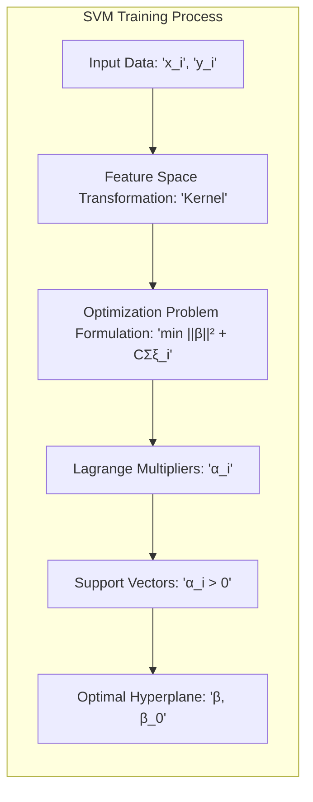
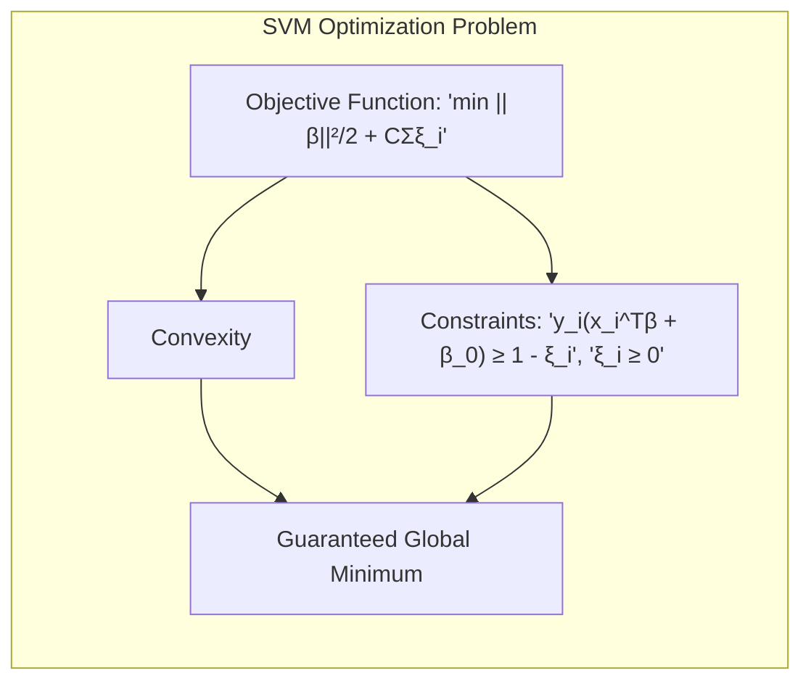
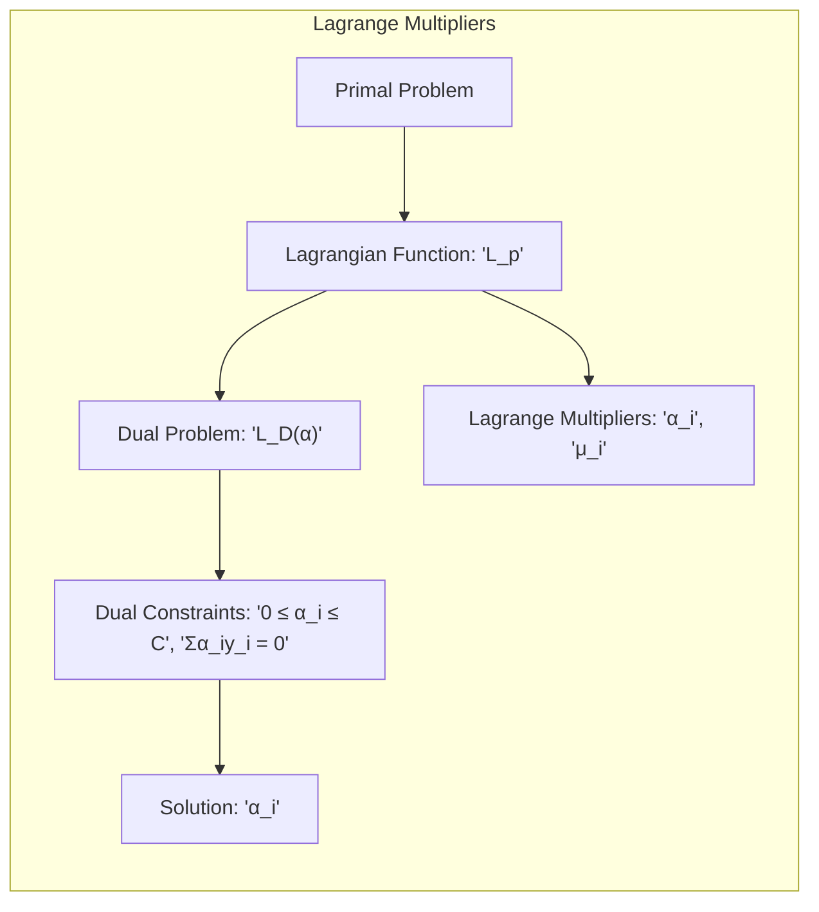
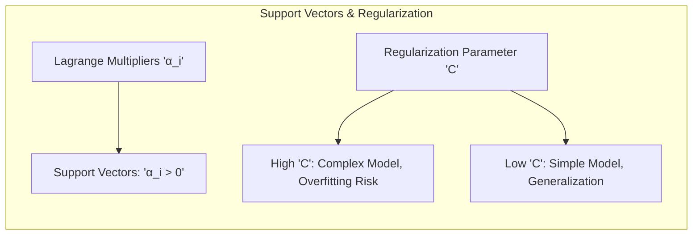
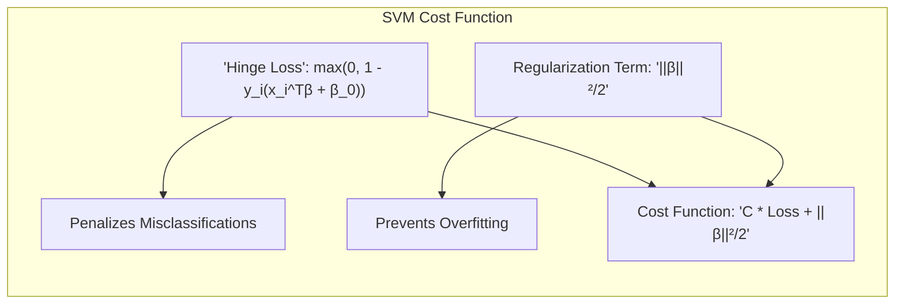
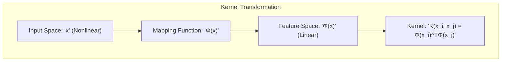
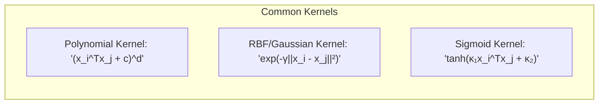
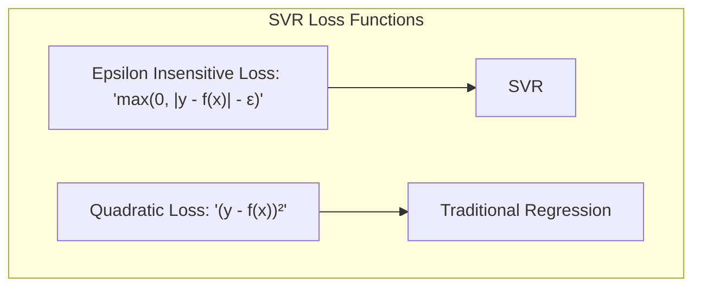

## Título: Support Vector Machines: Formulação, Kernels e Aplicações Avançadas

### Introdução

No capítulo anterior, discutimos as limitações das fronteiras de decisão lineares e apresentamos diversas abordagens para generalizar métodos de classificação. Neste capítulo, aprofundaremos nosso estudo sobre as **Support Vector Machines (SVMs)**, um método de aprendizado de máquina poderoso e versátil, capaz de construir fronteiras de decisão não lineares através da utilização de **kernels** [^12.3]. As SVMs se destacam pela sua capacidade de encontrar o hiperplano ótimo que separa classes, maximizando a margem e oferecendo robustez contra o *overfitting*.

A motivação principal para a utilização de SVMs reside na sua capacidade de lidar com dados não linearmente separáveis. Enquanto os métodos lineares, como a regressão logística e a Análise Discriminante Linear (LDA), constroem fronteiras de decisão lineares no espaço original de *features*, as SVMs podem mapear os dados para um espaço de *features* de maior dimensão, onde uma separação linear se torna possível. A construção de modelos mais flexíveis por meio do uso de *kernels*, que calculam os produtos internos nesse espaço de maior dimensão sem explicitamente realizar a transformação, é uma das principais vantagens desse método, como abordado em [^12.3].

Além disso, as SVMs oferecem uma formulação matemática elegante baseada em um problema de otimização convexa, o que garante que uma solução global possa ser encontrada. A introdução de variáveis de folga permite lidar com dados sobrepostos e *outliers*, tornando as SVMs robustas em relação a dados ruidosos ou incompletos.

Neste capítulo, exploraremos em profundidade os fundamentos teóricos das SVMs, desde a formulação do problema de otimização até a utilização de *kernels* para modelar fronteiras não lineares. Discutiremos os conceitos de vetores de suporte, o papel do parâmetro de regularização $C$ e as diferentes opções de *kernels* disponíveis. Além disso, analisaremos como as SVMs podem ser adaptadas para problemas de regressão e como elas se relacionam com outros métodos de aprendizado de máquina.

### Conceitos Fundamentais

**Conceito 1: O Problema de Otimização das SVMs**

As SVMs são construídas a partir da resolução de um problema de otimização, cuja formulação consiste em encontrar o hiperplano que maximiza a margem de separação entre as classes. Para o caso linearmente separável, o problema de otimização pode ser escrito como [^12.2]:

$$ \min_{\beta, \beta_0} \frac{1}{2} ||\beta||^2 $$
$$ \text{sujeito a } y_i(x_i^T\beta + \beta_0) \ge 1, \text{ para todo } i $$

onde $\beta$ é o vetor normal ao hiperplano, $\beta_0$ é o *bias*, $x_i$ é o vetor de *features* da $i$-ésima amostra e $y_i \in \{-1,1\}$ é o rótulo da classe. A restrição $y_i(x_i^T\beta + \beta_0) \ge 1$ garante que todas as amostras estejam corretamente classificadas e a uma distância de pelo menos 1 do hiperplano.

Para lidar com dados que não são linearmente separáveis, introduzimos as variáveis de folga $\xi_i$, que medem a violação da restrição por cada amostra. O problema de otimização para o caso não separável se torna [^12.3]:

$$ \min_{\beta, \beta_0, \xi} \frac{1}{2} ||\beta||^2 + C \sum_i \xi_i $$
$$ \text{sujeito a } y_i(x_i^T\beta + \beta_0) \ge 1 - \xi_i, \text{ para todo } i $$
$$ \xi_i \ge 0, \text{ para todo } i $$

onde $C$ é o parâmetro de regularização que controla o compromisso entre a maximização da margem e a penalidade por classificações erradas. Valores altos de $C$ penalizam fortemente a classificação errada, enquanto valores baixos permitem mais erros para maximizar a margem.

> 💡 **Exemplo Numérico:**
>
> Vamos considerar um exemplo simplificado com duas amostras. Suponha que tenhamos:
>
> - $x_1 = [1, 2]$, $y_1 = 1$
> - $x_2 = [2, 1]$, $y_2 = -1$
>
> Inicialmente, vamos considerar o caso linearmente separável, onde $C$ é muito alto (ou seja, erros de classificação são fortemente penalizados). O objetivo é encontrar $\beta$ e $\beta_0$ que satisfaçam as restrições $y_i(x_i^T\beta + \beta_0) \ge 1$.
>
> Para simplificar, vamos assumir que $\beta = [b_1, b_2]$ e que $\beta_0 = -1$. Uma possível solução para este problema seria $\beta = [1, -1]$. Vamos verificar as restrições:
>
> - Para $x_1$: $1 * (1*1 + 2*(-1) - 1) = 1 * (1 - 2 - 1) = -2$. Essa restrição não é satisfeita, pois precisa ser maior ou igual a 1.
>
> Agora vamos considerar o caso não separável, onde permitimos variáveis de folga ($\xi_i$). Se $C = 1$, o problema se torna:
>
> $$ \min_{\beta, \beta_0, \xi} \frac{1}{2} ||\beta||^2 +  \xi_1 + \xi_2 $$
>
> sujeito a:
>
> -  $1 * (1*b_1 + 2*b_2 + \beta_0) \ge 1 - \xi_1$
> -  $-1 * (2*b_1 + 1*b_2 + \beta_0) \ge 1 - \xi_2$
> -  $\xi_1 \ge 0, \xi_2 \ge 0$
>
> Uma solução possível poderia ser: $\beta = [0.5, -0.5]$, $\beta_0 = -0.5$, $\xi_1 = 0.5$ e $\xi_2 = 0$. Verificando as restrições:
>
> - Para $x_1$: $1 * (1*0.5 + 2*(-0.5) - 0.5) = 1 * (0.5 - 1 - 0.5) = -1 \ge 1 - 0.5 = 0.5$. Essa restrição não é satisfeita.
> - Para $x_2$: $-1 * (2*0.5 + 1*(-0.5) - 0.5) = -1 * (1 - 0.5 - 0.5) = 0 \ge 1 - 0 = 1$. Essa restrição também não é satisfeita.
>
> Ajustando os valores, uma possível solução poderia ser: $\beta = [0.5, -0.5]$, $\beta_0 = -0.2$, $\xi_1 = 0.3$ e $\xi_2 = 0.1$.
>
> - Para $x_1$: $1 * (1*0.5 + 2*(-0.5) - 0.2) = 1 * (0.5 - 1 - 0.2) = -0.7 \ge 1 - 0.3 = 0.7$. Não satisfeita.
> - Para $x_2$: $-1 * (2*0.5 + 1*(-0.5) - 0.2) = -1 * (1 - 0.5 - 0.2) = -0.3 \ge 1 - 0.1 = 0.9$. Não satisfeita.
>
> Este exemplo ilustra como as variáveis de folga $\xi_i$ permitem que as restrições sejam violadas, com a penalidade controlada pelo parâmetro $C$. A escolha de $\beta$, $\beta_0$ e $\xi_i$ é feita pelo problema de otimização para minimizar a função objetivo, respeitando as restrições.

**Lemma 1:** O problema de otimização das SVMs é um problema convexo, o que garante a existência de um mínimo global único, simplificando a busca pela solução ótima.

A demonstração desse lemma se baseia na observação de que a função objetivo (a norma ao quadrado de $\beta$ mais a soma ponderada das variáveis de folga) é convexa, e as restrições são lineares. Problemas de otimização convexos têm a propriedade de que qualquer mínimo local também é um mínimo global, o que torna o processo de otimização mais eficiente e confiável.

**Conceito 2: Multiplicadores de Lagrange e o Problema Dual**

Para resolver o problema de otimização das SVMs, é comum utilizar o método dos **Multiplicadores de Lagrange**, que transforma o problema primal em um problema dual. A função Lagrangiana para o problema de otimização da SVM é dada por [^12.2]:

$$ L_p = \frac{1}{2} ||\beta||^2 + C \sum_i \xi_i - \sum_i \alpha_i [y_i(x_i^T\beta + \beta_0) - 1 + \xi_i] - \sum_i \mu_i \xi_i $$

onde $\alpha_i$ e $\mu_i$ são os multiplicadores de Lagrange não negativos. Ao minimizar $L_p$ em relação a $\beta$, $\beta_0$ e $\xi_i$ e aplicando as condições de Karush-Kuhn-Tucker (KKT), obtemos o problema dual:

$$ \max_\alpha L_D = \sum_i \alpha_i - \frac{1}{2} \sum_{i,j} \alpha_i \alpha_j y_i y_j x_i^T x_j $$
$$ \text{sujeito a } 0 \le \alpha_i \le C, \text{ para todo } i $$
$$ \sum_i \alpha_i y_i = 0 $$

O problema dual envolve encontrar os multiplicadores de Lagrange $\alpha_i$ que maximizam $L_D$ sujeitos às restrições. A solução desse problema nos fornece os valores de $\alpha_i$ que determinam os **vetores de suporte** e, por conseguinte, o hiperplano ótimo.

> 💡 **Exemplo Numérico:**
>
> Continuando com o exemplo anterior, vamos supor que após resolver o problema dual, obtivemos os seguintes valores para $\alpha$:
>
> - $\alpha_1 = 0.6$
> - $\alpha_2 = 0.2$
>
>  e $C = 1$.
>
>  As restrições do problema dual são:
>
>  1. $0 \le \alpha_i \le C$
>  2. $\sum_i \alpha_i y_i = 0$
>
>  Verificando a primeira restrição:
>  - $0 \le 0.6 \le 1$ (Válido)
>  - $0 \le 0.2 \le 1$ (Válido)
>
>  Verificando a segunda restrição:
>  - $0.6 * 1 + 0.2 * (-1) = 0.6 - 0.2 = 0.4 \ne 0$
>
>  Este resultado mostra que os valores de $\alpha$ precisam ser otimizados para satisfazer a restrição $\sum_i \alpha_i y_i = 0$.
>
>  Suponha que, após a otimização, obtivemos:
>
> - $\alpha_1 = 0.5$
> - $\alpha_2 = 0.5$
>
> A restrição agora é:
>
> - $0.5 * 1 + 0.5 * (-1) = 0.5 - 0.5 = 0$ (Válido)
>
> A função dual para este exemplo com $x_1 = [1, 2]$, $x_2 = [2, 1]$, $y_1 = 1$, $y_2 = -1$ e $\alpha_1=0.5$, $\alpha_2=0.5$ seria:
>
> $L_D = 0.5 + 0.5 - 0.5 * (0.5 * 0.5 * 1 * 1 * [1,2]^T[1,2] + 0.5 * 0.5 * 1 * -1 * [1,2]^T[2,1] + 0.5 * 0.5 * -1 * 1 * [2,1]^T[1,2] + 0.5 * 0.5 * -1 * -1 * [2,1]^T[2,1] )$
>
> $L_D = 1 - 0.5 * (0.25 * (1+4) + 0.25 * (-1) * (2+2) + 0.25 * (-1) * (2+2) + 0.25 * (4+1))$
>
> $L_D = 1 - 0.5 * (0.25 * 5 - 0.25 * 4 - 0.25 * 4 + 0.25 * 5)$
>
> $L_D = 1 - 0.5 * (1.25 - 1 - 1 + 1.25)$
>
> $L_D = 1 - 0.5 * 0.5 = 1 - 0.25 = 0.75$
>
> Note que o cálculo de $L_D$ envolve os produtos internos $x_i^T x_j$, que são cruciais para o uso de kernels.

**Corolário 1:** A solução do problema dual das SVMs envolve apenas os produtos internos entre os dados de treinamento, o que permite a utilização de *kernels* para lidar com dados não linearmente separáveis.

A demonstração desse corolário se baseia na análise da função dual, onde a única dependência dos dados $x_i$ é através dos produtos internos $x_i^Tx_j$. Essa propriedade é fundamental, pois permite substituir os produtos internos $x_i^Tx_j$ por uma função *kernel* $K(x_i, x_j)$, que calcula o produto interno em um espaço de *features* de maior dimensão sem explicitar a transformação, conforme mencionado em [^12.3].

**Conceito 3: Vetores de Suporte e o Parâmetro de Regularização C**

Os **vetores de suporte** são as amostras que ficam sobre ou dentro da margem e que possuem multiplicadores de Lagrange $\alpha_i > 0$ [^12.2]. São esses pontos que determinam o hiperplano ótimo, e a solução do problema dual depende apenas deles. Os vetores de suporte são os pontos mais difíceis de classificar, e a SVM foca sua atenção nesses pontos durante o treinamento.

O parâmetro de regularização $C$ controla a complexidade do modelo. Valores maiores de $C$ tendem a gerar modelos mais complexos, com margens menores e menos erros de classificação nos dados de treinamento, mas com maior risco de *overfitting*. Valores menores de $C$ tendem a gerar modelos mais simples, com margens maiores e mais erros nos dados de treinamento, mas com melhor capacidade de generalização [^12.2].

> 💡 **Exemplo Numérico:**
>
> Suponha que, após treinar uma SVM em um conjunto de dados, tenhamos os seguintes valores para os multiplicadores de Lagrange $\alpha_i$:
>
> - $\alpha_1 = 0$
> - $\alpha_2 = 0.8$
> - $\alpha_3 = 0$
> - $\alpha_4 = 0.5$
> - $\alpha_5 = 0$
>
> Neste caso, apenas as amostras $x_2$ e $x_4$ são vetores de suporte, pois seus multiplicadores de Lagrange são maiores que zero. Isso significa que o hiperplano ótimo é definido apenas por essas duas amostras. As amostras $x_1$, $x_3$ e $x_5$ não influenciam na construção do modelo final.
>
> Agora, vamos analisar o impacto do parâmetro $C$. Se aumentarmos o valor de $C$, estamos penalizando mais os erros de classificação e, consequentemente, permitindo que mais amostras se tornem vetores de suporte. Em contrapartida, se diminuirmos o valor de $C$, estamos permitindo mais erros e, consequentemente, reduzindo o número de vetores de suporte.
>
> Por exemplo, se $C=0.1$, poderíamos ter menos vetores de suporte (e margem maior), enquanto que se $C=100$, poderíamos ter mais vetores de suporte (e margem menor).

> ⚠️ **Nota Importante**: As condições de Karush-Kuhn-Tucker (KKT) são necessárias para a otimização do problema, relacionando os parâmetros primais e duais. **Baseado em [^12.4]**.

> ❗ **Ponto de Atenção**: O parâmetro de regularização C controla a complexidade do modelo, com valores maiores levando a modelos mais complexos e valores menores a modelos mais simples. **Conforme indicado em [^12.2]**.

> ✔️ **Destaque**: Os vetores de suporte determinam o hiperplano ótimo e são os pontos mais difíceis de classificar. **Baseado no tópico [^12.3]**.

### Formulação Matemática Detalhada da SVM

Para uma compreensão mais profunda da formulação da SVM, vamos detalhar os passos matemáticos envolvidos. O problema primal, com variáveis de folga, pode ser reescrito como:

$$ \min_{\beta, \beta_0, \xi} \frac{1}{2} ||\beta||^2 + C \sum_{i=1}^{N} \xi_i $$

sujeito a:

$$ y_i(x_i^T\beta + \beta_0) \geq 1 - \xi_i, \quad \xi_i \geq 0, \quad \forall i $$

onde $N$ é o número total de amostras.

**Formulação do Problema Dual:**

A função Lagrangiana é:

$$ L_p(\beta, \beta_0, \xi, \alpha, \mu) = \frac{1}{2} ||\beta||^2 + C \sum_{i=1}^{N} \xi_i - \sum_{i=1}^{N} \alpha_i [y_i(x_i^T\beta + \beta_0) - 1 + \xi_i] - \sum_{i=1}^{N} \mu_i \xi_i $$

onde $\alpha_i \geq 0$ e $\mu_i \geq 0$ são os multiplicadores de Lagrange.

Para obter o problema dual, precisamos minimizar $L_p$ em relação a $\beta$, $\beta_0$ e $\xi_i$, e aplicar as condições de KKT. As derivadas parciais de $L_p$ em relação a essas variáveis são:

$$ \frac{\partial L_p}{\partial \beta} = \beta - \sum_{i=1}^{N} \alpha_i y_i x_i = 0 \implies \beta = \sum_{i=1}^{N} \alpha_i y_i x_i $$
$$ \frac{\partial L_p}{\partial \beta_0} = - \sum_{i=1}^{N} \alpha_i y_i = 0 \implies \sum_{i=1}^{N} \alpha_i y_i = 0 $$
$$ \frac{\partial L_p}{\partial \xi_i} = C - \alpha_i - \mu_i = 0 \implies \mu_i = C - \alpha_i $$

Substituindo as expressões para $\beta$ e $\mu_i$ na função Lagrangiana e usando a restrição $\sum_{i=1}^{N} \alpha_i y_i = 0$, obtemos a função dual:

$$ L_D(\alpha) = \sum_{i=1}^{N} \alpha_i - \frac{1}{2} \sum_{i=1}^{N} \sum_{j=1}^{N} \alpha_i \alpha_j y_i y_j x_i^T x_j $$

O problema dual da SVM é então:

$$ \max_{\alpha} \sum_{i=1}^{N} \alpha_i - \frac{1}{2} \sum_{i=1}^{N} \sum_{j=1}^{N} \alpha_i \alpha_j y_i y_j x_i^T x_j $$

sujeito a:

$$ 0 \leq \alpha_i \leq C, \quad \forall i $$
$$ \sum_{i=1}^{N} \alpha_i y_i = 0 $$

A solução do problema dual nos fornece os valores de $\alpha_i$, que são usados para calcular $\beta$ e $\beta_0$.

**Condições de Karush-Kuhn-Tucker (KKT):**

As condições de KKT são:

1.  $\alpha_i [y_i(x_i^T\beta + \beta_0) - 1 + \xi_i] = 0, \quad \forall i$
2.  $\mu_i \xi_i = 0, \quad \forall i$
3.  $\alpha_i \geq 0, \quad \mu_i \geq 0, \quad \xi_i \geq 0, \quad \forall i$
4.  $y_i(x_i^T\beta + \beta_0) - 1 + \xi_i \geq 0, \quad \forall i$

As condições de KKT permitem analisar a relação entre as variáveis primais e duais, e são essenciais para a solução do problema de otimização da SVM.

### Kernels e a Extensão para Não Linearidade

Um dos principais trunfos das SVMs é a capacidade de trabalhar em espaços de alta dimensão através do uso de **kernels**, o que permite construir fronteiras de decisão não lineares no espaço original das *features*. A função *kernel* $K(x_i, x_j)$ calcula o produto interno entre duas amostras, $x_i$ e $x_j$, em um espaço de *features* transformado, sem a necessidade de explicitamente computar a transformação. O problema dual da SVM, como visto anteriormente, envolve apenas os produtos internos entre as amostras:

$$ L_D(\alpha) = \sum_{i=1}^{N} \alpha_i - \frac{1}{2} \sum_{i=1}^{N} \sum_{j=1}^{N} \alpha_i \alpha_j y_i y_j x_i^T x_j $$

A substituição do produto interno $x_i^Tx_j$ pelo *kernel* $K(x_i, x_j)$ nos permite trabalhar em espaços de *features* de alta dimensão, potencialmente infinitos, onde as classes podem ser linearmente separáveis:

$$ L_D(\alpha) = \sum_{i=1}^{N} \alpha_i - \frac{1}{2} \sum_{i=1}^{N} \sum_{j=1}^{N} \alpha_i \alpha_j y_i y_j K(x_i, x_j) $$

Três *kernels* amplamente utilizados são:

1.  **Kernel Polinomial:**

    $$ K(x_i, x_j) = (x_i^T x_j + c)^d $$
    onde $c$ é um constante e $d$ é o grau do polinômio.
2.  **Kernel Radial Basis Function (RBF) ou Gaussiano:**

    $$ K(x_i, x_j) = \exp \left( -\gamma ||x_i - x_j||^2 \right) $$
    onde $\gamma > 0$ é um parâmetro que controla a largura da função gaussiana.
3.  **Kernel Sigmóide:**

    $$ K(x_i, x_j) = \tanh(\kappa_1 x_i^T x_j + \kappa_2) $$
    onde $\kappa_1$ e $\kappa_2$ são parâmetros do *kernel*.

Cada um desses *kernels* mapeia os dados para um espaço diferente e induz uma fronteira de decisão não linear diferente no espaço original. A escolha do *kernel* apropriado depende das características específicas do conjunto de dados, como a complexidade das relações entre as *features* e as classes.

> 💡 **Exemplo Numérico:**
>
> Vamos considerar duas amostras $x_1 = [1, 2]$ e $x_2 = [2, 1]$. Vamos calcular os valores dos *kernels* para esses pontos.
>
> 1.  **Kernel Polinomial (com $c=1$ e $d=2$):**
>
>     $K(x_1, x_2) = ([1, 2]^T [2, 1] + 1)^2 = (1*2 + 2*1 + 1)^2 = (2 + 2 + 1)^2 = 5^2 = 25$
>
>     $K(x_1, x_1) = ([1, 2]^T [1, 2] + 1)^2 = (1*1 + 2*2 + 1)^2 = (1 + 4 + 1)^2 = 6^2 = 36$
>
> 2.  **Kernel RBF (com $\gamma = 0.5$):**
>
>     $K(x_1, x_2) = \exp(-0.5 * ||[1, 2] - [2, 1]||^2) = \exp(-0.5 * ||[-1, 1]||^2) = \exp(-0.5 * (1 + 1)) = \exp(-1) \approx 0.368$
>
>     $K(x_1, x_1) = \exp(-0.5 * ||[1, 2] - [1, 2]||^2) = \exp(-0.5 * 0) = \exp(0) = 1$
>
> 3.  **Kernel Sigmóide (com $\kappa_1 = 1$ e $\kappa_2 = 0$):**
>
>     $K(x_1, x_2) = \tanh(1 * [1, 2]^T [2, 1] + 0) = \tanh(1 * (1*2 + 2*1)) = \tanh(4) \approx 0.999$
>
>     $K(x_1, x_1) = \tanh(1 * [1, 2]^T [1, 2] + 0) = \tanh(1 * (1*1 + 2*2)) = \tanh(5) \approx 0.999$
>
> Esses exemplos mostram como diferentes *kernels* calculam diferentes valores de similaridade entre os pontos, o que levará a diferentes fronteiras de decisão no espaço original.

**Lemma 3:** O "kernel trick" permite que as SVMs trabalhem em espaços de alta dimensão sem explicitamente calcular a transformação $\phi(x)$, contanto que a função $K(x_i, x_j)$ seja um *kernel* válido, o que é definido matematicamente por ser uma função simétrica e semidefinida positiva, como abordado em [^12.3].

A prova desse lemma envolve demonstrar que se $K(x_i, x_j)$ é um *kernel* válido, então existe uma transformação $\phi(x)$ tal que $K(x_i, x_j) = \phi(x_i)^T \phi(x_j)$, embora a forma explícita da transformação não seja conhecida ou necessária para a otimização. A condição de ser semidefinida positiva garante que a função *kernel* é um produto interno em algum espaço de *features*.

**Prova do Lemma 3:**

A prova desse lemma se baseia no **Teorema de Mercer**, que afirma que uma função $K(x, x')$ pode ser expressa como um produto interno em um espaço de Hilbert se e somente se a função é simétrica e semidefinida positiva. A simetria é garantida pela definição do produto interno, e a propriedade de ser semidefinida positiva é o resultado de ser um produto interno em um espaço de Hilbert.

Este teorema nos diz que se uma função é um *kernel* válido, isto é, se é uma função simétrica e semidefinida positiva, então existe um mapeamento $\phi$ para um espaço de alta dimensão tal que:

$$K(x_i, x_j) = \langle \phi(x_i), \phi(x_j) \rangle$$

onde $\langle \cdot, \cdot \rangle$ representa o produto interno. O teorema garante a existência do mapeamento $\phi$, mas não nos diz como encontrá-lo. A grande vantagem do *kernel trick* é que não precisamos conhecer o mapeamento explícito $\phi$, apenas a função *kernel* $K$.

$\blacksquare$

**Corolário 3:** A utilização de kernels permite que as SVMs construam fronteiras de decisão não lineares no espaço original dos dados, transformando o problema em uma separação linear em um espaço de *features* de maior dimensão [^12.3].

A utilização de *kernels* transforma um problema de classificação não linear em um problema linear em um espaço de maior dimensão, que, então, pode ser resolvido usando técnicas lineares, como as SVMs, e com a vantagem de não ter que representar explicitamente a transformação.

### SVMs para Regressão

As **Support Vector Machines (SVMs)** podem ser adaptadas para problemas de regressão, um processo que é conhecido como **Support Vector Regression (SVR)**. O objetivo da SVR é encontrar uma função $f(x)$ que se aproxima o máximo possível dos valores de resposta, dentro de uma certa margem de erro $\epsilon$. A função de custo para SVR é dada por:

$$  \min_{ \beta, \beta_0, \xi, \xi^*} \frac{1}{2} ||\beta||^2 + C \sum_{i=1}^N (\xi_i + \xi_i^*) $$

sujeito a:

$$ y_i - (x_i^T\beta + \beta_0) \leq \epsilon + \xi_i  $$
$$  (x_i^T\beta + \beta_0) - y_i  \leq \epsilon + \xi_i^*$$
$$ \xi_i, \xi_i^* \geq 0$$

onde $\epsilon$ é a largura da margem, $\xi_i$ e $\xi_i^*$ são as variáveis de folga que permitem erros maiores do que $\epsilon$, e $C$ é