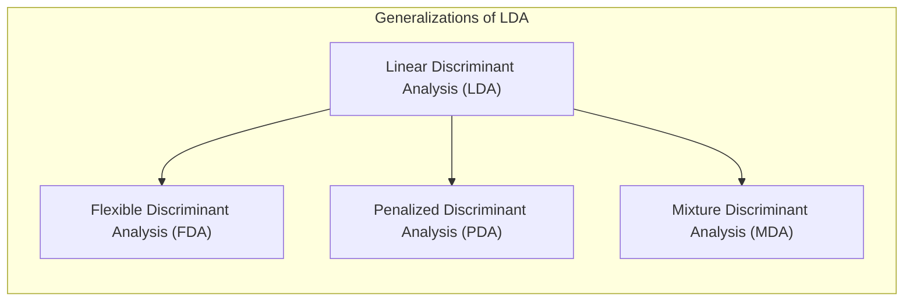
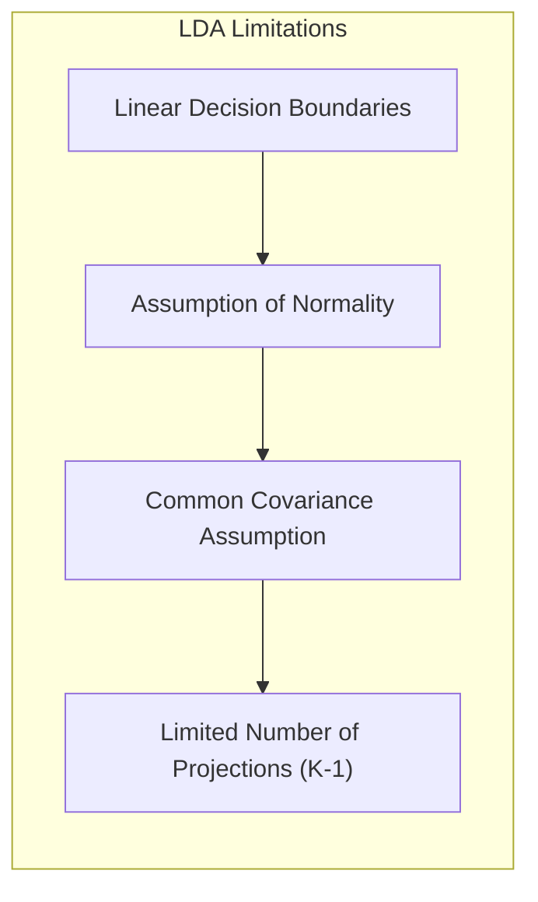
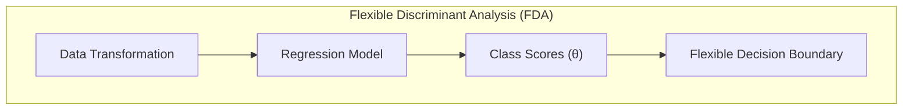
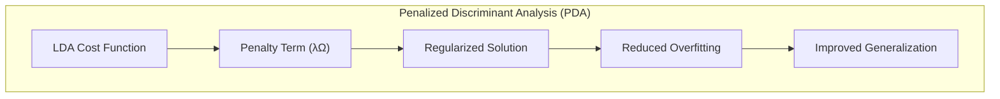
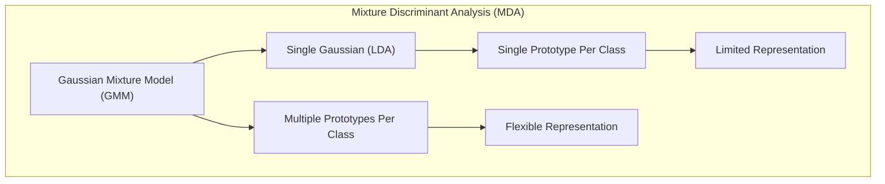
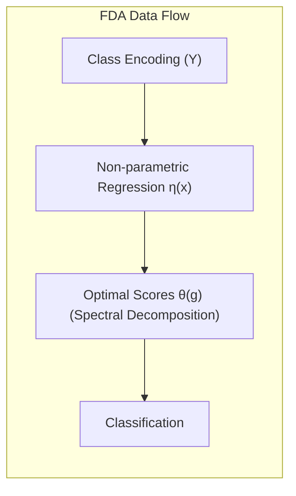
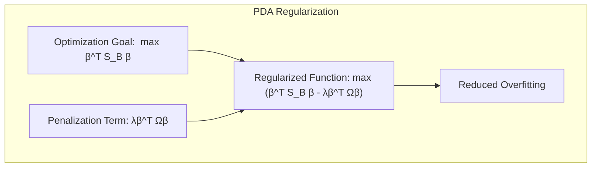
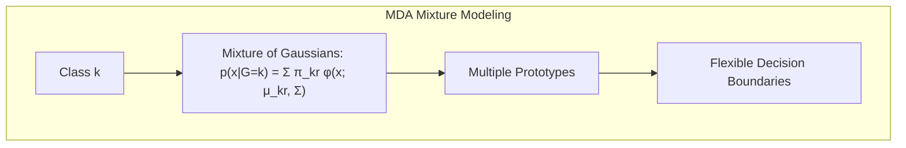

## Título: Generalizações da Análise Discriminante Linear: FDA, PDA e MDA



### Introdução

No capítulo anterior, discutimos as **Support Vector Machines (SVMs)** como uma poderosa ferramenta para construção de fronteiras de decisão não lineares. Neste capítulo, voltamos nossa atenção para outra abordagem de generalização, focando na **Análise Discriminante Linear (LDA)** e suas extensões: **Análise Discriminante Flexível (FDA)**, **Análise Discriminante Penalizada (PDA)** e **Análise Discriminante por Misturas (MDA)**. O objetivo principal destas técnicas é superar as limitações da LDA, que assume que as classes são Gaussianas com uma matriz de covariância comum, uma premissa que raramente se mantém em dados reais [^12.4].

A **LDA**, apesar de sua simplicidade e interpretabilidade, apresenta limitações importantes em problemas de classificação complexos. Uma das principais limitações é a rigidez de suas fronteiras de decisão, que são lineares e, portanto, inadequadas para dados com padrões de separação não lineares. Além disso, a suposição de uma covariância comum para todas as classes pode levar a resultados subótimos quando as classes apresentam estruturas de covariância diferentes.

As generalizações da LDA, por outro lado, procuram endereçar estas limitações de diferentes maneiras. A **Análise Discriminante Flexível (FDA)** generaliza a LDA através da aplicação de regressão linear em respostas transformadas, o que permite modelar relações não lineares entre as *features* e as classes, como discutido em [^12.5]. A **Análise Discriminante Penalizada (PDA)** foca em lidar com alta dimensionalidade, introduzindo um termo de penalização para controlar a complexidade do modelo, especialmente em conjuntos de dados onde o número de *features* é muito maior do que o número de amostras. Já a **Análise Discriminante por Misturas (MDA)** busca superar a limitação de representar cada classe por um único protótipo, utilizando modelos de mistura Gaussianos para modelar a distribuição de cada classe, permitindo assim que cada classe seja representada por múltiplos protótipos, como abordado em [^12.4].

Neste capítulo, exploraremos em detalhe cada uma dessas abordagens, analisando suas motivações, formulações matemáticas e como cada método contribui para aprimorar a capacidade de classificação em cenários complexos. Além disso, discutiremos a relação entre estas técnicas e outros métodos de aprendizado de máquina, como a regressão linear e a regressão logística.

### Conceitos Fundamentais: Limitações da LDA e Abordagens de Generalização

**Conceito 1: As Limitações da Análise Discriminante Linear (LDA)**

A **Análise Discriminante Linear (LDA)** é um método de classificação que busca projetar os dados em um subespaço de menor dimensão, maximizando a separação entre as classes e minimizando a variância dentro de cada classe [^12.4]. A LDA assume que os dados de cada classe seguem uma distribuição Gaussiana com uma matriz de covariância comum. A função discriminante da LDA é linear, o que a torna um método simples e eficiente para dados com estruturas lineares de separabilidade.

No entanto, a LDA apresenta limitações importantes, como:

1.  **Fronteiras de Decisão Lineares:** A LDA gera fronteiras de decisão lineares, o que pode ser inadequado para dados com padrões de separação não lineares ou com classes sobrepostas.
2.  **Suposição de Normalidade:** A LDA assume que os dados seguem uma distribuição normal, o que pode não ser válido para muitos conjuntos de dados reais.
3.  **Covariância Comum:** A LDA assume que todas as classes compartilham a mesma matriz de covariância, o que pode levar a modelos inadequados quando as classes apresentam estruturas de covariância distintas.
4.  **Número Limitado de Projeções:** A LDA limita o número de projeções discriminantes ao número de classes menos 1, o que pode ser insuficiente em problemas com muitas classes.



**Lemma 1:** A suposição de normalidade multivariada e covariância comum em LDA são restritivas e podem levar a resultados subótimos quando as classes não seguem estas distribuições.

A demonstração desse lemma envolve a análise da natureza da função discriminante da LDA, que é derivada da densidade gaussiana e da matriz de covariância comum. Quando as classes não seguem essa distribuição ou compartilham covariâncias distintas, a função discriminante da LDA não representa adequadamente as probabilidades *a posteriori*, resultando em decisões de classificação subótimas.

> 💡 **Exemplo Numérico:**
>
> Considere um problema de classificação com duas classes, onde os dados da classe 1 são gerados por uma distribuição normal com média $\mu_1 = [1, 1]^T$ e matriz de covariância $\Sigma_1 = \begin{bmatrix} 1 & 0 \\ 0 & 1 \end{bmatrix}$, e os dados da classe 2 são gerados por uma distribuição normal com média $\mu_2 = [3, 3]^T$ e matriz de covariância $\Sigma_2 = \begin{bmatrix} 2 & 0.5 \\ 0.5 & 2 \end{bmatrix}$.
>
> ```python
> import numpy as np
> import matplotlib.pyplot as plt
> from sklearn.discriminant_analysis import LinearDiscriminantAnalysis
>
> # Dados de exemplo
> np.random.seed(42)
> mean1 = [1, 1]
> cov1 = [[1, 0], [0, 1]]
> mean2 = [3, 3]
> cov2 = [[2, 0.5], [0.5, 2]]
> X1 = np.random.multivariate_normal(mean1, cov1, 100)
> X2 = np.random.multivariate_normal(mean2, cov2, 100)
> X = np.concatenate((X1, X2))
> y = np.array([0] * 100 + [1] * 100)
>
> # Aplicar LDA
> lda = LinearDiscriminantAnalysis()
> lda.fit(X, y)
>
> # Plotar os dados e a fronteira de decisão
> x_min, x_max = X[:, 0].min() - 1, X[:, 0].max() + 1
> y_min, y_max = X[:, 1].min() - 1, X[:, 1].max() + 1
> xx, yy = np.meshgrid(np.linspace(x_min, x_max, 100), np.linspace(y_min, y_max, 100))
> Z = lda.predict(np.c_[xx.ravel(), yy.ravel()])
> Z = Z.reshape(xx.shape)
>
> plt.contourf(xx, yy, Z, alpha=0.3)
> plt.scatter(X1[:, 0], X1[:, 1], c='blue', label='Classe 1')
> plt.scatter(X2[:, 0], X2[:, 1], c='red', label='Classe 2')
> plt.xlabel('Feature 1')
> plt.ylabel('Feature 2')
> plt.title('LDA em Dados com Covariâncias Diferentes')
> plt.legend()
> plt.show()
>
> print(f"Coeficientes LDA: {lda.coef_}")
> print(f"Intercepto LDA: {lda.intercept_}")
> ```
>
> Neste exemplo, as classes têm covariâncias diferentes, o que viola a suposição da LDA. A fronteira de decisão obtida pela LDA é linear, mas não captura completamente a complexidade dos dados. A classe 2, devido à sua maior variância, é mais espalhada e a fronteira linear da LDA não separa as classes de forma ideal. Este cenário ilustra como a suposição de covariância comum da LDA pode levar a resultados subótimos.
>
> A saída dos coeficientes e do intercepto da LDA permite visualizar a inclinação e o posicionamento da fronteira de decisão linear no plano das *features*.

**Conceito 2: Análise Discriminante Flexível (FDA)**

A **Análise Discriminante Flexível (FDA)** generaliza a LDA através da utilização de regressão linear sobre respostas transformadas [^12.5]. A FDA busca encontrar uma função $\theta$ que atribui scores às classes, de tal forma que estes scores possam ser previstos por regressão linear. A motivação por trás da FDA é encontrar um espaço onde as classes se separam linearmente, mas utilizando regressão flexível sobre transformações das classes. A FDA pode usar modelos de regressão mais flexíveis do que a simples projeção linear da LDA, o que permite modelar relações não lineares entre as *features* e as classes.



**Corolário 1:** A FDA pode usar modelos de regressão não paramétricos para projetar as classes em um espaço onde a separação linear é maximizada, relaxando as restrições impostas pela LDA.

A demonstração desse corolário se baseia na análise da formulação da FDA, onde o problema de encontrar scores ótimos para cada classe é transformado em um problema de regressão, com a possibilidade de usar modelos mais flexíveis, como modelos aditivos, *splines* ou MARS, o que permite aproximar as classes por funções não lineares.

> 💡 **Exemplo Numérico:**
>
> Considere um problema de classificação binária com dados que seguem um padrão circular. A LDA não conseguiria separar esses dados de forma eficaz, pois sua fronteira é linear. A FDA, no entanto, pode usar um modelo de regressão não paramétrico, como um modelo aditivo com *splines*, para modelar a relação entre as *features* e as classes.
>
> ```python
> import numpy as np
> import matplotlib.pyplot as plt
> from sklearn.linear_model import LinearRegression
> from sklearn.preprocessing import PolynomialFeatures
> from patsy import dmatrix
>
> # Dados de exemplo (padrão circular)
> np.random.seed(42)
> n_samples = 200
> radius = np.random.uniform(0, 1, n_samples)
> angle = np.random.uniform(0, 2 * np.pi, n_samples)
> X = np.column_stack((radius * np.cos(angle), radius * np.sin(angle)))
> y = (radius > 0.5).astype(int)
>
> # Adicionar ruído
> X += np.random.normal(0, 0.1, X.shape)
>
> # Aplicar FDA com regressão polinomial
> poly = PolynomialFeatures(degree=3)
> X_poly = poly.fit_transform(X)
>
> model = LinearRegression()
> model.fit(X_poly, y)
>
> # Plotar a fronteira de decisão
> x_min, x_max = X[:, 0].min() - 0.5, X[:, 0].max() + 0.5
> y_min, y_max = X[:, 1].min() - 0.5, X[:, 1].max() + 0.5
> xx, yy = np.meshgrid(np.linspace(x_min, x_max, 100), np.linspace(y_min, y_max, 100))
> Z = model.predict(poly.transform(np.c_[xx.ravel(), yy.ravel()]))
> Z = Z.reshape(xx.shape)
>
> plt.contourf(xx, yy, Z, levels=[0.5], colors=['gray'], alpha=0.3)
> plt.scatter(X[y == 0, 0], X[y == 0, 1], c='blue', label='Classe 0')
> plt.scatter(X[y == 1, 0], X[y == 1, 1], c='red', label='Classe 1')
> plt.xlabel('Feature 1')
> plt.ylabel('Feature 2')
> plt.title('FDA com Regressão Polinomial')
> plt.legend()
> plt.show()
>
> print(f"Coeficientes do modelo FDA: {model.coef_}")
> print(f"Intercepto do modelo FDA: {model.intercept_}")
> ```
>
> Neste exemplo, a regressão polinomial, uma forma de regressão não paramétrica, é usada para modelar a relação entre as *features* e as classes. A fronteira de decisão resultante é não linear e consegue separar as classes com um padrão circular, algo que a LDA não conseguiria. Os coeficientes mostram a importância de cada termo polinomial na modelagem da fronteira de decisão.
>
> O uso de `patsy` para criar a matriz de design pode ser substituído por outras técnicas de expansão de base, como *splines*, dependendo do modelo de regressão não paramétrico escolhido.

**Conceito 3: Análise Discriminante Penalizada (PDA)**

A **Análise Discriminante Penalizada (PDA)** busca lidar com problemas de alta dimensionalidade introduzindo um termo de penalização na função de custo da LDA [^12.6]. Em problemas com um grande número de *features* (alta dimensionalidade), a LDA pode sofrer com o problema do *overfitting*, o que leva a modelos com baixa capacidade de generalização. A PDA introduz um termo de penalização para controlar a complexidade do modelo e evitar a utilização de *features* redundantes ou irrelevantes. A penalização geralmente é aplicada aos coeficientes do modelo, como em métodos de regressão regularizada, e a forma da penalização afeta a natureza da solução, como o tipo de suavização da função discriminante.



**Corolário 2:** A PDA usa penalizações para obter modelos LDA mais estáveis e com menor variância, especialmente em problemas de alta dimensionalidade.

A demonstração desse corolário envolve a análise da função de custo da PDA, que inclui um termo de penalização que restringe a complexidade do modelo. Ao adicionar essa penalização, os coeficientes do modelo são reduzidos em magnitude, levando a funções discriminantes mais suaves e com maior capacidade de generalização em dados não vistos.

> 💡 **Exemplo Numérico:**
>
> Considere um problema de classificação com 100 *features*, onde apenas 10 são realmente informativas e as outras 90 são ruído. A LDA, sem regularização, pode superajustar os dados de treinamento, utilizando as 100 *features* para separar as classes, levando a um modelo com baixa capacidade de generalização. A PDA, com regularização $L_2$, penaliza os coeficientes das *features* não informativas, levando a um modelo mais estável e com melhor desempenho em dados novos.
>
> ```python
> import numpy as np
> from sklearn.model_selection import train_test_split
> from sklearn.metrics import accuracy_score
> from sklearn.discriminant_analysis import LinearDiscriminantAnalysis
> from sklearn.linear_model import RidgeClassifier
>
> # Gerar dados de exemplo com alta dimensionalidade
> np.random.seed(42)
> n_samples = 200
> n_informative_features = 10
> n_features = 100
>
> X = np.random.randn(n_samples, n_features)
> W = np.random.randn(n_features, 1)
>
> # Definir os coeficientes das features informativas
> W[0:n_informative_features] = np.random.randn(n_informative_features, 1) * 5
>
> # Gerar classes com base nas features informativas + ruído
> y = (X @ W + np.random.randn(n_samples, 1) > 0).astype(int).flatten()
>
> # Dividir em conjuntos de treino e teste
> X_train, X_test, y_train, y_test = train_test_split(X, y, test_size=0.3, random_state=42)
>
> # Aplicar LDA sem penalização
> lda = LinearDiscriminantAnalysis()
> lda.fit(X_train, y_train)
> y_pred_lda = lda.predict(X_test)
>
> # Aplicar PDA (Ridge) com penalização L2
> pda = RidgeClassifier(alpha=1.0) # alpha é o parâmetro de regularização lambda
> pda.fit(X_train, y_train)
> y_pred_pda = pda.predict(X_test)
>
> # Avaliar os modelos
> acc_lda = accuracy_score(y_test, y_pred_lda)
> acc_pda = accuracy_score(y_test, y_pred_pda)
>
> print(f"Acurácia LDA: {acc_lda:.4f}")
> print(f"Acurácia PDA (Ridge): {acc_pda:.4f}")
> print(f"Coeficientes LDA: {lda.coef_}")
> print(f"Coeficientes PDA: {pda.coef_}")
>
> # Comparar os coeficientes
> plt.figure(figsize=(10, 6))
> plt.plot(lda.coef_.flatten(), label='LDA')
> plt.plot(pda.coef_.flatten(), label='PDA (Ridge)')
> plt.xlabel('Feature Index')
> plt.ylabel('Coefficient Value')
> plt.title('Comparação dos Coeficientes LDA vs PDA')
> plt.legend()
> plt.show()
> ```
>
> Neste exemplo, a PDA (implementada usando `RidgeClassifier`) demonstra melhor desempenho do que a LDA em um cenário de alta dimensionalidade com ruído. A regularização $L_2$ reduz a magnitude dos coeficientes das *features* não informativas, resultando em um modelo mais generalizável. O gráfico compara os coeficientes dos dois modelos, mostrando como a PDA penaliza os coeficientes, tornando-os menores em valor absoluto. A acurácia de teste é um bom indicador da capacidade de generalização dos modelos.

**Conceito 4: Análise Discriminante por Misturas (MDA)**

A **Análise Discriminante por Misturas (MDA)** generaliza a LDA ao modelar a distribuição de cada classe como uma mistura de gaussianas com uma matriz de covariância comum. Em muitos cenários, representar uma classe com um único centroide (como faz a LDA) é insuficiente para capturar a complexidade da distribuição. A MDA permite que cada classe seja representada por múltiplos protótipos (centróides), o que oferece maior flexibilidade na modelagem das classes e na construção das fronteiras de decisão. A MDA combina os conceitos de modelos de mistura gaussianas e LDA, e o ajuste dos parâmetros é tipicamente realizado utilizando o algoritmo EM, como abordado em [^12.4].



> ⚠️ **Nota Importante**: A LDA assume que as classes são Gaussianas com uma covariância comum, enquanto a FDA usa modelos de regressão flexíveis para modelar as relações entre as *features* e as classes, como apontado em [^12.4] e [^12.5].

> ❗ **Ponto de Atenção**: A PDA aborda a questão da alta dimensionalidade adicionando um termo de penalização, evitando o *overfitting* e melhorando a generalização do modelo.

> ✔️ **Destaque**: A MDA generaliza a LDA ao modelar a distribuição de cada classe como uma mistura de gaussianas, o que permite uma melhor adaptação aos dados. **Baseado em [^12.7]**.

### Análise Discriminante Flexível (FDA): Formulação e Implementação



A **Análise Discriminante Flexível (FDA)**, como discutido anteriormente, generaliza a LDA através da utilização de regressão linear em respostas transformadas. O objetivo é encontrar um conjunto de scores $\theta_l(g)$ para cada classe $g$, onde $l=1,\ldots,L$ e $L$ é o número de projeções discriminantes desejadas, de forma que a relação entre as *features* e os scores seja modelada por funções de regressão flexíveis, em vez de uma projeção linear direta, como na LDA. Formalmente, buscamos minimizar:

$$ ASR = \sum_{l=1}^L \sum_{i=1}^{N} [\theta_l(g_i) - \eta_l(x_i)]^2 $$

onde $\eta_l(x_i)$ são as funções de regressão que dependem das *features* $x_i$ e que modelam os scores $\theta_l(g_i)$, e $ASR$ é o *Average Squared Residual*.

Para construir o modelo FDA, realizamos os seguintes passos:

1.  **Codificação das Classes:** Criamos uma matriz de respostas $Y$ com dimensões $N \times K$, onde $N$ é o número de amostras e $K$ é o número de classes. Cada linha de $Y$ corresponde a uma amostra e cada coluna corresponde a uma classe. Se a $i$-ésima amostra pertence à classe $k$, então $Y_{ik} = 1$, caso contrário $Y_{ik} = 0$.
2.  **Regressão Não Paramétrica:** Aplicamos uma regressão não paramétrica sobre a matriz de respostas $Y$ em função das *features*, o que nos leva a um conjunto de projeções $\eta_l(x)$. A regressão pode ser feita através de métodos como *splines* aditivas, MARS ou outras formas de modelos não paramétricos.
3.  **Scores Ótimos:** Calculamos os scores ótimos $\theta_l(g_i)$ através de uma decomposição espectral da matriz de respostas ajustada. Os scores ótimos, em conjunto com a decomposição, nos permitem encontrar novas representações das classes, onde as classes são otimamente separadas, de acordo com a métrica utilizada.

A FDA permite escolher o tipo de regressão mais adequado para o problema em questão, oferecendo flexibilidade e capacidade de modelar relações não lineares entre as *features* e as classes. O número de projeções discriminantes $L$ pode ser menor que $K - 1$, o que é uma forma de redução de dimensionalidade, além da projeção sobre componentes discriminantes.

A função de regressão $\eta_l(x)$ pode ser expressa como uma função linear sobre a base de funções gerada pelo modelo de regressão não paramétrica:

$$ \eta_l(x) = h(x)^T \beta_l  $$

Onde $h(x)$ são as funções de base geradas pela regressão não paramétrica.

A escolha do método de regressão e do número de componentes discriminantes são decisões importantes que impactam no desempenho do modelo FDA. A escolha do número de componentes discriminantes pode ser feita por validação cruzada ou outras técnicas de seleção de modelos, enquanto a escolha do método de regressão deve considerar a complexidade dos dados e as relações entre as *features* e as classes.

**Lemma 4:** A FDA generaliza LDA ao substituir a projeção linear por uma regressão não paramétrica, o que permite modelar relações não lineares entre as *features* e as classes e melhorar a capacidade de classificação em problemas complexos.

A prova desse lemma reside na análise da formulação da FDA, onde a projeção linear da LDA é substituída por modelos de regressão não paramétricos, que permitem uma representação mais flexível das classes e uma melhor adaptação a dados não lineares. Ao usar a regressão, a FDA não só projeta as classes em espaços lineares como faz a LDA, mas também modela cada uma das classes como funções em um espaço de *features*.

### Análise Discriminante Penalizada (PDA): Regularização e Alta Dimensionalidade



A **Análise Discriminante Penalizada (PDA)** surge como uma resposta à necessidade de lidar com a alta dimensionalidade em problemas de classificação, onde o número de *features* é comparável ou maior do que o número de amostras. Em cenários com alta dimensionalidade, a LDA, ao buscar encontrar um espaço discriminante, pode se ajustar demais aos dados de treinamento, resultando em *overfitting*. A PDA adiciona um termo de penalização à função de custo da LDA, controlando a complexidade do modelo e evitando a utilização de *features* redundantes ou irrelevantes [^12.6].

O problema de otimização da PDA pode ser expresso como:

$$ \max_{\beta} \beta^T S_B \beta - \lambda \beta^T \Omega \beta $$

onde $S_B$ é a matriz de dispersão entre as classes, $\Omega$ é uma matriz que penaliza os coeficientes, e $\lambda$ é o parâmetro de regularização. A penalidade $\lambda \beta^T \Omega \beta$ visa limitar a magnitude dos coeficientes do modelo, tornando-o mais estável e menos propenso a *overfitting*.

A matriz de penalização $\Omega$ pode ser uma matriz identidade, ou pode incorporar algum conhecimento sobre o problema em questão. Por exemplo, em problemas com dados de imagem, a matriz $\Omega$ pode ser construída para penalizar coeficientes que variam muito entre pixels adjacentes, resultando em uma suavização da projeção discriminante.

O termo de penalização na PDA tem um efeito similar à regularização na regressão linear, onde penalizamos coeficientes excessivamente grandes para evitar o *overfitting*. Ao penalizar os coeficientes da projeção discriminante, a PDA busca encontrar uma projeção mais suave e estável, com melhor capacidade de generalização.

A escolha do parâmetro de regularização $\lambda$ é importante, e pode ser feita utilizando métodos como validação cruzada. Valores altos de $\lambda$ levam a modelos mais simples, com menor variância, mas potencialmente com maior viés, enquanto valores baixos de $\lambda$ permitem modelos mais complexos, com menor viés, mas com maior variância.

A PDA oferece uma maneira flexível de lidar com a alta dimensionalidade em problemas de classificação, permitindo ajustar o nível de regularização de acordo com as características do conjunto de dados.

**Lemma 5:** A PDA, ao introduzir um termo de penalização, controla a complexidade do modelo LDA e evita o *overfitting*, especialmente em cenários de alta dimensionalidade.

A prova desse lemma envolve a análise da função de custo da PDA, que inclui o termo de penalização $\beta^T \Omega \beta$. Esse termo restringe a magnitude dos coeficientes do modelo, limitando a influência de *features* redundantes ou irrelevantes, e forçando o modelo a construir fronteiras de decisão mais suaves, e menos dependentes de detalhes específicos nos dados de treinamento.

**Prova do Lemma 5:**

A função objetivo da PDA é:

$$ J(\beta) = \beta^T S_B \beta - \lambda \beta^T \Omega \beta $$

Onde $\beta$ é o vetor de coeficientes, $S_B$ é a matriz de dispersão entre classes, $\Omega$ é a matriz de penalização e $\lambda$ é o parâmetro de regularização. Se $\lambda = 0$, não há regularização e o método é equivalente à LDA.

Para maximizar a função objetivo, calculamos a derivada em relação a $\beta$ e igualamos a zero:

$$ \frac{\partial J}{\partial \beta} = 2S_B\beta - 2\lambda\Omega\beta = 0 $$
$$ (S_B - \lambda\Omega)\beta = 0 $$

Essa equação mostra que a solução ótima é dada pelos autovetores da matriz $(S_B - \lambda\Omega)$. Se não existisse a regularização ($\lambda=0$), a solução seria dada pelos autovetores da matriz $S_B$, como na LDA. A regularização adiciona um termo que penaliza coeficientes grandes, e este efeito depende da matriz $\Omega$. Por exemplo, quando $\Omega$ é a matriz identidade, a penalização corresponde à norma $L_2$, reduzindo a magnitude dos coeficientes. A matriz $\Omega$ pode ser usada para adicionar mais estrutura à penalização.

$\blacksquare$

**Corolário 5:** A PDA, através da regularização, obtém modelos LDA mais estáveis, que generalizam melhor e são menos propensos a ruído.

A regularização leva a modelos menos sensíveis a ruído nos dados de treinamento, o que garante uma maior capacidade de generalização em dados novos.

### Análise Discriminante por Misturas (MDA): Modelando Classes com Múltiplos Protótipos



A **Análise Discriminante por Misturas (MDA)** aborda uma limitação fundamental da LDA, que consiste em representar cada classe com um único protótipo (centróide) [^12.7]. Em muitos problemas de classificação, as classes podem ser compostas por múltiplos subgrupos, e a utilização de um único protótipo pode não representar adequadamente sua distribuição. A MDA modela cada classe como uma mistura de Gaussianas, permitindo que cada classe seja representada por múltiplos protótipos (centróides), com covariâncias compartilhadas, e com isso oferece maior flexibilidade na modelagem das classes e na construção das fronteiras de decisão.

O modelo de mistura Gaussiano para a classe $k$ pode ser expresso como:

$$ p(x|G=k) = \sum_{r=1}^{R_k} \pi_{kr} \phi(x; \mu_{kr}, \Sigma) $$

onde $R_k$ é o número de componentes Gaussianos na mistura da classe $k$, $\pi_{kr}$ são os pesos da mistura, $\mu_{kr}$ é a média do componente $r$ da classe $k$, e $\Sigma$ é a matriz de covariância comum.

A MDA utiliza o algoritmo Expectation-Maximization (EM) para ajustar os parâmetros do modelo. O algoritmo EM é um método iterativo que alterna entre as seguintes etapas:

1.  **Etapa E (Expectation):** Calcula a probabilidade de que cada amostra pertença a cada componente gaussiano, dadas as estimativas atuais dos parâmetros do modelo. Essas probabilidades são chamadas de "responsabilidades" e servem para estimar o peso de cada componente no processo de otimização.
2.  **Etapa M (Maximization):** Calcula as novas estimativas para as médias, pesos da mistura e matriz de covariância, maximizando a função de verossimilhança com base nas responsabilidades calculadas na etapa E.

Após a convergência do algoritmo EM, as probabilidades *a posteriori* de cada classe são calculadas como:

$$ P(G=k|x) = \frac{p(x|G=k) P(G=k)}{\sum_{j=1}^{K} p(x|G=j) P(G=j)} $$

onde $P(G=k)$ é a probabilidade *a priori* da classe $k$.

A MDA oferece uma abordagem mais flexível e robusta para classificação, especialmente em conjuntos de dados onde as classes não são bem representadas por um único protótipo. Ao utilizar modelos de mistura, a MDA pode modelar classes com múltiplas regiões de alta densidade, o que permite uma melhor adaptação aos dados e, consequentemente, uma melhor classificação. A escolha do número de componentes na mistura é um aspecto importante a ser considerado na aplicação da MDA, e pode ser feita por meio de técnicas de seleção de modelos ou validação cruzada.

> 💡 **Exemplo Numérico:**
>
> Considere um problema de classificação com duas classes, onde a classe 1 possui duas subpopulações distintas e a classe 2 possui uma única subpopulação. A LDA, que assume um único centróide por classe, não modelaria bem a classe 1. A MDA, ao modelar a classe 1 com duas gaussianas, captura melhor a estrutura dos dados.
>
> ```python
> import numpy as np
> import matplotlib.pyplot as plt
> from sklearn.mixture import GaussianMixture
> from sklearn.discriminant_analysis import LinearDiscriminantAnalysis
>
> # Gerar dados de exemplo
> np.random.seed(42)
> mean1_1 = [1, 1]
> cov1_1 = [[0.5, 0], [0, 0.5]]
> mean1_2 = [3, 3]
> cov1_2 = [[0.5, 0], [0, 0.5]]
> mean2 = [5, 1]
> cov2 = [[0.8, 0], [0, 0.8]]
>
> X1_1 = np.random.multivariate_normal(mean1_1, cov1_1, 50)
> X1_2 = np.random.multivariate_normal(mean1_2, cov1_2, 50)
> X2 = np.random.multivariate_normal(mean2, cov2, 100)
> X = np.concatenate((X1_1, X1_2, X2))
> y = np.array([0] * 100 + [1] * 100)
>
> # Aplicar MDA (GMM por classe)
> gmm_class0 = GaussianMixture(n_components=2, covariance_type='full', random_state=42)
> gmm_class0.fit(X[y==0])
> gmm_class1 = GaussianMixture(n_components=1, covariance_type='full', random_