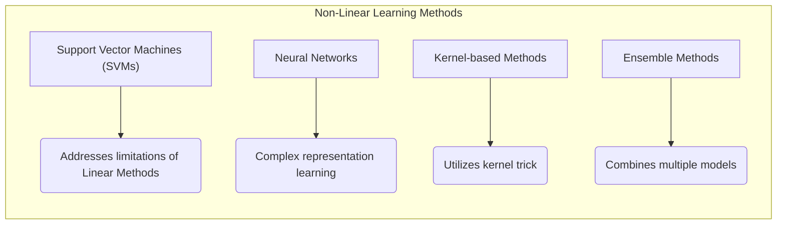
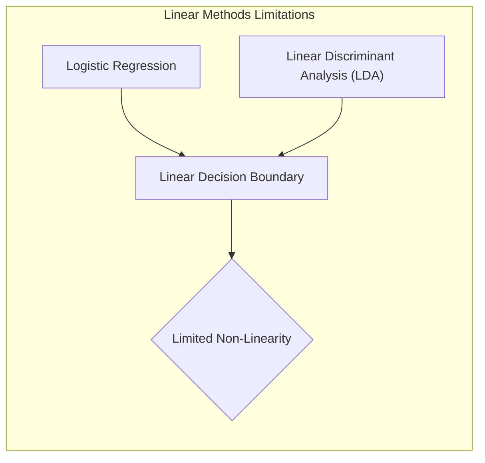
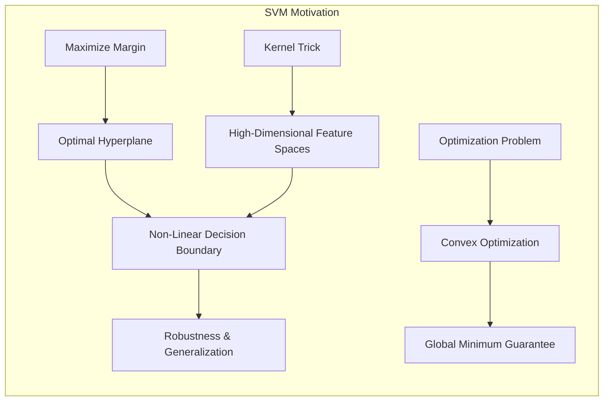
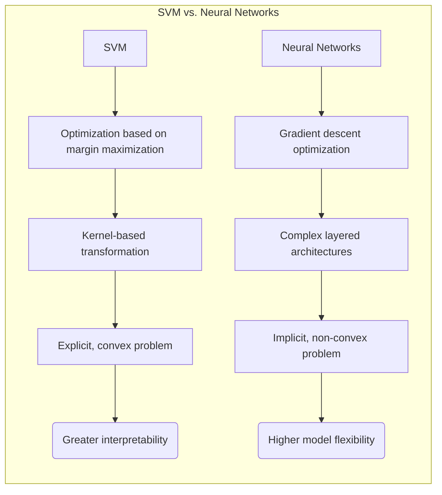
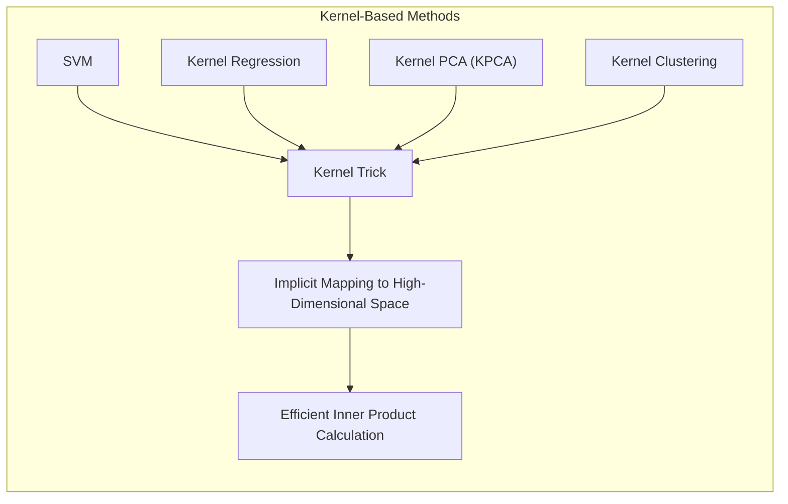
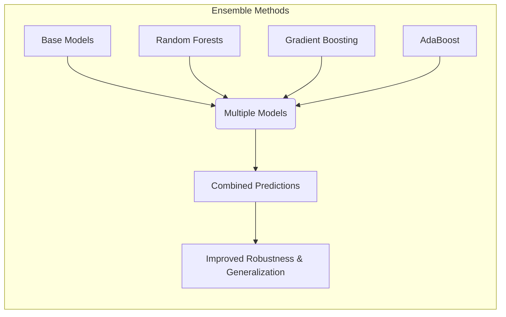
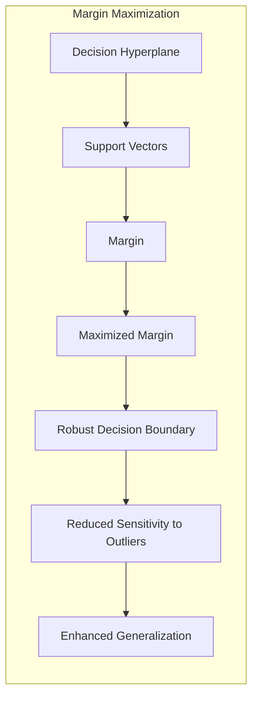

## Título: A Motivação por Trás das SVMs e sua Conexão com Outros Métodos Não Lineares



### Introdução

As **Support Vector Machines (SVMs)** surgiram como uma resposta à necessidade de modelos de classificação mais robustos e flexíveis, capazes de lidar com dados complexos e não linearmente separáveis. A motivação para o desenvolvimento das SVMs está enraizada nas limitações dos métodos lineares tradicionais, como a regressão logística e a Análise Discriminante Linear (LDA), que constroem fronteiras de decisão lineares no espaço original das *features* [^12.1].

A principal motivação para a utilização das SVMs é a capacidade de construir fronteiras de decisão não lineares através de um princípio de separação ótimo, maximizando a margem entre as classes. Além disso, as SVMs oferecem uma formulação matemática elegante baseada em um problema de otimização convexa, que garante a existência de um mínimo global, e a utilização de *kernels* permite trabalhar em espaços de *features* de alta dimensão sem explicitar a transformação, tornando-as uma ferramenta versátil e eficiente.

Neste capítulo, exploraremos em detalhes a motivação por trás das SVMs, revisitando as limitações dos métodos lineares e demonstrando como as SVMs endereçam essas limitações através de sua formulação única e da utilização de *kernels*. Além disso, discutiremos a conexão das SVMs com outros métodos não lineares, como redes neurais, métodos baseados em *kernel* e *ensemble methods*, comparando suas abordagens e destacando como as SVMs se encaixam no contexto geral do aprendizado não linear. Aprofundaremos na natureza de "maximizar a margem" e como a mesma fornece generalização e estabilidade aos modelos SVM.

### Motivação das SVMs e Limitações dos Métodos Lineares

**Conceito 1: As Limitações dos Métodos Lineares**

Os métodos lineares, como a **regressão logística** e a **LDA**, são caracterizados por construir fronteiras de decisão lineares no espaço original de *features*. Em outras palavras, a função de decisão desses métodos pode ser expressa como uma combinação linear das *features*, o que limita a capacidade de modelar relações não lineares entre as *features* e as classes.



A **regressão logística**, por exemplo, modela a probabilidade de um ponto pertencer a uma classe através de uma função sigmóide aplicada a uma combinação linear das *features*. A **LDA**, por sua vez, busca uma projeção linear que maximize a separação entre as médias das classes, também resultando em fronteiras de decisão lineares. Esses métodos, embora sejam eficientes computacionalmente e ofereçam boa interpretabilidade, podem apresentar performance insatisfatória em problemas onde as classes não são linearmente separáveis ou onde as relações entre as *features* e as classes são complexas.

> 💡 **Exemplo Numérico:**
>
> Considere um problema de classificação binária com duas *features* ($x_1$ e $x_2$) onde os dados são distribuídos em forma de círculos concêntricos. Os pontos da classe 0 estão dentro de um círculo de raio 1, e os pontos da classe 1 estão entre os círculos de raio 1 e 2. Um modelo de regressão logística tentaria separar esses dados com uma linha reta, o que resultaria em muitos erros de classificação.
>
> ```python
> import numpy as np
> import matplotlib.pyplot as plt
> from sklearn.linear_model import LogisticRegression
>
> # Gerando dados não linearmente separáveis
> np.random.seed(0)
> n_samples = 200
> radius_0 = np.random.uniform(0, 1, n_samples // 2)
> angle_0 = np.random.uniform(0, 2 * np.pi, n_samples // 2)
> x1_0 = radius_0 * np.cos(angle_0)
> x2_0 = radius_0 * np.sin(angle_0)
>
> radius_1 = np.random.uniform(1, 2, n_samples // 2)
> angle_1 = np.random.uniform(0, 2 * np.pi, n_samples // 2)
> x1_1 = radius_1 * np.cos(angle_1)
> x2_1 = radius_1 * np.sin(angle_1)
>
> X = np.concatenate([np.stack([x1_0, x2_0], axis=1), np.stack([x1_1, x2_1], axis=1)])
> y = np.concatenate([np.zeros(n_samples // 2), np.ones(n_samples // 2)])
>
> # Treinando um modelo de regressão logística
> model = LogisticRegression()
> model.fit(X, y)
>
> # Criando uma grade para plotar a fronteira de decisão
> x_min, x_max = X[:, 0].min() - 0.5, X[:, 0].max() + 0.5
> y_min, y_max = X[:, 1].min() - 0.5, X[:, 1].max() + 0.5
> xx, yy = np.meshgrid(np.linspace(x_min, x_max, 100),
>                      np.linspace(y_min, y_max, 100))
> Z = model.predict(np.c_[xx.ravel(), yy.ravel()])
> Z = Z.reshape(xx.shape)
>
> # Plotando os dados e a fronteira de decisão
> plt.figure(figsize=(8, 6))
> plt.contourf(xx, yy, Z, cmap=plt.cm.RdBu, alpha=0.8)
> plt.scatter(X[:, 0], X[:, 1], c=y, cmap=plt.cm.RdBu, edgecolors='k')
> plt.xlabel('$x_1$')
> plt.ylabel('$x_2$')
> plt.title('Fronteira de Decisão da Regressão Logística')
> plt.show()
> ```
>
> O gráfico mostra que a regressão logística, ao tentar encontrar uma linha reta para separar os círculos, não consegue classificar os pontos corretamente. Isso ilustra as limitações dos métodos lineares em dados não linearmente separáveis.

**Lemma 1:** As fronteiras de decisão lineares dos métodos lineares são inadequadas para problemas de classificação com classes não linearmente separáveis, resultando em modelos com alto viés.

A demonstração desse lemma se baseia na análise da forma da função de decisão linear, que não pode capturar relações não lineares entre as *features* e as classes. Em problemas onde as classes apresentam padrões complexos ou sobreposição, os modelos lineares tendem a apresentar baixo desempenho, pois não conseguem se ajustar adequadamente aos dados.

**Conceito 2: A Motivação para as SVMs**

As **SVMs** surgem como uma alternativa aos métodos lineares, motivadas pela necessidade de construir fronteiras de decisão não lineares e de lidar com problemas de classificação mais complexos. A principal motivação das SVMs é a busca por um **hiperplano ótimo** que maximize a margem de separação entre as classes [^12.2]. A margem é definida como a menor distância entre o hiperplano e os pontos mais próximos de cada classe. Ao maximizar a margem, as SVMs buscam construir modelos mais robustos e com melhor capacidade de generalização.



Além disso, as SVMs oferecem uma formulação matemática elegante baseada em um problema de otimização convexa, o que garante a existência de uma solução ótima global. A introdução de variáveis de folga permite lidar com *outliers* e dados sobrepostos, tornando as SVMs mais resilientes a dados ruidosos ou incompletos.

A utilização de *kernels* é outra inovação chave das SVMs, permitindo que elas trabalhem em espaços de *features* de alta dimensão, potencialmente infinitos, sem explicitar a transformação, o que possibilita a modelagem de relações não lineares entre as *features* e as classes.

> 💡 **Exemplo Numérico:**
>
> Usando os mesmos dados do exemplo anterior, uma SVM com um *kernel* RBF (Radial Basis Function) pode criar uma fronteira de decisão não linear que separa os círculos concêntricos de forma eficaz.
>
> ```python
> from sklearn.svm import SVC
>
> # Treinando uma SVM com kernel RBF
> svm_model = SVC(kernel='rbf', gamma='scale')
> svm_model.fit(X, y)
>
> # Criando uma grade para plotar a fronteira de decisão
> Z_svm = svm_model.predict(np.c_[xx.ravel(), yy.ravel()])
> Z_svm = Z_svm.reshape(xx.shape)
>
> # Plotando os dados e a fronteira de decisão da SVM
> plt.figure(figsize=(8, 6))
> plt.contourf(xx, yy, Z_svm, cmap=plt.cm.RdBu, alpha=0.8)
> plt.scatter(X[:, 0], X[:, 1], c=y, cmap=plt.cm.RdBu, edgecolors='k')
> plt.xlabel('$x_1$')
> plt.ylabel('$x_2$')
> plt.title('Fronteira de Decisão da SVM com Kernel RBF')
> plt.show()
> ```
>
> A SVM, com seu *kernel* RBF, consegue criar uma fronteira circular que separa as duas classes corretamente, mostrando sua capacidade de lidar com dados não linearmente separáveis.

**Corolário 1:** A formulação das SVMs, baseada na maximização da margem e na utilização de *kernels*, permite lidar com as limitações dos métodos lineares, construindo fronteiras de decisão não lineares e robustas.

A demonstração desse corolário se baseia na análise da formulação da SVM, que busca um hiperplano ótimo no espaço de *features* transformado, permitindo modelar relações não lineares no espaço original, além da própria maximização da margem que permite que a decisão não seja baseada em pontos mais perto da fronteira, ou em *outliers*, como os métodos lineares.

### SVMs e Outros Métodos Não Lineares



As **SVMs** se encaixam no contexto geral do aprendizado não linear, ao lado de outras abordagens, como **redes neurais**, **métodos baseados em *kernel*** e **métodos de *ensemble***. Cada um desses métodos oferece abordagens distintas para lidar com a não linearidade e a complexidade dos dados.

**Conceito 3: SVMs e Redes Neurais**

As **redes neurais**, particularmente as **redes neurais profundas**, são modelos não lineares poderosos, capazes de aprender representações complexas dos dados. As redes neurais são compostas por camadas de neurônios interconectados, e o aprendizado ocorre através da otimização dos pesos das conexões, comumente usando o método do gradiente descendente.

Embora as redes neurais sejam capazes de modelar relações não lineares complexas, elas podem ser mais difíceis de treinar e podem exigir uma quantidade maior de dados para obter um bom desempenho. Além disso, as redes neurais podem ser vistas como "caixas pretas", com menor interpretabilidade do que as SVMs.

As **SVMs**, por outro lado, oferecem uma formulação matemática mais elegante e um processo de treinamento mais simples, baseado na otimização convexa. As SVMs também são menos propensas ao *overfitting* e podem obter bons resultados com quantidades relativamente menores de dados, se comparadas com redes neurais. Embora não tão flexíveis em termos de modelagem quanto as redes neurais, as SVMs oferecem uma abordagem mais direta e com melhores garantias teóricas.

> 💡 **Exemplo Numérico:**
>
> Para ilustrar a diferença no treinamento, vamos comparar uma SVM e uma rede neural simples em um problema de classificação binária com dados não linearmente separáveis. Vamos usar os mesmos dados do exemplo anterior.
>
> ```python
> from sklearn.neural_network import MLPClassifier
> from sklearn.model_selection import train_test_split
> from sklearn.metrics import accuracy_score
>
> # Dividindo os dados em treino e teste
> X_train, X_test, y_train, y_test = train_test_split(X, y, test_size=0.3, random_state=42)
>
> # Treinando uma SVM com kernel RBF
> svm_model = SVC(kernel='rbf', gamma='scale')
> svm_model.fit(X_train, y_train)
> y_pred_svm = svm_model.predict(X_test)
> accuracy_svm = accuracy_score(y_test, y_pred_svm)
>
> # Treinando uma rede neural simples
> nn_model = MLPClassifier(hidden_layer_sizes=(10,), max_iter=1000, random_state=42)
> nn_model.fit(X_train, y_train)
> y_pred_nn = nn_model.predict(X_test)
> accuracy_nn = accuracy_score(y_test, y_pred_nn)
>
> print(f"Acurácia da SVM: {accuracy_svm:.4f}")
> print(f"Acurácia da Rede Neural: {accuracy_nn:.4f}")
> ```
>
> Este exemplo mostra que, com parâmetros padrão, tanto a SVM quanto a rede neural podem obter alta acurácia, mas o treinamento da SVM é mais direto e menos suscetível a problemas de convergência ou escolha de hiperparâmetros complexos, como o número de camadas e neurônios na rede neural.

**Lemma 2:** As SVMs e as redes neurais representam abordagens distintas para o aprendizado não linear, com as SVMs oferecendo uma formulação matemática elegante e maior interpretabilidade, e as redes neurais oferecendo maior flexibilidade e capacidade de modelar relações complexas.

A demonstração desse lemma se baseia na análise das arquiteturas e processos de treinamento de cada método. As SVMs são baseadas na maximização da margem e no uso de *kernels*, enquanto as redes neurais são baseadas em camadas de neurônios interconectados e otimização por gradiente descendente. Cada abordagem tem vantagens e desvantagens, e a escolha entre elas depende do problema em questão e dos requisitos de interpretabilidade e complexidade.

**Conceito 4: Métodos Baseados em Kernel**

As SVMs são um exemplo de **métodos baseados em *kernel***, uma classe de algoritmos de aprendizado de máquina que utilizam funções *kernel* para calcular produtos internos em espaços de alta dimensão. Outros métodos baseados em *kernel* incluem a **regressão de *kernel***, **análise de componentes principais com *kernel* (KPCA)** e **clustering com *kernel***.



Esses métodos utilizam a mesma ideia do *kernel trick*, que permite trabalhar em espaços de alta dimensão sem explicitar a transformação dos dados. A escolha do *kernel* apropriado é um passo crucial em métodos baseados em *kernel*, e a escolha dependerá das características do problema.

> 💡 **Exemplo Numérico:**
>
> Para ilustrar o *kernel trick*, vamos usar um *kernel* polinomial de grau 2. Considere dois pontos $x = [x_1, x_2]$ e $y = [y_1, y_2]$. O *kernel* polinomial de grau 2 é definido como $K(x, y) = (x^T y + c)^2$, onde $c$ é uma constante (geralmente 1).
>
> A transformação de *features* correspondente seria $\phi(x) = [x_1^2, x_2^2, \sqrt{2}x_1x_2, \sqrt{2}cx_1, \sqrt{2}cx_2, c^2]$. Em vez de calcular explicitamente $\phi(x)$ e $\phi(y)$ e depois seu produto interno, o *kernel* calcula diretamente $(x_1y_1 + x_2y_2 + c)^2$.
>
> Por exemplo, se $x = [1, 2]$, $y = [2, 1]$ e $c = 1$, então:
>
> $K(x, y) = (1*2 + 2*1 + 1)^2 = (2 + 2 + 1)^2 = 5^2 = 25$.
>
> Sem o *kernel trick*, teríamos que calcular:
>
> $\phi(x) = [1, 4, \sqrt{2}*2, \sqrt{2}*1, \sqrt{2}*2, 1] = [1, 4, 2\sqrt{2}, \sqrt{2}, 2\sqrt{2}, 1]$
>
> $\phi(y) = [4, 1, \sqrt{2}*2, \sqrt{2}*2, \sqrt{2}*1, 1] = [4, 1, 2\sqrt{2}, 2\sqrt{2}, \sqrt{2}, 1]$
>
> $\phi(x)^T \phi(y) = 1*4 + 4*1 + 2\sqrt{2}*2\sqrt{2} + \sqrt{2}*2\sqrt{2} + 2\sqrt{2}*\sqrt{2} + 1*1 = 4 + 4 + 8 + 4 + 4 + 1 = 25$
>
> O *kernel trick* calcula o produto interno no espaço de *features* de alta dimensão sem explicitamente transformar os dados, economizando tempo de computação.

Os métodos baseados em *kernel* oferecem uma abordagem flexível para lidar com a não linearidade e a complexidade dos dados, com uma base matemática sólida e com uma variedade de *kernels* para modelar diferentes tipos de relações.

**Corolário 2:** As SVMs fazem parte de uma família mais ampla de métodos baseados em *kernel*, que compartilham a capacidade de trabalhar em espaços de alta dimensão através do *kernel trick*.

A demonstração desse corolário se baseia na análise das formulações matemáticas desses métodos, que compartilham a propriedade de utilizar funções *kernel* para calcular produtos internos em um espaço de *features* transformado, o que permite que todos esses métodos trabalhem de maneira eficiente em problemas não lineares.

**Conceito 5: Métodos de *Ensemble***

Os **métodos de *ensemble*** combinam as predições de múltiplos modelos para obter um modelo final mais robusto e com melhor capacidade de generalização. Técnicas comuns de *ensemble* incluem **Random Forests**, **Gradient Boosting** e **AdaBoost**.



Os métodos de *ensemble* podem ser aplicados em combinação com SVMs para obter resultados ainda melhores, por exemplo, utilizando uma SVM como *base learner* dentro de um framework de *ensemble*. A combinação de SVMs com métodos de *ensemble* pode resultar em modelos mais robustos e com melhor desempenho em dados complexos.

> 💡 **Exemplo Numérico:**
>
> Vamos comparar uma SVM com um Random Forest em um problema de classificação.
>
> ```python
> from sklearn.ensemble import RandomForestClassifier
>
> # Treinando um Random Forest
> rf_model = RandomForestClassifier(n_estimators=100, random_state=42)
> rf_model.fit(X_train, y_train)
> y_pred_rf = rf_model.predict(X_test)
> accuracy_rf = accuracy_score(y_test, y_pred_rf)
>
> print(f"Acurácia da SVM: {accuracy_svm:.4f}")
> print(f"Acurácia do Random Forest: {accuracy_rf:.4f}")
> ```
>
> Este exemplo mostra que ambos os métodos podem obter alta acurácia. Em alguns casos, o Random Forest pode ser mais fácil de usar e ajustar, enquanto a SVM pode ser mais robusta em outras situações. A escolha entre eles depende do problema específico e dos resultados desejados.

> ⚠️ **Nota Importante**: As SVMs oferecem maior interpretabilidade e robustez em comparação com redes neurais, embora estas sejam mais flexíveis. **Baseado em [^12.3]**.

> ❗ **Ponto de Atenção**: Os métodos baseados em *kernel* compartilham a capacidade de lidar com a não linearidade por meio do *kernel trick*, e a SVM é um membro desta família. **Conforme indicado em [^12.3]**.

> ✔️ **Destaque**: Métodos de *ensemble* podem ser utilizados em combinação com SVMs para melhorar o desempenho em problemas complexos. **Baseado em [^12.3]**.

### Maximizando a Margem: Estabilidade e Generalização



O princípio fundamental por trás das **Support Vector Machines (SVMs)** é a busca pela **maximização da margem** entre as classes. A margem é definida como a distância mínima entre o hiperplano de decisão e os pontos mais próximos de cada classe, também conhecidos como **vetores de suporte** [^12.2]. Ao buscar o hiperplano que maximiza essa margem, as SVMs objetivam construir modelos mais robustos, com melhor capacidade de generalização e menor sensibilidade a *outliers*.

A intuição por trás da maximização da margem é que, ao aumentar a distância entre as classes, o modelo se torna menos propenso a erros de classificação em dados não vistos. Modelos com margens pequenas são mais suscetíveis a alterações nos dados de treinamento, resultando em fronteiras de decisão instáveis e com maior risco de *overfitting*. Em contrapartida, a maximização da margem proporciona uma maior estabilidade da fronteira de decisão, reduzindo a influência de *outliers* ou dados ruidosos nos parâmetros do modelo, o que também implica maior generalização.

A margem pode ser expressa matematicamente como o inverso da norma do vetor normal ao hiperplano ($\frac{1}{||\beta||}$), e a busca pelo hiperplano que maximiza a margem é o objetivo central do problema de otimização das SVMs. A introdução de **variáveis de folga** permite relaxar a restrição da separabilidade linear, permitindo erros de classificação nas amostras mais próximas da fronteira, sem comprometer a robustez do modelo. O parâmetro $C$ na função de custo controla a penalidade por essas violações da margem, permitindo ajustar o equilíbrio entre a maximização da margem e a capacidade do modelo se adaptar aos dados de treinamento [^12.2].

> 💡 **Exemplo Numérico:**
>
> Considere um problema de classificação binária com dois grupos de pontos. Vamos criar dados de exemplo e mostrar como a margem é calculada.
>
> ```python
> import numpy as np
> import matplotlib.pyplot as plt
> from sklearn.svm import SVC
>
> # Gerando dados linearmente separáveis
> np.random.seed(0)
> X = np.concatenate([np.random.randn(20, 2) + [2, 2], np.random.randn(20, 2) + [-2, -2]])
> y = np.concatenate([np.zeros(20), np.ones(20)])
>
> # Treinando uma SVM com kernel linear
> svm_model = SVC(kernel='linear', C=1)
> svm_model.fit(X, y)
>
> # Obtendo o vetor normal ao hiperplano e o intercepto
> w = svm_model.coef_[0]
> b = svm_model.intercept_[0]
>
> # Calculando a margem
> margin = 1 / np.linalg.norm(w)
> print(f"Margem: {margin:.4f}")
>
> # Plotando os dados, o hiperplano e as margens
> plt.figure(figsize=(8, 6))
> plt.scatter(X[:, 0], X[:, 1], c=y, cmap=plt.cm.RdBu, edgecolors='k')
>
> ax = plt.gca()
> xlim = ax.get_xlim()
> ylim = ax.get_ylim()
>
> xx = np.linspace(xlim[0], xlim[1], 30)
> yy = np.linspace(ylim[0], ylim[1], 30)
> YY, XX = np.meshgrid(yy, xx)
> xy = np.vstack([XX.ravel(), YY.ravel()]).T
> Z = svm_model.decision_function(xy).reshape(XX.shape)
>
> ax.contour(XX, YY, Z, colors='k', levels=[-1, 0, 1], alpha=0.5, linestyles=['--', '-', '--'])
>
> plt.xlabel('$x_1$')
> plt.ylabel('$x_2$')
> plt.title('Maximização da Margem')
> plt.show()
> ```
>
> Este exemplo mostra o hiperplano de decisão (linha sólida) e as margens (linhas tracejadas). A margem é a distância entre a linha sólida e as linhas tracejadas. O código também calcula o valor da margem usando a fórmula $\frac{1}{||\beta||}$.

**Teorema 1:** A maximização da margem nas SVMs leva a modelos com melhor capacidade de generalização e menor sensibilidade a ruídos e *outliers*.

A prova desse teorema envolve analisar a relação entre a margem e a complexidade do modelo. A maximização da margem busca um hiperplano que, além de separar as classes, tenha a maior distância possível aos pontos de treinamento. Esse processo força o modelo a capturar as principais características dos dados, em vez de se ajustar a detalhes específicos, o que leva a modelos mais robustos e com maior capacidade de generalização.

A robustez a ruídos e *outliers* advém do fato de que a decisão é baseada nos vetores de suporte, que são os pontos mais próximos da fronteira. Ao maximizar a margem, esses pontos são, por definição, aqueles que melhor representam a distribuição das classes, em oposição a *outliers* ou ruídos que estão longe da fronteira.

O princípio da maximização da margem é uma característica única das SVMs, e as distingue de outros métodos lineares de classificação, que não levam em conta a margem de separação. A formulação matemática da SVM, baseada na maximização da margem e na utilização de *kernels*, garante que os modelos construídos sejam robustos, flexíveis e com alta capacidade de generalização, o que justifica o sucesso das SVMs em uma ampla variedade de problemas de classificação e regressão.

### Conclusão

Neste capítulo, aprofundamos nossa compreensão da motivação por trás das **Support Vector Machines (SVMs)** e suas conexões com outros métodos não lineares. Vimos como as limitações dos modelos lineares, como a regressão logística e a LDA, impulsionaram o desenvolvimento de abordagens mais flexíveis e robustas, e como as SVMs se destacam ao construir fronteiras de decisão não lineares através da maximização da margem e da utilização do *kernel trick*.

Exploramos a relação das SVMs com outros métodos não lineares, como redes neurais, métodos baseados em *kernel* e métodos de *ensemble*, destacando as abordagens distintas e complementares que cada método oferece. Vimos como as SVMs se destacam por sua formulação matemática elegante, sua capacidade de trabalhar em espaços de *features* de alta dimensão, e o princípio da maximização da margem, que leva a modelos mais robustos e com melhor capacidade de generalização.

O princípio da maximização da margem, com sua busca por um hiperplano que separa as classes com a maior margem possível, é o coração da formulação da SVM. Ao buscar a maximização da margem, a SVM se torna menos suscetível a ruídos e *outliers*, o que resulta em modelos mais estáveis e com maior capacidade de generalizar para dados não vistos.

A capacidade de trabalhar em espaços de alta dimensão através da utilização de *kernels* e a formulação matemática elegante baseada em otimização convexa tornam as SVMs uma ferramenta fundamental para qualquer profissional da área de aprendizado de máquina. A compreensão das motivações e das conexões das SVMs com outros métodos não lineares é crucial para a escolha apropriada das técnicas de modelagem para problemas complexos de classificação e regressão.

### Footnotes

[^12.1]: "In this chapter we describe generalizations of linear decision boundaries for classification. Optimal separating hyperplanes are introduced in Chapter 4 for the case when two classes are linearly separable. Here we cover extensions to the nonseparable case, where the classes overlap. These techniques are then generalized to what is known as the support vector machine, which produces nonlinear boundaries by constructing a linear boundary in a large, transformed version of the feature space." *(Trecho de  "Support Vector Machines and Flexible Discriminants")*

[^12.2]: "In Chapter 4 we discussed a technique for constructing an optimal separating hyperplane between two perfectly separated classes. We review this and generalize to the nonseparable case, where the classes may not be separable by a linear boundary." *(Trecho de  "Support Vector Machines and Flexible Discriminants")*

[^12.3]: "The support vector machine classifier is an extension of this idea, where the dimension of the enlarged space is allowed to get very large, infinite in some cases. It might seem that the computations would become prohibitive. It would also seem that with sufficient basis functions, the data would be separable, and overfitting would occur. We first show how the SVM technology deals with these issues. We then see that in fact the SVM classifier is solving a function-fitting problem using a particular criterion and form of regularization, and is part of a much bigger class of problems that includes the smoothing splines of Chapter 5." *(Trecho de  "Support Vector Machines and Flexible Discriminants")*
