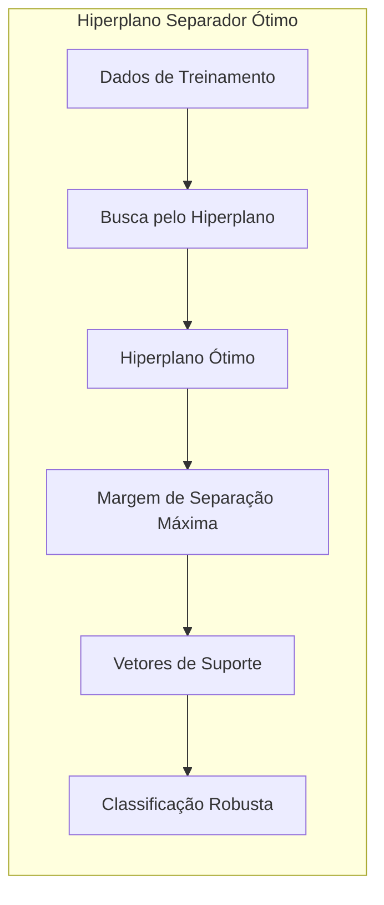
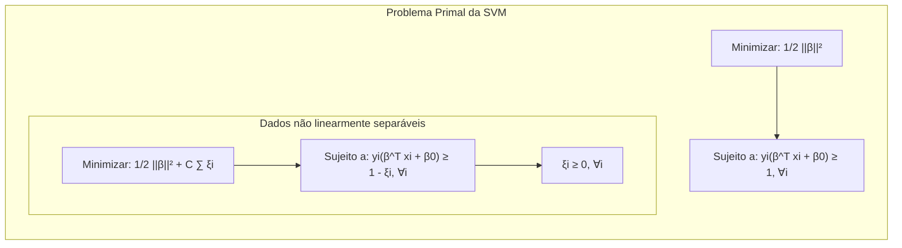
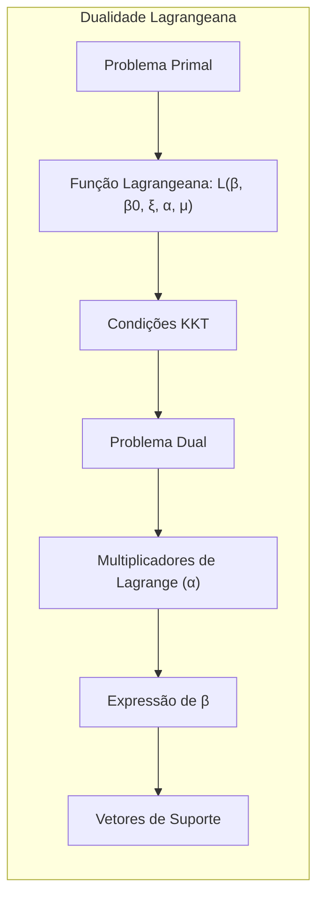
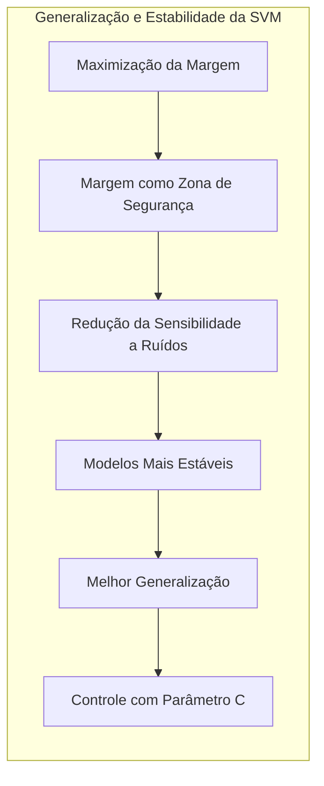

## Título: Revisão do Hiperplano Separador Ótimo: Fundamentos e Generalizações



### Introdução

No contexto do aprendizado de máquina e classificação, o conceito de **hiperplano separador ótimo** é central para o entendimento de algoritmos como as **Support Vector Machines (SVMs)**. Este capítulo revisa os fundamentos teóricos do hiperplano separador ótimo, com foco em sua formulação matemática, propriedades e como essa busca motiva o desenvolvimento de modelos de classificação robustos e com boa capacidade de generalização. A discussão abrange tanto o caso de dados linearmente separáveis quanto o caso mais realista de dados não linearmente separáveis, destacando as modificações necessárias na formulação do problema de otimização.

A motivação principal por trás da busca pelo hiperplano separador ótimo é a necessidade de construir modelos de classificação que não apenas separem as classes de maneira precisa, mas que também o façam com uma certa margem de segurança, evitando a sobreposição e reduzindo a sensibilidade a ruídos e *outliers*. A maximização da margem, uma característica fundamental dos SVMs, proporciona modelos mais estáveis e com melhor capacidade de generalização, o que é crucial para o sucesso em problemas de classificação do mundo real [^12.2].

Este capítulo se propõe a revisitar os conceitos chave, com foco em suas implicações teóricas e práticas. Exploraremos as formulações matemáticas, as condições de otimalidade, a importância dos **vetores de suporte** e o papel do parâmetro de regularização, estabelecendo uma base sólida para a compreensão dos algoritmos de classificação baseados em hiperplanos separadores ótimos. Além disso, vamos revisitar a conexão entre a maximização da margem e a estabilidade e generalização dos modelos.

### Fundamentos Teóricos: Hiperplanos e Margens

**Conceito 1: Definição de um Hiperplano**

Em um espaço de *features* de $p$ dimensões, um **hiperplano** é definido como um subespaço de dimensão $p-1$, que divide o espaço em duas regiões. Um hiperplano pode ser descrito pela seguinte equação:

$$ \beta^T x + \beta_0 = 0 $$

onde $x$ é um vetor de *features*, $\beta$ é um vetor normal ao hiperplano, e $\beta_0$ é um *bias* que define a posição do hiperplano no espaço.

Em problemas de classificação binária, onde temos duas classes, o objetivo é encontrar um hiperplano que separe os pontos de cada classe. Os pontos de uma classe estarão em um lado do hiperplano, enquanto os pontos da outra classe estarão no lado oposto. Para que o hiperplano seja um separador, a equação do hiperplano deve ser maior que zero para os pontos de uma classe, e menor que zero para os pontos da outra. O sinal da expressão $\beta^T x + \beta_0$ determina em qual lado do hiperplano um ponto está localizado, e com isso define a classificação.

> 💡 **Exemplo Numérico:**
> Suponha que temos um espaço de *features* bidimensional ($p=2$) e um hiperplano definido por $\beta = [2, 1]^T$ e $\beta_0 = -3$. A equação do hiperplano é $2x_1 + 1x_2 - 3 = 0$. Considere dois pontos: $x_1 = [1, 1]^T$ e $x_2 = [2, 2]^T$.
>
> Para $x_1$: $\beta^T x_1 + \beta_0 = 2*1 + 1*1 - 3 = 0$. Este ponto está exatamente sobre o hiperplano.
>
> Para $x_2$: $\beta^T x_2 + \beta_0 = 2*2 + 1*2 - 3 = 3$. Como o resultado é maior que zero, este ponto está de um lado do hiperplano. Se tivéssemos outro ponto $x_3 = [0,0]^T$ , $\beta^T x_3 + \beta_0 = 2*0 + 1*0 - 3 = -3$. Este ponto estaria do outro lado do hiperplano, pois o resultado é menor que zero.
>
> ```mermaid
>  graph LR
>      A["x1(1,1)"] -- "2x + y - 3 = 0" --> B("Hiperplano")
>      C["x2(2,2)"] -- "2x + y - 3 > 0" --> B
>      D["x3(0,0)"] -- "2x + y - 3 < 0" --> B
> ```
>
> Este exemplo ilustra como o sinal da expressão $\beta^T x + \beta_0$ determina em qual lado do hiperplano um ponto está localizado.

**Lemma 1:** Um hiperplano separa o espaço de *features* em duas regiões, e a posição de um ponto em relação ao hiperplano é determinada pelo sinal da expressão $\beta^T x + \beta_0$.

A demonstração desse lemma é baseada na definição da equação do hiperplano, onde os pontos com $\beta^T x + \beta_0 > 0$ estão em um lado, e os pontos com $\beta^T x + \beta_0 < 0$ estão do lado oposto do hiperplano.

**Conceito 2: A Margem de Separação**

A **margem de separação** é definida como a distância mínima entre o hiperplano de decisão e os pontos de treinamento mais próximos a ele. A margem quantifica a "segurança" da separação entre as classes. Uma margem grande indica que o hiperplano está bem distante dos pontos de ambas as classes, o que resulta em um modelo mais robusto e menos suscetível a *outliers*.

Formalmente, a margem $M$ entre um hiperplano dado por $\beta^T x + \beta_0 = 0$ e um ponto $x_i$ é definida como:

$$ M(x_i, \beta, \beta_0) = \frac{| \beta^T x_i + \beta_0 |}{||\beta||} $$

A margem de separação $M$ para o problema de classificação é definida como a menor distância entre o hiperplano e os pontos mais próximos dele:

$$ M = \min_i \frac{| \beta^T x_i + \beta_0 |}{||\beta||} $$

A busca pelo hiperplano separador ótimo consiste em encontrar o hiperplano que maximize a margem de separação.

> 💡 **Exemplo Numérico:**
> Usando o hiperplano do exemplo anterior ($\beta = [2, 1]^T$, $\beta_0 = -3$), e dois pontos $x_1 = [1, 2]^T$ (classe +1) e $x_2 = [2, 1]^T$ (classe -1), vamos calcular a margem para cada ponto.
>
> Primeiro, calculemos a norma de $\beta$: $||\beta|| = \sqrt{2^2 + 1^2} = \sqrt{5}$.
>
> Para $x_1$: $M(x_1, \beta, \beta_0) = \frac{|2*1 + 1*2 - 3|}{\sqrt{5}} = \frac{1}{\sqrt{5}} \approx 0.447$.
>
> Para $x_2$: $M(x_2, \beta, \beta_0) = \frac{|2*2 + 1*1 - 3|}{\sqrt{5}} = \frac{2}{\sqrt{5}} \approx 0.894$.
>
> A margem de separação $M$ seria o mínimo entre as margens dos pontos mais próximos, que neste caso é  $M = \frac{1}{\sqrt{5}}$. Este é um exemplo simplificado. Em um cenário real, a margem seria definida pelos vetores de suporte.
>
> ```mermaid
>  graph LR
>      A["x1(1,2)"] -- "Margem = 0.447" --> B("Hiperplano")
>      C["x2(2,1)"] -- "Margem = 0.894" --> B
> ```
>
> Observe que a margem para o ponto $x_1$ é menor, o que significa que ele está mais próximo do hiperplano do que o ponto $x_2$. O objetivo da SVM é maximizar a menor dessas distâncias.

**Corolário 1:** A maximização da margem de separação leva a modelos mais robustos e com maior capacidade de generalização, uma vez que a margem serve como uma "zona de segurança" entre as classes, conforme mencionado em [^12.2].

A demonstração desse corolário se baseia na análise da formulação da SVM, onde a maximização da margem é um dos objetivos centrais. Ao aumentar a margem, o modelo se torna menos suscetível a ruído nos dados de treinamento e mais robusto a pequenas variações nas *features*, o que leva a um melhor desempenho em dados não vistos.

**Conceito 3: Vetores de Suporte**

Os **vetores de suporte** são os pontos de treinamento que estão localizados na margem ou mais próximos do hiperplano de decisão. São esses pontos que definem a posição e orientação do hiperplano ótimo e são os únicos pontos que afetam a solução do problema de otimização das SVMs. Os vetores de suporte podem ser pontos corretamente classificados que ficam sobre a margem, ou pontos mal classificados que violam a margem. Os vetores de suporte são os pontos mais difíceis de classificar e, por isso, têm um papel fundamental na definição da fronteira de decisão.

### Formulação Matemática: Otimização e o Problema Primal



Para formalizar a busca pelo hiperplano separador ótimo, precisamos formular o problema como um problema de otimização matemática. No caso de dados linearmente separáveis, o problema primal pode ser expresso como:

$$ \min_{\beta, \beta_0} \frac{1}{2} ||\beta||^2 $$
$$ \text{sujeito a } y_i(\beta^T x_i + \beta_0) \geq 1, \quad \forall i $$

onde $y_i \in \{-1, 1\}$ são os rótulos das classes e a restrição garante que todos os pontos estejam corretamente classificados e a uma distância de pelo menos 1 do hiperplano. O objetivo é minimizar a norma do vetor $\beta$, que é equivalente a maximizar a margem de separação.

> 💡 **Exemplo Numérico:**
> Suponha que temos um conjunto de dados linearmente separável com dois pontos da classe +1: $x_1 = [2, 2]^T$ e $x_2 = [3, 3]^T$, e dois pontos da classe -1: $x_3 = [1, 0]^T$ e $x_4 = [0, 1]^T$. O objetivo é encontrar $\beta$ e $\beta_0$ que minimizem $\frac{1}{2} ||\beta||^2$ e satisfaçam as restrições.
>
> Para simplificar, vamos supor que após otimização, encontramos $\beta = [1, -1]^T$ e $\beta_0 = -0.5$. Vamos verificar as restrições:
>
> Para $x_1$ (classe +1): $1*(1*2 + (-1)*2 -0.5) = -0.5 $. Esta restrição não é satisfeita, pois deve ser maior ou igual a 1.
> Para $x_2$ (classe +1): $1*(1*3 + (-1)*3 - 0.5) = -0.5$. Esta restrição também não é satisfeita.
> Para $x_3$ (classe -1): $-1*(1*1 + (-1)*0 - 0.5) = -0.5$. Esta restrição também não é satisfeita.
> Para $x_4$ (classe -1): $-1*(1*0 + (-1)*1 - 0.5) = 1.5$. Esta restrição é satisfeita.
>
> Claramente, os valores de $\beta$ e $\beta_0$ escolhidos não são ideais, pois não satisfazem todas as restrições. O otimizador da SVM é que encontra os valores corretos para $\beta$ e $\beta_0$ de forma que todas as restrições sejam satisfeitas, maximizando a margem.

No caso de dados não linearmente separáveis ou com *outliers*, relaxamos a restrição e permitimos que alguns pontos não sejam classificados corretamente ou que violem a margem, introduzindo as **variáveis de folga** $\xi_i$:

$$ \min_{\beta, \beta_0, \xi} \frac{1}{2} ||\beta||^2 + C \sum_{i=1}^{N} \xi_i $$
$$ \text{sujeito a } y_i(\beta^T x_i + \beta_0) \geq 1 - \xi_i, \quad \forall i $$
$$ \xi_i \geq 0, \quad \forall i $$

O termo $\frac{1}{2} ||\beta||^2$ representa a minimização da norma do vetor $\beta$, e o termo $C \sum_{i=1}^{N} \xi_i$ é a penalidade por violações da margem. O parâmetro $C$ controla o compromisso entre a maximização da margem e a tolerância a erros de classificação [^12.2]. Um valor alto de $C$ penaliza fortemente classificações erradas, enquanto um valor baixo permite um maior número de erros para maximizar a margem.

> 💡 **Exemplo Numérico:**
> Vamos considerar um exemplo com *outliers*. Suponha que temos os mesmos pontos do exemplo anterior, mas agora com um *outlier* da classe +1: $x_5 = [0.5, 0.5]^T$. Se usarmos uma SVM sem variáveis de folga, o problema pode se tornar inviável. Com as variáveis de folga, podemos permitir que $x_5$ viole a margem, introduzindo $\xi_5$.
>
> Digamos que após o treinamento, encontramos $\beta = [0.8, -0.8]^T$, $\beta_0 = -0.4$ e $\xi_5 = 0.7$. Vamos verificar a restrição para $x_5$:
>
> Para $x_5$: $1*(0.8*0.5 + (-0.8)*0.5 - 0.4) = -0.4$. Como $1 - \xi_5 = 1-0.7 = 0.3$, temos $-0.4 < 0.3$, portanto, a restrição é satisfeita. O ponto $x_5$ viola a margem, mas isso foi penalizado pelo termo $C \sum \xi_i$ na função objetivo. O valor de C controla o quão severamente essas violações são penalizadas.
>
> Se $C$ for muito alto, o modelo tentará classificar todos os pontos corretamente, levando a uma margem menor e possivelmente *overfitting*. Se $C$ for baixo, o modelo permitirá mais violações, resultando em uma margem maior e maior generalização.
>
> ```python
> import numpy as np
> import matplotlib.pyplot as plt
>
> # Pontos de dados
> X = np.array([[2, 2], [3, 3], [1, 0], [0, 1], [0.5, 0.5]])
> y = np.array([1, 1, -1, -1, 1])
>
> # Hiperplano (após treinamento)
> beta = np.array([0.8, -0.8])
> beta0 = -0.4
>
> # Plotando os pontos
> plt.scatter(X[:2, 0], X[:2, 1], color='blue', label='Classe +1')
> plt.scatter(X[2:4, 0], X[2:4, 1], color='red', label='Classe -1')
> plt.scatter(X[4, 0], X[4, 1], color='green', marker='x', label='Outlier')
>
> # Criando pontos para plotar o hiperplano
> x_plot = np.linspace(0, 3.5, 400)
> y_plot = (-beta[0]*x_plot - beta0) / beta[1]
>
> # Plotando o hiperplano
> plt.plot(x_plot, y_plot, color='black', label='Hiperplano')
>
> plt.xlabel('Feature 1')
> plt.ylabel('Feature 2')
> plt.title('Hiperplano com Outlier e Variáveis de Folga')
> plt.legend()
> plt.grid(True)
> plt.show()
> ```

O problema de otimização das SVMs é um problema convexo, o que garante a existência de um mínimo global único, o que facilita a busca pela solução ótima.

**Lemma 2:** O problema de otimização primal da SVM, tanto no caso linearmente separável quanto no caso não linearmente separável, é um problema convexo, garantindo a existência de um mínimo global.

A demonstração desse lemma se baseia na análise da forma da função objetivo, que é quadrática e convexa, e da natureza das restrições, que são lineares, o que garante a convexidade do problema de otimização. Problemas convexos têm a propriedade de que qualquer mínimo local é também um mínimo global, o que torna a busca pela solução ótima mais eficiente e robusta.

### Dualidade Lagrangeana: Transformação para um Problema Mais Tratável



Para resolver o problema de otimização primal das SVMs, é comum utilizar a **dualidade Lagrangeana**, que transforma o problema primal em um problema dual, que geralmente é mais fácil de resolver. A transformação para o problema dual é feita através da utilização dos **multiplicadores de Lagrange**, que são associados às restrições do problema primal.

A função Lagrangeana para o problema primal com variáveis de folga é:

$$ L(\beta, \beta_0, \xi, \alpha, \mu) = \frac{1}{2} ||\beta||^2 + C \sum_{i=1}^{N} \xi_i - \sum_{i=1}^{N} \alpha_i [y_i(\beta^T x_i + \beta_0) - 1 + \xi_i] - \sum_{i=1}^{N} \mu_i \xi_i $$

onde $\alpha_i \geq 0$ e $\mu_i \geq 0$ são os multiplicadores de Lagrange.

O problema dual é obtido minimizando a função Lagrangeana em relação a $\beta$, $\beta_0$ e $\xi$, e aplicando as condições de Karush-Kuhn-Tucker (KKT). As condições de KKT são:

1.  $\alpha_i [y_i(\beta^T x_i + \beta_0) - 1 + \xi_i] = 0, \quad \forall i$
2.  $\mu_i \xi_i = 0, \quad \forall i$
3.  $\alpha_i \geq 0, \quad \mu_i \geq 0, \quad \xi_i \geq 0, \quad \forall i$
4.  $y_i(\beta^T x_i + \beta_0) - 1 + \xi_i \geq 0, \quad \forall i$

Com base nas condições de KKT, podemos expressar $\beta$ em termos dos multiplicadores de Lagrange:

$$ \beta = \sum_{i=1}^N \alpha_i y_i x_i $$

Substituindo essa expressão na função Lagrangeana e utilizando a condição $\sum_{i=1}^N \alpha_i y_i = 0$, obtemos o problema dual:

$$ \max_{\alpha} \sum_{i=1}^{N} \alpha_i - \frac{1}{2} \sum_{i=1}^{N} \sum_{j=1}^{N} \alpha_i \alpha_j y_i y_j x_i^T x_j $$
$$ \text{sujeito a } 0 \leq \alpha_i \leq C, \quad \forall i $$
$$ \sum_{i=1}^{N} \alpha_i y_i = 0 $$

> 💡 **Exemplo Numérico:**
> Suponha que temos três pontos de dados: $x_1 = [1, 1]^T$, $x_2 = [2, 0]^T$ e $x_3 = [0, 2]^T$, com rótulos $y_1 = 1$, $y_2 = -1$ e $y_3 = 1$, respectivamente. Após resolver o problema dual, encontramos os seguintes multiplicadores de Lagrange: $\alpha_1 = 0.5$, $\alpha_2 = 1$, $\alpha_3 = 0.5$, e $C=1$.
>
> Primeiro, verificamos se a restrição $\sum_{i=1}^{N} \alpha_i y_i = 0$ é satisfeita:
> $0.5 * 1 + 1 * (-1) + 0.5 * 1 = 0.5 - 1 + 0.5 = 0$. A restrição é satisfeita.
>
> Agora, podemos calcular $\beta$ usando a fórmula:
> $\beta = \sum_{i=1}^N \alpha_i y_i x_i = 0.5 * 1 * [1, 1]^T + 1 * (-1) * [2, 0]^T + 0.5 * 1 * [0, 2]^T = [0.5, 0.5]^T + [-2, 0]^T + [0, 1]^T = [-1.5, 1.5]^T$.
>
> Os vetores de suporte são os pontos onde $\alpha_i > 0$, que neste caso são todos os pontos: $x_1$, $x_2$ e $x_3$.
>
> Este exemplo ilustra como os multiplicadores de Lagrange obtidos do problema dual podem ser usados para encontrar $\beta$ e identificar os vetores de suporte.
>
> ```python
> import numpy as np
>
> # Dados de exemplo
> X = np.array([[1, 1], [2, 0], [0, 2]])
> y = np.array([1, -1, 1])
> alphas = np.array([0.5, 1, 0.5])
> C = 1
>
> # Calculando beta
> beta = np.sum(alphas[:, np.newaxis] * y[:, np.newaxis] * X, axis=0)
> print(f"Vetor beta: {beta}")
>
> # Verificando a restrição
> constraint_check = np.sum(alphas * y)
> print(f"Verificação da restrição: {constraint_check}")
> ```

O problema dual é mais tratável, pois a função objetivo depende apenas dos multiplicadores de Lagrange $\alpha_i$ e dos produtos internos entre os dados $x_i^T x_j$. A solução do problema dual nos fornece os valores dos multiplicadores de Lagrange, que nos permitem calcular o hiperplano ótimo e os vetores de suporte.

**Lemma 3:** A transformação do problema primal para o problema dual através da dualidade Lagrangeana leva a uma formulação que depende apenas dos produtos internos entre os dados, o que possibilita a utilização do *kernel trick*.

A demonstração desse lemma se baseia na análise da função dual, onde os dados $x_i$ aparecem apenas como produtos internos $x_i^Tx_j$. Essa propriedade permite que as SVMs trabalhem em espaços de alta dimensão sem explicitar a transformação dos dados, substituindo o produto interno por um *kernel*, o que abre as portas para a modelagem de fronteiras de decisão não lineares.

### Conexão com Generalização e Estabilidade



A formulação da SVM, com a busca pelo **hiperplano separador ótimo** através da maximização da margem, tem implicações profundas na **generalização** e **estabilidade** do modelo. A margem, como vimos, é definida como a distância mínima entre o hiperplano de decisão e os pontos de treinamento mais próximos a ele, os vetores de suporte [^12.2].

A maximização da margem força o modelo a construir uma fronteira de decisão que está bem distante dos pontos de ambas as classes. Isso leva a modelos mais robustos e menos sensíveis a pequenas variações nos dados de treinamento, o que é conhecido como estabilidade. A estabilidade de um modelo é a propriedade de não se modificar drasticamente por causa de pequenos ajustes ou ruídos nos dados de treinamento.

Modelos com pequenas margens são mais propensos a *overfitting*, ajustando-se demais aos dados de treinamento e, consequentemente, com baixo desempenho em dados novos. A maximização da margem, ao contrário, resulta em modelos que capturam os padrões mais importantes nos dados, generalizando melhor para dados não vistos.

Além disso, a formulação das SVMs, com a utilização de *kernels*, permite que elas trabalhem em espaços de *features* de alta dimensão, onde as classes podem ser linearmente separáveis. Essa capacidade de trabalhar em espaços de alta dimensão e construir fronteiras não lineares é essencial para modelar relações complexas entre as *features* e as classes.

A escolha do parâmetro de regularização $C$ também desempenha um papel importante na generalização e estabilidade do modelo. Valores mais altos de $C$ penalizam fortemente erros de classificação, levando a modelos mais complexos com margens menores. Valores menores de $C$ permitem que o modelo tenha uma margem maior, mesmo à custa de alguns erros de classificação nos dados de treinamento, mas com melhor capacidade de generalização. A escolha apropriada de $C$ é um passo importante no treinamento de uma SVM para obter um modelo com bom desempenho em dados novos.

> 💡 **Exemplo Numérico:**
> Vamos considerar um cenário onde temos dados de treinamento com duas classes, e vamos avaliar o impacto do parâmetro C na generalização.
>
> Suponha que geramos dados sintéticos com alguns outliers. Vamos usar duas configurações diferentes para C: C=0.1 (baixo) e C=10 (alto).
>
> ```python
> import numpy as np
> import matplotlib.pyplot as plt
> from sklearn.svm import SVC
> from sklearn.datasets import make_blobs
>
> # Gerar dados sintéticos
> X, y = make_blobs(n_samples=100, centers=2, random_state=42, cluster_std=1.5)
>
> # Adicionar outliers
> X = np.concatenate((X, np.array([[0, 0], [6, 6]])))
> y = np.concatenate((y, np.array([1, 0])))
>
> # Treinar SVM com C baixo
> svm_low_c = SVC(kernel='linear', C=0.1)
> svm_low_c.fit(X, y)
>
> # Treinar SVM com C alto
> svm_high_c = SVC(kernel='linear', C=10)
> svm_high_c.fit(X, y)
>
> # Função para plotar a fronteira de decisão
> def plot_decision_boundary(model, X, y, title):
>     x_min, x_max = X[:, 0].min() - 1, X[:, 0].max() + 1
>     y_min, y_max = X[:, 1].min() - 1, X[:, 1].max() + 1
>     xx, yy = np.meshgrid(np.linspace(x_min, x_max, 500), np.linspace(y_min, y_max, 500))
>     Z = model.decision_function(np.c_[xx.ravel(), yy.ravel()])
>     Z = Z.reshape(xx.shape)
>
>     plt.figure(figsize=(6,4))
>     plt.contourf(xx, yy, Z, levels=[-1, 0, 1], cmap=plt.cm.RdBu, alpha=0.8)
>     plt.scatter(X[:, 0], X[:, 1], c=y, cmap=plt.cm.RdBu, edgecolors='k')
>     plt.title(title)
>     plt.xlabel("Feature 1")
>     plt.ylabel("Feature 2")
>     plt.show()
>
> # Plotar as fronteiras de decisão
> plot_decision_boundary(svm_low_c, X, y, "SVM com C Baixo (0.1)")
> plot_decision_boundary(svm_high_c, X, y, "SVM com C Alto (10)")
> ```
>
> Ao plotar as fronteiras de decisão, podemos observar que:
> - Com C baixo (0.1), a margem é maior e o modelo é mais tolerante a outliers, generalizando melhor.
> - Com C alto (10), a margem é menor, o modelo se ajusta mais aos dados de treinamento (incluindo os outliers), e pode ter um desempenho pior em dados não vistos.
>
> Este exemplo demonstra como o valor de C influencia a generalização e a estabilidade do modelo. A escolha adequada de C é crucial para obter um modelo com bom desempenho em novos dados.

**Lemma 4:** A maximização da margem, juntamente com a utilização de *kernels* e a escolha apropriada do parâmetro de regularização $C$, leva a modelos SVM com melhor capacidade de generalização e maior estabilidade em relação a ruídos e *outliers*.

A demonstração desse lemma se baseia na análise da formulação da SVM, onde o termo de regularização, a maximização da margem e o uso de *kernels* trabalham em conjunto para controlar a complexidade do modelo, maximizar a margem de separação e permitir uma representação mais flexível das *features*, o que resulta em modelos com menor variância e melhor capacidade de generalizar para dados não vistos.

**Corolário 4:** A SVM, ao maximizar a margem, oferece uma abordagem mais robusta do que modelos que minimizam apenas o erro de classificação, uma vez que a margem serve como uma zona de segurança, reduzindo a sensibilidade do modelo a ruído.

A maximização da margem, com seu foco em separar as classes pela maior distância possível, faz com que os modelos SVM sejam mais robustos a erros e ruídos em relação a modelos que focam apenas em minimizar o erro de classificação, pois o modelo não é construído para separar as classes mais próximas, mas sim para criar uma margem de separação entre elas.

### Conclusão

Neste capítulo, revisamos os fundamentos teóricos do **hiperplano separador ótimo**, com foco em sua formulação matemática, propriedades e como a busca por esse hiperplano motiva o desenvolvimento das **Support Vector Machines (SVMs)**. Vimos como o conceito de margem de separação é crucial para a construção de modelos robustos e com boa capacidade de generalização e como a formulação matemática da SVM, juntamente com a utilização de *kernels*, permite que as SVMs lidem com a não linearidade e a alta dimensionalidade.

Exploramos o problema de otimização primal, a transformação para o problema dual utilizando multiplicadores de Lagrange e as condições de KKT. Vimos como a dualidade Lagrangeana leva a uma formulação que depende apenas dos produtos internos entre os dados, o que abre as portas para o *kernel trick* e a modelagem de fronteiras de decisão não lineares.

Revisitamos o conceito de **vetores de suporte**, que são os pontos que definem o hiperplano ótimo e que possuem os multiplicadores de Lagrange não nulos. A maximização da margem foi destacada como o princípio fundamental por trás da robustez das SVMs, levando a modelos mais estáveis e com maior capacidade de generalização.

A compreensão dos fundamentos teóricos do hiperplano separador ótimo e de sua aplicação nas SVMs é crucial para qualquer profissional de aprendizado de máquina. Este capítulo estabeleceu uma base sólida para o entendimento desses conceitos, e para o estudo de tópicos mais avançados relacionados às SVMs e outros métodos de classificação.

### Footnotes

[^12.1]: "In this chapter we describe generalizations of linear decision boundaries for classification. Optimal separating hyperplanes are introduced in Chapter 4 for the case when two classes are linearly separable. Here we cover extensions to the nonseparable case, where the classes overlap. These techniques are then generalized to what is known as the support vector machine, which produces nonlinear boundaries by constructing a linear boundary in a large, transformed version of the feature space."

[^12.2]: "In Chapter 4 we discussed a technique for constructing an optimal separating hyperplane between two perfectly separated classes. We review this and generalize to the nonseparable case, where the classes may not be separable by a linear boundary."
