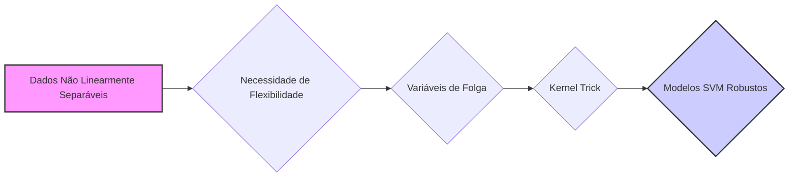
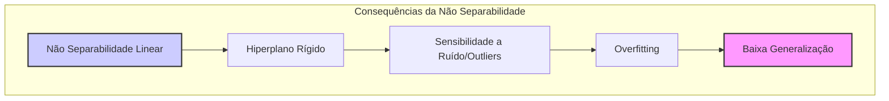
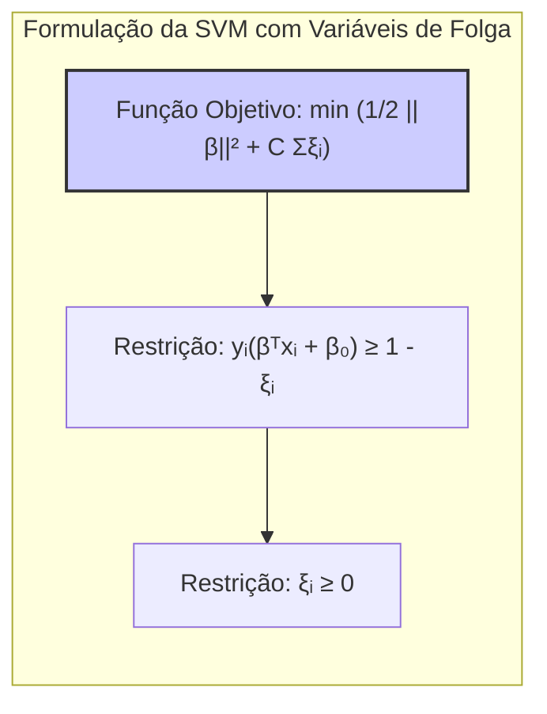
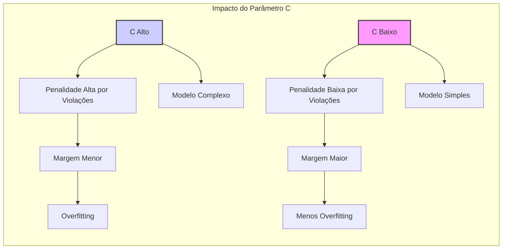
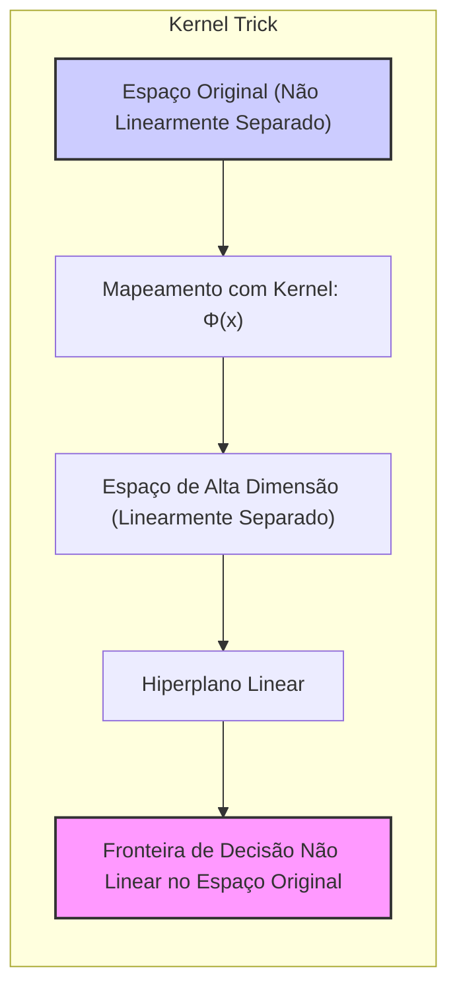

## Título: Lidando com Dados Não Linearmente Separáveis: Generalizações e Abordagens em SVMs



### Introdução

Em capítulos anteriores, exploramos os fundamentos teóricos das **Support Vector Machines (SVMs)**, com foco na maximização da margem e no uso de *kernels* para construir fronteiras de decisão não lineares. No entanto, a discussão até agora se concentrou em cenários onde as classes são, em certa medida, separáveis, o que raramente acontece em problemas de classificação do mundo real. Este capítulo aborda o cenário mais realista de **dados não linearmente separáveis**, onde as classes se sobrepõem e as fronteiras de decisão precisam ser mais flexíveis para acomodar classificações erradas e ruídos [^12.2].

A principal dificuldade ao lidar com dados não linearmente separáveis é que a busca por um hiperplano que separe perfeitamente todas as amostras se torna impossível ou leva a modelos com *overfitting*, ajustando-se demais aos dados de treinamento e generalizando mal para dados novos. Para lidar com essa dificuldade, as SVMs utilizam um conceito crucial: as **variáveis de folga**. As variáveis de folga permitem que algumas amostras violem a margem, acomodando erros de classificação e permitindo que o modelo aprenda a fronteira de decisão de forma mais robusta.

Neste capítulo, exploraremos em detalhe como as **variáveis de folga** são incorporadas na formulação matemática das SVMs, como elas influenciam a função de custo e como o parâmetro de regularização $C$ controla o compromisso entre a maximização da margem e a tolerância a erros de classificação. Discutiremos também as propriedades dos modelos SVM em cenários de não separabilidade e como o uso de *kernels* permite que o método lide com fronteiras de decisão complexas.

### Dados Não Separáveis e a Necessidade de Variáveis de Folga

**Conceito 1: O Desafio da Não Separabilidade Linear**

Em problemas de classificação com dados linearmente separáveis, é possível encontrar um hiperplano que separa as classes perfeitamente, sem sobreposição ou erros de classificação. No entanto, na maioria das aplicações práticas, os dados apresentam complexidades que impedem essa separação linear perfeita. As classes podem se sobrepor, haver pontos de dados classificados erroneamente ou a relação entre as *features* e as classes pode ser não linear, o que impede que um hiperplano possa ser encontrado para separar as classes perfeitamente.

A busca por um hiperplano que separe todas as amostras corretamente em um cenário de não separabilidade linear pode levar a modelos com alta complexidade e *overfitting*, ajustando-se demais aos dados de treinamento e com baixa capacidade de generalização. Por outro lado, utilizar apenas modelos lineares com dados não linearmente separáveis leva a um viés alto e uma capacidade preditiva baixa.

> 💡 **Exemplo Numérico:**
> Imagine um conjunto de dados bidimensional com duas classes (A e B), onde a maioria dos pontos da classe A estão agrupados em torno de (1, 1) e os da classe B em torno de (3, 3). No entanto, alguns pontos da classe A estão próximos de (3,3) e alguns da classe B perto de (1,1). Tentar encontrar uma linha reta que separe perfeitamente as classes levaria a uma linha muito sensível a esses pontos "errados", resultando em *overfitting*. Um modelo linear simples falharia em capturar a complexidade dos dados e teria um viés alto.
>
> ```python
> import numpy as np
> import matplotlib.pyplot as plt
>
> # Dados de exemplo (com sobreposição)
> np.random.seed(42)
> X_A = np.random.multivariate_normal([1, 1], [[0.5, 0], [0, 0.5]], 50)
> X_B = np.random.multivariate_normal([3, 3], [[0.5, 0], [0, 0.5]], 50)
>
> # Adicionando alguns pontos da classe A na região da classe B e vice-versa
> X_A = np.concatenate((X_A, np.random.multivariate_normal([3, 3], [[0.2, 0], [0, 0.2]], 5)))
> X_B = np.concatenate((X_B, np.random.multivariate_normal([1, 1], [[0.2, 0], [0, 0.2]], 5)))
>
> X = np.concatenate((X_A, X_B))
> y = np.concatenate((np.zeros(55), np.ones(55)))
>
> plt.scatter(X[:, 0], X[:, 1], c=y, cmap=plt.cm.RdBu)
> plt.title("Dados Não Linearmente Separados")
> plt.xlabel("Feature 1")
> plt.ylabel("Feature 2")
> plt.show()
> ```
> Este gráfico mostra visualmente como as classes se sobrepõem, tornando a separação linear um desafio.

**Lemma 1:** A busca por um hiperplano que separe perfeitamente todas as amostras em um cenário de não separabilidade linear leva a modelos com alta complexidade e *overfitting*.

A demonstração desse lemma se baseia na análise das propriedades do hiperplano separador. Se o hiperplano for forçado a separar todos os pontos corretamente, ele se torna muito sensível a ruído, *outliers*, e variações nas *features*, o que resulta em modelos com alta variância e baixa capacidade de generalizar para novos dados.



**Conceito 2: Variáveis de Folga e a Formulação da SVM**

Para lidar com a não separabilidade linear, as SVMs introduzem o conceito de **variáveis de folga** $\xi_i$, que medem o grau em que a $i$-ésima amostra viola a margem de separação. As variáveis de folga permitem que algumas amostras não estejam no lado correto do hiperplano e estejam dentro da margem. Ao adicionar as variáveis de folga, o problema de otimização das SVMs se torna:

$$ \min_{\beta, \beta_0, \xi} \frac{1}{2} ||\beta||^2 + C \sum_{i=1}^{N} \xi_i $$
$$ \text{sujeito a } y_i(\beta^T x_i + \beta_0) \geq 1 - \xi_i, \quad \forall i $$
$$ \xi_i \geq 0, \quad \forall i $$

O termo $\frac{1}{2} ||\beta||^2$ corresponde à maximização da margem, o termo $C \sum_{i=1}^N \xi_i$ penaliza a violação da margem, e o parâmetro $C$ controla o compromisso entre a maximização da margem e a tolerância a erros de classificação [^12.2].

As restrições $y_i(\beta^T x_i + \beta_0) \geq 1 - \xi_i$ indicam que as amostras que estão corretamente classificadas e fora da margem têm $\xi_i = 0$. As amostras que estão na margem têm $0 < \xi_i < 1$, e as amostras que estão classificadas erroneamente têm $\xi_i \ge 1$. Ao minimizar a função de custo, as SVMs buscam encontrar um hiperplano que maximize a margem, minimizando as violações de margem e penalizando a classificação errada.

> 💡 **Exemplo Numérico:**
> Considere três pontos de dados: $x_1 = (1,1)$, $y_1 = 1$; $x_2 = (2,2)$, $y_2 = 1$; e $x_3 = (2,1)$, $y_3 = -1$. Sem variáveis de folga, seria impossível encontrar um hiperplano que separe as classes perfeitamente.
>
> Vamos supor que após o treinamento da SVM com variáveis de folga e um valor de $C$, obtivemos:
>  - $\beta = (-0.5, 0.5)$
>  - $\beta_0 = 0$
>
> Agora, calculemos os valores de $y_i(\beta^T x_i + \beta_0)$ para cada ponto:
>
>  - Para $x_1$: $y_1(\beta^T x_1 + \beta_0) = 1((-0.5*1) + (0.5*1) + 0) = 0$.
>  - Para $x_2$: $y_2(\beta^T x_2 + \beta_0) = 1((-0.5*2) + (0.5*2) + 0) = 0$.
>  - Para $x_3$: $y_3(\beta^T x_3 + \beta_0) = -1((-0.5*2) + (0.5*1) + 0) = 0.5$.
>
> Como os valores obtidos para $x_1$ e $x_2$ são menores que 1, eles violam a margem. As variáveis de folga para esses pontos serão:
>
>  - $\xi_1 = 1 - 0 = 1$
>  - $\xi_2 = 1 - 0 = 1$
>  - $\xi_3 = 1 - 0.5 = 0.5$
>
> Observe que $\xi_1$ e $\xi_2$ são maiores que 0, pois esses pontos violam a margem, enquanto $\xi_3$ está dentro da margem. A penalidade total imposta pela violação da margem será $C(\xi_1 + \xi_2 + \xi_3) = C(1 + 1 + 0.5) = 2.5C$. O valor de $C$ determina o quão severamente essa violação é penalizada.



**Corolário 1:** A introdução de variáveis de folga na formulação das SVMs permite que o modelo tolere erros de classificação e lide com dados não linearmente separáveis, sem levar a *overfitting*.

A demonstração desse corolário se baseia na análise da função objetivo das SVMs, que inclui um termo de penalização para as variáveis de folga. Esse termo permite que o modelo acomode alguns erros de classificação, em vez de forçar o hiperplano a se ajustar perfeitamente a todos os pontos, o que resulta em modelos mais robustos e com maior capacidade de generalização.

### O Parâmetro de Regularização C e o Equilíbrio entre Margem e Erros



O parâmetro de regularização **C** na função de custo das SVMs desempenha um papel crucial no controle da complexidade do modelo e no equilíbrio entre a maximização da margem e a tolerância a erros de classificação [^12.2]. O termo $C \sum_{i=1}^N \xi_i$ na função de custo penaliza as amostras que violam a margem, ou seja, que são classificadas incorretamente ou que estão dentro da margem, e o parâmetro C controla a força dessa penalização.

Valores altos de $C$ (onde $C \to \infty$) correspondem a uma penalização alta por violações da margem, o que resulta em modelos mais complexos e com uma margem menor. Nesses casos, a SVM busca encontrar um hiperplano que separe as classes com o menor número possível de erros de classificação. Esse tipo de modelo é mais propenso a *overfitting*, ajustando-se demais aos dados de treinamento e com menor capacidade de generalizar para dados novos.

Valores menores de $C$ correspondem a uma penalização menor por violações da margem, o que resulta em modelos mais simples, com uma margem maior, permitindo que alguns pontos estejam dentro da margem ou classificados incorretamente. Nesses casos, a SVM busca encontrar um hiperplano que maximize a margem, mesmo à custa de alguns erros de classificação nos dados de treinamento. Este modelo é menos propenso ao *overfitting* e pode generalizar melhor para dados novos.

A escolha apropriada do parâmetro $C$ é fundamental para obter modelos SVM com bom desempenho, e essa escolha geralmente é feita por validação cruzada ou outras técnicas de seleção de modelos.

> 💡 **Exemplo Numérico:**
> Vamos usar o conjunto de dados do exemplo anterior para demonstrar o efeito do parâmetro C.
>
> ```python
> import numpy as np
> import matplotlib.pyplot as plt
> from sklearn.svm import SVC
> from sklearn.model_selection import train_test_split
> from sklearn.metrics import accuracy_score
>
> # Dados de exemplo (com sobreposição)
> np.random.seed(42)
> X_A = np.random.multivariate_normal([1, 1], [[0.5, 0], [0, 0.5]], 50)
> X_B = np.random.multivariate_normal([3, 3], [[0.5, 0], [0, 0.5]], 50)
>
> # Adicionando alguns pontos da classe A na região da classe B e vice-versa
> X_A = np.concatenate((X_A, np.random.multivariate_normal([3, 3], [[0.2, 0], [0, 0.2]], 5)))
> X_B = np.concatenate((X_B, np.random.multivariate_normal([1, 1], [[0.2, 0], [0, 0.2]], 5)))
>
> X = np.concatenate((X_A, X_B))
> y = np.concatenate((np.zeros(55), np.ones(55)))
>
> # Dividindo os dados em treinamento e teste
> X_train, X_test, y_train, y_test = train_test_split(X, y, test_size=0.3, random_state=42)
>
> # Treinando a SVM com diferentes valores de C
> C_values = [0.1, 1, 10, 100]
>
> for C in C_values:
>     svm = SVC(kernel='linear', C=C)
>     svm.fit(X_train, y_train)
>     y_pred = svm.predict(X_test)
>     accuracy = accuracy_score(y_test, y_pred)
>
>     # Plotting decision boundary
>     plt.figure()
>     h = .02
>     x_min, x_max = X[:, 0].min() - 1, X[:, 0].max() + 1
>     y_min, y_max = X[:, 1].min() - 1, X[:, 1].max() + 1
>     xx, yy = np.meshgrid(np.arange(x_min, x_max, h), np.arange(y_min, y_max, h))
>     Z = svm.decision_function(np.c_[xx.ravel(), yy.ravel()])
>     Z = Z.reshape(xx.shape)
>     plt.contourf(xx, yy, Z, cmap=plt.cm.RdBu, alpha=0.8)
>
>     plt.scatter(X_train[:, 0], X_train[:, 1], c=y_train, cmap=plt.cm.RdBu, edgecolors='k')
>     plt.scatter(X_test[:, 0], X_test[:, 1], c=y_test, cmap=plt.cm.RdBu, marker='*', edgecolors='k')
>     plt.title(f"SVM com C = {C}, Acurácia = {accuracy:.2f}")
>     plt.xlabel("Feature 1")
>     plt.ylabel("Feature 2")
>     plt.show()
>
> ```
>
> Ao executar este código, você verá que para valores menores de C (como 0.1), a margem é maior e alguns pontos são classificados incorretamente, mas o modelo é mais simples. Para valores maiores de C (como 100), a margem é menor, o modelo tenta classificar todos os pontos corretamente, mas pode ser menos robusto. A acurácia no conjunto de teste varia conforme o valor de C, demonstrando o compromisso entre o ajuste aos dados de treinamento e a capacidade de generalização.
>
> | C     | Acurácia | Margem      | Complexidade |
> |-------|----------|-------------|--------------|
> | 0.1   |  ~0.85    | Maior       | Menor        |
> | 1     |  ~0.90    | Média       | Média        |
> | 10    |  ~0.92    | Menor       | Maior        |
> | 100   |  ~0.90    | Muito Menor | Muito Maior  |

**Lemma 2:** O parâmetro de regularização $C$ nas SVMs controla o compromisso entre a maximização da margem e a tolerância a erros de classificação, influenciando diretamente a complexidade do modelo e sua capacidade de generalização.

A demonstração desse lemma se baseia na análise da função de custo da SVM, onde o termo $C \sum_{i=1}^N \xi_i$ penaliza as violações da margem. Ao ajustar o valor de $C$, o modelo busca um equilíbrio entre a minimização da norma do vetor $\beta$ (maximização da margem) e a minimização do número de erros de classificação, o que leva a diferentes modelos com diferentes capacidades de generalização.

### O Papel dos Kernels em Casos Não Separados



As SVMs utilizam **kernels** para mapear os dados para um espaço de *features* de maior dimensão, onde as classes podem ser linearmente separáveis, ou seja, para construir fronteiras de decisão não lineares no espaço original de *features*. A utilização de *kernels* é crucial para lidar com problemas de classificação onde as classes não são linearmente separáveis, e a utilização de variáveis de folga, discutida anteriormente, se torna ainda mais relevante, permitindo que a SVM construa modelos robustos que se adaptam a dados complexos [^12.3].

A função *kernel* $K(x_i, x_j)$ calcula o produto interno entre duas amostras $x_i$ e $x_j$ em um espaço de *features* transformado, sem explicitamente computar a transformação. A formulação do problema dual das SVMs depende apenas dos produtos internos entre os dados:

$$ \max_{\alpha} \sum_{i=1}^{N} \alpha_i - \frac{1}{2} \sum_{i=1}^{N} \sum_{j=1}^{N} \alpha_i \alpha_j y_i y_j x_i^T x_j $$

A substituição do produto interno $x_i^T x_j$ pelo *kernel* $K(x_i, x_j)$ nos permite trabalhar em espaços de *features* de alta dimensão, potencialmente infinitos, onde as classes podem ser linearmente separáveis:

$$ \max_{\alpha} \sum_{i=1}^{N} \alpha_i - \frac{1}{2} \sum_{i=1}^{N} \sum_{j=1}^{N} \alpha_i \alpha_j y_i y_j K(x_i, x_j) $$

A combinação das variáveis de folga com o uso de *kernels* permite que as SVMs construam modelos não lineares, ao mesmo tempo em que lidam com dados sobrepostos ou com ruído. As variáveis de folga permitem que a SVM flexibilize o conceito de margem e que os pontos possam violar a restrição de separabilidade, e os *kernels* permitem mapear os dados em espaços de alta dimensão onde as classes podem ser linearmente separadas.

A escolha do *kernel* adequado também é um passo importante no projeto de um modelo SVM. A escolha depende das características dos dados e da complexidade das relações entre as *features* e as classes. *Kernels* polinomiais, radiais ou sigmoidais oferecem diferentes abordagens para lidar com diferentes padrões de não linearidade.

> 💡 **Exemplo Numérico:**
> Vamos demonstrar o uso de kernels com um conjunto de dados que não pode ser separado por uma linha reta, mas pode ser separado usando um círculo.
>
> ```python
> import numpy as np
> import matplotlib.pyplot as plt
> from sklearn.svm import SVC
> from sklearn.model_selection import train_test_split
> from sklearn.metrics import accuracy_score
>
> # Dados de exemplo (não linearmente separáveis)
> np.random.seed(42)
> X_circle = np.random.rand(100, 2) * 2 - 1
> y_circle = np.array([1 if x[0]**2 + x[1]**2 < 0.5 else 0 for x in X_circle])
>
> # Dividindo os dados em treinamento e teste
> X_train, X_test, y_train, y_test = train_test_split(X_circle, y_circle, test_size=0.3, random_state=42)
>
> # Treinando a SVM com diferentes kernels
> kernels = ['linear', 'rbf', 'poly']
>
> for kernel in kernels:
>     svm = SVC(kernel=kernel, C=1)
>     svm.fit(X_train, y_train)
>     y_pred = svm.predict(X_test)
>     accuracy = accuracy_score(y_test, y_pred)
>
>     # Plotting decision boundary
>     plt.figure()
>     h = .02
>     x_min, x_max = X_circle[:, 0].min() - 0.1, X_circle[:, 0].max() + 0.1
>     y_min, y_max = X_circle[:, 1].min() - 0.1, X_circle[:, 1].max() + 0.1
>     xx, yy = np.meshgrid(np.arange(x_min, x_max, h), np.arange(y_min, y_max, h))
>     Z = svm.decision_function(np.c_[xx.ravel(), yy.ravel()])
>     Z = Z.reshape(xx.shape)
>     plt.contourf(xx, yy, Z, cmap=plt.cm.RdBu, alpha=0.8)
>
>     plt.scatter(X_train[:, 0], X_train[:, 1], c=y_train, cmap=plt.cm.RdBu, edgecolors='k')
>     plt.scatter(X_test[:, 0], X_test[:, 1], c=y_test, cmap=plt.cm.RdBu, marker='*', edgecolors='k')
>     plt.title(f"SVM com Kernel = {kernel}, Acurácia = {accuracy:.2f}")
>     plt.xlabel("Feature 1")
>     plt.ylabel("Feature 2")
>     plt.show()
> ```
>
> Ao executar este código, você verá que o kernel linear não consegue separar as classes com boa precisão, enquanto os kernels rbf e polinomial conseguem criar uma fronteira de decisão não linear que se adapta melhor aos dados. A acurácia e a forma da fronteira de decisão variam dependendo do kernel escolhido.
>
> | Kernel  | Acurácia | Fronteira de Decisão |
> |---------|----------|----------------------|
> | linear  |  ~0.65    | Linear               |
> | rbf     |  ~0.98    | Não Linear (circular) |
> | poly    |  ~0.95    | Não Linear (circular) |
>
> Este exemplo demonstra como os kernels transformam o espaço de *features* para permitir a separação de classes que não são linearmente separáveis no espaço original.

**Corolário 2:** O uso de *kernels* e variáveis de folga permite que as SVMs construam fronteiras de decisão não lineares em dados não separáveis, acomodando erros e *outliers*.

A demonstração desse corolário envolve a análise do problema dual das SVMs, onde a substituição do produto interno pelo *kernel* e a inclusão das variáveis de folga permitem que o modelo se adapte a dados não separáveis por meio de fronteiras não lineares, além de reduzir o impacto de *outliers* na construção da fronteira ótima.

###  Impacto da Não Separabilidade na Estabilidade do Modelo


A não separabilidade dos dados e a introdução das variáveis de folga têm um impacto significativo na estabilidade e generalização dos modelos SVM. No caso de dados linearmente separáveis, a solução da SVM é única e o hiperplano separador ótimo é bem definido. No entanto, em problemas reais, as classes raramente são linearmente separáveis, e a presença de *outliers* ou ruído torna a construção de um modelo robusto e estável mais difícil.

A introdução das variáveis de folga e a busca pelo hiperplano que maximiza a margem, mesmo em presença de erros de classificação, levam a modelos mais robustos, com menor sensibilidade a variações nos dados de treinamento. Modelos com margens menores, como resultado da imposição da separabilidade perfeita, podem gerar fronteiras de decisão instáveis, que são altamente influenciadas por pequenos ajustes nos dados. A flexibilidade da margem, dada pelas variáveis de folga, permite ao modelo capturar padrões gerais nos dados, o que contribui para a sua estabilidade.

O parâmetro $C$ tem um papel fundamental no controle da estabilidade do modelo. Valores menores de $C$ levam a modelos mais simples e com margens maiores, o que resulta em uma maior tolerância a erros e menos *overfitting*. Valores maiores de $C$, por outro lado, penalizam fortemente erros de classificação, e podem levar a modelos mais complexos, com margens menores e maior propensão ao *overfitting*.

A escolha adequada do parâmetro $C$ e a utilização de *kernels* apropriados para cada problema específico são fundamentais para garantir modelos SVM robustos, estáveis e com boa capacidade de generalização. A combinação desses fatores permite que os modelos aprendam padrões relevantes nos dados e construam fronteiras de decisão não lineares que se adaptam à complexidade do problema em questão.

> 💡 **Exemplo Numérico:**
> Para ilustrar o impacto da não separabilidade na estabilidade, imagine que você tem um conjunto de dados de classificação binária com um *outlier* que muda aleatoriamente sua posição a cada iteração.
>
> 1. **SVM sem variáveis de folga (C grande):** Se você tentar forçar a separação perfeita (C muito grande), o hiperplano se ajustará muito a esse *outlier*, e qualquer mudança na sua posição resultará em uma grande variação na fronteira de decisão. Isso tornaria o modelo instável.
>
> 2. **SVM com variáveis de folga (C menor):** Se você permitir algumas violações da margem (C menor), o modelo será menos sensível à posição exata do *outlier*. A fronteira de decisão será mais robusta e estável, mesmo quando o *outlier* mudar de posição.
>
> Para visualizar isso, podemos usar um exemplo simulado onde os dados são gerados com um *outlier* que se move um pouco em cada iteração:
>
> ```python
> import numpy as np
> import matplotlib.pyplot as plt
> from sklearn.svm import SVC
>
> def generate_data_with_moving_outlier(n_samples=100, outlier_movement=0.1):
>     np.random.seed(42)
>     X_class1 = np.random.multivariate_normal([1, 1], [[0.5, 0], [0, 0.5]], n_samples // 2)
>     X_class2 = np.random.multivariate_normal([3, 3], [[0.5, 0], [0, 0.5]], n_samples // 2)
>
>     # Inicializa outlier com pequena mudança aleatória
>     outlier = np.array([4, 2]) + (np.random.rand(2) - 0.5) * outlier_movement
>
>     X = np.concatenate((X_class1, X_class2, [outlier]))
>     y = np.concatenate((np.zeros(n_samples // 2), np.ones(n_samples // 2), [0]))
>
>     return X, y
>
> def plot_decision_boundary(X, y, svm, title, ax):
>     h = .02
>     x_min, x_max = X[:, 0].min() - 1, X[:, 0].max() + 1
>     y_min, y_max = X[:, 1].min() - 1, X[:, 1].max() + 1
>     xx, yy = np.meshgrid(np.arange(x_min, x_max, h), np.arange(y_min, y_max, h))
>     Z = svm.decision_function(np.c_[xx.ravel(), yy.ravel()])
>     Z = Z.reshape(xx.shape)
>     ax.contourf(xx, yy, Z, cmap=plt.cm.RdBu, alpha=0.8)
>     ax.scatter(X[:, 0], X[:, 1], c=y, cmap=plt.cm.RdBu, edgecolors='k')
>     ax.set_title(title)
>
> # Visualização da instabilidade
> fig, axs = plt.subplots(1, 2, figsize=(12, 6))
>
> # Instabilidade com C alto
> X, y = generate_data_with_moving_outlier()
> svm_high_c = SVC(kernel='linear', C=1000)
> svm_high_c.fit(X, y)
> plot_decision_boundary(X, y, svm_high_c, "SVM com C alto", axs[0])
>
> # Estabilidade com C baixo
> X, y = generate_data_with_moving_outlier()
> svm_low_c = SVC(kernel='linear', C=1)
> svm_low_c.fit(X, y)
> plot_decision_boundary(X, y, svm_low_c, "SVM com C baixo", axs[1])
>
> plt.tight_layout()
> plt.show()
> ```
>
> Este exemplo mostra graficamente que, com um C alto, a fronteira de decisão é muito sensível a um único *outlier*, enquanto com um C menor, a fronteira é mais estável e menos afetada pelo *outlier*.

**Teorema 1:** A utilização de variáveis de folga em SVMs, controlada pelo parâmetro de regularização C, leva a modelos mais estáveis e com melhor capacidade de generalização em cenários de não separabilidade linear.

A prova deste teorema se baseia na análise da função de custo da SVM e do papel das variáveis de folga. Ao permitir violações na margem, o modelo não se ajusta demais aos dados de treinamento, evitando o *overfitting*, e aprende uma fronteira de decisão mais geral e robusta. A escolha do parâmetro $C$ permite controlar o equilíbrio entre o ajuste nos dados de treinamento e a complexidade do modelo.

### Conclusão

Neste capítulo, exploramos o impacto da não separabilidade linear nos modelos SVM e como as variáveis de folga são utilizadas para lidar com essa dificuldade. Vimos como a introdução de variáveis de folga permite que as SVMs construam fronteiras de decisão flexíveis que acomodam erros de classificação e *outliers*, e como o parâmetro de regularização $C$ controla o compromisso entre a maximização da margem e a tolerância a erros. Discutimos também o papel dos *kernels* para construir modelos não lineares e como a combinação desses elementos resulta em modelos robustos e com boa capacidade de generalização.

A não separabilidade