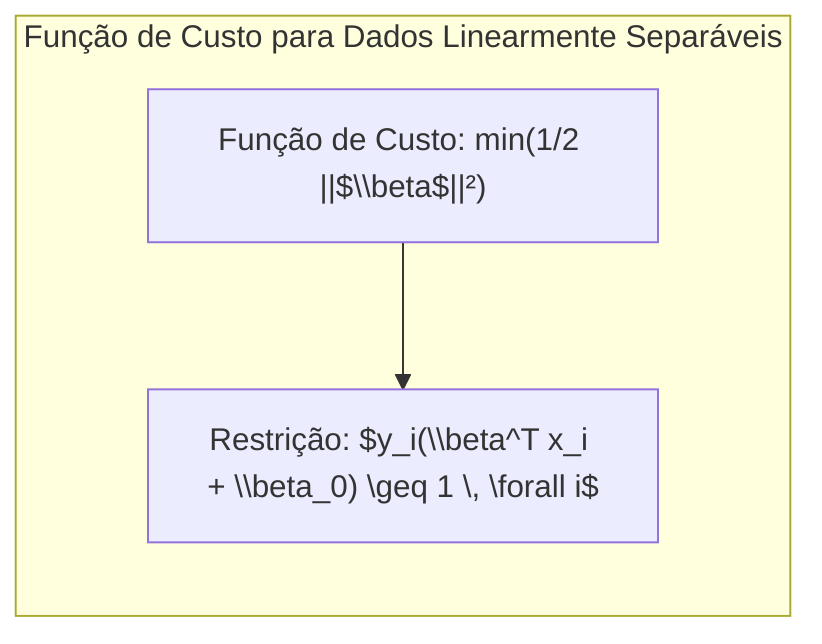
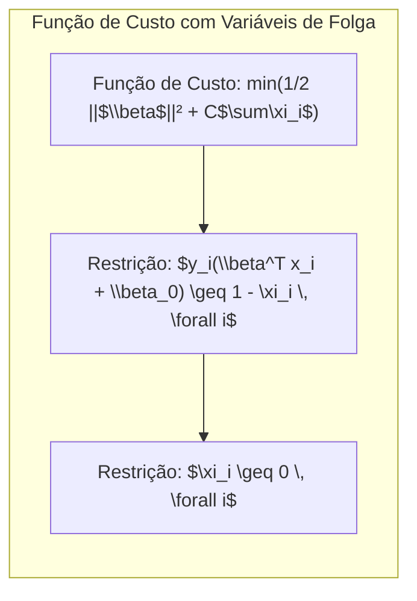
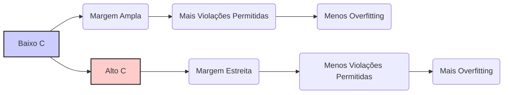
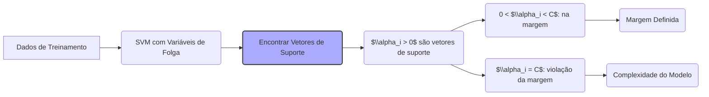

## Título: Reformulação do Problema de Otimização para SVMs em Casos Não Separáveis: Variáveis de Folga e Função de Custo

### Introdução

Nos capítulos anteriores, discutimos os fundamentos teóricos das **Support Vector Machines (SVMs)** e o conceito de hiperplano separador ótimo. Vimos que, em cenários onde os dados são linearmente separáveis, a busca por esse hiperplano é um problema de otimização bem definido. No entanto, em situações reais, os dados raramente são linearmente separáveis, e a existência de ruído, *outliers* e sobreposição entre classes exige a utilização de abordagens mais flexíveis. Este capítulo detalha como o **problema de otimização** das SVMs é reformulado para lidar com dados não separáveis, introduzindo as **variáveis de folga** e modificando a função de custo para acomodar classificações erradas.

A reformulação do problema de otimização para dados não separáveis é crucial para a capacidade das SVMs de lidar com a complexidade de dados do mundo real. A introdução das variáveis de folga permite que o modelo tolere erros de classificação, o que é fundamental para evitar o *overfitting* e construir modelos mais robustos e com boa capacidade de generalização. O ajuste do parâmetro de regularização $C$ permite controlar o compromisso entre a maximização da margem e a penalização por erros, o que é fundamental para a obtenção de um modelo ótimo.

Neste capítulo, detalharemos a formulação matemática do problema de otimização para o caso não separável, explorando o papel das variáveis de folga e do parâmetro de regularização $C$, e como a função de custo é modificada para acomodar os dados não linearmente separáveis. Analisaremos também o impacto dessa reformulação na complexidade do modelo, nas condições de otimalidade e na capacidade de generalização, estabelecendo uma base teórica sólida para a compreensão das SVMs em situações mais realistas.

### Reformulação da Função de Custo e Introdução das Variáveis de Folga

**Conceito 1: A Função de Custo para Dados Linearmente Separáveis**

Em problemas de classificação com dados linearmente separáveis, o objetivo das SVMs é encontrar o hiperplano que maximiza a margem de separação entre as classes. A função de custo original (primal) para este problema é:

$$ \min_{\beta, \beta_0} \frac{1}{2} ||\beta||^2 $$

sujeito a:

$$ y_i(\beta^T x_i + \beta_0) \geq 1, \quad \forall i $$

onde $\beta$ é o vetor normal ao hiperplano, $\beta_0$ é o *bias*, $x_i$ são os dados de entrada, e $y_i \in \{-1, 1\}$ são os rótulos das classes. A restrição garante que todas as amostras estejam corretamente classificadas e a uma distância de pelo menos 1 da margem [^12.2].

Essa formulação, no entanto, assume que as classes são perfeitamente separáveis, o que não se verifica na prática.

**Lemma 1:** A função de custo para dados linearmente separáveis não é adequada para lidar com dados reais, onde a sobreposição entre classes e a existência de ruído impedem a separação perfeita.

A demonstração desse lemma é baseada na análise da natureza dos dados do mundo real, que frequentemente apresentam padrões complexos e ruído que impedem a separabilidade linear. A função de custo para dados linearmente separáveis, por forçar que todas as amostras estejam corretamente classificadas e fora da margem, leva a modelos excessivamente complexos e pouco generalizáveis.

> 💡 **Exemplo Numérico:**
> Imagine um conjunto de dados com duas classes (y = -1 e y = 1) e duas features (x1, x2). Em um cenário idealmente separável, poderíamos ter pontos como:
>
> Classe -1: (1, 1), (1, 2), (2, 1)
> Classe 1: (4, 4), (4, 5), (5, 4)
>
> Um hiperplano poderia separá-los perfeitamente. No entanto, em dados reais, poderíamos ter um ponto da classe -1 como (3, 3), que está dentro da região da classe 1. A função de custo original não permitiria isso, e a busca pelo hiperplano perfeito falharia ou resultaria em um modelo muito sensível a esse único ponto.

**Conceito 2: Introdução das Variáveis de Folga**

Para lidar com dados não linearmente separáveis, a função de custo das SVMs é modificada com a introdução das **variáveis de folga** $\xi_i$, que permitem que algumas amostras violem a margem de separação. A nova função de custo se torna:

$$ \min_{\beta, \beta_0, \xi} \frac{1}{2} ||\beta||^2 + C \sum_{i=1}^{N} \xi_i $$

sujeito a:

$$ y_i(\beta^T x_i + \beta_0) \geq 1 - \xi_i, \quad \forall i $$
$$ \xi_i \geq 0, \quad \forall i $$

O termo $\frac{1}{2} ||\beta||^2$ representa a minimização da norma do vetor $\beta$, e o termo $C \sum_{i=1}^{N} \xi_i$ é a penalidade por violações da margem. O parâmetro $C$ controla o compromisso entre a maximização da margem e a penalidade por classificações erradas [^12.2]. As variáveis de folga $\xi_i$ medem o grau em que a $i$-ésima amostra viola a margem, e são maiores ou iguais a zero. Se $\xi_i = 0$, a $i$-ésima amostra está classificada corretamente e fora da margem. Se $0 < \xi_i < 1$, a amostra está classificada corretamente, mas dentro da margem, e se $\xi_i \geq 1$, a amostra está classificada incorretamente.

**Corolário 1:** A introdução das variáveis de folga permite que a SVM construa modelos robustos que lidam com a sobreposição entre classes e *outliers*.

A demonstração desse corolário se baseia na análise da função de custo modificada, que permite a existência de classificações erradas e de amostras dentro da margem, o que leva a modelos mais adaptáveis e com maior capacidade de generalização em relação aos modelos baseados na separabilidade perfeita.

> 💡 **Exemplo Numérico:**
>
> Usando o exemplo anterior, suponha que o ponto (3,3) da classe -1 esteja dentro da margem ou classificado incorretamente. Com as variáveis de folga, podemos ter:
>
> - Para os pontos corretamente classificados e fora da margem, $\xi_i = 0$.
> - Para o ponto (3,3), podemos ter $\xi_i = 0.5$ se estiver dentro da margem, ou $\xi_i = 1.2$ se estiver classificado incorretamente (e fora da margem do lado errado).
>
> O valor exato de $\xi_i$ dependerá da posição do ponto em relação à margem e do valor de $C$. A função de custo agora penaliza a violação da margem, mas permite que ela ocorra, evitando um modelo excessivamente complexo e sensível a outliers. Se $C$ for alto, a penalidade por $\xi_i$ grande será alta, forçando o modelo a classificar (3,3) corretamente ou com uma pequena violação da margem. Se $C$ for baixo, o modelo permitirá uma violação maior da margem, resultando numa margem mais ampla, mas com a possibilidade de classificar (3,3) incorretamente.

### O Parâmetro de Regularização C e o Compromisso entre Margem e Violação

O parâmetro de regularização **C** desempenha um papel crucial na formulação do problema de otimização para o caso não separável, pois ele controla o equilíbrio entre a maximização da margem e a penalidade por violações da mesma, como mencionado em [^12.2]. O termo $C \sum_{i=1}^{N} \xi_i$ na função de custo penaliza as amostras que estão classificadas erroneamente ou dentro da margem, e o parâmetro $C$ define a força dessa penalização.

Valores altos de $C$ impõem uma penalidade alta sobre as violações da margem, o que faz com que o modelo tente classificar corretamente o maior número possível de pontos, mesmo que isso implique uma margem menor. Esse tipo de modelo é mais propenso ao *overfitting*, ajustando-se demais aos dados de treinamento e com baixa capacidade de generalizar para novos dados.

Valores baixos de $C$, ao contrário, impõem uma penalidade baixa sobre as violações da margem, o que permite que o modelo tenha uma margem maior, mesmo à custa de algumas classificações erradas nos dados de treinamento. Este modelo é menos propenso ao *overfitting* e tende a apresentar melhor capacidade de generalização.

A escolha apropriada de $C$ depende da natureza do conjunto de dados e do problema de classificação específico, e ela é geralmente feita por técnicas de seleção de modelos como validação cruzada ou *grid search*.

**Lemma 2:** A escolha do parâmetro de regularização $C$ nas SVMs é um compromisso entre a maximização da margem e a minimização da penalidade por erros de classificação, e a escolha apropriada depende da complexidade do problema e da necessidade de generalização.

A demonstração desse lemma envolve a análise da influência de $C$ na função de custo. Um $C$ grande força a minimização do erro, priorizando o ajuste aos dados de treinamento em detrimento da margem, enquanto um $C$ pequeno prioriza a maximização da margem mesmo que isso implique alguns erros de classificação nos dados de treinamento.

> 💡 **Exemplo Numérico:**
>
> Considere um conjunto de dados com 100 pontos, 50 de cada classe. Vamos experimentar dois valores de $C$: $C=0.1$ e $C=10$.
>
> - **C = 0.1:** A penalidade por violação da margem é baixa. O modelo priorizará uma margem mais ampla, permitindo que alguns pontos sejam classificados incorretamente ou fiquem dentro da margem. Suponha que o modelo tenha 5 pontos mal classificados e uma margem de 0.8.
> - **C = 10:** A penalidade por violação da margem é alta. O modelo tentará classificar o máximo possível de pontos corretamente, mesmo que isso resulte em uma margem mais estreita. Suponha que o modelo tenha 2 pontos mal classificados e uma margem de 0.3.
>
> Neste caso, com $C=0.1$, o modelo tem uma margem maior, o que o torna mais robusto a novos dados, embora tenha cometido mais erros nos dados de treinamento. Com $C=10$, o modelo se ajustou melhor aos dados de treinamento, com menos erros, mas com uma margem menor, o que o torna mais propenso ao overfitting.
>
> A escolha do melhor valor de $C$ dependerá de como o modelo se comporta em dados não vistos (validação ou teste).

### Impacto da Reformulação na Solução e na Complexidade

A reformulação do problema de otimização com variáveis de folga tem um impacto direto na solução das SVMs e na complexidade do modelo resultante. No caso de dados linearmente separáveis, a solução para a SVM é única e o hiperplano separador ótimo é bem definido. No entanto, ao introduzir as variáveis de folga, a solução se torna mais flexível, permitindo que o modelo acomode erros e não se ajuste demais aos dados de treinamento [^12.2].

A solução do problema dual, derivada da função Lagrangiana e utilizando as condições de Karush-Kuhn-Tucker (KKT), nos fornece os multiplicadores de Lagrange $\alpha_i$, que são usados para calcular o vetor $\beta$ que define o hiperplano ótimo:

$$ \beta = \sum_{i=1}^{N} \alpha_i y_i x_i $$

A presença das variáveis de folga implica que os valores dos multiplicadores de Lagrange $\alpha_i$ estão sujeitos à restrição $0 \leq \alpha_i \leq C$. Os vetores de suporte são os pontos para os quais $\alpha_i > 0$. Os pontos para os quais $0 < \alpha_i < C$ são os vetores de suporte que estão exatamente na margem, enquanto os pontos com $\alpha_i = C$ são os vetores de suporte que violam a margem, ou seja, que estão dentro ou do lado errado da margem.

O parâmetro $C$ também afeta a complexidade do modelo. Valores maiores de $C$ permitem que mais pontos se tornem vetores de suporte, o que leva a modelos mais complexos e com menor margem. Valores menores de $C$, por outro lado, levam a modelos mais simples, com menos vetores de suporte e maior margem.

**Corolário 2:** A reformulação do problema de otimização com variáveis de folga e o ajuste do parâmetro $C$ levam a modelos mais flexíveis e com maior controle sobre a complexidade.

A demonstração desse corolário se baseia na análise da solução do problema dual, que depende dos multiplicadores de Lagrange e dos vetores de suporte. A restrição nos multiplicadores de Lagrange, junto com a escolha do parâmetro $C$, permite controlar a complexidade do modelo, tornando-o menos sensível aos dados de treinamento e mais capaz de generalizar para novos dados.

> 💡 **Exemplo Numérico:**
>
> Vamos analisar como os valores de $\alpha_i$ e os vetores de suporte se comportam com diferentes valores de $C$. Considere um problema de classificação com 5 amostras, com rótulos $y_i = [-1, 1, -1, 1, -1]$ e features $x_i = [(1,1), (2,2), (1,2), (2,1), (3,1)]$.
>
> 1. **C = 1:** Após a otimização, suponha que os multiplicadores de Lagrange sejam: $\alpha = [0.2, 0.5, 0, 0.3, 0.1]$. Os vetores de suporte seriam os pontos 1, 2, 4 e 5.
>
> 2. **C = 0.1:** Após a otimização, suponha que os multiplicadores de Lagrange sejam: $\alpha = [0.05, 0.08, 0, 0.02, 0]$. Os vetores de suporte seriam os pontos 1, 2 e 4. Observe que menos pontos se tornaram vetores de suporte com um C menor.
>
> 3. **C = 10:** Após a otimização, suponha que os multiplicadores de Lagrange sejam: $\alpha = [1, 1, 0.5, 1, 0.8]$. Os vetores de suporte são todos os pontos menos o 3, e alguns pontos tem $\alpha_i=C$ o que significa que eles violam a margem.
>
> No primeiro caso, com C=1, temos alguns vetores de suporte, representando um modelo de complexidade intermediária. No segundo caso, com C=0.1, temos menos vetores de suporte, indicando um modelo mais simples e possivelmente uma margem mais ampla. No terceiro caso, com C=10, mais pontos se tornam vetores de suporte, alguns violando a margem, indicando um modelo mais complexo e propenso ao overfitting.

### Conclusão

Neste capítulo, exploramos a reformulação do problema de otimização das SVMs para lidar com dados não linearmente separáveis. Vimos como a introdução das **variáveis de folga** permite que o modelo tolere erros de classificação e construa fronteiras de decisão mais robustas e como o parâmetro de regularização $C$ controla o equilíbrio entre a maximização da margem e a penalidade por violações da margem. A reformulação do problema de otimização e a utilização de kernels formam o núcleo das SVMs como um modelo poderoso de classificação.

A reformulação da função de custo com a adição das variáveis de folga, junto com o ajuste do parâmetro $C$, é essencial para a capacidade das SVMs de lidar com dados complexos e ruidosos. Ao permitir que alguns pontos violem a margem, o modelo se torna mais adaptável e menos propenso ao *overfitting*. O parâmetro $C$ permite um ajuste fino do modelo, permitindo escolher entre maximizar a margem e penalizar erros de classificação, o que resulta em modelos com alta capacidade de generalização.

A compreensão dos aspectos abordados neste capítulo é fundamental para a aplicação bem sucedida das SVMs em problemas de classificação do mundo real. A capacidade de lidar com a não separabilidade, controlar a complexidade do modelo e ajustar o balanço entre precisão e generalização torna as SVMs uma ferramenta indispensável para qualquer profissional de aprendizado de máquina.

### Footnotes

[^12.1]: "In this chapter we describe generalizations of linear decision boundaries for classification. Optimal separating hyperplanes are introduced in Chapter 4 for the case when two classes are linearly separable. Here we cover extensions to the nonseparable case, where the classes overlap. These techniques are then generalized to what is known as the support vector machine, which produces nonlinear boundaries by constructing a linear boundary in a large, transformed version of the feature space." *(Trecho de  "Support Vector Machines and Flexible Discriminants")*

[^12.2]: "In Chapter 4 we discussed a technique for constructing an optimal separating hyperplane between two perfectly separated classes. We review this and generalize to the nonseparable case, where the classes may not be separable by a linear boundary." *(Trecho de  "Support Vector Machines and Flexible Discriminants")*

[^12.3]: "The support vector machine classifier is an extension of this idea, where the dimension of the enlarged space is allowed to get very large, infinite in some cases. It might seem that the computations would become prohibitive. It would also seem that with sufficient basis functions, the data would be separable, and overfitting would occur. We first show how the SVM technology deals with these issues. We then see that in fact the SVM classifier is solving a function-fitting problem using a particular criterion and form of regularization, and is part of a much bigger class of problems that includes the smoothing splines of Chapter 5." *(Trecho de  "Support Vector Machines and Flexible Discriminants")*
