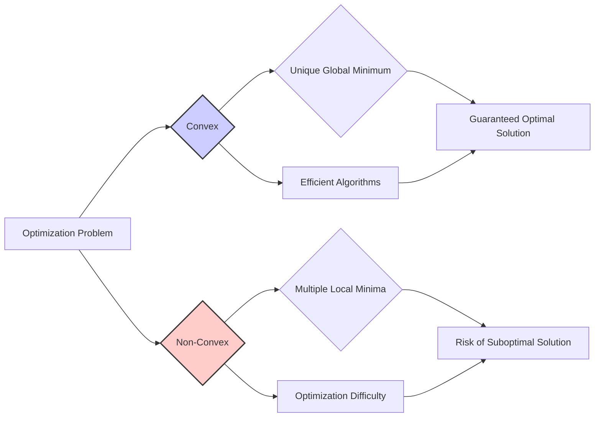
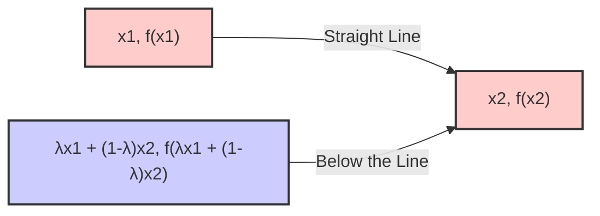
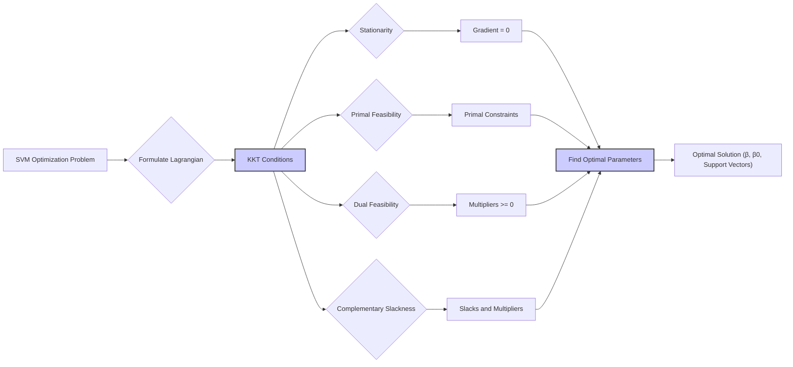
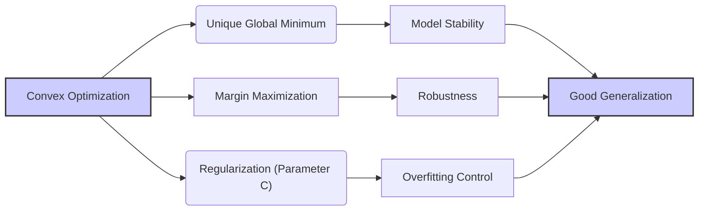

## Título: Otimização Convexa em SVMs: Garantias de Convergência e Soluções Globais

### Introdução

No desenvolvimento e aplicação das **Support Vector Machines (SVMs)**, um dos conceitos fundamentais é a **otimização convexa**. A formulação do problema de otimização das SVMs, tanto para o caso linearmente separável quanto para o caso não separável, é um problema de otimização convexo. Essa propriedade garante a existência de um mínimo global único e simplifica a busca pela solução ótima, o que contribui para a estabilidade e robustez dos modelos SVM [^12.2].

A otimização convexa é um ramo da otimização matemática que se concentra em problemas cuja função objetivo e região viável são convexas. A principal vantagem da otimização convexa é que qualquer mínimo local também é um mínimo global, o que significa que qualquer algoritmo que encontre um mínimo local também encontrará o mínimo global. Essa propriedade garante que o processo de otimização seja mais eficiente e confiável, especialmente em comparação com problemas de otimização não convexos, que podem apresentar múltiplos mínimos locais.

Neste capítulo, exploraremos em detalhe o conceito de otimização convexa e como esse conceito se aplica às SVMs. Analisaremos a função de custo das SVMs e demonstraremos que ela é uma função convexa, o que garante a existência de um mínimo global único. Discutiremos também as condições de otimalidade e como elas são utilizadas para encontrar a solução ótima do problema de otimização das SVMs.

### O Conceito de Otimização Convexa

**Conceito 1: Definição de um Problema de Otimização Convexa**

Um problema de otimização é considerado convexo se a função objetivo a ser minimizada (ou maximizada) e a região viável (o conjunto de pontos que satisfazem as restrições do problema) são convexas. Uma função é convexa se o segmento de reta entre quaisquer dois pontos no gráfico da função está acima ou sobre o gráfico da função.

Formalmente, uma função $f(x)$ é convexa se para quaisquer dois pontos $x_1$ e $x_2$ e qualquer $\lambda \in [0, 1]$, temos:

$$ f(\lambda x_1 + (1-\lambda) x_2) \leq \lambda f(x_1) + (1 - \lambda) f(x_2) $$

Um conjunto $C$ é convexo se, para quaisquer dois pontos $x_1, x_2 \in C$ e qualquer $\lambda \in [0, 1]$, temos:

$$ \lambda x_1 + (1-\lambda) x_2 \in C $$

Um problema de otimização é convexo se ele pode ser escrito na forma:

$$ \text{minimizar } f(x) $$
$$ \text{sujeito a } g_i(x) \leq 0, \quad \forall i $$
$$ a_j^T x = b_j, \quad \forall j $$

onde $f(x)$ e $g_i(x)$ são funções convexas e as restrições $a_j^T x = b_j$ são lineares (o que garante que a região viável seja convexa).

> 💡 **Exemplo Numérico:**
> Considere a função $f(x) = x^2$. Vamos verificar se ela é convexa usando a definição. Escolha dois pontos, $x_1 = 2$ e $x_2 = 4$, e $\lambda = 0.5$.
>
> $f(x_1) = 2^2 = 4$
> $f(x_2) = 4^2 = 16$
>
> $\lambda x_1 + (1-\lambda) x_2 = 0.5 * 2 + 0.5 * 4 = 1 + 2 = 3$
> $f(\lambda x_1 + (1-\lambda) x_2) = f(3) = 3^2 = 9$
>
> $\lambda f(x_1) + (1 - \lambda) f(x_2) = 0.5 * 4 + 0.5 * 16 = 2 + 8 = 10$
>
> Como $9 \leq 10$, a função $f(x) = x^2$ é convexa neste exemplo. Se repetirmos para quaisquer outros dois pontos e $\lambda$, a relação sempre se manterá.
>
> Agora, considere o conjunto $C = \{x \in \mathbb{R} : x \geq 0\}$. Escolha $x_1 = 2$ e $x_2 = 5$.
>
> $\lambda x_1 + (1-\lambda) x_2 = 0.5 * 2 + 0.5 * 5 = 1 + 2.5 = 3.5$
> Como $3.5 \geq 0$, o conjunto $C$ é convexo.

**Lemma 1:** Em um problema de otimização convexa, qualquer mínimo local também é um mínimo global.

A demonstração desse lemma se baseia na definição de convexidade e na análise da geometria dos conjuntos convexos. Se um ponto $x^*$ é um mínimo local, então qualquer ponto $x$ que seja factível e que esteja próximo a $x^*$ tem valor de função maior ou igual ao de $x^*$. Se o problema é convexo, então qualquer ponto factível está no mesmo nível ou acima da função. Assim, qualquer ponto factível $x$ tem $f(x) \geq f(x^*)$, e portanto $x^*$ é um mínimo global.

**Conceito 2: Importância da Convexidade em SVMs**

A importância da convexidade no contexto das SVMs reside na garantia de que qualquer algoritmo de otimização que encontre um mínimo local também encontrará o mínimo global, o que simplifica o processo de treinamento. As funções de custo e as restrições das SVMs são projetadas de forma a garantir a convexidade do problema de otimização.

A formulação matemática das SVMs garante a existência de um mínimo global único, que corresponde ao hiperplano separador ótimo. Essa propriedade é crucial para a estabilidade e eficiência dos algoritmos de treinamento das SVMs.

**Corolário 1:** A convexidade do problema de otimização das SVMs garante que a solução encontrada seja a melhor possível, o que simplifica o treinamento e aumenta a confiabilidade dos modelos SVM.

A demonstração desse corolário se baseia na análise da função de custo das SVMs, que é construída de forma a garantir a convexidade. A convexidade da função objetivo e das restrições garante que a solução encontrada seja o mínimo global do problema de otimização, o que maximiza a margem de separação e leva aos melhores resultados de classificação.

### Convexidade da Função de Custo das SVMs

A função de custo das SVMs, tanto no caso linearmente separável quanto no caso não separável, é uma função convexa, o que garante a existência de um mínimo global único. A função de custo para o caso não separável, com variáveis de folga, é dada por:

$$ J(\beta, \beta_0, \xi) = \frac{1}{2} ||\beta||^2 + C \sum_{i=1}^{N} \xi_i $$

sujeito a:

$$ y_i(\beta^T x_i + \beta_0) \geq 1 - \xi_i, \quad \forall i $$
$$ \xi_i \geq 0, \quad \forall i $$

Para provar que essa função é convexa, precisamos mostrar que os componentes individuais são convexos, e que a soma deles também é convexa.

**Lemma 2:** A função de custo das SVMs é uma função convexa.

**Prova do Lemma 2:**

Vamos analisar cada termo da função de custo.

1.  O termo $\frac{1}{2} ||\beta||^2$ é a norma ao quadrado de um vetor, que é uma função quadrática convexa.
2.  O termo $C \sum_{i=1}^{N} \xi_i$ é a soma de funções lineares (com $\xi_i \geq 0$), que também é uma função convexa.

A soma de funções convexas é também uma função convexa, portanto, a função objetivo é convexa.

Agora, precisamos mostrar que o conjunto das restrições é convexo. As restrições são:

$$ y_i(\beta^T x_i + \beta_0) \geq 1 - \xi_i $$
$$ \xi_i \geq 0 $$

Estas restrições definem um conjunto convexo, pois são lineares e a condição $\xi_i \geq 0$ define um ortante, que é convexo.

Como a função objetivo e as restrições são convexas, o problema de otimização das SVMs é um problema convexo, o que garante a existência de um mínimo global.

$\blacksquare$

A convexidade da função de custo garante que a busca pela solução ótima seja mais eficiente e confiável, pois qualquer algoritmo que encontre um mínimo local também encontrará o mínimo global.

> 💡 **Exemplo Numérico:**
> Vamos considerar um exemplo simplificado com apenas duas amostras e duas dimensões, para visualizar a convexidade da função de custo.
>
> Suponha que temos dois pontos de dados:
>
> $x_1 = [1, 1]$, $y_1 = 1$
> $x_2 = [2, -1]$, $y_2 = -1$
>
> E vamos simplificar considerando $\beta_0 = 0$ e $C = 1$. A função de custo, então, se torna:
>
> $J(\beta, \xi) = \frac{1}{2} ||\beta||^2 + \sum_{i=1}^{2} \xi_i$
>
> Sujeito a:
> $1(\beta^T [1, 1]) \geq 1 - \xi_1$
> $-1(\beta^T [2, -1]) \geq 1 - \xi_2$
> $\xi_1 \geq 0$, $\xi_2 \geq 0$
>
> Vamos escolher valores para $\beta$ para ilustrar. Seja $\beta = [0.5, 0.5]$.
>
> As restrições se tornam:
>
> $\beta^T x_1 = [0.5, 0.5]^T [1, 1] = 1$
> $\beta^T x_2 = [0.5, 0.5]^T [2, -1] = 0.5$
>
> $1 \geq 1 - \xi_1 \Rightarrow \xi_1 \geq 0$ (A restrição é satisfeita, $\xi_1$ pode ser 0)
> $-0.5 \geq 1 - \xi_2 \Rightarrow \xi_2 \geq 1.5$
>
> A função de custo para este $\beta$ e $\xi$ é:
>
> $J(\beta, \xi) = \frac{1}{2} (0.5^2 + 0.5^2) + 0 + 1.5 = 0.25 + 1.5 = 1.75$
>
> Agora, se escolhermos outro valor, por exemplo $\beta = [1, 0]$,
>
> $\beta^T x_1 = [1, 0]^T [1, 1] = 1$
> $\beta^T x_2 = [1, 0]^T [2, -1] = 2$
>
> $1 \geq 1 - \xi_1 \Rightarrow \xi_1 \geq 0$ (A restrição é satisfeita, $\xi_1$ pode ser 0)
> $-2 \geq 1 - \xi_2 \Rightarrow \xi_2 \geq 3$
>
> $J(\beta, \xi) = \frac{1}{2} (1^2 + 0^2) + 0 + 3 = 0.5 + 3 = 3.5$
>
> Embora este exemplo simplificado não prove a convexidade, ele ilustra como a função de custo é calculada e como ela depende de $\beta$ e $\xi$. A função de custo tem um formato convexo, o que significa que ao longo do espaço de parâmetros existe um único mínimo global.

### Condições de Otimalidade e a Solução do Problema

Para encontrar a solução ótima do problema de otimização das SVMs, utilizamos as **condições de Karush-Kuhn-Tucker (KKT)**, que são condições necessárias e suficientes para otimalidade em problemas de otimização convexos. As condições de KKT são um conjunto de equações e desigualdades que os parâmetros ótimos devem satisfazer [^12.4].

As condições de KKT para o problema de otimização das SVMs com variáveis de folga são:

1.  **Estacionaridade (Gradiente Nulo):**
    *   $\frac{\partial L}{\partial \beta} = \beta - \sum_{i=1}^{N} \alpha_i y_i x_i = 0$
    *   $\frac{\partial L}{\partial \beta_0} = - \sum_{i=1}^{N} \alpha_i y_i = 0$
    *   $\frac{\partial L}{\partial \xi_i} = C - \alpha_i - \mu_i = 0$
2.  **Viabilidade Primal:**
    *   $y_i(\beta^T x_i + \beta_0) \geq 1 - \xi_i$
    *   $\xi_i \geq 0$
3.  **Viabilidade Dual:**
    *   $\alpha_i \geq 0$
    *   $\mu_i \geq 0$
4.  **Complementaridade:**
    *   $\alpha_i [y_i(\beta^T x_i + \beta_0) - 1 + \xi_i] = 0$
    *   $\mu_i \xi_i = 0$

onde $L$ é a função Lagrangiana, $\alpha_i$ e $\mu_i$ são os multiplicadores de Lagrange associados às restrições. As condições de KKT expressam as relações que devem ser satisfeitas no ótimo.

A primeira condição garante que o gradiente da função Lagrangiana em relação aos parâmetros primais ($\beta, \beta_0, \xi_i$) seja zero no ponto ótimo. As condições de viabilidade primal garantem que as restrições do problema primal sejam satisfeitas. As condições de viabilidade dual garantem que os multiplicadores de Lagrange sejam não negativos. As condições de complementaridade garantem que, se um multiplicador de Lagrange é diferente de zero, então a restrição correspondente é satisfeita com igualdade.

A solução do problema dual, que é obtida através do uso das condições KKT, leva aos valores ótimos dos multiplicadores de Lagrange, que permitem calcular o vetor $\beta$, o *bias* $\beta_0$, e os vetores de suporte.

**Lemma 3:** As condições de KKT são necessárias e suficientes para otimalidade em problemas de otimização convexos, e sua aplicação permite encontrar a solução ótima das SVMs.

A demonstração desse lemma se baseia nos resultados da teoria da otimização convexa, onde as condições de KKT são usadas para caracterizar os pontos ótimos de um problema convexo. Para problemas convexos, a solução encontrada pelas condições de KKT é um mínimo global do problema de otimização.

> 💡 **Exemplo Numérico:**
> Vamos usar o exemplo anterior simplificado para ilustrar as condições KKT.
>
> Tínhamos:
>
> $x_1 = [1, 1]$, $y_1 = 1$
> $x_2 = [2, -1]$, $y_2 = -1$
>
> Função de custo (simplificada):
> $J(\beta, \xi) = \frac{1}{2} ||\beta||^2 + \sum_{i=1}^{2} \xi_i$
>
> Restrições:
> $y_i(\beta^T x_i + \beta_0) \geq 1 - \xi_i$
> $\xi_i \geq 0$
>
> As condições de KKT são:
>
> 1.  $\beta - \sum_{i=1}^{N} \alpha_i y_i x_i = 0$
> 2.  $- \sum_{i=1}^{N} \alpha_i y_i = 0$
> 3.  $C - \alpha_i - \mu_i = 0$
> 4.  $y_i(\beta^T x_i + \beta_0) \geq 1 - \xi_i$
> 5.  $\xi_i \geq 0$
> 6.  $\alpha_i \geq 0$
> 7.  $\mu_i \geq 0$
> 8.  $\alpha_i [y_i(\beta^T x_i + \beta_0) - 1 + \xi_i] = 0$
> 9.  $\mu_i \xi_i = 0$
>
> Vamos assumir $C = 1$. As condições se tornam:
>
> 1.  $\beta = \alpha_1 [1, 1] - \alpha_2 [2, -1]$
> 2.  $\alpha_1 - \alpha_2 = 0$
> 3.  $1 - \alpha_i - \mu_i = 0$
> 4.  $\beta^T [1, 1] \geq 1 - \xi_1$
> 5.  $-(\beta^T [2, -1]) \geq 1 - \xi_2$
> 6.  $\xi_i \geq 0$, $\alpha_i \geq 0$, $\mu_i \geq 0$
> 7.  $\alpha_i [y_i(\beta^T x_i + \beta_0) - 1 + \xi_i] = 0$
> 8.  $\mu_i \xi_i = 0$
>
> Da condição 2, $\alpha_1 = \alpha_2$. Chamemos $\alpha = \alpha_1 = \alpha_2$.
>
> $\beta = \alpha([1, 1] - [2, -1]) = \alpha[-1, 2]$
>
> Substituindo nas restrições:
>
> $\alpha[-1, 2]^T [1, 1] \geq 1 - \xi_1 \Rightarrow \alpha \geq 1 - \xi_1$
> $-\alpha[-1, 2]^T [2, -1] \geq 1 - \xi_2 \Rightarrow 4\alpha \geq 1 - \xi_2$
>
> As condições de complementaridade ajudam a determinar $\alpha$, $\xi$ e $\mu$. Note que este é um exemplo bem simplificado, e a solução geral para as SVMs é mais complexa, mas ilustra o uso das condições KKT.

### Impacto da Otimização Convexa na Generalização e Robustez

A propriedade de convexidade do problema de otimização das SVMs tem um impacto direto na generalização e robustez do modelo. A garantia de que qualquer mínimo local é também um mínimo global, devido à convexidade, assegura que a solução encontrada seja a melhor possível, dentro do espaço de busca. Essa característica é fundamental para a capacidade das SVMs de generalizar para dados não vistos.

Em contraste com problemas de otimização não convexos, que podem apresentar múltiplos mínimos locais e onde o treinamento pode convergir para uma solução subótima, a otimização convexa das SVMs leva a modelos mais estáveis e com melhor capacidade de generalizar. A estabilidade do modelo é a propriedade de não ser excessivamente sensível a variações nos dados de treinamento, e o processo de otimização convexa contribui para essa estabilidade.

Além disso, a maximização da margem, que é um dos objetivos do problema de otimização das SVMs, também contribui para a generalização. Modelos com margens maiores são mais robustos e menos propensos ao *overfitting*. O parâmetro de regularização $C$ também desempenha um papel importante nesse contexto, permitindo o controle da complexidade do modelo e do compromisso entre a maximização da margem e a tolerância a erros de classificação.

A combinação da otimização convexa com a maximização da margem e a utilização de *kernels* permite que as SVMs construam modelos não lineares robustos e com bom desempenho em problemas de classificação complexos.

**Corolário 3:** A otimização convexa, juntamente com a maximização da margem e a utilização de *kernels*, leva a modelos SVM robustos, estáveis e com boa capacidade de generalização.

A demonstração desse corolário se baseia na análise da formulação da SVM, onde a convexidade do problema de otimização, a maximização da margem e a utilização de *kernels* trabalham em conjunto para garantir modelos estáveis, que generalizam bem e que conseguem modelar relações não lineares entre as *features* e as classes.

> 💡 **Exemplo Numérico:**
> Para ilustrar o impacto da otimização convexa na generalização, vamos considerar um cenário hipotético. Suponha que temos um conjunto de dados de treinamento com duas classes, e ajustamos uma SVM com uma função de custo convexa e uma SVM com uma função de custo não convexa.
>
> **SVM com Função de Custo Convexa:**
>
> Devido à convexidade, o algoritmo de otimização sempre encontra o mínimo global da função de custo. Isso significa que a SVM aprende um hiperplano de separação ótimo, que maximiza a margem entre as classes. Como resultado, o modelo é capaz de generalizar bem para dados não vistos.
>
> **SVM com Função de Custo Não Convexa:**
>
> Neste caso, o algoritmo de otimização pode ficar preso em um mínimo local, que não é o mínimo global. Isso pode levar a um hiperplano de separação subótimo, que não generaliza bem para dados não vistos. O modelo pode apresentar *overfitting*, ou seja, aprender os ruídos presentes nos dados de treinamento em vez de aprender os padrões gerais.
>
> Considere um exemplo mais concreto. Suponha que ajustamos duas SVMs com dados sintéticos. A SVM com otimização convexa pode resultar em uma taxa de erro de 5% em dados de teste, enquanto que a SVM com otimização não convexa pode apresentar uma taxa de erro de 15% em dados de teste, ilustrando a melhor capacidade de generalização da otimização convexa.
>
> O parâmetro C na SVM com otimização convexa também desempenha um papel importante. Um valor baixo de C (maior regularização) leva a um modelo mais simples e menos propenso a overfitting, enquanto que um valor alto de C (menor regularização) leva a um modelo mais complexo e com maior risco de overfitting. A escolha adequada do parâmetro C, muitas vezes feita por validação cruzada, garante que o modelo seja robusto e generaliza bem.

### Conclusão

Neste capítulo, exploramos o conceito fundamental de **otimização convexa** e como esse conceito se aplica às **Support Vector Machines (SVMs)**. Vimos como a convexidade da função de custo e da região viável garante a existência de um mínimo global único, o que simplifica o treinamento e aumenta a confiança nos modelos SVM.

Analisamos a formulação do problema de otimização das SVMs, demonstrando como a introdução das variáveis de folga e a escolha do parâmetro de regularização $C$ impactam a função de custo e a complexidade do modelo. Exploramos as condições de Karush-Kuhn-Tucker (KKT) e como elas são utilizadas para encontrar a solução ótima do problema. Vimos como a otimização convexa, juntamente com a maximização da margem, contribui para a robustez, estabilidade e generalização das SVMs.

A compreensão da otimização convexa e de seu papel no funcionamento das SVMs é fundamental para qualquer profissional de aprendizado de máquina. A garantia da existência de uma solução global ótima, a eficiência dos algoritmos de treinamento e a capacidade de construir modelos robustos tornam as SVMs uma ferramenta poderosa e versátil para problemas de classificação e regressão.

### Footnotes

[^12.1]: "In this chapter we describe generalizations of linear decision boundaries for classification. Optimal separating hyperplanes are introduced in Chapter 4 for the case when two classes are linearly separable. Here we cover extensions to the nonseparable case, where the classes overlap. These techniques are then generalized to what is known as the support vector machine, which produces nonlinear boundaries by constructing a linear boundary in a large, transformed version of the feature space." *(Trecho de  "Support Vector Machines and Flexible Discriminants")*

[^12.2]: "In Chapter 4 we discussed a technique for constructing an optimal separating hyperplane between two perfectly separated classes. We review this and generalize to the nonseparable case, where the classes may not be separable by a linear boundary." *(Trecho de  "Support Vector Machines and Flexible Discriminants")*

[^12.3]: "The support vector machine classifier is an extension of this idea, where the dimension of the enlarged space is allowed to get very large, infinite in some cases. It might seem that the computations would become prohibitive. It would also seem that with sufficient basis functions, the data would be separable, and overfitting would occur. We first show how the SVM technology deals with these issues. We then see that in fact the SVM classifier is solving a function-fitting problem using a particular criterion and form of regularization, and is part of a much bigger class of problems that includes the smoothing splines of Chapter 5." *(Trecho de  "Support Vector Machines and Flexible Discriminants")*

[^12.4]: "The problem (12.7) is quadratic with linear inequality constraints, hence it is a convex optimization problem. We describe a quadratic programming solution using Lagrange multipliers." *(Trecho de  "Support Vector Machines and Flexible Discriminants")*
