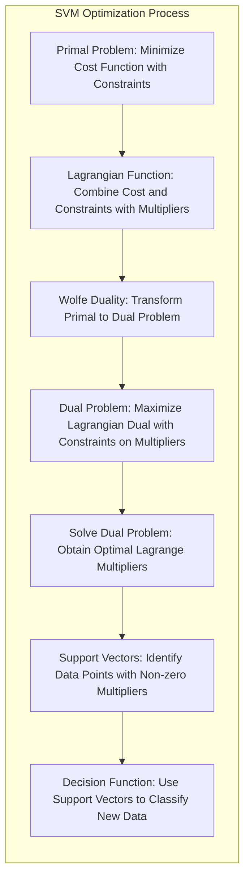
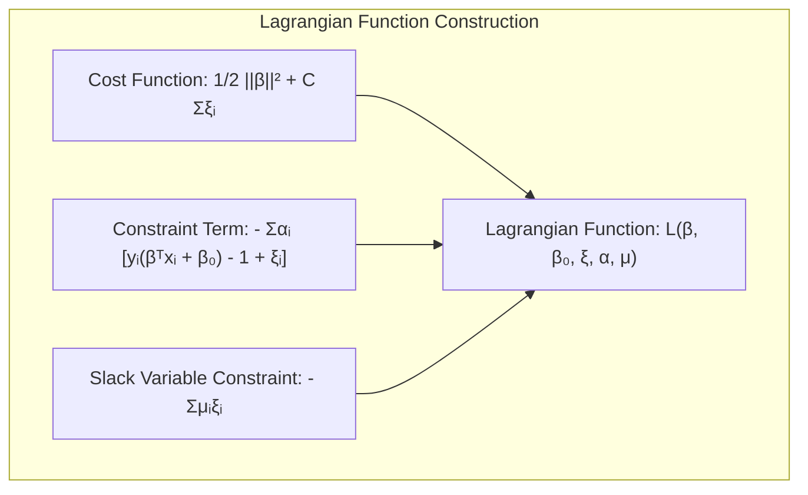
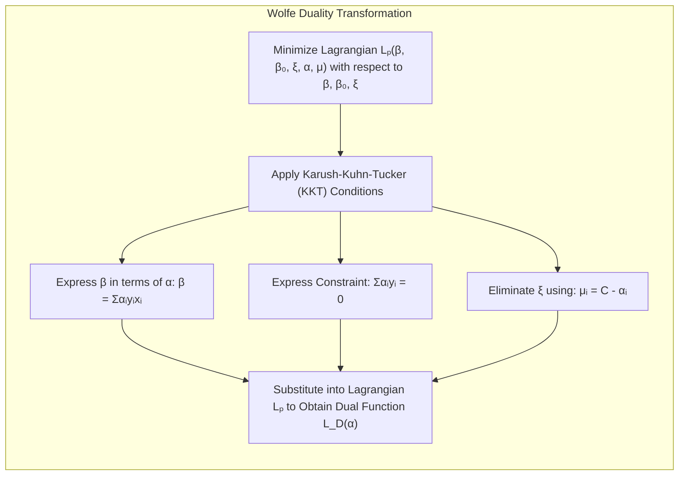
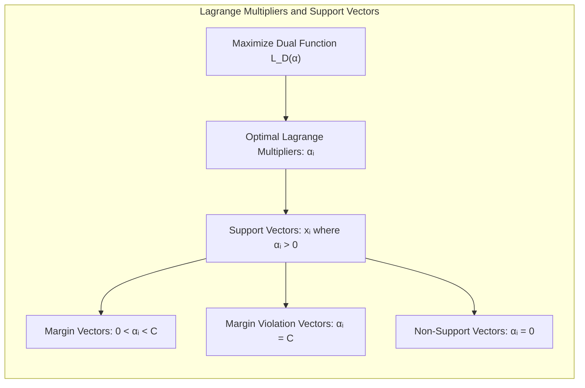
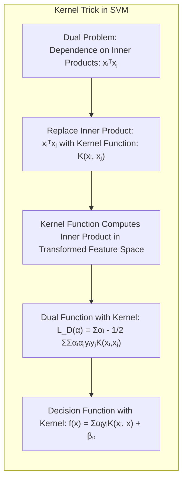

```markdown
## Título: Multiplicadores de Lagrange e a Dualidade de Wolfe em SVMs: Uma Análise Detalhada



### Introdução

No estudo das **Support Vector Machines (SVMs)**, a técnica de **dualidade de Wolfe** e o uso de **multiplicadores de Lagrange** são ferramentas essenciais para a compreensão da formulação matemática e do processo de otimização. A dualidade de Wolfe permite transformar o problema primal das SVMs, que é definido no espaço dos parâmetros do modelo, em um problema dual, definido no espaço dos multiplicadores de Lagrange, o que simplifica a obtenção da solução ótima e revela propriedades importantes dos modelos SVM [^12.2].

Os multiplicadores de Lagrange são variáveis auxiliares que são introduzidas para lidar com as restrições de desigualdade do problema primal. Ao transformar o problema primal em um problema dual, os multiplicadores de Lagrange se tornam as variáveis principais, e a função objetivo do problema dual é formulada em termos desses multiplicadores, juntamente com os produtos internos entre os dados de treinamento.

Neste capítulo, exploraremos em detalhe a formulação matemática da dualidade de Wolfe e o papel dos multiplicadores de Lagrange nas SVMs. Analisaremos a transformação do problema primal para o problema dual, as condições de otimalidade e como a solução do problema dual nos leva aos parâmetros ótimos do modelo. Além disso, discutiremos como a dualidade de Wolfe revela a importância dos vetores de suporte e como essa abordagem permite a utilização de *kernels* para construir fronteiras de decisão não lineares.

### O Problema Primal e a Função Lagrangiana

**Conceito 1: Formulação do Problema Primal**

O problema primal das SVMs, para o caso não separável, busca minimizar a seguinte função de custo:

$$ \min_{\beta, \beta_0, \xi} \frac{1}{2} ||\beta||^2 + C \sum_{i=1}^{N} \xi_i $$

sujeito a:

$$ y_i(\beta^T x_i + \beta_0) \geq 1 - \xi_i, \quad \forall i $$
$$ \xi_i \geq 0, \quad \forall i $$

onde $\beta$ é o vetor normal ao hiperplano, $\beta_0$ é o *bias*, $x_i$ são as amostras de treinamento, $y_i \in \{-1, 1\}$ são os rótulos das classes, $\xi_i$ são as variáveis de folga, e $C$ é o parâmetro de regularização.

> 💡 **Exemplo Numérico:**
>
> Imagine que temos um conjunto de dados com duas classes, onde $x_i$ são pontos bidimensionais. Vamos supor que temos três pontos de treinamento: $x_1 = (1, 1)$ com $y_1 = 1$, $x_2 = (2, 0)$ com $y_2 = -1$ e $x_3 = (0, 2)$ com $y_3 = 1$. O problema primal busca encontrar $\beta$, $\beta_0$ e $\xi_i$ que minimizem a função de custo, respeitando as restrições. Se definirmos $C = 1$, a função a ser minimizada é $\frac{1}{2} ||\beta||^2 + \sum_{i=1}^{3} \xi_i$ e teremos as seguintes restrições:
>
> $1(\beta^T (1, 1) + \beta_0) \geq 1 - \xi_1$
>
> $-1(\beta^T (2, 0) + \beta_0) \geq 1 - \xi_2$
>
> $1(\beta^T (0, 2) + \beta_0) \geq 1 - \xi_3$
>
> $\xi_1 \geq 0, \xi_2 \geq 0, \xi_3 \geq 0$.
>
> O objetivo é encontrar os valores de $\beta$, $\beta_0$ e $\xi_i$ que satisfaçam essas condições e minimizem a função de custo.

**Lemma 1:** O problema primal das SVMs é um problema de otimização convexo, caracterizado pela busca do hiperplano que maximiza a margem, tolerando erros de classificação através das variáveis de folga.

A demonstração desse lemma se baseia na análise da função de custo e das restrições, que são convexas. A convexidade do problema primal garante que a solução encontrada seja um mínimo global único.

**Conceito 2: Construção da Função Lagrangiana**

Para lidar com as restrições de desigualdade do problema primal, construímos a **função Lagrangiana**, introduzindo os **multiplicadores de Lagrange** $\alpha_i$ e $\mu_i$:



$$ L_p(\beta, \beta_0, \xi, \alpha, \mu) = \frac{1}{2} ||\beta||^2 + C \sum_{i=1}^{N} \xi_i - \sum_{i=1}^{N} \alpha_i [y_i(\beta^T x_i + \beta_0) - 1 + \xi_i] - \sum_{i=1}^{N} \mu_i \xi_i $$

onde $\alpha_i \geq 0$ e $\mu_i \geq 0$ são os multiplicadores de Lagrange associados às restrições de desigualdade.

A função Lagrangiana combina a função de custo com as restrições, através da introdução dos multiplicadores de Lagrange. Os multiplicadores $\alpha_i$ são associados à restrição de que os pontos devem estar corretamente classificados ou dentro da margem, e os multiplicadores $\mu_i$ são associados à restrição de não negatividade das variáveis de folga.

> 💡 **Exemplo Numérico:**
>
> Usando o exemplo anterior com $C=1$ e os pontos $x_1 = (1, 1)$, $x_2 = (2, 0)$, e $x_3 = (0, 2)$, a função Lagrangiana seria:
>
> $L_p(\beta, \beta_0, \xi, \alpha, \mu) = \frac{1}{2} ||\beta||^2 + \xi_1 + \xi_2 + \xi_3 - \alpha_1[1(\beta^T (1, 1) + \beta_0) - 1 + \xi_1] - \alpha_2[-1(\beta^T (2, 0) + \beta_0) - 1 + \xi_2] - \alpha_3[1(\beta^T (0, 2) + \beta_0) - 1 + \xi_3] - \mu_1 \xi_1 - \mu_2 \xi_2 - \mu_3 \xi_3$
>
> Onde $\alpha_i \geq 0$ e $\mu_i \geq 0$. Esta função combina a função de custo com as restrições através dos multiplicadores de Lagrange.

**Corolário 1:** A função Lagrangiana incorpora as restrições do problema primal na função objetivo, o que permite transformar o problema de otimização restrito em um problema de otimização irrestrito.

A demonstração desse corolário se baseia na análise da construção da função Lagrangiana, onde as restrições do problema primal são adicionadas à função objetivo através da introdução dos multiplicadores de Lagrange. Essa abordagem permite encontrar uma solução para o problema de otimização restrito através da minimização (ou maximização) da função Lagrangeana, o que é, muitas vezes, mais simples do que resolver o problema primal diretamente.

### A Dualidade de Wolfe e a Obtenção do Problema Dual



A **dualidade de Wolfe** é uma técnica de otimização que permite transformar um problema de otimização primal em um problema dual. Essa transformação é particularmente útil para as SVMs, pois ela leva a um problema de otimização que depende apenas dos produtos internos entre os dados de treinamento, e os multiplicadores de Lagrange, que levam aos conceitos de vetores de suporte e possibilitam a utilização dos kernels.

Para obter o problema dual, minimizamos a função Lagrangiana $L_p(\beta, \beta_0, \xi, \alpha, \mu)$ em relação aos parâmetros primais $\beta$, $\beta_0$ e $\xi_i$, o que resulta nas seguintes condições de otimalidade:

1.  $\frac{\partial L_p}{\partial \beta} = \beta - \sum_{i=1}^{N} \alpha_i y_i x_i = 0 \implies \beta = \sum_{i=1}^{N} \alpha_i y_i x_i$
2.  $\frac{\partial L_p}{\partial \beta_0} = - \sum_{i=1}^{N} \alpha_i y_i = 0 \implies \sum_{i=1}^{N} \alpha_i y_i = 0$
3.  $\frac{\partial L_p}{\partial \xi_i} = C - \alpha_i - \mu_i = 0 \implies \mu_i = C - \alpha_i$

Substituindo essas expressões na função Lagrangiana e utilizando a restrição $\sum_{i=1}^{N} \alpha_i y_i = 0$, obtemos a função dual $L_D(\alpha)$:

$$ L_D(\alpha) = \sum_{i=1}^{N} \alpha_i - \frac{1}{2} \sum_{i=1}^{N} \sum_{j=1}^{N} \alpha_i \alpha_j y_i y_j x_i^T x_j $$

O problema dual da SVM é então:

$$ \max_{\alpha} L_D(\alpha) = \sum_{i=1}^{N} \alpha_i - \frac{1}{2} \sum_{i=1}^{N} \sum_{j=1}^{N} \alpha_i \alpha_j y_i y_j x_i^T x_j $$

sujeito a:

$$ 0 \leq \alpha_i \leq C, \quad \forall i $$
$$ \sum_{i=1}^{N} \alpha_i y_i = 0 $$

O problema dual consiste em maximizar a função dual $L_D(\alpha)$ em relação aos multiplicadores de Lagrange $\alpha_i$, sujeitos às restrições $0 \leq \alpha_i \leq C$ e $\sum_{i=1}^{N} \alpha_i y_i = 0$.

> 💡 **Exemplo Numérico:**
>
> Vamos calcular o problema dual para os três pontos do exemplo anterior. Primeiro, calculamos os produtos internos:
>
> $x_1^T x_1 = (1,1)^T (1,1) = 2$
>
> $x_1^T x_2 = (1,1)^T (2,0) = 2$
>
> $x_1^T x_3 = (1,1)^T (0,2) = 2$
>
> $x_2^T x_1 = (2,0)^T (1,1) = 2$
>
> $x_2^T x_2 = (2,0)^T (2,0) = 4$
>
> $x_2^T x_3 = (2,0)^T (0,2) = 0$
>
> $x_3^T x_1 = (0,2)^T (1,1) = 2$
>
> $x_3^T x_2 = (0,2)^T (2,0) = 0$
>
> $x_3^T x_3 = (0,2)^T (0,2) = 4$
>
> A função dual se torna:
>
> $L_D(\alpha) = \alpha_1 + \alpha_2 + \alpha_3 - \frac{1}{2} [\alpha_1^2(1)(1)(2) + \alpha_1\alpha_2(1)(-1)(2) + \alpha_1\alpha_3(1)(1)(2) + \alpha_2\alpha_1(-1)(1)(2) + \alpha_2^2(-1)(-1)(4) + \alpha_2\alpha_3(-1)(1)(0) + \alpha_3\alpha_1(1)(1)(2) + \alpha_3\alpha_2(1)(-1)(0) + \alpha_3^2(1)(1)(4)]$
>
> $L_D(\alpha) = \alpha_1 + \alpha_2 + \alpha_3 - [\alpha_1^2 - 2\alpha_1\alpha_2 + 2\alpha_1\alpha_3 + 2\alpha_2^2 + 2\alpha_3^2]$
>
> O problema dual é maximizar $L_D(\alpha)$ sujeito a $0 \leq \alpha_i \leq 1$ e $\alpha_1 - \alpha_2 + \alpha_3 = 0$.

**Lemma 2:** A dualidade de Wolfe transforma o problema primal das SVMs em um problema dual que depende apenas dos multiplicadores de Lagrange e dos produtos internos entre os dados de treinamento.

A demonstração desse lemma se baseia na análise da derivação do problema dual, onde as variáveis primais $\beta$, $\beta_0$ e $\xi_i$ são eliminadas e a função objetivo do problema dual depende apenas dos multiplicadores de Lagrange e dos produtos internos $x_i^T x_j$.

### Interpretação dos Multiplicadores de Lagrange e Vetores de Suporte



A solução do problema dual das SVMs, obtida através da maximização da função dual $L_D(\alpha)$, nos fornece os valores ótimos dos multiplicadores de Lagrange $\alpha_i$. Esses multiplicadores têm uma interpretação geométrica importante e estão relacionados com o conceito de **vetores de suporte**.

Os **vetores de suporte** são as amostras de treinamento que têm multiplicadores de Lagrange $\alpha_i > 0$ na solução ótima. São esses pontos que determinam a posição e orientação do hiperplano separador ótimo e, portanto, são os pontos de treinamento mais importantes para o modelo.

*   Se $0 < \alpha_i < C$, a amostra $x_i$ é um vetor de suporte que está exatamente sobre a margem.
*   Se $\alpha_i = C$, a amostra $x_i$ é um vetor de suporte que viola a margem, ou seja, está dentro ou do lado errado da margem.
*   Se $\alpha_i = 0$, a amostra $x_i$ não é um vetor de suporte e está corretamente classificada e fora da margem.

A condição $\sum_{i=1}^{N} \alpha_i y_i = 0$ garante que os vetores de suporte das duas classes se equilibram, o que é fundamental para a construção de um hiperplano de decisão ótimo.

A relação entre os multiplicadores de Lagrange, os vetores de suporte e a margem é crucial para o entendimento da formulação da SVM. A função de decisão da SVM pode ser escrita como:

$$ f(x) = \sum_{i \in SV} \alpha_i y_i x_i^T x + \beta_0 $$

onde SV é o conjunto de vetores de suporte. Essa equação demonstra que a decisão da SVM depende apenas dos produtos internos entre a amostra a ser classificada e os vetores de suporte, o que possibilita o uso de *kernels* para construir fronteiras de decisão não lineares.

> 💡 **Exemplo Numérico:**
>
> Suponha que, ao resolver o problema dual para nossos três pontos, obtivemos os seguintes multiplicadores de Lagrange: $\alpha_1 = 0.3$, $\alpha_2 = 0.7$, e $\alpha_3 = 0.4$. Como todos são maiores que 0, os três pontos são vetores de suporte. O vetor $\beta$ pode ser calculado como:
>
> $\beta = \sum_{i=1}^{3} \alpha_i y_i x_i = 0.3(1)(1,1) + 0.7(-1)(2,0) + 0.4(1)(0,2) = (0.3, 0.3) + (-1.4, 0) + (0, 0.8) = (-1.1, 1.1)$.
>
> Note que a condição $\sum_{i=1}^{3} \alpha_i y_i = 0.3 - 0.7 + 0.4 = 0$ é satisfeita.
>
> Se tivéssemos um novo ponto, $x = (1, 0)$, a classificação seria dada por:
>
> $f(x) = \sum_{i \in SV} \alpha_i y_i x_i^T x + \beta_0 = 0.3(1)(1,1)^T (1,0) + 0.7(-1)(2,0)^T (1,0) + 0.4(1)(0,2)^T(1,0) + \beta_0$
>
> $f(x) = 0.3(1) - 0.7(2) + 0.4(0) + \beta_0 = 0.3 - 1.4 + \beta_0 = -1.1 + \beta_0$.
>
> Para classificar $x$, precisamos calcular $\beta_0$. Normalmente, isso é feito usando as condições KKT e os vetores de suporte. O sinal de $f(x)$ determina a classe.

**Lemma 3:** Os vetores de suporte são as amostras de treinamento que têm multiplicadores de Lagrange $\alpha_i > 0$ na solução do problema dual, e são esses pontos que determinam a posição e orientação do hiperplano separador ótimo.

A demonstração desse lemma se baseia na análise das condições de Karush-Kuhn-Tucker (KKT) e na função dual. Os multiplicadores de Lagrange $\alpha_i$ são diferentes de zero apenas para as amostras que estão sobre ou dentro da margem, ou seja, os vetores de suporte.

### A Dualidade de Wolfe e a Utilização de Kernels



A dualidade de Wolfe revela uma propriedade fundamental das SVMs, que é a dependência dos dados de treinamento apenas através de produtos internos. Essa propriedade permite a utilização do "**kernel trick**", onde o produto interno $x_i^T x_j$ é substituído por uma função *kernel* $K(x_i, x_j)$, que calcula o produto interno em um espaço de *features* de maior dimensão, sem explicitar a transformação.

A função dual das SVMs, com a substituição do produto interno pelo *kernel*, se torna:

$$ L_D(\alpha) = \sum_{i=1}^{N} \alpha_i - \frac{1}{2} \sum_{i=1}^{N} \sum_{j=1}^{N} \alpha_i \alpha_j y_i y_j K(x_i, x_j) $$

A função de decisão da SVM, também com a utilização do *kernel*, se torna:

$$ f(x) = \sum_{i \in SV} \alpha_i y_i K(x_i, x) + \beta_0 $$

Essa propriedade é fundamental para a capacidade das SVMs de lidar com problemas de classificação não lineares. A escolha do *kernel* apropriado permite que as SVMs construam fronteiras de decisão complexas em espaços de *features* de alta dimensão.

> 💡 **Exemplo Numérico:**
>
> Suponha que, em vez de usar o produto interno, optamos por usar um *kernel* polinomial de grau 2, definido como $K(x_i, x_j) = (x_i^T x_j + 1)^2$. Usando os mesmos dados $x_1 = (1,1)$, $x_2 = (2,0)$ e $x_3 = (0,2)$, podemos calcular os valores do kernel:
>
> $K(x_1, x_1) = (2 + 1)^2 = 9$
>
> $K(x_1, x_2) = (2 + 1)^2 = 9$
>
> $K(x_1, x_3) = (2 + 1)^2 = 9$
>
> $K(x_2, x_1) = (2 + 1)^2 = 9$
>
> $K(x_2, x_2) = (4 + 1)^2 = 25$
>
> $K(x_2, x_3) = (0 + 1)^2 = 1$
>
> $K(x_3, x_1) = (2 + 1)^2 = 9$
>
> $K(x_3, x_2) = (0 + 1)^2 = 1$
>
> $K(x_3, x_3) = (4 + 1)^2 = 25$
>
> A função dual com o *kernel* se torna:
>
> $L_D(\alpha) = \alpha_1 + \alpha_2 + \alpha_3 - \frac{1}{2} [\alpha_1^2(1)(1)(9) + \alpha_1\alpha_2(1)(-1)(9) + \alpha_1\alpha_3(1)(1)(9) + \alpha_2\alpha_1(-1)(1)(9) + \alpha_2^2(-1)(-1)(25) + \alpha_2\alpha_3(-1)(1)(1) + \alpha_3\alpha_1(1)(1)(9) + \alpha_3\alpha_2(1)(-1)(1) + \alpha_3^2(1)(1)(25)]$
>
> $L_D(\alpha) = \alpha_1 + \alpha_2 + \alpha_3 - \frac{1}{2} [9\alpha_1^2 - 18\alpha_1\alpha_2 + 18\alpha_1\alpha_3 + 25\alpha_2^2 - 2\alpha_2\alpha_3 + 25\alpha_3^2]$
>
> O problema dual é maximizar $L_D(\alpha)$ sujeito a $0 \leq \alpha_i \leq 1$ e $\alpha_1 - \alpha_2 + \alpha_3 = 0$. Note como o uso do kernel modifica a função dual.

**Corolário 3:** A dualidade de Wolfe permite que as SVMs utilizem o *kernel trick*, que possibilita trabalhar em espaços de *features* de alta dimensão sem calcular explicitamente a transformação, e construir fronteiras de decisão não lineares.

A demonstração desse corolário se baseia na análise da função dual e da função de decisão da SVM, onde a única dependência dos dados $x_i$ é através da função *kernel* $K(x_i, x_j)$. A dualidade de Wolfe transforma a otimização que seria realizada em um espaço de features de alta dimensão em uma otimização no espaço dos parâmetros duais, e permite o uso de kernels sem explicitar o mapeamento para esse espaço.

### Conclusão

Neste capítulo, exploramos em detalhes a utilização de **multiplicadores de Lagrange** e a **dualidade de Wolfe** nas **Support Vector Machines (SVMs)**. Vimos como a dualidade de Wolfe transforma o problema primal, definido no espaço dos parâmetros do modelo, em um problema dual, definido no espaço dos multiplicadores de Lagrange, o que simplifica a obtenção da solução ótima.

Analisamos o papel fundamental dos multiplicadores de Lagrange e como eles se relacionam com o conceito de **vetores de suporte**. Os vetores de suporte são os pontos de treinamento mais importantes para o modelo, e são eles que definem a posição e orientação do hiperplano de decisão. Discutimos também como a dualidade de Wolfe permite o uso do *kernel trick*, que possibilita trabalhar em espaços de *features* de alta dimensão e construir fronteiras de decisão não lineares.

A compreensão da dualidade de Wolfe e dos multiplicadores de Lagrange é essencial para uma compreensão profunda das SVMs. Esses conceitos são fundamentais para a construção de modelos robustos e eficientes para problemas complexos de classificação e regressão. A capacidade de trabalhar com *kernels*, que é resultado da dualidade de Wolfe, e a interpretação dos vetores de suporte como os pontos de treinamento mais relevantes são algumas das características que tornam as SVMs uma ferramenta poderosa no aprendizado de máquina.

### Footnotes

[^12.1]: "In this chapter we describe generalizations of linear decision boundaries for classification. Optimal separating hyperplanes are introduced in Chapter 4 for the case when two classes are linearly separable. Here we cover extensions to the nonseparable case, where the classes overlap. These techniques are then generalized to what is known as the support vector machine, which produces nonlinear boundaries by constructing a linear boundary in a large, transformed version of the feature space."

[^12.2]: "In Chapter 4 we discussed a technique for constructing an optimal separating hyperplane between two perfectly separated classes. We review this and generalize to the nonseparable case, where the classes may not be separable by a linear boundary."
```