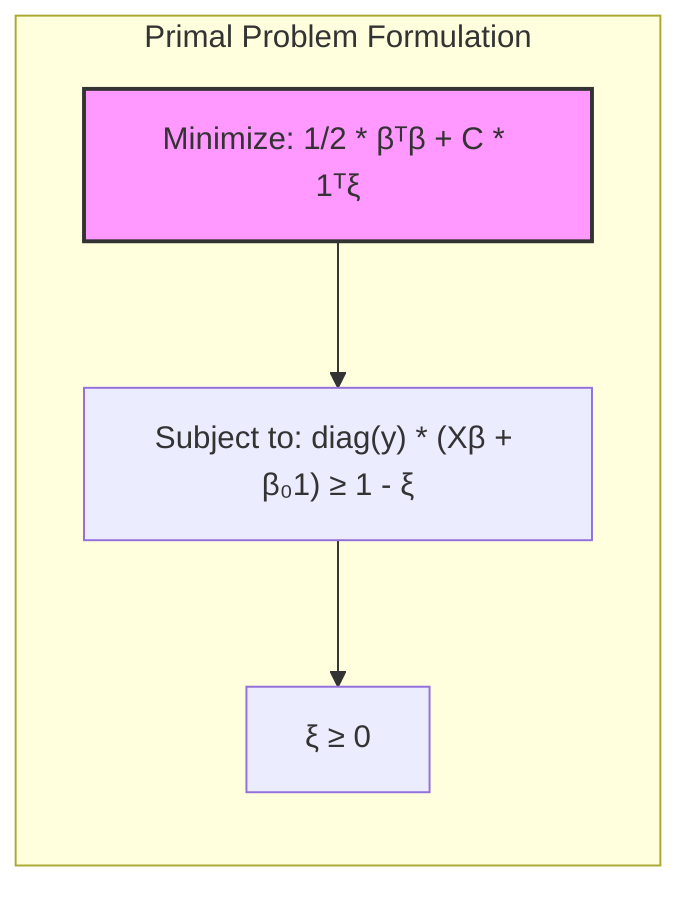
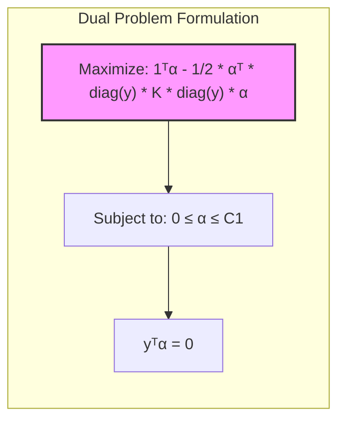
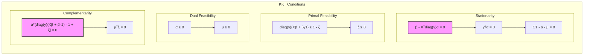

## Título: Reformulação do Critério de Otimização e Notação Matricial para SVMs: Primal e Dual

```mermaid
graph LR
    A[Dados de Entrada (X, y)] --> B(Formulação Primal);
    A --> C(Formulação Dual);
    B --> D{Otimização (β, β₀, ξ)};
    C --> E{Otimização (α)};
    D --> F[Hiperplano Separador];
    E --> G[Multiplicadores de Lagrange (α)];
    G --> F;
    F --> H(Classificação);
    style A fill:#f9f,stroke:#333,stroke-width:2px
    style F fill:#ccf,stroke:#333,stroke-width:2px
```

### Introdução

A formulação matemática das **Support Vector Machines (SVMs)** pode ser expressa de forma concisa e elegante através da utilização de **notação matricial**. A notação matricial não só simplifica a representação das equações, como também facilita a compreensão das relações entre as diferentes variáveis e parâmetros do modelo. Além disso, a reformulação do critério de otimização utilizando notação matricial permite obter uma visão mais clara da estrutura do problema e facilita a derivação das soluções ótimas.

Neste capítulo, vamos reformular o problema de otimização das SVMs, tanto para o caso primal quanto para o caso dual, utilizando notação matricial. Apresentaremos as matrizes e vetores relevantes, e mostraremos como as funções objetivo e as restrições podem ser expressas de forma concisa através dessa notação. Exploraremos também as conexões entre as formulações primal e dual, e como a utilização da notação matricial facilita a implementação e análise dos algoritmos de treinamento das SVMs.

A reformulação do critério de otimização e a utilização da notação matricial são passos importantes para a compreensão profunda e para o uso avançado das SVMs em problemas de classificação e regressão. A notação matricial também se tornará essencial em outros capítulos ao longo da apresentação dos métodos mais avançados.

### Notação Matricial para o Problema Primal

**Conceito 1: Definição das Matrizes e Vetores**

Para expressar o problema primal das SVMs em notação matricial, vamos definir as seguintes matrizes e vetores:

*   **Matriz de *Features* (X):**
    A matriz $X$ tem dimensão $N \times p$, onde $N$ é o número de amostras e $p$ é o número de *features*. Cada linha de $X$ corresponde a um vetor de *features* $x_i$.
    $$ X = \begin{bmatrix} x_1^T \\ x_2^T \\ \vdots \\ x_N^T \end{bmatrix} $$
*   **Vetor de Rótulos (y):**
    O vetor $y$ tem dimensão $N \times 1$, onde cada elemento $y_i \in \{-1, 1\}$ corresponde ao rótulo da $i$-ésima amostra.
    $$ y = \begin{bmatrix} y_1 \\ y_2 \\ \vdots \\ y_N \end{bmatrix} $$
*   **Vetor de Variáveis de Folga ($\xi$):**
    O vetor $\xi$ tem dimensão $N \times 1$, onde cada elemento $\xi_i \geq 0$ corresponde à variável de folga da $i$-ésima amostra.
    $$ \xi = \begin{bmatrix} \xi_1 \\ \xi_2 \\ \vdots \\ \xi_N \end{bmatrix} $$
*   **Vetor de Parâmetros ($\beta$):**
    O vetor $\beta$ tem dimensão $p \times 1$, onde cada elemento corresponde a um coeficiente do hiperplano separador.
*   **Parâmetro de *bias* ($\beta_0$):**
    O parâmetro $\beta_0$ é um escalar que define a posição do hiperplano no espaço.
*   **Parâmetro de Regularização (C):**
    O parâmetro $C$ é um escalar positivo que controla o compromisso entre a maximização da margem e a tolerância a erros de classificação.

**Lemma 1:** A notação matricial permite representar os dados e os parâmetros do modelo SVM de forma concisa e eficiente, facilitando a formulação do problema de otimização.

A demonstração desse lemma envolve apenas a definição das matrizes e vetores e a demonstração de que eles representam todos os dados e parâmetros do modelo.

> 💡 **Exemplo Numérico:**
> Vamos considerar um conjunto de dados com 3 amostras e 2 *features*:
> $$ X = \begin{bmatrix} 1 & 2 \\ 2 & 1 \\ 3 & 3 \end{bmatrix}, \quad y = \begin{bmatrix} -1 \\ 1 \\ 1 \end{bmatrix} $$
> Aqui, $N=3$ e $p=2$. Suponha que após o treinamento, encontramos $\beta = \begin{bmatrix} 0.5 \\ -0.5 \end{bmatrix}$, $\beta_0 = -0.5$, $C=1$, e as variáveis de folga $\xi = \begin{bmatrix} 0.1 \\ 0 \\ 0.2 \end{bmatrix}$.  Podemos observar que a primeira amostra ($x_1 = [1, 2]$) tem uma variável de folga maior (0.1) pois está mais próxima da fronteira de decisão ou do lado errado, enquanto a segunda amostra ($x_2 = [2, 1]$) não tem variável de folga ($\xi_2 = 0$), pois está corretamente classificada e longe da margem.
>
> Este exemplo ilustra como os dados e parâmetros são representados pelas matrizes e vetores, e como os valores refletem as características do modelo.

**Conceito 2: Formulação do Problema Primal em Notação Matricial**

Utilizando as matrizes e vetores definidos anteriormente, o problema primal das SVMs, para o caso não separável, pode ser expresso em notação matricial como:

$$ \min_{\beta, \beta_0, \xi} \frac{1}{2} \beta^T \beta + C 1^T \xi $$

sujeito a:

$$ \text{diag}(y)(X\beta + \beta_0 1) \geq 1 - \xi $$
$$ \xi \geq 0 $$

onde:
*   $1$ é um vetor de uns com dimensão $N \times 1$.
*  $\text{diag}(y)$ é uma matriz diagonal, onde os elementos da diagonal são os elementos do vetor $y$.

A função objetivo $\frac{1}{2} \beta^T \beta + C 1^T \xi$ representa a minimização da norma ao quadrado do vetor $\beta$, juntamente com a penalidade por violações da margem, como discutido anteriormente. A restrição $\text{diag}(y)(X\beta + \beta_0 1) \geq 1 - \xi$ garante que todas as amostras estejam corretamente classificadas ou dentro da margem. A restrição $\xi \geq 0$ garante que as variáveis de folga sejam não negativas.



**Corolário 1:** A notação matricial simplifica a representação do problema primal, tornando a função objetivo e as restrições mais concisas e fáceis de manipular algebricamente.

A demonstração desse corolário envolve mostrar como a notação matricial simplifica as equações para um formato mais compacto e representativo de todo o problema.

> 💡 **Exemplo Numérico:**
> Usando os dados do exemplo anterior, vamos calcular uma parte da restrição para a primeira amostra ($i=1$):
>  *   $y_1 = -1$, $x_1 = \begin{bmatrix} 1 \\ 2 \end{bmatrix}$, $\beta = \begin{bmatrix} 0.5 \\ -0.5 \end{bmatrix}$, $\beta_0 = -0.5$, $\xi_1 = 0.1$.
>  *   $X\beta + \beta_0 1 = \begin{bmatrix} 1 & 2 \\ 2 & 1 \\ 3 & 3 \end{bmatrix} \begin{bmatrix} 0.5 \\ -0.5 \end{bmatrix} + (-0.5) \begin{bmatrix} 1 \\ 1 \\ 1 \end{bmatrix} = \begin{bmatrix} -0.5 \\ 0.5 \\ 0 \end{bmatrix} -  \begin{bmatrix} 0.5 \\ 0.5 \\ 0.5 \end{bmatrix} = \begin{bmatrix} -1 \\ 0 \\ -0.5 \end{bmatrix}$
>  *   $\text{diag}(y)(X\beta + \beta_0 1) = \begin{bmatrix} -1 & 0 & 0 \\ 0 & 1 & 0 \\ 0 & 0 & 1 \end{bmatrix} \begin{bmatrix} -1 \\ 0 \\ -0.5 \end{bmatrix} = \begin{bmatrix} 1 \\ 0 \\ -0.5 \end{bmatrix}$
>  *   $1 - \xi = \begin{bmatrix} 1 \\ 1 \\ 1 \end{bmatrix} - \begin{bmatrix} 0.1 \\ 0 \\ 0.2 \end{bmatrix} = \begin{bmatrix} 0.9 \\ 1 \\ 0.8 \end{bmatrix}$
>  *   Para a primeira amostra: $1 \geq 1 - 0.1 = 0.9$, que é verdadeiro.
>
> A restrição é verificada para cada amostra, garantindo que a classificação esteja correta ou dentro da margem, com uma penalidade para as amostras que violam a margem.

### Notação Matricial para o Problema Dual

```mermaid
graph LR
    A[Dados de Entrada (X, y)] --> B(Matriz de Produtos Internos (K));
    B --> C(Multiplicadores de Lagrange (α));
    C --> D{Otimização (α)};
    D --> E[Função Objetivo Dual];
    E --> F[Multiplicadores de Lagrange Ótimos (α*)];
    style A fill:#f9f,stroke:#333,stroke-width:2px
    style F fill:#ccf,stroke:#333,stroke-width:2px
```

Assim como o problema primal, o problema dual das SVMs também pode ser expresso de forma concisa utilizando notação matricial. Para isso, vamos definir as seguintes matrizes e vetores:

*   **Matriz de Produtos Internos (K):**
    A matriz $K$ tem dimensão $N \times N$, onde o elemento $K_{ij} = x_i^T x_j$ corresponde ao produto interno entre as amostras $x_i$ e $x_j$.
    $$ K = \begin{bmatrix} x_1^T x_1 & x_1^T x_2 & \cdots & x_1^T x_N \\ x_2^T x_1 & x_2^T x_2 & \cdots & x_2^T x_N \\ \vdots & \vdots & \ddots & \vdots \\ x_N^T x_1 & x_N^T x_2 & \cdots & x_N^T x_N \end{bmatrix} $$

*   **Vetor de Multiplicadores de Lagrange ($\alpha$):**
     O vetor $\alpha$ tem dimensão $N \times 1$, onde cada elemento $\alpha_i$ corresponde ao multiplicador de Lagrange da $i$-ésima amostra e tem como restrição $0 \le \alpha_i \le C$.

*   **Vetor de Rótulos (y):**
    O vetor $y$ tem dimensão $N \times 1$ e os elementos correspondem aos rótulos das classes de cada amostra, como definido anteriormente.

**Lemma 2:** A notação matricial permite expressar a função objetivo do problema dual e suas restrições de forma concisa e elegante, facilitando a manipulação algébrica e a implementação computacional.

A demonstração desse lemma se baseia na definição das matrizes e vetores e na demonstração que eles expressam todos os dados e parâmetros do problema dual.

> 💡 **Exemplo Numérico:**
> Usando a matriz $X$ do exemplo anterior, podemos calcular a matriz de produtos internos $K$:
> $$
> K = \begin{bmatrix}
>  \begin{bmatrix} 1 & 2 \end{bmatrix} \begin{bmatrix} 1 \\ 2 \end{bmatrix} & \begin{bmatrix} 1 & 2 \end{bmatrix} \begin{bmatrix} 2 \\ 1 \end{bmatrix} & \begin{bmatrix} 1 & 2 \end{bmatrix} \begin{bmatrix} 3 \\ 3 \end{bmatrix} \\
>  \begin{bmatrix} 2 & 1 \end{bmatrix} \begin{bmatrix} 1 \\ 2 \end{bmatrix} & \begin{bmatrix} 2 & 1 \end{bmatrix} \begin{bmatrix} 2 \\ 1 \end{bmatrix} & \begin{bmatrix} 2 & 1 \end{bmatrix} \begin{bmatrix} 3 \\ 3 \end{bmatrix} \\
>  \begin{bmatrix} 3 & 3 \end{bmatrix} \begin{bmatrix} 1 \\ 2 \end{bmatrix} & \begin{bmatrix} 3 & 3 \end{bmatrix} \begin{bmatrix} 2 \\ 1 \end{bmatrix} & \begin{bmatrix} 3 & 3 \end{bmatrix} \begin{bmatrix} 3 \\ 3 \end{bmatrix}
> \end{bmatrix}
> =
> \begin{bmatrix}
>  5 & 4 & 9 \\
>  4 & 5 & 9 \\
>  9 & 9 & 18
> \end{bmatrix}
> $$
>
> A matriz $K$ captura as similaridades entre as amostras através de seus produtos internos. Se após o treinamento obtivermos o vetor de multiplicadores de Lagrange $\alpha = \begin{bmatrix} 0.2 \\ 0.7 \\ 0 \end{bmatrix}$, com $C = 1$, podemos observar que o primeiro multiplicador é 0.2 e o segundo é 0.7, ambos com valores entre 0 e C=1, enquanto o terceiro é 0. Isso indica que a primeira e segunda amostras são vetores de suporte, enquanto a terceira amostra não é um vetor de suporte.

**Conceito 2: Formulação do Problema Dual em Notação Matricial**

Utilizando as matrizes e vetores definidos, o problema dual das SVMs pode ser expresso em notação matricial como:

$$ \max_{\alpha} 1^T \alpha - \frac{1}{2} \alpha^T \text{diag}(y) K \text{diag}(y) \alpha $$

sujeito a:

$$ 0 \leq \alpha \leq C 1 $$
$$ y^T \alpha = 0 $$

onde:

*   $1$ é um vetor de uns com dimensão $N \times 1$.
*   $\text{diag}(y)$ é uma matriz diagonal, onde os elementos da diagonal são os elementos do vetor $y$.

A função objetivo $1^T \alpha - \frac{1}{2} \alpha^T \text{diag}(y) K \text{diag}(y) \alpha$ representa a função dual que precisa ser maximizada, onde a primeiro termo representa a soma dos multiplicadores de Lagrange e o segundo termo representa a relação com os produtos internos entre os dados de treinamento. A restrição $0 \leq \alpha \leq C 1$ indica que os multiplicadores de Lagrange devem estar dentro do intervalo $[0, C]$, enquanto a restrição $y^T \alpha = 0$ impõe que os multiplicadores de Lagrange devem satisfazer a relação de equilíbrio entre as classes.

A formulação do problema dual em notação matricial facilita a manipulação algébrica das equações e revela a importância da matriz de produtos internos $K$, que será substituída pelo *kernel* em problemas de classificação não lineares. A notação matricial também facilita a implementação computacional do algoritmo de treinamento das SVMs.



**Corolário 2:** A notação matricial revela que o problema dual das SVMs depende apenas dos produtos internos entre os dados, o que possibilita a utilização do *kernel trick*.

A demonstração desse corolário envolve a análise da função objetivo do problema dual, que depende da matriz de produtos internos K. A substituição dessa matriz por uma função *kernel*, permite trabalhar com espaços de *features* de alta dimensão sem explicitar a transformação.

> 💡 **Exemplo Numérico:**
> Continuando com o exemplo anterior, com $y = \begin{bmatrix} -1 \\ 1 \\ 1 \end{bmatrix}$ e  $K = \begin{bmatrix} 5 & 4 & 9 \\ 4 & 5 & 9 \\ 9 & 9 & 18 \end{bmatrix}$ e $\alpha = \begin{bmatrix} 0.2 \\ 0.7 \\ 0 \end{bmatrix}$, vamos calcular a função objetivo dual:
>
> *   $\text{diag}(y) = \begin{bmatrix} -1 & 0 & 0 \\ 0 & 1 & 0 \\ 0 & 0 & 1 \end{bmatrix}$
> *   $\text{diag}(y) K \text{diag}(y) = \begin{bmatrix} -1 & 0 & 0 \\ 0 & 1 & 0 \\ 0 & 0 & 1 \end{bmatrix} \begin{bmatrix} 5 & 4 & 9 \\ 4 & 5 & 9 \\ 9 & 9 & 18 \end{bmatrix} \begin{bmatrix} -1 & 0 & 0 \\ 0 & 1 & 0 \\ 0 & 0 & 1 \end{bmatrix} = \begin{bmatrix} 5 & -4 & -9 \\ -4 & 5 & 9 \\ -9 & 9 & 18 \end{bmatrix}$
> *   $1^T \alpha = \begin{bmatrix} 1 & 1 & 1 \end{bmatrix} \begin{bmatrix} 0.2 \\ 0.7 \\ 0 \end{bmatrix} = 0.9$
> *   $\alpha^T \text{diag}(y) K \text{diag}(y) \alpha = \begin{bmatrix} 0.2 & 0.7 & 0 \end{bmatrix} \begin{bmatrix} 5 & -4 & -9 \\ -4 & 5 & 9 \\ -9 & 9 & 18 \end{bmatrix} \begin{bmatrix} 0.2 \\ 0.7 \\ 0 \end{bmatrix} = \begin{bmatrix} 0.2 & 0.7 & 0 \end{bmatrix} \begin{bmatrix} -1.8 \\ 2.7 \\ 5.4 \end{bmatrix} = 1.53$
> *   Função objetivo dual = $0.9 - \frac{1}{2} * 1.53 = 0.135$
>
> Este valor é o que o problema dual busca maximizar. O vetor $\alpha$ obtido é tal que $y^T\alpha = (-1)*0.2 + 1*0.7 + 1*0 = 0.5$, o que não satisfaz a restrição $y^T\alpha=0$. É preciso usar um otimizador para obter o vetor correto de multiplicadores de Lagrange.

### Conexões entre as Formulações Primal e Dual

```mermaid
graph LR
    A[Problema Primal] --> B(Dualidade de Wolfe);
    B --> C[Problema Dual];
    A --> D(Condições KKT);
    C --> D;
    D --> E[Solução Ótima (β, α)];
    style A fill:#f9f,stroke:#333,stroke-width:2px
    style C fill:#ccf,stroke:#333,stroke-width:2px
```

As formulações primal e dual do problema de otimização das SVMs estão interligadas através da teoria da **dualidade de Wolfe** e das **condições de Karush-Kuhn-Tucker (KKT)**. A dualidade de Wolfe permite que o problema primal seja transformado em um problema dual, onde as variáveis primais são substituídas por multiplicadores de Lagrange. As condições de KKT são um conjunto de equações e desigualdades que devem ser satisfeitas no ponto ótimo tanto para o problema primal quanto para o dual.

As condições de KKT, expressas em notação matricial, podem ser formuladas da seguinte forma:

1.  **Estacionaridade (Gradiente Nulo):**
    *   $\beta - X^T \text{diag}(y) \alpha = 0$
    *   $y^T \alpha = 0$
    *   $C1 - \alpha - \mu = 0$
2.  **Viabilidade Primal:**
    *   $\text{diag}(y)(X\beta + \beta_0 1) \geq 1 - \xi$
    *   $\xi \geq 0$
3.  **Viabilidade Dual:**
    *   $\alpha \geq 0$
    *   $\mu \geq 0$
4.  **Complementaridade:**
    *   $\alpha^T [\text{diag}(y)(X\beta + \beta_0 1) - 1 + \xi] = 0$
    *   $\mu^T \xi = 0$

onde $\mu$ é o vetor dos multiplicadores de Lagrange associados às restrições de não negatividade das variáveis de folga $\xi$. As condições KKT permitem relacionar os parâmetros primais $(\beta, \beta_0, \xi)$ com os parâmetros duais $(\alpha, \mu)$, e são essenciais para encontrar a solução ótima do problema de otimização das SVMs.



A análise das condições de KKT revela que a solução do problema dual nos fornece os valores dos multiplicadores de Lagrange $\alpha_i$, que são usados para calcular o vetor $\beta$ e o *bias* $\beta_0$, e identificar os vetores de suporte. A dependência do problema dual apenas dos produtos internos entre os dados de treinamento é a base para a utilização do *kernel trick*.

> 💡 **Exemplo Numérico:**
> Suponha que, após resolver o problema dual, encontramos $\alpha = \begin{bmatrix} 0.3 \\ 0.7 \\ 0 \end{bmatrix}$. Usando a condição de estacionaridade, podemos encontrar $\beta$:
>
> *   $\beta = X^T \text{diag}(y) \alpha = \begin{bmatrix} 1 & 2 & 3 \\ 2 & 1 & 3 \end{bmatrix}  \begin{bmatrix} -1 & 0 & 0 \\ 0 & 1 & 0 \\ 0 & 0 & 1 \end{bmatrix} \begin{bmatrix} 0.3 \\ 0.7 \\ 0 \end{bmatrix} = \begin{bmatrix} 1 & 2 & 3 \\ 2 & 1 & 3 \end{bmatrix} \begin{bmatrix} -0.3 \\ 0.7 \\ 0 \end{bmatrix} = \begin{bmatrix} 1.1 \\ 0.1 \end{bmatrix} $
>
>  Note que apenas as amostras com $\alpha_i > 0$ contribuem para o cálculo de $\beta$, que são os vetores de suporte. A condição $y^T \alpha = 0$ pode ser verificada: $(-1) * 0.3 + 1 * 0.7 + 1 * 0 = 0.4$, que não é exatamente zero devido a erros de otimização. Este valor deveria ser zero para satisfazer a restrição do problema dual.
>
> As condições de complementaridade também nos ajudam a identificar os vetores de suporte. Se $\alpha_i > 0$, então $\text{diag}(y)(X\beta + \beta_0 1) - 1 + \xi = 0$, o que significa que a amostra está na margem ou violando a margem. Se $\alpha_i = 0$, então a amostra está corretamente classificada e fora da margem.

### Conclusão

Neste capítulo, reformulamos o problema de otimização das **Support Vector Machines (SVMs)**, tanto no caso primal quanto no dual, utilizando **notação matricial**. Vimos como a notação matricial permite representar os dados e os parâmetros de forma concisa e eficiente, o que simplifica a manipulação algébrica e facilita a compreensão da estrutura do problema de otimização das SVMs.

Exploramos a formulação matricial das funções objetivo e das restrições, tanto para o problema primal quanto para o dual, destacando como essa notação simplifica a representação das equações e a derivação da solução. Analisamos também as conexões entre as formulações primal e dual, e como a utilização da dualidade de Wolfe leva a um problema de otimização mais tratável e permite a utilização do *kernel trick*.

A notação matricial é fundamental para uma compreensão mais profunda e para o uso avançado das SVMs em problemas de classificação e regressão. As matrizes e vetores apresentados neste capítulo estabelecem a base para o estudo de algoritmos de treinamento mais sofisticados e para a análise das propriedades dos modelos SVM. A capacidade de expressar os problemas de otimização em notação matricial também facilita a implementação computacional e a aplicação das SVMs em uma variedade de problemas práticos.

### Footnotes

[^12.1]: "In this chapter we describe generalizations of linear decision boundaries for classification. Optimal separating hyperplanes are introduced in Chapter 4 for the case when two classes are linearly separable. Here we cover extensions to the nonseparable case, where the classes overlap. These techniques are then generalized to what is known as the support vector machine, which produces nonlinear boundaries by constructing a linear boundary in a large, transformed version of the feature space." *(Trecho de  "Support Vector Machines and Flexible Discriminants")*

[^12.2]: "In Chapter 4 we discussed a technique for constructing an optimal separating hyperplane between two perfectly separated classes. We review this and generalize to the nonseparable case, where the classes may not be separable by a linear boundary." *(Trecho de  "Support Vector Machines and Flexible Discriminants")*
