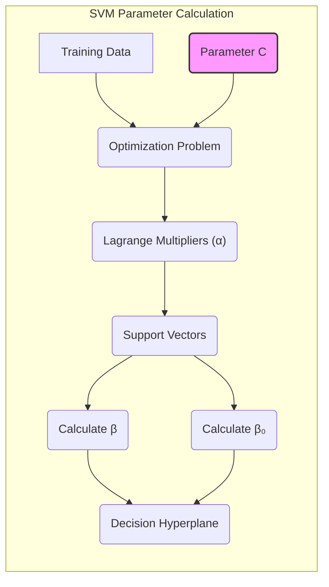
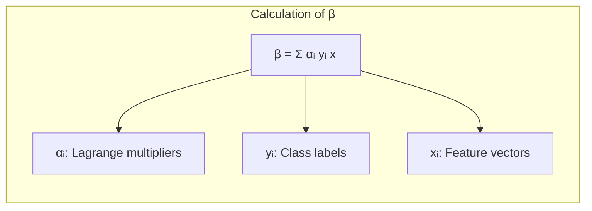
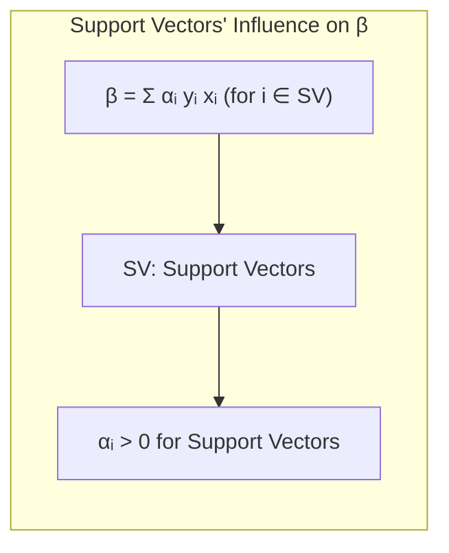
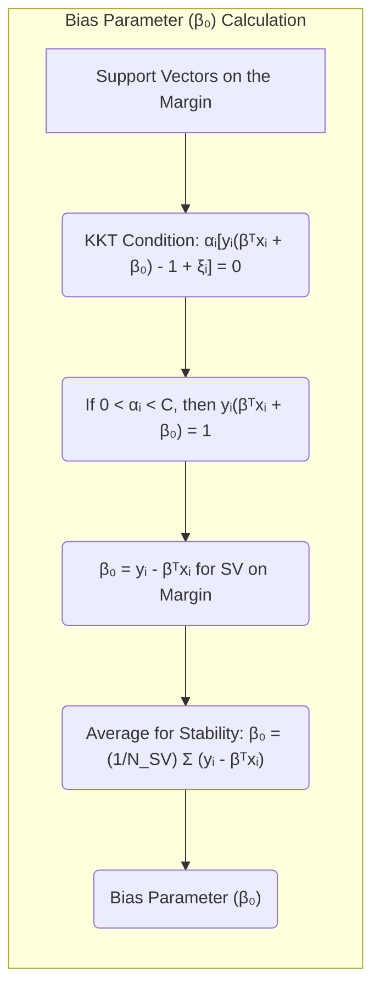
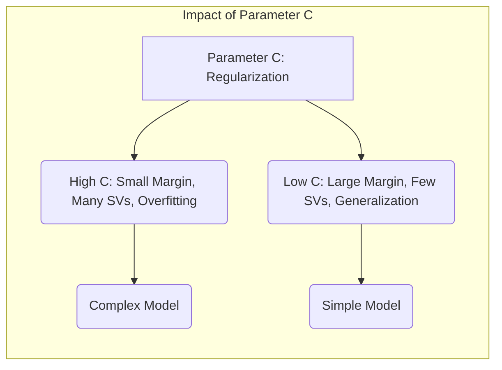
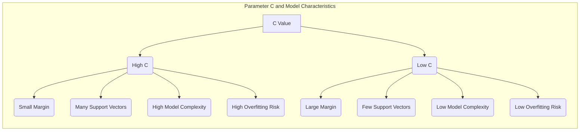

## Título: Cálculo dos Parâmetros dos Vetores de Suporte e o Papel do Parâmetro C na Solução das SVMs



### Introdução

No estudo das **Support Vector Machines (SVMs)**, a compreensão do cálculo dos parâmetros dos **vetores de suporte** e do papel do parâmetro de regularização **C** é crucial para a construção de modelos eficientes e robustos. Os vetores de suporte, como já discutimos, são as amostras de treinamento que estão localizadas na margem ou a violam, e são esses pontos que determinam a posição e orientação do hiperplano separador ótimo. O parâmetro $C$, por sua vez, controla o compromisso entre a maximização da margem e a tolerância a erros de classificação [^12.2].

Neste capítulo, vamos explorar em detalhe o processo de cálculo dos parâmetros associados aos vetores de suporte, incluindo o cálculo do vetor $\beta$ e do *bias* $\beta_0$ a partir dos multiplicadores de Lagrange. Analisaremos também o impacto do parâmetro $C$ na localização dos vetores de suporte, no número de vetores de suporte e na complexidade do modelo resultante. Entenderemos como o ajuste de $C$ influencia a capacidade de generalização da SVM e o equilíbrio entre viés e variância.

A compreensão desses aspectos é fundamental para a aplicação prática das SVMs e para a escolha adequada dos parâmetros do modelo, a fim de obter o melhor desempenho em diferentes conjuntos de dados. A importância dos vetores de suporte e a maneira como eles são usados para o cálculo da função de decisão é uma característica chave dos modelos SVM, e compreendê-la é central.

### Cálculo do Vetor $\beta$ a partir dos Multiplicadores de Lagrange

**Conceito 1: A Relação entre $\beta$ e os Multiplicadores de Lagrange**

Como vimos no capítulo anterior, a dualidade de Wolfe nos leva à seguinte expressão para o vetor normal ao hiperplano, $\beta$, em termos dos multiplicadores de Lagrange $\alpha_i$:

$$ \beta = \sum_{i=1}^{N} \alpha_i y_i x_i $$

Essa equação mostra que o vetor $\beta$ é uma combinação linear dos vetores de *features* $x_i$, ponderados pelos multiplicadores de Lagrange $\alpha_i$ e pelos rótulos das classes $y_i$. Essa expressão é fundamental, pois ela demonstra que o vetor $\beta$, que define a orientação do hiperplano separador, é determinado apenas pelos vetores de suporte.

> 💡 **Exemplo Numérico:**
>
> Suponha que temos um conjunto de dados com 4 amostras, onde $x_1 = [1, 2]$, $x_2 = [2, 1]$, $x_3 = [4, 5]$, $x_4 = [5, 4]$, com rótulos $y_1 = 1$, $y_2 = 1$, $y_3 = -1$, $y_4 = -1$. Após a otimização do problema dual, obtivemos os seguintes multiplicadores de Lagrange: $\alpha_1 = 0.2$, $\alpha_2 = 0.5$, $\alpha_3 = 0.7$, e $\alpha_4 = 0$.
>
> O vetor $\beta$ é calculado como:
>
> $\beta = \alpha_1 y_1 x_1 + \alpha_2 y_2 x_2 + \alpha_3 y_3 x_3 + \alpha_4 y_4 x_4$
>
> $\beta = (0.2)(1)[1, 2] + (0.5)(1)[2, 1] + (0.7)(-1)[4, 5] + (0)(-1)[5, 4]$
>
> $\beta = [0.2, 0.4] + [1, 0.5] + [-2.8, -3.5] + [0, 0]$
>
> $\beta = [-1.6, -2.6]$
>
> Neste exemplo, apenas as amostras $x_1$, $x_2$ e $x_3$ são vetores de suporte, pois seus $\alpha_i$ são diferentes de zero. A amostra $x_4$ não é um vetor de suporte, e não contribui para o cálculo de $\beta$.



**Lemma 1:** O vetor $\beta$ é uma combinação linear dos vetores de *features* dos vetores de suporte, ponderados pelos multiplicadores de Lagrange e pelos rótulos das classes.

A demonstração desse lemma se baseia na derivação da solução do problema dual das SVMs. Ao minimizar a função Lagrangiana com relação aos parâmetros primais $\beta$, $\beta_0$ e $\xi$, e utilizar as condições de otimalidade de KKT, obtemos a relação entre o vetor $\beta$ e os multiplicadores de Lagrange.

**Conceito 2: Vetores de Suporte e o Cálculo de $\beta$**

Como vimos anteriormente, os **vetores de suporte** são as amostras de treinamento para as quais os multiplicadores de Lagrange são diferentes de zero $(\alpha_i > 0)$. Isso significa que apenas os vetores de suporte contribuem para o cálculo do vetor $\beta$. Em outras palavras, as amostras que estão longe da margem não têm influência na definição do hiperplano separador, e sua informação é descartada. O cálculo de $\beta$ pode ser restringido para apenas as amostras para as quais $\alpha_i > 0$, que são as amostras que mais afetam a separação linear.

O cálculo de $\beta$ pode ser expresso como:

$$ \beta = \sum_{i \in SV} \alpha_i y_i x_i $$

onde SV é o conjunto dos índices dos vetores de suporte. Essa equação enfatiza o fato de que apenas os vetores de suporte são relevantes para a definição do hiperplano separador.

> 💡 **Exemplo Numérico:**
>
> Continuando o exemplo anterior, o conjunto de vetores de suporte SV é $\{1, 2, 3\}$. Então, o cálculo de $\beta$ pode ser reescrito como:
>
> $\beta = \sum_{i \in \{1,2,3\}} \alpha_i y_i x_i $
>
> $\beta = \alpha_1 y_1 x_1 + \alpha_2 y_2 x_2 + \alpha_3 y_3 x_3$
>
> $\beta = (0.2)(1)[1, 2] + (0.5)(1)[2, 1] + (0.7)(-1)[4, 5]$
>
> $\beta = [-1.6, -2.6]$
>
> Observe que este resultado é idêntico ao resultado anterior, o que demonstra que apenas os vetores de suporte contribuem para o cálculo de $\beta$.



**Corolário 1:** O vetor $\beta$, que define a orientação do hiperplano separador, é determinado unicamente pelos vetores de suporte.

A demonstração desse corolário se baseia na análise da equação para o cálculo de $\beta$. Como os multiplicadores de Lagrange $\alpha_i$ são zero para todas as amostras que não são vetores de suporte, o cálculo de $\beta$ é determinado unicamente pelas amostras que são vetores de suporte.

### Cálculo do Parâmetro de *bias* $\beta_0$



O parâmetro de *bias* $\beta_0$ define a posição do hiperplano separador no espaço. Ao contrário do vetor $\beta$, que é calculado a partir de todos os vetores de suporte, o parâmetro $\beta_0$ é calculado através dos vetores de suporte que estão exatamente sobre a margem.

As condições de Karush-Kuhn-Tucker (KKT) nos fornecem a seguinte condição de complementaridade:

$$ \alpha_i [y_i(\beta^T x_i + \beta_0) - 1 + \xi_i] = 0 $$

Essa condição implica que:

*   Se $0 < \alpha_i < C$, então $\xi_i = 0$, e $y_i(\beta^T x_i + \beta_0) = 1$. Isso indica que o ponto $x_i$ é um vetor de suporte e está exatamente sobre a margem.
*   Se $\alpha_i = C$, então $y_i(\beta^T x_i + \beta_0) \leq 1$, e o ponto $x_i$ é um vetor de suporte que viola a margem.
*   Se $\alpha_i = 0$, o ponto $x_i$ não é um vetor de suporte, e portanto não influencia a definição do hiperplano.

Para calcular $\beta_0$, podemos utilizar qualquer vetor de suporte que esteja exatamente sobre a margem $(0 < \alpha_i < C)$:

$$ \beta_0 = y_i - \beta^T x_i $$

No entanto, para garantir maior estabilidade, é comum calcular $\beta_0$ como a média dos valores obtidos a partir de todos os vetores de suporte que estão na margem:

$$ \beta_0 = \frac{1}{N_{SV}} \sum_{i \in SV} (y_i - \beta^T x_i) $$

onde $N_{SV}$ é o número de vetores de suporte que estão exatamente na margem.

> 💡 **Exemplo Numérico:**
>
> Continuando o exemplo anterior, suponha que o parâmetro $C$ seja 1 e que, após a otimização, tenhamos $\alpha_1 = 0.2$, $\alpha_2 = 0.5$, e $\alpha_3 = 0.7$. Isso significa que todos os vetores de suporte estão na margem, pois nenhum $\alpha_i$ atingiu o valor de C. Podemos usar qualquer um dos vetores de suporte para calcular $\beta_0$, mas para maior estabilidade, vamos usar a média.
>
> Já calculamos $\beta = [-1.6, -2.6]$. Vamos calcular $\beta_0$ usando os vetores de suporte $x_1$, $x_2$, e $x_3$.
>
> Para $x_1$:
>
> $\beta_0 = y_1 - \beta^T x_1 = 1 - ([-1.6, -2.6] \cdot [1, 2]) = 1 - (-1.6 - 5.2) = 1 - (-6.8) = 7.8$
>
> Para $x_2$:
>
> $\beta_0 = y_2 - \beta^T x_2 = 1 - ([-1.6, -2.6] \cdot [2, 1]) = 1 - (-3.2 - 2.6) = 1 - (-5.8) = 6.8$
>
> Para $x_3$:
>
> $\beta_0 = y_3 - \beta^T x_3 = -1 - ([-1.6, -2.6] \cdot [4, 5]) = -1 - (-6.4 - 13) = -1 - (-19.4) = 18.4$
>
> Agora, calculamos a média:
>
> $\beta_0 = \frac{7.8 + 6.8 + 18.4}{3} = \frac{33}{3} = 11$
>
> Portanto, o valor do parâmetro de *bias* $\beta_0$ é 11.

**Lemma 2:** O parâmetro de *bias* $\beta_0$ pode ser calculado através dos vetores de suporte que estão exatamente sobre a margem, e a utilização de uma média das soluções obtidas a partir de cada um desses vetores aumenta a estabilidade do cálculo.

A demonstração desse lemma se baseia na análise das condições de KKT e na relação entre os multiplicadores de Lagrange e a posição das amostras em relação à margem. A condição de complementaridade garante que as amostras com $0 < \alpha_i < C$ estão exatamente sobre a margem, e são portanto os pontos usados para calcular o parâmetro $\beta_0$.

### Impacto do Parâmetro $C$ na Solução



O parâmetro de regularização **C** desempenha um papel crucial na determinação da solução das SVMs, pois ele controla o compromisso entre a maximização da margem e a tolerância a erros de classificação, como discutimos anteriormente [^12.2]. A escolha do valor de C impacta o número de vetores de suporte, a complexidade do modelo e sua capacidade de generalização.

*   **Valores Altos de C:** Quando $C$ é alto, o termo de penalidade por violações da margem se torna mais forte. Nesse caso, a SVM tende a construir um modelo mais complexo, com uma margem menor e com um maior número de vetores de suporte, inclusive, um número maior de vetores de suporte que violam a margem. O modelo se ajusta mais aos dados de treinamento e é mais propenso ao *overfitting*.

*   **Valores Baixos de C:** Quando $C$ é baixo, o modelo permite que mais pontos violem a margem, e busca uma solução com uma margem maior, mesmo que isso signifique a classificação incorreta de alguns pontos. Nesses casos, o modelo é mais simples, com menos vetores de suporte e mais tolerante a *outliers*. O modelo também é menos propenso ao *overfitting* e geralmente apresenta melhor capacidade de generalizar para novos dados.

> 💡 **Exemplo Numérico:**
>
> Imagine que temos um conjunto de dados com algumas amostras que se sobrepõem.
>
> **C alto (ex: C=100):**  Com um C alto, o modelo tentará classificar o máximo de amostras corretamente, mesmo que isso resulte em uma margem pequena e muitos vetores de suporte, alguns deles violando a margem. Isso pode levar a um modelo que se ajusta muito bem aos dados de treino, mas que generaliza mal para novos dados (overfitting). Nesse cenário, a fronteira de decisão poderá ter uma forma irregular, seguindo de perto os dados de treino.
>
> **C baixo (ex: C=0.1):** Com um C baixo, o modelo prioriza uma margem grande e permite que alguns pontos sejam classificados incorretamente ou que violem a margem. Isso leva a um modelo mais simples, com menos vetores de suporte, e uma fronteira de decisão mais suave. O modelo é mais tolerante a *outliers* e tem maior chance de generalizar bem para novos dados. Aqui, a fronteira de decisão será mais regular e menos influenciada por amostras individuais.
>
> Para visualizar o efeito de C, considere o seguinte cenário simplificado em 2D:
>
> ```mermaid
> graph LR
>     A[Dados com sobreposição] --> B(C alto: Margem pequena, muitos SVs, overfitting);
>     A --> C(C baixo: Margem grande, poucos SVs, generalização);
>     B -->|Fronteira de decisão irregular| D(Modelo complexo);
>     C -->|Fronteira de decisão suave| E(Modelo simples);
> ```
>
> O gráfico acima ilustra a ideia de como a escolha de C afeta a complexidade do modelo e a forma da fronteira de decisão.
>
> | C Value | Margin Size | Number of Support Vectors | Model Complexity | Risk of Overfitting |
> | -------- | ----------- | ------------------------- | ----------------- | -------------------- |
> | High     | Small       | High                      | High              | High                 |
> | Low      | Large       | Low                       | Low               | Low                  |



A relação entre $C$ e a localização dos vetores de suporte também é importante. Quando $C$ é alto, muitos vetores de suporte estarão localizados dentro da margem ou classificados erroneamente, enquanto quando $C$ é baixo, a maioria dos vetores de suporte estará localizada sobre a margem.

A escolha do valor adequado para o parâmetro $C$ é um passo crucial no treinamento de uma SVM, e é frequentemente feita através de técnicas de validação cruzada. A validação cruzada permite avaliar o desempenho do modelo com diferentes valores de $C$ em um conjunto de dados de validação e escolher o valor que maximiza o desempenho no conjunto de dados não visto.

**Lemma 3:** O parâmetro $C$ controla a complexidade do modelo SVM, o número de vetores de suporte e a tolerância a erros de classificação, e a escolha apropriada de $C$ depende do equilíbrio entre viés e variância e da necessidade de generalização do modelo.

A demonstração desse lemma se baseia na análise da função de custo da SVM e como o parâmetro C afeta o valor dos multiplicadores de Lagrange e, consequentemente, a determinação dos vetores de suporte e da fronteira de decisão.

### Conclusão

Neste capítulo, exploramos em detalhes o processo de cálculo dos parâmetros dos **vetores de suporte** e o papel do parâmetro de regularização **C** na solução das **Support Vector Machines (SVMs)**. Vimos como o vetor $\beta$, que define a orientação do hiperplano separador, é calculado a partir de uma combinação linear dos vetores de *features* dos vetores de suporte, ponderados pelos multiplicadores de Lagrange e os rótulos das classes.

Analisamos também o cálculo do parâmetro de *bias* $\beta_0$, que é obtido através dos vetores de suporte que estão exatamente sobre a margem, e como a média dessas estimativas aumenta a estabilidade do cálculo. Discutimos o impacto crucial do parâmetro $C$ na complexidade do modelo, no número de vetores de suporte e na tolerância a erros de classificação.

A compreensão desses conceitos é fundamental para a aplicação prática das SVMs e para a escolha apropriada dos parâmetros do modelo. Os vetores de suporte, com seu papel central na definição da fronteira de decisão, e o parâmetro $C$, com sua influência na complexidade do modelo, são elementos chave para a construção de modelos robustos e com boa capacidade de generalização.

### Footnotes

[^12.1]: "In this chapter we describe generalizations of linear decision boundaries for classification. Optimal separating hyperplanes are introduced in Chapter 4 for the case when two classes are linearly separable. Here we cover extensions to the nonseparable case, where the classes overlap. These techniques are then generalized to what is known as the support vector machine, which produces nonlinear boundaries by constructing a linear boundary in a large, transformed version of the feature space." *(Trecho de  "Support Vector Machines and Flexible Discriminants")*

[^12.2]: "In Chapter 4 we discussed a technique for constructing an optimal separating hyperplane between two perfectly separated classes. We review this and generalize to the nonseparable case, where the classes may not be separable by a linear boundary." *(Trecho de  "Support Vector Machines and Flexible Discriminants")*
