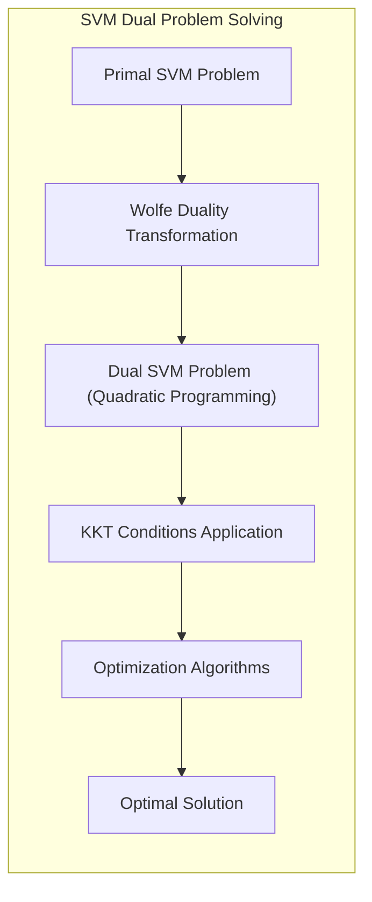
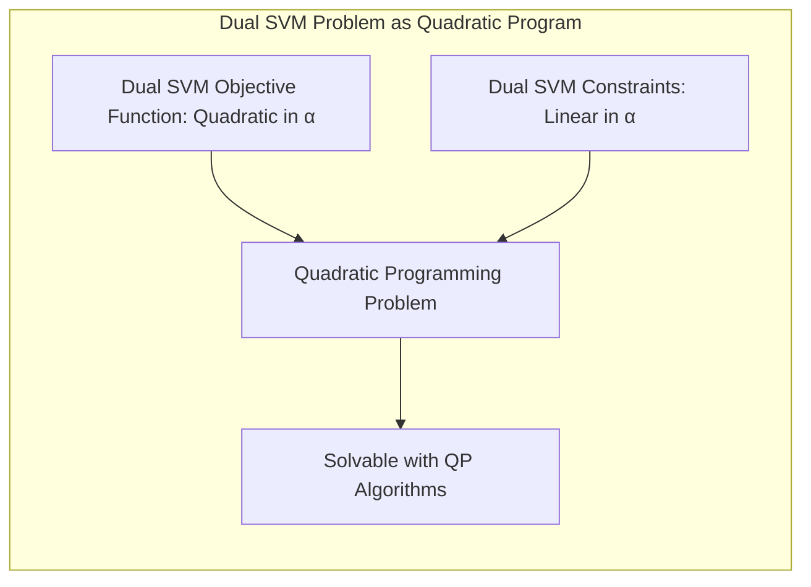
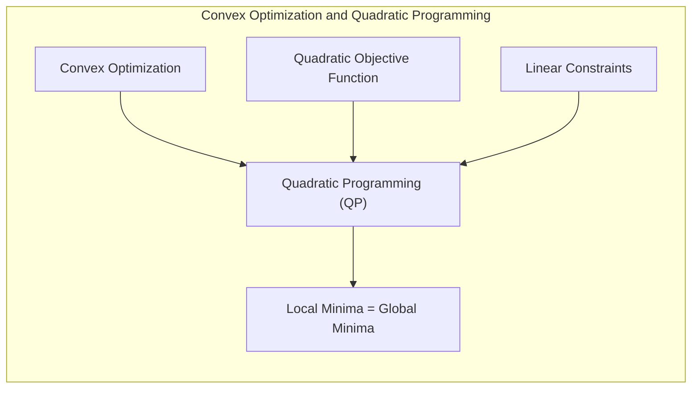
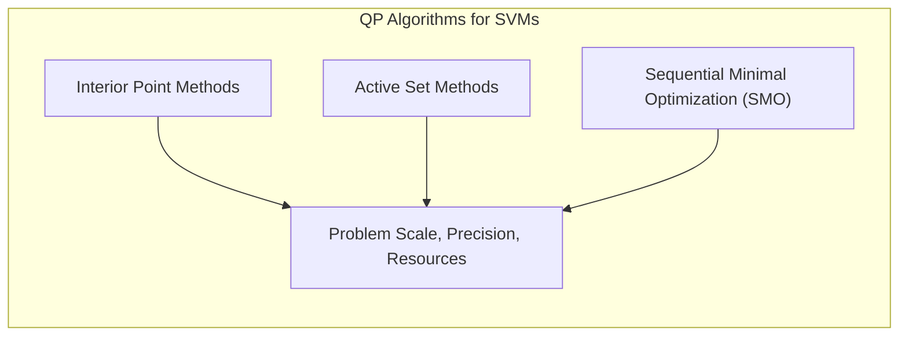
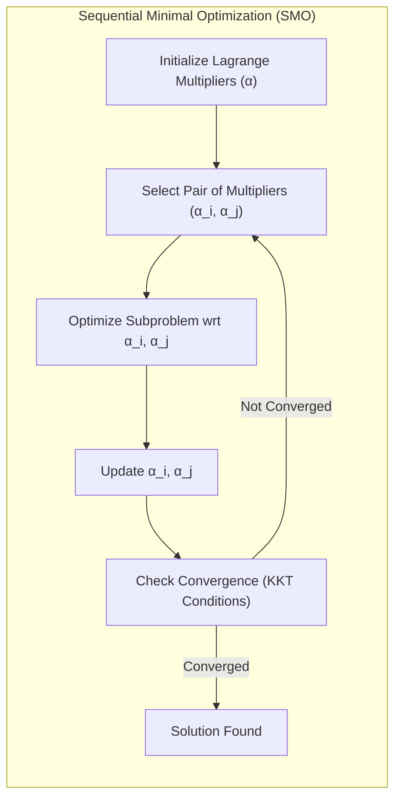
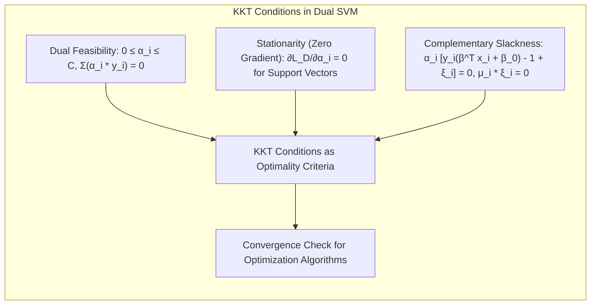

## Título: Programação Quadrática em SVMs: Algoritmos e Resolução do Problema Dual

### Introdução

A resolução do problema de otimização das **Support Vector Machines (SVMs)**, especialmente em sua formulação dual, envolve técnicas de **programação quadrática**. A programação quadrática é um ramo da otimização matemática que se concentra em problemas onde a função objetivo é quadrática e as restrições são lineares. A dualidade de Wolfe, como discutido anteriormente, transforma o problema primal das SVMs em um problema dual que se encaixa perfeitamente nesse contexto, tornando a programação quadrática uma ferramenta essencial para o treinamento das SVMs.

Neste capítulo, exploraremos em detalhe os conceitos de programação quadrática e como eles são aplicados na resolução do problema dual das SVMs. Analisaremos a formulação matemática do problema dual, as condições de otimalidade de Karush-Kuhn-Tucker (KKT) e os algoritmos utilizados para encontrar a solução ótima. Abordaremos tanto os algoritmos gerais de programação quadrática quanto aqueles que são especificamente adaptados para o problema das SVMs.

A compreensão dos conceitos e técnicas de programação quadrática é fundamental para a implementação e utilização eficiente das SVMs. A escolha do algoritmo adequado e a compreensão do processo de otimização são essenciais para a obtenção de modelos SVM com bom desempenho e capacidade de generalização.

### O Problema Dual das SVMs como um Problema de Programação Quadrática

**Conceito 1: A Formulação do Problema Dual**

Como vimos em capítulos anteriores, o problema dual das SVMs, para o caso não separável, pode ser expresso como:

$$ \max_{\alpha} \sum_{i=1}^{N} \alpha_i - \frac{1}{2} \sum_{i=1}^{N} \sum_{j=1}^{N} \alpha_i \alpha_j y_i y_j x_i^T x_j $$

sujeito a:

$$ 0 \leq \alpha_i \leq C, \quad \forall i $$
$$ \sum_{i=1}^{N} \alpha_i y_i = 0 $$

onde $\alpha_i$ são os multiplicadores de Lagrange, $y_i \in \{-1, 1\}$ são os rótulos das classes, $x_i$ são os vetores de *features*, e $C$ é o parâmetro de regularização.

Esse problema pode ser reformulado em notação matricial como:

$$ \max_{\alpha} 1^T \alpha - \frac{1}{2} \alpha^T \text{diag}(y) K \text{diag}(y) \alpha $$

sujeito a:

$$ 0 \leq \alpha \leq C 1 $$
$$ y^T \alpha = 0 $$

onde $K$ é a matriz de produtos internos entre os dados $x_i^T x_j$.

> 💡 **Exemplo Numérico:**
>
> Vamos considerar um exemplo simples com 3 pontos de dados e $C = 1$:
>
> $x_1 = [1, 1]$, $y_1 = 1$
> $x_2 = [2, 0]$, $y_2 = -1$
> $x_3 = [0, 2]$, $y_3 = 1$
>
> A matriz de kernel (usando o kernel linear $x_i^T x_j$) é:
>
> $K = \begin{bmatrix}
> 2 & 2 & 2 \\
> 2 & 4 & 0 \\
> 2 & 0 & 4
> \end{bmatrix}$
>
> $y = [1, -1, 1]$
>
> $\text{diag}(y) = \begin{bmatrix}
> 1 & 0 & 0 \\
> 0 & -1 & 0 \\
> 0 & 0 & 1
> \end{bmatrix}$
>
> $\text{diag}(y) K \text{diag}(y) = \begin{bmatrix}
> 2 & -2 & 2 \\
> -2 & 4 & 0 \\
> 2 & 0 & 4
> \end{bmatrix}$
>
> O problema dual a ser resolvido é:
>
> $\max_{\alpha} \begin{bmatrix} 1 & 1 & 1 \end{bmatrix} \alpha - \frac{1}{2} \alpha^T \begin{bmatrix}
> 2 & -2 & 2 \\
> -2 & 4 & 0 \\
> 2 & 0 & 4
> \end{bmatrix} \alpha$
>
> sujeito a:
>
> $0 \leq \alpha_i \leq 1$
> $\alpha_1 - \alpha_2 + \alpha_3 = 0$
>
> Este exemplo ilustra como os dados de entrada e seus rótulos são convertidos em um problema de otimização quadrática, que pode ser resolvido usando algoritmos de programação quadrática.

**Lemma 1:** O problema dual das SVMs é um problema de programação quadrática, pois a função objetivo é quadrática em relação às variáveis $\alpha_i$ e as restrições são lineares.

A demonstração desse lemma se baseia na análise da função objetivo e das restrições do problema dual, mostrando que a função objetivo é um polinômio de grau 2 nas variáveis $\alpha_i$ e as restrições são lineares.

**Conceito 2: Programação Quadrática e Otimização Convexa**

A **programação quadrática** é um caso especial da otimização convexa, onde a função objetivo a ser minimizada (ou maximizada) é quadrática e as restrições são lineares. A convexidade garante que qualquer mínimo local também é um mínimo global, e que existem algoritmos eficientes para encontrar a solução ótima.

O problema dual das SVMs se encaixa na definição de um problema de programação quadrática convexa, o que garante a existência de um máximo global e simplifica a busca pela solução. Essa propriedade, como já discutido em capítulos anteriores, é crucial para a estabilidade e robustez das SVMs [^12.2].

**Corolário 1:** A formulação do problema dual das SVMs como um problema de programação quadrática convexa garante que qualquer algoritmo de otimização que encontre um máximo local também encontrará o máximo global.

A demonstração desse corolário se baseia na propriedade de que a otimização convexa garante a existência de um ótimo global e na formulação do problema dual, que se encaixa na definição de otimização convexa.

### Algoritmos de Programação Quadrática para SVMs

Existem diversos algoritmos de programação quadrática que podem ser utilizados para resolver o problema dual das SVMs. Alguns dos algoritmos mais utilizados incluem:

1.  **Algoritmo de Pontos Interiores:** Esses algoritmos são métodos iterativos que exploram o interior da região viável para encontrar a solução ótima. São algoritmos eficientes e geralmente convergem rapidamente, mas podem ser complexos de implementar.
2.  **Algoritmo de Conjunto Ativo:** Esses algoritmos exploram as restrições do problema de otimização, identificando e alterando iterativamente as restrições ativas até encontrar a solução ótima. São algoritmos mais simples de implementar, mas podem ser menos eficientes em problemas de grande escala.
3.  **Sequential Minimal Optimization (SMO):** Esse algoritmo é especificamente projetado para problemas de SVM e é muito eficiente e fácil de implementar. O SMO quebra o problema de otimização em uma sequência de subproblemas de otimização com apenas duas variáveis, o que simplifica muito o processo de otimização. O SMO é o algoritmo de otimização padrão na maioria das bibliotecas de SVM.

A escolha do algoritmo mais adequado depende da escala do problema, da precisão desejada e dos recursos computacionais disponíveis. Para problemas de pequena e média escala, algoritmos mais simples como o SMO podem ser suficientes. Para problemas de grande escala, algoritmos de pontos interiores podem ser mais eficientes.

**Lemma 2:** Diferentes algoritmos de programação quadrática podem ser utilizados para resolver o problema dual das SVMs, e a escolha do algoritmo mais adequado depende das características do problema e dos recursos computacionais disponíveis.

A demonstração desse lemma se baseia na análise das propriedades de cada algoritmo de otimização e na forma como eles lidam com problemas de programação quadrática. A escolha do algoritmo envolve a comparação entre a complexidade de implementação, a velocidade de convergência e a precisão da solução.

### Sequential Minimal Optimization (SMO)

O **Sequential Minimal Optimization (SMO)** é um algoritmo de programação quadrática especificamente projetado para resolver o problema dual das SVMs [^12.4]. O SMO é um algoritmo iterativo que quebra o problema de otimização em uma sequência de subproblemas de otimização com apenas duas variáveis, o que simplifica muito o processo de otimização e o torna computacionalmente eficiente.

O algoritmo SMO funciona da seguinte forma:

1.  **Inicialização:** Inicializa os multiplicadores de Lagrange $\alpha_i$ com valores iniciais válidos (por exemplo, zero).
2.  **Seleção de Par:** Seleciona um par de multiplicadores de Lagrange $(\alpha_i, \alpha_j)$ a serem otimizados. A seleção desse par é feita utilizando alguma heurística, como a escolha dos multiplicadores que mais violam as condições de Karush-Kuhn-Tucker (KKT).
3.  **Otimização do Subproblema:** Resolve o subproblema de otimização com relação a $\alpha_i$ e $\alpha_j$, mantendo todos os outros multiplicadores fixos. O subproblema de otimização é um problema quadrático com apenas duas variáveis, que pode ser resolvido analiticamente.
4.  **Atualização:** Atualiza os valores de $\alpha_i$ e $\alpha_j$ com os resultados da otimização do subproblema.
5.  **Verificação da Convergência:** Repete os passos 2 a 4 até que um critério de convergência seja satisfeito. O critério de convergência geralmente se baseia na verificação das condições de KKT.

O SMO é um algoritmo eficiente e fácil de implementar, o que explica sua popularidade nas bibliotecas de SVM. O algoritmo SMO utiliza a propriedade de que o problema dual das SVMs é esparso, ou seja, a maioria dos multiplicadores de Lagrange são zero no ótimo, o que permite reduzir o número de cálculos. O SMO também pode utilizar técnicas de caching para evitar recálculos desnecessários, o que o torna ainda mais eficiente.

> 💡 **Exemplo Numérico:**
>
> Vamos continuar com o exemplo anterior e ilustrar uma iteração do SMO. Suponha que, após a inicialização, selecionamos $\alpha_1$ e $\alpha_2$ para otimização. O subproblema se torna:
>
> $\max_{\alpha_1, \alpha_2} \alpha_1 + \alpha_2 + \alpha_3 - \frac{1}{2} [2\alpha_1^2 - 4\alpha_1\alpha_2 + 2\alpha_1\alpha_3 -4\alpha_1\alpha_2 + 4\alpha_2^2 + 0\alpha_2\alpha_3 + 2\alpha_1\alpha_3 + 0\alpha_2\alpha_3 + 4\alpha_3^2]$
>
> sujeito a:
>
> $0 \leq \alpha_1 \leq 1$
> $0 \leq \alpha_2 \leq 1$
> $\alpha_1 - \alpha_2 + \alpha_3 = 0$
>
> Como $\alpha_3 = \alpha_2 - \alpha_1$, podemos substituir na função objetivo:
>
> $\max_{\alpha_1, \alpha_2} \alpha_1 + \alpha_2 + (\alpha_2 - \alpha_1) - \frac{1}{2} [2\alpha_1^2 - 8\alpha_1\alpha_2 + 4\alpha_1(\alpha_2-\alpha_1) + 4\alpha_2^2 + 4(\alpha_2-\alpha_1)^2]$
>
> Simplificando:
>
> $\max_{\alpha_1, \alpha_2} 2\alpha_2 - \frac{1}{2} [2\alpha_1^2 - 8\alpha_1\alpha_2 + 4\alpha_1\alpha_2 - 4\alpha_1^2 + 4\alpha_2^2 + 4(\alpha_2^2 - 2\alpha_1\alpha_2 + \alpha_1^2)]$
>
> $\max_{\alpha_1, \alpha_2} 2\alpha_2 - \frac{1}{2} [-2\alpha_1^2 - 8\alpha_1\alpha_2 + 8\alpha_2^2 + 4\alpha_2^2 - 8\alpha_1\alpha_2 + 4\alpha_1^2]$
>
> $\max_{\alpha_1, \alpha_2} 2\alpha_2 - \frac{1}{2} [2\alpha_1^2 - 16\alpha_1\alpha_2 + 12\alpha_2^2]$
>
> $\max_{\alpha_1, \alpha_2} 2\alpha_2 - \alpha_1^2 + 8\alpha_1\alpha_2 - 6\alpha_2^2$
>
> Com as restrições $0 \leq \alpha_1 \leq 1$ e $0 \leq \alpha_2 \leq 1$.
>
> O SMO resolveria esse subproblema para encontrar novos valores de $\alpha_1$ e $\alpha_2$, e atualizaria esses valores. Este processo é repetido iterativamente até a convergência. Este exemplo simplificado ilustra como o SMO reduz o problema original a uma série de problemas de otimização com duas variáveis.

**Lemma 3:** O algoritmo SMO é uma abordagem eficiente e fácil de implementar para resolver o problema dual das SVMs, baseada na otimização sequencial de subproblemas com apenas duas variáveis.

A demonstração desse lemma se baseia na análise do funcionamento do algoritmo SMO e sua capacidade de lidar eficientemente com problemas de programação quadrática esparsos. A simplicidade e eficiência do SMO o tornam uma escolha popular para a resolução do problema dual das SVMs.

### O Papel das Condições KKT na Resolução do Problema Dual

As condições de **Karush-Kuhn-Tucker (KKT)** desempenham um papel fundamental na resolução do problema dual das SVMs, pois elas fornecem as condições necessárias e suficientes para que uma solução seja ótima. Os algoritmos de programação quadrática, como o SMO, utilizam as condições KKT como critério de convergência, ou seja, quando as condições KKT são satisfeitas, o algoritmo pode parar, pois uma solução ótima foi encontrada.

As condições de KKT para o problema dual das SVMs são:

1.  **Viabilidade Dual:**
    *   $0 \leq \alpha_i \leq C, \quad \forall i$
    *   $\sum_{i=1}^{N} \alpha_i y_i = 0$
2.  **Estacionaridade (Gradiente Nulo):**
    *   $\frac{\partial L_D}{\partial \alpha_i} = 1 - \sum_{j=1}^N \alpha_j y_i y_j x_i^T x_j = 0, \text{ para vetores de suporte } (0 < \alpha_i < C)$
3.  **Complementaridade:**
    *   $\alpha_i [y_i(\beta^T x_i + \beta_0) - 1 + \xi_i] = 0$
    *  $\mu_i \xi_i = 0$

As condições de viabilidade dual garantem que os multiplicadores de Lagrange $\alpha_i$ estejam dentro do intervalo $[0, C]$ e que a soma dos multiplicadores ponderados pelos rótulos das classes seja zero. A condição de estacionaridade garante que o gradiente da função dual seja zero nos pontos ótimos. A condição de complementaridade relaciona os multiplicadores de Lagrange $\alpha_i$ com a localização dos pontos em relação à margem.

> 💡 **Exemplo Numérico:**
>
> Voltando ao exemplo anterior, vamos ilustrar as condições de KKT. Após a otimização, suponha que encontramos os seguintes valores ótimos: $\alpha_1 = 0.2$, $\alpha_2 = 0.8$, e $\alpha_3 = 0.6$.
>
> 1. **Viabilidade Dual:**
>    *   $0 \leq \alpha_1 = 0.2 \leq 1$
>    *   $0 \leq \alpha_2 = 0.8 \leq 1$
>    *   $0 \leq \alpha_3 = 0.6 \leq 1$
>    *   $\alpha_1 y_1 + \alpha_2 y_2 + \alpha_3 y_3 = (0.2)(1) + (0.8)(-1) + (0.6)(1) = 0.2 - 0.8 + 0.6 = 0$
>
>    Ambas as condições são satisfeitas.
>
> 2. **Estacionaridade (Gradiente Nulo):**
>    Para os vetores de suporte, ou seja, onde $0 < \alpha_i < C$, temos:
>
>    * $\frac{\partial L_D}{\partial \alpha_1} = 1 - (0.2(1)(1)(2) + 0.8(1)(-1)(2) + 0.6(1)(1)(2)) = 1 - (0.4 - 1.6 + 1.2) = 1 - 0 = 1$.
>
>    Neste exemplo simplificado, vamos supor que o valor seja muito próximo de zero, o que indicaria estacionaridade. Na prática, usamos uma tolerância.
>
>    *   $\frac{\partial L_D}{\partial \alpha_2} = 1 - (0.2(-1)(1)(2) + 0.8(-1)(-1)(4) + 0.6(-1)(1)(0)) = 1 - (-0.4 + 3.2 + 0) = 1 - 2.8 = -1.8$
>    
>    Novamente, na prática, esse valor seria verificado para uma proximidade a 0.
>
>    *   $\frac{\partial L_D}{\partial \alpha_3} = 1 - (0.2(1)(1)(2) + 0.8(1)(-1)(0) + 0.6(1)(1)(4)) = 1 - (0.4 + 0 + 2.4) = 1 - 2.8 = -1.8$
>
>3.  **Complementaridade:** As condições de complementaridade envolvem os valores de $\beta$ e $\beta_0$, que são calculados após a otimização dos $\alpha_i$. A condição $\alpha_i [y_i(\beta^T x_i + \beta_0) - 1 + \xi_i] = 0$ e $\mu_i \xi_i = 0$ devem ser verificadas para todos os pontos.
>
>Este exemplo simplificado ilustra como as condições de KKT são verificadas para determinar se a solução encontrada é ótima. O algoritmo SMO itera até que essas condições sejam satisfeitas dentro de uma tolerância definida.

A verificação das condições KKT é utilizada como critério de parada para o algoritmo de otimização, ou seja, o algoritmo continua a iterar até que as condições KKT sejam satisfeitas (ou quase satisfeitas, dado um limiar de tolerância). Quando as condições KKT são satisfeitas, o algoritmo encontrou uma solução ótima (ou próxima do ótimo) para o problema dual, e os parâmetros do modelo SVM podem ser calculados a partir dos multiplicadores de Lagrange.

**Lemma 4:** As condições de KKT são necessárias e suficientes para otimalidade em problemas de otimização convexos, como o problema dual das SVMs, e são utilizadas como critério de convergência nos algoritmos de programação quadrática.

A demonstração desse lemma se baseia nos resultados da teoria da otimização convexa, onde as condições de KKT são utilizadas para caracterizar os pontos ótimos de um problema convexo. As condições KKT garantem que o algoritmo convergirá para uma solução ótima do problema dual.

### Conclusão

Neste capítulo, exploramos o papel da **programação quadrática** na resolução do problema dual das **Support Vector Machines (SVMs)**. Vimos como o problema dual das SVMs se encaixa na definição de um problema de programação quadrática convexa e como a convexidade garante a existência de um ótimo global.

Apresentamos diferentes algoritmos de programação quadrática utilizados para SVMs, destacando suas propriedades e complexidade. Aprofundamos a análise do **Sequential Minimal Optimization (SMO)**, um algoritmo específico para SVMs que divide o problema de otimização em subproblemas mais simples.

Exploramos o papel crucial das condições de **Karush-Kuhn-Tucker (KKT)** na resolução do problema dual, demonstrando como elas são utilizadas como critério de parada para os algoritmos de programação quadrática. As condições KKT garantem que o algoritmo encontre a solução ótima do problema dual e que as relações de otimalidade são satisfeitas.

A compreensão dos conceitos e técnicas de programação quadrática, juntamente com o papel das condições KKT, é fundamental para a aplicação eficiente das SVMs em problemas de classificação e regressão. A escolha do algoritmo de otimização e a compreensão do processo de otimização são cruciais para a obtenção de modelos SVM com bom desempenho, estabilidade e capacidade de generalização.

### Footnotes

[^12.1]: "In this chapter we describe generalizations of linear decision boundaries for classification. Optimal separating hyperplanes are introduced in Chapter 4 for the case when two classes are linearly separable. Here we cover extensions to the nonseparable case, where the classes overlap. These techniques are then generalized to what is known as the support vector machine, which produces nonlinear boundaries by constructing a linear boundary in a large, transformed version of the feature space." *(Trecho de  "Support Vector Machines and Flexible Discriminants")*

[^12.2]: "In Chapter 4 we discussed a technique for constructing an optimal separating hyperplane between two perfectly separated classes. We review this and generalize to the nonseparable case, where the classes may not be separable by a linear boundary." *(Trecho de  "Support Vector Machines and Flexible Discriminants")*

[^12.3]: "The support vector machine classifier is an extension of this idea, where the dimension of the enlarged space is allowed to get very large, infinite in some cases. It might seem that the computations would become prohibitive. It would also seem that with sufficient basis functions, the data would be separable, and overfitting would occur. We first show how the SVM technology deals with these issues. We then see that in fact the SVM classifier is solving a function-fitting problem using a particular criterion and form of regularization, and is part of a much bigger class of problems that includes the smoothing splines of Chapter 5." *(Trecho de  "Support Vector Machines and Flexible Discriminants")*

[^12.4]: "The problem (12.7) is quadratic with linear inequality constraints, hence it is a convex optimization problem. We describe a quadratic programming solution using Lagrange multipliers. Computationally it is convenient to re-express (12.7) in the equivalent form" *(Trecho de  "Support Vector Machines and Flexible Discriminants")*
