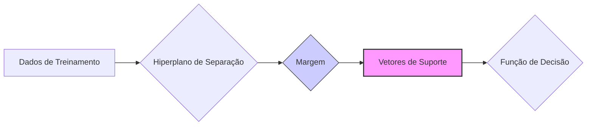
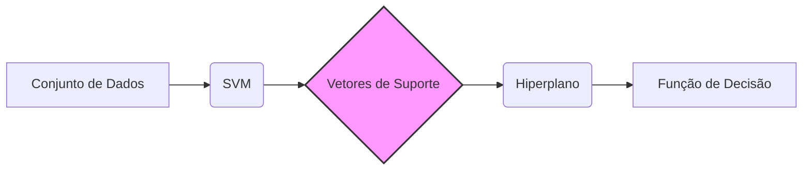
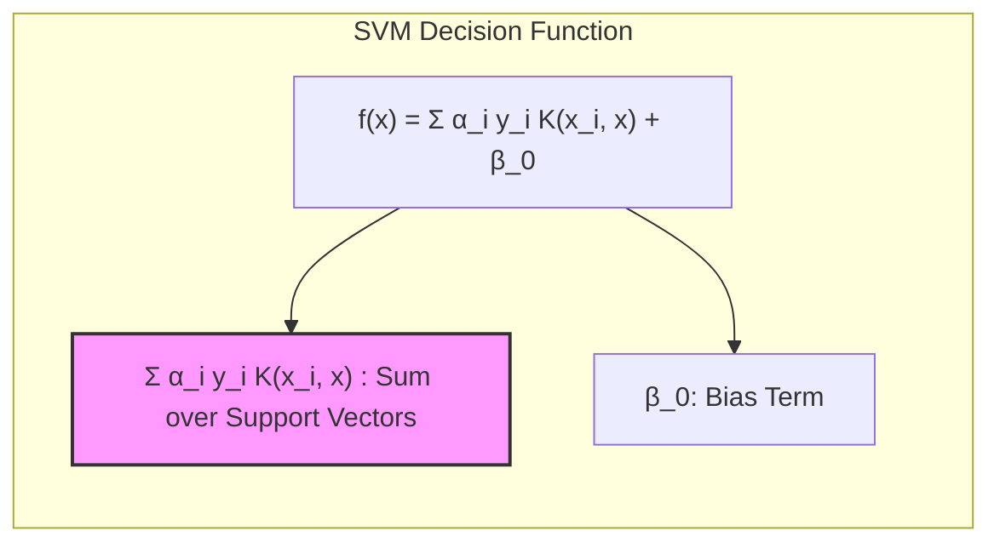
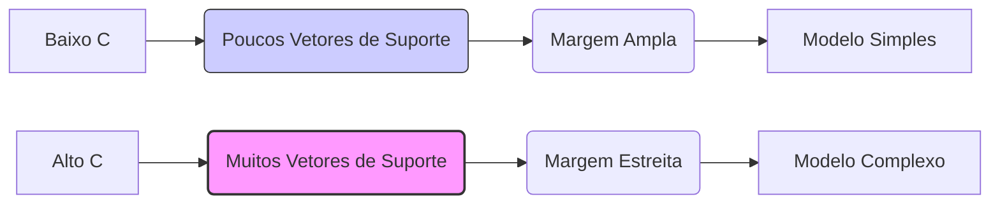
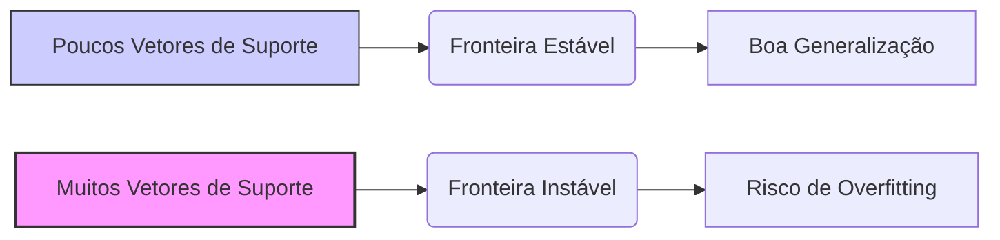
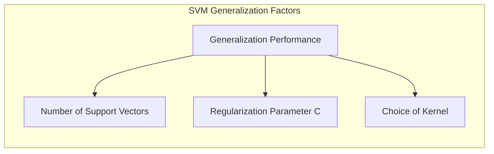

## Título: Vetores de Suporte em SVMs: Definição, Importância e Papel na Construção do Modelo

### Introdução

Em **Support Vector Machines (SVMs)**, os **vetores de suporte** são amostras de treinamento que desempenham um papel fundamental na definição do hiperplano separador ótimo e na construção do modelo de classificação ou regressão. Vetores de suporte são definidos como as amostras que estão localizadas sobre a margem ou dentro dela (no caso de SVMs com *soft margin*), as que são classificadas incorretamente, ou seja, são as amostras mais "críticas" para a construção da fronteira de decisão.

Neste capítulo, aprofundaremos nossa análise sobre os vetores de suporte, explorando sua definição precisa, sua importância na formulação matemática das SVMs e seu papel na determinação da função de decisão. Analisaremos a relação entre os vetores de suporte e os multiplicadores de Lagrange, e como os vetores de suporte são identificados no processo de otimização. Discutiremos também a influência dos vetores de suporte na complexidade do modelo e sua contribuição para a generalização e estabilidade.

A compreensão do papel dos vetores de suporte é fundamental para uma visão completa do funcionamento das SVMs. Sua influência na construção da fronteira de decisão e na formulação do modelo tornam os vetores de suporte um conceito chave para a utilização eficiente das SVMs em uma ampla gama de aplicações.

### Definição e Identificação dos Vetores de Suporte

**Conceito 1: Definição dos Vetores de Suporte**

Os **vetores de suporte** em SVMs são as amostras de treinamento que satisfazem uma das seguintes condições:

1.  **Amostras sobre a Margem:** São as amostras que estão localizadas exatamente na margem de separação, ou seja, a distância do ponto ao hiperplano é igual à margem. Para essas amostras, a variável de folga $\xi_i$ é igual a zero, e o multiplicador de Lagrange $\alpha_i$ satisfaz $0 < \alpha_i < C$ (onde $C$ é o parâmetro de regularização).
2.  **Amostras dentro da Margem:** São as amostras que estão localizadas dentro da margem de separação, ou seja, a distância do ponto ao hiperplano é menor do que a margem, mas o ponto ainda está do lado correto do hiperplano. Para essas amostras, a variável de folga $\xi_i$ é maior do que zero e menor do que um, e o multiplicador de Lagrange $\alpha_i$ satisfaz $0 < \alpha_i < C$.
3.  **Amostras que Violam a Margem:** São as amostras que estão localizadas do lado errado do hiperplano, ou seja, estão classificadas incorretamente. Para essas amostras, a variável de folga $\xi_i$ é maior ou igual a um, e o multiplicador de Lagrange $\alpha_i$ é igual a $C$.

Em outras palavras, vetores de suporte são as amostras que têm maior influência na determinação da fronteira de decisão, e as amostras que estão longe da margem não influenciam a solução do problema de otimização.

> 💡 **Exemplo Numérico:**
>
> Considere um problema de classificação binária com duas features, $x_1$ e $x_2$, e duas classes, +1 e -1. Suponha que após o treinamento de uma SVM com um parâmetro de regularização $C=1$, obtivemos os seguintes multiplicadores de Lagrange ($\alpha_i$) para cinco amostras de treinamento:
>
> | Amostra | $x_1$ | $x_2$ | $y_i$ | $\alpha_i$ |
> |--------|-------|-------|-------|-----------|
> | 1      | 1     | 2     | +1    | 0.0       |
> | 2      | 2     | 1     | +1    | 0.7       |
> | 3      | 3     | 4     | -1    | 0.0       |
> | 4      | 4     | 3     | -1    | 1.0       |
> | 5      | 5     | 6     | -1    | 0.3       |
>
> Neste caso, as amostras 2, 4 e 5 são vetores de suporte porque têm $\alpha_i > 0$. A amostra 4 tem $\alpha_4 = C = 1$, o que significa que ela provavelmente está violando a margem ou está no lado errado do hiperplano. As amostras 1 e 3 não são vetores de suporte, pois seus $\alpha_i$ são iguais a 0. A função de decisão da SVM dependerá apenas das amostras 2, 4 e 5.

**Lemma 1:** Os vetores de suporte são as amostras de treinamento que têm multiplicadores de Lagrange $\alpha_i > 0$ e que satisfazem as condições de complementaridade de Karush-Kuhn-Tucker (KKT).

A demonstração desse lemma se baseia na análise das condições de KKT, que relacionam os parâmetros primais e duais do problema de otimização das SVMs. As condições de complementaridade garantem que apenas as amostras com $\alpha_i > 0$ contribuem para a solução, e que essas amostras são aquelas que estão sobre a margem ou a violam.

**Conceito 2: Identificação dos Vetores de Suporte**

Os vetores de suporte são identificados através da análise da solução do problema dual das SVMs. A solução do problema dual fornece os valores dos multiplicadores de Lagrange $\alpha_i$, e os vetores de suporte são as amostras para as quais $\alpha_i > 0$.

A identificação dos vetores de suporte é um processo fundamental para a construção do modelo SVM, pois, como veremos adiante, a função de decisão do modelo depende apenas dos vetores de suporte.

**Corolário 1:** A identificação dos vetores de suporte é feita através da análise dos multiplicadores de Lagrange obtidos na solução do problema dual, onde apenas as amostras com $\alpha_i > 0$ são consideradas vetores de suporte.

A demonstração desse corolário se baseia na análise da função de decisão da SVM, que depende apenas dos produtos internos com os vetores de suporte, e na análise do problema dual, que garante que $\alpha_i = 0$ para todas as amostras que não são vetores de suporte.

### A Importância dos Vetores de Suporte na Formulação Matemática das SVMs

Os vetores de suporte desempenham um papel fundamental na formulação matemática das SVMs, pois eles são os únicos pontos que contribuem para o cálculo do hiperplano separador ótimo e da função de decisão.

Como vimos no capítulo anterior, o vetor $\beta$, que define a orientação do hiperplano separador, é calculado como:

$$ \beta = \sum_{i \in SV} \alpha_i y_i x_i $$

onde SV é o conjunto de índices dos vetores de suporte. Essa equação demonstra que $\beta$ é uma combinação linear dos vetores de *features* dos vetores de suporte, ponderados pelos multiplicadores de Lagrange $\alpha_i$ e pelos rótulos das classes $y_i$.

> 💡 **Exemplo Numérico:**
>
>  Usando os vetores de suporte do exemplo anterior (amostras 2, 4 e 5) com $\alpha_2 = 0.7$, $\alpha_4 = 1.0$, $\alpha_5 = 0.3$ e os respectivos rótulos $y_2 = +1$, $y_4 = -1$, $y_5 = -1$ e features $x_2 = [2, 1]$, $x_4 = [4, 3]$, $x_5 = [5, 6]$, podemos calcular $\beta$ como:
>
> $\beta = (0.7 * 1 * [2, 1]) + (1.0 * -1 * [4, 3]) + (0.3 * -1 * [5, 6])$
> $\beta = [1.4, 0.7] - [4, 3] - [1.5, 1.8]$
> $\beta = [-4.1, -4.1]$
>
> Este vetor $\beta = [-4.1, -4.1]$ define a orientação do hiperplano separador.

Além disso, a função de decisão da SVM pode ser expressa como:

$$ f(x) = \sum_{i \in SV} \alpha_i y_i K(x_i, x) + \beta_0 $$

onde $K(x_i, x)$ é a função *kernel* que calcula o produto interno no espaço de *features* transformado. Essa equação demonstra que a função de decisão depende apenas dos vetores de suporte e dos seus multiplicadores de Lagrange, o que torna as SVMs muito eficientes em termos computacionais e permite trabalhar em espaços de alta dimensão com poucos dados.

> 💡 **Exemplo Numérico:**
>
>  Continuando o exemplo anterior, suponha que estamos usando um kernel linear $K(x_i, x) = x_i^T x$ e que o bias $\beta_0 = 1$. Para classificar um novo ponto $x = [3, 2]$, calculamos:
>
> $f(x) =  (0.7 * 1 * ([2, 1]^T [3, 2])) + (1.0 * -1 * ([4, 3]^T [3, 2])) + (0.3 * -1 * ([5, 6]^T [3, 2])) + 1$
>
> $f(x) =  0.7 * (6+2) - 1 * (12+6) - 0.3 * (15+12) + 1$
>
> $f(x) = 0.7 * 8 - 1 * 18 - 0.3 * 27 + 1$
>
> $f(x) = 5.6 - 18 - 8.1 + 1 = -19.5$
>
> Como $f(x) < 0$, o ponto $x = [3, 2]$ seria classificado como -1.

A importância dos vetores de suporte na formulação matemática das SVMs reside na capacidade de construir o modelo com base em apenas algumas amostras, que são as mais relevantes para a definição da fronteira de decisão.

**Lemma 2:** A função de decisão das SVMs depende apenas dos vetores de suporte e de seus multiplicadores de Lagrange, tornando as SVMs um método eficiente e com boa capacidade de generalização.

A demonstração desse lemma se baseia na análise das equações para o cálculo de $\beta$ e da função de decisão $f(x)$, que mostram que as amostras que não são vetores de suporte não têm influência na definição da fronteira de decisão.

### Vetores de Suporte e o Controle da Complexidade do Modelo

O número de vetores de suporte e a sua distribuição no espaço de *features* têm um impacto direto na complexidade do modelo SVM e na sua capacidade de generalização. Modelos com muitos vetores de suporte tendem a ser mais complexos, ajustando-se demais aos dados de treinamento e propensos ao *overfitting*. Modelos com poucos vetores de suporte são mais simples, com maior capacidade de generalizar para dados não vistos.

O parâmetro de regularização $C$ tem um papel crucial no controle do número de vetores de suporte. Como discutido anteriormente, valores altos de $C$ penalizam fortemente erros de classificação, o que resulta em modelos mais complexos e com um maior número de vetores de suporte, especialmente aqueles que estão dentro da margem ou que a violam. Valores baixos de $C$, por outro lado, levam a modelos mais simples com menor número de vetores de suporte e uma margem maior [^12.2].

> 💡 **Exemplo Numérico:**
>
> Considere um conjunto de dados com 100 amostras. Treinamos duas SVMs, uma com $C = 0.1$ e outra com $C = 10$.
>
> *   **SVM com C = 0.1:** O modelo resultante pode ter apenas 10 vetores de suporte. A margem é ampla e o modelo é mais simples, com maior capacidade de generalização, mas pode ter um viés maior.
>
> *   **SVM com C = 10:** O modelo resultante pode ter 40 vetores de suporte. A margem é estreita e o modelo é mais complexo, ajustando-se bem aos dados de treinamento, mas com maior risco de overfitting.
>
> Este exemplo ilustra como o valor de C afeta o número de vetores de suporte e, consequentemente, a complexidade do modelo.

A relação entre o número de vetores de suporte e o parâmetro $C$ é um fator importante a ser considerado na escolha dos parâmetros do modelo SVM, pois permite ajustar o compromisso entre complexidade e capacidade de generalização. Em geral, modelos com um número menor de vetores de suporte tendem a ser mais robustos e com melhor capacidade de generalização para dados não vistos.

**Corolário 2:** O número de vetores de suporte é controlado pelo parâmetro de regularização $C$, e a escolha apropriada de $C$ permite ajustar a complexidade do modelo e obter um melhor equilíbrio entre viés e variância.

A demonstração desse corolário se baseia na análise do efeito do parâmetro $C$ na função de custo das SVMs e como esse efeito se reflete na localização dos vetores de suporte. Um $C$ mais alto força o modelo a ter mais vetores de suporte, e modelos menos robustos, e um $C$ mais baixo leva a menos vetores de suporte, e modelos mais simples.

### A Influência dos Vetores de Suporte na Generalização

A localização dos vetores de suporte e a sua proximidade com a fronteira de decisão também têm um impacto na estabilidade e generalização do modelo. Modelos com muitos vetores de suporte dentro ou violando a margem tendem a apresentar menor estabilidade e maior risco de *overfitting*. Modelos com poucos vetores de suporte, localizados principalmente sobre a margem, tendem a ser mais robustos e com melhor capacidade de generalização.

A utilização de *kernels* permite que as SVMs construam fronteiras de decisão não lineares, mas é importante escolher um *kernel* adequado para o problema em questão. Um *kernel* que seja muito complexo pode levar a *overfitting*, mesmo que o número de vetores de suporte seja relativamente baixo. Da mesma forma, um *kernel* que seja muito simples pode não capturar a complexidade dos dados e levar a modelos com alto viés.

> 💡 **Exemplo Numérico:**
>
> Suponha que estamos usando um kernel polinomial de grau 3, $K(x_i, x) = (x_i^T x + 1)^3$. Se usarmos um valor alto de C e muitos vetores de suporte, o modelo pode se ajustar perfeitamente aos dados de treinamento, mas apresentar um desempenho ruim em novos dados, pois a fronteira de decisão será muito complexa e instável.
>
> Se usarmos um kernel linear $K(x_i, x) = x_i^T x$ e um valor baixo de C, teremos menos vetores de suporte e uma fronteira de decisão mais simples e estável, o que pode levar a uma melhor generalização.

A relação entre o parâmetro $C$, o número de vetores de suporte e a escolha do *kernel* deve ser cuidadosamente analisada para obter um modelo SVM com bom desempenho. A validação cruzada pode ser utilizada para ajustar esses parâmetros e escolher a combinação que resulta na melhor capacidade de generalização para o conjunto de dados específico.

**Lemma 4:** A localização e distribuição dos vetores de suporte, juntamente com a escolha do *kernel* e o valor do parâmetro C, afetam a estabilidade e generalização dos modelos SVM.

A demonstração desse lemma envolve uma análise da função de decisão da SVM, que depende dos vetores de suporte e dos parâmetros do modelo. A relação entre os vetores de suporte, o parâmetro $C$ e o *kernel* definem a complexidade da fronteira de decisão, afetando a capacidade do modelo de generalizar para dados não vistos.

### Conclusão

Neste capítulo, exploramos em detalhe os **vetores de suporte**, sua definição, identificação e seu papel crucial na formulação matemática das **Support Vector Machines (SVMs)**. Vimos que os vetores de suporte são as amostras de treinamento que definem a posição e orientação do hiperplano separador ótimo, e como o vetor $\beta$ e a função de decisão da SVM dependem unicamente deles.

Analisamos também o impacto do parâmetro de regularização $C$ no número de vetores de suporte e na complexidade do modelo, demonstrando como a escolha de $C$ influencia o equilíbrio entre a maximização da margem e a tolerância a erros de classificação. Exploramos como a localização dos vetores de suporte, a escolha do *kernel* e o valor do parâmetro $C$ são fatores importantes para a estabilidade e capacidade de generalização do modelo.

A compreensão do papel dos vetores de suporte é fundamental para o domínio das SVMs, e para a construção de modelos com alto desempenho em problemas complexos de classificação e regressão. O conhecimento sobre a relação entre os vetores de suporte e os demais parâmetros do modelo é fundamental para escolher os parâmetros apropriados e construir modelos robustos com alta capacidade de generalização.

### Footnotes

[^12.1]: "In this chapter we describe generalizations of linear decision boundaries for classification. Optimal separating hyperplanes are introduced in Chapter 4 for the case when two classes are linearly separable. Here we cover extensions to the nonseparable case, where the classes overlap. These techniques are then generalized to what is known as the support vector machine, which produces nonlinear boundaries by constructing a linear boundary in a large, transformed version of the feature space." *(Trecho de  "Support Vector Machines and Flexible Discriminants")*

[^12.2]: "In Chapter 4 we discussed a technique for constructing an optimal separating hyperplane between two perfectly separated classes. We review this and generalize to the nonseparable case, where the classes may not be separable by a linear boundary." *(Trecho de  "Support Vector Machines and Flexible Discriminants")*
