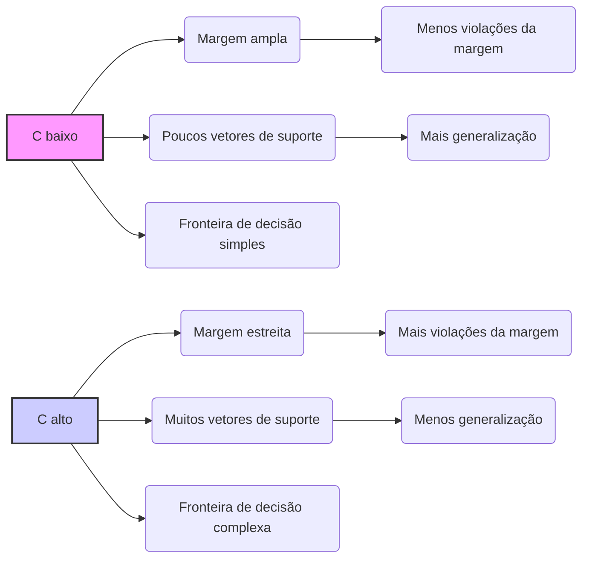
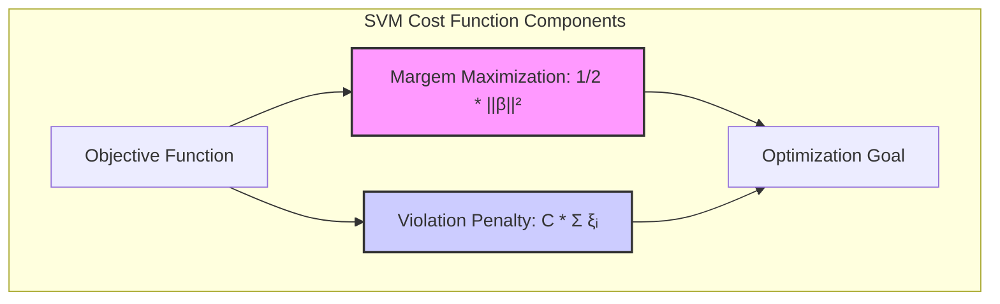
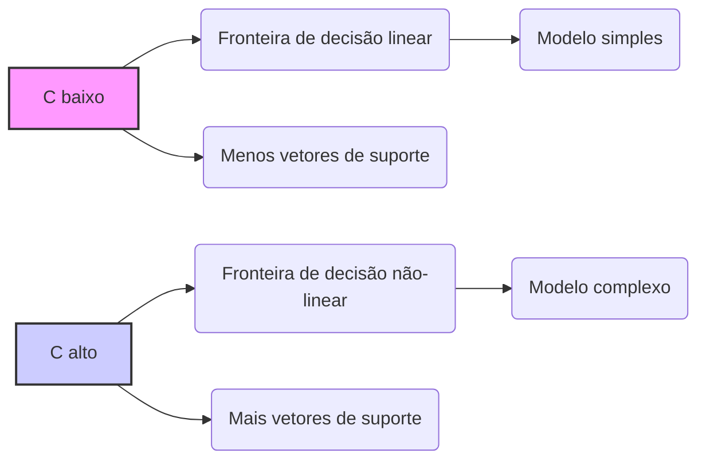
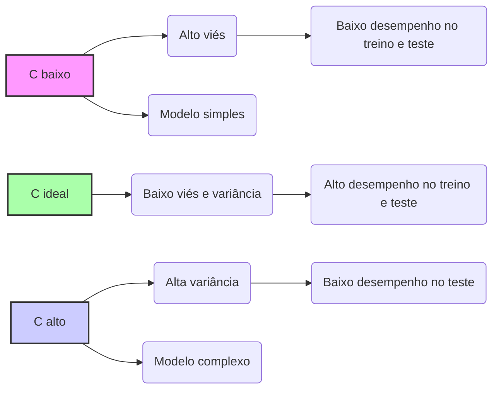

## Título: Sensibilidade das SVMs ao Parâmetro C: Impacto na Margem, Complexidade e Generalização

### Introdução

Um dos aspectos cruciais para a aplicação bem-sucedida das **Support Vector Machines (SVMs)** é a escolha adequada do parâmetro de regularização **C**. O parâmetro C controla o compromisso entre a maximização da margem de separação e a penalidade por erros de classificação, e sua escolha influencia diretamente a complexidade do modelo, o número de **vetores de suporte** e, consequentemente, a capacidade de generalização da SVM. Este capítulo explora a **sensibilidade das SVMs ao parâmetro C**, analisando em detalhes como diferentes valores de C afetam a margem, a complexidade da fronteira de decisão e a performance do modelo.

A compreensão da sensibilidade ao parâmetro C é fundamental para a aplicação prática das SVMs, pois ela permite ajustar o modelo de forma a obter um equilíbrio adequado entre viés e variância, evitando o *overfitting* e maximizando a capacidade de generalizar para dados não vistos. A escolha de um valor inapropriado de C pode levar a modelos com desempenho insatisfatório, tanto em dados de treinamento quanto em dados de teste. Portanto, o objetivo deste capítulo é fornecer uma análise abrangente sobre o impacto do parâmetro C na solução da SVM.

### Impacto de C na Margem de Separação

**Conceito 1: A Relação entre C e a Largura da Margem**

O parâmetro de regularização **C** nas SVMs controla a penalidade por violações da margem de separação. A função de custo da SVM, para o caso não separável, é dada por:

$$ \min_{\beta, \beta_0, \xi} \frac{1}{2} ||\beta||^2 + C \sum_{i=1}^{N} \xi_i $$

sujeito a:

$$ y_i(\beta^T x_i + \beta_0) \geq 1 - \xi_i, \quad \forall i $$
$$ \xi_i \geq 0, \quad \forall i $$

O termo $\frac{1}{2} ||\beta||^2$ corresponde à maximização da margem, e o termo $C \sum_{i=1}^{N} \xi_i$ penaliza as amostras que violam a margem ou que são classificadas incorretamente. Um valor alto de $C$ impõe uma penalidade alta sobre as violações da margem, enquanto um valor baixo de $C$ permite que mais amostras violem a margem, como discutido em [^12.2].

A largura da margem é inversamente proporcional à norma do vetor $\beta$ ($M = \frac{1}{||\beta||}$). Portanto, ao aumentar o valor de $C$, o modelo é forçado a ajustar-se mais aos dados de treinamento, o que leva a uma diminuição da largura da margem. Da mesma forma, ao diminuir o valor de $C$, o modelo prioriza a maximização da margem, mesmo que isso signifique classificar incorretamente algumas amostras.

> 💡 **Exemplo Numérico:**
>
> Vamos supor que temos um conjunto de dados de treinamento com duas classes, onde alguns pontos estão próximos da fronteira de decisão. Usaremos uma SVM com kernel linear.
>
> 1. **C = 0.1 (baixo):** O modelo priorizará uma margem mais ampla, mesmo que alguns pontos sejam classificados incorretamente ou estejam dentro da margem. Isso resulta em um vetor $\beta$ com norma pequena, digamos $||\beta|| = 0.5$, o que leva a uma margem $M = 1/0.5 = 2$. A margem será larga e poucos pontos serão vetores de suporte.
>
> 2. **C = 10 (alto):** O modelo será mais rigoroso em classificar corretamente todos os pontos. Isso leva a um vetor $\beta$ com uma norma maior, digamos $||\beta|| = 2$, resultando em uma margem $M = 1/2 = 0.5$. A margem será mais estreita e muitos pontos serão vetores de suporte, alguns dos quais estarão dentro da margem.
>
> Este exemplo ilustra como a variação de C impacta diretamente a largura da margem e, por consequência, a complexidade do modelo.

**Lemma 1:** Valores altos de C levam a modelos com margem menor, enquanto valores baixos de C levam a modelos com margem maior.

A demonstração desse lemma se baseia na análise da função de custo da SVM e como o parâmetro $C$ influencia a magnitude dos coeficientes $\beta$ e a largura da margem. A penalização por violação da margem controla a largura da margem, e também permite controlar o número de vetores de suporte, como discutido mais abaixo.

**Conceito 2: O Efeito de C na Localização dos Vetores de Suporte**

O parâmetro $C$ também tem um impacto significativo na localização dos vetores de suporte em relação à margem de separação. Como discutido anteriormente, os vetores de suporte são as amostras de treinamento que estão sobre a margem ou dentro dela (em caso de violação da margem) [^12.2].

Quando $C$ é alto, o modelo busca classificar corretamente o máximo possível de pontos, o que leva a um aumento do número de vetores de suporte, muitos dos quais estarão dentro ou violando a margem. Isso ocorre porque o modelo é penalizado fortemente por erros de classificação, e, por isso, a margem é sacrificada para ter o máximo de pontos classificados corretamente.

Quando $C$ é baixo, o modelo prioriza a maximização da margem, o que leva a um menor número de vetores de suporte e à possibilidade de classificar incorretamente alguns pontos. Nesse caso, os vetores de suporte tendem a estar mais sobre a margem, pois o modelo busca uma solução que maximize a largura da margem e minimize a complexidade.

> 💡 **Exemplo Numérico:**
>
> Vamos considerar um conjunto de dados bidimensional com 100 pontos, onde 50 pontos pertencem à classe +1 e 50 à classe -1.
>
> 1. **C = 0.01 (baixo):** A SVM encontra uma margem ampla, e apenas 5 pontos próximos à margem são vetores de suporte. Alguns pontos são classificados incorretamente, mas a margem é maximizada.
>
> 2. **C = 100 (alto):** A SVM tenta classificar todos os pontos corretamente, o que leva a uma margem mais estreita e 30 vetores de suporte, alguns dos quais estão dentro da margem ou do lado errado. O modelo se torna mais sensível a outliers e ruído nos dados.
>
> Este exemplo numérico ilustra como o valor de C influencia o número de vetores de suporte e a sua localização em relação à margem, mostrando o compromisso entre a complexidade do modelo e a sua capacidade de generalização.

**Corolário 1:** Valores altos de C resultam em um maior número de vetores de suporte, muitos dos quais violam a margem, enquanto valores baixos de C resultam em um menor número de vetores de suporte, localizados predominantemente sobre a margem.

A demonstração desse corolário se baseia na análise da função de custo da SVM e como o parâmetro $C$ afeta a distribuição dos multiplicadores de Lagrange, que por sua vez determinam quais amostras são vetores de suporte e a sua localização em relação à margem.

### Impacto de C na Complexidade do Modelo

O parâmetro de regularização $C$ também exerce um controle sobre a **complexidade do modelo** SVM. Modelos com alta complexidade tendem a se ajustar demais aos dados de treinamento, o que leva a problemas de *overfitting* e a um mau desempenho em dados não vistos. Modelos com baixa complexidade, por outro lado, podem não capturar adequadamente as relações entre as *features* e as classes, levando a um alto viés e um mau desempenho.

Em geral, quanto maior o valor de $C$, maior a complexidade do modelo. Isso ocorre porque valores altos de $C$ impõem uma penalidade alta por violações da margem, o que leva o modelo a construir uma fronteira de decisão mais complexa para classificar corretamente a maior parte dos pontos de treinamento. Modelos mais complexos têm um maior número de vetores de suporte, que são necessários para criar uma fronteira de decisão adaptada aos detalhes dos dados de treinamento.

Valores menores de $C$, por outro lado, impõem uma penalidade menor sobre as violações da margem, o que leva o modelo a construir uma fronteira de decisão mais simples e com uma margem maior. Modelos mais simples são menos propensos a *overfitting* e têm uma melhor capacidade de generalizar para novos dados.

> 💡 **Exemplo Numérico:**
>
> Vamos considerar um conjunto de dados com uma relação não-linear entre as classes.
>
> 1. **C = 0.001 (baixo):** O modelo encontra uma fronteira de decisão linear que não se adapta bem aos dados, com um alto viés e baixa variância. A fronteira é muito simples e não captura a complexidade dos dados.
>
> 2. **C = 1000 (alto):** O modelo encontra uma fronteira de decisão altamente não-linear que se ajusta a cada detalhe dos dados de treinamento, com baixo viés mas alta variância. A fronteira é complexa e pode sofrer *overfitting*.
>
> Este exemplo mostra como a variação de C controla a complexidade da fronteira de decisão, passando de uma linha simples para uma curva complexa que se adapta aos dados.

**Lemma 2:** Valores altos de C levam a modelos mais complexos, enquanto valores baixos de C levam a modelos mais simples, e a escolha apropriada de C depende do equilíbrio desejado entre viés e variância.

A demonstração desse lemma se baseia na análise da função de custo da SVM e na sua relação com o número de vetores de suporte. Valores mais altos de C forçam o modelo a se ajustar aos dados de treinamento de forma mais precisa, o que resulta em um modelo mais complexo e menos robusto a ruídos e *outliers*.

### Sensibilidade de C na Generalização

A capacidade de **generalização** de um modelo SVM, ou seja, a sua capacidade de classificar corretamente dados não vistos, é fortemente influenciada pela escolha do parâmetro $C$. A escolha de um valor inadequado de $C$ pode levar a um *overfitting* ou a um alto viés, comprometendo o desempenho do modelo em dados não vistos.

*   **Valores Altos de C e Overfitting:** Valores altos de $C$ levam a modelos mais complexos, que se ajustam demais aos dados de treinamento e capturam ruído ou detalhes irrelevantes. Esse tipo de modelo apresenta um baixo viés nos dados de treinamento, mas uma alta variância e baixo desempenho em dados de teste.

*   **Valores Baixos de C e Viés:** Valores baixos de $C$ levam a modelos mais simples que podem não capturar adequadamente a estrutura dos dados. Esse tipo de modelo apresenta um alto viés e pode apresentar baixo desempenho tanto nos dados de treinamento como nos de teste.

A escolha ideal de $C$ envolve um compromisso entre a complexidade do modelo e sua capacidade de generalizar. O valor de $C$ deve ser ajustado de forma a obter um equilíbrio adequado entre viés e variância, maximizando o desempenho do modelo em dados não vistos. Essa escolha é feita utilizando técnicas como validação cruzada ou *grid search*, onde o desempenho do modelo é avaliado em diferentes valores de $C$ e se escolhe o valor que maximiza o desempenho em um conjunto de dados de validação.

> 💡 **Exemplo Numérico:**
>
> Vamos utilizar um conjunto de dados de classificação binária, dividindo-o em 70% para treinamento e 30% para teste.
>
> 1. **C = 0.0001 (muito baixo):** O modelo apresenta um erro de 40% nos dados de treinamento e 45% nos dados de teste. O modelo é muito simples e não consegue capturar as relações importantes nos dados, sofrendo de alto viés.
>
> 2. **C = 1 (valor intermediário):** O modelo apresenta um erro de 5% nos dados de treinamento e 8% nos dados de teste. O modelo encontra um bom equilíbrio entre viés e variância, generalizando bem para os dados não vistos.
>
> 3. **C = 10000 (muito alto):** O modelo apresenta um erro de 0.5% nos dados de treinamento e 20% nos dados de teste. O modelo sofre de *overfitting*, ajustando-se demais aos dados de treinamento e perdendo capacidade de generalização.
>
> Este exemplo mostra como a escolha de C afeta o desempenho do modelo nos dados de treinamento e teste, e como um valor adequado de C é essencial para uma boa generalização. A validação cruzada pode ser usada para encontrar o valor ideal de C.

**Corolário 2:** A escolha adequada de C é crucial para obter um bom desempenho em SVMs, e envolve encontrar o equilíbrio entre a complexidade do modelo e sua capacidade de generalizar, o que geralmente é feito através de técnicas de validação cruzada.

A demonstração desse corolário envolve a análise das propriedades do modelo com diferentes valores de C e como esse parâmetro influencia o viés e a variância do modelo. A validação cruzada é uma técnica para estimar o desempenho do modelo em dados não vistos, e é um método padrão para a escolha do parâmetro $C$.

### Conclusão

Neste capítulo, exploramos em detalhe a **sensibilidade das SVMs ao parâmetro C**, demonstrando como diferentes valores de C afetam a margem de separação, a localização dos vetores de suporte, a complexidade da fronteira de decisão e a capacidade de generalização.

Vimos como valores altos de $C$ levam a modelos mais complexos, com margem menor e um maior número de vetores de suporte, que tendem a apresentar *overfitting*. Valores baixos de $C$, por outro lado, levam a modelos mais simples, com margem maior e menor número de vetores de suporte, que tendem a ser mais robustos, com melhor capacidade de generalização, mas correndo o risco de viés alto.

A escolha apropriada de $C$ é fundamental para obter modelos SVM com bom desempenho, e envolve encontrar o equilíbrio entre viés e variância, o que geralmente é feito através de técnicas de validação cruzada ou *grid search*. A análise da sensibilidade das SVMs ao parâmetro $C$ é crucial para a aplicação bem-sucedida desse método em uma variedade de problemas de classificação e regressão.

### Footnotes

[^12.1]: "In this chapter we describe generalizations of linear decision boundaries for classification. Optimal separating hyperplanes are introduced in Chapter 4 for the case when two classes are linearly separable. Here we cover extensions to the nonseparable case, where the classes overlap. These techniques are then generalized to what is known as the support vector machine, which produces nonlinear boundaries by constructing a linear boundary in a large, transformed version of the feature space." *(Trecho de  "Support Vector Machines and Flexible Discriminants")*

[^12.2]: "In Chapter 4 we discussed a technique for constructing an optimal separating hyperplane between two perfectly separated classes. We review this and generalize to the nonseparable case, where the classes may not be separable by a linear boundary." *(Trecho de  "Support Vector Machines and Flexible Discriminants")*
