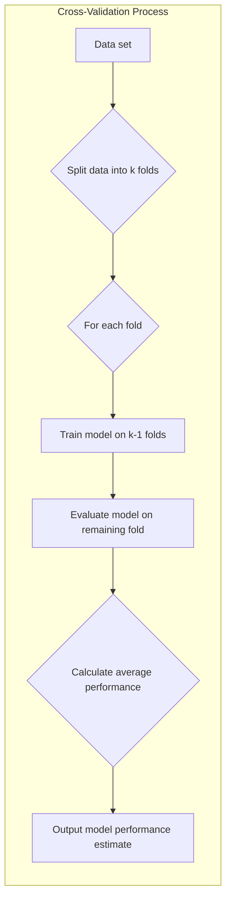
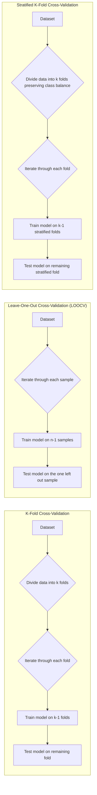
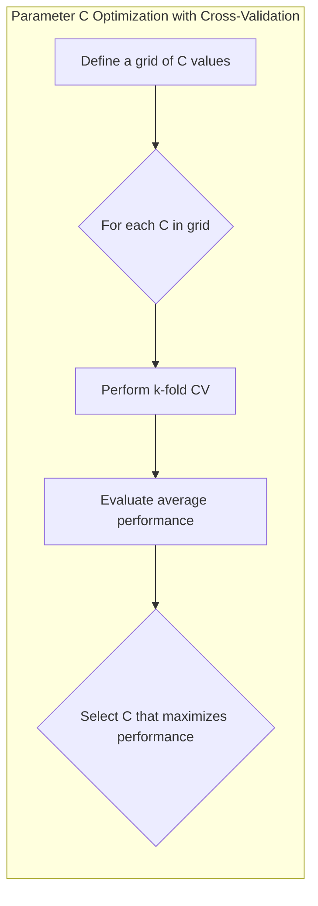
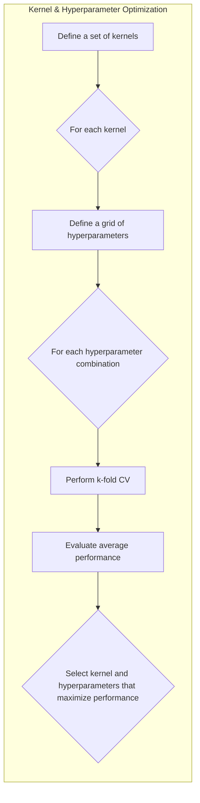

## Título: Validação Cruzada em SVMs: Avaliação e Ajuste de Parâmetros para Generalização Ótima

### Introdução

A **validação cruzada** é uma técnica essencial no aprendizado de máquina para avaliar o desempenho de um modelo em dados não vistos e para ajustar seus parâmetros de forma a maximizar a capacidade de generalização. No contexto das **Support Vector Machines (SVMs)**, a validação cruzada desempenha um papel fundamental na escolha do valor adequado do parâmetro de regularização **C** e de outros hiperparâmetros, como o tipo de *kernel* e seus parâmetros associados. Este capítulo explora em detalhe o processo de validação cruzada, como ele é aplicado às SVMs e como ele contribui para a obtenção de modelos com bom desempenho tanto nos dados de treinamento como em dados novos.

A validação cruzada permite estimar o desempenho de um modelo em dados não vistos, simulando o comportamento do modelo em um cenário de aplicação real. Essa técnica é particularmente útil em problemas com conjuntos de dados limitados, onde não há dados suficientes para separar um conjunto de treinamento, um de validação e um de teste. A validação cruzada também ajuda a identificar modelos que sofrem de *overfitting* ou *underfitting*, fornecendo uma medida mais precisa do desempenho do modelo em dados não vistos, auxiliando na escolha dos melhores parâmetros.

Neste capítulo, discutiremos os diferentes tipos de validação cruzada, como a validação cruzada k-fold, e como eles são aplicados no contexto das SVMs. Analisaremos como a validação cruzada é utilizada para escolher o valor apropriado do parâmetro C e de outros hiperparâmetros, e como essa escolha impacta a capacidade de generalização e a robustez do modelo SVM.

### O Conceito de Validação Cruzada

**Conceito 1: O Problema da Avaliação do Desempenho do Modelo**

Em aprendizado de máquina, um dos desafios principais é avaliar o desempenho de um modelo em dados não vistos. O desempenho de um modelo em dados de treinamento pode não ser um bom indicador de seu desempenho em dados novos, pois o modelo pode ter sofrido *overfitting*, ajustando-se demais ao ruído nos dados de treinamento, em vez de aprender os padrões subjacentes. Para evitar esse problema, é importante utilizar técnicas de avaliação que simulem o desempenho do modelo em dados não vistos.

A abordagem ideal seria utilizar um conjunto de dados de teste totalmente independente do conjunto de treinamento, mas em problemas com conjuntos de dados limitados, pode ser difícil separar um número suficiente de dados para treinamento e teste. Nesses casos, a validação cruzada oferece uma alternativa para avaliar o desempenho de um modelo de forma mais precisa.

> 💡 **Exemplo Numérico:**
> Imagine que você tem um conjunto de dados com 100 amostras. Se você treinar um modelo complexo (como uma SVM com um kernel RBF e muitos parâmetros) usando todas as 100 amostras, ele pode se ajustar perfeitamente a esses dados. No entanto, quando você apresentar novas amostras, o modelo pode ter um desempenho ruim devido ao overfitting. A validação cruzada ajuda a evitar isso.

**Lemma 1:** A avaliação do desempenho de um modelo apenas em dados de treinamento pode levar a uma avaliação otimista e enganosa, devido ao risco de *overfitting*, e a validação cruzada é uma técnica para obter uma avaliação mais precisa e confiável do desempenho do modelo em dados não vistos.

A demonstração desse lemma se baseia na análise da natureza do *overfitting*, que se manifesta quando o modelo se ajusta ao ruído e a particularidades do conjunto de treinamento, e, por isso, não consegue generalizar para novos dados. A avaliação do modelo usando apenas os dados de treinamento não revela a ocorrência de *overfitting*, enquanto a validação cruzada estima melhor o desempenho em dados não vistos.

**Conceito 2: O Processo de Validação Cruzada**

A **validação cruzada** é uma técnica que consiste em dividir os dados em diferentes partes, utilizando algumas partes para treinar o modelo e outras partes para avaliar o seu desempenho. O processo de validação cruzada envolve os seguintes passos:

1.  **Divisão dos Dados:** Os dados são divididos em $k$ partes, também chamadas de *folds*.
2.  **Treinamento e Teste:** Para cada uma das $k$ iterações, o modelo é treinado utilizando $k-1$ partes dos dados e avaliado utilizando a parte restante.
3.  **Avaliação do Desempenho:** O desempenho do modelo é avaliado em cada uma das $k$ iterações, e a média do desempenho é utilizada como uma estimativa do desempenho do modelo em dados não vistos.

Existem diferentes tipos de validação cruzada, como a **validação cruzada k-fold**, a **validação cruzada leave-one-out** e a **validação cruzada estratificada**. A escolha do tipo de validação cruzada depende das características do problema e do conjunto de dados.

> 💡 **Exemplo Numérico:**
> Com 100 amostras e usando k-fold com k=5, você divide seus dados em 5 partes de 20 amostras cada. Na primeira iteração, as partes 1, 2, 3 e 4 são usadas para treinar o modelo, e a parte 5 é usada para testar. Na segunda iteração, as partes 1, 2, 3 e 5 são usadas para treinar, e a parte 4 é usada para testar, e assim por diante.

**Corolário 1:** A validação cruzada estima o desempenho do modelo em dados não vistos, simulando o comportamento do modelo em um cenário de aplicação real, permitindo ajustar os parâmetros do modelo de forma a maximizar a generalização.

A demonstração desse corolário se baseia na descrição do processo de validação cruzada e como esse processo simula a avaliação do modelo em dados não vistos. A validação cruzada permite escolher os parâmetros que levam a uma melhor generalização do modelo.

### Tipos de Validação Cruzada

Existem diferentes tipos de validação cruzada que são utilizados dependendo do problema em mãos e do tamanho do conjunto de dados. Aqui estão alguns dos mais comuns:

1.  **Validação Cruzada K-Fold:** Os dados são divididos em $k$ partes (folds) de igual tamanho. Em cada uma das $k$ iterações, uma parte é utilizada como conjunto de teste, e as $k-1$ restantes são utilizadas como conjunto de treinamento. O desempenho do modelo é avaliado em cada iteração e a média dos resultados é utilizada como estimativa do desempenho geral. A escolha comum para o valor de $k$ é 5 ou 10, pois esses valores geralmente oferecem um bom equilíbrio entre viés e variância.

    > 💡 **Exemplo Numérico:**
    >  Para um dataset de 100 amostras e k=5:
    >  - Fold 1: Amostras 1-20 (Teste), Amostras 21-100 (Treino)
    >  - Fold 2: Amostras 21-40 (Teste), Amostras 1-20, 41-100 (Treino)
    >  - Fold 3: Amostras 41-60 (Teste), Amostras 1-40, 61-100 (Treino)
    >  - Fold 4: Amostras 61-80 (Teste), Amostras 1-60, 81-100 (Treino)
    >  - Fold 5: Amostras 81-100 (Teste), Amostras 1-80 (Treino)
    >  O modelo é treinado e avaliado 5 vezes, e a média do desempenho é usada como estimativa final.

2.  **Validação Cruzada Leave-One-Out (LOOCV):** Um caso especial da validação cruzada k-fold, onde $k$ é igual ao número de amostras. Em cada iteração, um único ponto é utilizado como conjunto de teste, e todos os demais pontos são utilizados como conjunto de treinamento. A LOOCV oferece uma estimativa precisa do desempenho do modelo, mas pode ser computacionalmente custosa em conjuntos de dados grandes, pois o modelo precisa ser treinado um número igual ao número de amostras.

    > 💡 **Exemplo Numérico:**
    > Se você tiver 100 amostras, LOOCV irá iterar 100 vezes. Na primeira iteração, a amostra 1 é usada para teste, e as amostras 2 a 100 para treino. Na segunda iteração, a amostra 2 é usada para teste, e as amostras 1 e 3 a 100 para treino, e assim por diante.

3.  **Validação Cruzada Estratificada:** É uma variação da validação cruzada k-fold onde as partes são criadas de forma a manter a mesma proporção de amostras de cada classe que existia no conjunto de dados original. Isso é importante para problemas com conjuntos de dados desbalanceados, onde uma classe tem um número muito menor de amostras do que outra classe, o que pode gerar estimativas enviesadas do desempenho do modelo.

    > 💡 **Exemplo Numérico:**
    > Imagine que você tem um conjunto de dados com 90 amostras da classe A e 10 amostras da classe B. Se usar k-fold padrão, um fold pode ter apenas amostras da classe A, resultando em uma avaliação ruim. A validação cruzada estratificada garante que cada fold tenha aproximadamente 90% de amostras da classe A e 10% da classe B.

A escolha do tipo de validação cruzada depende do tamanho do conjunto de dados, da necessidade de uma estimativa precisa do desempenho do modelo e dos recursos computacionais disponíveis. Para conjuntos de dados grandes, a validação cruzada k-fold com um valor de $k$ apropriado é geralmente suficiente. Para conjuntos de dados pequenos, a validação cruzada leave-one-out ou a validação cruzada estratificada podem ser mais apropriadas.

**Lemma 2:** A escolha do tipo de validação cruzada depende das características do conjunto de dados, da necessidade de uma estimativa precisa do desempenho do modelo e dos recursos computacionais disponíveis.

A demonstração desse lemma se baseia na análise das propriedades de cada tipo de validação cruzada e como elas diferem em termos de viés, variância e custo computacional.

### Validação Cruzada na Escolha do Parâmetro C nas SVMs

Um dos principais usos da validação cruzada em SVMs é a escolha do valor apropriado do parâmetro de regularização **C**. O parâmetro C controla o compromisso entre a maximização da margem e a penalidade por erros de classificação, e sua escolha influencia diretamente a complexidade do modelo e sua capacidade de generalizar.

O processo de validação cruzada para a escolha de $C$ pode ser feito da seguinte forma:

1.  **Definição de uma grade de valores para C:** Define-se uma série de valores para o parâmetro C que serão testados. Essa grade pode ser definida de forma linear ou logarítmica.
2.  **Validação Cruzada:** Para cada valor de $C$ na grade, o modelo SVM é treinado e avaliado utilizando validação cruzada, gerando uma estimativa do desempenho do modelo em dados não vistos.
3.  **Escolha do Valor Ótimo de C:** O valor de $C$ que maximiza o desempenho médio na validação cruzada é escolhido como o valor apropriado para o modelo.

> 💡 **Exemplo Numérico:**
> Suponha que você queira testar os seguintes valores de C: [0.1, 1, 10, 100].
>
> 1.  Para C=0.1, você faz validação cruzada k-fold (por exemplo, k=5) e obtém uma acurácia média de 70%.
> 2.  Para C=1, você faz validação cruzada k-fold e obtém uma acurácia média de 85%.
> 3.  Para C=10, você faz validação cruzada k-fold e obtém uma acurácia média de 90%.
> 4.  Para C=100, você faz validação cruzada k-fold e obtém uma acurácia média de 88%.
>
> Neste caso, você escolheria C=10, pois ele forneceu a melhor performance média na validação cruzada.

O processo de validação cruzada permite escolher um valor de $C$ que leva a um bom equilíbrio entre viés e variância, resultando em um modelo com boa capacidade de generalização. A escolha de um valor inadequado de $C$ pode levar a *overfitting* (para valores altos de $C$) ou *underfitting* (para valores baixos de $C$), prejudicando a performance do modelo em dados novos.

**Lemma 3:** A validação cruzada é utilizada para escolher o valor apropriado do parâmetro C em SVMs, levando a modelos com melhor capacidade de generalização para dados não vistos.

A demonstração desse lemma se baseia na análise do funcionamento da validação cruzada e como ela estima a performance do modelo com dados não vistos, o que permite a escolha dos melhores parâmetros de forma mais robusta, evitando a escolha de parâmetros baseada no desempenho no conjunto de treinamento, que pode levar a *overfitting*.

### Validação Cruzada e a Escolha do Kernel e Outros Hiperparâmetros

Além da escolha do parâmetro $C$, a validação cruzada também pode ser utilizada para selecionar o tipo de *kernel* mais apropriado e seus hiperparâmetros associados. A escolha do *kernel* (linear, polinomial, RBF, sigmoide, etc.) e seus parâmetros (como grau do polinômio, a largura do RBF, ou outros) têm um impacto significativo na performance das SVMs, e a escolha ideal depende das características do conjunto de dados.

O processo de validação cruzada para escolha do kernel e seus hiperparâmetros é similar ao processo de escolha de C. Uma grade de valores para os hiperparâmetros do *kernel* é definida, e para cada valor na grade, o modelo é treinado e avaliado com validação cruzada. O modelo que maximiza a performance nos dados de validação é escolhido como modelo final.

> 💡 **Exemplo Numérico:**
> Imagine que você quer comparar os kernels 'linear', 'rbf' e 'poly'.
> 1. Para o kernel 'linear', você executa validação cruzada com diferentes valores de C (como no exemplo anterior) e encontra uma acurácia média de 80%.
> 2. Para o kernel 'rbf', você também ajusta o parâmetro C e o parâmetro gamma (por exemplo, com valores 0.1, 1 e 10) para cada C, executa validação cruzada para todas as combinações, e encontra uma acurácia média máxima de 92%.
> 3. Para o kernel 'poly', você ajusta o parâmetro C e o grau do polinômio (por exemplo, 2, 3, 4), executa validação cruzada para todas as combinações, e encontra uma acurácia média máxima de 88%.
>
> Neste caso, você escolheria o kernel 'rbf' com os melhores parâmetros encontrados por validação cruzada, pois ele teve o melhor desempenho.

Em resumo, a validação cruzada é uma técnica fundamental para a construção de modelos SVM robustos e com boa capacidade de generalização. A escolha apropriada do tipo de validação cruzada, juntamente com o ajuste dos hiperparâmetros do modelo, é crucial para o sucesso das SVMs em aplicações práticas.

**Corolário 3:** A validação cruzada permite escolher o *kernel* mais apropriado e seus hiperparâmetros associados, além de otimizar o parâmetro C, levando a modelos SVM mais eficientes e com melhor desempenho em dados não vistos.

A demonstração desse corolário envolve a análise da aplicação da validação cruzada a diferentes *kernels* e seus hiperparâmetros, demonstrando que a validação cruzada permite encontrar a configuração de parâmetros que melhor se adapta aos dados, levando a uma melhor capacidade de generalização.

### Conclusão

Neste capítulo, exploramos em detalhe o conceito de **validação cruzada** e como essa técnica é utilizada para avaliar e ajustar os parâmetros das **Support Vector Machines (SVMs)**. Vimos como a validação cruzada permite estimar o desempenho de um modelo em dados não vistos, o que é crucial para a construção de modelos robustos e com boa capacidade de generalização.

Apresentamos diferentes tipos de validação cruzada, como a validação cruzada k-fold, a validação cruzada leave-one-out e a validação cruzada estratificada, e discutimos como a escolha do tipo de validação cruzada depende das características do conjunto de dados. Analisamos o papel da validação cruzada na escolha do parâmetro de regularização C, do *kernel* apropriado e seus hiperparâmetros, demonstrando como a validação cruzada permite evitar o *overfitting* e obter modelos com bom desempenho em dados novos.

A validação cruzada é uma ferramenta fundamental para a aplicação bem-sucedida das SVMs e outros métodos de aprendizado de máquina. A compreensão dos princípios da validação cruzada e sua aplicação prática é essencial para a construção de modelos com alta capacidade de generalização e estabilidade.

### Footnotes

[^12.1]: "In this chapter we describe generalizations of linear decision boundaries for classification. Optimal separating hyperplanes are introduced in Chapter 4 for the case when two classes are linearly separable. Here we cover extensions to the nonseparable case, where the classes overlap. These techniques are then generalized to what is known as the support vector machine, which produces nonlinear boundaries by constructing a linear boundary in a large, transformed version of the feature space."

[^12.2]: "In Chapter 4 we discussed a technique for constructing an optimal separating hyperplane between two perfectly separated classes. We review this and generalize to the nonseparable case, where the classes may not be separable by a linear boundary."
